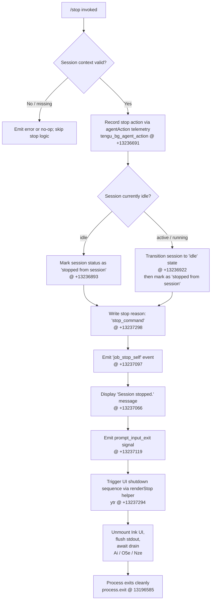

# `/stop`

> Analysis basis: CC v2.1.191 bundle.js (AST extraction + Claude interpretation)
> Minimum version: v2.1.191

---

## Overview

The `/stop` command terminates the currently running background session. It signals the session to halt, emits a stop telemetry event, and then cleanly unwinds the UI — but intentionally preserves both the session transcript and any associated git worktree for later review or resumption. The command is registered as a `local-jsx` type and executes immediately upon invocation without requiring further user confirmation.

---

## Registration

| Field | Value |
|---|---|
| type | `local-jsx` |
| name | `stop` |
| description | `Stop this background session; transcript and worktree are kept` |
| loc_byte | `13237565` |
| loc_byte_end | `13237749` |
| loc_line | `9024` |
| immediate | `true` |
| module_id | `YVl` |
| load_inline | `true` |
| arbor_handler.name | `iUf` |
| arbor_handler.fqn | `claude-2.1.191::iUf` |
| arbor_handler.kind | `AsyncFunction` |
| arbor_handler.resolution_path | `module_id` |
| arbor_handler.n_hits | `0` |

Analysis basis: CC v2.1.191 bundle.js:+13237565

---

## Input Branching

The handler has two primary decision paths based on the current session state, plus a UI teardown sequence. A Mermaid flowchart is used because there are three or more distinct branches.



Analysis basis: CC v2.1.191 bundle.js:+13237284, +13237294, +13237298, +13236893, +13236922

---

## Behavioral Spec

### 1. Handler Entry — `stopCommandHandler` (`iUf`)

The async handler `iUf` is the primary entry point resolved via `module_id → YVl`.

```
async function stopCommandHandler(context):
    // Record the stop-command telemetry action
    emit telemetry "tengu_bg_agent_action" with action="stop_command"

    // Call sessionStopper (e) which coordinates the full stop sequence
    await sessionStopper(context)

    // Render stop UI via renderStop helper (ytr)
    renderStop(context)
```

Analysis basis: CC v2.1.191 bundle.js:+13237284, +13237294

---

### 2. Session Stop Coordinator — `sessionStopper` (`e`)

Receives the session context and orchestrates the state machine transition and transcript finalization.

```
async function sessionStopper(context):
    // Build a compact transcript summary via transcriptSummarizer (L6o)
    summary = transcriptSummarizer(context.messages, maxItems=30)

    // Map over pending tool calls, finalize or cancel them (o.map)
    finalizedToolMap = context.toolResults.map(finalizeToolResult)

    // Capture current timestamp for session metadata
    endTime = Date.now()

    // Invoke session finalizer (wN) to write session state
    await sessionFinalizer(context, summary, finalizedToolMap, endTime)

    // Build and persist classification context tip (S4 / usm / hsm paths)
    await contextTipWriter(context)

    // Mark session as stopped (dsm path)
    context.session.status = "stopped from session"   // literal @ +13236893
```

Analysis basis: CC v2.1.191 bundle.js:+16670698, +16670740, +16670769, +16670796, +16670837, +16670960, +16671416

---

### 3. Transcript Summarizer — `transcriptSummarizer` (`L6o`)

Reduces the raw message list to a compact representation for persistence.

```
function transcriptSummarizer(messages, maxItems=30):
    // Slice to the most recent maxItems messages (literal 30 @ +16668949)
    recent = messages.slice(-maxItems)

    // Walk each message; keep only "user" and "assistant" roles
    // (literals @ +16668982, +16668999)
    filtered = recent.filter(m => m.role in ["user", "assistant"])

    // For messages containing tool_result blocks, truncate content
    // at 1000 chars (literal @ +16669144) and append " (error)" suffix
    // when applicable (literal @ +16669486)
    for msg in filtered:
        if msg.type == "tool_result":   // literal @ +16669266
            msg.content = truncateContent(msg.content, limit=1000)
        if msg.type == "tool_use":      // literal @ +16669676
            // pad tool label to 300 chars (literal @ +16669651)
            msg.label = msg.label.padEnd(300)

    // Produce auto-classifier input for the context tip subsystem
    classifierInput = toAutoClassifierInput(filtered)

    // Join result lines
    return filtered.join("\n")
```

Analysis basis: CC v2.1.191 bundle.js:+16668916, +16668940, +16668949, +16668982, +16668999, +16669122, +16669144, +16669206, +16669266, +16669424, +16669651, +16669676, +16669687, +16669749, +16669769

---

### 4. Session Finalizer / API Wrapper — `sessionFinalizer` (`wN`)

Writes the finalized session state to disk and (if applicable) dispatches a side-query API call.

```
async function sessionFinalizer(context, summary, toolMap, endTime):
    // Resolve the API client config (oW path — the large session config builder)
    apiConfig = buildApiConfig(context)

    // If a side_query flag is set (literal "side_query" @ +8937327),
    // issue an async side-query using structured outputs
    // (literal "structured_outputs" @ +8937455)
    if apiConfig.sideQuery:
        await dispatchSideQuery(apiConfig)

    // Hash session ID with SHA-256 (literal "sha256" @ +8936332, "hex" @ +8936359)
    hashedId = sha256hex(context.sessionId)

    // Write finalized session state file
    await writeSessionState(hashedId, summary, endTime)

    // Sanitize lone surrogates in transcript
    // (tengu_lone_surrogate_sanitized telemetry @ +8938694)
    cleanTranscript = sanitizeLoneSurrogates(transcript)

    // Emit API success telemetry
    // (tengu_api_success @ +8938998)
    emit "tengu_api_success"
```

Analysis basis: CC v2.1.191 bundle.js:+8937282, +8937295, +8937327, +8937388, +8937429, +8937441, +8937449, +8937455, +8937484, +8937499, +8937516, +8937525, +8938021, +8938295, +8938311, +8938694, +8938970, +8938983, +8938998

---

### 5. UI Render-Stop Helper — `renderStopHelper` (`ytr`)

Coordinates the terminal UI teardown after the session is marked stopped.

```
function renderStopHelper(context):
    // Display the "Session stopped." confirmation message (literal @ +13237066)
    displayMessage("Session stopped.")

    // Emit prompt_input_exit to signal the REPL to stop accepting input
    // (literal @ +13237119)
    emit "prompt_input_exit"

    // Read current worktree file state (Bi — worktree state reader)
    worktreeState = readWorktreeState(context.worktreePath)

    // Open/close background session tracking entries (bh / $x / Vae)
    updateSessionRegistry(context.sessionId, status="stopped")

    // Write final state order metadata (literals "order"/"stateOrder" @ +4282082, +4282103)
    writeStateOrder(worktreeState)

    // Trigger async UI unmount via mountedAppStopper (Ai)
    await unmountApp(context)
```

Analysis basis: CC v2.1.191 bundle.js:+13236689, +13236723, +13236741, +13236760, +13236763, +13236777, +13236786, +13236834, +13236847, +13236859, +13237035, +13237062, +13237066, +13237094, +13237114, +13237119

---

### 6. App Unmount / Process Exit — `mountedAppStopper` (`Ai`)

Handles ink UI unmount, stdout drain, and final process exit.

```
async function mountedAppStopper(context):
    // Write final output frame via writeSync (O5e)
    flushFinalFrame()

    // Drain stdout queue (Nze → xqo.drain @ +67605)
    await drainStdout()

    // Race: app timeout (5000 ms @ +7345580) vs graceful shutdown (3500 ms @ +7345587)
    result = await Promise.race([
        gracefulShutdown(timeout=3500),
        hardTimeout(5000)
    ])

    // After 2000 ms idle (literal @ +7345765), kill with SIGKILL if needed
    // (literal "SIGKILL" @ +7343198)
    if result == "timeout":
        process.kill(pid, "SIGKILL")

    // Emit session_end telemetry (literal @ +7345977)
    emit "session_end"

    // Emit tengu_cache_eviction_hint telemetry (@ +7345939)
    emit "tengu_cache_eviction_hint"

    // Startup profiling report if applicable (tengu_startup_perf @ +226810)
    if profilingEnabled:
        emit "tengu_startup_perf"

    // Exit process with code 0 (process.exit @ +13196585)
    process.exit(0)
```

Analysis basis: CC v2.1.191 bundle.js:+7342483, +7342561, +7342771, +7343067, +7343100, +7343148, +7343173, +7343198, +7345483, +7345534, +7345551, +7345557, +7345563, +7345571, +7345580, +7345587, +7345596, +7345676, +7345700, +7345754, +7345765, +7345777, +7345825, +7345848, +7345865, +7345901, +7345914, +7345926, +7345937, +7345939, +7345974, +7345977

---

### 7. Error / CLI Exit Path — `cliErrorExit` (`Cs`)

Handles abnormal exits that may be triggered if the stop sequence encounters an unrecoverable error.

```
function cliErrorExit(errorContext):
    // Emit "cli_error" typed data (literal @ +13196572)
    emitData({ type: "cli_error", ...errorContext })

    // Call pre-exit finalizers (nqe, fT)
    runPreExitHooks()
    flushTelemetrySync()

    // Exit with code 1 (literal @ +13196598)
    process.exit(1)
```

Analysis basis: CC v2.1.191 bundle.js:+13196562, +13196569, +13196572, +13196585, +13196598

---

## State & Side Effects

| Item | Detail |
|---|---|
| Telemetry: `tengu_bg_agent_action` | Fired at stop entry with `action="stop_command"` (bundle.js:+13236691) |
| Telemetry: `tengu_api_success` | Fired after session state is successfully written (bundle.js:+8938998) |
| Telemetry: `tengu_lone_surrogate_sanitized` | Fired if lone UTF-16 surrogates are found in the transcript (bundle.js:+8938694) |
| Telemetry: `tengu_context_tip_classifier_outcome` | Fired with outcome label after context-tip classification (bundle.js:+16672225) |
| Telemetry: `tengu_cache_eviction_hint` | Fired during UI teardown (bundle.js:+7345939) |
| Telemetry: `tengu_session_end` | Fired via `session_end` literal at process exit (bundle.js:+7345977) |
| Telemetry: `tengu_startup_perf` | Conditionally fired if startup profiling was active (bundle.js:+226810) |
| Telemetry: `tengu_bg_retire_*`, `tengu_bg_prewarm_*` | Background worker sweep events that may co-fire during teardown (bundle.js:+17375231, +17375352) |
| Session status change | `context.session.status` is set to `"stopped from session"` (literal @ +13236893) |
| Session idle transition | Active sessions are driven to `"idle"` state (literal @ +13236922) before being marked stopped |
| Transcript preserved | Transcript and worktree path are NOT deleted; only the running process is stopped |
| Worktree preserved | Worktree files remain intact after `/stop` (per registration description) |
| `prompt_input_exit` signal | Emitted to the REPL to halt further input processing (literal @ +13237119) |
| UI unmount | Ink component tree is unmounted via `e.unmount()` (bundle.js:+7342561) |
| stdout drain | stdout queue is drained via `xqo.drain` before process exit (bundle.js:+67605) |
| `process.exit(0)` | Clean exit after graceful teardown (bundle.js:+13196585) |
| `process.exit(1)` | Error exit via `cliErrorExit` if stop sequence fails (bundle.js:+13196598) |
| SIGKILL fallback | If graceful shutdown exceeds timeout, `process.kill(pid, "SIGKILL")` is used (bundle.js:+7343173, +7343198) |
| Hook registration | `immediate: true` — no hook registration delay; command fires synchronously on match |
| Sound | <!-- TODO: not found in depth-2 traversal; needs --depth 4 --> |

---

## Version History

| Version | Change |
|---|---|
| v2.1.191 | Initial analysis |

---

## Common Mistakes

1. **Expecting the worktree to be deleted**: `/stop` explicitly preserves both the transcript and worktree. To clean up a worktree, a separate command or manual action is required.
2. **Confusing `/stop` with a full process kill**: `/stop` performs a graceful shutdown sequence including state persistence, telemetry flush, and stdout drain before exiting. A hard kill bypasses all of this.
3. **Invoking `/stop` outside a background session context**: The command is designed for background (`bg`) sessions. Invoking it in a foreground interactive session may result in a no-op or unexpected behavior since the session state machine expects a background context.
4. **Assuming the command is synchronous**: Although `immediate: true` triggers execution without a prompt, the underlying handler (`iUf`) is an `AsyncFunction` — the full teardown involves async I/O, promise races, and drain operations.
5. **Expecting instant terminal return**: The UI teardown races a 5000 ms hard timeout against a 3500 ms graceful window. Under heavy I/O load the process may take up to 5 seconds to fully exit.

---

## Appendix — Identifier Mapping

> For bundle debugging only. Identifiers change across versions.

| Identifier | Role |
|---|---|
| `iUf` | Stop command handler (AsyncFunction) — main entry point |
| `e` | Session stop coordinator — orchestrates state transition and transcript finalization |
| `L6o` | Transcript summarizer — reduces message list to compact form |
| `gsm` | Map state setter — updates internal map during transcript build |
| `Cs` | CLI error exit handler — emits `cli_error` and calls `process.exit(1)` |
| `har` | Tool-result content helper — processes tool content blocks |
| `hx` | Character-level content slicer — handles Unicode surrogate pairs |
| `msm` | Auto-classifier input builder — converts messages to classifier format |
| `ke` | JSON serializer wrapper around `JSON.stringify` |
| `wN` | Session finalizer / API client coordinator |
| `xf` | API transport initializer |
| `wt` | Low-level HTTP write transport |
| `oW` | Large API config builder — constructs full session API configuration |
| `mz` | Config module initializer |
| `p3r` | Header parser — splits, trims, and indexes HTTP header lines |
| `Ks` | OAuth credential store accessor |
| `Mz` | Error/issue reporter builder |
| `GPr` | URL encoder — applies `encodeURIComponent` to path segments |
| `T` | Debug/log level formatter |
| `rt` | String coercion utility |
| `Ng` | OAuth token refresher |
| `XKs` | Boolean coercion utility |
| `_y` | Auth environment resolver — checks `ANTHROPIC_API_KEY` and helpers |
| `_ud` | API key helper invoker |
| `Kdn` | Proxy auth helper — checks workspace trust and invokes proxy credentials |
| `Iud` | Request context builder — assigns UUIDs, content-type, and streaming headers |
| `PH` | Mantle (bedrock/gateway) auth handler |
| `G2` | Provider-specific initializer |
| `fy` | API response stream processor |
| `Tud` | Streaming response finalizer |
| `yud` | Provider routing logic (anthropicAws / vertex / foundry / gateway / firstParty) |
| `SCe` | Session cache / promise coordinator |
| `Rdr` | Request duration recorder |
| `pMt` | Header normalizer — lowercases all header keys |
| `dve` | SDK error logger |
| `BSn` | Auth token builder |
| `D` | Stream output writer with supervisor/error branching |
| `x` | Session registry map manager — get/set/delete with timestamp |
| `v` | Focus/blur state tracker with backoff (3 600 000 ms window, 0.8 factor) |
| `Ooe` | Platform prefix resolver — maps agent IDs to start-with patterns |
| `nv` | Node version checker |
| `yA` | OAuth user profile resolver |
| `ACe` | WIF token exchange handler |
| `TZe` | WIF credentials resolver — uses `fetch` with `AbortSignal.timeout` (10 000 ms) |
| `I` | Token pagination / floor calculator |
| `h` | Stream handler stub |
| `b2e` | Model capability checker (claude-3-*, claude-opus-4-0, claude-sonnet-4-0) |
| `ao` | Inference-profile model resolver |
| `o1` | Response wrapper |
| `lie` | Foundry resource ID resolver |
| `vOr` | Foundry URL rewriter |
| `_` | Active session map accessor |
| `a` | Session value getter with T formatter |
| `CBp` | Model-list searcher |
| `SHo` | SHA-256 session ID hasher |
| `Ghn` | User-agent string builder |
| `ol` | String builder utility |
| `_r` | Render/format primitive |
| `uu` | User-agent component assembler |
| `$hn` | Async-local-storage store reader (`YKs.getStore`) |
| `hCe` | HTTP cache-control header builder |
| `aIn` | Abort signal integrator |
| `aje` | Main REPL thread context builder |
| `To` | Thread descriptor constructor |
| `dpr` | Debug profiler reference |
| `nt` | Worker/agent instance factory |
| `ppr` | Profiler proxy |
| `wD` | Worker descriptor builder |
| `C3r` | Worker config resolver |
| `A2e` | Worker render adapter |
| `L` | Background worker sweep — manages retire/respawn/prewarm cycle |
| `V` | Worker pool controller (shiftGraceClocksForward, respawnIfIdleStale, retireIfSettled) |
| `Nzt` | Memory monitor — reads `os.freemem()` |
| `J8l` | Grace clock bridge |
| `I3e` | Temp file cleaner — uses `fs.lstat`, `fs.rm`, `fs.readFile` |
| `Le` | Log error emitter — calls `GQ.logError` |
| `Gn` | Worker garbage collector |
| `W` | UI state/store accessor |
| `j` | Worker retire-if-settled invoker |
| `Xer` | Worker attach-upgrade tracker (tengu_bg_attach_upgrade) |
| `q` | Prewarm worker controller |
| `ZVa` | Session zip/archive helper |
| `sp` | Path sanitizer — applies regex replacements |
| `XSn` | Temperature-override resolver |
| `av` | Argument mapper |
| `Txe` | Tool execution context builder |
| `P4` | Random-bytes token generator (32 bytes) |
| `Sc` | Tool scope validator |
| `etn` | Message structure normalizer (pop/push with Array.isArray guard) |
| `Qen` | Message validator |
| `iD` | Deep clone via `structuredClone` |
| `u7e` | Alternate message normalizer |
| `Zen` | Replacement string processor |
| `Ve` | Render element factory |
| `eze` | Base render primitive |
| `LOr` | OAuth response parser |
| `l7s` | OAuth scope validator — tests regex patterns against scope strings |
| `wOr` | OAuth token cache — get/set with `has` guard |
| `mbe` | Metrics batch emitter |
| `Tr` | Terminal/TTY stream selector |
| `lh` | Terminal output helper |
| `Oo` | Overflow/truncation renderer |
| `H1t` | Startup profiler |
| `v3i` | Profiling segment recorder |
| `Rot` | Profiling log writer |
| `h1t` | Profiling phase coordinator |
| `NF` | Agent namespace resolver |
| `nOd` | Agent ID decoder (builtin/custom/bare prefixes) |
| `xD` | Thread-type prefix checker (`repl_main_thread`) |
| `kAt` | Cache-control pragma builder |
| `S4` | Context-tip classifier invoker |
| `ev` | Event emitter base |
| `PPr` | Schema parse runner |
| `zp` | Zod parse pipeline |
| `usm` | Context classifier upstream builder |
| `csm` | Message content mapper |
| `hsm` | Header/summary builder — push then join |
| `M6n` | Tool-use block finder |
| `cSt` | Context tip state writer |
| `Pe` | Passive render element |
| `Re` | Re-render trigger |
| `D6n` | Safe-parse dispatcher |
| `we` | Render element with content |
| `Ae` | String coercion element |
| `ytr` | Render-stop helper — displays "Session stopped." and emits `prompt_input_exit` |
| `sUf` | Stop UI sub-renderer |
| `Bi` | Worktree state reader — checks `fs.lstat`, `fs.readFile`, `Number.isFinite` |
| `d` | Background session daemon controller — stop/updateConfig/start cycle |
| `YVe` | File stat checker — `fs.stat`, ENOENT guard, 1 048 576 byte limit |
| `yWl` | Column-width formatter for worktree table |
| `E` | Daemon connection manager — connected/failed states |
| `A` | Daemon lifecycle controller (U2t/vSt stop, updateConfig, start) |
| `h0c` | Heartbeat initiator |
| `u` | Daemon stop dispatcher — emits `daemon_stop` / `daemon_stop_failed` |
| `pF` | Stop request sender |
| `BG` | Stop race coordinator — `Promise.race` with 500 ms exit timeout, then `process.exit` |
| `vn` | Directory node helper |
| `dn` | Directory node primitive |
| `Gd` | Worktree directory display helper |
| `$t` | JSON file parser (`JSON.parse`) |
| `bh` | Session registry state reader (`$x`) |
| `$x` | Session state file accessor (`Vae`) |
| `Vae` | Session state machine enum (done/success/failure/stopped/active) |
| `Od` | Session file writer — path join, `ke` serializer, file rename |
| `Rm` | Atomic file writer — random bytes temp name, `writeFile` → `rename` |
| `by` | Session cache entry deleter |
| `Jhn` | Post-stop notification helper |
| `Hde` | "Session stopped." display component |
| `Ai` | Mounted app stopper — unmount Ink, drain stdout, race timeouts, exit |
| `O5e` | Final frame flusher — `writeSync` + `Su.get` + `unmount` |
| `IF` | Ink frame finalizer |
| `Pvn` | Terminal restore writer — emits ESC-7 / ESC-8 sequences |
| `xao` | Summary renderer — replaces `\\` and `\"` in output |
| `Aw` | Async write helper |
| `R9` | Render result collector |
| `e3t` | Startup config stat checker (`r.statSync`) |
| `yg` | File-watcher stop helper |
| `zCa` | Scroll summary position recorder |
| `Rao` | Timeout kill handler — `clearTimeout`, `process.exit`, `process.kill` with SIGKILL |
| `Nze` | Stdout drain awaiter (`xqo.drain`) |
| `iva` | Pending-promise settler (`Promise.allSettled` + `Array.from`) |
| `TTt` | Startup profiling report printer |
| `hmr` | Profiling mark emitter |
| `P7o` | Profiling report serializer (`JSON.stringify`, `STt.dirname`) |
| `fUn` | Scroll/frame summary writer (tengu_scroll_summary) |
| `KCa` | Scroll capture helper |
| `qCa` | Frame metrics calculator (`Date.now`, `Math.max`, `Math.round`, `Object.assign`) |
| `ks` | REPL kernel / main loop — local-agent, fullscreen detection, tengu_pewter_brook |
| `xAt` | Exit-after-stop flag checker |
| `U5e` | Unmount promise wrapper (`cUn`) |
| `cUn` | Unmount completion resolver |

---

Note: index built via Arbor fallback; some signals (telemetry, literals) may be missing — see arbor-fallback.js.