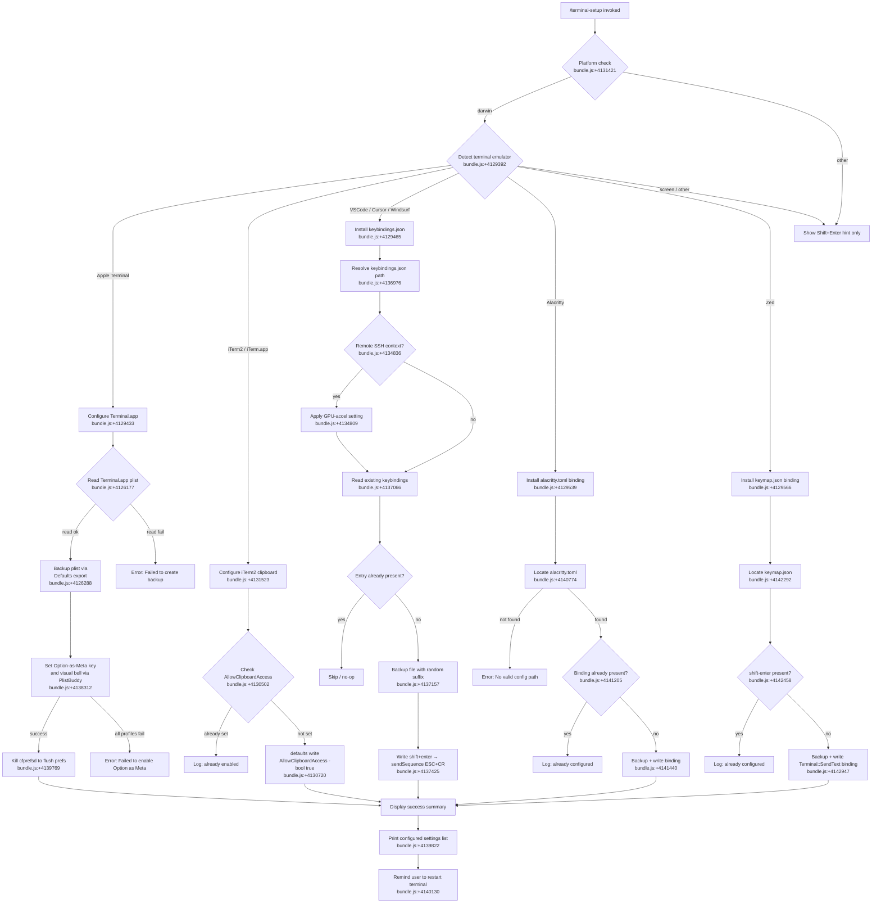

# `/terminal-setup`

> Analysis basis: CC v2.1.191 bundle.js (AST extraction + Claude interpretation)
> Minimum version: v2.1.191

---

## Overview

`/terminal-setup` installs terminal-specific key bindings and settings that enable Shift+Enter to insert a newline instead of submitting input. The command detects the active terminal emulator and platform, then modifies the appropriate configuration file or system preference store for that environment. On macOS it additionally configures Apple Terminal.app and iTerm2 clipboard and bell settings.

---

## Registration

| Field | Value |
|---|---|
| type | `local-jsx` |
| name | `terminal-setup` |
| description | Install Shift+Enter key binding for newlines |
| loc_byte | 12519426 |
| loc_byte_end | 12520058 |
| loc_line | 8385 |
| module_id | `P$i` |
| load_inline | `true` |
| arbor_handler.name | `NMd` |
| arbor_handler.fqn | `claude-2.1.191::NMd` |
| arbor_handler.kind | `AsyncFunction` |
| arbor_handler.resolution_path | `module_id` |
| arbor_handler.n_hits | 1 |

Analysis basis: CC v2.1.191 bundle.js:+12519426

---

## Input Branching

The command branches across 6+ terminal emulator families, 2 platform checks, and multiple fallback paths — a Mermaid flowchart is required.



---

## Behavioral Spec

### 1. Handler Entry Point (`NMd`)

The Arbor-resolved handler `NMd` is an `AsyncFunction` reached via `module_id` resolution (`P$i`).

```
async function terminalSetupHandler(context):
    platform = detectPlatform()          // Pee.platform — bundle.js:+4131421
    terminalApp = detectTerminalApp()    // f3e — bundle.js:+4131969

    // Show informational hint regardless of terminal
    printNote("Note: You can already use backslash + return to add newlines.")
    // bundle.js:+4132415

    if platform != "darwin":             // bundle.js:+4129409
        printNote("Note: iTerm2, WezTerm, Ghostty, Kitty, Warp, and Windows Terminal support Shift+Enter natively.")
        // bundle.js:+4132755
        return

    // macOS path
    setupResult = runSetupForTerminal(terminalApp, context)
    // dispatches to per-terminal routines — bundle.js:+4131618
    printSetupSummary(setupResult)
```

Analysis basis: CC v2.1.191 bundle.js:+4131421

---

### 2. Terminal Detection (`f3e`)

```
function detectTerminalApp():
    return Pee.platform() and env inspection   // bundle.js:+4129392

// Recognized values (literals):
//   "Apple_Terminal"  bundle.js:+4129433
//   "vscode"          bundle.js:+4129465
//   "cursor"          bundle.js:+4129489
//   "windsurf"        bundle.js:+4129513
//   "alacritty"       bundle.js:+4129539
//   "zed"             bundle.js:+4129566
//   "iTerm.app"       bundle.js:+4131523
//   "screen"          bundle.js:+4131572
```

Analysis basis: CC v2.1.191 bundle.js:+4129392

---

### 3. Remote / Server Context Detection (`zwn`)

The command checks whether it is running inside a remote-server environment by looking for known server directory markers in the home path.

```
function isRemoteServerContext(homePath):
    if homePath.includes(".vscode-server"):   return true   // bundle.js:+4128922
    if homePath.includes(".cursor-server"):   return true   // bundle.js:+4128952
    if homePath.includes(".windsurf-server"): return true   // bundle.js:+4128982
    if homePath.includes(".devin-server"):    return true   // bundle.js:+4129014
    return false
```

Analysis basis: CC v2.1.191 bundle.js:+4128911

---

### 4. Apple Terminal.app Configuration (`FMd`)

```
async function configureAppleTerminal(plistPath):
    // plistPath = ~/Library/Preferences/com.apple.Terminal.plist
    //   bundle.js:+4126153, +4126163, +4126177

    // Step 1: Export current plist as backup via `defaults export`
    //   command: ["defaults", "export", "com.apple.Terminal", <backupPath>]
    //   bundle.js:+4126276, +4126288, +4126297
    backupOk = runBackup(plistPath)
    if not backupOk:
        throw Error("Failed to create backup of Terminal.app preferences, bailing out")
        // bundle.js:+4139085

    // Step 2: Read default window settings profile name
    profileName = readPlistKey("Default Window Settings")  // bundle.js:+4139223
    if readFailed:
        throw Error("Failed to read default Terminal.app profile")  // bundle.js:+4139283

    // Step 3: Read startup settings profile
    startupProfile = readPlistKey("Startup Window Settings")  // bundle.js:+4139400
    if readFailed:
        throw Error("Failed to read startup Terminal.app profile")  // bundle.js:+4139460

    // Step 4: For each profile, call PlistBuddy to set keys
    //   binary: /usr/libexec/PlistBuddy  bundle.js:+4138312
    //   flag:   -c                       bundle.js:+4138339
    //   Sets "Option as Meta" and visual bell on profiles [0..27]
    //   (exit codes 0 and 27 checked)     bundle.js:+4139046, +4139050
    successCount = 0
    for profile in [defaultProfile, startupProfile, ...]:
        ok = plistBuddySet(profile, "UseOptionAsMetaKey", true)
        ok &= plistBuddySet(profile, "VisualBell", true)
        if ok: successCount++

    if successCount == 0:
        throw Error("Failed to enable Option as Meta key or disable audio bell for any Terminal.app profile")
        // bundle.js:+4139670

    // Step 5: Kill cfprefsd to flush preference cache
    runCommand(["killall", "cfprefsd"])   // bundle.js:+4139769, +4139780

    return {
        metaEnabled: true,   // "- Enabled \"Use Option as Meta key\""  bundle.js:+4139889
        visualBell:  true,   // "- Switched to visual bell"             bundle.js:+4139951
        newlineNote: "Shift+Return will now enter a newline."           // bundle.js:+4139996
    }
```

Analysis basis: CC v2.1.191 bundle.js:+4139039

---

### 5. iTerm2 / D$i Configuration

```
async function configureITerm2():
    // Check AllowClipboardAccess via `defaults read com.googlecode.iterm2`
    //   bundle.js:+4130478, +4130502
    existing = runDefaults("read", "com.googlecode.iterm2", "AllowClipboardAccess")

    if existing == "1" or existing == true:
        log("iTerm2 clipboard access already enabled")  // bundle.js:+4130577
        return

    result = runDefaults("write", "com.googlecode.iterm2", "AllowClipboardAccess", "-bool", "true")
    //   bundle.js:+4130665, +4130720

    if result.failed:
        warn("Couldn't update iTerm2 clipboard setting.")   // bundle.js:+4130771
        return

    log("Enabled \"Applications in terminal may access clipboard\" in iTerm2")
    // bundle.js:+4130862
    log("Restart iTerm2 for this to take effect. Undo: defaults write com.googlecode.iterm2 AllowClipboardAccess -bool false")
    // bundle.js:+4130945
```

Analysis basis: CC v2.1.191 bundle.js:+4130456

---

### 6. VSCode / Cursor / Windsurf `keybindings.json` (`PVr`)

```
async function configureVSCodeFamily(terminalType):
    // Detect remote SSH to decide whether to also set GPU acceleration
    //   bundle.js:+4134836
    isRemote = isRemoteServerContext(os.homedir())

    keybindingsPath = resolveKeybindingsPath()  // kF.join — bundle.js:+4136966
    // keybindings.json  bundle.js:+4136976

    content = await fs.readFile(keybindingsPath, "utf-8")   // bundle.js:+4137066, +4137090
    if content missing: content = "[]"                       // bundle.js:+4137039

    parsed = parseJsonWithComments(content)

    // Check if shift+enter binding already present
    //   key literal: "shift+enter"  bundle.js:+4137425
    existing = parsed.find(entry => entry.key == "shift+enter" and
                                    entry.command == "workbench.action.terminal.sendSequence")
    // command literal: "workbench.action.terminal.sendSequence"  bundle.js:+4137447

    if existing:
        return  // already configured

    if isRemote:
        applyGpuAccelSetting(settingsPath)  // terminal_setup_gpu_accel  bundle.js:+4134809

    // Backup existing file with random 4-byte hex suffix
    //   randomBytes(4).toString("hex")  bundle.js:+4137157, +4137173, +4137185
    backupPath = keybindingsPath + "." + randomHex()
    await fs.copyFile(keybindingsPath, backupPath)   // bundle.js:+4137220

    // Inject new binding: ESC+CR sequence (\x1b\r) when terminal has focus
    //   args.text: "\u001b\r"        bundle.js:+4137499
    //   when: "terminalFocus"        bundle.js:+4137514
    newEntry = {
        key:     "shift+enter",
        command: "workbench.action.terminal.sendSequence",
        args:    { text: "\u001b\r" },
        when:    "terminalFocus"
    }
    parsed.push(newEntry)
    await fs.writeFile(keybindingsPath, JSON.stringify(parsed, null, 4))
    // bundle.js:+4137925
```

Analysis basis: CC v2.1.191 bundle.js:+4136299

---

### 7. Alacritty Configuration (`$Md`)

```
async function configureAlacritty():
    // Candidate config paths depend on platform
    //   alacritty.toml  bundle.js:+4140774
    //   ~/.config/alacritty/alacritty.toml  (non-win32)  bundle.js:+4140827
    //   win32 path variant                                bundle.js:+4140888
    configPath = locateAlacrittyConfig()

    if not configPath:
        throw Error("No valid config path found for Alacritty")  // bundle.js:+4141137

    content = await fs.readFile(configPath, "utf-8")

    // Check existing binding markers
    if content.includes('mods = "Shift"') and content.includes('key = "Return"'):
        // bundle.js:+4141205, +4141235
        log("Alacritty Shift+Enter key binding already configured")  // bundle.js:+4141278
        return

    // Backup
    backupOk = await backupFile(configPath)
    if not backupOk:
        throw Error("Error backing up existing Alacritty config. Bailing out.")
        // bundle.js:+4141488

    // Append TOML key binding block
    await fs.writeFile(configPath, content + alacrittyBindingSnippet)
    // bundle.js:+4141806

    log("Installed Alacritty Shift+Enter key binding")   // bundle.js:+4141862
    log("You may need to restart Alacritty for changes to take effect")
    // bundle.js:+4141932
```

Analysis basis: CC v2.1.191 bundle.js:+4140813

---

### 8. Zed Configuration (`BMd`)

```
async function configureZed():
    keymapPath = resolveZedKeymapPath()  // keymap.json  bundle.js:+4142292

    await fs.mkdir(path.dirname(keymapPath), { recursive: true })  // bundle.js:+4142317
    content = await fs.readFile(keymapPath, "utf-8")               // bundle.js:+4142372

    parsed = JSON.parse(content or "[]")                           // bundle.js:+4142855

    // Check for existing shift-enter binding
    //   literal: "shift-enter"  bundle.js:+4142458
    if content.includes("shift-enter"):
        log("Zed Shift+Enter key binding already configured")  // bundle.js:+4142498
        return

    // Backup
    backupOk = await backupFile(keymapPath)
    if not backupOk:
        throw Error("Error backing up existing Zed keymap. Bailing out.")
        // bundle.js:+4142702

    // Append binding targeting Terminal context
    //   context:  "Terminal"           bundle.js:+4142911
    //   action:   "terminal::SendText" bundle.js:+4142947
    //   key:      "shift-enter"
    newBinding = {
        context:  "Terminal",
        bindings: { "shift-enter": ["terminal::SendText", "\u001b\r"] }
    }
    if not Array.isArray(parsed): parsed = []
    parsed.push(newBinding)                                        // bundle.js:+4142895
    await fs.writeFile(keymapPath, stringify(parsed))             // bundle.js:+4142987

    log("Installed Zed Shift+Enter key binding")                  // bundle.js:+4143058
```

Analysis basis: CC v2.1.191 bundle.js:+4142241

---

### 9. Backup Utility (`jwn` / `PMd`)

A shared backup helper is called by most per-terminal routines.

```
async function backupConfigFile(sourcePath):
    // Checks if file exists via LVr.stat  bundle.js:+4126702
    stat = await fs.stat(sourcePath)
    if stat.missing:
        return { status: "no_backup" }   // bundle.js:+4126639

    // Import current settings through the defaults system if applicable
    // status values observed: "import", "failed", "restored"
    //   bundle.js:+4126800, +4126857, +4126939
    backupPath = sourcePath + "." + randomHex()
    await fs.copyFile(sourcePath, backupPath)
    return { status: "import", backupPath }
```

Analysis basis: CC v2.1.191 bundle.js:+4126613

---

### 10. Success Output Formatting (`FMd` tail)

```
function printSuccessSummary(results):
    log(dim("Configured Terminal.app settings:"))   // bundle.js:+4139822

    lines = []
    if results.metaEnabled:
        lines.push("- Enabled \"Use Option as Meta key\"")   // bundle.js:+4139889
    if results.visualBell:
        lines.push("- Switched to visual bell")              // bundle.js:+4139951

    if bindingType == "shift+enter":
        lines.push("Shift+Return will now enter a newline.") // bundle.js:+4139996
    else:
        lines.push("Option+Enter will now enter a newline.") // bundle.js:+4140045

    lines.push(dim("You must restart Terminal.app for changes to take effect."))
    // bundle.js:+4140130

    print(lines.join("\n"))
```

Analysis basis: CC v2.1.191 bundle.js:+4139806

---

## State & Side Effects

| Item | Detail |
|---|---|
| Telemetry — `tengu_feature_ok` | Fired on successful feature setup (bundle.js:+1025725) |
| Telemetry — `tengu_feature_bad` | Fired on feature setup failure (bundle.js:+1025792) |
| Telemetry — `tengu_feature_sad` | Fired on partial/warning outcome (bundle.js:+1025873) |
| Telemetry — `tengu_daemon_control` | Fired when daemon is stopped as part of teardown (bundle.js:+17408260) |
| Telemetry — `tengu_config_auth_loss_prevented` | Fired when a write is refused to avoid wiping auth from `~/.claude.json` (bundle.js:+13862444) |
| Telemetry — `tengu_config_lock_contention` | Fired when config lock acquisition exceeds threshold (bundle.js:+13865550) |
| Telemetry — `tengu_config_stale_write` | Fired when a stale config write is detected (bundle.js:+13865686) |
| Telemetry — `tengu_config_parse_error` | Fired when config JSON cannot be parsed (bundle.js:+13869283) |
| Telemetry — `tengu_config_auto_repaired` | Fired when config is auto-repaired from cache (bundle.js:+13866063) |
| Telemetry — `tengu_config_fallback_write` | Fired when config falls back to a cached write (bundle.js:+13865166) |
| File system writes | `keybindings.json` (VSCode family), `alacritty.toml`, `keymap.json` (Zed), `com.apple.Terminal.plist` (via defaults) |
| File system backups | Existing config files are copied to `<original>.<randomHex4>` before modification |
| macOS `defaults` invocations | `defaults export com.apple.Terminal`, `defaults write com.googlecode.iterm2 AllowClipboardAccess` |
| macOS `killall cfprefsd` | Flushes the macOS preferences daemon after Terminal.app changes |
| macOS `/usr/libexec/PlistBuddy` | Used to set per-profile keys in Terminal.app plist |
| appState changes | Onboarding project-complete event fired: `onboarding_project_complete` (bundle.js:+4125491) |
| Sound | None observed |

---

## Version History

| Version | Change |
|---|---|
| v2.1.191 | Initial analysis |

---

## Common Mistakes

1. **Running on non-macOS expecting full setup**: The command only performs terminal configuration on `darwin`. On other platforms it prints a hint about terminals that natively support Shift+Enter and exits without modifying any files.

2. **Expecting immediate effect without restarting the terminal**: All per-terminal routines print a restart reminder. Changes to `keybindings.json`, `alacritty.toml`, `keymap.json`, and Terminal.app prefs require the application to be restarted before they take effect.

3. **Running in a remote-SSH / server context without awareness of the GPU-accel side effect**: When the home directory contains a known server marker (e.g., `.vscode-server`), the VSCode family routine additionally modifies `settings.json` to apply a GPU-acceleration setting (`terminal_setup_gpu_accel`), which may be unexpected.

4. **Assuming idempotency without backup awareness**: The command checks for existing bindings before writing, so it is effectively idempotent. However, a backup file is only created on the first write. Re-running after a partial failure may leave orphaned backup files with random hex suffixes.

5. **Expecting Zed configuration on macOS to use `shift+enter` (hyphen)**: The Zed keymap uses `shift-enter` (hyphen, not `+`), while VSCode uses `shift+enter` (plus). The two formats are not interchangeable across editors.

---

## Appendix — Identifier Mapping

> For bundle debugging only. Identifiers change across versions.

| Identifier | Role |
|---|---|
| `NMd` | Main handler (AsyncFunction) for `/terminal-setup`; Arbor-resolved entry point |
| `f3e` | Terminal app detector; reads `Pee.platform` and environment to identify emulator |
| `Ywn` | Top-level macOS setup dispatcher; calls per-terminal routines |
| `FMd` | Apple Terminal.app configuration routine |
| `w$i` | Terminal.app plist reader; builds path `~/Library/Preferences/com.apple.Terminal.plist` |
| `sot` | Home directory path builder; joins `C$i.homedir()` with path segments |
| `Nn` | Shell command runner (spawns child process) |
| `Kr` | Low-level spawn/exec wrapper with timeout logic |
| `Dt` | Process execution helper |
| `DMd` | Config write helper; delegates to `gn` |
| `gn` | Global config save routine with auth-loss guard |
| `zo` | Logging / output utility |
| `dn` | Debug-level logger |
| `T` | General text/message formatting utility |
| `wNc` | Message construction helper |
| `ke` | JSON serialisation helper (calls `JSON.stringify`) |
| `Dc` | String manipulation utility (replace, slice, lastIndexOf) |
| `a7e` | Auxiliary string formatter |
| `kNc` | File write coordinator (Buffer.byteLength, omr, rtn chain) |
| `Le` | Error normalisation and log-error wrapper |
| `fo` | Error code extractor |
| `rt` | String coercion helper |
| `Yi` | Network-queue / essential-traffic classifier |
| `Rmu` | Request queue manager (shift/push on `Oin`) |
| `Cs` | CLI error handler; writes error and calls `process.exit` |
| `nqe` | Console error printer with colour |
| `fT` | Synchronous file write for CLI errors |
| `x$i` | PlistBuddy command builder for default profile |
| `R$i` | PlistBuddy command builder for startup profile |
| `oot` | Output/result collector for setup steps |
| `Lo` | ANSI colour/style applicator for terminal output |
| `iwe` | Full chalk/ANSI colour mapping utility |
| `e7` | Fallback text renderer |
| `p` | Process exit + abort handler array |
| `oT` | Forced-shutdown routine |
| `u` | Abort-controller wrapper |
| `we` | Feature-ok telemetry emitter |
| `Re` | Feature-bad telemetry emitter |
| `pF` | First-party event dispatcher |
| `BG` | Daemon-stop orchestrator (Promise.race / Promise.all) |
| `jwn` | Shared config-backup utility |
| `PMd` | Backup helper core; reads existing file and copies with random suffix |
| `kt` | Config read routine |
| `PVr` | VSCode-family `keybindings.json` installer |
| `zwn` | Remote-server context detector |
| `ewt` | JSON-with-comments parser |
| `n4` | String prefix stripper |
| `MF` | File URL builder (`k$i.pathToFileURL`) |
| `yv` | Hyperlink support detector |
| `Yh` | Terminal capability probe |
| `lfs` | JSON document node inserter |
| `TTr` | JSON AST node appender |
| `efs` | JSON AST edit applier |
| `ITr` | JSON AST edit validator |
| `Dan` | JSON substring extractor |
| `DVr` | VSCode `settings.json` modifier (GPU-accel / remote-SSH path) |
| `$Vr` | JSON object type validator |
| `CTr` | Settings-JSON node modifier |
| `qwn` | VSCode Cursor/Windsurf variant of `keybindings.json` installer |
| `Lt` | Feature-sad telemetry emitter |
| `W` | Telemetry event dispatcher |
| `Pe` | Event queue / `eze` wrapper |
| `eze` | Core event submission |
| `$Md` | Alacritty config installer |
| `BMd` | Zed keymap installer |
| `$t` | JSON parse helper |
| `rot` | Onboarding-complete event emitter |
| `ag` | Onboarding state writer |
| `b$i` | Workspace-context resolver |
| `wVr` | CLAUDE.md / workspace path resolver |
| `Gt` | Filesystem path utility (join/resolve) |
| `sus` | Node-path join helper |
| `IA` | Project config save routine |
| `U7t` | Config write-with-lock implementation |
| `kzs` | Lock-file helper |
| `tEt` | Config file reader with backup logic |
| `nEt` | Config initialiser |
| `R2o` | Backup directory manager |
| `Rvt` | Atomic file write utility (writeFileSyncAndFlush) |
| `dOe` | Config cache accessor |
| `O7t` | Timestamp utility |
| `P7t` | Config persistence entry point |
| `Xnr` | Safe config rename/write helper |
| `BVr` | Additional VSCode settings reader |
| `UMd` | VSCode settings path resolver |
| `FVr` | Config reader variant A |
| `NVr` | Config reader variant B |
| `UVr` | Config reader variant C |
| `OVr` | Config reader variant D |
| `D$i` | iTerm2 clipboard configurator |
| `Wwn` | Terminal-family dispatcher for macOS |

Note: index built via Arbor fallback; some signals (telemetry, literals) may be missing — see arbor-fallback.js.