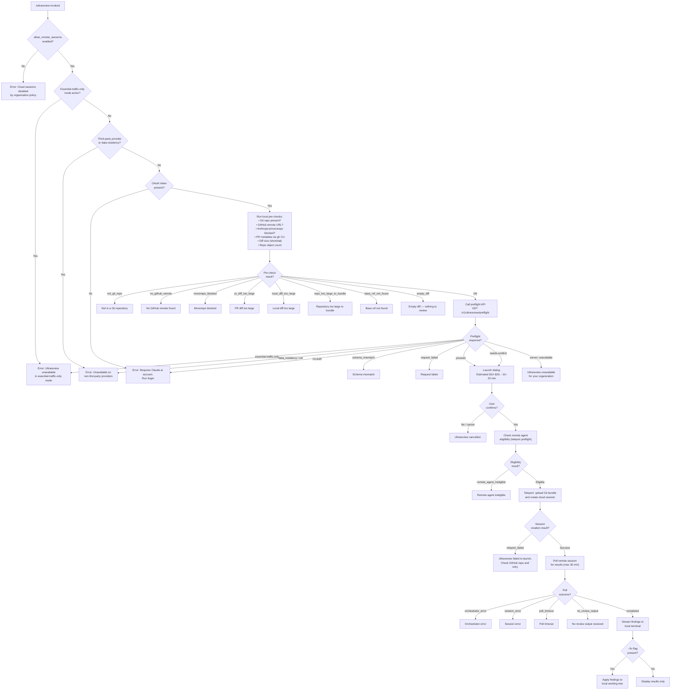

# `/ultrareview`

> Analysis basis: CC v2.1.191 bundle.js (AST extraction + Claude interpretation)
> Minimum version: v2.1.191

---

## Overview

`/ultrareview` launches a cloud-hosted agent on Claude Code for the web that autonomously finds and verifies bugs in the current Git branch. The command performs a series of local pre-flight checks (repository state, remote URL, diff size, organizational policy, OAuth authentication) before submitting the branch to the remote Ultrareview service, which polls for results and streams findings back to the local terminal. Estimated cost is in the range of $10–$20 USD per run, with a runtime of approximately 10–20 minutes.

---

## Registration

| Field | Value |
|---|---|
| type | `local-jsx` |
| name | `ultrareview` |
| description | `"Start a cloud agent that finds and verifies bugs in your branch ( … , … USD) · Runs in Claude Code on the web. See …"` |
| loc_byte | `12388858` |
| loc_byte_end | `12389129` |
| loc_line | `8188` |
| module_id | `aUl` |
| load_inline | `true` |
| arbor_handler.name | `vvf` |
| arbor_handler.fqn | `claude-2.1.191::vvf` |
| arbor_handler.kind | `AsyncFunction` |
| arbor_handler.resolution_path | `module_id` |
| arbor_handler.n_hits | `1` |

Analysis basis: CC v2.1.191 bundle.js:+12388858

---

## Input Branching

The command has well over three distinct execution paths driven by policy gates, repository state, diff size checks, preflight API results, and post-confirmation teleport outcomes. A Mermaid flowchart is used accordingly.



---

## Behavioral Spec

### 1. Entry Point — Handler `vvf`

The top-level handler is the async function `vvf` (resolved by Arbor via `module_id → aUl`).

Analysis basis: CC v2.1.191 bundle.js:+12386260

```
async function ultrareviewHandler(context):

    # Step 1: Check organizational policy gate
    if not settingsAllowRemoteSessions():        # literal "allow_remote_sessions" +12386263
        emit error: "Cloud sessions disabled by your organization's policy."
        emit telemetry: tengu_review_overage_blocked  # +12386594
        return

    # Step 2: Parse --fix flag and build tag set
    tagSet = parseTagsFromInput(context.input)   # calls VNl / kQn  +12386461
    fixMode = tagSet.has("fix")                  # literal "fix"     +12347853
    # Note: "comment" is also a recognized tag   # literal "comment" +12347859
    # Hint: /code-review ultra also routes here  # literal           +12347938

    # Step 3: Run local Git and diff pre-checks
    preCheckResult = runLocalPreChecks()         # calls GDo         +12386476

    if preCheckResult.status != "OK":
        emit telemetry: tengu_review_remote_precondition_failed  # +12347985
        emit user-visible error from preCheckResult
        return

    # Step 4: Call server preflight
    preflightResult = callUltrareviewPreflight() # calls jDo         +12386556

    if preflightResult.status == "proceed" or "needs-confirm":
        # Step 5: Show cost/time confirmation dialog
        showConfirmDialog(                        # calls W           +12386592
            estimatedCost = "$10-$20",           # literal           +9036214
            estimatedTime = "~10–20 min"         # literal           +9036307
        )

    # Step 6: Render UI and await user confirmation
    renderUI(context)                            # calls Fft / pA    +12386737, +12386745

    if not userConfirmed:
        emit: "Ultrareview cancelled."           # literal           +12387221
        return

    # Step 7: Teleport — check eligibility and upload bundle
    teleportResult = runTeleport(context, fixMode)  # calls Cvf      +12387133

    if not teleportResult.success:
        emit error: "Ultrareview failed to launch..."  # literal      +12386111
        emit telemetry: tengu_review_remote_teleport_failed  # +12354958
        return

    # Step 8: Poll cloud session and return results
    # If --fix: apply findings to working tree    # literal           +12385999
    # calls BDo for completion handling           # +12387199
    emit telemetry: tengu_review_remote_launched  # +12355634
```

---

### 2. Local Pre-Checks — `GDo`

`GDo` orchestrates a sequence of Git operations to validate the local repository before contacting any remote service.

Analysis basis: CC v2.1.191 bundle.js:+12347970

```
function runLocalPreChecks():

    # 2a. Verify Git working tree
    isGit = execGit(["rev-parse", "--is-inside-work-tree"])  # literals +7321778, +7321790
    if not isGit:
        return {status: "not_git_repo"}          # literal +12348038

    # 2b. Resolve remote URL (calls jO → Ase / OK / Tan)
    remoteUrl = getGitRemoteUrl()                # calls jO +12348298
    if not remoteUrl:
        return {status: "no_github_remote"}      # literal +12348371

    # 2c. Block Anthropic internal monorepo
    if remoteUrl includes "anthropics" or "anthropic":   # literals +12348780, +12348817
        if remoteUrl includes "github.com":              # literal  +12348742
            return {status: "monorepo_blocked"}  # literal +12348891

    # 2d. Fetch PR metadata via gh CLI
    prStats = execGhCli([
        "pr", "view",
        "--repo", repoSlug,
        "--json", "additions,deletions,changedFiles"  # literal +12349215
    ], timeout=5000)                             # literal +12349260

    if prStats and prStats.totalLines > threshold:
        return {status: "pr_diff_too_large"}     # literal +12349470

    # 2e. Count git objects to detect oversized repo
    objectCount = execGit(["count-objects", "-v"])  # literals +8702319, +8702335
    if objectCount > 5_000_000:                  # literal +8702760
        return {status: "repo_too_large_to_bundle"}  # literal +12349880

    # 2f. Verify base ref exists
    execGit(["rev-parse", "--verify", "--quiet", baseRef])  # literals +12350047, +12350058
    if failed:
        return {status: "base_ref_not_found"}    # literal +12350211

    # 2g. Determine default branch (Ck / M_)
    defaultBranch = resolveDefaultBranch()       # calls Ck +12350408, M_ +12350429

    # 2h. Compute merge-base
    mergeBase = execGit(["merge-base", branch, defaultBranch])  # literal +12350463
    if not mergeBase:
        return {status: "no_merge_base"}         # literal +12350679

    # 2i. Shortstat diff to detect empty or oversized local diff
    diffStat = execGit(["diff", "--shortstat", mergeBase])  # literals +12350996, +12351003
    if diffStat is empty:
        return {status: "empty_diff"}            # literal +12351162
    if diffStat.lines > localDiffLimit:
        return {status: "local_diff_too_large"}  # literal +12351482

    # 2j. Parse diff stats  (calls o6n)
    parsedStats = parseDiffOutput(diffStat)      # calls o6n +12351321

    return {status: "OK", stats: parsedStats}
```

---

### 3. Server Preflight — `jDo`

`jDo` calls the backend preflight endpoint and interprets the response.

Analysis basis: CC v2.1.191 bundle.js:+12351839

```
async function callUltrareviewPreflight():

    # Calls GNl which issues GET /v1/ultrareview/preflight
    response = await apiGet("/v1/ultrareview/preflight")  # literal +12346322

    # Essential-traffic-only check inside preflight
    if settings.networkMode == "essential-traffic-only":  # literal +12346416
        return {status: "essential-traffic-only",
                message: "Ultrareview runs in Claude Code on the web and is
                          unavailable when essential-traffic-only mode is active."}  # literal +12346452

    # ZDR / data-residency check
    if response.header["teleport-org"] == "zdr"   # literal +12346560
       or settings.mode == "data-residency":       # literal +12346571
        return {status: "data_residency",
                message: "Ultrareview runs in Claude Code on the web and is
                          unavailable on third-party providers."}  # literal +12346599

    # OAuth / authentication check
    if not oauthTokenPresent or response == "no-auth":  # literal +12346711
        return {status: "no_oauth_token",
                message: "Ultrareview requires a Claude.ai account. Run /login to authenticate."}  # literal +12346732

    # Validate schema
    if schemaMismatch:
        emit telemetry: tengu_review_remote_precondition_failed
        return {status: "schema_mismatch"}        # literal +12346971

    # Request failure
    if networkError:
        return {status: "request_failed"}         # literal +12347132

    # Server says unavailable for org
    if response.outcome == "server":              # literal +12352044
        return {status: "org_unavailable",
                message: "Ultrareview is unavailable for your organization."}  # literal +12352081

    # Needs confirmation dialog
    if response.outcome == "needs-confirm":       # literal +12352243
        return {status: "needs-confirm", ...response}

    # Happy path
    return {status: "proceed", ...response}       # literal +12351863
```

---

### 4. Teleport & Session Creation — `Cvf` / `WDo`

`Cvf` invokes `WDo`, which handles remote-agent eligibility, Git bundle construction, and cloud session launch.

Analysis basis: CC v2.1.191 bundle.js:+12385708

```
async function teleportAndLaunch(context, fixMode):

    # 4a. Check remote-agent eligibility (calls pue → CCa)
    eligibility = await checkRemoteAgentEligibility()   # +12352461
    if eligibility.status != "eligible":
        emit telemetry: various bg_remote_eligibility_check events
        return {success: false, reason: "remote_agent_ineligible"}  # literal +12352584

    # 4b. Upload Git bundle (calls Ego / teleportGitBundleUpload)
    bundleResult = await uploadGitBundle()               # literal "teleport_git_bundle_upload" +8705318
    emit telemetry: tengu_ccr_bundle_upload              # +8705611

    # 4c. POST to create cloud session (calls L6)
    session = await createCloudSession({
        type: "ultrareview",                            # literal +12354054
        bundleRef: bundleResult.ref,
        fixMode: fixMode
    })
    emit telemetry: tengu_teleport_bundle_mode           # +8723374
    emit telemetry: tengu_ccr_session_link               # +8715637

    if not session.id:
        return {success: false, reason: "malformed_response"}  # literal +8725168

    # 4d. Poll for results (calls Gye → aja)
    pollResult = await pollRemoteSession(session.id, {
        maxWait: 1_800_000,                             # literal 30 min +8743976
        path: "/ultrareview"                            # literal +12355218
    })

    if pollResult.status in ["orchestrator_error", "session_error",
                              "poll_timeout", "no_review_output"]:
        emit telemetry: tengu_review_remote_teleport_failed
        return {success: false, reason: pollResult.status}

    emit telemetry: tengu_review_remote_launched         # +12355634

    # 4e. Apply fix if --fix flag was set
    if fixMode:
        # " The user passed --fix: when the findings arrive,
        #   apply them to the local working tree."        # literal +12385999
        applyFindingsToWorkingTree(pollResult.findings)

    return {success: true, findings: pollResult.findings}
```

---

### 5. Tag Parsing — `VNl` / `kQn`

The free-text argument supplied after `/ultrareview` is parsed for recognized modifier tags.

Analysis basis: CC v2.1.191 bundle.js:+12386461

```
function parseTagsFromInput(rawInput):
    trimmed = rawInput.trim()
    tokens  = trimmed.split(whitespace)
    tagSet  = new Set()
    for token in tokens:
        normalized = normalizeToken(token)      # s.replace + Cw(e.replace)
        if normalized in KNOWN_TAGS:
            tagSet.add(normalized)
        else:
            remaining.push(token.trim())
    return {tags: tagSet, rest: remaining.join(" ")}

# Known tags (from literals):
# "fix"     +12347853  — apply findings to working tree after review
# "comment" +12347859  — post findings as code review comments
```

---

### 6. Overage / Billing Dialog — `Fft` / `pA`

When the preflight response is `needs-confirm` or `proceed`, a billing confirmation dialog is rendered before any remote work begins.

Analysis basis: CC v2.1.191 bundle.js:+12386737

```
function renderConfirmationDialog(preflightData):
    # Renders JSX component (lUl.jsx +12386978)
    show dialog:
        estimatedCost  = "$10-$20"        # literal +9036214
        estimatedTime  = "~10–20 min"     # literal +9036307
        bughunterCost  = preflightData.cost
        overage check  → emit tengu_review_overage_dialog_shown  # +12386931

    if user confirms:
        return true
    else:
        return false  # triggers "Ultrareview cancelled." +12387221
```

---

## State & Side Effects

| Item | Detail |
|---|---|
| Telemetry: `tengu_review_remote_precondition_failed` | Fired when any local pre-check or preflight schema check fails (bundle.js:+12347985) |
| Telemetry: `tengu_review_overage_blocked` | Fired when `allow_remote_sessions` is disabled (bundle.js:+12386594) |
| Telemetry: `tengu_review_overage_dialog_shown` | Fired when the cost-confirmation dialog is shown (bundle.js:+12386931) |
| Telemetry: `tengu_review_bughunter_config` | Fired when bughunter configuration is read (bundle.js:+9036097) |
| Telemetry: `tengu_ccr_bundle_upload` | Fired on each Git bundle upload attempt (bundle.js:+8705611) |
| Telemetry: `tengu_ccr_bundle_max_bytes` | Records the maximum byte limit for bundles (bundle.js:+8702234) |
| Telemetry: `tengu_ccr_bundle_seed_enabled` | Records seed-bundle mode being enabled (bundle.js:+7324421) |
| Telemetry: `tengu_teleport_bundle_mode` | Records which bundle mode was selected (bundle.js:+8723374) |
| Telemetry: `tengu_ccr_session_link` | Records the cloud session link after creation (bundle.js:+8715637) |
| Telemetry: `tengu_teleport_source_decision` | Records the source repository decision (bundle.js:+8729195) |
| Telemetry: `tengu_review_remote_teleport_failed` | Fired when teleport/session creation fails (bundle.js:+12354958) |
| Telemetry: `tengu_review_remote_launched` | Fired when the cloud review session is successfully launched (bundle.js:+12355634) |
| Telemetry: `tengu_teleport_generate_title` (via `dFp`) | Fires an API call to generate a task title (bundle.js:+8709054) |
| Telemetry: `tengu_teleport_environments_list` (via `jte`) | Fires when listing remote environments (bundle.js:+7319413) |
| Telemetry: `tengu_teleport_default_environment_create` (via `jte`) | Fires when a default environment is auto-created (bundle.js:+7320469) |
| Telemetry: `tengu_bg_sendclaim_failed` | Background daemon claim failure (bundle.js:+17346821) |
| Telemetry: `tengu_api_success` | General API success metric (bundle.js:+8938998) |
| File I/O | Git bundle written to temp file then uploaded; working-tree modifications applied if `--fix` is set |
| Network | `GET /v1/ultrareview/preflight` · `POST` cloud session creation · polling loop with `AbortSignal.timeout(10_000)` (bundle.js:+2350685) |
| appState changes | Cloud session ID stored; UI component rendered via `lUl.jsx` (bundle.js:+12386978) |
| Sound | <!-- TODO: not found in depth-2 traversal; needs --depth 4 --> |
| Hook registration | Calls `wne` / `hje` for progress hooks (bundle.js:+12387025, +12353308) |
| Process exit | `process.exit` reachable via `Cs → process.exit` on fatal CLI error (bundle.js:+13196585) |

---

## Version History

| Version | Change |
|---|---|
| v2.1.191 | Initial analysis |

---

## Common Mistakes

1. **Not logged in with a Claude.ai account.** `/ultrareview` requires OAuth authentication (not just an API key). Run `/login` first; using a bare `ANTHROPIC_API_KEY` will produce the `no_oauth_token` / `no_access_token` error path.
2. **Running inside a non-GitHub remote.** The command checks for a GitHub remote URL explicitly. Repositories with only a non-GitHub remote (e.g., GitLab, Bitbucket, or no remote at all) will fail with `no_github_remote`. Add a GitHub remote before invoking the command.
3. **Invoking on the Anthropics/Anthropic monorepo.** The handler hard-codes a block on remotes that include `anthropics` or `anthropic` under `github.com`; these return `monorepo_blocked`.
4. **Diff too large.** Both PR-level (`pr_diff_too_large`, threshold queried via `gh pr view`) and local-level (`local_diff_too_large`, computed from `git diff --shortstat`) checks exist. Narrow the scope of changes before running.
5. **Organization policy blocking cloud sessions.** If the `allow_remote_sessions` setting is false in the organization's admin settings, the command exits immediately with a policy error. An org admin must enable it at `/admin-settings/`.
6. **Expecting instant results.** The cloud review runs asynchronously and polls for up to 30 minutes (1 800 000 ms). Do not close the terminal before results arrive.
7. **Confusing `--fix` semantics.** The `fix` tag causes the agent to apply code changes to the local working tree after review. Omitting it means results are displayed only and no files are modified.

---

## Appendix — Identifier Mapping

> For bundle debugging only. Identifiers change across versions.

| Identifier | Role |
|---|---|
| `vvf` | Top-level async handler for `/ultrareview` |
| `vs` | Remote-session eligibility validation helper |
| `Hvi` | Network-mode / traffic-tier checker |
| `G4` | Git-context aggregator (wraps gF + PDt + che) |
| `gF` | Git file-system helper |
| `PDt` | File-read + parse utility for Git config |
| `che` | Git remote URL classifier / matcher |
| `Yi` | Telemetry network-mode classifier |
| `ncs` | Network-consent state resolver |
| `rt` | Generic string/value renderer |
| `Qge` | Rendering helper (calls rt) |
| `Cs` | Fatal CLI error handler (writes error file, calls process.exit) |
| `nqe` | Error formatter (console.error + colour) |
| `fT` | Error file writer |
| `e` | Context classifier / side-query manager |
| `L6o` | Conversation history serialiser (trims to 30 turns, handles tool_result) |
| `gsm` | History map setter |
| `har` | Character-level token helper |
| `hx` | Surrogate-pair / char-code utility |
| `msm` | Auto-classifier input builder |
| `ke` | JSON.stringify wrapper |
| `wN` | Core API request dispatcher (fetch, streaming) |
| `xf` | HTTP transport wrapper |
| `wt` | Low-level request executor |
| `oW` | Anthropic SDK client initialiser / request builder |
| `mz` | SDK version metadata provider |
| `p3r` | Header parser (split / trim / indexOf / slice) |
| `Ks` | Background-session header injector |
| `Mz` | Error page / docs URL builder |
| `GPr` | URL encoder for OAuth redirect |
| `T` | Shared HTTP header builder |
| `Ng` | OAuth token refresh coordinator |
| `XKs` | Boolean coercion helper |
| `_y` | Auth-method resolver (API key, OAuth, proxy) |
| `_ud` | Proxy-auth helper executor |
| `Kdn` | Proxy-auth helper timeout and trust checker |
| `Iud` | SSE / streaming request handler |
| `PH` | Mantle (internal auth) handler |
| `G2` | Organisation UUID fetcher |
| `fy` | Bedrock / Vertex credential resolver |
| `Tud` | SSE stream finaliser |
| `yud` | Provider-type discriminator (firstParty, vertex, foundry, etc.) |
| `SCe` | Rate-limit / retry-after scheduler |
| `Rdr` | Timestamp delta helper |
| `pMt` | Response-header normaliser (toLowerCase) |
| `dve` | SDK log emitter (ERROR / WARN / INFO / DEBUG) |
| `BSn` | Non-streaming response deserialiser |
| `D` | Background-worker process wrapper |
| `x` | Request-entry cache with TTL (60 000 ms) |
| `v` | Focus/blur window-state tracker |
| `Ooe` | Application-inference-profile ARN classifier |
| `nv` | Subagent identity injector |
| `yA` | OAuth profile resolver (user_oauth, profile-implicit) |
| `ACe` | WIF (Workload Identity Federation) token exchange |
| `TZe` | WIF credentials resolver (fetch + AbortSignal.timeout) |
| `I` | Rate-limiter / token-bucket |
| `h` | Stream framing helper |
| `b2e` | Bedrock model compatibility checker |
| `ao` | Provider-mode classifier (application-inference-profile, etc.) |
| `o1` | Internal request wrapper |
| `lie` | Foundry resource URL normaliser |
| `vOr` | Foundry resource name replacer |
| `_` | MCP tool registry |
| `a` | Tool-set builder |
| `CBp` | Tool-definition finder |
| `SHo` | Structured-output hash generator (SHA-256) |
| `Ghn` | User-agent string builder |
| `ol` | String coercion helper |
| `_r` | React / JSX renderer |
| `uu` | Ymn (UI component base) wrapper |
| `$hn` | AsyncLocalStorage context getter |
| `hCe` | Header cache-control injector |
| `aIn` | Internal request annotator |
| `aje` | Main-thread API call executor |
| `To` | Tool-call renderer |
| `dpr` | Tool-use debug printer |
| `nt` | Background-worker node tracker |
| `ppr` | Tool-result post-processor |
| `wD` | Request deduplication cache |
| `C3r` | Cache key builder |
| `A2e` | Cache entry serialiser |
| `L` | Background-worker sweep manager |
| `V` | Background-worker pool |
| `Nzt` | Memory pressure checker |
| `J8l` | Worker grace-clock helper |
| `I3e` | State-file reader / cleaner |
| `Le` | Tool-execution logger |
| `Gn` | Yield / tick helper |
| `W` | React render root |
| `j` | Worker lifecycle event emitter |
| `Xer` | Worker attach-upgrade handler |
| `q` | Worker keyboard-event handler |
| `ZVa` | Context-size estimator |
| `sp` | String sanitiser (replace) |
| `XSn` | Temperature / sampling param injector |
| `av` | Argument mapper |
| `Txe` | Tool-schema builder |
| `P4` | Random bytes / ID generator |
| `Sc` | Tool invocation scheduler |
| `etn` | Message array normaliser (tool_use) |
| `Qen` | ANc regex tester |
| `iD` | Deep-clone via structuredClone |
| `u7e` | Message array normaliser (tool_result) |
| `Zen` | Tool-result string replacer |
| `Ve` | eze (event emitter) wrapper |
| `eze` | Core event emitter |
| `LOr` | OAuth token store reader |
| `l7s` | Token-scope parser |
| `wOr` | Token-validity checker |
| `mbe` | API metrics batch emitter |
| `Tr` | lh + Ve UI renderer |
| `lh` | eze-backed latch helper |
| `Oo` | eze-backed overlay helper |
| `H1t` | Config file watcher |
| `v3i` | Config loader |
| `Rot` | Config lh renderer |
| `h1t` | Config hot-reload handler |
| `NF` | Agent-name resolver (agent:builtin: / agent:custom: / agent:) |
| `nOd` | Agent-prefix parser |
| `xD` | Repl-main-thread classifier |
| `kAt` | Cache-control injector |
| `S4` | Context tip classifier entry |
| `ev` | Context tip UI renderer |
| `PPr` | Context tip API caller |
| `zp` | Context tip request builder |
| `usm` | Context tip message serialiser |
| `csm` | Context tip map builder |
| `hsm` | Context tip text joiner |
| `M6n` | Tool-use block finder |
| `cSt` | "tip" outcome renderer (W + Pe) |
| `Pe` | eze-backed panel helper |
| `Re` | eze-backed review helper |
| `D6n` | Safe-parse schema validator |
| `we` | eze-backed workspace helper |
| `Ae` | String coercion helper |
| `VNl` | Tag-set parser for /ultrareview input |
| `kQn` | Token normaliser (trim / split / replace / add) |
| `Cw` | Escape-sequence replacer |
| `GDo` | Local pre-check orchestrator |
| `Cct` | Git repo detector (rev-parse) |
| `Dt` | Git command executor |
| `Gin` | Bin store getter |
| `Hr` | ux helper |
| `Kr` | Full git-command runner |
| `wUe` | Git sub-command dispatcher |
| `p` | Process / abort controller |
| `cHu` | String converter for git args |
| `up` | Git output post-processor |
| `dn` | Debug / log helper |
| `lHu` | dn-based git log wrapper |
| `jO` | Remote-URL cache and fetcher |
| `OK` | Tan-based remote-URL reader |
| `Tan` | Sse store getter (remoteUrl) |
| `xXe` | Credential-stripper (://***@) |
| `Ase` | Remote-URL classifier (https/http/github) |
| `Ops` | URL path splitter |
| `LXe` | wHu regex tester |
| `yi` | URL component extractor (indexOf / slice) |
| `Nn` | Second git-runner path (Kr + Dt) |
| `f` | Background-session lifecycle manager |
| `jn` | Process-spawn timeout helper |
| `c` | An (background-session) constructor wrapper |
| `Yer` | Memory / process-health checker |
| `F` | Worker-frame writer |
| `N` | Worker timer manager |
| `d` | Worker I/O stream handler |
| `M` | Worker timeout manager |
| `Mjo` | Background-session claim sender |
| `K2o` | Session state-file writer |
| `Ipm` | Claim timeout / retry manager |
| `Tpm` | Claim frame builder |
| `Gd` | dn-based session log helper |
| `VR` | Binary frame encoder (Buffer) |
| `Fjo` | Background-session full lifecycle (roster, files, IPC) |
| `ic` | Ay.join + yR path helper |
| `Bi` | File-state tracker (lstat / readFile / cache) |
| `bh` | $x active-state helper |
| `eLe` | File-list builder (startsWith / indexOf / slice) |
| `Od` | Rm + Ay.join + key + by output handler |
| `bHt` | Async result waiter with Date.now timeout |
| `lqt` | Session log-queue path builder |
| `oSe` | Session output-stream entry |
| `zR` | cvl-based stream result helper |
| `zN` | Wt + D0o + eh.join stream initialiser |
| `PM` | cvl-based post-session merge helper |
| `aqt` | Session archive-queue path builder |
| `$t` | JSON.parse wrapper |
| `$Ho` | hje + Math.floor numeric helper |
| `hje` | nt-based background-job helper |
| `y` | PGe-based UI tree |
| `PGe` | Teammate-mailbox / inbox renderer |
| `MGe` | gp + Sct + L5n.join inbox builder |
| `oH` | hOr + Object.assign header merger |
| `qye` | MGe + $t + dn + Le inbox entry helper |
| `l` | rGl-based list helper |
| `$pt` | Page-title helper |
| `qs` | EWu store getter |
| `tja` | Git object-count runner |
| `eja` | Git object-count parser (Kr + Number) |
| `ZGa` | nt-based job gate |
| `Ck` | Default-branch resolver via symbolic-ref |
| `Qbr` | Sse store getter (defaultBranch Ck path) |
| `M_` | Current-branch resolver via --abbrev-ref HEAD |
| `Xbr` | Sse store getter (branch M_ path) |
| `o6n` | Diff-stat line parser (match + parseInt) |
| `jDo` | Preflight API caller orchestrator |
| `GNl` | Preflight response decoder and blocker |
| `FDo` | Preflight flag applicator |
| `Lt` | W + Pe render pair |
| `Hje` | hje-based preflight numeric helper |
| `Fft` | Cx + hve UI frame builder |
| `Cx` | Confirmation dialog container |
| `hve` | Sc + To confirmation renderer |
| `pA` | To + wi + kt launch wrapper |
| `wi` | hMr + gMr + _y + Vs permission-mode UI |
| `hMr` | Permission-mode display helper |
| `gMr` | Permission-mode icon helper |
| `kt` | Config-access gate + tEt loader |
| `Gt` | Config path resolver |
| `C2o` | Config section accessor |
| `tEt` | Config file reader / parser / backup manager |
| `n4` | Config key prefix stripper |
| `L2o` | Config directory walker |
| `R2o` | Config join + Zn path helper |
| `m` | Worker kill-all manager |
| `K9f` | File-watcher registrar ($vt + Hpe + _i) |
| `$vt` | Tps.watchFile registration helper |
| `Hpe` | Watch-event debouncer |
| `_i` | xqo.register hook |
| `wne` | hje-based progress event emitter |
| `Cvf` | WDo + Ivf teleport wrapper |
| `WDo` | Main teleport orchestrator (session create + poll) |
| `pue` | CCa cloud-session eligibility runner |
| `CCa` | Remote-agent eligibility multi-check |
| `gne` | Session title / description formatter |
| `Uqa` | hje-based session numeric helper |
| `L6` | Cloud-session REST client (create / status / control) |
| `jl` | _r-based JSX link helper |
| `H5n` | Vs + rt + Pj session-header renderer |
| `oB` | kt + Vs + rv + tCe session-object builder |
| `xs` | Nns + jXc + t.replace session-error classifier |
| `rS` | yw-based response stream handler |
| `Ego` | Git bundle upload to cloud (teleport_git_bundle_upload) |
| `rja` | Session control request builder (randomUUID) |
| `OBt` | Object-key session param builder |
| `ne` | Z + te + A + w event-type discriminator |
| `Ago` | Session-state aggregator |
| `bgo` | Session-log batch handler |
| `nja` | ag + IA + kt + gn session-command sender |
| `KNn` | Session keep-alive manager |
| `jte` | Remote-environments lister |
| `Ict` | Default-environment creator |
| `dFp` | Title-generation API caller |
| `hFp` | e.filter session-entry helper |
| `fF` | IDt + CDt + B4 + kt + RTn tool-use registrar |
| `L5e` | Session-status poller (go.get / isAxiosError) |
| `Es` | E4 + Qo + rH event-stream helper |
| `K` | QDe + XCl model/capability set |
| `se` | K.trim + f + a + U + N session-entry sorter |
| `fo` | Error / String error formatter |
| `uh` | Session-cancel handler |
| `t_` | Session-teardown helper |
| `Gye` | Remote-agent polling loop (C3 + Ipt + _C + aja) |
| `C3` | c$f + LKl.randomBytes session-token generator |
| `Ipt` | Qtr + bFo + Em + Wre.open session-file opener |
| `_C` | Date.now + Em polling tick helper |
| `SFp` | Rgo + T + String session-state formatter |
| `aja` | Main polling / event-dispatch loop |
| `fue` | Ly + r + DFt findings delivery helper |
| `Ly` | io + r + DFt findings stream reader |
| `Ivf` | e.map results mapper |
| `BDo` | Post-review completion handler |