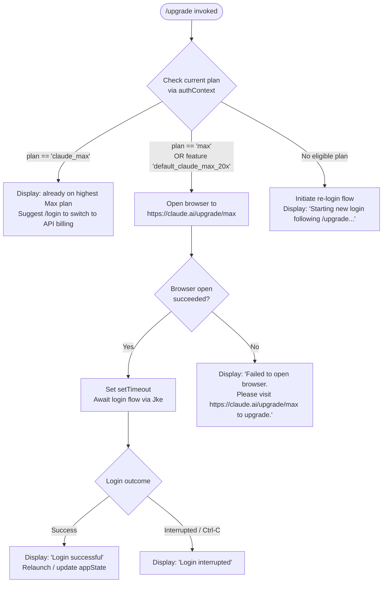

# `/upgrade`

> Analysis basis: CC v2.1.191 bundle.js (AST extraction + Claude interpretation)
> Minimum version: v2.1.191

---

## Overview

The `/upgrade` command guides users from a lower-tier Claude subscription to the **Claude Max** plan, providing higher rate limits and increased access to Opus models. It inspects the current authentication context to determine whether an upgrade is possible, opens a browser to the Max upgrade URL when appropriate, and falls back to a re-login flow if needed.

---

## Registration

| Field | Value |
|---|---|
| type | `local-jsx` |
| name | `upgrade` |
| description | `Upgrade to Max for higher rate limits and more Opus` |
| loc_byte | `12852296` |
| loc_byte_end | `12852543` |
| loc_line | `8633` |
| module_id | `r1o` |
| load_inline | `true` |
| arbor_handler.name | `ZKt` |
| arbor_handler.fqn | `claude-2.1.191::ZKt` |
| arbor_handler.kind | `AsyncFunction` |
| arbor_handler.resolution_path | `module_id` |
| arbor_handler.n_hits | `0` |

Analysis basis: CC v2.1.191 bundle.js:+12852296

---

## Input Branching

The handler contains 4+ distinct branches based on account/subscription state, warranting a Mermaid flowchart.



Analysis basis: CC v2.1.191 bundle.js:+12851195, +12851281, +12851306, +12851526, +12851672, +12851821

---

## Behavioral Spec

### 1. Plan Detection

The handler `ZKt` (upgrade command handler) first resolves the active authentication context by calling the auth-context resolver (`To`) and inspects the plan name.

```
async function upgradeCommandHandler(context):
    authState = resolveAuthContext(context)       // calls To → _y
    planName  = authState.planName               // e.g. "max", "claude_max", "default_claude_max_20x"

    if planName == "claude_max":
        displayMessage(ALREADY_ON_MAX_MESSAGE)
        return
    // else proceed to upgrade flow
```

Constant — already-on-Max message (≤30 chars excerpt): `"You are already on the highest…"` (full text: `"You are already on the highest Max subscription plan. For additional usage, run /login to switch to an API usage-billed account."`)

Analysis basis: CC v2.1.191 bundle.js:+12851281, +12851526

The feature flag `"default_claude_max_20x"` is checked alongside `"max"` plan identity to gate the upgrade path.

Analysis basis: CC v2.1.191 bundle.js:+12851306

---

### 2. Browser Launch

When the user is eligible for upgrade, the handler opens the upgrade URL using the platform-appropriate open command.

```
function openUpgradeInBrowser():
    url = "https://claude.ai/upgrade/max"

    platformCmd = (platform == "darwin") ? "open" : <platform-specific>
    result = spawnProcess(platformCmd, [url])   // via sc → Umi → Nn

    if result.error:
        displayMessage("Failed to open browser. Please visit https://claude.ai/upgrade/max to upgrade.")
        return false

    return true
```

Analysis basis: CC v2.1.191 bundle.js:+12851669, +12851672, +12852089

The URL constant `"https://claude.ai/upgrade/max"` is embedded verbatim in the bundle.

Analysis basis: CC v2.1.191 bundle.js:+12851672

Platform check uses `"darwin"` / `"open"` for macOS.

Analysis basis: CC v2.1.191 bundle.js:+3121304, +3121323

---

### 3. Login Await and Re-login Flow

After the browser opens (or independently when no eligible upgrade plan is detected), the handler sets a `setTimeout` guard and initiates a login sequence via `Jke` (the login/re-login orchestrator).

```
async function awaitLoginAfterUpgrade(context):
    displayMessage("Starting new login following /upgrade. Exit with Ctrl-C to use existing account.")

    loginResult = await loginOrchestrator(context)   // calls Jke

    if loginResult.success:
        displayMessage("Login successful")
        applyMessageOp("update")
        triggerRelaunch()                            // f.execRelaunch
    else:
        displayMessage("Login interrupted")
```

The `setTimeout` at `+12851511` acts as a guard allowing the UI to render the status message before the blocking login flow begins.

Analysis basis: CC v2.1.191 bundle.js:+12851511, +12851821, +12852016, +12852035

---

### 4. Auth Context Resolution (`To` / `_y`)

The auth context resolver gathers the current login mode and plan information by iterating over known auth provider types.

Known auth provider literals found in the call graph:

| Literal | loc_byte |
|---|---|
| `"bedrock"` | 2134446 |
| `"foundry"` | 2134496 |
| `"anthropicAws"` | 2134552 |
| `"mantle"` | 2134606 |
| `"vertex"` | 2134654 |
| `"firstParty"` | 2134663 |
| `"user_oauth"` | 3057090 |
| `"profile-implicit"` | 3057017 |

Analysis basis: CC v2.1.191 bundle.js:+3079709, +2134446

---

### 5. OAuth Profile Fetch (`tCe`)

During the login flow, `tCe` performs an HTTP fetch of the OAuth profile to retrieve current plan data.

```
async function fetchOAuthProfile(token):
    headers = { "Content-Type": "application/json" }
    response = await fetch(oauthProfileEndpoint, {
        headers: headers,
        timeout: 10000
    })

    if success:
        emit telemetry("oauth_profile_fetch")
    else:
        emit telemetry("oauth_profile_token_failed")
        raise error
```

Timeout constant: `10000` ms (10 seconds).

Analysis basis: CC v2.1.191 bundle.js:+2141660, +2141676, +2141743

---

### 6. JSX Render (`V5l.jsx`)

The command is registered as `local-jsx`, so the handler renders a JSX component before and/or after the login flow completes. The `V5l.jsx` call at `+12851792` wraps the user-facing status messages into a terminal React component.

Analysis basis: CC v2.1.191 bundle.js:+12851792

---

### 7. App State Update (`Sc`)

On successful login, `Sc` (the session state committer) invokes `_y` (auth context resolver) and `kt` (telemetry/event emitter) to persist the new credentials and refresh the active session.

```
function commitSessionState(newCredentials):
    authContext = resolveAuthContext(newCredentials)  // _y
    emitEvent(authContext)                            // kt
```

Analysis basis: CC v2.1.191 bundle.js:+3080162, +3080167

---

## State & Side Effects

| Item | Detail |
|---|---|
| Telemetry | `tengu_feature_ok` (bundle.js:+1025725), `tengu_feature_sad` (bundle.js:+1025873), `tengu_feature_bad` (bundle.js:+1025792), `tengu_api_success` (bundle.js:+8938998), `tengu_lone_surrogate_sanitized` (bundle.js:+8938694), `tengu_managed_settings_security_dialog_shown` (bundle.js:+7376858), `tengu_managed_settings_security_dialog_accepted` (bundle.js:+7377195), `tengu_managed_settings_security_dialog_rejected` (bundle.js:+7377354), `tengu_context_tip_classifier_outcome` (bundle.js:+16672225), `tengu_disable_bypass_permissions_mode` (bundle.js:+13727473), `tengu_auto_mode_config` (bundle.js:+13725264), `tengu_policy_limits_fetch` (bundle.js:+13845006) |
| Browser open | Spawns `open` (macOS) or equivalent command with `https://claude.ai/upgrade/max` (bundle.js:+12851672) |
| setTimeout guard | `setTimeout` at bundle.js:+12851511 defers blocking login flow to allow UI render |
| appState changes | `e.getAppState` / `e.setAppState` (via `Jke`) updated on login success (bundle.js:+9060986, +9061159) |
| Relaunch | `f.execRelaunch` called on successful login (bundle.js:+9060656) |
| OAuth profile fetch | HTTP GET to OAuth profile endpoint with 10 s timeout (bundle.js:+2141660) |
| Trusted device enrollment | `BBt` may trigger trusted-device enrollment after login (bundle.js:+9061445) |
| Remote managed settings | `W5e` / `flo` may refresh remote managed settings post-login (bundle.js:+7384160) |
| Policy limits refresh | `V6t` may refresh policy limits cache after auth change (bundle.js:+9060771) |
| Sound | <!-- TODO: not found in depth-2 traversal; needs --depth 4 --> |
| Hook registration | `_i` registers hooks via `xqo.register` (bundle.js:+67562) |

---

## Version History

| Version | Change |
|---|---|
| v2.1.191 | Initial analysis |

---

## Common Mistakes

1. **Running `/upgrade` when already on `claude_max`** — the command will display a message indicating you are already on the highest Max plan and suggest `/login` to switch to API billing instead. It will not open a browser or initiate any upgrade flow.

2. **Cancelling mid-flow with Ctrl-C** — the handler explicitly intercepts the interrupt and displays `"Login interrupted"`. Any partial state changes (e.g., browser opened) are not reversed automatically.

3. **Network or browser failures** — if the system browser cannot be opened, the command falls back to displaying a manual URL (`https://claude.ai/upgrade/max`) rather than failing silently. Users should visit this URL manually.

4. **Expecting immediate effect** — the upgrade flow requires completing an OAuth login cycle. The `setTimeout` guard means the UI message appears before the login flow blocks, but the session is not updated until the external browser flow is completed and the re-login succeeds.

5. **Using on non-first-party auth** — when the active auth provider is `bedrock`, `vertex`, `foundry`, `anthropicAws`, or `mantle`, the upgrade path is not applicable; these providers do not route through `https://claude.ai/upgrade/max`.

---

## Appendix — Identifier Mapping

> For bundle debugging only. Identifiers change across versions.

| Identifier | Role |
|---|---|
| `ZKt` | Upgrade command handler (AsyncFunction) — main entry point |
| `To` | Auth context resolver — top-level wrapper |
| `_y` | Auth context resolver — inner implementation |
| `ad` | Argument/flag parser utility |
| `rt` | String/argument builder |
| `QZt` | Bare-flag handler (relates to `--bare` literal) |
| `yA` | Auth provider type resolver |
| `ogn` | Auth provider sub-resolver (calls `Dj`) |
| `ltt` | Auth type checker (`rt`, `vK`) |
| `Pj` | OAuth token file descriptor accessor |
| `cR` | Flag-settings reader |
| `rB` | Array-includes auth type checker |
| `jl` | Auth state reader |
| `_r` | String-based auth type check |
| `uT` | Auth token utility |
| `iH` | Auth environment resolver (reads `ANTHROPIC_API_KEY`, etc.) |
| `bMt` | API key helper resolver |
| `Lze` | VSCode auth context detector |
| `wxt` | API key file descriptor reader |
| `kt` | Telemetry/event emitter (uses `Date.now`) |
| `VU` | Token slicer (slice length 20) |
| `CMt` | Auth type composition helper |
| `tCe` | OAuth profile fetcher (HTTP, 10 s timeout) |
| `xs` | OAuth URL builder / validator |
| `Nns` | URL normaliser |
| `jXc` | OAuth endpoint selector |
| `we` | HTTP feature-flag fetch (success path) |
| `W` | HTTP wrapper |
| `Pe` | HTTP error handler |
| `Lt` | HTTP feature-flag fetch (sad path) |
| `T` | Logging/output utility |
| `wNc` | Log formatter |
| `kqo` | Log level router (`MPc`, `DPc`) |
| `L6o` | Message history formatter |
| `wN` | Anthropic API client (globalThis.fetch-based) |
| `S4` | API response processor |
| `usm` | Conversation summary builder |
| `hsm` | History join builder |
| `M6n` | Tool-use finder |
| `cSt` | Context tip JSX renderer |
| `Re` | HTTP result handler (success) |
| `D6n` | Schema safe-parser |
| `Ae` | String coercer |
| `ke` | JSON serialiser |
| `Dc` | Path/string redactor |
| `h7o` | Redaction map mapper |
| `a7e` | TTY writer wrapper |
| `s7o` | Raw TTY write |
| `kNc` | Log-file writer (append, rotate) |
| `Oze` | Debounced log flusher |
| `Rfe` | Log file path builder |
| `Gt` | Global config accessor |
| `Noe` | Log directory creator |
| `y7o` | Log file path joiner |
| `nmr` | Log file rotator (rename/unlink) |
| `RNc` | Log file append worker |
| `_i` | Hook registrar (`xqo.register`) |
| `Le` | Error logger (`GQ.logError`) |
| `fo` | Error/string normaliser |
| `Yi` | Network traffic class getter |
| `ncs` | Traffic class resolver |
| `Rmu` | Request queue manager |
| `sc` | URL-open spawner |
| `spd` | URL validation (http/https check) |
| `Umi` | Platform open dispatcher |
| `Yh` | Platform open helper |
| `Nn` | Process spawner |
| `Kr` | Spawn executor (with retry/timeout) |
| `Dt` | Spawn result handler |
| `Sc` | Session state committer (calls `_y`, `kt`) |
| `Jke` | Login/re-login orchestrator |
| `Cze` | Timestamp helper (`Date.now`) |
| `W5e` | Remote-managed-settings loader |
| `fwa` | Settings fetch initialiser |
| `a3t` | Settings cache reader |
| `Mfs` | Settings cache store |
| `WY` | Remote settings apply |
| `cme` | Settings merge utility |
| `Tse` | Settings schema validator |
| `$1e` | Settings diff detector |
| `e_` | Settings serialiser |
| `uu` | Settings event emitter |
| `nS` | Auth-change settings refresher |
| `xMt` | Settings auth-change watcher |
| `RUn` | Settings change notifier |
| `Dfs` | Settings dirty-flag setter |
| `ulo` | Settings background poll loop |
| `lwa` | Poll timer setup |
| `twa` | Poll delay calculator |
| `flo` | Remote settings fetch worker |
| `ume` | Settings content hasher |
| `Sva` | SHA-256 hash builder |
| `bgp` | Settings HTTP request builder |
| `FXe` | HTTP cache key builder |
| `Ve` | HTTP response parser |
| `iwa` | Settings security dialog trigger |
| `nwa` | Settings security check |
| `rwa` | Settings path extractor |
| `awa` | Settings atomic file writer |
| `dwa` | Settings debounce helper |
| `pwa` | Settings polling orchestrator |
| `WTn` | Interval manager (setInterval/clearInterval) |
| `Igp` | Settings poll tick handler |
| `cGn` | Login deep-equals checker |
| `kdr` | Credential key derivation |
| `In` | Session initialiser |
| `vln` | Session variable loader |
| `z2` | Session sub-system initialiser |
| `f` | Daemon process manager |
| `D` | Daemon subprocess wrapper |
| `y0c` | Binary path resolver (realpath/stat) |
| `up` | Process utility |
| `tfm` | Daemon config builder |
| `d` | Subprocess I/O handler |
| `jn` | Promise-with-timeout helper |
| `c` | Background-session abort handler |
| `s` | Promise tracking set |
| `Yer` | Memory monitor |
| `nt` | Telemetry event tracker |
| `I3e` | Pins-file reader (JSON) |
| `l1t` | Pins file path builder |
| `$t` | JSON safe parser |
| `vn` | Error-code classifier (ENOENT, EISDIR) |
| `VPd` | Directory recursive reader |
| `F` | Daemon idle-exit manager |
| `N` | Idle-exit state machine |
| `M` | Idle-exit timer |
| `Mjo` | IPC claim sender |
| `K2o` | Claim file writer |
| `Ipm` | Claim send timeout handler |
| `Tpm` | Claim frame builder |
| `Gd` | Error logger (dn-based) |
| `i` | IPC socket wrapper |
| `VR` | Binary frame encoder (Buffer) |
| `Fjo` | Background session lifecycle manager |
| `ic` | Session directory path builder |
| `Bi` | File-state watcher |
| `bh` | Active-state marker |
| `dn` | General logger |
| `eLe` | File path list builder |
| `Od` | Path join+key helper |
| `bHt` | Async operation timer |
| `lqt` | Lock file path builder |
| `oSe` | State file opener |
| `zR` | IPC error classifier (`err`) |
| `zN` | IPC late-message handler |
| `PM` | IPC close handler |
| `aqt` | Lock acquire helper |
| `p` | Forced-shutdown handler (`process.exit`) |
| `oT` | Abort signal factory |
| `u` | Daemon stop sequencer |
| `U` | Disposable resource holder |
| `pGn` | Login state clearer |
| `yZt` | Auth cache clearer |
| `$Z` | Feature-flag clearer |
| `mKa` | OAuth token cache clearer |
| `Die` | Device-info clearer |
| `gve` | Gateway config clearer |
| `pKa` | Profile cache clearer |
| `i_o` | Identity cache clearer |
| `MTn` | Feature-flag refresher |
| `B4` | Feature-flag store accessor |
| `BCi` | Feature-flag payload processor |
| `GCi` | Feature-flag snapshot builder |
| `$3` | Global config updater |
| `gKa` | Config field reader |
| `vK` | Feature-flag presence checker |
| `Mft` | Config merge utility |
| `G3p` | Config base accessor |
| `B3p` | Config entry filter |
| `$3p` | Config entry setter |
| `U3p` | Config unknown-key handler |
| `vk` | Event subscriber set |
| `JAt` | Event at-index reader |
| `sIn` | Settings init helper |
| `Lgs` | CA cert cache clearer |
| `Dgs` | mTLS config cache clearer |
| `Bxr` | Proxy agent cache clearer |
| `BLt` | Network proxy configurator |
| `jU` | Proxy URL parser |
| `lMs` | Proxy agent builder |
| `tz` | Proxy host matcher |
| `V6t` | Policy limits manager |
| `p2o` | Policy limits timer resetter |
| `m2o` | Policy limits state reader |
| `che` | Policy limits feature checker |
| `Fnr` | Policy limits timeout handler |
| `gF` | Policy limits data accessor |
| `Pve` | Policy limits file path builder |
| `Bnr` | Policy limits background poller |
| `fXl` | Policy limits fetch worker |
| `mXl` | Policy limits poll ticker |
| `_ve` | Auth event unsubscriber |
| `Zie` | Session teardown handler |
| `Ztt` | Session cleanup (clears feature-flag stores) |
| `N5r` | Interval/process-listener clearer |
| `SOt` | Trusted-device token checker |
| `Hao` | App context builder |
| `io` | React context initialiser |
| `_Qt` | React context bind helper |
| `aRe` | Telemetry gate checker |
| `Wl` | Credential read/write store |
| `Uzs` | Secure-storage credential accessor |
| `BBt` | Trusted-device enrollment orchestrator |
| `fF` | Feature-flag gate for trusted device |
| `IDt` | Feature-flag ID resolver |
| `CDt` | Feature-flag config resolver |
| `RTn` | Feature-flag rollout evaluator |
| `WCi` | Feature-flag value getter |
| `gmp` | Trusted-device gate check |
| `pao` | Platform check for trusted device |
| `qin` | Enrollment request builder |
| `HKa` | Post-login hook |
| `B6t` | Auto-mode gate checker |
| `fGn` | Auto-mode feature reader |
| `O5r` | Auto-mode flag resolver |
| `o3t` | Auto-mode permission handler |
| `HH` | Permission store updater |
| `Ur` | Remote-control session updater |
| `zKn` | Working-directory setter |
| `ns` | Session property setter |
| `YKn` | Tool-allowlist setter |
| `AB` | Permission-mode setter |
| `c_o` | Post-login cleanup |
| `G6t` | Bridge/remote-control dispatcher |
| `j6t` | Bridge message router |
| `jz` | Bridge feature-flag reader |
| `F$o` | Bridge config accessor |
| `U$o` | Bridge job dispatcher |
| `Es` | Bridge error handler |
| `Gge` | Model-name checker (claude-opus-4-x etc.) |
| `NDe` | Bridge notification builder |
| `rtt` | Message role formatter |
| `FJ` | Bridge frame builder |
| `I2` | Bridge response parser |
| `iHe` | Permission mode emitter |
| `tAe` | Bridge tool-result mapper |

---

Note: index built via Arbor fallback; some signals (telemetry, literals) may be missing — see arbor-fallback.js.