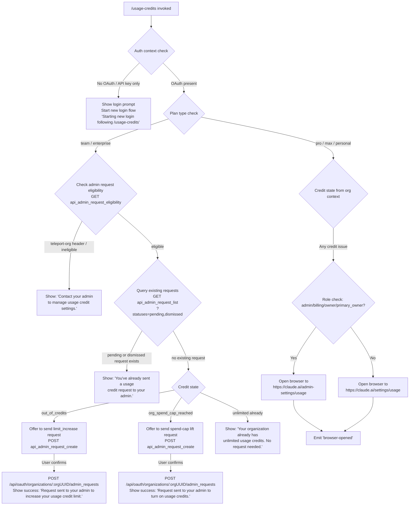

# `/usage-credits`

> Analysis basis: CC v2.1.191 bundle.js (AST extraction + Claude interpretation)
> Minimum version: v2.1.191

---

## Overview

`/usage-credits` is a local-jsx slash command that helps users configure or request usage credits when they have hit a quota limit. It inspects the current authentication context and subscription plan, queries relevant API endpoints for eligibility and existing requests, and either opens a browser to the appropriate admin settings page or sends a credit-increase request to the organization admin — all rendered as an interactive JSX panel within the CLI.

---

## Registration

| Field | Value |
|---|---|
| type | `local-jsx` |
| name | `usage-credits` |
| description | `Configure usage credits to keep working when you hit a limit` |
| loc_byte | `9107831` |
| loc_byte_end | `9108041` |
| loc_line | `3459` |
| module_id | `y_o` |
| load_inline | `true` |
| arbor_handler.name | `Y6t` |
| arbor_handler.fqn | `claude-2.1.191::Y6t` |
| arbor_handler.kind | `AsyncFunction` |
| arbor_handler.resolution_path | `module_id` |
| arbor_handler.n_hits | `0` |

Analysis basis: CC v2.1.191 bundle.js:+9107831

---

## Input Branching

The command follows 5+ distinct paths based on subscription plan, organization credit state, and existing admin-request status. A Mermaid flowchart is used.



Analysis basis: CC v2.1.191 bundle.js:+9064977, +9065031, +9065142, +9065352, +9065510, +9065740, +9065835, +9066065, +9066373, +9066439, +9066740, +9066781, +9066848

---

## Behavioral Spec

### Top-level Handler (`Y6t` / `usageCreditCommandHandler`)

```
async function usageCreditCommandHandler(context):
    authContext = getAuthContext()          // wi / getAuthAndSubscriptionState
    
    if authContext requires new login:
        print "Starting new login following /usage-credits. Exit with Ctrl-C to use existing account."
        startLoginFlow(context)
        return renderJSX(loginPanel)

    planType = authContext.plan            // "pro" | "max" | "team" | "enterprise"
    orgCreditState = getOrgCreditState()   // out_of_credits | org_spend_cap_reached | unlimited | ...

    renderJSX(
        usageCreditPanel(planType, orgCreditState, context)
    )
```

Analysis basis: CC v2.1.191 bundle.js:+9106057, +9106070, +9106141, +9106163, +9106485

---

### Auth & Subscription State Reader (`wi` / `getAuthAndSubscriptionState`)

```
function getAuthAndSubscriptionState():
    profile = getImplicitProfile()         // _y / resolveProfile
    // checks ANTHROPIC_API_KEY, apiKeyHelper, ANTHROPIC_AUTH_TOKEN,
    // CLAUDE_CODE_OAUTH_TOKEN, WIF env vars
    if none present:
        throw "ANTHROPIC_API_KEY, ANTHROPIC_AUTH_TOKEN, CLAUDE_CODE_OAUTH_TOKEN, or WIF env vars (...) required"
    
    subscriptionType = detectSubscriptionType()
    // stripe_subscription | stripe_subscription_contracted |
    // apple_subscription | google_play_subscription
    
    return { profile, subscriptionType, plan }
```

Analysis basis: CC v2.1.191 bundle.js:+3080507, +3080520, +3080530, +3080553, +3060491, +3060960

---

### Usage Data Fetcher (`Mle` / `fetchUsageData`)

```
async function fetchUsageData(authToken):
    response = await httpGet(
        endpoint  = "/api/oauth/usage",
        timeout   = 5000,                   // ms
        headers   = { "Content-Type": "application/json" },
        authMode  = "no-auth" fallback if needed
    )

    if response.status == 401:
        // refresh token, retry once
        // on success append " (401→refresh→retry succeeded)" to log
    if response.status == 403:
        if errorBody contains "OAuth token has been revoked":
            handleRevokedToken()            // YU / clearCachedOAuthToken
    
    return usagePayload
```

Analysis basis: CC v2.1.191 bundle.js:+5235745, +5235912, +5235940, +5235954, +5235969, +5236054, +5236155, +3098040, +3098068, +3098134

---

### Admin Request Eligibility Check (`IKa` / `checkAdminRequestEligibility`)

```
async function checkAdminRequestEligibility(orgUUID, authToken):
    response = await httpGet(
        endpoint = "api_admin_request_eligibility",  // GET
        headers  = { teleport-org if required }
    )
    if response indicates ineligible or teleport-org org:
        return { eligible: false,
                 message: "Contact your admin to manage usage credit settings." }
    return { eligible: true }
```

Analysis basis: CC v2.1.191 bundle.js:+9064256, +9064313, +9064407, +9064439

---

### Existing Request Lookup (`TKa` / `listAdminRequests`)

```
async function listAdminRequests(orgUUID, authToken):
    response = await httpGet(
        endpoint = "api_admin_request_list",   // GET
        params   = { statuses: ["pending", "dismissed"] }
    )
    if response.requests.some(r => r.status == "pending" || r.status == "dismissed"):
        return { hasExisting: true }
    return { hasExisting: false }
```

Analysis basis: CC v2.1.191 bundle.js:+9063905, +9064002, +9064011, +9064037, +9064141, +9066065, +9066075

---

### Admin Request Creator (`bKa` / `createAdminRequest`)

```
async function createAdminRequest(orgUUID, requestType, authToken):
    // requestType: "limit_increase"
    response = await httpPost(
        endpoint = "/api/oauth/organizations/:orgUUID/admin_requests",
        body     = { type: requestType }
    )
    if response.status >= 500:
        // surface error detail field from response body
        throw APIError(response.detail)
    
    if requestType == "limit_increase" and creditState == "out_of_credits":
        return "Request sent to your admin to increase your usage credit limit."
    else:
        return "Request sent to your admin to turn on usage credits."
```

Analysis basis: CC v2.1.191 bundle.js:+9063640, +9063643, +9063692, +9063700, +9063791, +9064664, +9064870, +9066373, +9066439

---

### Axios Error Handler (`vKa` / `classifyAxiosError`)

```
function classifyAxiosError(error):
    if go.isAxiosError(error):
        if error.response.status == 429:
            return "rate_limited"
        return "http_error"
    return "unknown"
```

Analysis basis: CC v2.1.191 bundle.js:+9064581

---

### Credit-State Message Resolver (`q6t` / `resolveCreditStateMessage`)

```
function resolveCreditStateMessage(creditState, orgContext):
    switch creditState:
        case "out_of_credits":
            return {
                type: "message",
                text: "Your organization is out of usage credits. Contact your admin to add more."
            }
        case "org_spend_cap_reached":
            // org_level_disabled_until field indicates period end
            return {
                type: "org_spend_cap_reached",
                text: "Your organization's usage credit cap is reached for this period. Contact your admin to raise it."
            }
        default if org has unlimited:
            return {
                text: "Your organization already has unlimited usage credits. No request needed."
            }
```

Analysis basis: CC v2.1.191 bundle.js:+9064977, +9065352, +9065381, +9065397, +9065479, +9065510, +9065562, +9065740

---

### Browser Opener (`sc` / `openBrowser`)

```
function openBrowser(url):
    // validate url starts with "http:" or "https:"
    if platform == "darwin":
        spawn("open", [url])
    elif platform == "linux":
        spawn("xdg-open", [url])
    elif platform == "windows":
        spawn("start", [url])
    emit event "browser-opened"
```

Analysis basis: CC v2.1.191 bundle.js:+9066898, +3120050, +3120072, +3121174, +3121304, +3121323, +9066848

---

### URL Selection Logic (`Oft` / `renderUsageCreditPanel`)

```
function selectBrowseURL(userRole):
    adminRoles = ["admin", "billing", "owner", "primary_owner"]
    if userRole in adminRoles:
        return "https://claude.ai/admin-settings/usage"
    else:
        return "https://claude.ai/settings/usage"
```

Analysis basis: CC v2.1.191 bundle.js:+2140207, +2140215, +2140225, +2140233, +9066740, +9066781

---

### Login Re-Entry Flow (`Jke` / `loginOrRefreshSession`)

```
async function loginOrRefreshSession(context):
    // triggered when no valid OAuth token present
    onAPIKeyChange(context)
    applyMessageOp("update")
    
    if apiProvider == "gateway":
        // skip re-login for gateway/bedrock/foundry/anthropicAws/mantle/vertex providers
        return
    
    timestamp = Date.now()    // Cze / timestampNow
    sessionContext = getSessionContext()
    
    // attempt relaunch
    execRelaunch()
    
    // update app state, disconnect Remote Control bridge if account changed
    // "[bridge:repl] Account changed via /login — disconnecting Remote Control session"
    
    // refresh feature flags, re-enroll trusted device if needed
    refreshFeatures()
    
    // emit login success or interruption message
    if success:
        print "Login successful"
    else:
        print "Login interrupted"
```

Analysis basis: CC v2.1.191 bundle.js:+9060415, +9060434, +9060457, +9060516, +9060529, +9060522, +9060550, +9060557, +9060570, +9060604, +9060634, +9060656, +9060685, +9106485, +9106686, +9106705

---

### Ember Latch / Session Initialization (`nt` / `initEmberLatch`)

```
function initEmberLatch(sessionId):
    // tengu_ember_latch event fired here
    // manages feature-flag experiment registration (GrowthbookExperimentEvent)
    // uses xve (feature map), bDt (pending set), gW (session map)
    loadConfigFile()    // kt / loadGlobalConfig
    checkExistingLatch(RTn)
    if not latched:
        registerNewLatch(w5r)
        emitGrowthbookEvent("growthbook_experiment")
```

Analysis basis: CC v2.1.191 bundle.js:+9064991, +3336540, +3336577, +3336629, +3329693, +3330144

---

## State & Side Effects

| Item | Detail |
|---|---|
| Telemetry | `tengu_ember_latch` (bundle.js:+9064994); `tengu_config_parse_error` (bundle.js:+13869283); `tengu_feature_ok` / `tengu_feature_bad` (bundle.js:+1025725, +1025792); `tengu_policy_limits_fetch` (bundle.js:+13845006); `tengu_auto_mode_config` (bundle.js:+13725264); `tengu_disable_bypass_permissions_mode` (bundle.js:+13727473); `tengu_managed_settings_security_dialog_shown/accepted/rejected`; `tengu_bg_*` daemon events (indirect, via session launch sub-graph) |
| Browser launch | `open` / `xdg-open` / `start` is spawned with one of two URLs depending on user role: `https://claude.ai/admin-settings/usage` (admin roles) or `https://claude.ai/settings/usage` (standard users). Event `browser-opened` is emitted after launch. (bundle.js:+9066740, +9066781, +9066848) |
| API calls | `GET /api/oauth/usage` (timeout 5 000 ms); `GET api_admin_request_eligibility`; `GET api_admin_request_list?statuses=pending,dismissed`; `POST /api/oauth/organizations/:orgUUID/admin_requests` |
| OAuth token cache | `YU` clears/refreshes the cached OAuth token on 401 or revocation (bundle.js:+3072873, +3072904, +3072924, +3072947) |
| appState changes | `e.getAppState` / `e.setAppState` called during login re-entry path (bundle.js:+9060986, +9061159); Remote Control bridge is disconnected if account changes (bundle.js:+9061071) |
| Feature flags | `MTn` / `refreshFeatures` refreshes GrowthBook payload after login (bundle.js:+3337877) |
| Trusted device | `BBt` / `enrollTrustedDevice` may re-enroll after login (bundle.js:+7329576); enrollment skipped if `CLAUDE_TRUSTED_DEVICE_TOKEN` env var is set (bundle.js:+7329839) |
| Sound | <!-- TODO: not found in depth-2 traversal; needs --depth 4 --> |
| Hook registration | `_i` / `registerCleanupHook` uses `xqo.register` for process-exit cleanup (bundle.js:+67562) |

---

## Version History

| Version | Change |
|---|---|
| v2.1.191 | Initial analysis |

---

## Common Mistakes

1. **Running on non-OAuth sessions**: The command requires an OAuth token. Users authenticated only via `ANTHROPIC_API_KEY` will trigger the login re-entry flow rather than seeing credit options directly.
2. **Enterprise / team plan assumption**: The admin-request flow (`IKa`, `TKa`, `bKa`) is gated on `team` or `enterprise` plan. Pro/max users see a browser-open flow instead; expecting an in-CLI request form on personal plans will not work.
3. **Duplicate request submission**: The command checks for pre-existing `pending` or `dismissed` admin requests. Attempting to send a second request will be silently blocked with "You've already sent a usage credit request to your admin." (bundle.js:+9066134)
4. **Teleport-org organisations**: Organisations identified by the `teleport-org` header in the eligibility response are ineligible for self-serve admin requests; the command falls back to the generic "Contact your admin" message (bundle.js:+9064407).
5. **Unlimited org confusion**: If the organisation already has unlimited usage credits, the command surfaces "Your organization already has unlimited usage credits. No request needed." rather than any action — users should not expect a request to be sent (bundle.js:+9065740).

---

## Appendix — Identifier Mapping

> For bundle debugging only. Identifiers change across versions.

| Identifier | Role |
|---|---|
| `Y6t` | Top-level async handler for `/usage-credits` command (`usageCreditCommandHandler`) |
| `q6t` | Credit-state message resolver (`resolveCreditStateMessage`) |
| `wi` | Auth and subscription state reader (`getAuthAndSubscriptionState`) |
| `hMr` | Auth context sub-helper A |
| `gMr` | Auth context sub-helper B |
| `_y` | Profile resolver (`resolveProfile`) |
| `ad` | Config / credential accessor |
| `yA` | OAuth profile loader / user-auth handler |
| `jl` | Session context accessor |
| `uT` | Token utility |
| `iH` | Auth token initialiser / validator |
| `CMt` | Credential cache manager |
| `ltt` | Runtime config reader |
| `Cx` | Context builder |
| `nt` | Ember latch / session initialiser (`initEmberLatch`) |
| `IDt` | Feature-flag ID resolver |
| `CDt` | Feature-flag config dispatcher |
| `B4` | Feature-flag payload builder |
| `$4` | GrowthBook client factory |
| `RTn` | Latch registration helper |
| `w5r` | New-latch register function |
| `P5r` | Latch payload processor |
| `kt` | Global config file loader (`loadGlobalConfig`) |
| `Gt` | Config path resolver |
| `C2o` | Config object constructor |
| `tEt` | Config file read/write with backup (`readWriteConfigFile`) |
| `K9f` | Config file watcher |
| `hve` | Subscription-type detector container |
| `Sc` | Session context + config loader (`loadSessionContext`) |
| `To` | Subscription type classifier |
| `rB` | Subscription type inclusion checker |
| `Yi` | Telemetry network-mode checker |
| `ncs` | Network-mode string resolver |
| `rt` | String normaliser |
| `Oft` | Usage credit JSX panel renderer (`renderUsageCreditPanel`) |
| `pA` | Plan-role access checker |
| `Mle` | Usage data fetcher (`fetchUsageData`) |
| `Tl` | HTTP client factory (`createHttpClient`) |
| `we` | HTTP feature-flag OK emitter |
| `Re` | HTTP feature-flag bad emitter |
| `rv` | Subscription type role validator |
| `e` | Context-tips classifier (unrelated deep call) |
| `uR` | Axios error / OAuth revocation handler |
| `YU` | OAuth token cache clear/refresh |
| `T` | HTTP request dispatcher with auth |
| `wNc` | Auth header builder |
| `ke` | JSON-stringify helper |
| `Dc` | URL path builder |
| `a7e` | URL scheme sanitiser |
| `kNc` | HTTP request executor with retry |
| `IKa` | Admin request eligibility checker (`checkAdminRequestEligibility`) |
| `TKa` | Existing admin request lister (`listAdminRequests`) |
| `bKa` | Admin request creator (`createAdminRequest`) |
| `vKa` | Axios error classifier (`classifyAxiosError`) |
| `t_` | Error formatter |
| `Ae` | Error string coercer |
| `Le` | Log-and-emit error handler |
| `fo` | Error base factory |
| `Rmu` | Log rotation helper |
| `sc` | Browser opener (`openBrowser`) |
| `spd` | URL scheme validator |
| `Umi` | Platform-specific open-command builder |
| `Yh` | OS detection helper |
| `Nn` | Child-process spawner |
| `Jke` | Login / session refresh orchestrator (`loginOrRefreshSession`) |
| `Cze` | Current-timestamp helper |
| `_r` | Session ID / firstParty provider helper |
| `W5e` | Remote-settings fetch-and-apply manager |
| `WY` | Remote-settings pull worker |
| `ulo` | Remote-settings load-with-timeout helper |
| `flo` | Remote-settings apply / diff worker |
| `Sva` | Settings hash computer (sha256) |
| `bgp` | Settings security-check dialog dispatcher |
| `nwa` | Security-check dialog renderer |
| `awa` | Atomic settings file writer |
| `pwa` | Remote-settings background poll scheduler |
| `Igp` | Background poll iteration handler |
| `WTn` | Interval manager (setInterval / clearInterval) |
| `cGn` | Deep-equals session comparator |
| `kdr` | Session diff key extractor |
| `In` | React context provider accessor |
| `vln` | React context value resolver |
| `z2` | App context composite object |
| `f` | Daemon session manager (execRelaunch sub-graph) |
| `D` | Background session process controller |
| `y0c` | Session binary path resolver |
| `tfm` | Session spawn argument builder |
| `d` | Session write/update controller |
| `jn` | Child-process wrapper with timeout |
| `Mjo` | Daemon claim sender (`sendClaim`) |
| `K2o` | Daemon config writer |
| `Ipm` | Claim timeout handler |
| `Tpm` | Claim frame builder |
| `VR` | Binary message frame encoder |
| `Fjo` | Session lifecycle manager (done/killed/failed/crashed states) |
| `Bi` | Session file state reader |
| `bh` | Active-session checker |
| `eLe` | Session directory scanner |
| `Od` | Session path builder |
| `bHt` | Session state watcher |
| `lqt` | Session lock-file path builder |
| `oSe` | Session roster-entry path builder |
| `zR` | Session result file reader |
| `zN` | Session daemon state reader |
| `PM` | Session cleanup helper |
| `aqt` | Session directory path builder |
| `p` | Forced-shutdown handler |
| `Pe` | Process-exit helper |
| `pGn` | Post-login state reset orchestrator |
| `yZt` | Flag-cache clearer |
| `$Z` | Session-state resetter |
| `mKa` | Pending-ops cache clearer |
| `MTn` | Feature-flag refresh caller (`refreshFeatures`) |
| `BCi` | Feature-flag payload applier |
| `GCi` | Feature-flag snapshot builder |
| `$3` | Global-config update applier |
| `gKa` | Config-diff calculator |
| `vK` | Feature-flag key validator |
| `Mft` | Config field merger |
| `B3p` | Object-entries config filter (with F6t exclusion set) |
| `$3p` | Config field permission checker |
| `vk` | Flag-settings set manager |
| `BLt` | Network/proxy config reloader |
| `lMs` | Proxy config applier |
| `tz` | Proxy URL parser |
| `V6t` | Policy-limits fetch orchestrator |
| `p2o` | Policy-limits load initiator |
| `che` | Policy-limits state checker |
| `Fnr` | Policy-limits timeout handler |
| `gF` | Policy-limits state accessor |
| `Pve` | Policy-limits cache path builder |
| `Bnr` | Policy-limits background refresh scheduler |
| `fXl` | Policy-limits fetch-and-apply worker |
| `mXl` | Policy-limits poll interval manager |
| `Zie` | Session teardown / logout handler |
| `Ztt` | Feature-flag + session state clearer |
| `N5r` | Process listener remover on exit |
| `SOt` | Trusted-device same-account re-login skipper |
| `Hao` | App-state context mount helper |
| `io` | React component initialiser |
| `aRe` | Ember latch re-registrar on auth change |
| `Wl` | Credential secure storage writer |
| `Uzs` | Credential read/write/delete orchestrator |
| `BBt` | Trusted-device enrollment orchestrator |
| `fF` | Feature-flag-based enrollment gater |
| `WCi` | Feature-flag + org-policy enrollment checker |
| `gmp` | Enrollment identity builder |
| `pao` | Enrollment platform helper |
| `xs` | OAuth base-URL builder |
| `Nns` | Environment-specific URL resolver |
| `jXc` | Custom OAuth URL validator |
| `qin` | Enrollment HTTP POST helper |
| `HKa` | Post-enrollment hook |
| `B6t` | Bypass-permissions mode gater |
| `fGn` | Bypass-permissions feature-flag reader |
| `O5r` | Bypass-permissions policy resolver |
| `o3t` | Bypass-permissions mode setter |
| `HH` | Permission-rules state machine |
| `Ur` | Session-init parameter resolver |
| `zKn` | Working-directory resolver |
| `YKn` | Allowed/disallowed tools resolver |
| `AB` | Session parameter applier |
| `G6t` | Auto-mode config resolver |
| `j6t` | Auto-mode gate evaluator |
| `jz` | Auto-mode config reader (`kTn`) |
| `U$o` | Auto-mode job dispatcher |
| `Es` | Auto-mode availability classifier |
| `Gge` | Model-compatibility checker for auto mode |
| `NDe` | Auto-mode denial notifier |
| `rtt` | Request type normaliser |
| `FJ` | Auto-mode feature-gate poller |
| `I2` | Auto-mode plan validator |
| `iHe` | Permission-mode change emitter |
| `tAe` | Permission-rule table builder |