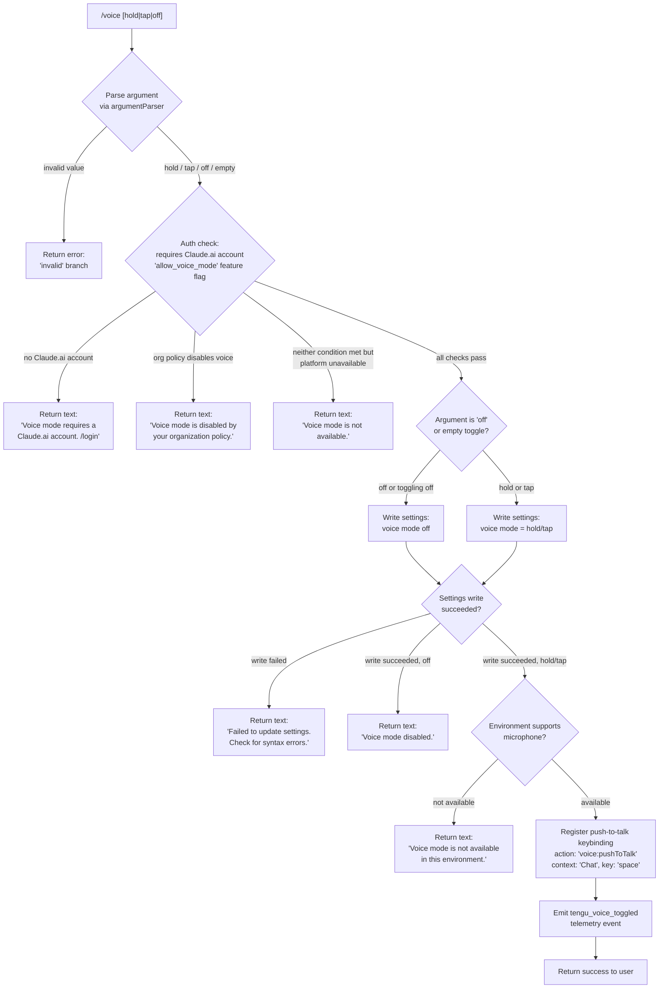

# `/voice`

> Analysis basis: CC v2.1.191 bundle.js (AST extraction + Claude interpretation)
> Minimum version: v2.1.191

---

## Overview

The `/voice` command toggles voice mode in Claude Code, allowing users to switch between `hold`, `tap`, and `off` input activation styles. It performs a series of eligibility checks (account type, organizational policy, environment capability) before modifying the user's voice mode setting and optionally registering a push-to-talk keybinding.

---

## Registration

| Field | Value |
|---|---|
| type | `local` |
| name | `voice` |
| description | `Toggle voice mode` |
| argumentHint | `[hold\|tap\|off]` |
| supportsNonInteractive | `false` |
| isHidden | `null` |
| module_id | `zWl` |
| load_inline | `true` |
| loc_byte | `13105592` |
| loc_byte_end | `13105834` |
| loc_line | `8778` |
| arbor_handler.name | `zOf` |
| arbor_handler.fqn | `claude-2.1.191::zOf` |
| arbor_handler.kind | `AsyncFunction` |
| arbor_handler.resolution_path | `module_id` |
| arbor_handler.n_hits | `1` |

Analysis basis: CC v2.1.191 bundle.js:+13105592

---

## Input Branching

The command handles 5+ distinct cases depending on authentication state, policy, environment, argument value, and settings write success. A Mermaid flowchart is used.



---

## Behavioral Spec

### Argument Parsing

```
function parseVoiceArgument(rawInput):
    trimmed = rawInput.trim()
    if trimmed is empty:
        return null  // treated as toggle
    if trimmed in ["hold", "tap", "off"]:
        return trimmed
    return "invalid"
```

Analysis basis: CC v2.1.191 bundle.js:+13102902 (literals: "hold", "tap", "off", "invalid")

---

### Authentication and Policy Gate

The handler (`zOf`) calls into the voice-mode availability checker (`vs`, reached via `Hyt`) before allowing any state change.

```
async function checkVoiceEligibility(appState):
    featureFlags = loadFeatureFlags(appState)  // reads 'allow_voice_mode'
    
    if not hasClaudeAiAccount(appState):
        return { allowed: false,
                 reason: "Voice mode requires a Claude.ai account. Please run /login to sign in." }
    
    if featureFlags.allow_voice_mode == false:
        return { allowed: false,
                 reason: "Voice mode is disabled by your organization's policy." }
    
    if not platformSupportsVoice():
        return { allowed: false,
                 reason: "Voice mode is not available." }
    
    return { allowed: true }
```

Analysis basis: CC v2.1.191 bundle.js:+13092226 (literal: `"allow_voice_mode"`), +13103026, +13103135, +13103217

The `allow_voice_mode` feature flag check is performed inside `vs` (the voice-availability function, called from `Hyt` at +13092282), which also consults product-feedback permissions at +13092226.

---

### Settings Write

When eligibility passes, the handler attempts to persist the new voice mode using the settings management subsystem (`uo`). The settings path resolves to the user-level settings file (`.claude/settings.json`).

```
async function applyVoiceModeChange(mode, appState):
    result = await writeUserSettings({ voiceMode: mode }, appState)
    
    if result.status == "error":
        return textMessage("Failed to update settings. Check your settings file for syntax errors.")
    
    if mode == "off":
        return textMessage("Voice mode disabled.")
    
    return null  // proceed to environment check
```

Analysis basis: CC v2.1.191 bundle.js:+13103505 (literal: "Failed to update settings…"), +13103643 (literal: "Voice mode disabled.")

---

### Push-to-Talk Keybinding Registration

After a successful write of `hold` or `tap`, the command registers (or updates) the push-to-talk keybinding via `QI`, passing a keybinding action descriptor.

```
function registerPushToTalkKeybinding(appState):
    keybindingDescriptor = {
        action: "voice:pushToTalk",
        context: "Chat",
        key: "space"
    }
    
    result = applyKeybinding(keybindingDescriptor, appState)  // QI
    
    if result.status == "action_not_found":
        // keybinding fallback telemetry fired (tengu_keybinding_fallback_used)
        pass
    
    return result
```

Analysis basis: CC v2.1.191 bundle.js:+13104853 (`QI` call), +13104856 (literal: `"voice:pushToTalk"`), +13104875 (literal: `"Chat"`), +13104882 (literal: `"space"`)

---

### Environment Capability Check

Before returning success for `hold`/`tap`, the handler checks whether the current runtime environment actually supports microphone access.

```
function checkMicrophoneAvailable(appState):
    if not environmentHasMicrophoneAccess():
        return textMessage("Voice mode is not available in this environment.")
    
    // On macOS, the permissions guidance is:
    // "System Settings → Privacy & Security → Microphone"
    return null
```

Analysis basis: CC v2.1.191 bundle.js:+13103887 (literal: "Voice mode is not available in this environment."), +13104394 (literal: "System Settings → Privacy & Security → Microphone")

---

### Telemetry Emission

On every successful voice mode state change (non-error path), the handler emits the `tengu_voice_toggled` event.

```
function emitVoiceToggleTelemetry(mode, appState):
    telemetry.emit("tengu_voice_toggled", {
        newMode: mode
    })
```

Analysis basis: CC v2.1.191 bundle.js:+13103588 (telemetry event `tengu_voice_toggled`)

---

### Settings Load Subsystem (called during eligibility)

The command's eligibility path requires fresh settings to be loaded. The settings loader (`SIr`/`vj`) reads the following settings layers in order:

1. `flagSettings` (feature flags)
2. `policySettings` (organizational policy)
3. `userSettings` (user-level, `.claude/settings.json`)
4. `projectSettings`
5. `localSettings` (`.claude/settings.local.json`)
6. SDK inline settings

Analysis basis: CC v2.1.191 bundle.js:+1316388, +1316410, +1319967, +1320018, +1320040, +1318616

---

## State & Side Effects

| Item | Detail |
|---|---|
| Telemetry | `tengu_voice_toggled` (+13103588); `tengu_keybinding_fallback_used` (+3979487) when keybinding action not found; `tengu_custom_keybindings_loaded` (+3970388); `tengu_keybinding_customization_release` (+3969968) |
| Settings write | Persists voice mode (`hold`/`tap`/`off`) to user settings via the `uo` settings-management subsystem |
| Keybinding registration | Registers `voice:pushToTalk` action bound to `space` in `Chat` context via `QI` (+13104853) |
| appState changes | Voice mode field updated; keybinding registry mutated |
| Sound | No sound side-effect found in depth-2 traversal |
| Feature flag read | Reads `allow_voice_mode` flag from policy/feature settings (+13092226) |
| Auth check | Verifies Claude.ai account presence before enabling voice |

---

## Version History

| Version | Change |
|---|---|
| v2.1.191 | Initial analysis |

---

## Common Mistakes

1. **Running `/voice hold` without a Claude.ai account** — the command silently returns an error message directing the user to `/login` rather than enabling voice mode; users may expect a prompt or interactive flow instead.
2. **Organization policy block** — if `allow_voice_mode` is `false` in policy settings, the command always returns the policy-disabled message regardless of what argument is passed, including `off`.
3. **Settings file syntax errors** — if `.claude/settings.json` has malformed JSON, the write will fail and the command returns a settings-error message rather than toggling voice mode; check the file manually.
4. **Environment without microphone access** — on headless or remote environments (e.g., SSH-only containers), `/voice hold` or `/voice tap` will succeed at the settings write but then return "Voice mode is not available in this environment." — the setting may be written but the mode is effectively non-functional.
5. **`/voice` with no argument** — treated as a toggle (null argument), not as a query of current state; there is no "print current voice mode" path.

---

## Appendix — Identifier Mapping

> For bundle debugging only. Identifiers change across versions.

| Identifier | Role |
|---|---|
| `zOf` | Main handler for `/voice` command (AsyncFunction) |
| `_yt` | Voice command entry dispatcher (calls eligibility and main logic) |
| `Per` | Voice prerequisite checker (auth + feature flag gate) |
| `_y` | Auth/credential resolution helper |
| `ad` | Credential accessor (reads API key / auth token) |
| `yA` | OAuth/auth state resolver |
| `jl` | First-party auth type checker |
| `uT` | Auth token utility |
| `iH` | Auth initialization / credential setup |
| `CMt` | Settings layer compositor |
| `ltt` | Settings logger/tracer |
| `nS` | Notification/signal dispatcher (voice state) |
| `Tzt` | Voice mode transition state object |
| `Hyt` | Voice availability checker entry point |
| `vs` | Voice eligibility evaluator (checks `allow_voice_mode`, account type, platform) |
| `Hvi` | Voice hardware interface probe |
| `gF` | Feature-flag reader |
| `Yi` | Essential-traffic / network category checker |
| `Qge` | Runtime environment query |
| `G4` | Voice platform capability detector |
| `Rr` | Telemetry/logging subsystem entry |
| `vj` | Settings loader orchestrator |
| `SIr` | Settings load-from-disk routine |
| `Ln` | File append / log writer |
| `wwt` | Settings flag set manager |
| `Yms` | Settings merge helper |
| `VTe` | Settings file path resolver |
| `Cj` | Settings layer combiner |
| `Kms` | SDK inline settings reader |
| `z2` | Runtime environment descriptor builder |
| `KOf` | Argument parser for `/voice` (trims and validates hold/tap/off/invalid) |
| `L6o` | Conversation context builder |
| `msm` | Auto-classifier input transformer |
| `wN` | API request executor (main model call) |
| `oW` | HTTP client / API provider adapter |
| `b2e` | Model compatibility checker |
| `lie` | Auth token fetcher for side queries |
| `CBp` | System prompt fragment finder |
| `SHo` | Request hash/dedup generator |
| `Ghn` | Agent context assembler |
| `aIn` | Sub-agent result aggregator |
| `aje` | Thread/worker job descriptor |
| `wD` | Structured output builder |
| `ZVa` | Response validator |
| `XSn` | Temperature/sampling config helper |
| `Txe` | Tool call assembler |
| `etn` | Message stack pop helper |
| `iD` | Deep-clone utility (wraps `structuredClone`) |
| `u7e` | Message stack push helper |
| `LOr` | Log record formatter |
| `wOr` | Warn/error de-duplicator |
| `Tr` | Telemetry recorder |
| `Oo` | Observable event emitter |
| `H1t` | Voice hardware initializer |
| `NF` | Native module feature detector |
| `uo` | Settings write / persistence manager |
| `sg` | Settings path builder |
| `EIr` | Settings write pipeline |
| `VC` | Config file validator |
| `WQ` | Config file reader |
| `jd` | Filesystem real-path resolver |
| `jin` | Config directory helper |
| `vn` | Directory-not-found error handler |
| `wTr` | Settings write timestamp recorder |
| `GUe` | Settings write result handler |
| `Iln` | Path resolution helper for settings |
| `Rvt` | Atomic file write helper (temp + rename) |
| `hXe` | `fsync`-error handler |
| `ius` | File property descriptor setter |
| `kH` | Cache clear on settings reload |
| `Yps` | Git-ignore / file filter for settings paths |
| `Dt` | Async-local-store settings accessor |
| `Gin` | Async store getter |
| `uTr` | User home directory resolver |
| `Ran` | Git ignore-check runner |
| `Kr` | Git subprocess executor |
| `BHu` | Global gitignore path expander |
| `Kps` | Git `ls-files` tracker |
| `c4` | `.claude` directory path builder |
| `Lt` | Settings write success reporter |
| `Le` | Error logger / telemetry sink |
| `fo` | Error string formatter |
| `rt` | String coercion utility |
| `Rmu` | Log ring-buffer manager |
| `a` | MCP server manager (top-level) |
| `s5e` | MCP server connection orchestrator |
| `S3` | MCP tool/resource registry updater |
| `zat` | MCP tool schema validator |
| `bY` | MCP server config applier |
| `B5` | MCP tool list builder |
| `kPn` | MCP error color formatter |
| `Vat` | MCP server state diff applier |
| `XF` | MCP connection slot factory |
| `mL` | MCP server logger |
| `ag` | MCP log entry appender |
| `Gn` | MCP event broadcaster |
| `vEa` | MCP capability hash computer |
| `Koo` | MCP cache key builder |
| `y0e` | MCP config hash function |
| `LAn` | MCP Bie schema validator |
| `xAn` | MCP schema hash helper |
| `wAn` | MCP schema wrapper |
| `ln` | MCP debug logger |
| `ZPn` | MCP transport dispatcher |
| `Cop` | MCP stdio/SSE connection handler |
| `vop` | MCP OAuth connection handler |
| `$2t` | MCP auth-cache lookup |
| `qs` | MCP async-store accessor |
| `a1n` | MCP cache path builder |
| `Xno` | MCP schema diff checker |
| `hL` | MCP skill counter/reporter |
| `nt` | Tool-use / notification dispatcher |
| `Dno` | MCP server name inclusion checker |
| `gn` | Global config save handler |
| `v` | Window-focus/blur activity tracker |
| `Hyc` | Activity history accessor |
| `_yc` | Visibility-state change handler |
| `Xc` | MCP error logger |
| `kEa` | Async generator / stream mapper |
| `GW` | Async iterator / observable factory |
| `Gar` | MCP connection result applier |
| `tI` | MCP cleanup scheduler |
| `wlt` | MCP reconnect/config-hash checker |
| `w_a` | MCP Fro connection type probe |
| `rGl` | Daemon status file writer |
| `HZ` | Daemon render/report helper |
| `ozt` | Daemon status path builder |
| `hGo` | MCP server hot-reload handler |
| `UPn` | MCP server suppression checker |
| `jn` | Timeout-with-abort helper |
| `QI` | Keybinding loader and registrar |
| `pwn` | Keybinding config parser entry |
| `bOt` | Keybinding config file reader/validator |
| `q8r` | Keybinding action extractor |
| `PW` | Keybinding notification dispatcher |
| `Ql` | Keybinding highlight renderer |
| `Bhe` | Keybinding config path builder |
| `cwn` | Keybinding structure validator |
| `iwn` | Keybinding entry enumerator |
| `W8r` | Keybinding key-string parser (detects duplicates) |
| `V8r` | Keybinding binding validator |
| `fwn` | Keybinding formatted-output builder |
| `J8r` | Keybinding display row formatter |
| `X8r` | Keybinding Grt display helper |
| `lNi` | Keybinding map-to-display transformer |
| `$8r` | Keybinding line assembler |
| `Aze` | Locale/language normalizer (reads `"en"`, lowercases, splits) |
| `kt` | Config snapshot + file watcher setup |
| `tEt` | Config file reader with backup support |
| `n4` | String prefix stripper |
| `L2o` | Config directory scanner |
| `R2o` | Config path joiner |
| `K9f` | Config file watcher registrar |
| `$vt` | File watch subscription helper |
| `Hpe` | Config hot-reload diff handler |
| `_i` | Source-map / module register hook |