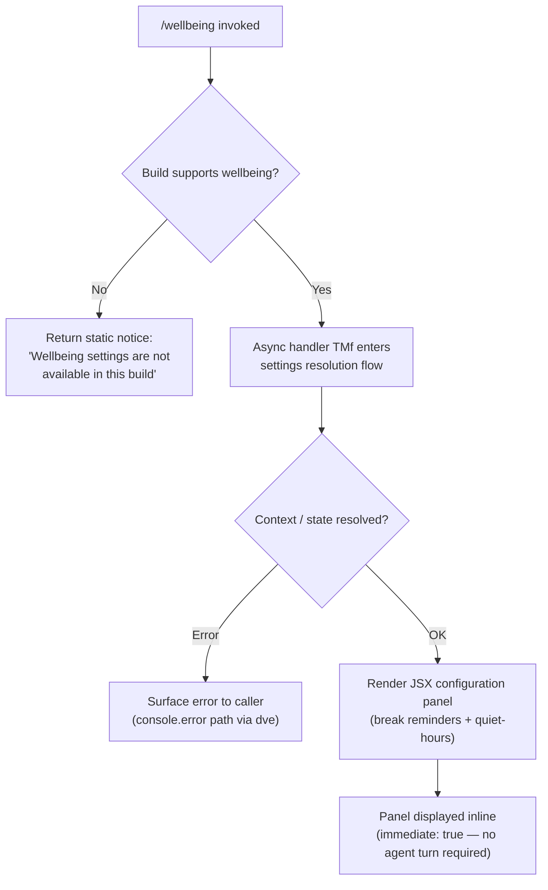

# `/wellbeing`

> Analysis basis: CC v2.1.191 bundle.js (AST extraction + Claude interpretation)
> Minimum version: v2.1.191

---

## Overview

`/wellbeing` (also reachable as `/breaks`, `/break-reminder`, or `/downtime`) is a local-JSX command that presents a configuration interface for optional break reminders and quiet-hours nudges. It is an `immediate` command, meaning it opens its UI panel synchronously without waiting for a prior agent turn to complete. In builds where wellbeing settings are unavailable, the command surfaces a static unavailability notice rather than the configuration panel.

---

## Registration

| Field | Value |
|---|---|
| type | `local-jsx` |
| name | `wellbeing` |
| description | Configure optional break reminders and quiet-hours nudges |
| aliases | `breaks`, `break-reminder`, `downtime` |
| immediate | `true` |
| module_id | `w6l` |
| load_inline | `true` |
| loc_byte | 12878469 |
| loc_byte_end | 12878722 |
| loc_line | 8644 |
| arbor_handler.name | `TMf` |
| arbor_handler.fqn | `claude-2.1.191::TMf` |
| arbor_handler.kind | `AsyncFunction` |
| arbor_handler.resolution_path | `module_id` |
| arbor_handler.n_hits | 0 |

Analysis basis: CC v2.1.191 bundle.js:+12878469

---

## Input Branching

Three distinct runtime paths exist: the feature is unavailable in the current build, the handler resolves successfully and renders the JSX settings panel, or the handler encounters an error during async setup.



Analysis basis: CC v2.1.191 bundle.js:+12877820 (unavailability string), +12878469 (registration block)

---

## Behavioral Spec

### 1. Unavailability Guard

Before any UI is rendered, the handler checks whether the current build exposes wellbeing settings. When the check fails, the command returns a human-readable notice immediately.

```
function handleWellbeing(context):
    if not buildSupportsWellbeing():
        return staticNotice("Wellbeing settings are not available in this build")
    return awaitMainHandler(context)
```

Unavailability string literal confirmed at: CC v2.1.191 bundle.js:+12877820

---

### 2. Absolute-Value Utility (`absoluteValueHelper`)

A small numeric utility (`AMf` in the bundle) calls `Math.abs` and operates on values near the constants `0`, `1`, and `120`. Based on context this is used internally for time-delta or interval calculations (e.g., computing elapsed minutes for reminder scheduling).

```
function absoluteValueHelper(value):
    result = Math.abs(value)
    // constants observed: 0, 1, 120
    return result
```

Analysis basis: CC v2.1.191 bundle.js:+12877560 (`Math.abs` call), +12877510 (constant 120), +12877674 (constant 0), +12877686 (constant 1)

---

### 3. Async Settings Handler (`wellbeingSettingsHandler` / `TMf`)

The Arbor-resolved primary handler is the `AsyncFunction` `TMf` (FQN `claude-2.1.191::TMf`), reached via `module_id` resolution (`w6l`). Its execution flow:

```
async function wellbeingSettingsHandler(commandContext):
    // Step 1: obtain current timestamp baseline
    now = Date.now()

    // Step 2: map over existing session/conversation context
    mappedContext = commandContext.map(entry => transformEntry(entry))

    // Step 3: delegate to context-aware renderer (wN)
    renderResult = await contextAwareRender(mappedContext, now)

    // Step 4: invoke side-query pipeline for classifier
    classifierResult = await sideQueryPipeline(renderResult)

    // Step 5: build and return JSX panel payload
    return buildJSXPanel(classifierResult)
```

Analysis basis: CC v2.1.191 bundle.js:+12877818 (handler entry), +16670769 (`Date.now`), +16670740 (`o.map`), +16670796 (`wN` call)

---

### 4. Conversation Context Formatter (`conversationFormatter` / `L6o`)

Called by the main handler to transform raw conversation history into a compact representation suitable for the side-query. Key behaviors:

- Truncates token-heavy message bodies to a maximum of **30** tokens (bundle literal: `30` at +16668949).
- Iterates over message turns, distinguishing `"user"` (+16668982) and `"assistant"` (+16668999) roles.
- Handles content blocks typed as `"text"` (+16669206), `"tool_result"` (+16669266), `"tool_use"` (+16669676), and `"tool"` (+16669446).
- Appends `" (error)"` suffix (+16669486) to errored tool result content.
- Applies a character budget of **300** per content block (+16669651) and a millisecond timestamp offset of **1000** ms (+16669144).
- Pushes formatted turns into a result array, then joins them.
- Uses `Array.isArray` to branch between single-content and multi-content block messages.

```
function conversationFormatter(messages, options):
    result = []
    for each message in messages:
        role = message.role   // "user" | "assistant"
        content = message.content
        if Array.isArray(content):
            for each block in content:
                formatted = formatBlock(block, budgetChars=300, truncateTokens=30)
                result.push(formatted)
        else:
            result.push(formatBlock(content, budgetChars=300, truncateTokens=30))
    return result.join(separator)
```

Analysis basis: CC v2.1.191 bundle.js:+16668916, +16668940, +16669122, +16669138, +16669161, +16669206, +16669266, +16669424, +16669446, +16669486, +16669651, +16669676, +16669687, +16669749, +16669769

---

### 5. Auto-Classifier Input Builder (`autoClassifierInputBuilder` / `msm`)

Constructs the structured input payload sent to the context-tip classifier side-query:

```
function autoClassifierInputBuilder(conversationId, messages, store):
    entry = store.get(conversationId)
    payload = entry.toAutoClassifierInput()
    serialized = jsonStringify(payload)   // ke → JSON.stringify
    return serialized
```

The resulting payload is passed to the `har` helper for header/request construction.

Analysis basis: CC v2.1.191 bundle.js:+16669860, +16669905, +16669959, +16669999

---

### 6. Side-Query / Context-Tip Classifier Pipeline (`contextAwareRender` / `wN`)

This is the dominant sub-system reached from the handler. It orchestrates:

1. **API client setup** (`oW`) — builds HTTP headers including `User-Agent`, `X-Claude-Code-Session-Id`, `x-claude-remote-container-id`, `x-client-app`, `x-claude-code-agent-id`, and `x-claude-code-parent-agent-id`.
2. **OAuth token resolution** — token refresh check logs `"[API:auth] OAuth token check starting"` and `"[API:auth] OAuth token check complete"`.
3. **Model selection** — candidate models referenced in literals include `claude-opus-4-0`, `claude-sonnet-4-0`, `claude-opus-4-1`, `claude-opus-4-5`, `claude-sonnet-4-5`, `claude-haiku-4-5`.
4. **Request dispatch** — uses `globalThis.fetch` with an `AbortSignal.timeout` of **10 000 ms** (+2350705) and base URL `https://api.anthropic.com` (+2350582).
5. **Response classification** — outcomes mapped to literals `"tip"`, `"tip_ineligible"`, `"no_tip"`, `"none"`, `"parse_failure"`.
6. **Worker pool management** (`L`) — calls `shiftGraceClocksForward`, `respawnIfIdleStale`, `retireIfSettled`, and low-memory retirement path guarded by free-memory check (`X8l.freemem`).

```
async function contextAwareRender(formattedContext, now):
    client = buildAPIClient(headers={...})
    token  = await resolveOAuthToken(client)
    model  = selectModel(availableModels)
    signal = AbortSignal.timeout(10000)
    response = await globalThis.fetch(API_URL, {signal, ...})
    outcome = classifyResponse(response)
    // outcome ∈ { "tip", "tip_ineligible", "no_tip", "none", "parse_failure" }
    return outcome
```

Analysis basis: CC v2.1.191 bundle.js:+8937282, +8937388, +8937420, +8937429, +8937449, +8937484, +8937499, +8937516, +8937525, +8938174, +8938295, +8938311, +8938627, +8938643, +8938692, +8938735, +8938785, +8938970, +8939029, +8939276, +8939287, +8939316, +8939412, +8939430, +8939465

---

### 7. JSX Panel Construction (`buildJSXPanel` / `S4`, `cSt`)

After classification, the handler assembles the React JSX tree for the settings panel:

```
function buildJSXPanel(classifierOutcome):
    sections = []
    sections.push(buildBreakReminderSection())
    sections.push(buildQuietHoursSection())
    panel = renderJSX(sections, outcome=classifierOutcome)
    return panel
```

The `cSt` function receives the `W` (render-tree helper) and `Pe` (primitive element factory) utilities to construct the final panel tree.

Analysis basis: CC v2.1.191 bundle.js:+16670806, +16671264, +16672223, +16672273

---

### 8. Schema Validation (`schemaValidator` / `D6n`)

User-supplied settings values are validated via a `safeParse` call before being persisted:

```
function schemaValidator(input):
    result = settingsSchema.safeParse(input)
    if not result.success:
        return { valid: false, errors: result.error }
    return { valid: true, data: result.data }
```

Analysis basis: CC v2.1.191 bundle.js:+8934129 (`t.safeParse`), +16671410

---

## State & Side Effects

| Item | Detail |
|---|---|
| Telemetry — `tengu_context_tip_classifier_outcome` | Fired when the side-query classifier resolves; carries the outcome (`tip`, `tip_ineligible`, `no_tip`, `none`, `parse_failure`). loc_byte: +16672225 |
| Telemetry — `tengu_api_success` | Fired on successful API response from the side-query fetch. loc_byte: +8938998 |
| Telemetry — `tengu_feature_ok` | Fired when a feature flag check passes. loc_byte: +1025725 |
| Telemetry — `tengu_feature_bad` | Fired when a feature flag check fails. loc_byte: +1025792 |
| Telemetry — `tengu_prompt_cache_1h_config` | Fired during cache-control configuration for 1-hour prompt caching. loc_byte: +13616098 |
| Telemetry — `tengu_lone_surrogate_sanitized` | Fired when a lone surrogate code-point is sanitized in message content. loc_byte: +8938694 |
| Telemetry — `tengu_bg_retire_pinned_low_mem` | Fired when pinned background workers are retired due to low memory. loc_byte: +17375231 |
| Telemetry — `tengu_bg_prewarm_per_sweep` | Fired per background worker pool sweep during prewarm. loc_byte: +17375352 |
| Telemetry — `tengu_bg_retire_grace_bridged_min` | Fired when a grace-clock retirement is bridged to a minimum threshold. loc_byte: +13163592 |
| Telemetry — `tengu_bg_attach_upgrade` | Fired when a background worker attachment is upgraded. loc_byte: +13163664 |
| appState changes | Break-reminder and quiet-hours preferences written via `t.set` (gsm, loc_byte: +16670056) and `o.set` (L6o, loc_byte: +16669687) into the settings store. |
| OAuth side-effect | Token refresh may be triggered; logs `"[API:auth] OAuth token check starting"` / `"[API:auth] OAuth token check complete"`. loc_byte: +3026414, +3026468 |
| Worker pool | Background worker pool sweep is triggered via `L.map` (+8938284); may spawn, respawn, or retire workers. |
| Error logging | `console.error` called by `dve` on API-level errors (+3025354) and by `Kdn` on proxy-auth helper failures (+1866233). |
| Sound | <!-- TODO: not found in depth-2 traversal; needs --depth 4 --> |
| Hook registration | <!-- TODO: not found in depth-2 traversal; needs --depth 4 --> |

---

## Version History

| Version | Change |
|---|---|
| v2.1.191 | Initial analysis |

---

## Common Mistakes

1. **Invoking via the wrong alias** — `/wellbeing`, `/breaks`, `/break-reminder`, and `/downtime` are all equivalent. Using an alias that does not match any of these four names (e.g. a typo like `/breakreminder` without the hyphen) will not route to this command.
2. **Expecting changes in headless / CI builds** — the command's unavailability guard (`"Wellbeing settings are not available in this build"`) will fire silently in build configurations that strip the wellbeing module. No error is thrown; only the static notice is returned.
3. **Assuming synchronous completion** — despite `immediate: true` (which bypasses agent-turn gating), the internal handler is an `AsyncFunction` that awaits an API side-query. UI updates arrive asynchronously after the panel first appears.
4. **Conflating break-reminder and quiet-hours settings** — the two features are configured in separate sections of the JSX panel and stored under distinct keys in the settings store. Changing one does not affect the other.
5. **Expecting OAuth-free operation** — even though this command does not invoke the main Claude model, the side-query classifier path still triggers OAuth token resolution and may prompt a re-login if the token has expired.

---

## Appendix — Identifier Mapping

> For bundle debugging only. Identifiers change across versions.

| Identifier | Role |
|---|---|
| `bMf` | Module-level initialization helper for wellbeing module |
| `AMf` | Absolute-value / time-delta utility (calls `Math.abs`) |
| `TMf` | Primary async handler for `/wellbeing` (Arbor-resolved, `AsyncFunction`) |
| `e` | Inner command execution function; dispatches to `L6o`, `wN`, `S4`, etc. |
| `L6o` | Conversation context formatter (truncates, formats message turns) |
| `gsm` | Settings store setter (calls `t.set`) |
| `r` | Result accumulator / CLI exit helper (`Cs`) |
| `Cs` | CLI error/exit dispatcher (calls `nqe`, `fT`, `process.exit`) |
| `har` | HTTP header/request builder |
| `hx` | Character-level string slicer (surrogate-aware, uses `charCodeAt`) |
| `o` | Output formatter / stream writer (calls `s.map`, `i.padEnd`) |
| `s` | Async task tracker (calls `r.add`, `i.finally`, `r.delete`) |
| `i` | Stream/channel pair handler (calls `n.close`, `r.close`) |
| `msm` | Auto-classifier input builder (calls `toAutoClassifierInput`, `JSON.stringify`) |
| `n` | String normalizer (calls `i.toLowerCase`) |
| `ke` | JSON serializer wrapper (`JSON.stringify`) |
| `wN` | Context-aware side-query renderer / top-level API orchestrator |
| `xf` | Internal fetch wrapper (calls `wt`) |
| `wt` | Low-level transport function (calls `ux`) |
| `oW` | Full API client factory (headers, auth, model selection, request dispatch) |
| `mz` | Module metadata accessor |
| `p3r` | String line parser (split, trim, indexOf, slice) |
| `Ks` | Background-context helper (calls `HCe`) |
| `Mz` | Error message formatter (calls `$hn`; references GitHub issues URL) |
| `GPr` | URL encoder (calls `e.replace`, `encodeURIComponent`) |
| `T` | HTTP response/type classifier (includes, toUpperCase, trim, etc.) |
| `rt` | Primitive string coercion helper (calls `String`) |
| `Ng` | Token refresh orchestrator (calls `rAn`) |
| `XKs` | Boolean coercion wrapper (calls `Boolean`) |
| `_y` | Agent/session identity resolver (calls `ad`, `yA`, `jl`, `jo`, `uT`, `iH`, `CMt`, `ltt`) |
| `e_` | Environment/config accessor |
| `_ud` | Zod-based config validator (calls `uT`, `Zet`) |
| `xr` | Cross-reference / context resolver |
| `Kdn` | Proxy-auth helper executor (timeout 30 000 ms; logs errors) |
| `Iud` | Request-ID / UUID generator and cache (calls `yfi.randomUUID`, `Object.defineProperty`) |
| `PH` | Mantle auth provider (calls `Sxt`, `lWu`, `_r`, `IFe`) |
| `G2` | Locale/UI helper (calls `Imu`, `dUe`) |
| `fy` | Token/credential resolver (calls `rt`, `ol`, `jU`, `tz`, `iJe`, `uMs`, `Mxr`, `Oxr`) |
| `Tud` | Request finalizer (calls `Sfi`, `_fi`, `_r`) |
| `yud` | Provider-type switch (handles `anthropicAws`, `vertex`, `foundry`, `gateway`, `firstParty`) |
| `SCe` | Stream cache / event-source manager (calls `Date.now`, `Promise.resolve`, `Ddr`, `ezu`, `wZt`) |
| `Rdr` | Request-duration recorder (calls `Date.now`) |
| `pMt` | Header key normalizer (`Object.entries`, `r.toLowerCase`) |
| `dve` | SDK error logger (calls `console.error`) |
| `BSn` | Response status handler (calls `NI`, `Es`, `ao`, `dUe`) |
| `D` | Output stream writer (calls `y0c`, `up`, `T`, `Le`, `tfm`, `d.write`) |
| `x` | Debounced event-cache manager (calls `eR`, `v.delete`, `Date.now`, `v.get`, `rge`, `v.set`; 60 000 ms timeout) |
| `v` | Focus/blur state tracker (`"focused"`, `"blurred"`; 3 600 000 ms window, 0.8 threshold) |
| `w` | Generic utility / shared helper |
| `Ooe` | Environment prefix detector (calls `PPc.find`, `e.startsWith`, `JZt`) |
| `nv` | Notification helper (calls `iH`) |
| `yA` | Agent-profile builder (calls `ogn`, `ad`, `ltt`, `Pj`, `cR`, `rt`, `Dj`, `Vs`, `rB`, `wFe`, `emi`, `tmi`) |
| `ACe` | WIF token-exchange handler (calls `TZe`, `e.provider`, `we`, `String`, `Re`, `izu`, `T`) |
| `TZe` | WIF credentials resolver (calls `fetch`, `AbortSignal.timeout` 10 000 ms, `Promise.all`) |
| `I` | Token-bucket / rate-limiter (calls `Math.max`, `Math.floor`, `k.preventDefault`) |
| `h` | Session store accessor (calls `s`) |
| `b2e` | Model compatibility checker (calls `ao`, `PH`, `o1`, `t.includes`) |
| `ao` | Inference-profile prefix checker (calls `PQe`, `l_`, `e.includes`, `ubt`, `sp`) |
| `o1` | Request wrapper (calls `_r`) |
| `lie` | Auth-token cache (calls `$At`, `n.get`, `vOr`) |
| `$At` | Auth-state store accessor |
| `vOr` | Foundry resource-ID normalizer (calls `e.replace`, `COr`) |
| `_` | Model-list manager |
| `a` | Model-entry accessor (calls `s5e`, `Gar`, `w_a`, `s.get`, `T`, `s.values`, `hGo`) |
| `CBp` | Model finder (calls `e.find`, `n.find`) |
| `SHo` | SHA-256 hasher (calls `JVa.createHash`) |
| `Ghn` | User-agent string builder (calls `ol`, `_r`, `uu`, `$hn`, `hCe`, `T`) |
| `ol` | String padding/formatting helper (calls `String`) |
| `_r` | Renderer / React element factory |
| `uu` | String template helper (calls `Ymn`) |
| `$hn` | AsyncLocalStorage store reader (calls `YKs.getStore`) |
| `hCe` | Host/context extractor |
| `aIn` | Array input normalizer (calls `_r`) |
| `aje` | Message-array transformer (calls `rt`, `_r`, `To`, `dpr`, `nt`, `ppr`, …) |
| `To` | Turn object builder (calls `_y`, `rB`, `Vs`) |
| `dpr` | Display-prefix resolver |
| `nt` | Background-worker node factory (calls `IDt`, `CDt`, `B4`, `RTn`, `bDt.add`, `gW.has`, `gW.get`, `kt`) |
| `ppr` | Post-processing reducer |
| `wD` | Worker-dispatch helper (calls `C3r`, `A2e`) |
| `C3r` | React-tree resolver (calls `_r`) |
| `A2e` | Async element factory (calls `rt`, `mZ`) |
| `L` | Background worker pool manager (sweep, respawn, retire, prewarm) |
| `V` | Worker-pool state machine (shiftGraceClocksForward, respawnIfIdleStale, retireIfSettled) |
| `Nzt` | System memory probe (calls `Yer`, `X8l.freemem`) |
| `J8l` | Worker grace-clock retirement (calls `nt`; constant 480 at +13163628) |
| `I3e` | Checkpoint file manager (calls `wb.lstat`, `wb.rm`, `wb.readFile`, `vn`, `VPd`) |
| `Le` | Agent-startup logger (calls `fo`, `rt`, `Yi`, `Rmu`, `sXe.push`, `GQ.logError`) |
| `U` | Active-worker set |
| `Gn` | Generic node accessor (calls `t`) |
| `W` | Shared render-tree helper |
| `j` | Worker lifecycle handle (calls `i`, `F`) |
| `Xer` | Worker attach/upgrade helper (calls `nt`) |
| `q` | Backspace/key event handler (calls `K.preventDefault`, `F`) |
| `ZVa` | Structured-output schema builder |
| `sp` | String replacement utility (calls `e.replace`) |
| `XSn` | Request-temperature injector (calls `sW`, `ao`, `n.includes`) |
| `av` | Array mapper (calls `e.map`) |
| `Txe` | Cache-control annotation helper (calls `Ca`, `Array.isArray`, `T`, `P4`, `Sc`, `wt`, `ke`) |
| `P4` | Random-bytes ID generator (calls `kt`, `x2o.randomBytes`, `gn`, `T`) |
| `Sc` | Scope-context accessor (calls `_y`, `kt`) |
| `etn` | Tool-use block extractor (calls `t.pop`, `Array.isArray`, `Qen`, `t.push`, `Object.keys`) |
| `Qen` | Block-type classifier (calls `Jen`, `ANc.test`) |
| `iD` | Deep clone utility (calls `structuredClone`) |
| `u7e` | Tool-result block extractor (calls `n.pop`, `Array.isArray`, `Qen`, `Zen`, `n.push`, `Object.keys`) |
| `Zen` | Result-block normalizer (calls `i7o`, `e.replace`) |
| `Ve` | Version/environment accessor (calls `eze`) |
| `eze` | Environment constant store |
| `LOr` | OAuth-token parser (calls `_r`, `l7s`) |
| `l7s` | Token-body parser (match, split, trim, every, regex tests) |
| `wOr` | Permission/scope set manager (calls `vOr`, `$At`, `r.get`, `t.every`, `o.has`, `s.add`, `r.set`, `T`) |
| `mbe` | Metrics/usage accumulator |
| `Tr` | Terminal/display helper (calls `lh`, `Ve`) |
| `lh` | Layout helper (calls `eze`) |
| `Oo` | Output/progress indicator (calls `eze`) |
| `H1t` | Workspace agent supervisor (calls `v3i`, `Rot`, `h1t`) |
| `v3i` | Agent-thread runner (calls `rOd`, `Le`) |
| `Rot` | Rotation/restart controller (calls `lh`) |
| `h1t` | Health-check ticker (calls `Rot`, `g1t`) |
| `NF` | Named agent dispatcher (calls `nOd`, `xD`, `Le`) |
| `nOd` | Agent-name resolver (handles `agent:builtin:`, `agent:custom:`, `agent:` prefixes) |
| `xD` | Thread-type discriminator (calls `e.startsWith` with `"repl_main_thread"`) |
| `kAt` | Cache-annotation key generator |
| `S4` | JSX settings panel root builder (calls `ev`, `PPr`) |
| `ev` | Event emitter / callback registrar |
| `PPr` | Panel props resolver (calls `zp`) |
| `zp` | Zod schema factory (calls `P1e`, `T4s`, `A4s`, `bxt`, `_r`) |
| `usm` | User-settings mapper (calls `csm`) |
| `csm` | Content-section mapper (calls `e.map`) |
| `hsm` | HTML/text section builder (calls `t.push`, `t.join`) |
| `M6n` | Model-name finder (calls `e.find`) |
| `cSt` | JSX container compositor (calls `W`, `Pe`) |
| `Pe` | Primitive JSX element factory (calls `eze`) |
| `Re` | React render helper (calls `W`, `Pe`) |
| `D6n` | Settings schema validator (calls `t.safeParse`) |
| `we` | Render-with-fallback helper (calls `W`, `Pe`) |
| `Ae` | String coercion display helper (calls `String`) |

---

Note: index built via Arbor fallback; some signals (telemetry, literals) may be missing — see arbor-fallback.js.