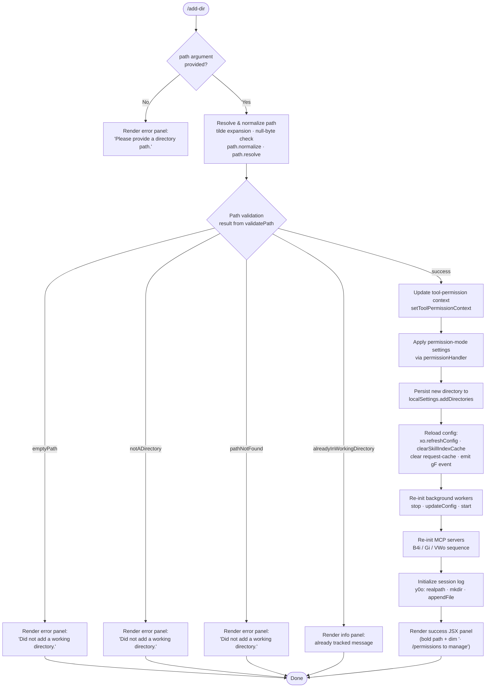

# `/add-dir`

> Analysis basis: CC v2.1.193 bundle.js (AST extraction + Claude interpretation)
> Minimum version: v2.1.193

---

## Overview

`/add-dir` registers an additional filesystem directory as a working directory for the current Claude Code session. It validates the supplied path (resolving tilde expansion, symlinks, and checking existence), updates the session's tool-permission context and local settings, refreshes MCP server configurations, re-initialises background workers, and renders a JSX confirmation or error panel in the terminal.

---

## Registration

| Field | Value |
|---|---|
| type | `local-jsx` |
| name | `add-dir` |
| description | Add a new working directory |
| argumentHint | `<path>` |
| module_id | `Nbl` |
| load_inline | `true` |
| loc_byte | `11305706` |
| loc_byte_end | `11305854` |
| loc_line | `7100` |
| arbor_handler.name | `Cpf` |
| arbor_handler.fqn | `claude-2.1.193::Cpf` |
| arbor_handler.kind | `AsyncFunction` |
| arbor_handler.resolution_path | `module_id` |
| arbor_handler.n_hits | `0` |

Analysis basis: CC v2.1.193 bundle.js:+11305706

---

## Input Branching

The handler produces six distinct outcome branches (path validation failures, already-tracked, and success), plus a top-level empty-input guard — Mermaid is required.



Analysis basis: CC v2.1.193 bundle.js:+11304495 (handler entry `Cpf`), +3958059 (`emptyPath`), +3958157 (`notADirectory`), +3958302 (`pathNotFound`), +3958434 (`alreadyInWorkingDirectory`), +3958562 (`success`)

---

## Behavioral Spec

### 1. Entry point — `addDirHandler` (bundle: `Cpf`)

```
async function addDirHandler(commandContext):
    rawPath = commandContext.args.trim()

    result = await validateAndResolvePath(rawPath)
    // result.status ∈ {emptyPath, notADirectory, pathNotFound,
    //                   alreadyInWorkingDirectory, success}

    if result.status != "success":
        return renderOutcomePanel(result)

    // --- mutate session state ---
    commandContext.setToolPermissionContext(result.resolvedPath)
    applyPermissionMode(commandContext)          // _H
    persistDirectoryToLocalSettings(result.resolvedPath) // via _H / n.set
    refreshAllConfig(commandContext)             // xo.refreshConfig, o6, gF.emit, p0
    restartBackgroundWorkers(commandContext)     // d path (supervisor stop/updateConfig/start)
    reconnectMcpServers(commandContext)          // B4i, Gi, VWo
    initSessionLog(result.resolvedPath)          // y0o: realpath, mkdir, appendFile

    return renderSuccessPanel(result)
```

Analysis basis: CC v2.1.193 bundle.js:+11304495

---

### 2. Path resolution — `validateAndResolvePath` (bundle: `Uot` + `ds`)

```
function validateAndResolvePath(rawPath):
    if rawPath is empty or null:
        return { status: "emptyPath" }

    // null-byte guard
    if rawPath.includes("\0"):
        raise TypeError("Path contains null bytes")  // +1096964

    // tilde expansion
    if rawPath.startsWith("~/"):
        rawPath = os.homedir() + rawPath.slice(1)    // +1097061, +1097092

    // normalize & make absolute
    normalizedPath = path.normalize(rawPath)          // +1097023
    resolvedPath   = path.resolve(normalizedPath)     // +1097275

    // Windows drive-letter normalisation (if applicable)  // +1097161

    // filesystem stat
    try:
        stat = fs.stat(resolvedPath)                  // +3958112
    catch ENOENT:
        return { status: "pathNotFound" }             // +3958302

    if not stat.isDirectory():
        return { status: "notADirectory" }            // +3958157

    // check already tracked
    currentDirs = appState.getAppState().working_directory  // +10994517
    if resolvedPath is already in currentDirs:
        return { status: "alreadyInWorkingDirectory" }      // +3958434

    return { status: "success", resolvedPath }        // +3958562
```

Analysis basis: CC v2.1.193 bundle.js:+3958078 (`validateAndResolvePath` / `Uot`), +1096711 (`ds`)

---

### 3. Permission-mode application — `applyPermissionMode` (bundle: `_H`)

```
function applyPermissionMode(ctx):
    // Merge new directory into permission rules stored in localSettings
    permContext = ctx.getPermissionMap()     // n (Map)

    for action in ["allow", "deny", "alwaysAsk"]:    // +5395291 +5395331 +5395356
        rules = buildRulesFor(action,
                    ["alwaysAllowRules","alwaysDenyRules","alwaysAskRules"])
                                            // +5395299 +5395338 +5395356
        applyRuleSet(permContext, rules,
                     mode ∈ {"addRules","replaceRules","removeRules"})
                                            // +5395106 +5395454 +5396111

    // guard: bypassPermissions mode is rejected when
    // disableBypassPermissionsMode is set or session was not launched in
    // bypassPermissions mode — emits tengu_disable_bypass_permissions_mode
    // and logs the rejection message                  // +3405833, +5394830

    removeDirectories = ctx.removeDirectories         // +5396495
    if removeDirectories set:
        remove matching entries from permContext       // n.delete +5396723
```

Analysis basis: CC v2.1.193 bundle.js:+5394828 (`_H` entry), +5395141 (`Lp` call), +5395263 (`ke`)

---

### 4. App-state lookup — `getWorkingDirectoryState` (bundle: `Ur`)

```
function getWorkingDirectoryState():
    appState = e.getAppState()                // +10994412
    dirs     = appState.findLast(type == "working_directory")  // +10994492, +10994517
    allowed  = appState.findLast(type == "allowed_tools")      // +10994572
    denied   = appState.findLast(type == "disallowed_tools")   // +10994627
    avoid    = appState.findLast(type == "avoid_prompts")      // +10994688
    mode     = appState.findLast(type == "permission_mode")    // +10994790
    bypass   = appState.findLast(type == "bypassPermissions")  // +10994821
    return { dirs, allowed, denied, avoid, mode, bypass,
             session, effort, model, max_thinking_tokens,
             flag_settings }  // +10995120 +10995145 +10995158 +10995170 +10995196
```

Analysis basis: CC v2.1.193 bundle.js:+10994412

---

### 5. Settings persistence — `persistToLocalSettings` (bundle: `_H` / `n.set`)

```
function persistToLocalSettings(resolvedPath):
    settings = loadSettingsFromDisk()          // co / dW (+1341423, +1341479)
    current  = settings.localSettings         // literal "localSettings" +11304578
                 .addDirectories              // literal "addDirectories" +11304531

    if resolvedPath not in current:
        current.push(resolvedPath)
        writeSettingsFile(settings)            // wgs: vIe.writeFile / appendFile
```

Analysis basis: CC v2.1.193 bundle.js:+11304578, +11304531

---

### 6. Config refresh sequence — `refreshAllConfig` (bundle: calls in `Cpf`)

```
function refreshAllConfig(ctx):
    p0()                   // clear skill-index cache + JMo  +11304689, +13423683, +13423705
    RG()                   // reload rule graph (DYn)         +11304694, +11297386
    o6()                   // clear request cache (rqt.clear) +11304699, +11117631
    gF.emit(event)         // broadcast config-changed event  +11304704
    xo.refreshConfig()     // reload xo config object         +11304714
```

Analysis basis: CC v2.1.193 bundle.js:+11304689–+11304714

---

### 7. Background worker restart (bundle: `d` / supervisor path)

```
function restartBackgroundWorkers(ctx):
    supervisor = ctx.getSupervisor()           // "supervisor" +17497914
    supervisor.stop()                          // E.stop  +17498182
    supervisor.updateConfig(newConfig)         // A.updateConfig +17498311
    supervisor.start()                         // A.start +17498329

    // daemon-control telemetry emitted via R$ / Hj
    // tengu_daemon_config_reload fired         +17498707
```

Analysis basis: CC v2.1.193 bundle.js:+17498182, +17498311, +17498329

---

### 8. MCP server reconnect (bundle: `B4i` → `Gi` → `VWo`)

```
function reconnectMcpServers(ctx):
    // Phase 1: clear stale cache entries
    clearMcpCache()                    // $y: xte.delete  +4295597

    // Phase 2: for each configured MCP server slot
    for slot in mcpSlots:
        stat = Xb.lstat(slot.path)     // +4295738
        if stat.isFile():
            // read & parse JSON config  Bt: JSON.parse  +193822
            config = Xb.readFile(slot.path, "utf-8")  // +4296676
            if config changed (Number.isFinite check): // +4297105
                xte.set(slot, config)  // +4296057

    // Phase 3: apply connection results
    VWo(ctx)  // reconcile live clients vs config
              // applyMcpUpdate, sn, cleanup  +16976223 +16976345 +16976528
```

Analysis basis: CC v2.1.193 bundle.js:+4300385 (`B4i`), +4295638 (`Gi`), +16976773 (`VWo`)

---

### 9. Session log initialisation — `initSessionLog` (bundle: `y0o`)

```
async function initSessionLog(resolvedPath):
    canonicalPath = _l.realpath(resolvedPath)   // +13439258
    logDir  = ih.join(canonicalPath, ...)       // +13439416
    await _l.mkdir(logDir, { recursive: true,
                             mode: 0o700 })     // +13439610, 0o700 = 448 +13439652
    await _l.appendFile(logPath, header,
                        { mode: 0o600 })        // +13439761, 0o600 = 384 +13439789
    // environment: "production" / "test"        +13438916, +13439012
```

Analysis basis: CC v2.1.193 bundle.js:+13439223 (`y0o`), +13439258, +13439610

---

### 10. JSX rendering — `renderSuccessPanel` / `renderErrorPanel` (bundle: `Cpf` JSX section)

```
function renderSuccessPanel(result):
    dirLabel = result.isFirstDir
               ? "the current working directory"      // +3959147
               : "the additional working directory"   // +3959179

    return JSX:
        <Box>
          <Text bold>{resolvedPath}</Text>            // St.bold +11304792
          <Text dim>{"· /permissions to manage"}</Text>  // +11305085
        </Box>

function renderErrorPanel(status):
    message = {
        emptyPath:   "Please provide a directory path.",  // +3958647
        default:     "Did not add a working directory.",  // +11305203
    }[status] ?? "Unknown error"                          // +11304977
    return JSX error box
```

Analysis basis: CC v2.1.193 bundle.js:+11305137 (BSe.jsx), +11304792 (St.bold), +11305078 (St.dim)

---

## State & Side Effects

| Item | Detail |
|---|---|
| Telemetry | `tengu_disable_bypass_permissions_mode` (+3405833) — fired when `bypassPermissions` mode is rejected |
| Telemetry | `tengu_daemon_yield` (+17503119) — daemon yields to foreground |
| Telemetry | `tengu_daemon_config_reload` (+17498707) — emitted after supervisor restart |
| Telemetry | `tengu_feature_ok` (+1026754) — feature flag check success |
| Telemetry | `tengu_feature_bad` (+1026821) — feature flag check failure |
| Telemetry | `tengu_daemon_control` (+17520352) — daemon start/stop lifecycle |
| Telemetry | `tengu_bg_state_read_transient` (+4296462) — background state read |
| Telemetry | `tengu_feature_sad` (+1026902) — feature degraded |
| appState changes | New entry appended to `addDirectories` list in `localSettings` (+11304531, +11304578) |
| appState changes | `working_directory`, `allowed_tools`, `disallowed_tools`, `permission_mode`, `bypassPermissions` fields potentially updated (+10994517 … +10994821) |
| Config refresh | `xo.refreshConfig()` called; skill-index cache cleared; request cache (`rqt`) cleared; `gF` event emitted |
| MCP servers | All MCP server slots stopped, config-updated, and restarted via `B4i` / `Gi` / `VWo` |
| Session log | Directory created with mode `0o700` (448); log file appended with mode `0o600` (384) |
| Hook registration | `Ei` → `a7o.register` (+68040) — registers a cleanup/hook during the log-write pipeline |
| Sound | None detected in depth-2 traversal |
| CLI flag | `--add-dir` flag mirrors this command at CLI level (+11304744) |

---

## Version History

| Version | Change |
|---|---|
| v2.1.193 | Initial analysis |

---

## Common Mistakes

1. **Omitting the path argument** — `/add-dir` with no argument returns "Please provide a directory path." (+3958647). Always supply `<path>`.
2. **Passing a file path instead of a directory** — the stat check rejects non-directories with `notADirectory` (+3958157), returning "Did not add a working directory."
3. **Passing a non-existent path** — results in `pathNotFound` (+3958302). Ensure the directory exists before invoking the command.
4. **Re-adding an already-tracked directory** — the command detects duplicates and returns `alreadyInWorkingDirectory` (+3958434) without mutating state.
5. **Expecting immediate MCP tool availability** — after `/add-dir`, MCP servers go through a full stop/updateConfig/start cycle; tools from the new directory's MCP config may take a moment to appear.
6. **Bypassing permissions mode when it is disabled** — attempting to set `bypassPermissions` mode is silently rejected and logged when `disableBypassPermissionsMode` is set (+5394830); the rest of the add-dir flow still completes.

---

## Appendix — Identifier Mapping

> For bundle debugging only. Identifiers change across versions.

| Identifier | Role |
|---|---|
| `Cpf` | Main handler — `addDirHandler` (AsyncFunction, entry point) |
| `Ur` | App-state working-directory lookup function |
| `F7n` | Allowed-tools state reader |
| `B7n` | Disallowed-tools state reader |
| `F$` | Permission-mode / bypass-permissions state resolver |
| `it` | Inner permission-mode evaluation helper |
| `KPt` | Permission mode check sub-helper A |
| `zPt` | Permission mode check sub-helper B |
| `H5` | Permission mode check sub-helper C |
| `lCn` | Permission-mode cache lookup/store |
| `kt` | Permission-mode finalisation helper |
| `_H` | Permission-mode application and settings-map mutator |
| `T` | Path-normalisation / string-formatting utility |
| `qFc` | Path character encoding helper |
| `c7o` | Path character encoding sub-helper |
| `ke` | JSON.stringify wrapper utility |
| `Lc` | Path-shortening / last-component helper |
| `KXo` | Path prefix map builder |
| `iYe` | Output writer wrapper |
| `OXo` | Low-level write helper |
| `XFc` | Log-file write pipeline orchestrator |
| `P7e` | Buffered write scheduler (setTimeout / setImmediate) |
| `Ame` | Log join + flush helper |
| `Cse` | Log directory path resolver |
| `XXo` | Log path joiner |
| `nhr` | Log file rename / unlink helper |
| `YFc` | Log file mkdir + appendFile writer |
| `Ei` | Hook registration dispatcher (a7o.register) |
| `Lp` | Rule-string normaliser (replaceAll escape) |
| `AAu` | Rule-string backslash replacer |
| `kx` | Current working-directory accessor |
| `d` | Supervisor / interactive-session controller |
| `tKe` | File-stat + size-limit checker |
| `qs` | Async-store context getter |
| `Y$o` | File-read object builder |
| `be` | String coercion utility |
| `Gql` | Column-width / layout calculator |
| `E` | Active-session stop controller |
| `XAt` | Session stop dispatcher |
| `akc` | HTTP key-set enumeration helper |
| `xe` | Error-queue handler / logError dispatcher |
| `eo` | Error constructor wrapper |
| `at` | String coercion helper (thin wrapper) |
| `Bi` | Essential-traffic router |
| `e_u` | FIFO error-queue manager |
| `A` | Background-worker handle (stop / updateConfig / start) |
| `QBt` | Worker lifecycle sub-helper |
| `DMc` | Heartbeat / daemon-event emitter |
| `Bae` | Heartbeat payload builder |
| `I` | Input event throttler (Math.floor / Math.max) |
| `R` | Transient-write daemon handler |
| `sme` | Session metadata accessor |
| `p0` | Skill-index cache invalidation orchestrator |
| `P6` | Skill-index cache clear helper |
| `LYn` | Skill-index sub-helper A |
| `oAl` | Skill-index sub-helper B |
| `z8e` | Skill-index sub-helper C |
| `eVt` | Cache-store get helper |
| `RG` | Rule-graph reload dispatcher |
| `DYn` | Rule-graph inner loader |
| `o6` | Request-cache clear helper |
| `y0o` | Session-log initialisation (realpath / mkdir / appendFile) |
| `b9` | Log environment selector (production / test) |
| `fYl` | Log sub-helper A |
| `s4` | Log sub-helper B |
| `jFe` | Log writer dispatcher |
| `Yw` | Log writer sub-helper A |
| `_f` | Log writer sub-helper B |
| `$Yu` | Log writer sub-helper C |
| `NH` | Path NFC-normaliser |
| `In` | Error annotator / re-thrower |
| `q2` | Regex builder A |
| `Rx` | Regex constant |
| `mr` | Regex builder B |
| `Vo` | Permission-error classifier |
| `B4i` | MCP reconnect orchestrator (bg role) |
| `$y` | MCP cache-delete helper |
| `Gi` | MCP slot config reader / xte cache manager |
| `l6e` | MCP connection setup helper |
| `Bcr` | MCP connection result applicator |
| `mSa` | MCP transport sub-helper |
| `VWo` | MCP live-client reconciler |
| `u` | Daemon-control composite helper |
| `we` | tengu_feature_ok emitter |
| `Re` | tengu_feature_bad emitter |
| `R$` | tengu_daemon_control emitter |
| `Hj` | Daemon exit / race controller (process.exit) |
| `qd` | Error annotation helper |
| `Bt` | JSON.parse wrapper |
| `$d` | MCP config file path + serialise helper |
| `Nm` | Atomic file-write helper (randomBytes / rename) |
| `Uf` | MCP feature-flag guard |
| `Tce` | Tool-permission context builder / renderer |
| `Eto` | Tool-permission context initialiser |
| `bea` | Permission-rule set builder |
| `Q4e` | Policy-settings reader |
| `_n` | Policy-settings key resolver |
| `fzd` | Permission-rule item builder |
| `dg` | Rule-source tag helper |
| `Md` | Real-path resolver (realpathSync) |
| `hv` | MZ-format helper |
| `ug` | Rule-string encoder |
| `TAu` | Rule encoder sub-helper A |
| `Xk` | Object.hasOwn wrapper |
| `IAu` | Rule encoder sub-helper B |
| `bAu` | Rule encoder replaceAll helper |
| `co` | Settings file read/write orchestrator |
| `Svr` | Settings schema validator |
| `yB` | Settings key-registry |
| `wCr` | Settings timestamp cache writer |
| `B$e` | Settings run helper |
| `Qwt` | Atomic sync file-write helper (writeFileSync + fsync) |
| `PH` | Cache-clear helper (Den + Xdr) |
| `wgs` | gitignore / excludes-file tracker |
| `U4` | `.claude` directory path builder |
| `vt` | tengu_feature_sad emitter |
| `dW` | Settings load-from-disk dispatcher |
| `Uot` | Path validation + stat entry point |
| `ds` | Path resolution utility (tilde, null-byte, normalize, resolve) |
| `Pt` | Current-store getter |
| `Eln` | Async-local-store accessor |
| `ZB` | Path display formatter |
| `DR` | macOS /var → /tmp path normaliser |
| `xVe` | Platform path helper |
| `Km` | Case-normaliser (toLowerCase) |
| `oie` | Path comparison finaliser |
| `$ot` | Error-panel JSX renderer (St.bold + B1t.dirname) |

---

Note: index built via Arbor fallback; some signals (telemetry, literals) may be missing — see arbor-fallback.js.