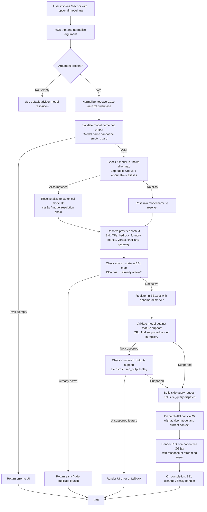

# `/advisor`

> Analysis basis: CC v2.1.193 bundle.js (AST extraction + Claude interpretation)
> Minimum version: v2.1.193

---

## Overview

The `/advisor` command enables Claude Code to consult a stronger or more capable model at key decision points during a session. When invoked, it launches a JSX-rendered UI component and dispatches a side query to a designated advisor model, passing the current context and a resolved model identifier. The response from the advisor model is surfaced back into the active session without replacing the primary agent's flow.

---

## Registration

| Field | Value |
|---|---|
| type | `local-jsx` |
| name | `advisor` |
| description | `Let Claude consult a stronger model at key moments` |
| argumentHint | `[ ... ]` |
| isHidden | `null` (not hidden) |
| module_id | `XGl` |
| load_inline | `true` |
| loc_byte | `12878632` |
| loc_byte_end | `12878888` |
| loc_line | `8821` |
| arbor_handler.name | `mOf` |
| arbor_handler.fqn | `claude-2.1.193::mOf` |
| arbor_handler.kind | `AsyncFunction` |
| arbor_handler.resolution_path | `module_id` |
| arbor_handler.n_hits | `2` |

Analysis basis: CC v2.1.193 bundle.js:+12878632

---

## Input Branching

The command processes the advisor model name argument through multiple stages: trimming and normalizing input, validating it against known model identifiers, resolving it to a canonical model string, checking feature support, and finally dispatching the side query or rendering an error. There are more than three distinct branches.



---

## Behavioral Spec

### Top-Level Handler: advisorCommandHandler (`mOf`)

The handler is an `AsyncFunction` resolved via `module_id` → `XGl`.

Analysis basis: CC v2.1.193 bundle.js:+12878632

```
async function advisorCommandHandler(commandInput, appContext):
    rawArg = commandInput.trim()                    // n.trim @ +12878110
    render JSX component shell via ZG.jsx           // +12878146

    resolvedModel = resolveAdvisorModel(rawArg)     // qo @ +12878244
    queryResult   = await dispatchSideQuery(        // ijt @ +12878258
                        resolvedModel, appContext)

    modelEntry    = buildModelEntry(queryResult)    // e   @ +12878284
    contextBundle = buildContextBundle(appContext)  // TMe @ +12878332
    filteredParts = filterMessageParts(contextBundle) // pmt @ +12878405

    return render final JSX with result
```

Analysis basis: CC v2.1.193 bundle.js:+12878110, +12878146, +12878244, +12878258

---

### Sub-feature: Model Name Resolution (`qo`)

Normalizes a raw model name string into a canonical model identifier understood by the API layer. Applies lowercase normalization, alias expansion, provider-specific rewrites, and feature-flag checks.

Analysis basis: CC v2.1.193 bundle.js:+2306306

```
function resolveModelName(rawName):
    trimmed = rawName.trim()                        // e.trim @ +2306306
    lower   = trimmed.toLowerCase()                 // t.toLowerCase @ +2306317

    // Apply provider header rewrite (rH @ +2306335)
    providerTag = lookupProviderHeader(lower)

    // Sanitize display name (Fa @ +2306345)
    displayName = sanitizeModelName(trimmed)

    // Check model family membership (nM @ +2306363)
    if isKnownModelFamily(lower):
        // Resolve opusplan / sonnet / haiku / opus aliases
        // Literals: "opusplan" +2306450, "sonnet" +2306495,
        //           "haiku" +2306538, "opus" +2306580
        // Format marker "[1m]" @ +2306434, "fable" @ +2306383
        canonicalId = expandFamilyAlias(lower)
    else:
        canonicalId = lower

    // OFe: resolve against full model registry (+2306398)
    resolved = resolveAgainstRegistry(canonicalId)

    // Cv: apply model config overrides (+2306411)
    // Wz: apply first-party tag if applicable (+2306421)
    //     Literal: "firstParty" @ +2139415
    // gL: apply provider-qualified path (+2306471)
    // X4: check extended alias table (+2306556)
    // IW: apply replacement rules (+2306599)
    // y_: finalize model descriptor (+2306602)
    // AYs: assemble final model spec (+2306632)
    //      includes "best" shorthand @ +2306618

    // bYu: lowercase final result (+2306709)
    // h$: resolve "claude-mythos-preview" special case (+2306717)
    //     Literal: "claude-mythos-preview" @ +3043321
    // Replace residual tokens (t.replace @ +2306733)

    return finalModelId
```

#### Known Model Alias Literals

The following model name strings are found in the resolution chain (all within the `qo` / alias-expansion sub-graph):

| Alias literal | loc_byte |
|---|---|
| `"fable"` | +2306383 |
| `"opusplan"` | +2306450 |
| `"sonnet"` | +2306495 |
| `"haiku"` | +2306538 |
| `"opus"` | +2306580 |
| `"best"` | +2306618 |
| `"claude-fable-5"` | +2290309 |
| `"claude-mythos-preview"` | +3043321 |
| `"claude-mythos-5"` | +2302949 |
| `"claude-opus-4-8"` | +2303006 |
| `"claude-opus-4-7"` | +2303063 |
| `"claude-opus-4-6"` | +2303120 |
| `"claude-opus-4-5"` | +2303177 |
| `"claude-opus-4-1"` | +2303234 |
| `"claude-opus-4-0"` | +2303323 |
| `"claude-sonnet-4-6"` | +2303355 |
| `"claude-sonnet-4-5"` | +2303416 |
| `"claude-sonnet-4-0"` | +2303511 |
| `"claude-haiku-4-5"` | +2303545 |
| `"claude-3-7-sonnet"` | +2303604 |
| `"claude-3-5-sonnet"` | +2303665 |
| `"claude-3-5-haiku"` | +2303726 |
| `"claude-3-opus"` | +2303785 |
| `"claude-3-sonnet"` | +2303838 |
| `"claude-3-haiku"` | +2303895 |

Short-form aliases used in alias-map resolution (`Z6p`):

| Short alias | Normalized form |
|---|---|
| `"fable-5"` / `"fable_5"` | `claude-fable-5` |
| `"opus-4-8"` / `"opus_4_8"` | `claude-opus-4-8` |
| `"opus-4-7"` / `"opus_4_7"` | `claude-opus-4-7` |
| `"opus-4-6"` / `"opus_4_6"` | `claude-opus-4-6` |
| `"opus-4-5"` / `"opus_4_5"` | `claude-opus-4-5` |
| `"sonnet-4-6"` / `"sonnet_4_6"` | `claude-sonnet-4-6` |
| `"sonnet-4-5"` / `"sonnet_4_5"` | `claude-sonnet-4-5` |

Analysis basis: CC v2.1.193 bundle.js:+9128685 (Z6p alias table)

---

### Sub-feature: Advisor State Guard (`ijt` — side-query dispatcher)

Before dispatching the advisor query, the handler checks whether an advisor invocation for the resolved model is already in-flight using a `BEo` map (a Set/Map tracking active advisor sessions).

Analysis basis: CC v2.1.193 bundle.js:+9127378

```
async function sideQueryDispatcher(resolvedModel, context):
    name = resolvedModel.trim()                     // e.trim @ +9127378
    if name is empty:
        throw "Model name cannot be empty"          // literal @ +9127415

    contextMap = buildContextMap(context)           // wa @ +9127449
    lower = name.toLowerCase()                      // n.toLowerCase @ +9127563

    if isUnsupportedFamily(lower):                  // Fge.includes @ +9127582
        return earlyError("unsupported model family")

    if BEo.has(lower):                              // BEo.has @ +9127684
        return                                      // already active, skip

    result = await dispatchAPIQuery(lower, context) // FN @ +9127729

    BEo.set(lower, result)                          // BEo.set @ +9127892

    // Post-process alias map entry
    aliasEntry = buildAliasEntry(result)            // Q6p @ +9127933

    return aliasEntry
```

The literal `"model_validation"` at +9127779 indicates a telemetry checkpoint is emitted during the model validation phase. The literal `"ephemeral"` at +9127873 indicates the advisor query context is tagged as ephemeral (not persisted to conversation history).

---

### Sub-feature: API Dispatch Core (`jW`)

The primary API call handler shared with the main agent loop. When invoked by `/advisor`, it is called with `side_query` as the application context tag.

Analysis basis: CC v2.1.193 bundle.js:+3030813

```
async function apiDispatchCore(params):
    // Resolve model entry (e7 @ +3030813)
    // Parse response format (g4r @ +3030830): split, trim, indexOf, slice
    // Resolve model session key (Ks @ +3030847): uses "bg" tag literal
    // Build user-agent string (y7 @ +3030880):
    //   "User-Agent" header @ +3030867
    //   "@anthropic-ai/claude-code" @ +3101012
    //   version "2.1.193" @ +3101102
    //   "cli" tag @ +3030861
    //   "cli-bg" tag @ +3030852
    //   "x-app" header @ +3030839

    // Authentication (Ifn @ +3031622):
    //   ZQe.trustAccepted check
    //   proxyAuthHelper warning @ +1869790
    //   timeout: 30000 ms @ +1870089
    //   "Proxy-Authorization" header @ +1871122

    // Session headers (Zfd @ +3031634):
    //   "X-Claude-Code-Session-Id" @ +3030885
    //   "x-claude-remote-container-id" @ +3030929
    //   "x-claude-remote-session-id" @ +3030970
    //   "x-client-app" @ +3031009
    //   "x-claude-code-agent-id" @ +3031043
    //   "x-claude-code-parent-agent-id" @ +3031106
    //   "x-anthropic-additional-protection" @ +3031376
    //   content-type: "text/event-stream" @ +3040072

    // Provider dispatch (UA @ +3035321):
    //   supports: ANTHROPIC_API_KEY, user_oauth, profile-implicit, apiKeyHelper
    //   "Cloud gateway session expired — run /login to reconnect." @ +3032003

    // Structured output validation (zie @ +8618674):
    //   "structured_outputs" feature flag @ +8618680

    // Request metadata:
    //   "side_query" app tag @ +8618552
    //   temperature included @ literal "temperature" +3052716
    //   "cache_control" present @ +8620724
    //   cache TTL: "1h" @ +8619443
    //   "sideQuery" marker @ +8619965

    // Timeout: 600000 ms (10 minutes) @ +3031794
    // Max retries: 10 @ +3031802

    // Lone surrogate sanitization (tengu_lone_surrogate_sanitized)
    // API success telemetry (tengu_api_success)

    return streamedResponse
```

Analysis basis: CC v2.1.193 bundle.js:+3030813, +3031622, +3031634, +8618552

---

### Sub-feature: Provider Resolution (`BH` / `TFe`)

Determines which API provider backend to use based on the resolved model and environment configuration. Supports multiple deployment types.

Analysis basis: CC v2.1.193 bundle.js:+3043406, +2139155

```
function resolveProvider(modelId, config):
    // Check provider prefix (Dqu @ +2139126): e.startsWith "anthropic." @ +2139030
    // Map model to provider class (TFe @ +2139155):
    //   normalize to lowercase
    //   check Object.values of provider registry
    //   supported backends (literals):
    //     "bedrock"       @ +2138591
    //     "foundry"       @ +2138641
    //     "mantle"        @ +2138751
    //     "vertex"        @ +2138799
    //     "firstParty"    @ +2139415
    //     "anthropicAws"  @ +2139264
    //     "gateway"       @ +2139284
    // Apply "application-inference-profile" for Bedrock @ +2304031

    return providerConfig
```

---

### Sub-feature: Context Bundle Construction (`TMe` / `K_o`)

Builds the context object passed to the advisor model, including conversation history, tool results, and agent metadata.

Analysis basis: CC v2.1.193 bundle.js:+8861231

```
function buildContextBundle(appContext):
    rawContext = buildRawContext(appContext)         // wa @ +8861231
    viewContext = buildViewContext(rawContext)       // V_o @ +8861249
    serialized  = serializeContext(viewContext)     // to @ +8861270

    // K_o sub-pipeline (+8861278):
    //   normalize context entries (to, qo, Tr)
    //   filter excluded message types (jge)
    //   validate agent permissions (qie)
    //   check capability flags (pet @ +8861034)
    //   apply sub-agent metadata (u_n @ +8861043):
    //     "_r", "_u", Wge, pet chain

    return serialized
```

---

### Sub-feature: Message Part Filtering (`pmt` / `SGn`)

Filters the assembled message parts before sending to the advisor, removing entries that should not cross the advisor boundary.

Analysis basis: CC v2.1.193 bundle.js:+12878405

```
function filterMessageParts(messageArray):
    // m9p.filter: remove ineligible parts @ +8861187
    eligible = messageArray.filter(isAdvisorEligible)

    // SGn: for each eligible part:
    //   buildContextEntry(TMe)  @ +8861150
    //   applyURLRewrite(up)     @ +8861154
    //   resolveModelRef(qo)     @ +8861157

    return eligible
```

---

### Sub-feature: Advisor Off / Unset States

The command checks a configuration literal `"off"` (at +12878176) and `"unset"` (at +12878187) to determine whether the advisor feature is disabled at the policy level. If the advisor is configured as `"off"` or `"unset"`, the command renders an informational UI state rather than dispatching any query.

Analysis basis: CC v2.1.193 bundle.js:+12878176, +12878187

```
function checkAdvisorPolicy(policyConfig):
    state = policyConfig.advisorMode
    if state == "off" or state == "unset":
        return renderDisabledState()
    return proceed
```

---

## State & Side Effects

| Item | Detail |
|---|---|
| Telemetry: `tengu_api_success` | Emitted on successful API response from the advisor model (loc_byte: +8620225) |
| Telemetry: `tengu_lone_surrogate_sanitized` | Emitted when a lone Unicode surrogate is sanitized from the API response stream (loc_byte: +8619921) |
| Telemetry: `tengu_prompt_cache_1h_config` | Emitted when 1-hour prompt cache configuration is applied to the advisor request (loc_byte: +13722050) |
| Telemetry: `tengu_bg_retire_grace_bridged_min` | Emitted during background worker retirement grace-period bridging (loc_byte: +13266579) |
| Telemetry: `tengu_bg_retire_pinned_low_mem` | Emitted when pinned background workers are retired under low-memory pressure (loc_byte: +17487013) |
| Telemetry: `tengu_bg_attach_upgrade` | Emitted when a background worker is upgraded/attached (loc_byte: +13266651) |
| Telemetry: `tengu_bg_prewarm_per_sweep` | Emitted during background worker pre-warm sweep (loc_byte: +17487134) |
| Active-advisor state map (`BEo`) | Tracks in-flight advisor sessions keyed by normalized model name; prevents duplicate concurrent advisor calls (BEo.has @ +9127684, BEo.set @ +9127892) |
| JSX render | Renders a `local-jsx` component via `ZG.jsx` (+12878146); component is updated as streaming results arrive |
| Ephemeral context tag | The advisor query is tagged `"ephemeral"` (+9127873), meaning its messages are not persisted to the main conversation |
| API headers set | `X-Claude-Code-Session-Id`, `x-claude-code-agent-id`, `x-claude-code-parent-agent-id`, `x-client-app`, `x-anthropic-additional-protection` (see API Dispatch Core) |
| Prompt cache | Cache TTL `"1h"` applied via `cache_control` to advisor requests (+8619443, +8620724) |
| Sound | <!-- TODO: not found in depth-2 traversal; needs --depth 4 --> |
| appState changes | <!-- TODO: not found in depth-2 traversal; needs --depth 4 --> |

---

## Version History

| Version | Change |
|---|---|
| v2.1.193 | Initial analysis |

---

## Common Mistakes

1. **Providing an unrecognized model alias** — The `/advisor` command accepts short-form aliases such as `opus-4-8`, `sonnet-4-6`, or `fable-5`, but an unrecognized string that does not match any alias or canonical model name will result in an error. Use one of the known aliases or a full canonical model ID.
2. **Invoking while advisor is already active** — The command guards against concurrent advisor calls for the same model using the `BEo` state map. Invoking `/advisor` with the same model while a prior call is in-flight is silently dropped. Wait for the current advisor response before re-invoking.
3. **Using `/advisor` when policy is set to `"off"` or `"unset"`** — If the workspace or project policy has disabled the advisor feature, the command renders a disabled state and makes no API call. The user must update the policy (e.g., in project settings) before the command becomes functional.
4. **Expecting the advisor response to appear in chat history** — The advisor context is tagged `"ephemeral"` and is not persisted to the main conversation. The result is surfaced through the JSX component overlay only.
5. **Passing an empty model argument** — An empty string after trimming triggers the `"Model name cannot be empty"` guard and returns an error immediately without querying any model.

---

## Appendix — Identifier Mapping

> For bundle debugging only. Identifiers change across versions.

| Identifier | Role |
|---|---|
| `mOf` | Top-level async handler for `/advisor` command (arbor_handler) |
| `qo` | Model name resolution and alias expansion function |
| `ijt` | Side-query dispatcher; validates model, checks BEo guard, invokes FN |
| `FN` | Core API request builder and dispatcher (side_query path) |
| `jW` | Low-level API fetch orchestrator (headers, auth, streaming, retries) |
| `TMe` | Context bundle constructor for advisor queries |
| `K_o` | Context entry normalizer and capability filter |
| `pmt` | Message part filter; removes ineligible parts before advisor dispatch |
| `SGn` | Per-part transform: context entry build, URL rewrite, model ref resolve |
| `Z6p` | Short-form alias resolution map (e.g., `opus-4-8` → `claude-opus-4-8`) |
| `Q6p` | Post-dispatch alias entry builder |
| `BH` | Provider tag resolver; maps model ID to backend type |
| `TFe` | Provider registry lookup; normalizes to `bedrock`/`vertex`/`foundry`/etc. |
| `Zp` | Model registry entry constructor |
| `Wz` | First-party provider tag applicator |
| `OFe` | Full model registry resolver |
| `N1r` | Model registry sub-resolver (used inside OFe) |
| `MRt` | Model name replacement/rewrite rule applicator |
| `Cv` | Model configuration override applicator |
| `gL` | Provider-qualified model path builder |
| `c_n` | Model path sub-component resolver |
| `X4` | Extended alias table checker |
| `U1r` | Extended alias sub-resolver |
| `IW` | Model name replacement rule set |
| `y_` | Final model descriptor assembler |
| `uve` | Model descriptor sub-finalizer |
| `AYs` | Final model spec assembler (includes "best" shorthand) |
| `qie` | Agent permission validator |
| `u_n` | Sub-agent metadata applicator |
| `pet` | Capability flag inclusion checker |
| `Wge` | Array/capability wrapper checker |
| `jge` | Message type exclusion checker |
| `wa` | Raw context map builder |
| `PFe` | Context map entry processor |
| `Gge` | Context provider resolver |
| `a_n` | Context recursive assembler |
| `EYs` | Object.entries-based context entry serializer |
| `_n` | Context sub-serializer |
| `PZe` | Policy settings resolver |
| `yYs` | Bge-based context index finder |
| `EYu` | Extended context unit builder |
| `IRt` | Context item renderer (handles `"claude-"` prefix items) |
| `SYu` | Context section builder with startsWith checks |
| `bYu` | Lowercase finalizer for resolved model names |
| `h$` | Special-case resolver for `"claude-mythos-preview"` |
| `to` | Context serialization dispatcher |
| `__` | Lowercase/include/replace chain for context normalization |
| `up` | URL/string replacement utility |
| `RTt` | Context token resolver |
| `rH` | Provider header lookup |
| `qge` | Header value constructor |
| `Fa` | Model name sanitizer (e.replace) |
| `nM` | Model family membership checker (Fge.includes) |
| `Bge` | HYu-based model family inclusion checker |
| `NFe` | Model name token formatter |
| `Bie` | xYu-based model inclusion checker |
| `Xu` | Model path component resolver (_r-based) |
| `_r` | Core string/token builder (at-based) |
| `_u` | Secondary string/token builder (vhn-based) |
| `at` | Low-level String coercion helper |
| `ul` | String utility (String coercion) |
| `Ifn` | Authentication handler (proxy auth, OAuth, token timeout) |
| `Zfd` | Session/request ID manager (UUID, randomUUID, content-type) |
| `Ly` | Token/credential lifecycle manager |
| `UA` | Provider-level API auth dispatcher (OAuth, API key, profile-implicit) |
| `yve` | WIF (workload identity federation) token exchange handler |
| `Iet` | WIF credentials resolver (fetch-based, AbortSignal.timeout) |
| `Dy` | ANTHROPIC_API_KEY / apiKeyHelper credential resolver |
| `Qfd` | Session state query (Zgi, Xgi, _r) |
| `Kfd` | Request finalization and retry config |
| `_ve` | Async delay / Promise.resolve timing utility |
| `wfr` | Date.now timestamp utility |
| `DDt` | Header normalization (authorization header lowercase) |
| `lwe` | SDK error logger (console.error) |
| `_bn` | Request body builder (cC, As, to, l$e) |
| `ABe` | Model compatibility check for claude-3- series |
| `zie` | Structured outputs feature flag resolver |
| `xNr` | Foundry resource name builder |
| `ZFp` | Supported model registry finder |
| `dHo` | SHA-256 hash helper (Eja.createHash) |
| `y_n` | User-agent string constructor |
| `H_n` | AsyncLocalStorage store accessor (vYs.getStore) |
| `fve` | User-agent component finalizer |
| `UCn` | Token string coercion helper |
| `gje` | Context/memory relevance resolver (repl_main_thread, sdk, auto_mode) |
| `So` | Session object accessor (Dy, wB, Vs) |
| `lmr` | Context memory reader |
| `it` | Worker/task scheduler (KPt, zPt, H5, vwe, lCn, VPt, ZW, kt) |
| `cmr` | Context memory writer |
| `YD` | HIPAA compliance checker (L4r, SBe) |
| `L4r` | HIPAA policy resolver |
| `SBe` | HIPAA flag builder |
| `L` | Background worker sweep/lifecycle manager |
| `iYt` | Memory pressure checker (yzl.freemem) |
| `Ezl` | Worker retirement orchestrator |
| `I9e` | File system cache cleanup (lstat, rm, readFile) |
| `xe` | Error logger with rJe.push / kZ.logError |
| `Nn` | Worker pool notifier |
| `znr` | Worker attach-upgrade dispatcher |
| `vbn` | Temperature / request option builder |
| `Mv` | Message mapper (e.map) |
| `S0e` | Tool/subagent result assembler |
| `u5` | Random bytes generator (d9o.randomBytes, 32 bytes) |
| `Rc` | Result container builder (Dy, kt) |
| `ke` | JSON.stringify wrapper |
| `Lnn` | Message array normalizer (t.pop / t.push) |
| `vnn` | Message token validator (FFc.test) |
| `LD` | Structured clone utility (structuredClone) |
| `lYe` | Message array de-duplicator (n.pop / n.push) |
| `wnn` | Message replacement helper (NXo, e.replace) |
| `Ve` | Version/build info accessor (Zze) |
| `kNr` | Credential/token validator |
| `FXs` | Token format validator ($Xs.test, $Xu.test) |
| `RNr` | Token set manager (xNr, aTt, r.get, t.every, o.has, s.add, r.set) |
| `uTe` | Request usage tracker |
| `br` | Response builder (ph, Ve) |
| `ph` | Response payload constructor (Zze) |
| `No` | Empty/null response builder (Zze) |
| `FNt` | File notification tracker (c5i, kst, $Nt) |
| `c5i` | File change subscriber ($Ud, xe) |
| `kst` | File status poller (ph) |
| `$Nt` | File notification entry (kst, UNt) |
| `sF` | Agent subtype dispatcher (UUd, JD, xe) |
| `UUd` | Built-in / custom agent prefix router |
| `JD` | Agent id prefix validator (repl_main_thread) |
| `Is` | CLI error exit handler (lKe, OT, process.exit) |
| `ef` | Module entry point resolver (Lt) |
| `Lt` | React/Rx entry resolver |
| `e7` | Model entry resolver |
| `g4r` | Response format parser (split, trim, indexOf, slice) |
| `Ks` | Background session key resolver ("bg" tag) |
| `y7` | User-agent builder (H_n) |
| `V1r` | URL component encoder (e.replace, encodeURIComponent) |
| `T` | API transport layer (iUe, qFc, ke, Lc, XO, iYe, XFc) |
| `Wg` | Token refresh handler (Dbn: "refreshed") |
| `wYs` | Boolean coercion utility |
| `d_` | Request deduplication key builder |
| `qfd` | Quota/rate-limit tracker (MT, Qtt) |
| `Tr` | Trace/span context carrier |
| `fB` | Feature flag reader (zHu, l$e) |
| `wv` | Worker attach helper (aH) |
| `V_o` | View context builder |
| `Zbt` | Request abort/cancel token |
| `A1` | Auth token resolver (_r) |
| `aTt` | Token expiry checker |

---

Note: index built via Arbor fallback; some signals (telemetry, literals) may be missing — see arbor-fallback.js.