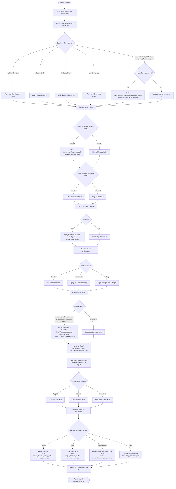

# `/agents`

> Analysis basis: CC v2.1.193 bundle.js (AST extraction + Claude interpretation)
> Minimum version: v2.1.193

---

## Overview

The `/agents` command is a management interface for agent configurations within Claude Code. It allows users to inspect, configure, and control agent-related settings including working directory, tool permissions, daemon lifecycle, session parameters, and model options. The command renders a JSX-based interactive UI component and coordinates across multiple subsystems: daemon process management, feature-flag evaluation, permission mode enforcement, and agent configuration persistence.

---

## Registration

| Field | Value |
|---|---|
| type | `local-jsx` |
| name | `agents` |
| description | `Manage agent configurations` |
| module_id | `C6l` |
| load_inline | `true` |
| loc_byte | `12827365` |
| loc_byte_end | `12827490` |
| loc_line | `8810` |
| arbor_handler.name | `oPf` |
| arbor_handler.fqn | `claude-2.1.193::oPf` |
| arbor_handler.kind | `AsyncFunction` |
| arbor_handler.resolution_path | `module_id` |
| arbor_handler.n_hits | `0` |

Analysis basis: CC v2.1.193 bundle.js:+12827365

---

## Input Branching

The command involves more than three distinct execution branches (daemon lifecycle control, permission mode gating, feature-flag evaluation, tool allow/disallow filtering, config reload, agent start/stop), so a Mermaid flowchart is used.



---

## Behavioral Spec

### Top-Level Handler

The entry point is `oPf` (resolved via `module_id` → `C6l`), an `AsyncFunction`. It coordinates three primary concerns: app-state retrieval (`Ur`), agent configuration assembly (`uO`), and JSX rendering (`v6l.jsx`).

```
async function agentsCommandHandler(context):
    appState = retrieveAppState(context)          // calls Ur → getAppState
    agentConfig = buildAgentConfiguration(appState)  // calls uO
    return renderJSX(agentConfig)                 // calls v6l.jsx
```

Analysis basis: CC v2.1.193 bundle.js:+12827226

---

### App State Retrieval and Session Resolution

```
function retrieveAppState(context):
    state = context.getAppState()
    lastSession = state.findLast(entry =>
        entry has working_directory OR allowed_tools OR disallowed_tools OR ...
    )
    return lastSession
```

Key fields extracted from the last session entry:
- `"working_directory"` — Analysis basis: CC v2.1.193 bundle.js:+10994517
- `"allowed_tools"` — Analysis basis: CC v2.1.193 bundle.js:+10994572
- `"disallowed_tools"` — Analysis basis: CC v2.1.193 bundle.js:+10994627
- `"avoid_prompts"` — Analysis basis: CC v2.1.193 bundle.js:+10994688
- `"permission_mode"` — Analysis basis: CC v2.1.193 bundle.js:+10994790
- `"bypassPermissions"` — Analysis basis: CC v2.1.193 bundle.js:+10994821
- `"session"` — Analysis basis: CC v2.1.193 bundle.js:+10995120
- `"effort"` — Analysis basis: CC v2.1.193 bundle.js:+10995145
- `"model"` — Analysis basis: CC v2.1.193 bundle.js:+10995158
- `"max_thinking_tokens"` — Analysis basis: CC v2.1.193 bundle.js:+10995170
- `"flag_settings"` — Analysis basis: CC v2.1.193 bundle.js:+10995196

Analysis basis: CC v2.1.193 bundle.js:+10994412

---

### Permission Mode Enforcement

When `bypassPermissions` is set in the session configuration, the handler disables it and resets the permission mode to `"disable"`. A telemetry event is emitted to record this action.

```
function enforcePermissionMode(sessionConfig):
    if sessionConfig.bypassPermissions is set:
        emit telemetry("tengu_disable_bypass_permissions_mode")
        sessionConfig.permission_mode = "disable"
        sessionConfig.bypassPermissions = false
    else:
        apply sessionConfig.permission_mode as provided
```

Constant `"disable"` for permission mode reset:
Analysis basis: CC v2.1.193 bundle.js:+3405934

Telemetry event `tengu_disable_bypass_permissions_mode`:
Analysis basis: CC v2.1.193 bundle.js:+3405833

---

### Feature Flag Evaluation

The handler evaluates two feature flags before constructing the UI:

**`allow_workflows`** — controls whether workflow-related functionality is activated:
```
function evaluateWorkflowFlag(featureContext):
    if featureContext.isEnabled("allow_workflows"):
        emit telemetry("tengu_workflows_enabled")
        activateWorkflowPath()
    // else: no-op
```
Analysis basis: CC v2.1.193 bundle.js:+3382951
Telemetry: CC v2.1.193 bundle.js:+3383152

**`allow_product_feedback`** — controls feedback UI visibility:
```
function evaluateProductFeedbackFlag(featureContext):
    if featureContext has("allow_product_feedback"):
        enableFeedbackUI()
```
Analysis basis: CC v2.1.193 bundle.js:+3362286

Additional feature checks per agent instance use `fl.isEnabled` and `c.isEnabled`:
Analysis basis: CC v2.1.193 bundle.js:+10427844, +10427974

---

### Platform Detection

A platform check is performed to apply OS-specific configuration:

```
function applyPlatformConfig(platformInfo):
    if platformInfo.type == "windows":
        applyWindowsConfig()
        emit telemetry("tengu_cobalt_ridge")
    else:
        useStandardPlatformPath()
```

Constant `"windows"`: Analysis basis: CC v2.1.193 bundle.js:+5093884
Telemetry `tengu_cobalt_ridge`: Analysis basis: CC v2.1.193 bundle.js:+5093978

---

### Model Configuration Resolution

The model identifier is resolved, with special-case handling for TST and debug modes:

```
function resolveModelConfig(modelId, providerConfig):
    base = "standard"    // default
    if modelId == "tst":
        applyTSTMode(threshold=100)
    elif modelId == "tst-auto":
        applyTSTAutoMode()
    elif modelId == "debug":
        applyDebugMode()
    
    provider = resolveProvider(providerConfig)
    if provider in ["bedrock", "foundry", "anthropicAws", "mantle"]:
        applyProviderOverride(provider)
    elif provider == "vertex":
        applyProviderOverride("vertex")
        // Note: tool-search disabled unless ENABLE_TOOL_SEARCH=true env var is set
        // Analysis basis: CC v2.1.193 bundle.js:+5083139
    
    return finalModelConfig
```

Constant `"standard"`: Analysis basis: CC v2.1.193 bundle.js:+5081548
Constant `"tst"`: Analysis basis: CC v2.1.193 bundle.js:+5081627
TST threshold `100`: Analysis basis: CC v2.1.193 bundle.js:+5081640
Constant `"tst-auto"`: Analysis basis: CC v2.1.193 bundle.js:+5081677
Constant `"debug"`: Analysis basis: CC v2.1.193 bundle.js:+215587
Constant `"bedrock"`: Analysis basis: CC v2.1.193 bundle.js:+2138591
Constant `"foundry"`: Analysis basis: CC v2.1.193 bundle.js:+2138641
Constant `"anthropicAws"`: Analysis basis: CC v2.1.193 bundle.js:+2138697
Constant `"mantle"`: Analysis basis: CC v2.1.193 bundle.js:+2138751
Constant `"vertex"`: Analysis basis: CC v2.1.193 bundle.js:+2138799

---

### Agent List Assembly and Filtering

```
function buildAgentConfiguration(appState):
    rawAgents = resolveAgentList(appState)           // Zv call path
    
    filtered = rawAgents.filter(agent =>
        not eat.has(agent.id)                        // exclude known-bad agents
    )
    
    mapped = filtered.map(agent => {
        enabled = featureFlags.isEnabled(agent)
        return buildAgentEntry(agent, enabled)
    })
    
    return {
        agents: mapped,
        hasSupervisorAgent: mapped.some(a => a.type == "supervisor"),
        config: assembleConfig(appState)
    }
```

Constant `"supervisor"` for agent type check:
Analysis basis: CC v2.1.193 bundle.js:+17497914

Agent type constants observed in call graph:
- `"local-agent"`: Analysis basis: CC v2.1.193 bundle.js:+7178960
- `"sdk"`: Analysis basis: CC v2.1.193 bundle.js:+17310734
- `"http"`: Analysis basis: CC v2.1.193 bundle.js:+17307892
- `"sse"`: Analysis basis: CC v2.1.193 bundle.js:+17307909
- `"dynamic"`: Analysis basis: CC v2.1.193 bundle.js:+17307989
- `"stdio"`: Analysis basis: CC v2.1.193 bundle.js:+6994304

---

### Daemon Lifecycle Management

The handler exposes start, stop, updateConfig, and yield operations on daemon-managed agents:

```
function manageDaemonLifecycle(agent, action):
    match action:
        case "start":
            agent.start()
            agentMap.set(agent.id, agent)
            emit telemetry("tengu_daemon_config_reload")

        case "stop":
            agent.stop()
            agentMap.delete(agent.id)
            emit telemetry("tengu_daemon_control")

        case "updateConfig":
            agent.stop()
            agent.updateConfig(newConfig)
            agent.start()
            emit telemetry("tengu_daemon_config_reload")

        case "yield":
            output.write("yielding to a foreground/service daemon — bg workers will be re-adopted")
            emit telemetry("tengu_daemon_yield")
```

Yield message literal: `"yielding to a foreground/service daemon — bg workers will be re-adopted"`
Analysis basis: CC v2.1.193 bundle.js:+17503037

Telemetry `tengu_daemon_config_reload`: Analysis basis: CC v2.1.193 bundle.js:+17498707
Telemetry `tengu_daemon_control`: Analysis basis: CC v2.1.193 bundle.js:+17520352
Telemetry `tengu_daemon_yield`: Analysis basis: CC v2.1.193 bundle.js:+17503119

---

### Agent Status and Connection Tracking

Each agent tracks its connection state. The status values observed in literals:

```
function resolveAgentStatus(agent):
    if agent.connectionState == "connected":
        return renderConnectedState(agent)
    elif agent.connectionState == "stopped":
        return renderStoppedState(agent)
    elif agent.connectionState == "blocked":
        return renderBlockedState(agent)
    elif agent.connectionState == "failed":
        displayError("Connection failed")
        return renderFailedState(agent)
    elif agent.connectionState == "error":
        logError(agent.lastError)
        return renderErrorState(agent)
```

Constant `"connected"`: Analysis basis: CC v2.1.193 bundle.js:+17310870
Constant `"stopped"`: Analysis basis: CC v2.1.193 bundle.js:+17520186
Constant `"blocked"`: Analysis basis: CC v2.1.193 bundle.js:+10426954
Constant `"failed"`: Analysis basis: CC v2.1.193 bundle.js:+17311057
Constant `"Connection failed"`: Analysis basis: CC v2.1.193 bundle.js:+17311075
Constant `"error"`: Analysis basis: CC v2.1.193 bundle.js:+1057589

---

### File System and Config Persistence

The handler checks for a daemon status file and performs file stat operations:

```
function loadDaemonStatus(configDir):
    statusFilePath = join(configDir, "daemon.status.json")
    try:
        stat = fs.stat(statusFilePath)
        if not stat.isFile():
            return reject(ENOENT error)
        if stat.size > 1048576:
            return reject(file too large)
        content = readFile(statusFilePath)
        return parseJSON(content)
    catch ENOENT:
        return null
```

Constant `"daemon.status.json"`: Analysis basis: CC v2.1.193 bundle.js:+12997330
Size limit `1048576` bytes (1 MiB): Analysis basis: CC v2.1.193 bundle.js:+13170974
Error code `"ENOENT"`: Analysis basis: CC v2.1.193 bundle.js:+13170914

---

### Shutdown and Timeout Handling

When stopping agents, the handler coordinates graceful shutdown with timeout and abort semantics:

```
function shutdownAgentGracefully(agent, timeoutMs=500):
    shutdownPromise = agent.shutdown()
    timeoutPromise = createTimeout(timeoutMs)
    
    result = Promise.race([shutdownPromise, timeoutPromise])
    
    if result.state == "aborted":
        clearTimeout(timeoutHandle)
        return "abort"
    
    await Promise.all(pendingCleanup)
    
    if gracefulShutdown fails:
        process.exit()
```

Shutdown timeout `500` ms: Analysis basis: CC v2.1.193 bundle.js:+17515411
Constant `"aborted"`: Analysis basis: CC v2.1.193 bundle.js:+2353041
Constant `"abort"`: Analysis basis: CC v2.1.193 bundle.js:+2353119
`process.exit` call: Analysis basis: CC v2.1.193 bundle.js:+17515450

---

### Feature Health Telemetry

Two feature-health events are emitted during agent feature evaluation:

```
function emitFeatureHealth(featureResult):
    if featureResult.ok:
        emit telemetry("tengu_feature_ok")
    else:
        emit telemetry("tengu_feature_bad")
```

`tengu_feature_ok`: Analysis basis: CC v2.1.193 bundle.js:+1026754
`tengu_feature_bad`: Analysis basis: CC v2.1.193 bundle.js:+1026821

---

### Randomized Timing

Two numeric literals (`2` and `1`) near `Math.random` and `setTimeout` calls suggest a jitter mechanism in a scheduling or polling sub-path:

```
function scheduleWithJitter(baseDelayMs):
    jitter = Math.random() * 2
    delay = baseDelayMs + jitter * 1
    setTimeout(callback, delay)
```

Constant `2`: Analysis basis: CC v2.1.193 bundle.js:+14343445
Constant `1`: Analysis basis: CC v2.1.193 bundle.js:+14343461

---

### Data Buffer and Padding

A column-width constant of `40` is used in tabular output rendering (pad-end for display alignment), alongside a `1024`-byte data buffer:

- Column pad width `40`: Analysis basis: CC v2.1.193 bundle.js:+17511228
- Buffer constant `1024`: Analysis basis: CC v2.1.193 bundle.js:+17378473
- Separator `"  "` (two spaces): Analysis basis: CC v2.1.193 bundle.js:+17509254

---

### Heartbeat and Transient State

```
function manageDaemonHeartbeat(agent):
    if agent.connectionType == "heartbeat":
        monitorHeartbeat(agent)
    if agent.state == "transient":
        markAsTransient(agent)
        scheduleReclassification(agent)
```

Constant `"heartbeat"`: Analysis basis: CC v2.1.193 bundle.js:+17497135
Constant `"transient"`: Analysis basis: CC v2.1.193 bundle.js:+17502984

---

### Slate Harbor Telemetry

An additional telemetry event `tengu_slate_harbor` is fired in the agent environment resolution path, distinguishing `"cli"` vs. `"remote"` environments:

```
function resolveEnvironmentType(env):
    if env.type == "cli":
        emit telemetry("tengu_slate_harbor", {type: "cli"})
    elif env.type == "remote":
        emit telemetry("tengu_slate_harbor", {type: "remote"})
```

Constant `"cli"`: Analysis basis: CC v2.1.193 bundle.js:+5096653
Constant `"remote"`: Analysis basis: CC v2.1.193 bundle.js:+5096664
Telemetry `tengu_slate_harbor`: Analysis basis: CC v2.1.193 bundle.js:+5096683

---

## State & Side Effects

| Item | Detail |
|---|---|
| Telemetry: `tengu_disable_bypass_permissions_mode` | Fired when `bypassPermissions` is active and gets reset to `"disable"` (bundle.js:+3405833) |
| Telemetry: `tengu_slate_harbor` | Fired during environment-type resolution (`"cli"` / `"remote"`) (bundle.js:+5096683) |
| Telemetry: `tengu_daemon_yield` | Fired when the daemon yields to a foreground/service daemon (bundle.js:+17503119) |
| Telemetry: `tengu_daemon_config_reload` | Fired on agent start and config update (bundle.js:+17498707) |
| Telemetry: `tengu_workflows_enabled` | Fired when `allow_workflows` feature flag is active (bundle.js:+3383152) |
| Telemetry: `tengu_cobalt_ridge` | Fired on Windows platform detection (bundle.js:+5093978) |
| Telemetry: `tengu_feature_ok` | Fired when a feature check succeeds (bundle.js:+1026754) |
| Telemetry: `tengu_feature_bad` | Fired when a feature check fails (bundle.js:+1026821) |
| Telemetry: `tengu_daemon_control` | Fired on daemon stop operations (bundle.js:+17520352) |
| appState changes | Session fields (`working_directory`, `allowed_tools`, `disallowed_tools`, `avoid_prompts`, `permission_mode`, `bypassPermissions`, `session`, `effort`, `model`, `max_thinking_tokens`, `flag_settings`) are read and applied to agent configuration state |
| Daemon lifecycle | Agent processes may be started, stopped, or have their config reloaded as a side effect of UI interaction |
| File I/O | Reads `daemon.status.json` (max 1 MiB) from config directory; file must exist and be a regular file |
| Permission mode enforcement | `bypassPermissions` is cleared and `permission_mode` forced to `"disable"` when bypass was previously active |
| Process exit | `process.exit()` is called if graceful agent shutdown fails after timeout (500 ms) |
| Daemon agent map | `agentMap.set` / `agentMap.delete` mutations on start/stop operations |
| Hook registration | <!-- TODO: not found in depth-2 traversal; needs --depth 4 --> |
| Sound | <!-- TODO: not found in depth-2 traversal; needs --depth 4 --> |

---

## Version History

| Version | Change |
|---|---|
| v2.1.193 | Initial analysis |

---

## Common Mistakes

1. **Assuming `/agents` is a simple read-only display command.** It has significant write-side effects: it can start/stop daemon processes, mutate agent configuration maps, reload configs, and force-exit the process on shutdown failure.
2. **Overlooking the `bypassPermissions` reset.** If a session was previously running with `bypassPermissions` enabled, invoking `/agents` will silently clear that setting and force `permission_mode` to `"disable"`. This is a security-relevant side effect.
3. **Expecting tool-search to work on Vertex AI.** The Vertex AI provider path disables tool-search optimistically unless the `ENABLE_TOOL_SEARCH=true` environment variable is explicitly set.
4. **Misinterpreting the 500 ms shutdown timeout.** This is a hard deadline — if the agent process does not shut down within 500 ms, `process.exit()` is called, which terminates the entire Claude Code process.
5. **Ignoring the `daemon.status.json` 1 MiB size limit.** Files larger than 1,048,576 bytes will be rejected with an error, and the daemon status will be treated as unavailable.
6. **Confusing `"tst"` and `"tst-auto"` model identifiers.** These are distinct code paths; `"tst"` applies a threshold of 100, while `"tst-auto"` follows a separate auto-selection path.

---

## Appendix — Identifier Mapping

> For bundle debugging only. Identifiers change across versions.

| Identifier | Role |
|---|---|
| `oPf` | Top-level agents command handler (AsyncFunction, entry point) |
| `Ur` | App-state retrieval and session field extraction function |
| `F7n` | Allowed-tools config accessor |
| `B7n` | Disallowed-tools config accessor |
| `F$` | Permission-mode enforcement function |
| `it` | Feature flag and permission gate evaluator |
| `KPt` | Feature-flag check sub-helper A |
| `zPt` | Feature-flag check sub-helper B |
| `H5` | Feature state resolver |
| `lCn` | Feature registry lookup (MGr/vwe set operations) |
| `kt` | Telemetry event emitter core |
| `uO` | Agent configuration assembly function |
| `Zv` | Agent environment resolution (cli/remote) |
| `S4` | String utility — environment encoding |
| `ul` | String coercion helper |
| `at` | String conversion utility |
| `tKe` | Daemon status file reader (stat + parse) |
| `an` | File error handler |
| `qs` | Async store accessor (Kqu.getStore) |
| `Y$o` | Status-file path builder |
| `be` | String wrapper for error codes |
| `Gql` | Column-width calculator (Object.keys + Math.max) |
| `E` | Agent stop/connection lifecycle manager |
| `XAt` | HTTP/SSE transport handler |
| `xe` | Connection event handler (push errors, log) |
| `eo` | Error string formatter |
| `A` | Agent restart coordinator (QBt + XAt) |
| `QBt` | Agent pre-start teardown |
| `DMc` | Heartbeat/daemon manager |
| `Bae` | Heartbeat sub-controller |
| `I` | Keyboard / input event handler (Math.max, Math.floor, preventDefault) |
| `R` | Transient daemon yield handler |
| `V` | UI rendering primitive |
| `jCo` | Agent runner / process spawner |
| `lo` | Module loader / dynamic import helper |
| `KZt` | Module binding helper |
| `vE` | Feature availability checker |
| `CCn` | Config cross-checker |
| `xx` | Config accessor primitive |
| `ixi` | Workflow enablement sub-handler |
| `Fs` | Multi-flag feature gate evaluator |
| `cjr` | Feature sub-path coordinator |
| `aAd` | Workflow activation with pro-tier check |
| `iAd` | Config accessor (xx wrapper) |
| `Pre` | Agent list pre-filter |
| `D8t` | Agent entry builder / permission resolver |
| `cq` | Permission deny-check |
| `s3o` | Tool narrowing / permission scope builder |
| `a3o` | Post-filter finalizer |
| `WCo` | Windows-platform config applicator |
| `gN` | Platform-type resolver |
| `Eu` | Cross-platform config helper |
| `u` | Agent UI entry-list builder |
| `we` | Feature-ok UI component |
| `Oe` | UI primitive (Zze wrapper) |
| `Re` | Feature-bad UI component |
| `R$` | First-party agent registration handler |
| `h5` | Registry accessor (GB) |
| `ZBe` | Event listener registrar (EL) |
| `xGr` | UUID-based agent entry creator |
| `Hj` | Graceful shutdown coordinator (Promise.race + process.exit) |
| `Yhe` | Shutdown emitter (zhe.shutdown) |
| `oHe` | Timeout-clear helper |
| `Un` | Abort-aware timeout wrapper |
| `A9` | Full agent lifecycle orchestrator |
| `lut` | Local-agent config loader |
| `$C` | Config reader (at + ffr) |
| `eb` | String encoder for agent config |
| `Nht` | Agent name/type normalizer |
| `vP` | Model configuration resolver |
| `x$t` | Model identifier parser (standard/tst/tst-auto) |
| `T` | Model string formatter (toUpperCase, trim, includes) |
| `_r` | Provider-type resolver (at wrapper) |
| `_u` | Provider override applier (vhn) |
| `lc` | Feature-lock checker |
| `c` | Per-agent feature flag evaluator |
| `yn` | Flag evaluation primitive |
| `l` | Agent list accessor |
| `C8l` | Daemon status loader orchestrator |
| `iee` | Timestamp accessor (Yge) |
| `v7t` | Status file path joiner (I8l.join + nr) |
| `ke` | JSON serializer wrapper |

---

Note: index built via Arbor fallback; some signals (telemetry, literals) may be missing — see arbor-fallback.js.