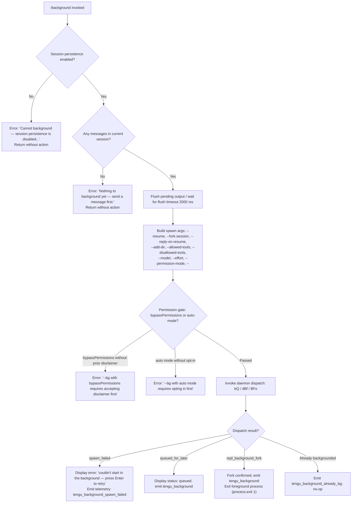

# `/background`

> Analysis basis: CC v2.1.193 bundle.js (AST extraction + Claude interpretation)
> Minimum version: v2.1.193

---

## Overview

The `/background` command (also aliased as `/bg`) sends the current interactive REPL session to the background daemon, freeing the terminal for other use. It serializes the ongoing session into a background job managed by the Claude Code daemon, dispatches it via the daemon's IPC control socket, and exits the foreground terminal process. The session can be resumed later with `--resume`.

---

## Registration

| Field | Value |
|---|---|
| type | `local-jsx` |
| name | `background` |
| description | `Send this session to the background and free the terminal` |
| aliases | `["bg"]` |
| argumentHint | `[prompt]` |
| immediate | `null` |
| module_id | `g7l` |
| load_inline | `true` |
| loc_byte | `13340543` |
| loc_byte_end | `13340783` |
| loc_line | `9226` |
| arbor_handler.name | `xBf` |
| arbor_handler.fqn | `claude-2.1.193::xBf` |
| arbor_handler.kind | `AsyncFunction` |
| arbor_handler.resolution_path | `module_id` |
| arbor_handler.n_hits | `0` |

Analysis basis: CC v2.1.193 bundle.js:+13340543

---

## Input Branching

The command has 4+ distinct branches based on precondition checks and dispatch outcome, so a Mermaid flowchart is used.



Analysis basis: CC v2.1.193 bundle.js:+13339783 (handler entry `xBf`), +13334162 (arg `--resume`), +13335169 (retry message), +13335459 (telemetry `repl_background_fork`), +13339797 (telemetry `tengu_background_already_bg`), +13339863 (persistence error), +13340039 (no-messages error)

---

## Behavioral Spec

### 1. Handler Entry Point (`xBf`)

The Arbor-resolved handler is `xBf` (AsyncFunction). It is reached via the `module_id` `g7l` resolution path.

```
async function backgroundCommandHandler(context):
    sessionId = getSessionId(context)             // via Ks / mve
    
    if not sessionPersistenceEnabled(context):
        displayError("Cannot background — session persistence is disabled, ...")
        return
    
    if messageHistory.isEmpty(context):
        displayError("Nothing to background yet — send a message first.")
        return
    
    if alreadyBackgrounded(context):
        emitTelemetry("tengu_background_already_bg")
        return
    
    // Flush pending I/O before detach
    await flushWithTimeout(2000, "flush timeout")
    
    // Build CLI argument list for the background job
    args = buildSpawnArgs(context)
    
    // Check permission gates before dispatching
    checkPermissionGates(context)   // raises if bypassPermissions or auto-mode not pre-approved
    
    // Dispatch to daemon
    result = await daemonDispatch(sessionId, args)
    
    // Render outcome JSX and optionally exit
    renderOutcome(result, context)
```

Analysis basis: CC v2.1.193 bundle.js:+13339783 (`xBf` entry), +13340000 (`Hrr` call), +13340109 (`bYt.jsx` render call)

---

### 2. Session Precondition Guards

Two guards run before any daemon interaction:

**Guard A — Session persistence:**
```
function checkPersistenceEnabled(context):
    // Reads session config; if persistence flag is off, aborts with message
    literal: "Cannot background — session persistence is disabled, ..."
    // loc_byte: 13339863
```

**Guard B — Message history non-empty:**
```
function checkHasMessages(context):
    // Inspects conversation history; if empty, aborts
    literal: "Nothing to background yet — send a message first."
    // loc_byte: 13340039
```

Analysis basis: CC v2.1.193 bundle.js:+13339863, +13340039

---

### 3. Argument Construction (`Hrr`)

The command builds a CLI argument array for the background job using the following flags (derived from literals in the bundle):

```
function buildSpawnArgs(context):
    args = []
    args.push("--resume", currentSessionId)
    args.push("--fork-session")
    
    if replyOnResume:
        args.push("--reply-on-resume")
    
    for each addedDir in context.addDirs:
        args.push("--add-dir", dir)
    
    for each tool in context.allowedTools:
        args.push("--allowed-tools", tool)
    
    for each tool in context.disallowedTools:
        args.push("--disallowed-tools", tool)
    
    if context.model:
        args.push("--model", context.model)
    
    if context.effort:
        args.push("--effort", context.effort)
    
    if context.permissionMode:
        args.push("--permission-mode", context.permissionMode)
    
    args.push("--")   // end-of-flags sentinel
    
    return args
```

Key literals:
- `"--resume"` — bundle.js:+13334162
- `"--fork-session"` — bundle.js:+13334175
- `"--reply-on-resume"` — bundle.js:+13334217
- `"--add-dir"` — bundle.js:+13334269
- `"--allowed-tools"` — bundle.js:+13334304
- `"--disallowed-tools"` — bundle.js:+13334345
- `"--model"` — bundle.js:+13334376
- `"--effort"` — bundle.js:+13334405
- `"--permission-mode"` — bundle.js:+13334422
- `"--"` — bundle.js:+13334450

---

### 4. Permission Gate Checks (`yBf`)

Before dispatch, the handler verifies that dangerous or elevated permission modes were previously acknowledged interactively:

```
function checkPermissionGates(context):
    if context.bypassPermissions and not disclaimerAccepted:
        raise Error("--bg with bypassPermissions requires accepting the disclaimer first. ...")
        // loc_byte: 13322477
    
    if context.permissionMode == "auto" and not autoModeOptedIn:
        raise Error("--bg with auto mode requires opting in first. ...")
        // loc_byte: 13322639
    
    if cloudModeRequested:
        raise Error("--bg and --cloud are different backends. ...")
        // loc_byte: 13265885
```

Analysis basis: CC v2.1.193 bundle.js:+13322477, +13322639, +13265885

---

### 5. Daemon Dispatch (`bQ` → `dBf` → `BFo`)

The core backgrounding mechanism dispatches the serialized job to the background daemon over a Unix domain socket:

```
async function daemonDispatch(sessionId, args):
    // Generate a unique job ID
    jobId = randomUUID().slice(0, 8)     // loc_byte: 13302526, 13302548
    
    // Prepare temp directory for dispatch files
    tmpDir = path.join(configDir, "tmp")
    mkdir(tmpDir)                         // loc_byte: 13302586
    
    // Ensure daemon is running (daemonEnsureRunning)
    daemonState = await ensureDaemonRunning()
    
    // Write dispatch file; connect to daemon control socket
    await writeDispatchFile(jobId, args)
    
    // Negotiate with daemon; await acknowledgment
    result = await socketRoundTrip(jobId)  // via BFo / qJn / eE
    
    // Clean up temp file on completion
    cleanup(tmpDir)                        // loc_byte: 13302745
    
    return result  // one of: repl_background_fork, queued_for_later, spawn_failed, ...
```

Flush timeout before dispatch: **2000 ms** (bundle.js:+13334106), with literal `"flush timeout"` (bundle.js:+13334111).

Daemon socket connection timeout: **6000 ms** (bundle.js:+13297816).

Daemon ensure-running poll timeout: **40000 ms** (bundle.js:+13255787).

Analysis basis: CC v2.1.193 bundle.js:+13302461 (`bQ`), +13302636 (`dBf`), +13297308 (`BFo`)

---

### 6. Daemon Ensure-Running (`oj`)

If no daemon process is detected, the handler may offer to install or transiently spawn one:

```
async function ensureDaemonRunning():
    if daemonPidFile exists and process is up:
        return "up"
    
    if executableIsStale:
        emitTelemetry("tengu_bg_daemon_service_stale_exec")
        warnAndFallbackToTransientSpawn()
    
    if userAnswerMode == "ask":
        prompt("Install as a service now? [y/N/never, or 'once' just for now] ")
        // loc_byte: 13263448
        recordAnswer -> emitTelemetry("tengu_bg_daemon_cold_start_ask_answer")
    
    if mode in ["yes", "once"]:
        spawnDaemon()
    elif mode == "never" or "no":
        displayError("No background daemon is running. Run 'claude daemon install'...")
        // loc_byte: 13256857
```

Analysis basis: CC v2.1.193 bundle.js:+13255668 (`oj`), +13256857, +13263448

---

### 7. Outcome Rendering and Exit (`Hrr` / JSX render)

After dispatch, the command renders a JSX component summarizing the outcome:

```
function renderOutcome(result, context):
    match result:
        case "repl_background_fork":
            emitTelemetry("tengu_background")
            displayStatus("(backgrounded)")   // loc_byte: 13336342
            process.exit(1)                    // foreground exits
        
        case "queued_for_later":
            emitTelemetry("tengu_background")
            displayStatus("queued")
        
        case "spawn_failed":
            emitTelemetry("tengu_background_spawn_failed")
            displayError("couldn't start in the background — press Enter to retry")
            // loc_byte: 13335169
        
        case "already_bg":
            emitTelemetry("tengu_background_already_bg")
            // no-op
```

The JSX render call is `bYt.jsx` at bundle.js:+13340109. The timeout for the background launch attempt is **120 seconds** (bundle.js:+13336112).

Analysis basis: CC v2.1.193 bundle.js:+13335459, +13335482, +13335533, +13336342, +13340109

---

### 8. Worker Re-adoption and Daemon Session Lifecycle

When a background job is dispatched, the daemon assigns it to a worker process. The daemon manages several worker states:

| State literal | Meaning |
|---|---|
| `"starting"` | Worker is initializing |
| `"resuming"` | Worker is loading a prior session |
| `"adopted"` | Orphaned worker re-adopted by new daemon |
| `"running"` | Worker is actively processing |
| `"idle"` | Worker waiting for input |
| `"stopped"` | Worker stopped normally |
| `"crashed"` | Worker terminated unexpectedly |
| `"killed"` | Worker was killed |
| `"done"` | Job completed |

Analysis basis: CC v2.1.193 bundle.js:+17473853 (starting), +17473869 (resuming), +17473885 (adopted), +17476046 (done), +17476079 (killed), +17520186 (stopped)

---

## State & Side Effects

| Item | Detail |
|---|---|
| Telemetry: `tengu_background` | Emitted on successful background fork or queue; bundle.js:+13335607 |
| Telemetry: `tengu_background_already_bg` | Emitted when session is already running as a background job; bundle.js:+13339797 |
| Telemetry: `tengu_background_spawn_failed` | Emitted when daemon dispatch fails; bundle.js:+13334806 |
| Telemetry: `tengu_bg_daemon_cold_start_ask` | Emitted when user is asked whether to install daemon; bundle.js:+13256792 |
| Telemetry: `tengu_bg_daemon_cold_start_ask_answer` | Records user's answer to install prompt; bundle.js:+13263523 |
| Telemetry: `tengu_bg_daemon_spawn_failed` | Daemon failed to start; bundle.js:+13257363 |
| Telemetry: `tengu_bg_dispatch` | Recorded on each dispatch attempt; bundle.js:+13299429 |
| Telemetry: `tengu_bg_dispatch_fallback` | Recorded when dispatch falls back; bundle.js:+13299959 |
| Telemetry: `tengu_bg_dispatch_rescued` | Dispatch rescued after error; bundle.js:+13306530 |
| Telemetry: `tengu_rename_full_session_fork` | Session name generated/forked on background; bundle.js:+12277027 |
| Telemetry: `tengu_daemon_control` | Daemon control operations; bundle.js:+17520352 |
| Telemetry: `tengu_bg_attach` | Attach event on background session; bundle.js:+17473366 |
| `process.exit` | Foreground terminal process exits (code 1) after successful fork; bundle.js:+13300667, +17516693 |
| Flush timeout | 2000 ms wait for output drain before detach; bundle.js:+13334106 |
| Background job timeout | 120 seconds for the background launch to succeed; bundle.js:+13336112 |
| Dispatch file | Written to `<configDir>/tmp/` directory; cleaned up post-dispatch; bundle.js:+13302586, +13302745 |
| `appState` changes | Session state transitions through `starting`, `running`, `stopped` etc. in daemon worker |
| Hook registration | `Ei` / `a7o.register` called during MCP reload path; bundle.js:+68040 |
| Sound | Not detected in depth-2 traversal |

---

## Version History

| Version | Change |
|---|---|
| v2.1.193 | Initial analysis |

---

## Common Mistakes

1. **Running `/background` before sending any message** — The guard at bundle.js:+13340039 will reject the command with "Nothing to background yet — send a message first." You must have at least one exchange in the session.

2. **Session persistence disabled** — If the daemon or session persistence is not configured, the command fails immediately. Enable persistence by running `claude daemon install` first.

3. **Using `--dangerously-skip-permissions` without prior interactive approval** — `/background` with `bypassPermissions` requires that the user has already accepted the disclaimer in an interactive session. Running it without that step causes an error (bundle.js:+13322477).

4. **Using `--permission-mode auto` without prior opt-in** — Same pattern as above; auto-mode backgrounding requires a prior interactive opt-in (bundle.js:+13322639).

5. **Confusing `/background` with `--cloud`** — The daemon-based background (`--bg`) and cloud sessions (`--cloud`) are separate backends. The error "Use `claude --cloud '<task>'` directly" is emitted if both are specified simultaneously (bundle.js:+13265885).

6. **Expecting the terminal to remain open** — On a successful fork, the foreground process calls `process.exit`; the terminal is freed. The session lives in the daemon worker and is resumed with `--resume`.

---

## Appendix — Identifier Mapping

> For bundle debugging only. Identifiers change across versions.

| Identifier | Role |
|---|---|
| `xBf` | Main handler (`AsyncFunction`) for `/background`; Arbor-resolved entry point |
| `hrr` | Core background dispatch orchestrator; builds args and coordinates flush/dispatch |
| `Hrr` | JSX render function for backgrounding outcome display |
| `bQ` | Background session creation function; generates job ID, prepares temp dir, initiates dispatch |
| `dBf` | Dispatch body function; writes dispatch file, manages socket negotiation |
| `BFo` | Daemon-level background dispatch; ensures daemon is running, sends job over socket |
| `oj` | Daemon ensure-running helper; checks daemon health, optionally spawns/installs |
| `yBf` | Permission gate checker; validates bypassPermissions and auto-mode acknowledgment |
| `sYt` | Daemon cold-start / install-prompt handler |
| `qJn` | Daemon socket retry/connection helper |
| `eE` | Daemon socket client; sends/receives IPC messages |
| `Epe` | Reads daemon socket/pidfile for liveness check |
| `kt` | Configuration load/backup helper |
| `bSt` | Configuration file reader with backup management |
| `pHm` | Background session protocol message dispatcher (attach/detach/resize/reply) |
| `gMc` | Background session dispatch state machine |
| `Tp` | Protocol frame encoder |
| `tZt` | Protocol stream writer |
| `dHm` | Background worker lifecycle manager (respawn, kill, phase transitions) |
| `uHm` | Stall detection helper for background attach |
| `xyt` | Session fork / rename orchestrator; called when forking session to background |
| `Rvf` | Session rename execution; invokes name-generation query |
| `f0` | Agent query runner for session name generation |
| `n8n` | App state accessor and modifier for background sessions |
| `ZP` | Conversation context builder for forked session |
| `zJl` | Main REPL query loop (called during background session execution) |
| `nYn` | Context normalization for agent messages |
| `Wqe` | Agent listing / session context wrapper |
| `PL` | Message normalization and turn assembly |
| `L` | Background daemon sweep / worker retirement loop |
| `f` | Worker process management (spawn, kill, adopt) |
| `Yc` | Flush-with-timeout utility (2000 ms flush timeout) |
| `JC` | Abort-on-detach signal helper |
| `Is` | CLI error emitter; calls `process.exit` on fatal error |
| `Kc` | Daemon socket connector |
| `Ei` | Hook/event registration (MCP path) |
| `n2o` | Background launch gate / feature-flag check |
| `Cm` | Session collection/map accessor |
| `OH` | Session list builder |
| `VWo` | MCP client connection coordinator |
| `l6e` | MCP server connection factory |
| `Bcr` | MCP connection result applier |
| `mSa` | MCP server IO helper |
| `Bje` | Teammate mailbox mark-read handler |
| `Gi` | File state reader (context attachment) |
| `hc` | Job directory path builder |
| `PR` | Job directory path resolver |
| `rie` | Source file scanner for context |
| `$_u` | File line reader (context attachment) |
| `iL` | Directory traversal for context scanning |
| `znr` | Terminal state accessor |
| `it` | Terminal/PTY interface |
| `Owe` | Worker status boolean normalizer |
| `xjf` | Config file watcher setup |
| `aLt` | File watch registration |
| `EB` | Settings object constructor |
| `_n` | Settings loader (user/local/flag/policy) |
| `Pt` | Logging context accessor |
| `Eln` | Async local storage log-store reader |
| `mr` | Logger instance accessor |
| `A8` | Argument parser for `--session-id` and related flags |
| `QLe` | Argument parser for `--resume` flag |
| `bUd` | Argument parser for `--resume=` inline value |
| `arr` | Argument parser for `--continue` / `-c` flag |
| `n7l` | Argument parser for `--session-id=` inline value |
| `e7l` | Argument parser for `--resume` with session-id |
| `kq` | Argument dispatch router |
| `n1e` | Argument accumulator helper |
| `Loe` | `--cloud` / `--remote` flag detector |
| `TFo` | Cloud/remote flag prefix checker |
| `irr` | Remote-control flag parser (`-r`, `--remote-control`, `--rc`) |
| `EBf` | `--bg` flag parser in combination with permission flags |
| `t7l` | Argument parser for `--continue` short form |
| `Wzl` | Conversation compaction map helper |
| `uBf` | Windows shell environment builder for background spawn |
| `Cln` | Shell path resolver (Git Bash / cmd.exe / /bin/sh) |
| `wD` | Session ID sanitizer / random ID generator |
| `Ide` | Detach-request signal helper |
| `XN` | Subagent exit / command lifecycle event emitter |
| `jSe` | Detach-request sender to daemon worker |
| `DIl` | Daemon worker task writer |
| `wG` | UJ socket writer helper |
| `b9` | Environment detection (production/test) |
| `jFe` | Tmux environment variable inspector for child session |
| `_f` | Async store context reader |
| `zx` | Async local storage accessor |
| `$Yu` | Tmux spawn orchestrator |
| `FYu` | Tmux `show-environment` spawnSync executor |
| `Ks` | Daemon worker type resolver (`daemon-worker`) |
| `mve` | Worker metadata accessor |
| `at` | String coercion utility |
| `lpe` | Log-persist helper |
| `xe` | Telemetry event emitter with error logging |
| `Nn` | Promise-to-callback adapter |
| `Un` | Timeout-with-abort utility |
| `Hj` | Graceful shutdown coordinator |
| `Yhe` | Daemon shutdown invoker |
| `oHe` | Timeout cleanup helper |
| `R$` | First-party event emitter registration |
| `ZBe` | Event listener registration helper |
| `xGr` | Event emit with UUID |
| `h5` | Event registry lookup |
| `Re` | Telemetry bad-outcome reporter |
| `we` | Telemetry ok-outcome reporter |
| `vt` | Telemetry sad-outcome reporter |
| `Oe` | Telemetry feature event dispatcher |
| `V` | Core telemetry submit function |
| `z_` | Daemon/background-service label accessor |
| `xwe` | Daemon label constants (`"daemon"`, `"background service"`) |
| `Mx` | Log-level router |
| `Rx` | Raw log writer |
| `Lt` | Log channel accessor |
| `ef` | Log format helper |
| `Kl` | Log filter |
| `cC` | Model/provider selector |
| `X4` | Provider capability mapper |
| `G1r` | Managed-key / API key type detector |
| `Cc` | Conversation context serializer |
| `ZP` | Context package builder for forked session |
| `RZn` | Message role/origin annotator |
| `iNl` | Input normalizer / validation |
| `k4` | String trimmer utility |
| `Dn` | Session ID generator for forked jobs |
| `tcf` | Agent fork query executor |
| `hde` | Tool filter for session fork |
| `pWe` | Tombstone / summary message type checker |
| `e7a` | Extended message type checker |
| `BS` | Base summary type constant |
| `HH` | Compact boundary message slicer |
| `pXn` | Compact boundary type accessor |
| `xle` | File state snapshot helper |
| `Uf` | File attachment validator |
| `q8` | Array normalization helper |
| `Xde` | Tool-some predicate |
| `rO` | Permission context builder |
| `pJ` | Array/Kl wrapper |
| `Yde` | String startsWith helper |
| `Cg` | Log-then-connect helper |
| `pq` | Log-then-connect variant |
| `Gk` | UI state accessor |
| `Gut` | UI helper (left-arrow key binding) |
| `Wye` | UI cleanup on background |
| `qLo` | Session orchestrator called from `xyt` |
| `As` | Model resolution / provider routing |
| `Y4` | Provider dispatch table |
| `qo` | Model name normalizer |
| `oH` | Model + context builder |
| `Qbt` | Model capability filter |
| `eue` | Session rename query invoker |
| `r8n` | Random ID generator for rename |
| `G7n` | Rename telemetry helper |
| `Wre` | Streaming fallback state accessor |
| `Z0` | Zero-state initializer |
| `s6` | Message metadata annotator |
| `fYl` | Environment label accessor |
| `s4` | Test/production branch selector |
| `$4` | Permission-mode auto gate checker |
| `WK` | Session metadata writer |
| `qd` | Atomic file writer |
| `Nm` | File write with temp-rename atomicity |
| `$d` | Job state file writer |
| `$y` | File state cache invalidator |
| `Rle` | Path sanitizer / redactor |
| `Lc` | Path REDACTED helper |
| `Jh` | Daemon job status reader |
| `fBf` | Background fork final-state writer |
| `Gae` | Amber-anchor telemetry emitter |
| `Qhe` | Amber-anchor constant accessor |