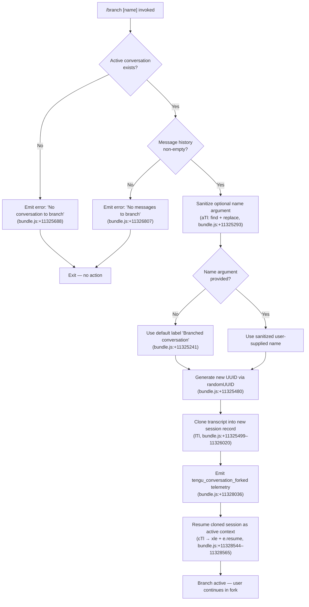

# `/branch`

> Analysis basis: CC v2.1.193 bundle.js (AST extraction + Claude interpretation)
> Minimum version: v2.1.193

---

## Overview

The `/branch` command creates a divergent copy of the current conversation at the point it is invoked, allowing the user to explore an alternative direction without overwriting the original message history. Internally the command clones the session transcript into a new conversation record identified by a freshly generated UUID, then resumes the cloned session as the active context. An optional name argument lets users label the branch immediately upon creation.

---

## Registration

| Field | Value |
|---|---|
| type | `local-jsx` |
| name | `branch` |
| description | `Create a branch of the current conversation at this point` |
| argumentHint | `[name]` |
| module_id | `w0o` |
| load_inline | `true` |
| loc_byte | `12741865` |
| loc_byte_end | `12742042` |
| loc_line | `8697` |
| arbor_handler.name | `Wpf` |
| arbor_handler.fqn | `claude-2.1.193::Wpf` |
| arbor_handler.kind | `AsyncFunction` |
| arbor_handler.resolution_path | `module_id` |
| arbor_handler.n_hits | `0` |

Analysis basis: CC v2.1.193 bundle.js:+12741865

---

## Input Branching

The command has four distinct runtime paths depending on the availability of a current conversation and whether an optional branch name is supplied.



---

## Behavioral Spec

### Top-level handler (`Wpf`)

The Arbor-resolved async handler `Wpf` is the command's entry point. It delegates immediately to the conversation-branching orchestrator (`cTl`) and then awaits its result.

```
async function branchCommandHandler(commandArgs, appContext):
    result = await conversationBranchOrchestrator(commandArgs, appContext)
    return result
```

Analysis basis: CC v2.1.193 bundle.js:+11328840

---

### Argument sanitization (`aTl`)

Before a user-supplied branch name is accepted, the raw argument string is cleaned to remove characters that would be invalid in session identifiers or filenames.

```
function sanitizeBranchName(rawInput, replacementMap):
    found = rawInput.find(replacementMap)       // locate invalid character sequences
    cleaned = rawInput.replace(found, "")       // strip or substitute them
    return cleaned
```

Analysis basis: CC v2.1.193 bundle.js:+11325293 (`aTl → t.find`), +11325371 (`aTl → n.replace`)

---

### Conversation-branching orchestrator (`cTl`)

This is the core function that performs the full clone-and-resume sequence.

```
async function conversationBranchOrchestrator(args, ctx):
    // 1. Resolve current conversation
    currentConversation = ctx.find(activeSession)      // l.find, +11327903
    if not currentConversation:
        return errorResult("No conversation to branch")  // +11325688

    // 2. Validate message history
    if currentConversation.messages is empty:
        return errorResult("No messages to branch")    // +11326807

    // 3. Determine branch name
    rawName = args[0] ?? ""
    sanitizedName = sanitizeBranchName(rawName)        // aTl, +11327899
    branchLabel = sanitizedName or "Branched conversation"  // +11325241

    // 4. Record timestamps
    forkTimestamp = new Date().toISOString()           // u.toISOString, +11328126
    forkEpoch     = new Date().getTime()               // u.getTime,     +11328175

    // 5. Generate unique identifier for the branch session
    branchUUID = crypto.randomUUID()                   // oTl.randomUUID, +11325480

    // 6. Construct new session metadata (Lt, Dh, mr, ax, sk, Gf)
    newSessionMetadata = buildSessionRecord(
        id         = branchUUID,
        label      = branchLabel,
        parentId   = currentConversation.id,
        forkMode   = "fork",                           // +11328557
        messages   = currentConversation.messages[0..100],  // limit constant +11325408
        timestamp  = forkTimestamp
    )

    // 7. Write branch data to disk
    //    - mkdir for new session directory       (cXn.mkdir,  +11325542)
    //    - createReadStream from source JSONL    (lXn.createReadStream, +11325591)
    //    - encoding "utf8"                       (+11325624)
    //    - createWriteStream to target path      (lXn.createWriteStream, +11325737)
    //    - pipe with drain event                 (+11326048)
    //    - readline.createInterface for line iteration (sTl.createInterface, +11325831)
    await copyConversationToDisk(currentConversation, newSessionMetadata)

    // 8. Handle content-replacement pass
    //    Annotates cloned lines with type="text" (+11325314)
    //    and marks them with tag "content-replacement" (+11326168)
    await applyContentReplacementPass(branchUUID)

    // 9. Emit roster entry and session state
    //    - writeRosterEntry (t.rosterEntry, +17489954)
    //    - writeSessionState via LKt/xKt (+11325525, +17490222)
    //    - setSessionTitle via vG  (+11328003)  → emits tengu_session_renamed (+13476461)
    await persistBranchMetadata(newSessionMetadata, branchLabel)

    // 10. Handle optional progress reporting (+11326725 "progress")
    reportProgress(branchLabel)

    // 11. Resume the forked session as the active context
    ctx.resume(branchSession)                          // e.resume, +11328544
    initFileWatcher(branchUUID)                        // xle → hc + Gi, +11328565

    // 12. Emit telemetry
    emitTelemetry("tengu_conversation_forked")        // +11328036

    return successResult(branchUUID)
```

Analysis basis: CC v2.1.193 bundle.js:+11327732 (`cTl → Lt`), +11327840 (`cTl → lTl`), +11327899 (`cTl → aTl`), +11328034 (`cTl → V`), +11328565 (`cTl → xle`), +11328569 (`cTl → IS`)

---

### Session-copy pipeline (`lTl`)

The low-level copy function streams the source conversation file into a new on-disk location, handling large transcripts via chunked I/O.

```
async function copyConversationToDisk(source, destination):
    mkdir(destination.dir, { recursive: true })        // cXn.mkdir, +11325542

    readStream  = createReadStream(source.path,        // lXn.createReadStream, +11325591
                      encoding="utf8",                 // +11325624
                      highWaterMark=448)               // +11325573

    writeStream = createWriteStream(destination.path,  // lXn.createWriteStream, +11325737
                      highWaterMark=384)               // +11325783

    lineReader  = createInterface(readStream)          // sTl.createInterface, +11325831

    // Per-line rewrite
    for line in lineReader:
        parsed  = JSON.parse(line)                     // Bt → JSON.parse, +11326135
        rewrite = applyContentReplacement(parsed)      // "content-replacement", +11326168
        writeStream.write(JSON.stringify(rewrite))

    // Completion
    writeStream.end()                                  // c.end, +11327203
    await streamFinished(writeStream)                  // iTl.finished, +11327217

    // Error / cleanup path
    on error:
        writeStream.destroy()                          // c.destroy, +11325933
        unlink(destination.path)                       // cXn.unlink, +11325951
        throw Error("No conversation to branch")       // +11325688
```

Analysis basis: CC v2.1.193 bundle.js:+11325480–11327217

---

### File-watcher initialization (`xle`)

After the branch session is resumed, a file watcher is installed so that subsequent edits to watched files are reflected in the new branch context.

```
function initFileWatcher(sessionId):
    rootPath = resolveProjectPath(sessionId)           // hc → Uy.join + PR, +4298454
    listing  = buildFileListing(rootPath)              // Gi, +4298468
    filter   = applyIgnoreRules(listing)               // $y → xte.delete, +4298512
    indexMap = buildFileIndex(filter)                  // $d, +4298589

    for entry in indexMap:
        scheduleWatch(entry)                           // In + Uf, +4298679
```

Analysis basis: CC v2.1.193 bundle.js:+11328565 (`cTl → xle`), +4298454 (`xle → hc`), +4298468 (`xle → Gi`)

---

### Session-title persistence (`vG`)

When the branch label is written, the title system emits a dedicated telemetry event.

```
function persistSessionTitle(sessionRecord, label):
    if label matches "custom-title" strategy:          // +13476369
        appendToTitleLog(sessionRecord.id, label)      // FAe → n.appendFileSync, +13475401
        mkdirIfMissing(titleLogDir)                    // FAe → n.mkdirSync,    +13475440
    emitEvent(NYt, "tengu_session_renamed")            // vG → NYt.emit,        +13476448
    emitTelemetry("tengu_session_renamed")             // +13476461
```

Analysis basis: CC v2.1.193 bundle.js:+11328003 (`cTl → vG`), +13476348 (`vG → ax`), +13476448 (`vG → NYt.emit`)

---

## State & Side Effects

| Item | Detail |
|---|---|
| Telemetry | `tengu_conversation_forked` (bundle.js:+11328036) — primary fork event |
| Telemetry | `tengu_session_renamed` (bundle.js:+13476461) — fired when branch label is written |
| Telemetry | `tengu_worktree_detection` (bundle.js:+8757725) — fired during worktree resolution inside `GJ` |
| Telemetry | `tengu_feature_ok` / `tengu_feature_bad` (bundle.js:+1026754, +1026821) — feature-flag gate results observed in call graph |
| Disk writes | New session directory created via `mkdir` (+11325542); JSONL transcript cloned via read/write stream pair; old partial file removed on error via `unlink` (+11325951) |
| Disk writes | Roster entry written for the branch session (`t.rosterEntry`, +17489954) |
| Disk writes | Session state file (`state.json`, +17488945) updated |
| Disk writes | Session title log appended (`n.appendFileSync`, +13475401) |
| appState changes | Active session pointer swapped to the new branch UUID after `e.resume` (+11328544) |
| File watcher | Installed for the new branch working tree via `xle` → `Gi` (+11328565) |
| Hook registration | `a7o.register` called inside `Ei` → `Kc` during session context setup (+68040) |
| Sound | Not observed in depth-2 traversal |

---

## Version History

| Version | Change |
|---|---|
| v2.1.193 | Initial analysis |

---

## Common Mistakes

1. **Invoking `/branch` before any messages exist.** The command guards against an empty transcript and returns `"No messages to branch"` (+11326807) without creating any files. Start a conversation first.
2. **Using special characters in the branch name.** The argument sanitizer (`aTl`) strips or replaces characters that are invalid in filesystem paths. Names with slashes, null bytes, or other reserved characters will be silently modified.
3. **Expecting the original session to remain active.** After `/branch` succeeds the active context is immediately swapped to the new fork. To continue on the original thread the user must explicitly navigate back to it.
4. **Assuming the branch is a Git branch.** The command operates on Claude Code's internal session transcript files, not on the repository's Git history. It does read Git worktree information (`GJ → vEe`, +13485007) for metadata purposes, but it does not run `git branch` or modify any Git refs.
5. **Omitting the name and expecting a meaningful label.** When no argument is provided the branch receives the generic label `"Branched conversation"` (+11325241). Supply a descriptive name via `/branch <name>` for easier later identification.

---

## Appendix — Identifier Mapping

> For bundle debugging only. Identifiers change across versions.

| Identifier | Role |
|---|---|
| `Wpf` | Top-level async handler for `/branch` (Arbor-resolved entry point) |
| `cTl` | Conversation-branching orchestrator (main logic function) |
| `lTl` | Low-level conversation-copy pipeline (stream-based JSONL cloner) |
| `aTl` | Branch-name argument sanitizer (find + replace pass) |
| `jpf` | Argument parser / option-set builder called from `cTl` |
| `vG` | Session-title persistence helper (writes label, emits `tengu_session_renamed`) |
| `cVe` | Agent-name persistence helper (writes agent-name attribute, emits `tengu_agent_name_set`) |
| `xle` | File-watcher initializer for the new branch session |
| `IS` | Session basename resolver (path utility called during watcher setup) |
| `GJ` | Git worktree / context resolver (reads worktree list, emits `tengu_worktree_detection`) |
| `vEe` | Worktree listing parser (splits porcelain output, resolves branch paths) |
| `xYl` | File-listing / glob expander used during context assembly |
| `gKe` | Buffer-allocation helper used by content-hash computation |
| `FAe` | Title-log append helper (`appendFileSync` + `mkdirSync`) |
| `b9` | Log-entry formatter called inside `FAe` |
| `n7` | Session-state read/write helper (reads + writes JSON state) |
| `FRt` | File-based mutex / state-update helper (read-modify-write with locking) |
| `di` | String slice helper (indexOf + slice utility) |
| `Zw` | Regex-escape helper (`e.replace` with `\$&` substitution, +203143) |
| `Lt` | Session-record constructor |
| `Rx` | Session-record base class |
| `mr` | Message-record constructor |
| `ax` | Context/attachment record builder |
| `sk` | Schema validator for session records |
| `Gf` | System-prompt record builder |
| `q2` | System-prompt base record |
| `In` | Async error-boundary / safe-await wrapper |
| `an` | Logger / structured-log emitter |
| `xe` | Error-handler and log-error dispatcher |
| `eo` | Error normalizer (wraps thrown values as Error objects) |
| `at` | String coercion utility |
| `Bi` | Telemetry batch writer |
| `Rds` | Telemetry record builder |
| `e_u` | Ring-buffer for telemetry events (shift + push) |
| `ke` | JSON serialization helper (`JSON.stringify` wrapper) |
| `Bt` | JSON parse helper (`JSON.parse` wrapper) |
| `hc` | Project-root path resolver (`Uy.join` + `PR`) |
| `Gi` | File-listing builder with stat and cache management |
| `$y` | File-cache invalidation helper (`xte.delete`) |
| `$d` | File-index builder (`Nm` + `Uy.join` + `ke`) |
| `Lh` | Session-status accessor (reads `"active"` status field) |
| `QLe` | Ignore-rule classifier (startsWith / indexOf / slice over patterns) |
| `xKt` | Session-path key builder (`Dg.join` + `wKt`) |
| `XSe` | Session-roster-entry writer (`Dg.join` + `sOe`) |
| `fk` | Error-kind tagger (`kxl`) |
| `M0` | Session-directory initializer (`Wt` + `Dg.join` + `j_t`) |
| `nD` | Late-error tagger (`kxl` with `"late"`) |
| `ZJ` | Session-history splitter (`Wt` + `Dg.join` + `sOe` + `e.split`) |
| `LKt` | Session-lock-file writer (`Dg.join` + `wKt`) |
| `W_t` | Background task scheduler with jitter (`Date.now` + `sEf` + `t.catch`) |
| `iG` | In-progress guard (prevents duplicate branch operations) |
| `C8l` | Daemon-status file writer (`iee` + `Date.now` + `ke`) |
| `iee` | Status normalizer (`Yge`) |
| `Yge` | Status-string parser (`sie` + `t.trim`) |
| `qs` | AsyncLocalStorage store accessor (`Kqu.getStore`) |
| `v7t` | Daemon-status path resolver (`I8l.join` + `nr`) |
| `gVo` | Background-session lifecycle manager (state transitions, file ops) |
| `cVo` | Daemon-claim sender (socket connect + frame write) |
| `tHm` | Claim timeout manager (`Date.now` + `Error` + `nHm` + `Un`) |
| `eHm` | Claim-frame builder (`Uq.buildClaimFrame`) |
| `qd` | Promise-resolve wrapper |
| `be` | String coercion wrapper |
| `uk` | Binary frame encoder (`Buffer.from` + `allocUnsafe` + `writeUInt32BE` + `writeUInt8`) |
| `f` | Background-session dispatch loop (main daemon worker function) |
| `D` | Background-session runner (process spawn + write + yield) |
| `NMc` | Executable realpath resolver (`_ur.realpath` + `_ur.stat`) |
| `T` | Shell-argument builder (uppercase, trim, format) |
| `RHm` | Daemon-IPC write helper (`B6n`) |
| `d` | Daemon-writer/multiplexer (multi-stream write with config reload) |
| `Un` | Timeout-with-abort utility (`setTimeout` + `clearTimeout` + `s.unref`) |
| `o` | Column-padded formatter (`s.map` + `i.padEnd`) |
| `Re` | Feature-flag OK reporter (`tengu_feature_ok`) |
| `we` | Feature-flag BAD reporter (`tengu_feature_bad`) |
| `Knr` | Low-memory checker (`Wt` + `it`, emits `tengu_bg_low_mem_mb`) |
| `it` | Memory-pressure gate (`KPt` + `zPt` + `H5` + `lCn` + `VPt.add`) |
| `I9e` | Session-pins file reader (`Xb.lstat` + `RNt` + `Xb.readFile`) |
| `RNt` | Pins-file path builder (`Uy.join` + `PR`) |
| `vUd` | Recursive directory walker (`Xb.readdir` + `Xb.lstat` + `Promise.all`) |
| `O` | Retry-timeout manager (`clearTimeout` + `setTimeout` + `d.write`, emits `tengu_daemon_idle_exit`) |
| `m` | Session-kill sweeper (`n.values` + `R.kill`) |
| `R` | Single-session kill sender (`d.write` + `V`, emits `tengu_daemon_yield`) |
| `_` | MCP tool-set accumulator (push into `a`) |
| `a` | MCP update applier (`l6e` + `Bcr` + `mSa`) |
| `l6e` | MCP server connection orchestrator (full connect/disconnect cycle) |
| `V3` | Tool-schema merger (`rct` + `aX` + `pRe` + `Object.assign`) |
| `BL` | Tool-list builder (`mg` + `eso`) |
| `Nn` | Tool-name normalizer |
| `QBt` | Tool-set deduplicator |
| `fba` | MCP connection attempt (`mao` + `hRe` + `iTn` + `Date.now`) |
| `aTn` | Auth-token fetcher (`iTn` + `tI`) |
| `sTn` | Auth-state subscriber (`Zl`) |
| `sn` | MCP debug logger (`rJe.push` + `kZ.logMCPDebug`) |
| `P1n` | MCP capability negotiator (`Tr` + `Hlp` + `_lp`) |
| `e3t` | MCP post-connect handler (`UNn.then` + `mao` + `qs` + `GNn` + `ke`) |
| `hso` | MCP health-status reporter (`tI` + `Zl` + `sn` + `be`) |
| `jL` | MCP skills telemetry emitter (`it`, fires `tengu_mcp_skills`) |
| `Zoo` | MCP server-name inclusion checker (`mn` + `n.includes`) |
| `w` | Retry-backoff timer (`B7` + `Date.now` + `Math.min` + `KAc` + `zAc`) |
| `iu` | MCP error logger (`rJe.push` + `kZ.logMCPError`) |
| `_ba` | MCP state accessor (`I8`) |
| `Uct` | MCP retry-count parser (`parseInt`) |
| `jNn` | MCP retry-interval parser (`parseInt`) |
| `Bcr` | MCP connection-result applier (`e.applyMcpUpdate` + `a6e` + `sn` + `oT` + `ME`) |
| `a6e` | MCP auth-result handler (`hRe`) |
| `oT` | MCP orphan cleanup (`s6e` + `o.cleanup` + `jL`) |
| `mSa` | MCP server-map updater (`sio`) |
| `VWo` | MCP client-set reconciler (`Object.entries` + `t.getClients` + `l6e` + `Bcr`) |
| `E1n` | MCP capability filter (`Nap.has` + `cso.has`) |
| `s6e` | MCP slot-config builder (`hRe`) |
| `h` | Render/display helper called during branch output |
| `Cg` | Session-context initializer (`Lt` + `Kc`) |
| `Kc` | Session-registry entry (`Ei`) |
| `Ei` | Hook registrar (`a7o.register`) |
| `wg` | Worktree-cache updater (called inside `GJ`) |
| `u` | Sort comparator for session list (`we` + `Re` + `R$` + `Hj`) |
| `p` | Process-abort manager (`vT` + `process.exit` + `u.abort`) |
| `B` | Disposable resource wrapper (`B.dispose`) |
| `IS` | Session basename resolver (`Uy.basename` + `Lt`) |