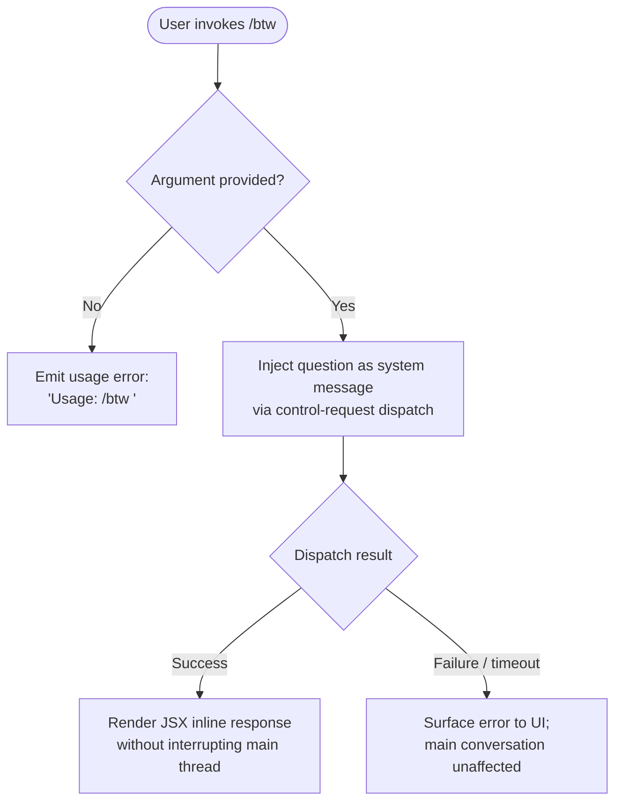

# `/btw`

> Analysis basis: CC v2.1.193 bundle.js (AST extraction + Claude interpretation)
> Minimum version: v2.1.193

---

## Overview

`/btw` ("by the way") is a side-channel question mechanism that lets users inject a quick question to the model without disrupting the primary conversation thread. It dispatches the question as a `control-request` through the thin-client layer, resolving immediately (`immediate: true`) so the main agent loop is not blocked. The handler renders JSX output, indicating the response is surfaced inline in the UI.

---

## Registration

| Field | Value |
|---|---|
| type | `local-jsx` |
| name | `btw` |
| description | Ask a quick side question without interrupting the main conversation |
| argumentHint | `<question>` |
| immediate | `true` |
| thinClientDispatch | `control-request` |
| module_id | `fTl` |
| load_inline | `true` |
| loc_byte | `11335770` |
| loc_byte_end | `11336009` |
| loc_line | `7132` |
| arbor_handler.name | `Qpf` |
| arbor_handler.fqn | `claude-2.1.193::Qpf` |
| arbor_handler.kind | `AsyncFunction` |
| arbor_handler.resolution_path | `module_id` |
| arbor_handler.n_hits | `0` |

Analysis basis: CC v2.1.193 bundle.js:+11335770

---

## Input Branching

The handler has three distinct paths based on argument presence and dispatch outcome:



Analysis basis: CC v2.1.193 bundle.js:+11335371, +11335373, +11335412, +11335481

---

## Behavioral Spec

### 1. Argument Validation

On invocation, the handler (`Qpf`) immediately checks whether the user supplied a `<question>` argument.

```
async function handleBtw(userInput, context):
    question = userInput.trim()
    if question is empty:
        return renderUsageError("Usage: /btw <your question>")
    proceed to dispatchSideQuestion(question, context)
```

- Usage string literal: `"Usage: /btw <your question>"` (bundle.js:+11335373)
- The check occurs before any I/O or async work.

Analysis basis: CC v2.1.193 bundle.js:+11335371

---

### 2. Side-Question Dispatch

The validated question is injected as a `"system"`-role message through the thin-client `control-request` pathway. Because `immediate: true` is set on the registration, the command resolves without waiting for the main agent turn to complete.

```
async function dispatchSideQuestion(question, context):
    message = buildMessage(role="system", content=question)
    result = await thinClientDispatch("control-request", message, context)
    return result
```

- Role literal used: `"system"` (bundle.js:+11335412)
- Dispatch mode: `thinClientDispatch = "control-request"` (registration)
- `immediate: true` ensures the call returns promptly and does not block the active conversation turn.

Analysis basis: CC v2.1.193 bundle.js:+11335412, +11335435

---

### 3. JSX Response Rendering

After dispatch, the handler calls `e_.jsx` to render the model's answer inline in the UI. The output is a React/JSX element, consistent with the `local-jsx` command type.

```
async function renderBtwResponse(dispatchResult):
    jsxElement = jsx(ResponseComponent, { result: dispatchResult })
    return jsxElement
```

Analysis basis: CC v2.1.193 bundle.js:+11335481

---

### 4. Config Lock and Persistence Layer (Indirect — via `mn` / `dXt`)

The call graph reveals that the handler reaches the global config persistence subsystem (`mn` → `dXt`) before dispatching. This is consistent with the pattern of recording session state or ensuring config integrity before issuing a control request. Key behaviors in this layer include:

- **Directory creation** via `s.mkdirSync` (bundle.js:+13973378) before writing.
- **File-lock acquisition** with a stale-lock warning: `"Lock acquisition took longer than expected - another Claude instance may be running"` (bundle.js:+13973562). If lock contention is detected, a `tengu_config_lock_contention` event is emitted (bundle.js:+13973651).
- **Backup rotation**: up to 5 backup copies (literal `5`, bundle.js:+13974955) stored under a `"backups"` subdirectory (bundle.js:+13975538), named with a `".backup."` infix (bundle.js:+13974816) and a `Date.now()` timestamp.
- **Config auto-repair**: if the re-read config fails JSON parsing under lock, the cached config is used as a fallback and `tengu_config_auto_repaired` is emitted (bundle.js:+13974164). See GH #3117.
- **Auth-loss prevention**: if the freshly written config is missing auth tokens that the cache holds, the write is refused and `tengu_config_auth_loss_prevented` is emitted (bundle.js:+13974494). See GH #3117.
- **Fallback write path**: on lock failure, a fallback write is attempted and `tengu_config_fallback_write` is emitted (bundle.js:+13973267).
- Config access guard: `"Config accessed before allowed."` (bundle.js:+13975970) is thrown if the config subsystem is accessed too early.

```
function saveConfigWithLock(configData, cachedConfig):
    acquireLock(timeout=60000ms)   // literal 60000, bundle.js:+13974700
    if lockContentionDetected:
        emit("tengu_config_lock_contention")
        log("Lock acquisition took longer than expected...")

    rereadConfig = readConfigFile()
    if rereadConfig has parseError:
        emit("tengu_config_auto_repaired")
        log("saveConfigWithLock: re-read hit a parse error; auto-repairing...")
        useCache()
    else if rereadConfig is missing auth that cache has:
        emit("tengu_config_auth_loss_prevented")
        log("saveConfigWithLock: re-read config is missing auth...")
        abort()

    rotateBackups(keep=5)
    writeAtomicWithFlush(configData)
    releaseLock()
```

Analysis basis: CC v2.1.193 bundle.js:+13970216, +13973562, +13973651, +13974164, +13974342, +13974494, +13974700, +13974955, +13975538

---

### 5. Delay Utility (`e` / jitter helper)

A small utility reachable from `Qpf` uses `Math.random()` and `setTimeout` to introduce jitter, likely for lock retry back-off:

```
function jitterDelay(baseMs):
    // literals: 2, 1 (bundle.js:+14343445, +14343461)
    factor = Math.random() between 1 and 2
    await setTimeout(baseMs * factor)
```

Analysis basis: CC v2.1.193 bundle.js:+14343447, +14343484, +14343445, +14343461

---

### 6. Atomic File Write with Flush (`writeFileSyncAndFlush` via `Qwt`)

The file-write helper used during config persistence performs:

```
function writeFileSyncAndFlush(targetPath, content, originalMode):
    tempPath = targetPath + "." + randomBytes(6).toString("hex")
    writeFileSync(tempPath, content)
    fchmodSync(tempPath, originalMode)   // preserves original permissions
    fsyncSync(tempPath)                  // flush to disk
    try:
        renameSync(tempPath, targetPath) // atomic replace
    except EACCES:
        fallbackInPlaceWrite(targetPath, content)
        log("writeFileSyncAndFlush: in-place fallback write failed; content preserved at temp path")
```

- Random suffix length: 6 bytes → 12 hex chars (bundle.js:+1103176, +1103188)
- Permission log: `"Applied original permissions to temp file"` (bundle.js:+1103691)
- Ignored fsync errors: `EINVAL`, `ENOTSUP`, `EPERM`, `ENOSYS` (bundle.js:+1099444–+1099486)

Analysis basis: CC v2.1.193 bundle.js:+1102427, +1103160, +1103608, +1103670, +1103817, +1104148

---

## State & Side Effects

| Item | Detail |
|---|---|
| Telemetry — `tengu_config_lock_contention` | Emitted when lock acquisition stalls; another Claude instance may be running (bundle.js:+13973651) |
| Telemetry — `tengu_config_stale_write` | Emitted when a stale config write is detected (bundle.js:+13973787) |
| Telemetry — `tengu_config_parse_error` | Emitted on JSON parse failure of on-disk config (bundle.js:+13977384) |
| Telemetry — `tengu_config_auto_repaired` | Emitted when cached config is used to repair a corrupted on-disk copy (bundle.js:+13974164) |
| Telemetry — `tengu_config_auth_loss_prevented` | Emitted when a write is refused to protect auth tokens (bundle.js:+13974494) |
| Telemetry — `tengu_config_fallback_write` | Emitted when the primary lock path fails and a fallback write is used (bundle.js:+13973267) |
| Telemetry — `tengu_daemon_yield` | Emitted when a background worker yields to a foreground/service daemon (bundle.js:+17503119) |
| Telemetry — `tengu_daemon_control` | Emitted on daemon stop/stop-failed control events (bundle.js:+17520352) |
| Config backup rotation | Up to 5 dated backups under `backups/` subdirectory; old backups pruned (bundle.js:+13974955) |
| File system | Atomic rename-based config write; `mkdirSync` for missing directories |
| JSX render | Command returns a JSX element for inline display; no persistent UI state mutation described in depth-2 traversal |
| Main conversation thread | Explicitly uninterrupted (`immediate: true`, `thinClientDispatch: "control-request"`) |
| TeammateMailbox | `markMessagesAsRead` lock lifecycle logged at acquire/release (bundle.js:+8849958, +8850057, +8850232, +8850856) |

---

## Version History

| Version | Change |
|---|---|
| v2.1.193 | Initial analysis |

---

## Common Mistakes

1. **Omitting the argument**: Invoking `/btw` with no text produces the usage error `"Usage: /btw <your question>"` and sends nothing to the model. Always include the question text.
2. **Expecting a conversational reply in the main thread**: `/btw` is explicitly designed to bypass the main conversation loop via `control-request`. The response appears as an inline side-channel answer, not as the next assistant turn.
3. **Assuming synchronous config safety**: The config layer uses file-locking with a 60-second timeout. If multiple Claude instances are running simultaneously, lock contention may delay the command and trigger `tengu_config_lock_contention` telemetry. This is observable but not fatal.
4. **Mistaking the `system` role injection for a user message**: The question is submitted with role `"system"`, not `"user"`, meaning it is treated as an out-of-band instruction at the model level, not as a continuation of the human conversation.
5. **Assuming config writes always succeed**: The auth-loss prevention guard may silently refuse a write (emitting `tengu_config_auth_loss_prevented`) rather than corrupting the stored credentials. If settings changes are not persisting, check for this condition.

---

## Appendix — Identifier Mapping

> For bundle debugging only. Identifiers change across versions.

| Identifier | Role |
|---|---|
| `Qpf` | Main handler for `/btw` command (AsyncFunction; Arbor-resolved via module_id `fTl`) |
| `e` | Jitter delay utility (uses `Math.random` + `setTimeout` for lock back-off) |
| `mn` | Global config save orchestrator (entry point into config persistence layer) |
| `dXt` | Config-with-lock writer (manages lock acquisition, backup rotation, atomic write) |
| `t` | Generic filesystem or utility helper (context-dependent across call sites) |
| `jt` | Path/file resolution utility |
| `s` | Filesystem module reference (provides `mkdirSync`, `statSync`, `readdirStringSync`, etc.) |
| `r` | Secondary filesystem or resource handle |
| `i` | Stream / resource closer or iterator |
| `uXs` | Object metadata builder (calls `yNr` and `Object.assign`) |
| `yNr` | Metadata field initialiser (calls `cXs`) |
| `T` | Message/log formatting utility (handles debug, redaction, level tagging) |
| `qFc` | Log dispatch helper (routes to `YO`, `Qgr`, `c7o`) |
| `ke` | JSON serialiser wrapper (calls `JSON.stringify`) |
| `Lc` | String redaction / truncation utility (inserts `[REDACTED]`) |
| `iYe` | Output formatter (calls `OXo`) |
| `XFc` | File-write pipeline (computes byte length, calls flush helpers) |
| `V` | Version or validation checker |
| `an` | Error or assertion utility |
| `bSt` | Config file reader / backup manager |
| `Bt` | JSON parse wrapper (calls `JSON.parse`) |
| `R4` | String prefix stripper (`startsWith` + `slice`) |
| `u9o` | Directory reader / file discovery helper |
| `p9o` | Path joiner with normalisation |
| `m` | Process manager / signal sender (issues `SIGTERM` via `R.kill`) |
| `TSt` | Timestamp/state tracker |
| `n` | String lowercaser or iterator |
| `v` | String prefix checker |
| `y` | Split-and-process pipeline (calls `Bje`) |
| `Bje` | TeammateMailbox message processor (markMessagesAsRead logic) |
| `I` | Scroll / viewport calculation helper (`Math.max`, `Math.floor`) |
| `R` | Terminal output writer (`d.write`) |
| `A` | Render or display adapter (calls `QBt`, `XAt`) |
| `Qwt` | Atomic file write with flush (`writeFileSyncAndFlush`) |
| `Md` | Realpath resolver (calls `Gc`, `$p`, `KI`, `Ggr`, `e.realpathSync`) |
| `u` | Daemon lifecycle controller (`we`, `Re`, `R$`, `Hj`) |
| `In` | Inner assertion / guard (calls `an`) |
| `mJe` | fsync error filter (ignores `EINVAL`, `ENOTSUP`, `EPERM`, `ENOSYS`) |
| `Ops` | Object property definer (`Object.defineProperty` with `cause`) |
| `m1e` | Config metadata extractor |
| `l9o` | Config entries enumerator (`Object.entries`) |
| `cXt` | Timestamp recorder (`Date.now`) |
| `lXt` | Config load+lock entry point (calls `bSt`, `Gx`) |
| `Qor` | Config write finaliser (calls `Qwt`, `ke`, `FT`, etc.) |
| `Oe` | UI or output emitter (calls `Zze`) |
| `Zze` | Low-level output primitive |

---

Note: index built via Arbor fallback; some signals (telemetry, literals) may be missing — see arbor-fallback.js.