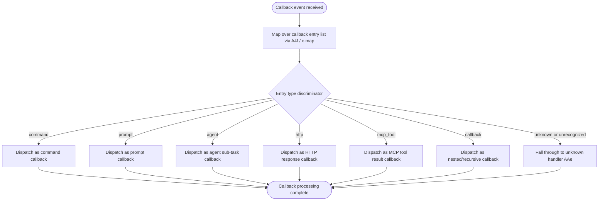

# `/callback`

> Analysis basis: CC v2.1.193 bundle.js (AST extraction + Claude interpretation)
> Minimum version: v2.1.193

---

## Overview

The `/callback` command is an internal command type used by Claude Code to handle asynchronous callback dispatch — routing continuation signals back into the agent loop from external or deferred sources. It does not appear to be a user-facing slash command in the conventional sense; rather, it acts as a structural registration point that allows the CLI to process callback-type events (such as responses from HTTP endpoints, MCP tool completions, or agent sub-task returns) within the unified command dispatch pipeline.

---

## Registration

| Field | Value |
|---|---|
| type | `callback` |
| name | `callback` |
| description | `null` |
| loc_byte | `13635732` |
| loc_byte_end | `13635765` |
| loc_line | `10227` |
| arbor_handler.name | `A4f` |
| arbor_handler.fqn | `claude-2.1.193::A4f` |
| arbor_handler.kind | `Function` |
| arbor_handler.resolution_path | `direct` |
| arbor_handler.n_hits | `1` |

Analysis basis: CC v2.1.193 bundle.js:+13635732

---

## Input Branching

The handler `A4f` processes a list of callback entries. Based on the literals extracted from the implementation, callback entries carry a `type` discriminator field. The known type values found in the bundle are `"command"`, `"prompt"`, `"agent"`, `"http"`, `"mcp_tool"`, `"callback"`, and `"unknown"`. This constitutes well over 3 distinct branches, so a Mermaid flowchart is used.



Analysis basis: CC v2.1.193 bundle.js:+13635376 (type discriminator literal `"command"`), +12701725 (`"prompt"`), +12701754 (`"agent"`), +12701782 (`"http"`), +12701806 (`"mcp_tool"`), +12701868 (`"callback"`), +13635778 (`"unknown"`)

---

## Behavioral Spec

### Primary Handler — Callback Dispatch (`A4f`)

The handler `A4f` is resolved directly (Arbor `resolution_path: direct`) within the registration byte range.

```
function callbackCommandHandler(callbackEntries):
    // Map over each entry in the callback list
    results = callbackEntries.map(entry => dispatchCallbackEntry(entry))
    // Invoke the secondary dispatcher for unresolved or unknown entries
    invokeUnknownFallback(results)
    return results
```

Analysis basis: CC v2.1.193 bundle.js:+13635345 (`e.map` call), +13635416 (`AAe` call)

### Callback Entry Dispatcher (`e`)

The inner per-entry function `e` handles the timing and randomness aspects of callback dispatch:

```
function dispatchCallbackEntry(entry):
    // Apply a random delay scaling factor
    // Numeric constants: base value 2, offset value 1
    delayFactor = Math.random() * 2 + 1   // yields a value in [1, 3)
    setTimeout(processEntry, delayFactor * baseDelay)
```

The use of `Math.random()` combined with `setTimeout` suggests that callback entries are dispatched with a small randomized jitter delay to prevent thundering-herd collisions when multiple callbacks resolve simultaneously.

Analysis basis: CC v2.1.193 bundle.js:+14343447 (number literal `2`), +14343461 (number literal `1`), +14343447 (`Math.random` call), +14343484 (`setTimeout` call)

### Unknown / Fallback Handler (`AAe`)

When no type branch matches, or after the map completes, `AAe` is invoked. Based on the literal `"unknown"` found at the registration closure boundary, this function handles entries whose type cannot be classified.

```
function unknownFallbackHandler(entry):
    // Tag entry as type "unknown"
    // Log or silently discard unrecognized callback type
    markAs("unknown")
```

Analysis basis: CC v2.1.193 bundle.js:+13635778 (literal `"unknown"`), +13635416 (`AAe` call site)

### Callback Type Enumeration

The following type strings are present in the bundle and represent the full known set of callback category values the dispatch logic recognizes:

| Literal Value | Inferred Role | loc_byte |
|---|---|---|
| `"command"` | Callback from a slash-command execution | +13635376 |
| `"prompt"` | Callback from a prompt submission | +12701725 |
| `"agent"` | Callback from an agent sub-task | +12701754 |
| `"http"` | Callback from an HTTP request | +12701782 |
| `"mcp_tool"` | Callback from an MCP tool invocation | +12701806 |
| `"callback"` | Nested/recursive callback | +12701868 |
| `"unknown"` | Unclassified / fallback | +13635778 |

---

## State & Side Effects

| Item | Detail |
|---|---|
| Telemetry | None detected — `telemetry` array is empty in extracted data |
| Hook registration | <!-- TODO: not found in depth-2 traversal; needs --depth 4 --> |
| appState changes | <!-- TODO: not found in depth-2 traversal; needs --depth 4 --> |
| Sound | <!-- TODO: not found in depth-2 traversal; needs --depth 4 --> |
| Async side effect | `setTimeout` with randomized jitter delay applied per callback entry (CC v2.1.193 bundle.js:+14343484) |
| Randomization | `Math.random()` used to compute jitter factor in range [1, 3) (CC v2.1.193 bundle.js:+14343447) |

---

## Version History

| Version | Change |
|---|---|
| v2.1.193 | Initial analysis |

---

## Common Mistakes

1. **Treating `/callback` as a user-facing command**: This command type has a `null` description and is not intended for direct user invocation. It is an internal dispatch registration. Attempting to invoke it manually may produce no visible output or an unrecognized-command error.
2. **Assuming synchronous execution**: The use of `setTimeout` with a randomized delay means callback entries are not processed synchronously. Code or tests that expect immediate side effects after a callback event fires may fail intermittently.
3. **Ignoring the `"unknown"` fallback**: Any callback entry whose `type` field does not match one of the seven known values will be silently routed through the `AAe` fallback. Dropping or malforming the `type` field in a callback payload will cause silent misrouting rather than an error.
4. **Conflating the `"callback"` type value with the command name**: The string `"callback"` appears both as the command's `name` registration field and as one of the callback type discriminator values. These are separate concepts — one is the command identifier, the other is a category tag for nested/recursive callback payloads.

---

## Appendix — Identifier Mapping

> For bundle debugging only. Identifiers change across versions.

| Identifier | Role |
|---|---|
| `A4f` | Primary callback command handler function (entry point, Arbor-resolved, `direct` resolution path) |
| `e` | Per-entry callback dispatcher function; applies `Math.random`-based jitter and `setTimeout` scheduling |
| `AAe` | Unknown/fallback handler invoked for unclassified callback entries or as post-map finalization step |

---

Note: index built via Arbor fallback; some signals (telemetry, literals) may be missing — see arbor-fallback.js.