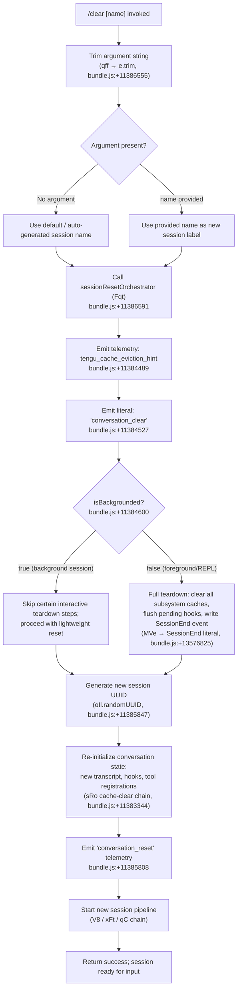

# `/clear`

> Analysis basis: CC v2.1.193 bundle.js (AST extraction + Claude interpretation)
> Minimum version: v2.1.193

---

## Overview

`/clear` starts a fresh Claude Code session with an empty context window while preserving the previous session on disk for later resumption via `/resume`. It is also reachable via the aliases `/reset` and `/new`. The command supports non-interactive (scripted/piped) invocations and dispatches its post-command output through the `post-text` thin-client path.

---

## Registration

| Field | Value |
|---|---|
| type | `local` |
| name | `clear` |
| description | Start a new session with empty context; previous session stays on disk (resumable with /resume) |
| argumentHint | `[name]` |
| supportsNonInteractive | `true` |
| thinClientDispatch | `post-text` |
| aliases | `reset`, `new` |
| module_id | `aIl` |
| load_inline | `true` |
| loc_byte | 11386729 |
| loc_byte_end | 11387020 |
| loc_line | 7155 |
| arbor_handler.name | `qff` |
| arbor_handler.fqn | `claude-2.1.193::qff` |
| arbor_handler.kind | `AsyncFunction` |
| arbor_handler.resolution_path | `module_id` |
| arbor_handler.n_hits | 0 |

Analysis basis: CC v2.1.193 bundle.js:+11386729

---

## Input Branching

The command has 3+ distinct paths depending on whether an optional session name argument is supplied, whether the session is currently backgrounded, and whether the full session-reset pipeline completes successfully.



---

## Behavioral Spec

### Top-Level Handler (`qff`)

The Arbor-resolved handler for `/clear` is `qff` (AsyncFunction, `claude-2.1.193::qff`).

```
async function clearCommandHandler(rawArgument):
    trimmedName = rawArgument.trim()          // bundle.js:+11386555
    result = await sessionResetOrchestrator(trimmedName)
    return result
```

Analysis basis: CC v2.1.193 bundle.js:+11386555

---

### Session Reset Orchestrator (`Fqt`)

`Fqt` is the central coordination function invoked from `qff`. It executes the following high-level steps:

```
async function sessionResetOrchestrator(newSessionName):
    // 1. Validate/parse an optional numeric suffix in newSessionName
    //    using parseInt + Number.isFinite (Gqt path)
    //    Radix base: 10  (bundle.js:+13586286)
    //    Token budget adjustment: Math.max / Math.min clamping
    //    (bundle.js:+13586493, +13586506)

    // 2. Emit cache-eviction hint telemetry
    emit("tengu_cache_eviction_hint")         // bundle.js:+11384489
    emit_literal("conversation_clear")        // bundle.js:+11384527

    // 3. Check isBackgrounded flag               // bundle.js:+11384600
    backgrounded = readFlag("isBackgrounded")

    // 4. If foreground: write SessionEnd lifecycle event (MVe)
    if not backgrounded:
        writeSessionEndEvent()                // bundle.js:+13576825

    // 5. Flush all in-flight hook queues (TH + Xrr)
    flushPendingHooks()                       // bundle.js:+11385214

    // 6. Clear all subsystem caches (sRo cache-clear chain)
    clearAllCaches()                          // bundle.js:+11384795

    // 7. Kill any running background subprocesses (f → D.kill)
    killSubprocesses()                        // bundle.js:+11384692

    // 8. Assign a new session UUID
    newUUID = oIl.randomUUID()                // bundle.js:+11385847

    // 9. Re-register tool hooks and policy settings (Cg, Bqt, ipe)
    reinitializeHooks()                       // bundle.js:+11385750

    // 10. Re-initialize transcript writer (ASe)
    reinitializeTranscript()                  // bundle.js:+11386125

    // 11. Emit conversation_reset telemetry string
    emit_literal("conversation_reset")        // bundle.js:+11385808

    // 12. Restart session pipeline (V8)
    startNewSession(newUUID, newSessionName)  // bundle.js:+11386314

    return { ok: true }
```

Analysis basis: CC v2.1.193 bundle.js:+11384385 – +11386314

---

### Cache-Clear Chain (`sRo`)

`sRo` is the composite reset function that clears all in-memory caches accumulated during the previous session. At depth-2 the traversal reveals at least the following distinct cache/store operations:

```
function clearAllCaches():
    clearSkillIndexCache()          // P6 → e.clearSkillIndexCache, bundle.js:+13423705
    clearW8Cache()                  // WZi → W8.clear, bundle.js:+5351782
    writeIndexCacheFile()           // z4e, bundle.js:+5340432
    clearXBeModule()                // XBe, bundle.js:+10822931
    resetContextGroups()            // Vzn → CG delete chain, bundle.js:+10822569
    clearHookCaches():
        clearHhtCache()             // til → hht.clear, bundle.js:+10000638
        clearOWtCache()             // til → OWt.clear, bundle.js:+10000650
        clearIjeVho()               // h8a → Ije.clear + VHo.clear, bundle.js:+8746424
        clearTIe()                  // sCr → TIe.clear, bundle.js:+1157229
        clearVje()                  // zIr → vJe.clear, bundle.js:+1148468
        clearDjn()                  // Yza → djn.clear, bundle.js:+9003324
        clearRqt()                  // o6 → rqt.clear, bundle.js:+11117631
        clearVneXre()               // $ba → vne.clear + xRe.clear, bundle.js:+7046424
    resetAutonomousLoopDelivered()  // Qif.resetAutonomousLoopDelivered, bundle.js:+10823074
    clearEFt()                      // eFt, bundle.js:+11383399
    clearAgl()                      // agl → eVt, bundle.js:+11383696
    clearElCl()                     // e_l.clear (Fzn), bundle.js:+10799898
    clearHBtFso()                   // dEa → HBt.clear + Fso.clear, bundle.js:+6833338
```

Analysis basis: CC v2.1.193 bundle.js:+11383344

---

### Policy/Token-Budget Parsing (`Gqt`)

Before executing the reset, `Fqt` delegates to `Gqt` to resolve any integer suffix embedded in the session name and to apply token-budget clamping:

```
function parsePolicySettings(rawName):
    parsed = parseInt(rawName, 10)            // bundle.js:+13586275, radix literal +13586286
    if not Number.isFinite(parsed):           // bundle.js:+13586297
        parsed = defaultTokenBudget          // S_ path, bundle.js:+13586340
    clamped = Math.max(                       // bundle.js:+13586493
                  Math.min(parsed, upperBound),  // bundle.js:+13586506
                  lowerBound
              )
    // Result stored in policySettings key    // literal bundle.js:+3420576
    return clamped
```

Analysis basis: CC v2.1.193 bundle.js:+13586275

---

### Session-End Lifecycle Event (`MVe`)

When running in foreground (non-backgrounded), `/clear` writes a `SessionEnd` event before tearing down state:

```
function writeSessionEndEvent():
    payload = buildSessionEndPayload(
        eventType = "SessionEnd",             // literal bundle.js:+13576825
        timestamp = Date.now()
    )
    writeToTranscript(payload)               // Hd pipeline
    notifySubscribers(payload)
```

Analysis basis: CC v2.1.193 bundle.js:+13576798

---

### Hook Flush (`TH`)

Outstanding hook promises are flushed before the session is torn down:

```
function flushPendingHooks():
    for each entry in pendingHookRegistry (Xrr):  // bundle.js:+13541614
        tracker = zrr.get(entry.id)               // bundle.js:+13541635
        if tracker exists:
            await tracker.flush()                  // bundle.js:+13541657
            zrr.delete(entry.id)                   // bundle.js:+13541667
```

Analysis basis: CC v2.1.193 bundle.js:+11385214

---

### New Session Initialization (`V8` → `xFt` → `qC`)

After teardown, `/clear` bootstraps the replacement session. Key steps observed at depth ≤ 2:

```
function startNewSession(uuid, name):
    // Check safe-mode flag (--safe-mode literal, bundle.js:+70258)
    if safeMode:
        log("Skipping plugin hooks - safe mode...")  // bundle.js:+5363673
    else:
        registerPluginHooks()           // V8 hook-load chain, bundle.js:+5363868

    // Emit session_start lifecycle event
    emit("session_start")               // literal bundle.js:+5204738

    // Register new abort controller
    abortController = new AbortController()  // literal bundle.js:+11385149

    // Initialize new REPL context via qC (full agent loop bootstrap)
    initAgentLoop(uuid, name)           // xFt → qC, bundle.js:+5364768

    // Emit conversation_reset string
    emit("conversation_reset")          // literal bundle.js:+11385808
```

Analysis basis: CC v2.1.193 bundle.js:+5363590

---

## State & Side Effects

| Item | Detail |
|---|---|
| Telemetry — `tengu_cache_eviction_hint` | Fired immediately on invocation (bundle.js:+11384489) |
| Telemetry — `tengu_run_hook` | Fired as hooks are dispatched during teardown/re-init (bundle.js:+13626458) |
| Telemetry — `tengu_repl_hook_finished` | Emitted when each REPL hook completes (bundle.js:+13610193) |
| Telemetry — `tengu_session_renamed` | Emitted if the new session receives a name (bundle.js:+13476461) |
| Telemetry — `tengu_feature_ok` / `tengu_feature_bad` | Feature flag check outcomes during init (bundle.js:+1026754, +1026821) |
| Telemetry — `tengu_shell_set_cwd` | Working-directory update for new session (bundle.js:+7198876) |
| Telemetry — `tengu_mcp_skills` | MCP skill index refresh on session start (bundle.js:+6781017) |
| Telemetry — `tengu_transcript_write_failed` | If the new transcript file cannot be opened (bundle.js:+13482288) |
| Telemetry — `tengu_hook_plugin_metrics` | Hook execution metrics (bundle.js:+13604531) |
| Telemetry — `tengu_hook_plugin_injected` | Plugin hook injection event (bundle.js:+13624787) |
| Literal emitted: `"conversation_clear"` | Marks the clear event in transcript/state (bundle.js:+11384527) |
| Literal emitted: `"conversation_reset"` | Marks completion of reset (bundle.js:+11385808) |
| Literal emitted: `"SessionEnd"` | Lifecycle event written to transcript before teardown (bundle.js:+13576825) |
| Literal emitted: `"session_start"` | Lifecycle event written at new session boot (bundle.js:+5204738) |
| Hook registration | All hook maps are cleared via `sRo` and then re-registered for the new session via `Cg`/`Bqt`/`ipe` chains |
| appState changes | `isBackgrounded` read-checked; policy settings key updated; new session UUID assigned via `oIl.randomUUID` |
| Cache clears | `W8`, `hht`, `OWt`, `Ije`, `VHo`, `TIe`, `vJe`, `djn`, `rqt`, `vne`, `xRe`, `e_l`, `HBt`, `Fso`, `CG`, `Nwo`, `hVt`, `oVe` |
| Subprocess lifecycle | Any previously-spawned subprocesses sent `SIGKILL` during teardown (literal bundle.js:+17482214) |
| Sound | <!-- TODO: not found in depth-2 traversal; needs --depth 4 --> |
| Previous session persistence | Previous session written to disk before clear; resumable with `/resume` |

---

## Version History

| Version | Change |
|---|---|
| v2.1.193 | Initial analysis |

---

## Common Mistakes

1. **Assuming `/clear` is destructive** — The previous session is retained on disk and can be resumed with `/resume`. Only the active in-memory context is discarded.
2. **Expecting the new session to inherit tool state** — All hook maps and cache stores are wiped by the `sRo` chain before the new session starts. Any MCP connections are re-negotiated.
3. **Passing a non-string argument** — The `[name]` argument is trimmed (bundle.js:+11386555) and then parsed for a potential integer suffix via `parseInt` base-10 (bundle.js:+13586286). Passing an arbitrary non-numeric string is valid; it simply won't match an integer budget override.
4. **Using `/clear` to reset safe-mode state** — The `--safe-mode` flag (bundle.js:+70258) is evaluated at session initialization time. `/clear` respects whatever mode the process was started with; it does not toggle safe mode.
5. **Assuming instant completion in backgrounded sessions** — When `isBackgrounded` is true (bundle.js:+11384600), the interactive teardown steps (SessionEnd write, full hook flush) are skipped, so behavior in a background session is lighter but may differ in observable side effects.

---

## Appendix — Identifier Mapping

> For bundle debugging only. Identifiers change across versions.

| Identifier | Role |
|---|---|
| `qff` | Top-level async handler for `/clear` (Arbor-resolved entry point) |
| `Fqt` | Session reset orchestrator — coordinates full teardown and re-init |
| `Gqt` | Policy/token-budget parser (parseInt + clamp) |
| `S_` | Default token-budget resolver |
| `El` | Context element helper |
| `Kae` | Policy settings accessor |
| `i4` | Utility (Rx-dependent) |
| `B$` | Cache/hook reset driver within Gqt path |
| `Rjr` | Session state store accessor (get/set) |
| `PH` | Dual-cache clear (Den.clear + Xdr.clear) |
| `kjr` | Hook-map state writer |
| `MVe` | SessionEnd event writer and lifecycle notifier |
| `Hd` | Transcript/state write pipeline |
| `Lt` | Low-level state reader |
| `KO` | State write utility (Rx-based) |
| `hC` | Model-string classifier (detects claude-3-*, opus, sonnet, haiku variants) |
| `ZD` | Extended model capability check (Bee/rHe) |
| `ax` | Tool-list builder |
| `Pt` | Path/message formatter |
| `Sx` | Main agent-loop session runner |
| `qB` | State-batch emitter |
| `T` | Message formatter / debug-mode switch |
| `GAe` | Lightweight state reader (Lwe) |
| `hBo` | Hook-filter and hook-loader for session |
| `c` | Background-session state check (yn) |
| `VXl` | Session variable extractor |
| `gBo` | Third-party hook filter |
| `zXl` | Session context normalizer |
| `Nn` | Notification broadcaster |
| `V` | Versioned state builder |
| `ke` | JSON serializer wrapper |
| `xe` | Error logger / error push |
| `Re` | Feature-ok reporter |
| `o$e` | Feature-ok query dispatcher (Qan) |
| `WM` | Abort-controller / timeout manager |
| `ofe` | One-shot flag helper |
| `bO` | Background orchestration helper |
| `ior` | Background hook runner (bO + gOo + hOo) |
| `dBo` | MCP tool executor |
| `cor` | Hook output parser (JSON vs plain-text) |
| `epe` | Plugin metrics aggregator |
| `uBo` | HTTP hook dispatcher |
| `WXl` | Hook output slice/prefix handler |
| `AAe` | Error formatter |
| `uor` | Spawn-based hook executor (aor.spawn) |
| `y6e` | Async hook result collector |
| `we` | Feature-bad reporter |
| `c3` | Telemetry event emitter (jUd.emit) |
| `sAo` | Agent-state accessor |
| `Jbt` | Session-boot payload builder |
| `Ve` | Non-conforming session marker (Zze) |
| `Zze` | Low-level state token |
| `br` | Non-conforming branch handler (ph + Ve) |
| `ph` | Non-conforming session sub-handler |
| `s` | Subprocess tracker (r.add / r.delete) |
| `r` | Active-subprocess registry |
| `Is` | CLI error handler (process.exit) |
| `i` | Subprocess lifecycle manager (n.close / r.close) |
| `n` | Transport-level handler (toLowerCase) |
| `f` | Background session dispatch loop |
| `D` | Subprocess factory (NMc + Kd + xe) |
| `NMc` | Real-path resolver (_ur.realpath / stat) |
| `Kd` | Subprocess config builder |
| `RHm` | Build-info accessor (B6n) |
| `d` | Supervisor write/stop/config handler |
| `Un` | Timeout-based retry helper |
| `o` | Session-roster padEnd formatter |
| `Knr` | macOS memory monitor |
| `it` | Memory-pressure checker (KPt / zPt / ZW) |
| `I9e` | Session-file cleaner (lstat / rm / readFile) |
| `RNt` | Pins-file path builder (Uy.join + PR) |
| `Bt` | JSON.parse wrapper |
| `In` | ENOENT-safe async wrapper (an) |
| `vUd` | Recursive directory reader |
| `O` | Daemon idle-exit timer (setTimeout + d.write) |
| `F` | Daemon timer reset helper |
| `cVo` | Socket-claim connector (Uq.claim) |
| `w9o` | Session state file writer ($q.mkdir + writeFile) |
| `tHm` | Send-claim timeout handler |
| `eHm` | Claim-frame builder (Uq.buildClaimFrame) |
| `qd` | Async error-code helper (an) |
| `be` | String coercion helper |
| `uk` | Binary frame encoder (Buffer) |
| `gVo` | Background session spawn and lifecycle manager |
| `hc` | Home-directory path joiner |
| `Gi` | Session file cache manager (xte + ZLe) |
| `Lh` | Session active-state accessor (i0) |
| `QLe` | Roster-entry parser |
| `$d` | Session path builder (Nm + Uy.join) |
| `W_t` | Hook-fire watchdog (Oxl.then + sEf) |
| `xKt` | Session-dir path resolver (Dg.join + wKt) |
| `t` | Generic state carrier |
| `XSe` | Session-open path resolver (Dg.join + sOe) |
| `fk` | Error-state marker (kxl) |
| `M0` | Session-metadata writer (dMo + j_t) |
| `nD` | Late-state marker (kxl) |
| `ZJ` | Session log splitter (sOe + e.split) |
| `LKt` | Session-lock path builder |
| `p` | Forced-shutdown trigger (process.exit + u.abort) |
| `Oe` | Non-conforming exit reporter (Zze) |
| `B` | Disposable resource holder |
| `Yl` | Session label setter |
| `$E` | Session extra-metadata writer |
| `sRo` | Composite cache-clear orchestrator (all subsystems) |
| `eRo` | Pre-clear state snapshot |
| `p0` | Skill-index cache manager (P6 + LYn + oAl + z8e) |
| `P6` | Skill index clear (e.clearSkillIndexCache + JMo) |
| `LYn` | Skill-loader config accessor |
| `oAl` | Skill-list normalizer |
| `z8e` | Skill-file event emitter (eVt) |
| `WZi` | W8-cache clear + z4e re-write trigger |
| `z4e` | Disk-index writer (WDn.mkdir + writeFile) |
| `xTt` | Session-title tracker |
| `Bre` | Context-group and hook-map full reset |
| `XBe` | Main context-group initializer (JD) |
| `Vzn` | Context-group delete chain (CG + Nwo + hVt + oVe) |
| `eFt` | DL-cache clear |
| `LTt` | Lifecycle-table reset |
| `kTt` | Rx-based cache clear (Hse) |
| `Fzn` | e_l map clear |
| `dEa` | HBt + Fso double cache clear |
| `IQa` | In-process teammate reset |
| `nDe` | Notification-delivery reset |
| `Ay` | Output-token counter reset (y7e + Object.values) |
| `Vwo` | Worktree-state cleanup |
| `o6` | rqt cache clear |
| `h8a` | Ije + VHo cache clear (hook-plugin double-store) |
| `til` | hht + OWt cache clear (hook-tool double-store) |
| `sCr` | TIe cache clear |
| `rIl` | Isolation-latch reset |
| `Yza` | djn cache clear |
| `rmr` | Membership check helper (e.has) |
| `zIr` | vJe cache clear |
| `agl` | Skill-event emitter (eVt) |
| `eVt` | Skill-store accessor (ozn.get + Q8t) |
| `$ba` | vne + xRe double cache clear |
| `YH` | Working-directory setter (UUn.resolve + KTr) |
| `jt` | Path normalizer |
| `KTr` | AsyncLocalStorage working-dir resolver |
| `NH` | Path normalize helper (e.normalize, NFC) |
| `ZQ` | Working-dir fallback resolver (Wbt) |
| `mr` | Rx-based reactive getter |
| `W4e` | Session-metadata updater |
| `lT` | Timeout-list manager |
| `TH` | Hook-flush coordinator (Xrr + zrr) |
| `Xrr` | Pending-hook tracker (zYl.add / delete) |
| `Hut` | Deep-var reset (Dva) |
| `Dva` | Deep-state variable accessor |
| `oT` | Tool-cleanup and jL dispatch |
| `s6e` | Tool-hash builder (hRe) |
| `hRe` | SHA-256 hash helper |
| `jL` | MCP-skill registration (it) |
| `iIl` | Memo-table reset (mTe) |
| `mTe` | Memoization store |
| `Cg` | Hook re-registrar (Lt + Kc) |
| `Kc` | Hook registry writer (Ei) |
| `Ei` | a7o.register hook binding |
| `sk` | Session key builder |
| `Gf` | Tool-path builder (q2 + Dh + x0e.join) |
| `q2` | Rx-based path reader |
| `Bqt` | Hook category re-registrar (Kc) |
| `tpr` | Session UUID generator (zfe.randomUUID + Kzo) |
| `zzo` | UUID format helper |
| `Kzo` | New-session event emitter (Nen.emit) |
| `YLa` | Session-label initial-value setter |
| `jJ` | JIT hook registrar (Kc) |
| `F4i` | File-cache refresher ($y + Gi + $d) |
| `$y` | xte.delete helper |
| `Uf` | File-access guard (hme.has + an) |
| `vG` | Session-event writer (ax + FAe + NYt.emit) |
| `FAe` | File-append logger (n.appendFileSync + mkdirSync) |
| `b9` | Log-entry builder (at + fYl + s4 + jFe) |
| `ASe` | Transcript-file initializer (symlink + open) |
| `nBo` | Transcript directory creator (koe.mkdir + cut) |
| `cut` | Transcript path builder (eBo.join + hKe) |
| `Im` | Transcript filename resolver |
| `zft` | Transcript file opener (Xrr + koe.open) |
| `NL` | Subagent-path builder (q2 + Dh + pto.get) |
| `Nu` | Session-name validator |
| `lo` | Module initializer (hNe + Edr + gDc + UVo.set) |
| `KZt` | Module binding target |
| `_` | MCP coordinator bootstrap (a) |
| `a` | MCP full-init (l6e + Bcr + mSa + VWo) |
| `l6e` | MCP server connection loop |
| `Bcr` | MCP connection result applier |
| `mSa` | MCP session accessor (sio) |
| `l` | MCP client writer (C8l) |
| `VWo` | MCP multi-server updater |
| `E` | SDK MCP bootstrap (XAt + xM + RM) |
| `XAt` | SDK config accessor (akc) |
| `akc` | SDK key enumerator (Object.keys) |
| `eo` | Error string normalizer |
| `Cm` | Coordinator-mode flag |
| `yG` | Worktree-state event emitter (Kc + x7n.emit + FAe) |
| `ipe` | Isolation-latch writer (Kc + SKn + Kd) |
| `SKn` | Isolation-latch file writer (_l.appendFile + mkdir) |
| `V8` | Session bootstrap orchestrator (cc + S_ + xFt + p0 + o6) |
| `cc` | Config-read entry (El + cd) |
| `cd` | Config-read inner (at + Ctn, --bare flag) |
| `D7` | Permission-set builder (_n + Object.entries) |
| `_n` | Permission reader (sun + yB) |
| `IJe` | Per-session log initializer (Date.now + vn) |
| `vn` | Log-file writer (s.appendFileSync + mkdirSync) |
| `z_e` | Safe-mode plugin-skip logger (El + eea) |
| `xFt` | Agent-loop factory (Hd + Cg + Ey + qC) |
| `Ey` | Agent-type resolver |
| `qC` | Full REPL agent loop (large composite) |
| `ei` | Turn UUID + timestamp generator |

---

Note: index built via Arbor fallback; some signals (telemetry, literals) may be missing — see arbor-fallback.js.