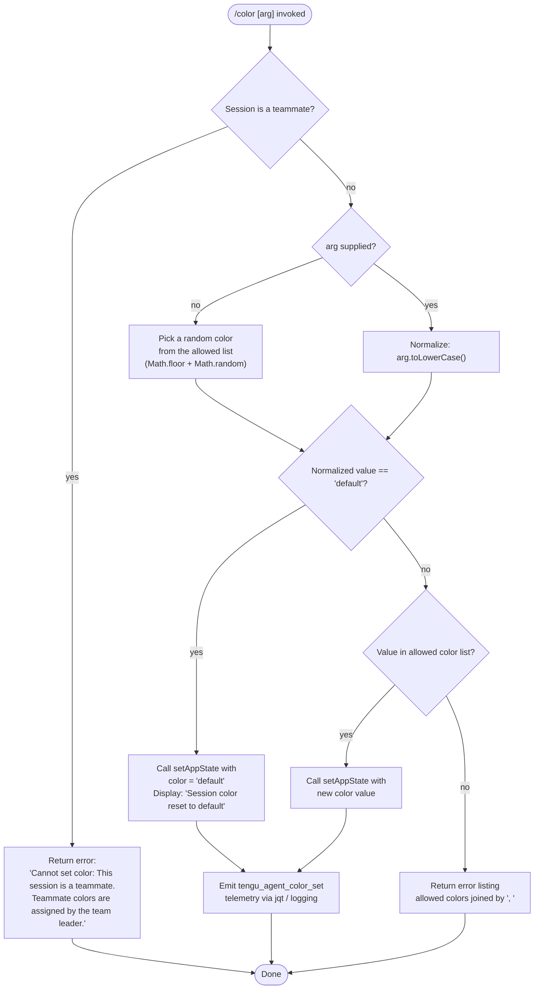

# `/color`

> Analysis basis: CC v2.1.193 bundle.js (AST extraction + Claude interpretation)
> Minimum version: v2.1.193

---

## Overview

The `/color` command sets or resets the prompt bar color for the current Claude Code session. It accepts either a named color token or the keyword `default` (to restore the default color), validates the input against a known color list, then immediately writes the new value into app state and emits a telemetry event. The command is blocked when the session is running as a teammate, because teammate colors are controlled by the team leader.

---

## Registration

| Field | Value |
|---|---|
| type | `local-jsx` |
| name | `color` |
| description | `Set the prompt bar color for this session` |
| argumentHint | `null` |
| immediate | `true` |
| module_id | `dIl` |
| load_inline | `true` |
| loc_byte | `11388611` |
| loc_byte_end | `11388828` |
| loc_line | `7155` |
| arbor_handler.name | `Yff` |
| arbor_handler.fqn | `claude-2.1.193::Yff` |
| arbor_handler.kind | `AsyncFunction` |
| arbor_handler.resolution_path | `module_id` |
| arbor_handler.n_hits | `0` |

Analysis basis: CC v2.1.193 bundle.js:+11388611

---

## Input Branching

The handler has four distinct branches (teammate guard, `default` keyword, valid color name, unknown color), so a flowchart is used.



Analysis basis: CC v2.1.193 bundle.js:+11387449 – +11388040

---

## Behavioral Spec

### Guard: Teammate Sessions

When the current session context indicates the instance is a teammate (subordinate agent), the handler immediately returns an error message without modifying any state.

```
function guardTeammate(sessionContext):
    if sessionContext.role == "system" and isTeammate(sessionContext):
        return errorResult(
            "Cannot set color: This session is a teammate. " +
            "Teammate colors are assigned by the team leader."
        )
```

Error string literal confirmed at: CC v2.1.193 bundle.js:+11387460  
Role sentinel `"system"` confirmed at: CC v2.1.193 bundle.js:+11387406

---

### Argument Normalization and Random Selection

If no argument is provided the handler selects a random color from the allowed color list using `Math.floor(Math.random() * list.length)`. When an argument is present it is normalized to lower-case before comparison.

```
function normalizeOrPickRandom(rawArg, allowedColors):
    if rawArg is absent or empty:
        index = Math.floor(Math.random() * allowedColors.length)
        return allowedColors[index]
    else:
        return rawArg.toLowerCase()
```

Analysis basis: CC v2.1.193 bundle.js:+11387589 (Math.floor), +11387600 (Math.random), +11387626 (toLowerCase)

---

### Color Validation and State Update

After normalization the value is checked against the internal allowed-colors array (`zff`) and also against a secondary list (`LH`). The keyword `"default"` bypasses the list check and resets the color.

```
function applyColor(normalizedValue, allowedColorsList, appStateContext):
    if normalizedValue == "default":
        appStateContext.setAppState({ promptBarColor: "default" })
        displayMessage("Session color reset to default")
        emitTelemetry()
        return

    if allowedColorsList.includes(normalizedValue):
        appStateContext.setAppState({ promptBarColor: normalizedValue })
        emitTelemetry()
        return

    # Unknown color — show error with full list
    return errorResult(
        "Unknown color. Allowed: " + allowedColorsList.join(", ")
    )
```

- `"default"` sentinel: CC v2.1.193 bundle.js:+11387788  
- Reset confirmation string `"Session color reset to default"`: CC v2.1.193 bundle.js:+11388049  
- List membership check (`zff.includes`): CC v2.1.193 bundle.js:+11387644  
- Secondary list check (`LH.includes`): CC v2.1.193 bundle.js:+11387668  
- Join separator `", "`: CC v2.1.193 bundle.js:+11387698

---

### Telemetry Emission via Agent-Color Logging

After a successful color change the handler calls the logging/telemetry sub-system (`jqt`) which ultimately records an `"agent-color"` label and fires the `tengu_agent_color_set` event.

```
function emitColorTelemetry(colorValue, loggingContext):
    logEntry = buildLogEntry(label="agent-color", value=colorValue)
    appendToLogFile(loggingContext, logEntry)       # FAe: appendFileSync path
    registerLogEntry(loggingContext, logEntry)      # Kc / Ei: a7o.register
    recordTelemetry("tengu_agent_color_set")
```

- `"agent-color"` log label literal: CC v2.1.193 bundle.js:+13481262  
- `tengu_agent_color_set` event: CC v2.1.193 bundle.js:+13481346  
- Log file append (`FAe → n.appendFileSync`): CC v2.1.193 bundle.js:+13475401  
- Directory creation (`FAe → n.mkdirSync`): CC v2.1.193 bundle.js:+13475440

---

### App State Integration

The command calls `t.setAppState` to persist the new color and `t.getAppState` to read the current session context before making the teammate guard decision.

```
function readAndWriteAppState(context, newColor):
    currentState = context.getAppState()
    validateTeammateRole(currentState)          # guard above
    context.setAppState({ promptBarColor: newColor })
```

- `t.setAppState` call: CC v2.1.193 bundle.js:+11387830  
- `t.getAppState` call: CC v2.1.193 bundle.js:+11387873

---

### Result JSX Component

The command is registered as `local-jsx`, meaning the success and error results are rendered as React JSX elements. The rendering path proceeds through `Xff`, which calls helper `Zy` for layout and `Ude` / `uPe` for message formatting before resolving a `Promise.resolve` to the JSX node.

```
function renderColorResult(message, isError):
    layout  = buildLayout(Zy)
    content = formatMessage(Ude, uPe, message, isError)
    return Promise.resolve(JSX(layout, content))
```

Analysis basis: CC v2.1.193 bundle.js:+11388040 (Xff entry), +11388133 (Zy), +11388174 (Ude), +11388210 (uPe)

---

### Allowed Color Enumeration Helper

`TXn` is a helper that enumerates the keys of the internal color map using `Object.keys`, producing the list that is both used for random selection and validation.

```
function enumerateAllowedColors(colorMap):
    return Object.keys(colorMap)
```

Analysis basis: CC v2.1.193 bundle.js:+11387153 (TXn → Object.keys), +11387849 (CXn → TXn)

---

## State & Side Effects

| Item | Detail |
|---|---|
| Telemetry — primary | `tengu_agent_color_set` (bundle.js:+13481346) — fired on every successful color change |
| Telemetry — feature flag ok | `tengu_feature_ok` (bundle.js:+1026754) — reachable via `we` / `Re` daemon control path |
| Telemetry — feature flag bad | `tengu_feature_bad` (bundle.js:+1026821) — reachable via `Re` daemon control path |
| Telemetry — daemon config reload | `tengu_daemon_config_reload` (bundle.js:+17498707) — fired inside MCP server restart path (`d`) |
| Telemetry — daemon control | `tengu_daemon_control` (bundle.js:+17520352) — R$ daemon control event |
| Telemetry — bg state read | `tengu_bg_state_read_transient` (bundle.js:+4296462) — background state store read in `Gi` |
| appState changes | `setAppState` called with updated `promptBarColor` value; no change when guard fires (bundle.js:+11387830) |
| Log file I/O | `FAe` appends a JSON-serialised log entry to the agent log file via `fs.appendFileSync`; parent directory created with `fs.mkdirSync` if absent (bundle.js:+13475401, +13475440) |
| Hook registration | `Ei → a7o.register` called to register the log entry with the in-process event bus (bundle.js:+68040) |
| Sound | <!-- TODO: not found in depth-2 traversal; needs --depth 4 --> |
| Immediate flag | `immediate: true` — the command executes without waiting for an explicit submit action |

---

## Version History

| Version | Change |
|---|---|
| v2.1.193 | Initial analysis |

---

## Common Mistakes

1. **Passing a color name with mixed case** — the handler normalizes the argument with `.toLowerCase()` before validation, so `"Blue"` and `"BLUE"` both resolve correctly; however callers should not rely on this for future-proofing.
2. **Attempting to set a teammate session's color** — the command returns an error immediately when the session role is `"system"` / teammate. The error message explicitly states that the team leader controls teammate colors.
3. **Expecting a permanent config change** — `/color` only modifies in-session app state (`setAppState`). The color is not persisted to a config file and will revert when the session ends.
4. **Providing an unsupported color token** — any value not present in the internal allowed-colors list returns an error that lists the valid options. Use `/color default` to restore the original appearance without needing to know the exact token names.
5. **Omitting the argument to get a specific color** — calling `/color` with no argument picks a **random** color from the allowed list via `Math.floor(Math.random() * ...)`, not a predictable default.

---

## Appendix — Identifier Mapping

> For bundle debugging only. Identifiers change across versions.

| Identifier | Role |
|---|---|
| `Yff` | Main async handler for `/color` (arbor_handler, resolution_path: module_id) |
| `CXn` | Core color-command logic function; called by `Yff` |
| `_f` | App-state / async-context accessor helper |
| `zx` | Async-local-storage store resolver; calls `X1r.getStore` |
| `TXn` | Enumerates allowed color keys via `Object.keys` |
| `A0n` | MCP / background server config reload orchestrator |
| `hc` | Config path builder (joins paths, calls `PR`) |
| `PR` | Config path resolver; calls `nr` |
| `Gi` | Background state file reader/watcher |
| `$y` | Cache-entry delete helper (`xte.delete`) |
| `$d` | Config file atomic-write helper |
| `Nm` | Safe file-write implementation (randomBytes temp name, rename, chmod) |
| `Uf` | Config validation / feature-gate checker |
| `be` | String coercion utility |
| `xe` | Error logging / traffic-queue writer |
| `eo` | Error object builder (`new Error`, `String`) |
| `Bi` | Essential-traffic queue handler |
| `e_u` | Queue shift/push manager (`fln`) |
| `IS` | Path basename + label builder |
| `Pft` | <!-- TODO: not found in depth-2 traversal; needs --depth 4 --> |
| `Xff` | JSX result renderer for color command output |
| `Zy` | Layout builder helper used by `Xff` |
| `Ude` | Message format helper used by `Xff` |
| `$de` | Supplementary render helper used by `Xff` |
| `jqt` | Agent-action telemetry + log dispatch entry point |
| `ax` | Log record assembler; builds log payload |
| `sk` | Log field serialiser used by `ax` |
| `FAe` | Log file append + directory creation (`appendFileSync`, `mkdirSync`) |
| `b9` | Log entry builder |
| `at` | String-coercion utility (calls `String`) |
| `fYl` | Log field formatter |
| `s4` | Log entry sub-field helper |
| `jFe` | Async-store context injector for log entries; calls `Yw`, `_f`, `$Yu` |
| `jt` | Log timestamp / metadata helper |
| `ke` | JSON serialiser wrapper (`JSON.stringify`) |
| `Kc` | Log entry registration dispatcher; calls `Ei` |
| `Ei` | Event-bus hook registrar (`a7o.register`) |
| `Lt` | React / JSX element factory |
| `Rx` | JSX base renderer |
| `Gf` | Text/span JSX component builder |
| `q2` | Inline text component helper |
| `mr` | Styled text component helper |
| `Is` | CLI error handler (`lKe`, `OT`, `process.exit`) |
| `l6e` | MCP server connection builder / connector |
| `Bcr` | MCP connection result applier |
| `mSa` | MCP socket/IO initialiser (`sio`) |
| `VWo` | MCP available-commands aggregator |
| `T` | Message/tool-call text formatter |
| `l` | Client list helper (`C8l`) |
| `d` | MCP client lifecycle manager (start/stop/restart) |
| `tKe` | File stat + validation helper |
| `Gql` | Config schema helper (`Object.keys`, `Math.max`, `f_`) |
| `E` | MCP SDK connection manager |
| `A` | MCP server instance controller (stop/updateConfig/start) |
| `DMc` | Heartbeat / reconnect manager (`Bae`) |
| `I` | Input event throttle controller |
| `u` | Daemon lifecycle orchestrator |
| `we` | Daemon start helper; emits `tengu_feature_ok` |
| `Re` | Daemon stop helper; emits `tengu_feature_bad` |
| `R$` | Daemon control event emitter; emits `tengu_daemon_control` |
| `Hj` | Daemon health check / race-condition handler |
| `In` | Error normaliser (`an`) |
| `an` | Raw error-to-string converter |
| `qd` | Error classification helper |
| `Bt` | JSON parse wrapper |
| `n` | Low-level I/O / string operation context (varies by call site) |
| `i` | Stream / connection handle (varies by call site) |
| `r` | Resource / registry handle (varies by call site) |
| `s` | Promise / task registration helper |
| `V` | React rendering root / JSX host |
| `t` | App context / state accessor passed into command handler |
| `e` | Random-delay utility (Math.random + setTimeout) called by `Yff` |