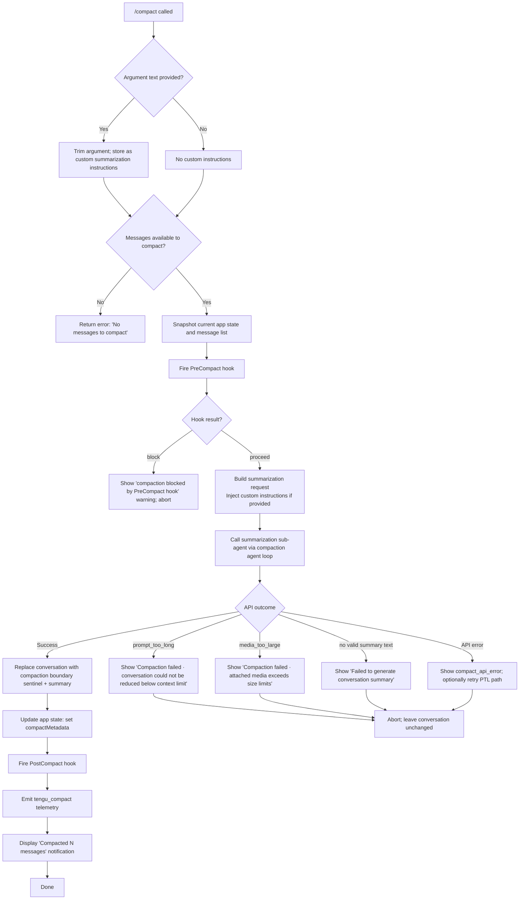

# `/compact`

> Analysis basis: CC v2.1.193 bundle.js (AST extraction + Claude interpretation)
> Minimum version: v2.1.193

---

## Overview

`/compact` frees up context window space by replacing the current conversation history with an AI-generated summary. The command optionally accepts custom summarization instructions as its argument, invokes a summarization sub-agent, runs `PreCompact`/`PostCompact` lifecycle hooks, and then replaces conversation messages with a compaction boundary sentinel and the generated summary text.

---

## Registration

| Field | Value |
|---|---|
| type | `local` |
| name | `compact` |
| description | `Free up context by summarizing the conversation so far` |
| argumentHint | `<optional custom summarization instructions>` |
| supportsNonInteractive | `true` |
| thinClientDispatch | `post-text` |
| module_id | `eCl` |
| load_inline | `true` |
| loc_byte | `11418003` |
| loc_byte_end | `11418303` |
| loc_line | `7243` |
| arbor_handler.name | `ymf` |
| arbor_handler.fqn | `claude-2.1.193::ymf` |
| arbor_handler.kind | `AsyncFunction` |
| arbor_handler.resolution_path | `module_id` |
| arbor_handler.n_hits | `0` |

Analysis basis: CC v2.1.193 bundle.js:+11418003

---

## Input Branching

The command has more than three distinct paths based on argument presence, message count, hook result, API outcome, and error type. A flowchart is used.



---

## Behavioral Spec

### Handler Entry Point (`ymf`)

Analysis basis: CC v2.1.193 bundle.js:+11416971

```
async function compactHandler(context, userInput):
    trimmedInput = userInput.trim()

    messageList = getConversationMessages(context)

    if messageList is empty:
        throw Error("No messages to compact")
        // literal at bundle.js:+11417002

    customInstructions = trimmedInput if trimmedInput != "" else null

    appState = context.getAppState()
    // calls ZIl → e.getAppState at bundle.js:+11416458

    // Dispatch to compaction executor
    result = await runCompactionExecutor(context, appState, messageList, customInstructions)
    // calls Emf at bundle.js:+11417096

    if result.cancelled:
        display("Compaction canceled.")
        // literal at bundle.js:+11417570
        return

    applyCompactionResult(context, result)
    // calls Bre at bundle.js:+11417288, V4e at bundle.js:+11417263

    updateTranscriptDisplay(context)
    // calls QIl at bundle.js:+11417361
```

---

### Message Snapshot and App State Capture (`ZIl`)

Analysis basis: CC v2.1.193 bundle.js:+11416458

```
function snapshotForCompaction(context):
    appState = context.getAppState()
    allMessages = Array.from(messageStore)
    // calls Ur (last-assistant-message finder) at bundle.js:+11416536

    systemPromptParts = context.getSystemPrompt()
    // calls aG at bundle.js:+11416582

    return { appState, allMessages, systemPromptParts }
```

The snapshot captures the full conversation, system prompt pieces, and current app-state fields including `model`, `flag_settings`, and `permission_mode` before compaction begins.

---

### Compaction Executor (`Emf`)

Analysis basis: CC v2.1.193 bundle.js:+11413060

```
async function compactionExecutor(context, snapshot, customInstructions):
    startTime = performance.now()

    // Phase 1: Build context package
    contextPackage = await buildContextPackage(snapshot)
    // calls _I at bundle.js:+11413082, jcf at bundle.js:+11048992

    // Phase 2: Run hook system (PreCompact)
    hookResults = await Promise.all([runHookDispatch(context)])
    // calls PJ at bundle.js:+11413124

    // Phase 3: Determine compaction model
    modelInfo = resolveCompactionModel(context, snapshot)
    // calls ZIl at bundle.js:+11413199, rk at bundle.js:+13693374

    // Phase 4: Request summarization
    emitStatus("compacting")
    // literal at bundle.js:+11413039

    summaryResponse = await requestSummary(contextPackage, customInstructions)
    // calls Smf at bundle.js:+11413514

    // Phase 5: Post-process result
    if summaryResponse.error:
        handleCompactionError(summaryResponse.error)
        // calls zzn at bundle.js:+11413600 for post-compact cleanup path

    applyCompactionToState(context, summaryResponse)
    // calls V4e at bundle.js:+11414423

    emit("compact_end")
    // literal at bundle.js:+11414889
    duration = performance.now() - startTime
    emitTelemetry("tengu_compact", { duration, ... })
    // telemetry at bundle.js:+11003728
```

---

### Summarization Sub-Agent Request (`Smf`)

Analysis basis: CC v2.1.193 bundle.js:+11415270

```
async function requestSummarization(contextPackage, customInstructions):
    startTime = performance.now()

    // Run compaction agent loop with restricted tool policy
    agentResult = await runCompactionAgentLoop(contextPackage, customInstructions)
    // calls Bwo at bundle.js:+11415296 (agent loop with race/timeout)

    if agentResult.status == "miss_custom_instructions":
        // literal at bundle.js:+11415198
        recordMiss("miss_custom_instructions")

    if agentResult.status == "miss_hook":
        // literal at bundle.js:+11415251
        recordMiss("miss_hook")

    if agentResult.status == "miss_not_ready":
        // literal at bundle.js:+11415381
        recordMiss("miss_not_ready")

    if agentResult.status == "aborted":
        // literal at bundle.js:+11415459
        return { cancelled: true }

    if agentResult.status == "boundary_uuid_missing":
        // literal at bundle.js:+11415713
        handleBoundaryMissing()

    summaryText = extractSummaryText(agentResult)
    // calls jwo at bundle.js:+11415633, Wzn at bundle.js:+11415701

    return { summaryText, metadata: agentResult.metadata }
```

The summarization agent is instructed with the literal system prompt: `"You are a helpful AI assistant tasked with summarizing conversations."` (bundle.js:+11014233). Tool use is explicitly denied during compaction with the literal `"Tool use is not allowed during compaction"` (bundle.js:+11011410).

---

### Context Package Builder (`jcf` / `rYn`)

Analysis basis: CC v2.1.193 bundle.js:+11048992

```
function buildContextPackage(messages):
    // Normalize messages: filter by role type
    // Recognized roles: "assistant", "user", "api_system", "attachment"
    // literals at bundle.js:+11049041, +11049063, +11049080, +11049159

    normalizedMessages = []
    for msg in messages:
        normalizedForm = normalizeMessageForCompaction(msg)
        // calls rYn at bundle.js:+11049193
        // rYn handles types: teammate_mailbox, team_context, image, text,
        // notebook, pdf, file, invoked_skills, todo_reminder, task_reminder,
        // mcp_resource, task_status, hook_success, context_efficiency,
        // deferred_tools_delta, agent_listing_delta, mcp_instructions_delta,
        // memory_update, autocheckpointing, compaction_reminder, etc.
        normalizedMessages.push(normalizedForm)

    return normalizedMessages
```

---

### Hook Dispatch (`PJ` / `Sx`)

Analysis basis: CC v2.1.193 bundle.js:+13571957

```
async function runPreCompactHook(context):
    // Loads PreCompact hooks from hook registry
    // literal "PreCompact" at bundle.js:+13571984

    hookDefs = loadHooksForEvent("PreCompact", context)
    // calls Hd at bundle.js:+13587826 (hook loading)
    // calls Sx at bundle.js:+13572065 (hook execution dispatcher)

    for hook in hookDefs:
        result = await executeHook(hook, context)
        // executes via cor (JSON output parser) at bundle.js:+13589384
        // executes via uor (spawn executor) at bundle.js:+13596393
        // executes via uBo (HTTP hook) at bundle.js:+13568379

        if result.decision == "block":
            // literal "block" at bundle.js:+13627235
            return { blocked: true }

    return { blocked: false }

async function runPostCompactHook(context, summary):
    // Fires "PostCompact" hooks after successful compaction
    // literal "PostCompact" at bundle.js:+13605757
    executeHooks("PostCompact", context, summary)
```

---

### Compaction Boundary Insertion (`HH` / `pXn`)

Analysis basis: CC v2.1.193 bundle.js:+11416971 → HH at +11416971

```
function insertCompactionBoundary(messages, summaryText):
    // Inserts a sentinel message with type "system" and subtype "compact_boundary"
    // literals at bundle.js:+13914119, +13914141
    // The sentinel uses indices [1, 0] (literals at bundle.js:+13914195, +13914200)

    boundary = {
        role: "system",
        type: "compact_boundary",
        content: summaryText,
        uuid: generateUUID()
    }

    return [boundary]  // replaces previous message array slice
```

The compaction boundary marks where prior conversation was replaced. The literal string `"Conversation compacted"` appears at bundle.js:+13913697.

---

### Model Resolution for Compaction (`rk`)

Analysis basis: CC v2.1.193 bundle.js:+13693374

```
function resolveCompactionModel(context, snapshot):
    // Checks isBriefEnabled flag via RBo.isBriefEnabled at bundle.js:+13693598
    // Resolves base model via kr (model name normalizer) at bundle.js:+13693528
    // Checks for Fable model policy restriction
    // If policy only allows Fable 5 and it's unavailable for compaction:
    //   emit "compact_no_allowed_fallback"
    //   show: "Compaction unavailable: your model policy only allows Fable 5..."
    //   literal at bundle.js:+11013845

    // Compaction model strings seen in context:
    // "compact" literal at bundle.js:+13703580 (system prompt mode)
    // Falls back to a permitted model for summarization

    // Emits "compact_substituted" if model is swapped
    // literal at bundle.js:+11013995

    return resolvedModel
```

---

### Error Handling in Compaction (`Emf` error paths)

Analysis basis: CC v2.1.193 bundle.js:+11413944

```
function handleCompactionError(error):
    if error.type == "prompt_too_long":
        display("Compaction failed · conversation could not be reduced below the context limit")
        // literal at bundle.js:+11414014
        emitTelemetry("tengu_compact_failed")

    else if error.type == "media_too_large":
        display("Compaction failed · attached media exceeds size limits")
        // literal at bundle.js:+11414136

    else:
        display("unknown error")
        // literal at bundle.js:+11414260

    // Stores compactMetadata with error info
    // literal "compactMetadata" at bundle.js:+11414344
```

---

### Post-Compaction State Apply (`Bre`)

Analysis basis: CC v2.1.193 bundle.js:+10822931

```
function applyPostCompactionCleanup(context):
    // Clears in-flight caches: e_l, HBt, Fso
    // calls Fzn.clear at bundle.js:+10799898
    // calls dEa (HBt.clear + Fso.clear) at bundle.js:+10823042

    // Resets autonomous loop counter
    // calls Qif.resetAutonomousLoopDelivered at bundle.js:+10823074

    // Resets output token tracking
    // calls Ay → Object.values at bundle.js:+10823124

    // Clears precomputed compaction cache entries
    // calls Vzn at bundle.js:+10822941 → CG.get/delete

    // Emits "post_compact_cleanup" event
    // literal at bundle.js:+10822947

    // Resets Vwo state
    // calls Vwo at bundle.js:+10823230
```

---

### Transcript Display Update (`QIl`)

Analysis basis: CC v2.1.193 bundle.js:+11416247

```
function updateTranscriptDisplay(context):
    // Registers keybinding action "app:toggleTranscript"
    // literal at bundle.js:+11416263
    // Keybinding: ctrl+o, scope Global
    // literals at bundle.js:+11416295, +11416286

    // Constructs "Compacted N messages" notification string
    // literal prefix "Compacted " at bundle.js:+11416402

    displayLines = joinLines(compactionSummaryLines)
    // calls St.dim, o.join at bundle.js:+11416395, +11416415
```

---

### Reactive Compact Sub-path (`zwo` / `zzn`)

Analysis basis: CC v2.1.193 bundle.js:+10826627

This is an automatic (non-user-initiated) compaction triggered by the agent loop when context fills up.

```
async function reactiveCompact(context, messages):
    // "compact_reactive" literal at bundle.js:+10829422

    groups = buildMessageGroups(messages)
    // calls sPn at bundle.js:+10826721

    if groups.count < 2:
        log("Reactive compact: fewer than 2 groups, nothing to compact")
        // literal at bundle.js:+5388439
        emitStatus("too_few_groups")
        // literal at bundle.js:+5388529
        return { status: "skip" }

    if noAssistantMessagesInSet(groups):
        log("Reactive compact: no assistant messages in summarize set, bailing")
        // literal at bundle.js:+5389003
        return { status: "skip" }

    // Selects groups to summarize (keeps last N groups based on credit ratio)
    // calls fea (Math.max/floor) at bundle.js:+5388222

    summaryResult = await requestSummarization(selectedGroups)
    // calls czd at bundle.js:+5389463

    if summaryResult.error == "media_too_large":
        log("Reactive compact: summarize hit media-size error, retrying stripped")
        // literal at bundle.js:+5390130
        summaryResult = await requestSummarization(selectedGroups, stripMedia=true)

    if success:
        emitTelemetry("tengu_reactive_compact_succeeded")
        // telemetry at bundle.js:+10829444
        insertCompactionBoundary(messages, summaryResult.text)

    if aborted:
        emitTelemetry("compact_reactive_aborted")
        // literal at bundle.js:+10827484
```

---

## State & Side Effects

| Item | Detail |
|---|---|
| Telemetry: tengu_compact | Fired on successful manual compaction (bundle.js:+11003728) |
| Telemetry: tengu_compact_failed | Fired when compaction cannot complete (bundle.js:+11015570) |
| Telemetry: tengu_compact_ptl_retry | Fired when prompt-too-long retry path is triggered (bundle.js:+11001790) |
| Telemetry: tengu_compact_cache_prefix | Fired to record cache prefix state pre-compaction (bundle.js:+11001314) |
| Telemetry: tengu_compact_cache_sharing_success | Fired when cache sharing succeeds post-compaction (bundle.js:+11012295) |
| Telemetry: tengu_compact_cache_sharing_fallback | Fired when cache sharing falls back (bundle.js:+11012925) |
| Telemetry: tengu_compact_credits_clamp_rescue | Fired when reactive compact credit-clamp rescue is applied (bundle.js:+5389091) |
| Telemetry: tengu_reactive_compact_attempt | Fired on each reactive compact attempt (bundle.js:+5389248) |
| Telemetry: tengu_reactive_compact_succeeded | Fired on reactive compact success (bundle.js:+10829444) |
| Telemetry: tengu_reactive_compact_failed | Fired on reactive compact failure (bundle.js:+10826975) |
| Telemetry: tengu_precomputed_compact_consumed | Fired when a pre-computed compaction is used (bundle.js:+10821504) |
| Telemetry: tengu_precomputed_compact_discarded | Fired when a pre-computed compaction is discarded (bundle.js:+10822143) |
| Telemetry: tengu_post_compact_file_restore_success | Fired when file state is restored after compact (bundle.js:+11016823) |
| Telemetry: tengu_post_compact_file_restore_error | Fired when file restore fails after compact (bundle.js:+11016865) |
| Telemetry: tengu_model_fallback_triggered | Fired when compaction model is substituted (bundle.js:+11015910) |
| Telemetry: tengu_run_hook | Fired for each hook execution during PreCompact/PostCompact (bundle.js:+13626458) |
| Hook registration | PreCompact hook fires before summarization; PostCompact hook fires after boundary insertion |
| appState changes | `compactMetadata` written; autonomous loop counter reset; caches `e_l`, `HBt`, `Fso` cleared; Vwo state reset |
| Conversation mutation | All messages before compaction replaced by a `compact_boundary` system message containing the summary text |
| UI | `app:toggleTranscript` keybinding registered (ctrl+o); "Compacted N messages" notification shown |
| Sound | <!-- TODO: not found in depth-2 traversal; needs --depth 4 --> |

---

## Version History

| Version | Change |
|---|---|
| v2.1.193 | Initial analysis |

---

## Common Mistakes

1. **Expecting all prior context to persist after `/compact`**: The command replaces the entire conversation history with a summary. Tool results, file contents, and thinking blocks from prior turns are lost unless the summary captures them.
2. **Passing multi-line instructions without quoting**: The `argumentHint` is `<optional custom summarization instructions>`. Only a single argument string is accepted; complex instructions should be concise enough to fit on a single input line.
3. **Assuming `/compact` is always available**: If the active model policy permits only Fable 5 and that model is not configured for compaction, the command will error with the "Compaction unavailable" message (bundle.js:+11013845) rather than silently falling back.
4. **Expecting immediate effect in non-interactive mode**: `supportsNonInteractive: true` means the command can run headlessly, but `thinClientDispatch: "post-text"` means the result is delivered as post-turn text in thin client contexts — not as an in-turn state change.
5. **Cancelling too late**: Once the PreCompact hook fires and returns proceed, the summarization API call is in-flight. Cancelling (e.g., Ctrl+C) after that point results in the "Compaction canceled." message and leaves the conversation unchanged, but consumes tokens from the summarization call.

---

## Appendix — Identifier Mapping

> For bundle debugging only. Identifiers change across versions.

| Identifier | Role |
|---|---|
| `ymf` | Main compact command handler (AsyncFunction) |
| `HH` | Compaction boundary insertion utility |
| `pXn` | Message slice helper called from HH |
| `BS` | Base slice / buffer helper |
| `$Y` | Hook telemetry emitter |
| `Tr` | Telemetry record helper |
| `iFt` | Hook firing coordinator |
| `it` | Internal message-store iterator / app-state accessor |
| `KPt` | App-state key resolver |
| `zPt` | App-state value patcher |
| `H5` | Message store wrapper |
| `lCn` | Hook registry lookup |
| `kt` | API call builder |
| `to` | Model name normalizer |
| `PZe` | Settings loader |
| `kr` | Model identifier resolver |
| `dW` | Disk settings loader |
| `__` | Model name string transformer |
| `RTt` | Model routing table |
| `up` | Prompt text sanitizer |
| `Emf` | Compaction executor (main orchestrator) |
| `_I` | Token counting / context size utility |
| `jcf` | Context package builder entry |
| `Wxe` | Context normalization helper |
| `rYn` | Per-message normalization for compaction |
| `PJ` | Hook dispatch runner |
| `Hd` | Hook definition loader |
| `Lt` | Hook type resolver |
| `KO` | Hook type key builder |
| `hC` | Hook config reader |
| `ZD` | Hook decision interpreter |
| `ax` | Hook execution assembler |
| `Pt` | Hook payload builder |
| `Sx` | Hook execution dispatcher |
| `qB` | Policy settings reader |
| `T` | Message type classifier |
| `GAe` | Hook list aggregator |
| `hBo` | Plugin/skill hook loader |
| `VXl` | Hook filter utility |
| `gBo` | Third-party hook filter |
| `zXl` | Hook list transformer |
| `Nn` | Node environment info reader |
| `V` | Success/ok result builder |
| `ke` | JSON serializer wrapper |
| `xe` | Error logging helper |
| `Re` | Result record builder |
| `o$e` | Hook output parser |
| `WM` | Abort controller / timeout manager |
| `ofe` | Hook output formatter |
| `bO` | Hook base object accessor |
| `ior` | Hook input/output router |
| `dBo` | MCP tool hook dispatcher |
| `cor` | Hook JSON output parser |
| `epe` | Hook plugin metrics recorder |
| `uBo` | HTTP hook executor |
| `WXl` | HTTP hook response parser |
| `AAe` | Hook aggregate result builder |
| `uor` | Shell/spawn hook executor |
| `y6e` | Hook async completion waiter |
| `we` | Hook result wrapper |
| `c3` | Telemetry event emitter |
| `ZIl` | App state snapshot for compaction |
| `rk` | System prompt / model resolution orchestrator |
| `MBo` | Model config accessor |
| `CYn` | Context-window limit checker |
| `uwe` | Pewter-owl tool integration |
| `k4f` | Tool output style builder |
| `M4f` | Confirmation behavior builder |
| `D4f` | Hard-reverse action handler |
| `bbn` | Fable model identity checker |
| `vW` | Model feature flags reader |
| `WLi` | Permission mode resolver |
| `NBo` | System prompt override applier |
| `d5f` | System prompt delegation helper |
| `GV` | Global model config reader |
| `z4f` | Tool schema builder |
| `IOt` | Memory loader / system prompt injector |
| `r5f` | Environment info (static) builder |
| `n5f` | Environment info (simple) builder |
| `F4f` | Language system prompt block |
| `B4f` | Output style block |
| `s5f` | Background session system prompt part |
| `s8n` | Scratchpad system prompt part |
| `a5f` | Brief mode system prompt part |
| `u5f` | Flag settings applier |
| `J4f` | System prompt assembly coordinator |
| `U4f` | Custom instruction injector |
| `$4f` | Wee (quick-response) system prompt block |
| `Tcl` | Tool schema cache manager |
| `X4f` | kBo (model-specific behavior) accessor |
| `j4f` | Conversation context tool listing |
| `W4f` | Tool permission context builder |
| `V4f` | NBo (system prompt override) applier |
| `q4f` | Tool availability checker |
| `Y4f` | Query model block |
| `L0i` | Memory write helper |
| `dwe` | First-party / Anthropic AWS detector |
| `dJl` | System prompt section joiner |
| `Ur` | Last-assistant-message finder |
| `F7n` | Working directory extractor |
| `B7n` | Allowed tools extractor |
| `F$` | Permission mode reader |
| `aG` | Agent memory loader |
| `Cc` | Cache-control header builder |
| `hI` | Attachment normalizer |
| `lo` | Module loader bootstrap |
| `Oe` | Error result builder |
| `Ve` | Value wrapper |
| `V7n` | Context-type classifier |
| `YLo` | Response-length tracker |
| `Smf` | Summarization sub-agent runner |
| `Bwo` | Agent loop with race/timeout |
| `HVt` | Compaction gate check |
| `SHt` | Pre-computed compaction consumer |
| `Gzn` | Precompute compact state machine |
| `Ah` | Notification builder |
| `No` | Notification display |
| `jwo` | Summary text extractor (find-index/slice) |
| `Wzn` | Post-summary state writer |
| `zzn` | Post-compact cleanup orchestrator |
| `XBe` | Agent type classifier |
| `JD` | Agent prefix checker |
| `xS` | Context-type extractor |
| `sJi` | Environment name resolver |
| `Q$t` | Object-from-entries helper |
| `W4e` | Tool schema cache invalidator |
| `zY` | File persistence helper |
| `TFt` | File write helper |
| `z4e` | File mkdir+write helper |
| `bHt` | Kc (cache) accessor |
| `Kc` | Cache read/write |
| `_Vt` | UUID generator wrapper |
| `MJ` | Message content-block builder |
| `Dcf` | Array-type content-block checker |
| `Mcf` | Vre (content block validator) |
| `Zif` | Compaction agent loop orchestrator |
| `Xzn` | Tool registry loader for compaction |
| `e7n` | App-state object-values extractor |
| `Jzn` | Plan-file-reference loader |
| `Zzn` | Full-plan content loader |
| `Qzn` | Reactive-compact group builder |
| `iSe` | vP/xY/YDe message normalizer |
| `aPe` | Attachment permission checker |
| `sVe` | Summary validation helper |
| `ei` | UUID + timestamp stamper |
| `V8` | Hook session-start loader |
| `lPe` | Hook+system-prompt context builder |
| `Ywo` | Message group mapper |
| `_Ve` | Ant-message filter |
| `oSe` | Post-compact state observer |
| `$Dn` | Math.round token helper |
| `UDn` | Token usage tracker |
| `PL` | Conversation format normalizer (large) |
| `Ef` | Math.round scaling helper |
| `iKd` | Token counting map builder |
| `xR` | Hook + zone context reader |
| `Zm` | App-state snapshot reader |
| `zwo` | Reactive compact main entry |
| `sPn` | Message group partitioner |
| `kFt` | HH + jat boundary builder |
| `fea` | Math.max/floor credit calculator |
| `czd` | Reactive compact summarization runner |
| `uzd` | Reactive compact retry helper |
| `fat` | KH (kill-signal handler) |
| `M3` | Path/text redactor |
| `ozd` | Path replace helper |
| `JKd` | URL sanitizer |
| `ZKd` | Phone sanitizer |
| `KKd` | IP sanitizer |
| `jKd` | Email sanitizer |
| `BKd` | Home-dir redactor |
| `tzd` | Single-quote path redactor |
| `ezd` | Forward-slash path redactor |
| `rzd` | MCP tool name redactor |
| `KZr` | Cancel reason mapper |
| `vt` | Result value+error wrapper |
| `be` | String coercion helper |
| `Bre` | Post-compaction state cleanup |
| `Vzn` | Precompute-cache invalidator |
| `eFt` | DL (disk-level) cache clear |
| `LTt` | Long-term tracking reset |
| `kTt` | Rx-based reset |
| `Fzn` | e_l cache clear |
| `dEa` | HBt+Fso cache clear |
| `IQa` | Feature-flag state resetter |
| `nDe` | Notification state resetter |
| `Ay` | Output-token-usage resetter |
| `V4e` | AFt.setState (app-state writer) |
| `QIl` | Transcript display updater |
| `IWe` | Y6p (model picker) initiator |
| `Y6p` | Model selection UI helper |
| `bC` | Keybinding registration helper |
| `GLn` | V1t (keybinding store) writer |
| `jLn` | Keybinding conflict resolver |
| `axe` | OTEL metrics emitter |
| `Jc` | OTEL event emitter |
| `x9e` | OTEL attribute builder |
| `MTt` | OTEL metric recorder |
| `Xpr` | OTEL span event emitter |
| `Jpr` | OTEL span end |
| `Sht` | Compaction agent loop runner |
| `bBt` | Tracing span builder |
| `Bce` | Trace context accessor |
| `$P` | Span parent resolver |
| `AF` | yye.active tracer check |
| `Gat` | Compaction gate validator |
| `oPn` | Input text trimmer |
| `Dn` | UUID + message-type stamper |
| `OEl` | Compaction agent loop (core) |
| `pfl` | P8t (permission cache) reader |
| `P8t` | KCo.get permission entry |
| `dfl` | P8t permission setter |
| `at` | String coercion |
| `f0` | Turn runner |
| `n8n` | App-state writer for turns |
| `wD` | Random-bytes ID generator |
| `Ide` | Kc+_Ve cache+filter helper |
| `XN` | Flf+Vzn streaming fallback |
| `pWe` | F5p.has tombstone checker |
| `Wre` | Worktree runner |
| `hde` | BS+filter helper |
| `tcf` | V+Oe+br turn result builder |
| `Hto` | Message content-block flattener |
| `iPn` | Array.isArray + dve tool-use checker |
| `dve` | mE+MA tool-use type resolver |
| `nw` | findLast message finder |
| `rPn` | nPn (last-message finder) wrapper |
| `nPn` | findLast + t helper |
| `ccf` | Ve+Oe compact result formatter |
| `iZ` | Interrupt-zone checker |
| `YVt` | Tool search mode resolver |
| `xY` | Tool name normalizer |
| `zie` | aTt+n.get+xNr context hint |
| `YDe` | lc (tool-search) flag checker |
| `x$t` | SBe+CQr+qjd tool-search config |
| `Pcf` | Tool-search initializer |
| `hto` | icf + flatMap message transformer |
| `icf` | Array.isArray content-block detector |
| `acf` | e.filter content-block selector |
| `lcf` | n.some/filter/map block normalizer |
| `zLo` | Recursive block normalizer |
| `REl` | Surrogate-char escaper |
| `Rat` | kA+fJi+cFt+tZi response formatter |
| `kA` | Fa+to+vW model-feature accessor |
| `fJi` | wwe+EL error-type resolver |
| `cFt` | Ece+QZr cancel-reason builder |
| `tZi` | wNe+LNe timeout classifier |
| `Vge` | oH+kA+y_+gL+X4+g$+wa response builder |
| `oH` | qo+lC outer-response wrapper |
| `y_` | Cv+uve value chain helper |
| `gL` | Cv+c_n value chain helper |
| `X4` | Cv+U1r value chain helper |
| `g$` | bYs+wa+Fa+nM+Xu response aggregator |
| `wa` | Full response text assembler |
| `H` | Buffer stream reader |
| `Tp` | Stream end handler |
| `pHm` | PTY/daemon protocol handler |
| `kht` | ixo+zJl compaction hook-tool handler |
| `ixo` | tYn+nYn fallback-request builder |
| `zJl` | Full agent query loop |
| `ujn` | Jx+to+Object.entries tool-auth checker |
| `Jx` | kt+iXt+ULi API request assembler |
| `dat` | cwe+_ce output-token limit resolver |
| `cwe` | to+smd+Math.min context size calculator |
| `_ce` | parseInt+isNaN+T token-cap parser |
| `Mx` | Rx model-error handler |
| `iYt` | Knr+yzl.freemem memory checker |
| `Ezl` | it (app-state) memory accessor |
| `I9e` | File-lstat+rm+readFile temp-file cleaner |
| `znr` | it (store) iterator |
| `Bm` | ph+Ve notification builder |
| `ph` | Zze notification base |
| `br` | ph+Ve error notification |
| `Ep` | up+TFe+s_n+Wge+Qz response-type router |
| `TFe` | toLowerCase+Object.values model-name normalizer |
| `s_n` | fYs+M1r+gYs cancel classifier |
| `Wge` | kt+Array.isArray tool-gate |
| `Qz` | e.endsWith+to model-suffix checker |
| `q8` | Array.isArray content validator |
| `MEl` | e.slice+jat+Cat+_I message truncator |
| `jat` | t.push+n.push message-part builder |
| `Cat` | V_e+HFt context-token estimator |
| `V_e` | Array.isArray+t.some content-type checker |
| `HFt` | e.match+parseInt token-count extractor |
| `yN` | e.startsWith prefix checker |
| `Gf` | q2+Dh+mr+x0e.join model-file path builder |
| `q2` | Rx model registry reader |
| `mr` | Rx model metadata reader |
| `Zv` | S4+ul+at+it compact-mode state reader |
| `ul` | String coercion helper |
| `MFt` | lzd (text sanitizer) runner |
| `lzd` | t.replace+match+trim text normalizer |
| `BY` | ene+tne extension type resolver |
| `ene` | D4e.has extension checker |
| `PEl` | iZ+be+EI post-compact UI updater |
| `EI` | Tr+Dx+vzd+t.shift+t.push queue manager |
| `vzd` | Mto+_Pn.get/set memoized value accessor |
| `SBt` | Post-compact banner state |
| `z5e` | e.setStatus status updater |
| `XLo` | at (compact boundary appender) |