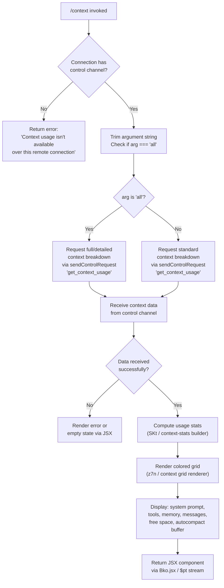

# `/context`

> Analysis basis: CC v2.1.193 bundle.js (AST extraction + Claude interpretation)
> Minimum version: v2.1.193

---

## Overview

The `/context` command visualizes the current conversation's context window usage as a colored grid, breaking down token consumption across system prompt, tools, memory files, messages, and other categories. It accepts an optional `all` argument to request a more detailed breakdown. When running over a thin-client remote connection without a control channel, the command fails gracefully with an informative message rather than displaying partial data.

---

## Registration

| Field | Value |
|---|---|
| type | `local-jsx` |
| name | `context` |
| description | `Visualize current context usage as a colored grid` |
| argumentHint | `[all]` |
| thinClientDispatch | `control-request` |
| module_id | `xLl` |
| load_inline | `true` |
| loc_byte | `11675626` |
| loc_byte_end | `11675852` |
| loc_line | `7374` |
| arbor_handler.name | `Y_f` |
| arbor_handler.fqn | `claude-2.1.193::Y_f` |
| arbor_handler.kind | `AsyncFunction` |
| arbor_handler.resolution_path | `module_id` |
| arbor_handler.n_hits | `0` |

Analysis basis: CC v2.1.193 bundle.js:+11675626

---

## Input Branching

The handler has three distinct top-level branches based on connection type and the `all` argument flag, so a flowchart is used.



Analysis basis: CC v2.1.193 bundle.js:+11674240, +11674246, +11674279, +11674294, +11674322, +11674406

---

## Behavioral Spec

### Handler Entry Point — `contextCommandHandler` (`Y_f`)

The main handler is an `AsyncFunction` resolved by Arbor via the `module_id` path.

```
async function contextCommandHandler(args, options):
    trimmedArg = args.trim()                          // +11674246

    // Branch 1: Remote thin-client without control channel
    controlChannel = getControlChannel(options)        // qu → +11674279
    if not controlChannel:
        return errorMessage(                           // +11674322
            "Context usage isn't available over this remote connection"
        )

    // Branch 2: Argument interpretation
    showAll = (trimmedArg === "all")                   // +11674271

    // Dispatch control request
    response = await controlChannel.sendControlRequest(  // +11674406
        "get_context_usage",                             // +11674436
        { all: showAll }
    )

    // Build stats data structure
    statsData = buildContextStats(response)            // SKt → +11674566

    // Compute compact boundary offset
    compactBoundary = computeCompactBoundary(response) // z_f/HH → +11674739

    // Determine threshold for warning coloring
    warningThreshold = 80                              // +11674772

    // Render and return JSX output
    return renderContextGrid(statsData, compactBoundary, warningThreshold)
                                                       // z7n → +11674789
```

Analysis basis: CC v2.1.193 bundle.js:+11674240

---

### Control Channel Check — `getControlChannel` (`qu` / `n1`)

```
function getControlChannel(options):
    channel = resolveControlChannelFromOptions(options)  // qu → FNe → +11674279
    if channel is null or undefined:
        return null
    return channel                                       // n1 → +11674294
```

The literal `"controlChannel"` (+11674297) identifies the key used to retrieve the channel from the options context.

Analysis basis: CC v2.1.193 bundle.js:+11674279, +11674294, +11674297

---

### Context Stats Builder — `buildContextStats` (`SKt`)

This function processes the raw control-request response into a structured array of usage categories, each with a label, token count, and display color classification.

```
function buildContextStats(response):
    items = []

    // Filter and find relevant entries
    rawItems = response.filter(...)                     // +11672343
    match = rawItems.find(...)                          // +11672661

    // Fixed labeled categories (from literals found in SKt scope):
    categories = [
        { key: "Free space",          label: "Free space" },           // +11672378
        { key: "Autocompact buffer",  label: "Autocompact buffer" },   // +11672401
        { key: "projectSettings",     label: "Project" },              // +11673327/11673347
        { key: "userSettings",        label: "User" },                 // +11673367/11673384
        { key: "localSettings",       label: "Local" },                // +11673401/11673419
        // "Flag", "Policy", "Plugin"/"plugin", "Built-in"/"built-in" // +11673454..11673552
        // "System prompt", "System tools", "MCP tools"               // +11032572/11032653/11032718
        // "Memory files", "Messages", "Skills", "Custom agents"      // +11033036/11033582/11033098/11032969
    ]

    // Format numeric values with locale "en-US", style "compact"      // +224351/224369
    // Append ".0" suffix when fractional rounding occurs              // +222339
    // Threshold boundaries: 20 → "< 20" warning zone                  // +222369/222378
    //                        10 → critical zone                        // +222411

    // Compute percentage rounding
    percentage = Math.round(rawValue / total * 100)    // Mse → +222398

    // Convert to display units via dl/ru/r2c                          // +222325
    return items
```

Analysis basis: CC v2.1.193 bundle.js:+11672302, +11672343, +11672661, +11673579, +11673998, +11674078

---

### Compact Boundary Calculator — `compactBoundaryCalc` (`z_f` / `HH`)

```
function compactBoundaryCalc(response):
    // Locate the compact_boundary marker in response data
    boundaryEntry = findEntry(response, "compact_boundary")  // pXn/BS → +13914141
    if not boundaryEntry:
        return null

    // Slice out the boundary position
    return boundaryEntry.slice(...)                          // HH → +13914294
```

The string `"compact_boundary"` (+13914141) is the key used to locate the autocompact demarcation point within the token distribution.

Analysis basis: CC v2.1.193 bundle.js:+11674202, +11674739, +13914141

---

### Context Grid Renderer — `renderContextGrid` (`z7n`)

This is the primary rendering function that assembles the colored grid display. It uses a large set of sub-functions to build, filter, and format the conversation's token distribution as visual rows.

```
function renderContextGrid(statsData, compactBoundary, threshold):
    // Assemble full system context:
    systemPromptData  = collectSystemPrompt(rk)        // rk → +11031529
    contextTokenData  = computeTokenCounts(ycf)        // ycf → +11032288
    categoryBreakdown = buildCategoryBreakdown(Lcf)    // Lcf → +11032391

    // Compute totals
    totalTokens  = sumAll(statsData)                   // Math.max → +11033393
    freeTokens   = totalTokens - usedTokens            // Math.min → +11033404

    // Apply floor/round for display
    displayRows  = statsData.map(item =>
        formatDisplayRow(item, totalTokens)            // Math.round → +11034001
    )                                                  // Math.floor → +11034163

    // Label rows with categories:
    // "System prompt", "System tools", "MCP tools",
    // "MCP tools (deferred)", "System tools (deferred)",
    // "Custom agents", "Memory files", "Messages",
    // "Skills", "permission", "warning"
    //   (+11032572, +11032653, +11032718, +11032794,
    //    +11032880, +11032969, +11033036, +11033582,
    //    +11033098, +11033000, +11033122)

    // Color classification for subagent-only contexts:
    // "cyan_FOR_SUBAGENTS_ONLY"  → +11032745
    // "purple_FOR_SUBAGENTS_ONLY" → +11033608

    // Render grid as JSX rows (via Bko.jsx → +11674470)
    return <ContextGrid rows={displayRows}
                        boundary={compactBoundary}
                        threshold={threshold} />
```

Analysis basis: CC v2.1.193 bundle.js:+11031423, +11032275, +11032337, +11032343, +11032358, +11032373, +11032391, +11032525, +11032558, +11033155, +11033311, +11034252

---

### System Prompt Collection — `collectSystemPrompt` (`rk`)

This large sub-function aggregates every source that contributes tokens to the system prompt slot:

```
function collectSystemPrompt(context):
    // Sources enumerated by key literals:
    sources = [
        "env_info_static",      // +13694100
        "env_info_simple",      // +13694137
        "language",             // +13694175
        "output_style",         // +13694210
        "bg-session",           // +13694240
        "scratchpad",           // +13694300
        "context_management",   // +13694328
        "brief",                // +13694367
        "reproduce_verify_workflow", // +13694421
        "act_dont_rederive",    // +13694472
        "heron_brook",          // +13694515
        "autonomy_append",      // +13694543
        "task_continuity",      // +13693728
        "fable_identity",       // +13693761
        "tool_param_json",      // +13693809
    ]

    // Fetch each section's token count via IOt, au, RR, qb
    results = await Promise.all(sources.map(fetchSection))
    return aggregateResults(results)
```

Analysis basis: CC v2.1.193 bundle.js:+13693374, +13694058, +13694100

---

### Token Count Computation — `computeTokenBreakdown` (`ycf`)

```
async function computeTokenBreakdown(messages, tools):
    // Extract all context entries
    filtered = messages.filter(isCountable)            // +11025302
    entries  = Object.entries(filtered)                // +11025376

    // For each entry, resolve token count
    counts = await Promise.all(
        entries.map(entry => resolveTokenCount(entry)) // +11025733/11025745
    )

    // Reduce to per-category totals
    totals = counts.reduce(sumByCategory, {})          // +11025875
    return totals
```

Analysis basis: CC v2.1.193 bundle.js:+11025282, +11025302, +11032288

---

### Output Formatting — `formatDisplayRow` (`Mse` / `dl`)

```
function formatDisplayRow(item, total):
    raw     = item.tokenCount
    pct     = Math.round(raw / total * 100)            // +222398
    display = formatCompact(pct)                       // dl/ru/r2c → +222325

    // Locale: "en-US", style: "compact"               // +224351/224369
    // Append ".0" when value has no decimal           // +222339
    // Thresholds: pct < 20 → yellow warning           // +222378
    //             pct < 10 → red critical             // +222411

    return { label: item.label, value: display, pct, color: classifyColor(pct) }
```

Analysis basis: CC v2.1.193 bundle.js:+222325, +222369, +222378, +222398, +222411

---

### Stream Output Wrapper — `streamOutputWrapper` (`$pt`)

The command returns a streamed JSX component. The wrapper attaches to a write stream and formats the rendered component for terminal output:

```
function streamOutputWrapper(renderFn, outputStream):
    outputStream.on("data", handler)                   // +8328241
    content = buffer.toString()                        // +8328278
    component = buildComponentTree(content)            // H8 → +8328305
    return renderToJSX(component)                      // Upt.jsx → +8328308
```

Analysis basis: CC v2.1.193 bundle.js:+11674466, +8328241, +8328305

---

## State & Side Effects

| Item | Detail |
|---|---|
| Telemetry | No `tengu_*` event directly attributed to `Y_f`'s immediate scope in the depth-2 traversal. Reachable sub-functions emit: `tengu_amber_creek` (+3549303), `tengu_pewter_brook` (+3549210), `tengu_marlin_porch` (+3925202), `tengu_native_cursor` (+3925553), `tengu_amber_redwood2` (+5222780), `tengu_amber_redwood3` (+5222811), `tengu_silent_harbor` (+13693858), `tengu_sparrow_ledger` (+13693242), `tengu_scratch` (+13520044), `tengu_tool_pear` (+13708806), `tengu_moth_copse` (+3471898), `tengu_memdir_loaded` (+3467602), `tengu_feature_ok` (+1026754), `tengu_feature_bad` (+1026821) |
| Control channel dispatch | Sends `"get_context_usage"` control request via `sendControlRequest` (+11674406, +11674436) |
| thinClientDispatch | Registered as `"control-request"` — on thin-client connections without a control channel, the command returns an inline error string rather than a rendered grid |
| appState changes | None observed — read-only visualization command |
| Sound | None |
| Filesystem | None directly; sub-functions in `rk` path read settings and memory directories to compute token counts |
| Argument `all` | Literal `"all"` (+11674271) is the only accepted argument; any other non-empty string is treated as absent |
| Warning threshold | Hardcoded at 80% (+11674772) — sections above this threshold are highlighted in the grid |

---

## Version History

| Version | Change |
|---|---|
| v2.1.193 | Initial analysis |

---

## Common Mistakes

1. **Running over a remote SSH/thin-client session without a control channel.** The command requires a live control channel (`"controlChannel"` key in the options context). If absent, it returns `"Context usage isn't available over this remote connection"` (+11674324) rather than any visual output.
2. **Expecting `/context all` to show dramatically different data on small sessions.** The `all` argument triggers a more detailed breakdown from the control request, but when the session has few tool or memory entries, the difference may be minimal.
3. **Interpreting the grid percentages as exact byte counts.** The display uses `Math.round` (+222398) with compact locale formatting (+224351, +224369) and appends `".0"` (+222339) — values are rounded approximations, not raw token integers.
4. **Assuming the "< 20" warning zone** (+222378) indicates a problem — this is a display coloring threshold, not an error condition. The session continues normally below this threshold.
5. **Confusing "Autocompact buffer"** (+11672401) with free space — the autocompact buffer is the reserved headroom that triggers auto-compaction, separate from the general free-space category (+11672378).

---

## Appendix — Identifier Mapping

> For bundle debugging only. Identifiers change across versions.

| Identifier | Role |
|---|---|
| `Y_f` | Main async handler for `/context` command (`contextCommandHandler`) |
| `Ds` | Fullscreen / terminal environment checker |
| `cB` | Terminal feature detection helper |
| `cM` | Feature-flag check (`tHi.isEnabled` wrapper) |
| `NWr` | Terminal type resolver (calls `at` → `String`) |
| `Zee` | iTerm / tmux detection orchestrator |
| `iId` | Terminal identifier (checks `sId`, `uJe`, spawns tmux query) |
| `sId` | String prefix checker for terminal name |
| `uJe` | Terminal environment variable inspector (`x_u`, `e.includes`, `QTr`) |
| `T` | Debug/log output formatter |
| `qFc` | Log output router (`YO`, `Qgr`, `c7o`) |
| `c7o` | Log channel dispatcher (`JNc`, `QNc`) |
| `ke` | JSON serializer wrapper (`JSON.stringify`) |
| `Lc` | Model/path label formatter (`KXo`, `e.replace`, `r.at`) |
| `KXo` | Model name mapper (`jFc.map`) |
| `iYe` | Write-stream helper (`OXo`) |
| `OXo` | Raw stream writer (`e.write`) |
| `XFc` | Log-file writer / file append orchestrator |
| `P7e` | Buffered write scheduler (`clearTimeout`, `setTimeout`, `setImmediate`) |
| `Ame` | Log line assembler (`uYe`, `Sme.join`, `nr`, `Lt`) |
| `Cse` | Directory resolver (`an`) |
| `XXo` | Path joiner (`Sme.join`, `Lt`) |
| `nhr` | File rotate/rename helper (`MU.stat`, `MU.rename`, `MU.unlink`) |
| `YFc` | File append executor (`MU.mkdir`, `MU.appendFile`) |
| `Ei` | Event-hook registrar (`a7o.register`) |
| `OWr` | OS platform checker (detects `"windows"`) |
| `kr` | Settings loader orchestrator |
| `dW` | Disk-settings load coordinator (`xx`, `ia`, `Avr`, `yB`, `Pen`) |
| `ia` | Settings load dedup guard (`aJo.has/add`, `Hhr.push`, `process.memoryUsage`) |
| `Avr` | Settings load executor (emits `settings_load_started`, `settings_load_completed`) |
| `yB` | Settings merge/aggregate helper |
| `aId` | Settings-load result dispatcher |
| `it` | Tool/context state manager (`KPt`, `zPt`, `H5`, `lCn`, `VPt`, `ZW`, `kt`) |
| `kt` | Tool-execution invoker (`jt`, `Gx`, `a9o`, `bSt`, `Date.now`, `xjf`) |
| `lCn` | Context dedup guard (`MGr.has/add`, `vwe.get`, `RGr`, `UGr`) |
| `qu` | Control-channel resolver (wraps `FNe`) |
| `n1` | Secondary control-channel path (calls `qu`) |
| `SKt` | Context-stats builder (processes control-request response into categories) |
| `dl` | Token-count formatter (calls `ru` → `r2c`) |
| `ru` | Locale number formatter wrapper |
| `r2c` | Compact number format core |
| `Mse` | Percentage calculator (`dl`, `Math.round`) |
| `OJe` | Category entry extractor |
| `be` | String coercion helper (`String`) |
| `z_f` | Compact-boundary calculator entry point (`HH`) |
| `HH` | Compact-boundary locator (`pXn`, `e.slice`) |
| `pXn` | Boundary search helper (`BS`) |
| `BS` | Base search utility |
| `z7n` | Context grid renderer (main visualization assembler) |
| `gR` | Model/context aggregator (`Y4`, `$b`, `IW`, `y_`, `g$`, `wa`, `PFe`, `Gge`, `R1`, `T`, `qo`, `gL`) |
| `Y4` | Provider context builder (`OH`, `K2`, `Go`, `wa`) |
| `wa` | Message content walker/normalizer |
| `$b` | Context source builder (`qge`, `zge`, `_r`, `So`, `Ci`) |
| `Ci` | Provider-type classifier (`HPr`, `hPr`, `Dy`, `Vs`) |
| `IW` | String replacement utility (`e.replace`) |
| `y_` | Context view builder (`Cv`, `uve`) |
| `g$` | Context entry builder (`bYs`, `wa`, `Fa`, `nM`, `Xu`, `Bie`, `a_n`) |
| `bYs` | Enforcement-model checker (emits policy warnings) |
| `PFe` | Content filter helper (`Fa`, `nM`, `qo`, `to`) |
| `qo` | Token type resolver (`rH`, `Fa`, `nM`, `OFe`, `Cv`, `Wz`, `gL`, `X4`, `IW`, `y_`, `AYs`, `Xu`, `Bie`, `NFe`, `bYu`, `h$`) |
| `to` | Content-type discriminator (`PZe`, `__`, `RTt`, `up`) |
| `Gge` | Tag/attribute extractor (`_r`, `yYu`, `P1r`) |
| `gL` | Cache-control resolver (`Cv`, `c_n`) |
| `DC` | Token count dispatcher (`at`, `bc`) |
| `bc` | Legacy/current config branch (`oC`, `tQe`, `_n`, `kt`) |
| `oC` | Config-set manager (`_Tt`, `t.add`, `jT.filter`) |
| `tQe` | Config resolution helper (`dg`, `Hie.resolve`) |
| `_n` | Background-settings helper (`sun`, `yB`) |
| `k3` | Auto-compact window calculator (`to`, `mE`, `MA`, `_ce`, `mVd`, `FZr`, `b4r`, `pVd`) |
| `mE` | Utility math wrapper (`Rx`) |
| `MA` | Token-limit resolver (`uhi`, `b4r`, `dhi`) |
| `uhi` | `parseInt`/`isNaN` integer parser |
| `b4r` | Token-limit branch (`T7e`, `uhi`, `dhi`) |
| `dhi` | Token display formatter (`rH`, `wW`, `h$`, `Sbn`, `to`, `qo`) |
| `_ce` | Context-window-size validator (`parseInt`, `isNaN`, `T`) |
| `mVd` | Context validation orchestrator (`DC`, `Number.isInteger`, `Array.isArray`, `Object.hasOwn`, `QXi`, `phi`, `fhi`) |
| `QXi` | Schema validator (`Array.isArray`, `Ci`, `Object.hasOwn`, `YXi`) |
| `FZr` | Compact-window finalizer (`DC`, `Tr`, `iFt`, `$Zr`) |
| `$Zr` | Numeric string parser (`parseFloat`, `parseInt`, `Number.isFinite`, `Math.round`) |
| `rk` | System-prompt section aggregator (large orchestrator for all prompt sections) |
| `Pt` | Logger/tracer (`Eln`, `mr`) |
| `Eln` | Async-local-store getter (`yln.getStore`, `kK`) |
| `mr` | Log emitter (`Rx`) |
| `CYn` | Conversation value collector (`v_t`, `Pt`, `Object.values`, `T`, `Go`) |
| `uwe` | Tool-use formatter (`T4r`) |
| `T4r` | Tool entry builder (`Tr`, `cmd`, `to`, `As`, `it`, `Jx`) |
| `k4f` | Brief-mode handler (`to`, `wee`, `x4f`, `R4f`, `Kg`) |
| `R4f` | Brief-mode section builder (`wee`, `RBo.isBriefEnabled`, `uwe`) |
| `M4f` | Memory-dir section builder (`Kg`, `kBo`) |
| `D4f` | Deferred tool builder (`hhi`, `kBo`) |
| `bbn` | String-prefix checker (`e.startsWith`) |
| `vW` | Model-name display resolver (`Fa`) |
| `WLi` | Tool parameter validator (`QPt`) |
| `QPt` | Schema freeze/validate (`Array.isArray`, `Object.freeze`, `Number.isInteger`) |
| `NBo` | System-message builder (`to`, `at`, `ul`, `Kg`, `it`) |
| `ul` | String coercion (`String`) |
| `d5f` | System-message dispatcher (`NBo`) |
| `GV` | Settings loader caller (`kr`) |
| `z4f` | Orchestration manager (tool scheduling, `OK`, `$C`, `Tr`, `K4f`, `H0o`, `OY`, `jV`, `oq`) |
| `$C` | Context-request builder (`at`, `ffr`) |
| `K4f` | Tool-queue builder (`OY`) |
| `OY` | Tool-assignment helper (`AYi`) |
| `jV` | Job-queue manager (`Gmt`, `AWe`) |
| `oq` | Array-flatMap helper (`e.flatMap`, `Array.isArray`, `t.map`) |
| `IOt` | Memory/file content loader (reads memory dirs, wraps `au`, `Vwe`, `Jae`, `Ve`, `we`, `f0i`, `T0i`, `b0i`, `zjr`) |
| `au` | File-read utility (`Gk`, `El`, `at`, `ul`, `mCn`, `kr`) |
| `Vwe` | Directory creator (`jt`, `t.mkdir`, `an`, `T`, `String`) |
| `Jae` | File-type checker (`jt`, `i.isFile`, `i.isDirectory`, `V`) |
| `Ve` | File validator (`Zze`) |
| `we` | File-existence checker (`V`, `Oe`) |
| `f0i` | Batch file loader (`zae`, `T`, `be`, `t.filter`, `Promise.allSettled`, `Abd`) |
| `Mbd` | Memory boundary detector (`zae`) |
| `TOt` | Memory-path tokenizer (`e.trim`, `t.split`, `n.slice`, `a.lastIndexOf`, `ka`) |
| `RR` | Memory read router (`au`, `it`) |
| `qb` | Memory path joiner (`dM.join`, `em`) |
| `_0i` | Memory line builder (`$jr.join`, `l.push`, `l.join`) |
| `T0i` | Memory render table builder (large; maps tool results, attachments) |
| `b0i` | Memory item formatter (`em`, `qb`, `_Ot`) |
| `zjr` | Memory item serializer (`_Ot`) |
| `r5f` | Tool-definition section builder (`yh`, `DBo`, `oq`) |
| `yh` | Tool-type discriminator (`_r`, `e.toLowerCase`, `to`) |
| `DBo` | Tool display-name builder (`to`) |
| `n5f` | Environment info builder (`Promise.all`, `W_`, `OBo`, `yh`, `Pt`, `Cm`, `PBo`, `FCn`, `oq`) |
| `OBo` | OS info collector (`EKe.version`, `EKe.release`, `EKe.type`) |
| `PBo` | Shell-type detector (`e.includes`, `Eu`, `gN`) |
| `s5f` | Worktree detector (`hyo`, `uJl.join`) |
| `hyo` | Worktree checker (`euo`, `kr`) |
| `s8n` | Scratchpad section builder (`TQ`, `BAe`) |
| `TQ` | Scratchpad reader (`it`, `gce`, `lo`, `e`) |
| `BAe` | Scratchpad formatter (`M9f`, `Lt`) |
| `a5f` | Brief-mode flag checker (`RBo.isBriefEnabled`) |
| `u5f` | Task-focus section builder (`Tr`, `_n`, `_rt`, `Kg`) |
| `_rt` | Routing helper (`kr`, `kt`) |
| `J4f` | Tool invocation recorder (`at`, `it`, `T`) |
| `U4f` | Input validator (`Jx`, `e.trim`, `V`, `it`, `t.trim`) |
| `Jx` | Tool parameter checker (`kt`, `iXt`, `Object.hasOwn`, `ULi`) |
| `$4f` | Post-tool state updater (`it`, `wee`) |
| `Tcl` | Tool-call deduplicator (`wTt`, `Promise.all`, `e.map`, `t.has/get`, `n.compute`, `imr`) |
| `X4f` | Tool execution wrapper (`kBo`) |
| `j4f` | Tool-result formatter (`N4f`, `oq`) |
| `W4f` | Tool-response collector (`it`, `oq`) |
| `V4f` | Tool-response handler (`NBo`) |
| `q4f` | Tool-error handler (`e.has`, `Zv`, `oq`, `$C`) |
| `Zv` | Error-context builder (`S4`, `ul`, `at`, `it`) |
| `Y4f` | Tool-output aggregator (`oq`) |
| `L0i` | Memory-load orchestrator (`w0i`, `zjr`) |
| `w0i` | Memory-load fetcher (`au`, `RR`, `Kg`) |
| `dwe` | Model-display resolver (`YD`, `_u`, `_r`) |
| `YD` | Display-model mapper (`L4r`, `SBe`) |
| `_u` | Provider URL helper (`vhn`) |
| `dJl` | Context-limit adjuster (`yYn`, `MA`, `mE`, `EYn`) |
| `EYn` | Max-context helper (`Math.max`) |
| `aG` | Agent-context builder (`Cc`, `hI`, `xP`, `lo`, `a`, `th`, `e.getSystemPrompt`, `V`, `Oe`, `Ve`, `Array.isArray`) |
| `hI` | Agent-header builder (`at`, `Yw`, `sa`) |
| `lo` | Module loader shim (`hNe`, `Edr`, `qZt.call`, `KZt.bind`, `gDc`, `UVo.set`) |
| `mat` | Token-count estimator (`ene`) |
| `ene` | Token accumulator (`D4e.has`) |
| `ycf` | Token breakdown per-category (`zA`, `e.filter`, `_cf`, `Object.entries`, `X7n`, `WHt`, `Object.values`, `Promise.all`) |
| `_cf` | Text tokenizer (`e.match`, `e.split`, `r.trim`, `n.slice`) |
| `X7n` | Per-server breakdown builder (`Promise.all`, `o5f`, `x0i`, `LBo`, `s8n`) |
| `o5f` | Server-info fetcher (`Promise.all`, `W_`, `OBo`, `Pt`, `Cm`, `PBo`, `FCn`, `oq`) |
| `x0i` | Server-content loader (`w0i`, `IOt`, `em`, `Vwe`, `Jae`, `Ve`, `n.trim`, `r.push/join`) |
| `LBo` | Server-name parser (`e.indexOf`, `e.slice`, `n.startsWith`, `n.slice`) |
| `WHt` | Category weight builder (`l5e`, `T`, `be`, `xe`, `FEl`) |
| `l5e` | Token-count worker (`uxo`, `axo`, `As`, `qW`, `qEl`, `BH`, `Wcf`, `up`, `jW`, `ef`, `Mv`, `T`, `String`) |
| `xe` | Error logger (`eo`, `at`, `Bi`, `e_u`, `rJe.push`, `kZ.logError`) |
| `FEl` | Section weight finalizer (`uxo`, `axo`, `qEl`, `at`, `Ise`, `cC`, `gL`, `jW`, `ef`, `Gcf`, `qW`, `Mv`, `S0e`, `_We`) |
| `Ecf` | Built-in-prompt analyzer (`qae`, `tFt`, `HI`, `Promise.all`, `WHt`) |
| `qae` | CLAUDE.md presence checker (`Boolean`, `cc`, `kx`) |
| `cc` | Config presence resolver (`El`, `cd`) |
| `tFt` | Prompt-filter helper (`it`, `e.filter`) |
| `Scf` | MCP-tools analyzer (`e.filter`, `Promise.resolve`, `KY`, `PY`, `mPe`, `y.has/h.add`, `Promise.all`, `Math.max`) |
| `mPe` | Per-tool token estimator (`Promise.all`, `e.map`, `J7n`, `WHt`, `T`, `i.slice`) |
| `J7n` | Tool-definition token counter (`_r`, `f5f`, `Kg`, `y5f`, `vhi`, `it`, `gPe`, `Ja`, `h5f`, `H5f`, `ABe`, `ul`, `_u`, `at`, `SBe`) |
| `Tcf` | Message-section analyzer (`e.filter`, `mPe`, `Math.max`, `Promise.all`, `s.map`, `Ef`, `ke`, `c.reduce`, `Math.round`, `KY`, `PY`) |
| `Ef` | Rounding utility (`Math.round`) |
| `Icf` | System-tools section builder (`Promise.all`, `t.map`, `WHt`, `t.entries`, `n.push`) |
| `Acf` | Per-agent section builder (`dQr`, `Pt`, `$El`, `mPe`) |
| `dQr` | Context-slot checker (`xC`, `uce`, `OK`) |
| `uce` | Tool-use filter (`e.filter`, `t.some`, `J7l`) |
| `$El` | Slot-label builder (`gl`) |
| `gl` | Context-map cache (`Object.hasOwn`, `Wxi.get/set`, `Vxi.has/add`, `MAd`, `s.get`, `e.find`, `lc`) |
| `Lcf` | Category-breakdown assembler (`r.set`, `Ccf`, `vcf`, `wcf`, `WHt`, `PL`) |
| `Ccf` | Category-count collector (`ke`, `Ef`) |
| `vcf` | Variable-category resolver (`Ef`, `ke`, `n.get`) |
| `wcf` | Weight calculator (`ke`, `Ef`) |
| `PL` | Conversation-history processor (large; maps messages, tool uses, attachments into token rows) |
| `rYn` | Full message renderer (handles all system-prompt block types) |
| `$pt` | Stream-output attacher (`o.on`, `i.toString`, `H8`, `Upt.jsx`) |
| `H8` | JSX root builder (`bqr`, `Pqr`, `_te`) |
| `Pqr` | React element creator (`k$i.createElement`) |
| `_te` | Terminal display wrapper (`cM`, `bLe`, `Tqr`) |
| `bLe` | Standard display component (`Zee`, `w8r`, `Ds`, `cM`, `at`, `it`) |
| `Tqr` | Thin-client display component (`cM`, `at`, `it`) |
| `Bko` | JSX output wrapper |
| `iJi` | Context-slot iterator (`sJi`, `e.slice`, `_I`, `PL`) |
| `sJi` | Slot-start locator (`ene`, `XZr`) |
| `_I` | Slot-content extractor (`jcf`) |
| `jcf` | Block-content formatter (`Wxe`, `rYn`) |
| `pq` | Spinner/progress display (`Lt`, `Kc`) |
| `Lt` | Log-level filter (`Rx`) |
| `Kc` | Progress renderer (`Ei`) |
| `Ue` | Message-list manager (`Ce.findLastIndex/splice`, `V`, `Oe`, `MYt`) |
| `Ce` | Message event tracker (`far`, `Mcc`, `xcc`, `mar`, `V`) |
| `MYt` | Message-removal tracker (`Kc`) |
| `qe` | Entry-map cache (`pn.split`) |
| `fe` | Boolean flag helper (`pq`, `Lt`, `Boolean`, `Z.has`) |
| `HTo` | Toast/notification helper (`ke`) |
| `Ct` | Notification-push helper (`HTo`) |

---

Note: index built via Arbor fallback; some signals (telemetry, literals) may be missing — see arbor-fallback.js.