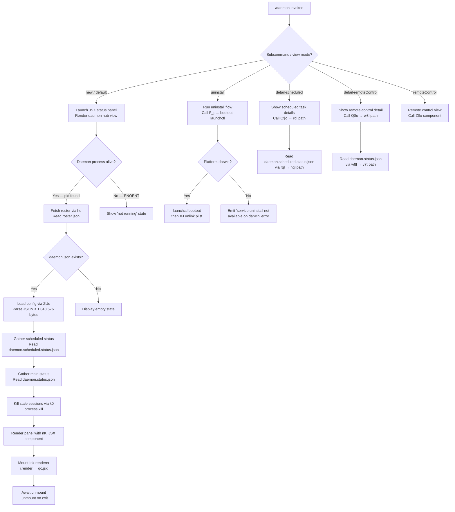

# `/daemon`

> Analysis basis: CC v2.1.193 bundle.js (AST extraction + Claude interpretation)
> Minimum version: v2.1.193

---

## Overview

`/daemon` manages the Claude Code background service process — enumerating running sessions, starting or stopping the daemon, handling scheduled tasks, and providing a live status view rendered as an inline JSX panel. It is classified as a `local-jsx` command, meaning it renders a rich React component directly in the terminal interface rather than producing plain text output.

---

## Registration

| Field | Value |
|---|---|
| type | `local-jsx` |
| name | `daemon` |
| description | `Manage background services and routines` |
| loc_byte | `13194812` |
| loc_byte_end | `13194980` |
| loc_line | `8967` |
| immediate | `true` |
| module_id | `eFo` |
| load_inline | `true` |
| arbor_handler.name | `W$f` |
| arbor_handler.fqn | `claude-2.1.193::W$f` |
| arbor_handler.kind | `AsyncFunction` |
| arbor_handler.resolution_path | `module_id` |
| arbor_handler.n_hits | `0` |

Analysis basis: CC v2.1.193 bundle.js:+13194812

---

## Input Branching

The command has more than three distinct execution paths based on subcommand or state transitions, so a Mermaid flowchart is used.



---

## Behavioral Spec

### Top-Level Handler (`W$f`)

The Arbor-resolved async handler `W$f` is the command's entry point.

```
async function daemonCommandHandler(context):
    statusData = await gatherDaemonStatus(context)    // Q$o
    panelElement = buildJSX(statusData)               // qc.jsx + nKl
    render panelElement to terminal
```

Analysis basis: CC v2.1.193 bundle.js:+13184661

---

### Status Gathering (`Q$o`)

`Q$o` is the primary orchestration function. It fans out in parallel and then merges results.

```
async function gatherDaemonStatus(context):
    [daemonConfig, scheduledStatus] = await Promise.all([
        loadDaemonConfigFile(),   // Xql
        loadScheduledStatus(),    // jql
    ])

    mainStatus      = await loadMainStatus()          // w8l
    scheduledDetail = await loadScheduledDetail()     // rql
    rosterData      = await readRoster()              // hq
    launchctlInfo   = await queryLaunchctl()          // JJ

    killedPids = await killStaleSessions()            // k0

    resolvedKeys = Object.keys(...)
    return Promise.resolve(mergedState)
```

Analysis basis: CC v2.1.193 bundle.js:+13184220

---

### Config File Loading (`Xql` → `PEt` → `ZUo`)

Reads and parses `daemon.json` from the daemon directory.

```
async function loadDaemonConfig():
    results = await Promise.all([
        readDaemonJsonFile(),     // PEt → ZUo
        readErrorLog(),           // xe
        killStaleEntries(),       // k0
    ])
    return results

async function readDaemonJsonFile():
    // ZUo: stat the file first
    stat = await fs.stat(daemonJsonPath)
    if stat.size > 1_048_576:            // literal: bundle.js:+12998151
        throw Error("file too large")
    rawText = await fs.readFile(path, "utf8")   // literal: bundle.js:+12998270
    trimmed = rawText.trim()
    parsed  = JSON.parse(trimmed)
    if Array.isArray(parsed):
        return validateArray(parsed)     // R4
    return parsed
```

Analysis basis: CC v2.1.193 bundle.js:+12998093

Maximum config file size: 1 048 576 bytes (bundle.js:+12998151)

---

### Stale-Session Termination (`k0`)

Kills previously-running daemon PIDs found in lock files, then cleans up.

```
async function killStaleSessions():
    stat = await fs.lstat(lockFilePath)   // eOe
    if stat.isFile():
        content = await fs.readFile(lockFilePath)
        pid     = parseIntFromContent(content)   // In → va
        process.kill(pid, 0)              // existence check
        process.kill(pid)                 // actual SIGTERM
        readLog = await readDaemonLog()   // rMo
    await formatDisplay(...)             // Dv → H$
```

Analysis basis: CC v2.1.193 bundle.js:+11714098

---

### Scheduled-Status Loading (`jql` → `tKe`)

Reads `daemon.scheduled.status.json` and enriches it with session-store data.

```
async function loadScheduledStatus():
    sessionDir = buildSessionPath()     // UG → oMo.join + nr
    staleKills  = await killStale()     // k0

    scheduleFiles = await tKe(sessionDir)
    // tKe: stat path; reject with ENOENT if missing
    //      read file contents; parse as JSON
    //      query AsyncLocalStorage store (qs → Kqu.getStore)
    //      merge keys from Object.keys(...)
    return scheduleFiles.map(f => path.basename(f))  // DAe.basename
```

Literal: `"daemon.scheduled.status.json"` (bundle.js:+13090329), `"same-dir"` classification (bundle.js:+13172840)

Analysis basis: CC v2.1.193 bundle.js:+13172673

---

### Main-Status Loading (`w8l`)

Reads `daemon.status.json` from the daemon's runtime directory.

```
async function loadMainStatus():
    store     = getAsyncStore()          // qs
    statusPath = buildStatusPath()       // v7t → I8l.join + nr
    // v7t constructs: <daemonDir>/daemon.status.json
    rawContent = await fs.readFile(statusPath)
    parsed     = parseStatus(rawContent)  // va
    process.kill(pid, 0)                 // liveness probe
    await formatDaemon(...)              // Dv
```

Literal: `"daemon.status.json"` (bundle.js:+12997330)

Analysis basis: CC v2.1.193 bundle.js:+12997617

---

### Scheduled Detail Status (`rql`)

Reads `daemon.scheduled.status.json` and applies the same kill/display flow as the main status.

```
async function loadScheduledDetail():
    detailPath = buildScheduledPath()    // nql → eql.join + nr
    rawContent = await fs.readFile(detailPath, ...)   // ZVl.readFile
    parsed     = parseScheduledStatus(rawContent)     // va
    process.kill(pid, 0)
    await formatDaemon(...)             // Dv
```

Literal: `"daemon.scheduled.status.json"` (bundle.js:+13090329)

Analysis basis: CC v2.1.193 bundle.js:+13090537

---

### Roster Reading (`hq`)

Reads the background-session roster file and validates its integrity.

```
async function readRoster():
    stat = await fs.lstat(rosterPath)     // Ape.lstat
    rosterDir = buildRosterDir()          // ooe → Dg.join + Hpe

    if stat.isFile():
        // Validate type; remove if not regular file
        // Literal: "is not a regular file — removing" (bundle.js:+11725634)
        text = await fs.readFile(rosterPath)   // Ape.readFile
        decoded = decodeContent(text)          // In
        parsed  = parseRoster(decoded)         // qd
        merge(WK, NIl, Pxl, fnn)
        // Check rEf set membership; coerce to String
    else:
        await fs.rm(rosterPath)

    if error.code in ["E2BIG", "EFTYPE"]:    // literals: bundle.js:+11725760, +11725772
        await rotateRosterFile()             // KJn → Ape.rename + Date.now
```

Literal: `"roster.json"` (bundle.js:+11721343)

Analysis basis: CC v2.1.193 bundle.js:+11725487

Telemetry fired on parse failure: `tengu_bg_roster_parse_failed` (bundle.js:+11725680)

---

### launchctl Query (`JJ` → `Pn` + `FJn`)

On macOS, queries `launchctl print` to determine whether the daemon service is registered.

```
async function queryLaunchctl():
    serviceInfo = await spawnLaunchctl(["print", serviceDomain])  // Pn → Vr
    // Pn calls Vr which executes the process with timeout 5000 ms
    // Literal: "launchctl" (bundle.js:+11718180), "print" (bundle.js:+11718193)
    // Timeout: 5000 ms (bundle.js:+11718227)
    uid = getProcessUid()                                          // FJn → bxl → process.getuid
    return parseServiceStatus(serviceInfo)
```

Analysis basis: CC v2.1.193 bundle.js:+11718177

---

### Service Uninstall (`F_t`)

Unregisters the daemon from launchctl and removes the plist.

```
async function uninstallDaemonService():
    daemonDir   = buildDaemonDir()          // aMo → IKt.join + sMo.homedir
    uid         = getProcessUid()           // FJn → bxl
    // Spawn: launchctl bootout gui/<uid>/<service-label>
    // Literal: "bootout" (bundle.js:+11716678)
    await spawn("launchctl", ["bootout", ...])   // Pn
    await fs.unlink(plistPath)              // XJ.unlink
    decode result                           // In
    await reportResult()                    // be
    // If platform != darwin:
    //   emit "service uninstall not available on darwin"
    //   literal: bundle.js:+11716809
```

Analysis basis: CC v2.1.193 bundle.js:+11716650

---

### Service Start/Stop/Restart (`vKt` → `lMo`)

Controls the daemon lifecycle via `launchctl kickstart`, `stop`, and restart sequences.

```
async function controlDaemonLifecycle(action):
    uid = getProcessUid()              // FJn
    match action:
        case "start":
            spawn("launchctl", ["kickstart", ...])    // Pn
            // Literal: "kickstart" (bundle.js:+11717040)
        case "stop":
            spawn("launchctl", ["stop", ...])
            // Literal: "stop" (bundle.js:+11717065)
        case "restart":
            spawn("launchctl", ["stop", ...])
            wait up to 50 polls × 200 ms             // literals: bundle.js:+11717333, +11463014
            // If not stopped within 10 s, abort
            // Literal: "daemon did not exit within 10s of SIGTERM..." (bundle.js:+11717362)
            spawn("launchctl", ["kickstart", ...])
            // Literal: "restart" (bundle.js:+11717105)
    timeout = Axl.setTimeout(50, ...)
```

Analysis basis: CC v2.1.193 bundle.js:+11716923

---

### JSX Panel Rendering (`nKl` / `Z$o`)

The UI component fetches React hooks and renders tabbed views.

```
function DaemonPanel(props):
    [state, setState] = useState(...)      // Rq.useState
    clockContext      = useClockContext()  // ws → l$i.useContext
    startTimestamp    = Date.now()
    performanceNow    = performance.now()

    // Panels / tabs visible:
    // "new", "uninstall", "detail-scheduled", "detail-remoteControl",
    // "remoteControl"
    // literals: bundle.js:+13185493, +13185224, +13185413, +13185553, +13185662

    rosterRef = useRef(...)               // Rq.useRef
    liveStore = useSyncExternalStore(...) // lu → h8.useSyncExternalStore

    // Sub-panels:
    //  "Scheduled"     — literal: bundle.js:+13185943
    //  "Remote Control"— literal: bundle.js:+13186229
    //  "Claude daemon" — literal: bundle.js:+13186503

    useEffect → F_t (uninstall)
    useEffect → vKt (start/stop)

    return <jsx panel with tabs and status rows>
```

Analysis basis: CC v2.1.193 bundle.js:+13184793

---

### Background Worker Lifecycle Management (inside supervisor loop `L`)

The daemon's internal supervisor tick manages background session health.

```
async function supervisorTick():
    now = Date.now()
    workers = w.values()

    for worker in workers:
        worker.shiftGraceClocksForward()
        if shouldRetireWhenSettled(worker):
            worker.retireIfSettled()
        if lowMemoryPersists and worker.isPinnedSettled():
            // emit: "bg: low memory persists after shedding non-pinned..."
            // literal: bundle.js:+17486902
            worker.retireIfSettled()
        if isIdleStale(worker):
            worker.respawnIfIdleStale()
        // Telemetry: tengu_bg_prewarm_per_sweep (bundle.js:+17487134)
        // Telemetry: tengu_bg_retire_pinned_low_mem (bundle.js:+17487013)

    await Promise.all(retireOps)
    // Max workers tracked: 12 (bundle.js:+17487168)
```

Analysis basis: CC v2.1.193 bundle.js:+17486399

---

### Daemon Yield / Idle Exit

When a foreground instance takes over, the background daemon yields.

```
function onYield():
    // emit: "yielding to a foreground/service daemon — bg workers will be re-adopted"
    // literal: bundle.js:+17503037
    // Telemetry: tengu_daemon_yield (bundle.js:+17503119)
    writeYieldMessage()
    // type: "transient" (bundle.js:+17502984)

function onIdleExit():
    // Telemetry: tengu_daemon_idle_exit (bundle.js:+17504149)
    process.exit(0)
```

Analysis basis: CC v2.1.193 bundle.js:+17503037

---

### Attach Flow (client → daemon, `pHm`)

The attach protocol handles client-to-daemon session attachment with multiple error states.

```
async function handleAttach(client, message):
    verifyControlKey(message)
    // EAUTH if key missing: "dispatch rejected..." (bundle.js:+17469052)

    match message.type:
        case "ping":       sendPong()
        case "nudge":      scheduleRepaint()
        case "yield":      yieldToDaemon()
        case "lease":      recordLease()
        case "shutdown":   initiateShutdown()
        case "list":       sendWorkerList()
        case "dispatch":   dispatchToWorker()
        case "reply":      forwardReply()
        case "exec":       execInWorker()
        case "kill":       killWorker()
        case "attach":
            verifyWorkerIdentity()
            // EUNVERIFIED: "worker is live but supervisor could not verify..."
            // ERESPAWNING: "job is retiring; retry attach" (bundle.js:+17471676)
        case "resize":     resizeWorkerPTY()
        case "snapshot":   sendSnapshot()
        case "subscribe":  addSubscriber()
        case "stream":     streamOutput()
        case "state":      sendState()
        case "permission-response": forwardPermission()
        case "ensure-spare": ensureSpareWorker()
```

Analysis basis: CC v2.1.193 bundle.js:+17464384

---

## State & Side Effects

| Item | Detail |
|---|---|
| Telemetry | `tengu_bg_roster_parse_failed` (bundle.js:+11725680) |
| Telemetry | `tengu_daemon_config_reload` (bundle.js:+17498707) |
| Telemetry | `tengu_daemon_yield` (bundle.js:+17503119) |
| Telemetry | `tengu_mcp_skills` (bundle.js:+6781017) |
| Telemetry | `tengu_config_auth_loss_prevented` (bundle.js:+13970545) |
| Telemetry | `tengu_bg_retire_pinned_low_mem` (bundle.js:+17487013) |
| Telemetry | `tengu_bg_prewarm_per_sweep` (bundle.js:+17487134) |
| Telemetry | `tengu_feature_ok` / `tengu_feature_bad` (bundle.js:+1026754, +1026821) |
| Telemetry | `tengu_daemon_control` (bundle.js:+17520352) |
| Telemetry | `tengu_amber_anchor` (bundle.js:+3360066) |
| Telemetry | `tengu_bg_proto_mismatch` (bundle.js:+17467786) |
| Telemetry | `tengu_bg_dispatch_stale_drop` (bundle.js:+17469185) |
| Telemetry | `tengu_bg_state_read_transient` (bundle.js:+4296462) |
| Telemetry | `tengu_bg_attach_legacy_autorespawn` (bundle.js:+17472087) |
| Telemetry | `tengu_bg_attach_upgrade` (bundle.js:+13266651) |
| Telemetry | `tengu_bg_attach` (bundle.js:+17473366) |
| Telemetry | `tengu_bg_attach_stall_ms` (bundle.js:+17462958) |
| Telemetry | `tengu_bg_attach_stall_gave_up` (bundle.js:+17474289) |
| Telemetry | `tengu_bg_attach_stall_respawn` (bundle.js:+17474559) |
| Telemetry | `tengu_bg_attach_kick` (bundle.js:+17475551) |
| Telemetry | `tengu_daemon_idle_exit` (bundle.js:+17504149) |
| File reads | `daemon.json`, `daemon.status.json`, `daemon.scheduled.status.json`, `roster.json` |
| File mutations | `roster.json` rotation (rename + timestamp) on `E2BIG`/`EFTYPE` errors |
| Process signals | `process.kill(pid)` SIGTERM for stale sessions; SIGKILL on stall (bundle.js:+17474494) |
| IPC / sockets | Daemon attach protocol over Unix socket; messages: ping, nudge, yield, lease, shutdown, list, dispatch, reply, exec, kill, attach, resize, snapshot, subscribe, stream, state, permission-response, ensure-spare |
| launchctl | `kickstart`, `stop`, `restart`, `bootout`, `print` (macOS only) |
| Ink JSX render | `i.render` → `qc.jsx` panel; `i.unmount` on exit |
| AsyncLocalStorage | Read via `qs` → `Kqu.getStore` for session context |
| MCP servers | Config reconciliation via `VWo` → `l6e` / `Bcr`; applies MCP update, starts/stops servers |
| appState changes | Daemon config reload fires `tengu_daemon_config_reload`; config auth-loss prevention fires `tengu_config_auth_loss_prevented` |
| Sound | <!-- TODO: not found in depth-2 traversal; needs --depth 4 --> |

---

## Version History

| Version | Change |
|---|---|
| v2.1.193 | Initial analysis |

---

## Common Mistakes

1. **Running `/daemon` without the daemon installed** — If the daemon plist is not registered with launchctl (macOS), the command will show an empty or "not running" state rather than an error; use `/daemon new` or the start subcommand to register it first.
2. **Expecting cross-platform service management** — The `launchctl`-based start/stop/restart/uninstall paths are macOS-only. On Linux the "service uninstall not available on darwin" message is emitted even though the platform is not darwin — interpret this as a general "service management via launchctl is not supported here" notice.
3. **Assuming `/daemon` is a simple text command** — It is `local-jsx` with `immediate: true`, meaning it renders an Ink React component immediately. Piping its output or calling it in non-TTY contexts will not yield parseable text.
4. **Config file size limit** — `daemon.json` is rejected if it exceeds 1 048 576 bytes (1 MiB). Oversized config files cause a silent load failure; keep config minimal.
5. **Stale lock files** — If a previous daemon process crashed, leftover `daemon.status.json` or PID files may cause `/daemon` to attempt `process.kill` on non-existent PIDs, producing ESRCH noise in logs. This is handled internally but may appear in MCP debug logs.
6. **Roster rotation errors** — On roster parse failures with `E2BIG` or `EFTYPE`, the roster is silently rotated (renamed with a timestamp). If you rely on roster data externally, be aware it may be renamed unexpectedly.

---

## Appendix — Identifier Mapping

> For bundle debugging only. Identifiers change across versions.

| Identifier | Role |
|---|---|
| `Q$f` | Local JSX command wrapper / renderer entry point |
| `Q$o` | Primary daemon-status orchestration function |
| `W$f` | Top-level async handler (Arbor-resolved entry, `AsyncFunction`) |
| `Z$o` | Daemon JSX panel React component |
| `rOe` | Pre-check / validation before status gathering |
| `Xql` | Config-file parallel loader (calls `PEt`, `xe`, `k0`) |
| `PEt` | Daemon JSON file reader orchestrator |
| `ZUo` | Low-level `daemon.json` file reader with size guard |
| `w$o` | Array validation helper for config entries |
| `xe` | Error-log reader / essential-traffic filter |
| `eo` | Error string coercion helper |
| `at` | String formatting utility |
| `Bi` | Essential-traffic router (`Rds`) |
| `e_u` | FIFO log buffer manager (shift/push) |
| `k0` | Stale-session killer (lstat + process.kill + log reader) |
| `eOe` | Lock-file stat/read/remove helper |
| `rMo` | Daemon log file reader and line slicer |
| `Dv` | Display formatter (`H$`) |
| `jql` | Scheduled-status file loader (calls `tKe`, `UG`, `k0`, `DAe.basename`) |
| `tKe` | Scheduled-status JSON parser with store lookup |
| `an` | Async error normalizer |
| `qs` | AsyncLocalStorage store accessor (`Kqu.getStore`) |
| `Y$o` | Scheduled-status directory path builder (`z$o`) |
| `be` | String coercion / result reporter |
| `UG` | Daemon directory path builder (`oMo.join` + `nr`) |
| `w8l` | Main-status file loader (`daemon.status.json`) |
| `v7t` | Status file path builder (`I8l.join` + `nr`) |
| `rql` | Scheduled-detail status loader (`daemon.scheduled.status.json`) |
| `nql` | Scheduled-detail path builder (`eql.join` + `nr`) |
| `hq` | Roster reader with rotation logic |
| `ooe` | Roster directory path builder (`Dg.join` + `Hpe`) |
| `Hpe` | Base roster directory path builder |
| `Ve` | Result event emitter (`Zze`) |
| `Zze` | Core event emitter primitive |
| `KJn` | Roster rotation handler (rename + `Date.now`) |
| `RKt` | Timestamp generator for roster rotation |
| `Bt` | JSON parser wrapper |
| `In` | Content decoder / async normalizer (`an`) |
| `qd` | Async result normalizer (`an`) |
| `WK` | Roster merge helper |
| `Pxl` | Roster structure validator (`Array.isArray`, `Object.keys`) |
| `fnn` | Roster format function (`qd`, `WK`, `ph`) |
| `ph` | Format event emitter (`Zze`) |
| `No` | Fallback event emitter (`Zze`) |
| `JJ` | launchctl query orchestrator (`Pn` + `FJn`) |
| `Pn` | Process spawner with timeout (`Vr`) |
| `Vr` | Child-process executor with promise wrapping |
| `Pt` | Process utility helper (`Eln`, `mr`) |
| `FJn` | UID fetcher orchestrator (`bxl`) |
| `bxl` | `process.getuid()` wrapper |
| `nKl` | JSX panel factory (`_0e`) |
| `_0e` | Panel renderer entry (`hat`) |
| `hat` | Main panel render function (model selector, tabs, filter) |
| `zVd` | Panel content builder (tab rows, model items) |
| `T` | Text/label formatter with locale support |
| `XVd` | Panel item renderer (map entries to JSX rows) |
| `yJi` | Panel hook set (`hJi`, `EL`, `_Ji`, `EJi`) |
| `to` | Tab-switch handler (`PZe`, `RTt`, `up`) |
| `oH` | Panel overlay handler (`qo`, `lC`) |
| `qo` | Command input normalizer / router |
| `l6e` | MCP server lifecycle manager |
| `V3` | MCP slot reconciler (`rct`, `aX`, `H6`, `m1n`, `ect`, `yF`) |
| `rct` | MCP slot type router (`TN`, `_ie`) |
| `aX` | MCP server connector (stdio/sse/ws, approval states) |
| `H6` | MCP SDK slot handler (`Object.entries`, `Dce`) |
| `m1n` | MCP error display formatter (`St.red`, `St.yellow`) |
| `ect` | MCP transport-type classifier (sse, http, stdio) |
| `yF` | Object prototype factory (`Object.create`) |
| `d` | Supervisor write/stop/start/update controller |
| `BL` | Server state broadcaster (`mg`, `eso`) |
| `mg` | Config save broadcaster (`afe`, `kt`, `va`) |
| `Nn` | Notification helper |
| `QBt` | MCP config schema validator |
| `fba` | MCP needs-auth cache manager |
| `mao` | Needs-auth cache reader (`qs`, `GNn`, `Bt`) |
| `hRe` | Config hash generator (`p_a.createHash`, sha256/hex) |
| `iTn` | Config delta builder (`vae`, `Object.keys`, `d5`) |
| `aTn` | Async config transformer (`iTn`, `tI`) |
| `tI` | Config identity hasher (`wHi.createHash`) |
| `sTn` | Hash store accessor (`Zl`) |
| `Zl` | Hash storage wrapper (`hXs`) |
| `sn` | MCP debug logger (`rJe.push`, `kZ.logMCPDebug`) |
| `P1n` | MCP server process launcher (`Tr`, `Hlp`, `_lp`) |
| `Hlp` | MCP stdio/sse transport connector with OAuth awareness |
| `_lp` | MCP alternate transport handler (fallback path) |
| `e3t` | MCP post-connection updater |
| `GNn` | Needs-auth cache path builder (`BNn.join` + `nr`) |
| `ke` | JSON stringifier wrapper |
| `hso` | MCP connection state syncer (`tI`, `Zl`, `sn`, `be`) |
| `m` | Background worker registry (values/kill) |
| `R` | Worker write relay |
| `jL` | MCP skills reporter (`it`) |
| `it` | Skill-set updater (`KPt`, `zPt`, `H5`, `lCn`, `kt`) |
| `Zoo` | Worker session factory (`mn`) |
| `mn` | Session initializer (config, model, context setup) |
| `w` | Background worker pool sweep manager |
| `B7` | Worker pool constructor |
| `L` | Supervisor tick function (respawn/retire/prewarm logic) |
| `v` | Worker state probe |
| `KAc` | Worker array accessor (`e.at`) |
| `zAc` | Worker stale-check helper (`Ylr`) |
| `iu` | MCP error logger (`rJe.push`, `kZ.logMCPError`) |
| `_ba` | Batch async mapper (`I8`) |
| `I8` | Generic async mapper with concurrency control |
| `Uct` | Integer parser (MCP timeout) |
| `jNn` | Integer parser (MCP retry count) |
| `Bcr` | MCP connection-result applier (update/cleanup) |
| `a6e` | MCP result hash comparator (`hRe`) |
| `oT` | MCP cleanup orchestrator (`s6e`, `jL`) |
| `s6e` | MCP server stopper (`hRe`) |
| `mSa` | MCP state store accessor (`sio`) |
| `sio` | MCP IO state reader |
| `s` | Promise cleanup guard (add/finally/delete) |
| `l` | Worker lease tracker (`C8l`) |
| `C8l` | Lease writer (`iee`, `Date.now`, `qs`, `v7t`, `ke`) |
| `iee` | Lease event emitter (`Yge`) |
| `VWo` | MCP server reconciler (full diff + reconnect loop) |
| `E1n` | MCP server capability filter (`Nap.has`, `cso.has`) |
| `Un` | Timed-abort helper (`setTimeout`, `clearTimeout`, `s.unref`) |
| `c` | Background-session descriptor (`yn`) |
| `ws` | Clock context accessor (`l$i.useContext`) |
| `lu` | Ink/React timing hook bundle |
| `u` | Main daemon supervisor hook (start/stop/attach lifecycle) |
| `we` | Feature flag OK reporter (`V`, `Oe`) |
| `Oe` | Feature event emitter (`Zze`) |
| `Re` | Feature flag BAD reporter (`V`, `Oe`) |
| `R$` | Subscriber registry manager (`h5`, `C7.push`, `ZBe`, `xGr`) |
| `h5` | Subscriber ID registry lookup (`GB`) |
| `ZBe` | Event listener for subscription (`EL`) |
| `xGr` | UUID-based subscriber registration (`wGr.randomUUID`, `dnt`, `u5`) |
| `Hj` | Shutdown sequencer (`Promise.race`, `Promise.all`, `Yhe`, `oHe`, `Un`, `process.exit`) |
| `Yhe` | Graceful shutdown initiator (`zhe.shutdown`) |
| `oHe` | Timeout-clear and cleanup helper (`H9o`) |
| `H` | Binary frame reader (Buffer ops, subarray, timeout) |
| `h` | Stream state holder |
| `Tp` | Stream end/write helper (`ke`) |
| `pHm` | Full attach-protocol message dispatcher (all message types) |
| `fHm` | Frame writer helper |
| `z_` | Background-service entry tagger (`xwe`) |
| `xwe` | Service-type marker (`it`) |
| `pVo` | Pending-operation registry |
| `gMc` | Dispatch timeout and grace manager (`Un`, `Tp`, `z_`) |
| `Gre` | Timing-safe control-key comparator (`ayl.timingSafeEqual`) |
| `y` | Repaint scheduler (`Bje`) |
| `Bje` | Terminal repaint executor with mailbox lock |
| `Gi` | Worker state-file reader/writer with cache |
| `hc` | Jobs directory path builder (`Uy.join`, `PR`) |
| `PR` | Jobs root path builder (`Uy.join` + `nr`) |
| `rie` | File tree scanner for session resume files |
| `_A` | Realpath resolver (`HB.realpath`) |
| `_E` | Pattern tester for session files (`U_u.test`) |
| `_B` | Path join helper (`o1`, `aS`) |
| `iL` | Recursive directory reader (`HB.readdir`) |
| `$_u` | Line-by-line file reader with readline |
| `znr` | Attach-upgrade handler (`it`) |
| `uHm` | PTY dimensions calculator (`Math.max`) |
| `M` | Debounced repaint writer (`clearTimeout`, `c.write`) |
| `N` | Periodic maintenance ticker |
| `lpe` | Idle-exit probe helper |
| `dHm` | Worker death/restart handler (`Gi`, `hc`, `rie`, `e.kill`) |
| `X` | MCP update applier with config diff |
| `A` | MCP update batch processor (`QBt`, `XAt`) |
| `q` | Terminal write relay (`J.write`, `gHm`, `H.write`) |
| `te` | Active-sessions set (`g`) |
| `W` | Worker pool controller (respawn/retire/update) |
| `B` | Pinned-worker set |
| `z` | Worker process handle with kick |
| `yxl` | Lock-file unlinker (`hO.unlink`, `hpe`, `In`) |
| `E` | MCP server error handler and reconnector |
| `XAt` | MCP server restart sequencer (`akc`) |
| `F` | Frame flush helper |
| `O` | Debounced write flusher (`clearTimeout`, `setTimeout`, `Math.round`) |
| `j` | Keyboard input router (`i`, `O`) |
| `J` | JSON-lines output writer (`LXt`) |
| `LXt` | JSONL line serializer |
| `gHm` | Escape-sequence sanitizer (`e.replace`) |
| `K` | Backspace key handler (`q.preventDefault`, `O`) |
| `tZt` | Stream destroy/write helper (`ke`) |
| `_` | Catch-all state writer (`a`) |
| `F_t` | Service uninstall flow (`aMo`, `Pn`, `FJn`, `XJ.unlink`, `In`, `be`) |
| `aMo` | Daemon home-dir path builder (`IKt.join`, `sMo.homedir`) |
| `vKt` | Service lifecycle controller — start/stop/restart (`lMo`) |
| `lMo` | launchctl kickstart/stop/restart sequencer with polling |
| `mr` | Logging/render utility (`Rx`) |
| `Rx` | Core render sink |
| `p` | Forced-shutdown handler (`vT`, `process.exit`, `u.abort`) |
| `vT` | Shutdown state tracker |

---

Note: index built via Arbor fallback; some signals (telemetry, literals) may be missing — see arbor-fallback.js.