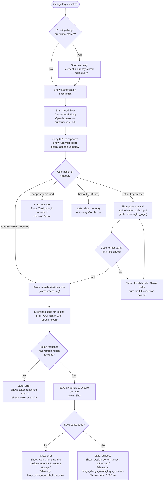

# `/design-login`

> Analysis basis: CC v2.1.193 bundle.js (AST extraction + Claude interpretation)
> Minimum version: v2.1.193

---

## Overview

`/design-login` initiates an OAuth 2.0 authorization flow that grants the Claude Code design-system integration (`/design-sync`) access to the user's claude.ai account. It renders an interactive terminal UI component that guides the user through browser-based authorization, optionally accepting a manually entered authorization code when browser redirect is unavailable. On success it writes a persistent design OAuth credential to secure storage.

---

## Registration

| Field | Value |
|---|---|
| type | `local-jsx` |
| name | `design-login` |
| description | `Authorize design-system access for /design-sync with your claude.ai account` |
| loc_byte | `11840598` |
| loc_byte_end | `11840797` |
| loc_line | `7916` |
| module_id | `vRl` |
| load_inline | `true` |
| arbor_handler.name | `LRl` |
| arbor_handler.fqn | `claude-2.1.193::LRl` |
| arbor_handler.kind | `Function` |
| arbor_handler.resolution_path | `direct` |
| arbor_handler.n_hits | `1` |

Analysis basis: CC v2.1.193 bundle.js:+11840598

---

## Input Branching

The command's JSX component (`CRl`) exhibits five or more distinct UI-state branches, driven by an internal status field and keyboard/timer events. A Mermaid flowchart is used.



Analysis basis: CC v2.1.193 bundle.js:+11834337 – +11837185

---

## Behavioral Spec

### Component Mount & Initial State

```
function designLoginComponent(props):
    [status, setStatus] = useState("starting")        // +11834356
    authContext = useClockContext()                    // ws / +11834486
    terminalSize = useTerminalSize()                  // Hr / +11834493
    columnWidth = max(terminalSize.columns - 4, 50)  // +11834557, +11834566
    visibleColumns = 4                               // +11834590

    if existingDesignCredential present:
        render replacement-warning message            // +11837672

    render description:
        "Authorize design-system access (read and write …)"  // +11837433
```

Analysis basis: CC v2.1.193 bundle.js:+11834337

---

### OAuth Flow Initiation

```
function startLoginFlow():
    if CLAUDE_CODE_DESIGN_OAUTH_CLIENT_ID not configured:
        // +11835450 — show configuration error, abort
        show "The Claude Design OAuth client is not configured in this build…"
        return

    call r.startOAuthFlow()                          // +11835673
    receive authorizationURL
    copy URL to clipboard via clipboardWriter        // jv subtree
    show "Browser didn't open? Use the url below…"  // +11837923
    show "(Copied!)" label                           // +11838019
    set timeout to 3000 ms for auto-retry            // +11835775
```

Analysis basis: CC v2.1.193 bundle.js:+11835673

---

### Keyboard Event Handling

```
function onKeyPress(key):
    if key == "return":                              // +11834881
        transition to manualCodeEntryMode()
    else if key == "escape":                         // +11834728
        setStatus("escape")
        show "Design login cancelled."               // +11834817
        cleanup()

function onTimeout():                               // setTimeout 3000ms +11835775
    setStatus("about_to_retry")                     // +11834921
    restart OAuth flow
```

Analysis basis: CC v2.1.193 bundle.js:+11834728, +11834881

---

### Manual Authorization Code Entry

```
function manualCodeEntryMode():
    setStatus("waiting_for_login")                   // +11835154
    show instruction about callback URL              // +6778890, +6779033
    // "After the user authorizes in their browser, the browser
    //  is redirected to a `http://localhost:<port>/callback?...`"

    onCodeSubmit(inputText):
        validated = validateAuthCode(inputText)      // iKn / Rs
        if not validated:
            show "Invalid code. Please make sure the full code was copied"  // +11835081
            return
        telemetry("tengu_design_oauth_manual_entry")  // +11835240
        processAuthorizationCode(validated)
```

Analysis basis: CC v2.1.193 bundle.js:+11835154, +11835240

---

### Authorization Code Validation (`codeValidator`)

```
function codeValidator(rawInput):
    // Uses Rs (+11835652) and iKn (+11835659)
    // Rs normalizes the code string:
    //   - replaces certain characters, checks against approved prefixes (san.includes)
    //   - raises Error if endpoint is not an approved OAuth URL  // +865220, +865226
    // iKn wraps Rs for the design-login-specific client
    normalized = Rs(rawInput)
    if normalized is null or invalid:
        return null
    return normalized
```

Analysis basis: CC v2.1.193 bundle.js:+11835652

---

### Token Exchange (`tokenExchange`)

```
function tokenExchange(authCode):
    setStatus("processing")                          // +11835980
    response = await T1.post(tokenEndpoint, {
        grant_type: "refresh_token",                 // +2150736 (token flow constant)
        code: authCode,
        headers: { "Content-Type": "application/json" },  // +2150791
        timeout: 5000                                // +2150834
    })

    if response.isAxiosError:
        setStatus("error")
        record telemetry("tengu_design_oauth_login_error")  // +11836534
        return

    tokens = response.data
    if tokens missing refresh_token or expiry:       // +10284547
        show "The token response was missing a refresh token or expiry…"
        setStatus("error")
        return

    saveDesignCredential(tokens)
```

Analysis basis: CC v2.1.193 bundle.js:+11835943, +2150676

---

### Credential Persistence (`credentialSave`)

```
function credentialSave(tokens):
    // oKn (+11836176) calls $ht (+11837165)
    // $ht uses Zl (secure storage writer) and be (error handler)
    result = await secureStorageWrite(tokens)        // oKn / $ht / Zl

    if result failed:
        show "Failed to save design OAuth tokens"    // +10281069
        show "Could not save the design credential to secure storage."  // +11836285
        setStatus("error")
        telemetry("tengu_design_oauth_login_error")  // +11836534
        return

    setStatus("success")
    show "Design-system access authorized."          // +11834652
    telemetry("tengu_design_oauth_login_success")    // +11836381
    await sleep(1500)                               // +11836510
    cleanup()
```

Analysis basis: CC v2.1.193 bundle.js:+11836176, +11836381

---

### Cleanup & Effect Teardown

```
function cleanup():
    r.cleanup()                                      // +11837079
    forEach pending listener in I:
        remove listener                              // +11837091
    I.clear()                                        // +11837111
    // useEffect teardown registered at +11836642
```

Analysis basis: CC v2.1.193 bundle.js:+11837079

---

### Rendered Layout

```
function render():
    // tE.jsxs / tE.jsx (+11837185, +11837358)
    Box(flexDirection="column"):
        Text: "Design login"                         // +11837385
        Text: description string                     // +11837433
        if existingCredential: Text warning          // +11837672

        if status == "starting" or "about_to_retry":
            Spinner + auth URL display
            Text: "Browser didn't open? Use the url below…"  // +11837923
            if copied: Text "(Copied!)"              // +11838019
            Button label: "copy"                     // +11838092

        if status == "waiting_for_login":
            TextInput for manual code

        if status == "success":
            Text: "Design-system access authorized." // +11834652

        if status == "error":
            Text: error message

        if status == "escape":
            Text: "Design login cancelled."          // +11834817
```

Analysis basis: CC v2.1.193 bundle.js:+11837185

---

## State & Side Effects

| Item | Detail |
|---|---|
| Telemetry: `tengu_design_oauth_manual_entry` | Fired when user submits a manually entered authorization code (+11835240) |
| Telemetry: `tengu_design_oauth_login_success` | Fired on successful token storage (+11836381) |
| Telemetry: `tengu_design_oauth_login_error` | Fired on token exchange failure or credential save failure (+11836534) |
| Telemetry: `tengu_daemon_config_reload` | Fired by daemon subsystem during MCP config reload (indirect, +17498707) |
| Telemetry: `tengu_mcp_skills` | Fired by MCP skills tracking (indirect, +6781017) |
| Telemetry: `tengu_feature_ok` / `tengu_feature_bad` / `tengu_feature_sad` | General feature-gate telemetry (indirect, +1026754 / +1026821 / +1026902) |
| Clipboard side-effect | Authorization URL is copied to system clipboard via platform clipboard writer (`jv` → `Ski` → OS-specific tool: pbcopy/wl-copy/xclip/powershell) |
| Secure storage write | Design OAuth tokens (access token, refresh token, expiry) written to secure credential store (`oKn` / `$ht` / `Zl`) |
| OAuth HTTP request | POST to token endpoint with `Content-Type: application/json`, 5000 ms timeout (+2150806, +2150834) |
| Timer: 3000 ms | Auto-retry timeout registered on OAuth flow start; cancelled on manual entry or result (+11835775) |
| Timer: 1500 ms | Post-success delay before component teardown (+11836510) |
| useEffect teardown | Listeners in ref `I` are removed and cleared; `r.cleanup()` called on unmount (+11837079) |
| appState changes | None directly observed; MCP connection state may be refreshed by surrounding MCP subsystem via `VWo` / `Bcr` |

---

## Version History

| Version | Change |
|---|---|
| v2.1.193 | Initial analysis |

---

## Common Mistakes

1. **Missing OAuth client ID build variable** — If `CLAUDE_CODE_DESIGN_OAUTH_CLIENT_ID` is not set in the build, the command immediately surfaces the error "The Claude Design OAuth client is not configured in this build…" (+11835450) and cannot proceed. This is a build-time requirement, not a runtime configuration file.

2. **Pasting only the authorization code instead of the full callback URL** — When using manual entry (Return key), the command expects the full `http://localhost:<port>/callback?code=...&state=...` redirect URL, not just the bare code value. Pasting only the code fragment yields the "Invalid code" error (+11835081).

3. **Confusing `/design-login` credentials with session authentication** — The description explicitly states this is "separate from this session's authentication and changes nothing else" (+11837433). Design credentials are stored independently of the main API key or session OAuth.

4. **Attempting to cancel after token exchange begins** — Once `status` transitions to `"processing"`, the Escape key handler no longer cancels the in-flight HTTP token request. Cancellation is only effective in the `"starting"` / `"waiting_for_login"` / `"about_to_retry"` states.

5. **Re-running without expecting the replacement warning** — If a design credential is already stored, the UI shows "A design credential is already stored — completing this flow replaces it." (+11837672). This is expected behavior, not an error.

---

## Appendix — Identifier Mapping

> For bundle debugging only. Identifiers change across versions.

| Identifier | Role |
|---|---|
| `LRl` | Arbor-resolved top-level handler function for `/design-login` (arbor_handler) |
| `WSf` | Outer JSX wrapper / entry component (handler_name in callGraph) |
| `CRl` | Main login form React component (state machine, keyboard handler, render) |
| `ws` | `useClockContext` hook (requires ClockProvider) |
| `Hr` | `useTerminalSize` hook (requires Ink App context) |
| `y8t` | OAuth client configuration loader |
| `iKn` | Design-specific authorization code validator (wraps `Rs`) |
| `Rs` | Base OAuth code/URL normalizer and endpoint validator |
| `T1` | Token exchange HTTP client (Axios-based POST to token endpoint) |
| `aCo` | Token response parser and validation (checks refresh_token / expiry) |
| `oKn` | Credential save orchestrator (wraps `$ht`) |
| `$ht` | Secure storage writer for design OAuth tokens |
| `Zl` | Low-level secure storage / keychain abstraction |
| `jv` | Clipboard subsystem dispatcher |
| `Ski` | Platform-specific clipboard writer selector |
| `kWr` | Linux clipboard writer (wl-copy / xclip / xsel) |
| `JTd` | tmux clipboard writer |
| `RWr` | OSC-52 / terminal escape clipboard writer |
| `DOt` | Windows clipboard writer (powershell) |
| `IL` | Raw clipboard channel with replaceAll sanitization |
| `wE` | DCS/raw terminal clipboard writer |
| `Eki` | Kitty-protocol clipboard writer |
| `Td` | Terminal display context hook (useSyncExternalStore) |
| `xe` | Error logger (pushes to error ring buffer, calls `kZ.logError`) |
| `eo` | Error-to-string serializer |
| `at` | String coercion utility |
| `Bi` | Error metadata wrapper |
| `Rds` | Error reporter (wraps `at`) |
| `e_u` | Error ring-buffer manager (shift/push) |
| `a` | MCP server state update function (calls `l6e`, `Bcr`, `VWo`) |
| `l6e` | MCP connection manager / connector loop |
| `V3` | MCP configuration reconciler |
| `aX` | MCP server connector (approval, slot management) |
| `H6` | MCP server list builder |
| `m1n` | MCP server status coloring (red/yellow) |
| `ect` | MCP SSE/HTTP transport handler |
| `yF` | Object prototype chain utility (`Object.create`) |
| `BL` | MCP base-layer utilities |
| `mg` | MCP message gateway |
| `sn` | MCP debug logger (`kZ.logMCPDebug`) |
| `iu` | MCP error logger (`kZ.logMCPError`) |
| `P1n` | MCP OAuth / auth flow manager |
| `Hlp` | MCP OAuth authorization URL handler |
| `_lp` | MCP OAuth callback URL handler |
| `e3t` | MCP remote connection initializer |
| `qs` | Async-context store getter (`Kqu.getStore`) |
| `GNn` | MCP needs-auth cache path builder |
| `ke` | JSON serializer (`JSON.stringify`) |
| `hso` | MCP auth-state helper |
| `fba` | MCP fingerprint / hash builder |
| `mao` | MCP needs-auth cache reader |
| `hRe` | MCP config hash calculator (SHA-256) |
| `iTn` | MCP tool definition hasher |
| `aTn` | MCP aggregate tool-set hasher |
| `tI` | MCP individual tool hasher (wHi.createHash) |
| `sTn` | MCP session signature builder |
| `be` | String coercion / error stringifier (`String(...)`) |
| `jL` | MCP skill registration dispatcher |
| `it` | MCP skill registrar (KPt / zPt / lCn / ZW lookups) |
| `Zoo` | MCP status icon selector |
| `mn` | Global config save function |
| `w` | Background session window manager |
| `B7` | Background session state tracker |
| `L` | Background sweep / memory manager |
| `KAc` | Background session selector (`e.at`) |
| `zAc` | Background session eviction strategy |
| `Bcr` | MCP update applier (`applyMcpUpdate`) |
| `a6e` | MCP slot hash comparator (wraps `hRe`) |
| `oT` | MCP cleanup orchestrator |
| `s6e` | MCP orphan detector (wraps `hRe`) |
| `mSa` | MCP server I/O adapter |
| `T` | Command/path normalizer (includes uppercase, trim, `Lc`) |
| `qFc` | Feature-flag evaluator |
| `c7o` | Feature-flag cache (JNc / QNc) |
| `Lc` | Path shortener / last-segment extractor |
| `KXo` | Path mapping table builder |
| `iYe` | Output writer (wraps `OXo`) |
| `OXo` | Raw terminal write adapter |
| `XFc` | Log file writer (append, rotate, mkdir) |
| `P7e` | Batched log flush scheduler (setTimeout/setImmediate) |
| `Ame` | Log entry formatter (join, `nr`, `Lt`) |
| `jt` | Log file path resolver |
| `Cse` | EISDIR-safe file writer |
| `XXo` | Log directory path builder |
| `nhr` | Log file rotation handler (stat/rename/unlink) |
| `YFc` | Log file append worker (mkdir/appendFile) |
| `Ei` | Signal/hook registration (`a7o.register`) |
| `l` | Daemon process lifecycle manager |
| `C8l` | Daemon status file writer (`daemon.status.json`) |
| `iee` | Daemon status path resolver |
| `v7t` | Daemon status file path builder |
| `VWo` | MCP full reconnect orchestrator |
| `E1n` | MCP capability set checker (Nap / cso) |
| `Un` | Timeout-with-abort utility |
| `c` | Background session context (`yn`) |
| `p` | Process exit manager (vT / process.exit / u.abort) |
| `vT` | Forced shutdown signal |
| `u` | Abort controller manager (we / Re / R$ / Hj) |
| `we` | Abort success reporter (`tengu_feature_ok`) |
| `Re` | Abort failure reporter (`tengu_feature_bad`) |
| `R$` | Abort signal dispatcher (h5 / ZBe / xGr) |
| `h5` | Signal queue initializer |
| `ZBe` | Event loop drain utility |
| `xGr` | UUID-based signal emitter |
| `Hj` | Graceful shutdown sequencer (Promise.race / process.exit) |
| `Yhe` | Shutdown notification sender |
| `oHe` | Shutdown timeout handler (clearTimeout / H9o) |
| `vt` | Network error reporter (`tengu_feature_sad`) |
| `I8` | Async iterator / event-stream mapper |
| `Uct` | MCP retry-delay parser (parseInt, base 10) |
| `jNn` | MCP secondary delay parser (parseInt, base 20) |
| `_ba` | MCP parameter validator (wraps `I8`) |
| `E` | MCP server process stop handler (XAt / xM / RM / Promise.all) |
| `A` | MCP server restart handler (QBt / XAt / updateConfig / start) |
| `DMc` | Daemon heartbeat dispatcher |
| `d` | MCP server write/restart orchestrator |
| `tKe` | File stat / read utility (Bql.stat, ENOENT, isFile, 1 MB limit) |
| `r` | Supervisor data-stream handler |
| `Gql` | Object-key diff utility (Object.keys / Math.max / f_) |
| `i` | Connection slot manager (close / set / delete) |
| `s` | Promise tracking set (add / finally / delete) |
| `n` | String toLowerCase normalizer |
| `m` | Process kill manager (n.values / R.kill / SIGTERM) |
| `V` | Void / no-op sentinel |
| `Pn` | Clipboard platform detector |
| `Vr` | Clipboard read/write entry point |
| `Pt` | Clipboard error wrapper |
| `kf` | Linux clipboard detection (`_ss`) |
| `MOt` | OSC-52 terminal clipboard encoder |
| `Xh` | Terminal escape sequence builder |