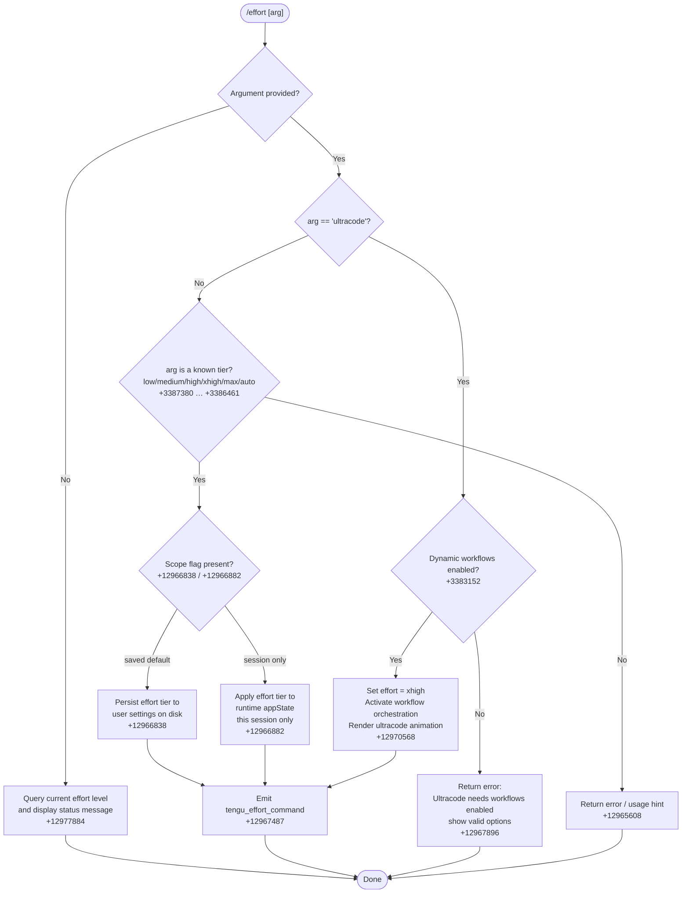

# `/effort`

> Analysis basis: CC v2.1.193 bundle.js (AST extraction + Claude interpretation)
> Minimum version: v2.1.193

---

## Overview

`/effort` sets the thinking-budget / computational effort level that Claude applies to model requests in the current session or as a persisted default. It accepts one of several named tiers — `low`, `medium`, `high`, `xhigh`, `max`, `ultracode`, or `auto` — and optionally a scope flag; with no argument it reports the currently active effort level. The special `ultracode` tier combines the `xhigh` effort level with dynamic workflow orchestration and requires that workflows be enabled before it can be activated.

---

## Registration

| Field | Value |
|---|---|
| type | `local-jsx` |
| name | `effort` |
| description | Set effort level for model usage |
| argumentHint | `[low\|medium\|high\|xhigh\|max\|ultracode\|auto] \| [low\|medium\|high\|xhigh\|max\|auto]` |
| immediate | `null` |
| thinClientDispatch | `control-request` |
| module_id | `WWl` |
| load_inline | `true` |
| loc_byte | `12979644` |
| loc_byte_end | `12979975` |
| arbor_handler.name | `Z1f` |
| arbor_handler.fqn | `claude-2.1.193::Z1f` |
| arbor_handler.kind | `AsyncFunction` |
| arbor_handler.resolution_path | `module_id` |
| arbor_handler.n_hits | `2` |

Analysis basis: CC v2.1.193 bundle.js:+12979644

---

## Input Branching

The command has five distinct top-level branches (no argument / ultracode / ordinary tier / scope flag / invalid), so a Mermaid flowchart is used.



---

## Behavioral Spec

### 1. Entry point — handler `Z1f`

The Arbor-resolved async handler (`Z1f`, `module_id` resolution path) is the true entry point for the command. It inspects the raw argument string, delegates to sub-routines, then renders a JSX result component.

```
async function handleEffortCommand(context, rawArg):
    sessionState = context.sessionState
    arg = rawArg?.trim().toLowerCase()  // normalise

    if not arg:
        return renderCurrentEffortStatus(sessionState)  // +12977884

    if arg == "ultracode":
        return handleUltracodeRequest(sessionState, context)

    knownTiers = ["low", "medium", "high", "xhigh", "max", "auto"]
    if arg not in knownTiers:
        return renderUsageError(knownTiers)

    return applyEffortTier(arg, context)
```

Analysis basis: CC v2.1.193 bundle.js:+12977845

---

### 2. Status display (no-argument path)

When invoked with no argument the handler reads the current effort level from session state and returns it as a formatted status string.

```
function renderCurrentEffortStatus(sessionState):
    currentTier = sessionState.effortLevel  // "unset"|"auto"|tier name
    if currentTier == "ultracode":
        return "Current effort level: ultracode " +
               "(xhigh + dynamic workflow orchestration; this session only)"
               // +12967056
    return "status: " + currentTier   // +12977899
```

Analysis basis: CC v2.1.193 bundle.js:+12977884

---

### 3. `ultracode` special path

`ultracode` is not a standard API effort value; it is a composite mode. The handler validates that the `allow_workflows` feature flag is active before proceeding.

```
async function handleUltracodeRequest(sessionState, context):
    workflowsEnabled = checkFeatureFlag("allow_workflows", sessionState)
    // +3383152, literal "allow_workflows" at +3382951

    if not workflowsEnabled:
        return errorMessage(
            "Ultracode needs dynamic workflows enabled (see /config). " +
            "Valid options are: low, medium, high, xhigh, max, auto"
        )  // +12967896

    // Set underlying effort to xhigh and enable workflow orchestration
    setSessionEffort("xhigh", sessionState)
    enableWorkflowOrchestration(sessionState)

    // Trigger visual animation ("violet-ripple" theme, +12970604)
    renderUltracodeAnimation()
    // Animation uses Math.cos, Math.sqrt, Math.round, Math.min, Math.floor
    // constants: frames=3..17, radius=8.5, cols=18 (+12970544..+12970819)

    return renderEffortConfirmation("ultracode", scope="session")
```

Analysis basis: CC v2.1.193 bundle.js:+12967863 – +12970856

---

### 4. Effort tier descriptions

Human-readable descriptions are stored as string literals and displayed alongside each tier name when the command renders its help or confirmation UI.

| Tier | Description (fragment) | loc_byte |
|---|---|---|
| `low` | "Quick, straightforward implementation…" | +3387392 |
| `medium` | "Balanced approach with standard implementation…" | +3387473 |
| `high` | (derived from `high` literal) | +3388061 |
| `xhigh` | (derived from `xhigh` literal) | +3388145 |
| `max` | (derived from `max` literal) | +3386461 |
| `auto` | "Use the default effort level for your model" | +12965608 |

Analysis basis: CC v2.1.193 bundle.js:+3387380

---

### 5. Scope resolution — saved default vs. session-only

After a valid tier is chosen the command decides whether to persist it or apply it transiently.

```
function applyEffortTier(tier, context):
    scopeFlag = context.args.scope  // "--save" or absent

    if scopeFlag == "save" or isInteractiveDefaultRequest(context):
        persistEffortToUserSettings(tier)
        // writes to userSettings / .claude/settings.json
        // +12966838, literal " (saved as your default for new sessions)"
        message = tier + " (saved as your default for new sessions)"
    else:
        setSessionEffort(tier, context.sessionState)
        // +12966882, literal " (this session only)"
        message = tier + " (this session only)"

    emitTelemetry("tengu_effort_command", {tier: tier})  // +12967487
    return renderConfirmation(message)
```

Analysis basis: CC v2.1.193 bundle.js:+12966838

---

### 6. Remote-transport limitation notice

When the active transport is not the Anthropic first-party API (e.g., a Bedrock or Vertex gateway), a notice is appended to the confirmation message indicating that server-side effort cannot be changed remotely.

```
function buildConfirmationMessage(tier, transport):
    base = tier + scopeSuffix
    if transport != "firstParty":
        // literal at +12965892:
        base += " (applied locally — this remote transport can't change server effort)"
    return base
```

API transport identifiers found: `firstParty` (+2139325), `anthropicAws` (+2139343), `foundry` (+2139363), `mantle` (+2139378).

Analysis basis: CC v2.1.193 bundle.js:+12965881

---

### 7. Settings persistence (`applyFlagSettings`)

Persisting the effort tier calls into the settings write pipeline under the key `apply_flag_settings` (+12966015). The pipeline reads existing user settings, merges the new effort value, and performs an atomic write (temp-file + rename pattern visible in the `writeFileSyncAndFlush` helper at +1103608).

```
async function persistEffortToUserSettings(tier):
    path = join(".claude", "settings.json")   // +1324227, +1324237
    settings = loadSettingsFromDisk(path)     // +1341423
    settings.effortLevel = tier
    writeFileAtomically(path, settings)       // temp → fsync → rename
    clearSettingsCache()                      // +29196, +29208
```

Analysis basis: CC v2.1.193 bundle.js:+12966015

---

### 8. Effort-level validation helper (`l3e`)

A shared validation function checks whether a string is a member of the known effort-level set.

```
function isValidEffortLevel(value):
    return EFFORT_LEVELS.includes(value)
    // EFFORT_LEVELS checked via uM.includes +3384892
```

The set includes at minimum: `low`, `medium`, `high`, `xhigh`, `max`, `auto`, `unset` (+3385741, +3385769, +3388061, +3388145, +3386461).

Analysis basis: CC v2.1.193 bundle.js:+3384892

---

### 9. Model-tier compatibility mapping (`hC`, `a3e`, `Dwe`)

Several internal helpers map effort levels to specific Claude model versions. Model strings observed in literals include claude-3-* (+3383544), claude-opus-4-x (+3383562 … +3383845), claude-sonnet-4-x (+3383608, +3383633, +3383868), claude-haiku-4-5 (+3383658), and experimental models claude-fable-5 (+3383754), claude-mythos-5 (+3383776). The `pro` tier (+3383397) gates access to certain effort/model combinations.

Analysis basis: CC v2.1.193 bundle.js:+3383480

---

### 10. `ultracode` animation component (`xq`)

A decorative JSX component renders a particle/ripple animation when `ultracode` is activated. It uses trigonometric helpers to compute positions and intensities.

```
function renderUltracodeAnimation(particles):
    // jWl: compute x-position using Math.cos, Math.min, Math.round  +12972230
    // GWl: compute intensity using Math.sqrt  +12972129
    // PWl: slice and map particle array  +12970440
    // Build JSX grid via el.jsx  +12972700
    // Constants: amplitude=2, gridCols=5..9, frame variants  +12972239..+12972926
    return <AnimatedGrid particles=transformedParticles theme="violet-ripple" />
```

Analysis basis: CC v2.1.193 bundle.js:+12972339

---

## State & Side Effects

| Item | Detail |
|---|---|
| Telemetry: `tengu_effort_command` | Fired on every successful tier change; loc +12967487 |
| Telemetry: `tengu_workflows_enabled` | Fired when workflow feature flag is checked; loc +3383152 |
| Telemetry: `tengu_slate_finch` | Fired from sub-routine `pjr` (context initialisation path); loc +3387846 |
| Telemetry: `tengu_feature_ok` | Fired on successful feature-flag check; loc +1026754 |
| Telemetry: `tengu_feature_sad` | Fired on feature-flag soft-failure; loc +1026902 |
| Telemetry: `tengu_feature_bad` | Fired on feature-flag hard-failure; loc +1026821 |
| Telemetry: `tengu_config_auth_loss_prevented` | Fired when settings save would have dropped auth credentials (GH #3117 guard); loc +13970545 |
| Settings write | `~/.claude/settings.json` updated atomically when `--save` / default-persist path is taken |
| Settings cache clear | `Den` and `Xdr` caches cleared after write; loc +29196, +29208 |
| Session state mutation | `effortLevel` field updated in runtime appState for session-only changes |
| Workflow orchestration flag | Set to enabled when `ultracode` tier is activated |
| Visual animation | `violet-ripple` ripple animation rendered in terminal on `ultracode` activation; loc +12970604 |
| `thinClientDispatch` | Registered as `control-request` — the thin client forwards the command as a control message rather than a normal prompt |

---

## Version History

| Version | Change |
|---|---|
| v2.1.193 | Initial analysis. Supports low/medium/high/xhigh/max/ultracode/auto; `ultracode` requires `allow_workflows`; remote-transport limitation notice; `violet-ripple` animation. |

---

## Common Mistakes

1. **Attempting `ultracode` without workflows enabled.** The command will reject the request and print an error message directing the user to `/config`. Workflows must be toggled on separately before `ultracode` becomes available. (bundle.js:+12967896)

2. **Expecting `ultracode` to persist across sessions.** The `ultracode` mode description explicitly states "this session only" (+12967056). The underlying `xhigh` effort level can be persisted, but the composite `ultracode` label is session-scoped.

3. **Using `/effort` on a remote (non-first-party) transport and expecting server-side throttle changes.** The command applies the setting locally but cannot alter server-side inference parameters on Bedrock/Vertex/Foundry deployments. A notice is appended to the confirmation. (bundle.js:+12965892)

4. **Passing the argument in a wrong case.** The handler normalises the argument to lowercase before matching (`e.toLowerCase` at +12968719), so `HIGH` and `High` are accepted, but typos such as `xHigh` with extra characters will fail validation.

5. **Omitting a scope flag and assuming the change is permanent.** Without an explicit save intent the effort tier is applied to the current session only and is not written to `settings.json`. (bundle.js:+12966882)

---

## Appendix — Identifier Mapping

> For bundle debugging only. Identifiers change across versions.

| Identifier | Role |
|---|---|
| `Z1f` | Main async handler for `/effort` (Arbor-resolved entry point) |
| `Jtr` | Top-level command dispatch wrapper |
| `Gee` | Effort command orchestrator (calls model-compat check + renderer) |
| `vE` | Feature-flag / session-state reader |
| `CCn` | Boolean config value getter |
| `at` | String coercion utility |
| `xx` | Unknown low-level utility (reachable from CCn and iAd) |
| `ixi` | Workflow-feature flag checker |
| `Fs` | Feature permission resolver (checks WSd, VSd sets, allow_product_feedback) |
| `cjr` | Effort argument parser / tier resolver |
| `aAd` | Tier normalisation helper (uses `at`, `it`, `ul`, `Ci`) |
| `iAd` | Secondary argument path handler |
| `Bee` | Effort renderer / confirmation builder |
| `hC` | Model-effort compatibility checker (claude-3-*, claude-opus-4-x etc.) |
| `to` | Application inference profile resolver |
| `A1` | Provider type mapper |
| `BH` | Provider backend classifier (G0t, Dqu, TFe) |
| `u3e` | Session-only effort setter |
| `kt` | Session state mutation + timestamp (uses Date.now) |
| `vW` | App state writer |
| `RCn` | Remote-transport limitation notice appender |
| `c3e` | User settings effort persister |
| `U$` | Settings read-parse helper (parseInt, isNaN, l3e) |
| `a3e` | max_effort model mapping helper |
| `Dwe` | xhigh_effort model mapping helper |
| `qu` | Settings loader utility |
| `FNe` | Settings file path resolver |
| `ZD` | Effort status / read-back helper |
| `rHe` | Effort level description builder |
| `l3e` | Valid-effort-level membership checker (uM.includes) |
| `jae` | Effort level string formatter |
| `pjr` | Context/session initialiser (emits tengu_slate_finch) |
| `lAd` | Session context builder |
| `zge` | Config reader |
| `Ci` | Configuration resolver (HPr, hPr, Dy, Vs) |
| `Dy` | API key / auth configuration reader (ANTHROPIC_API_KEY) |
| `it` | Conversation/session record handler |
| `KPt` | Session key generator |
| `zPt` | Session state initialiser |
| `H5` | Session lookup helper |
| `h5` | Session store accessor |
| `lCn` | Session deduplication / cache check (MGr, vwe) |
| `RGr` | New session creator (randomUUID, ke, _Sd, Nee.emit) |
| `UGr` | Session lifecycle manager (oHi, kr, bLi, cB, mg, kt) |
| `jWl` | Animation x-position calculator (Math.cos, Math.min, Math.round) |
| `GWl` | Animation intensity calculator (Math.sqrt) |
| `FWl` | Ultracode animation frame builder |
| `E5` | Effort display renderer (calls vE + Dwe) |
| `PWl` | Particle array slicer/mapper |
| `Xtr` | Effort UI component assembler |
| `As` | Model/effort state reader |
| `Y4` | App state selector |
| `wa` | Configuration document parser |
| `oxt` | Config file reader (qHs, VHs) |
| `sxt` | Config section parser |
| `PFe` | Config entry normaliser |
| `Gge` | Config model name formatter |
| `Fa` | String replacement helper |
| `Bge` | Model family classifier |
| `nM` | Model name canonicaliser |
| `a_n` | Recursive config walker |
| `EYs` | Config entry serialiser |
| `_n` | Policy settings accessor |
| `PZe` | Inference profile header builder |
| `yYs` | Model index finder |
| `EYu` | Effort-level config key mapper |
| `qo` | Canonical model resolver |
| `IRt` | Model alias expander |
| `SYu` | Model tier preference reader |
| `oH` | Config composition helper |
| `lC` | CLAUDE.md / settings document loader |
| `$1r` | Document section parser |
| `p_n` | Full configuration document parser |
| `d_n` | Document sub-section walker |
| `Qtr` | Effort command JSX renderer (top-level React component) |
| `R1f` | "show status" branch renderer |
| `FUo` | Settings-load + effort-read helper |
| `fA` | Async settings accessor |
| `uOt` | Effort-set branch handler |
| `Pwe` | Effort write helper |
| `co` | Settings-on-disk I/O coordinator |
| `dg` | Settings directory initialiser |
| `jt` | Home-directory resolver |
| `Svr` | Settings file scanner |
| `yB` | Settings read dispatcher |
| `hv` | MZ module accessor |
| `In` | ENOENT-safe file reader |
| `T` | Log/debug message formatter |
| `wCr` | Settings cache updater (gcn.set, Date.now) |
| `B$e` | Settings runner |
| `Qwt` | Atomic file writer (temp → fsync → rename) |
| `ke` | JSON serialiser |
| `PH` | Settings cache clearer (Den, Xdr) |
| `wgs` | Settings file append/write helper |
| `U4` | .claude directory path builder |
| `mr` | Rx (reactive) state accessor |
| `we` | tengu_feature_ok emitter |
| `vt` | tengu_feature_sad emitter |
| `Re` | tengu_feature_bad emitter |
| `dW` | Settings load-from-disk trigger |
| `xe` | Error push / log helper |
| `WB` | Effort-apply side-effect coordinator |
| `mn` | Global config saver (auth-loss guard, tengu_config_auth_loss_prevented) |
| `V` | Feature event bus |
| `Ve` | Zze (event emitter bootstrap) |
| `k1f` | "set new tier" branch renderer |
| `crt` | Argument trim + level-check entry |
| `x1f` | Full effort-set render path |
| `xq` | Ultracode ripple animation JSX component |
| `c` | Animation particle array |
| `yn` | Animation frame scheduler |

---

Note: index built via Arbor fallback; some signals (telemetry, literals) may be missing — see arbor-fallback.js.