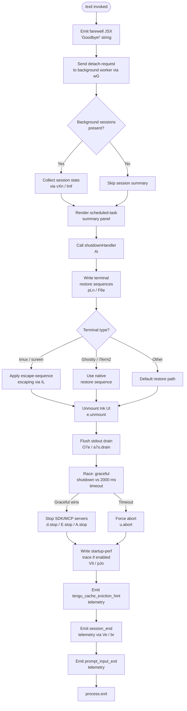

# `/exit`

> Analysis basis: CC v2.1.193 bundle.js (AST extraction + Claude interpretation)
> Minimum version: v2.1.193

---

## Overview

The `/exit` command (aliased as `/quit`) terminates the Claude Code CLI session. When invoked, it renders a farewell JSX component ("Goodbye!"), flushes pending output and telemetry, gracefully tears down background daemon infrastructure and MCP connections, and then calls `process.exit`. The command is marked `immediate`, meaning it bypasses the normal prompt pipeline and executes synchronously without sending a request to the model.

---

## Registration

| Field | Value |
|---|---|
| type | `local-jsx` |
| name | `exit` |
| description | `null` |
| aliases | `["quit"]` |
| immediate | `true` |
| module_id | `mjl` |
| load_inline | `true` |
| loc_byte | `12892916` |
| loc_byte_end | `12893112` |
| loc_line | `8824` |
| arbor_handler.name | `MOf` |
| arbor_handler.fqn | `claude-2.1.193::MOf` |
| arbor_handler.kind | `AsyncFunction` |
| arbor_handler.resolution_path | `module_id` |
| arbor_handler.n_hits | `1` |

Analysis basis: CC v2.1.193 bundle.js:+12892916

---

## Input Branching

The command takes no user-supplied argument; branching occurs entirely on **runtime state** (running background sessions, daemon mode, MCP connections, terminal type). There are more than three distinct execution paths, so a flowchart is used.



Analysis basis: CC v2.1.193 bundle.js:+12892175 – +12892348

---

## Behavioral Spec

### 1. Farewell Display and Detach Request

```
async function exitCommandHandler(context):
    # Emit "Goodbye!" via JSX renderer
    render farewell component via gjl.jsx        # bundle.js:+12892252
    farewell_string = "Goodbye!"                 # bundle.js:+12892139

    # Notify any background worker process
    sendDetachRequest(context)                   # via jSe → wG, bundle.js:+12892191
    # wG writes a "detach-request" message to the IPC channel
    # DIl resolves the task type as "task" (literal, bundle.js:+11396707)
    # serialised via ke → JSON.stringify
```

Analysis basis: CC v2.1.193 bundle.js:+12892139, +12892191, +11402680

---

### 2. Background Session Summary

```
function collectSessionSummary(context):
    sessions = gatherScheduledTasks(context)     # vXn, bundle.js:+12892222
    for each session in sessions:
        summary = buildTimeSummary(session)      # lmf → CP / dN / Bit / ji
        # CP parses cron-like schedule strings ("Every minute", "Every hour")
        # dN tokenises schedule text; Bit applies date arithmetic
        # ji formats durations (Math.floor / Math.round)
    push summary entries into render list
    truncate display using grapheme-aware width   # Oa / tn / Os, bundle.js:+11395383
```

Key literals encountered during traversal:
- `"scheduled task"` — label for session type (bundle.js:+11395424)
- `"Every minute"` — cron label (bundle.js:+5045046)
- `"Every hour"` — cron label (bundle.js:+5045263)
- `5` — minute-schedule threshold (bundle.js:+5044962)
- `10` — hour-schedule threshold (bundle.js:+5045116)

Analysis basis: CC v2.1.193 bundle.js:+12892222, +11395383

---

### 3. Shutdown Handler (`Ai` / `shutdownOrchestrator`)

```
async function shutdownOrchestrator(appState, options):
    # Step 1 — restore terminal state
    writeTerminalRestoreSequences()              # F6e, bundle.js:+7371839
    # ESC-7 / ESC-8 DECSC/DECRC sequences (bundle.js:+3894270, +3894281)
    applyTerminalMultiplexerEscaping()           # pLn → IL, bundle.js:+3894363
    # "tmux" and "screen" require double-escape rewriting (bundle.js:+3539657, +3539730)

    # Step 2 — unmount Ink UI
    unmountInkRenderer()                         # F6e → e.unmount, bundle.js:+7371917

    # Step 3 — write farewell text to stdout
    writeSync(stdout, formattedFarewell)         # tuo → Vye.writeSync, bundle.js:+7372296

    # Step 4 — build session transcript output if needed
    buildExitTranscript()                        # tuo → h9t / Cg, bundle.js:+7372158

    # Step 5 — flush stdout drain
    await drainStdout()                          # O7e → a7o.drain, bundle.js:+68083

    # Step 6 — race graceful teardown against timeout
    timeout_ms = Math.max(5000, 3500)            # bundle.js:+7374936, +7374943
    result = await Promise.race([
        gracefulTeardown(appState),
        sleep(2000)                              # bundle.js:+7375121
    ])

    # Step 7 — stop infrastructure
    stopSupervisorDaemon()                       # d → d.stop / E.stop, bundle.js:+17498182
    stopMCPAgentConnections()                    # d → A.stop, bundle.js:+17498302
    waitForSettledConnections()                  # qLa → Promise.allSettled, bundle.js:+13544065

    # Step 8 — abort signal for remaining async work
    abortRemainingWork()                         # nuo → u.abort, bundle.js:+7372504
    # fallback: process.kill with SIGTERM if abort insufficient (bundle.js:+7372529)

    # Step 9 — write startup performance trace if profiling enabled
    writeStartupPerfReport()                     # VIt → pJo → wTe, bundle.js:+225836
    # Uses Hme.openSync / writeFileSync / fsyncSync / closeSync for atomic write
    # Emits tengu_startup_perf telemetry (bundle.js:+227522)

    # Step 10 — emit session-end and exit telemetry
    emitSessionEndEvent()                        # Ve → Zze, bundle.js:+7375330
    emitCacheEvictionHint()                      # Jbt, bundle.js:+7375282
    emitExitInputTelemetry("prompt_input_exit")  # bundle.js:+12892353

    # Step 11 — call process.exit
    process.exit(0)                              # nuo → process.exit, bundle.js:+7372504
```

Analysis basis: CC v2.1.193 bundle.js:+7374839 – +7375407

---

### 4. Forced-Shutdown Guard (`nuo` / `forceExitFallback`)

```
function forceExitFallback(timeoutHandle):
    clearTimeout(timeoutHandle)
    ink_instance = getInkInstance()              # wu.get, bundle.js:+7372456
    if ink_instance exists:
        # attempt unmount was already done; this is a safety net
        pass
    process.exit(1)                              # bundle.js:+7372504
    # If process.exit is blocked, escalate:
    process.kill(process.pid, "SIGTERM")         # bundle.js:+7372529
    # If still alive after escalation, throw Error("unreachable")
    throw new Error("unreachable")               # bundle.js:+7372577
```

Analysis basis: CC v2.1.193 bundle.js:+7372423

---

### 5. Background Daemon Shutdown (`d` / `supervisorShutdown`)

```
async function supervisorShutdown(supervisor):
    # Persist current configuration snapshot
    writeConfigSnapshot(supervisor)              # d → r.write, bundle.js:+17497906
    # role label "supervisor" (bundle.js:+17497914)

    # Stop the main SDK/transport connection
    stopSDKEngine()                              # d → E.stop, bundle.js:+17498182
    # E.stop propagates to MCP server teardown (XAt / xM / RM)

    # Remove from active session registry
    removeFromRegistry(supervisor)              # d → i.delete, bundle.js:+17498191

    # Stop agent runner
    stopAgentRunner()                            # d → A.stop, bundle.js:+17498302

    # Optionally restart with updated config (daemon reload path)
    if configChanged:
        updateAndRestartDaemon()                 # d → A.updateConfig / A.start
        # emits tengu_daemon_config_reload (bundle.js:+17498707)

    # Reclaim spare session slot if available
    reclaimSpareSlot()                           # d → DMc → Bae, bundle.js:+17498431
```

Analysis basis: CC v2.1.193 bundle.js:+17497889 – +17498705

---

### 6. Terminal Restore (`pLn` / `terminalRestoreWriter`)

```
function terminalRestoreWriter(terminalEnv):
    # Write cursor-save restore escape
    writeSync(stderr, "\x1b7")                  # bundle.js:+3894270
    writeSync(stderr, "\x1b8")                  # bundle.js:+3894281

    # Check terminal multiplexer environment
    term = detectTerminal()                      # $3e → zPi.coerce / LR
    if term matches "ghostty" (≥ v1.2.0):       # bundle.js:+3616189, +3616219
        applyGhosttyRestore()
    elif term matches "iTerm.app" (≥ v3.6.6):   # bundle.js:+3616258, +3616290
        applyITermRestore()
    else:
        applyDefaultRestore()

    # Rewrite multiplexer escape sequences
    if multiplexer == "tmux":                    # bundle.js:+3539657
        content = content.replaceAll("\\", "\\\\")  # bundle.js:+7372215
        content = content.replaceAll('"', '\\"')     # bundle.js:+7372238
    elif multiplexer == "screen":               # bundle.js:+3539730
        content = content.replaceAll("\x1b\x1b", ...)  # bundle.js:+3539703
```

Analysis basis: CC v2.1.193 bundle.js:+3894108, +3539644

---

## State & Side Effects

| Item | Detail |
|---|---|
| Telemetry — `tengu_bg_dispatch_sigkill_escalate` | Fired when a background session requires SIGKILL escalation during shutdown (bundle.js:+17482166) |
| Telemetry — `tengu_bg_dispatch_low_mem` | Fired when low-memory condition detected in background dispatcher (bundle.js:+17482767) |
| Telemetry — `tengu_bg_spare_enable` | Fired when a spare background session slot is enabled (bundle.js:+17483464) |
| Telemetry — `tengu_bg_spare_claim` | Fired when a spare slot is successfully claimed (bundle.js:+17483592) |
| Telemetry — `tengu_bg_spare_claim_fail` | Fired when spare-slot claim fails (bundle.js:+17483858) |
| Telemetry — `tengu_daemon_yield` | Fired when daemon yields to a foreground service (bundle.js:+17503119) |
| Telemetry — `tengu_daemon_config_reload` | Fired when daemon restarts with updated config (bundle.js:+17498707) |
| Telemetry — `tengu_startup_perf` | Fired with startup profiling data if profiling was enabled (bundle.js:+227522) |
| Telemetry — `tengu_scroll_summary` | Fired with scroll metrics at session end (bundle.js:+7374352) |
| Telemetry — `tengu_amber_creek` | Fired during fullscreen/terminal mode resolution (bundle.js:+3549303) |
| Telemetry — `tengu_pewter_brook` | Fired during fullscreen/terminal mode resolution (bundle.js:+3549210) |
| Telemetry — `tengu_cache_eviction_hint` | Fired at exit to signal cache eviction (bundle.js:+7375295) |
| Literal — `"prompt_input_exit"` | Telemetry label emitted via `Ai` at exit (bundle.js:+12892353) |
| Literal — `"session_end"` | Telemetry label emitted via `Ve` (bundle.js:+7375333) |
| IPC side-effect | Sends `"detach-request"` message to background worker over IPC channel before tearing down (bundle.js:+11402680) |
| Ink UI | Unmounts the running Ink renderer instance (`e.unmount`) before writing final output (bundle.js:+7371917) |
| stdout drain | Awaits `a7o.drain` to ensure all buffered output is flushed (bundle.js:+68083) |
| Startup perf log | If startup profiling is active, writes an atomic perf report file via `Hme.openSync / writeFileSync / fsyncSync / closeSync` (bundle.js:+193590) |
| process.exit | Called by `nuo` (forceExitFallback) after teardown, with SIGTERM escalation fallback (bundle.js:+7372504, +7372529) |
| AbortSignal | An `AbortSignal.timeout` is used to bound the graceful teardown window (bundle.js:+7375221) |

---

## Version History

| Version | Change |
|---|---|
| v2.1.193 | Initial analysis |

---

## Common Mistakes

1. **Confusing `/exit` with Ctrl-C**: `/exit` executes a structured teardown (draining output, emitting telemetry, stopping daemons). A SIGINT/Ctrl-C may bypass several of these steps.
2. **Expecting synchronous exit**: The handler is an `AsyncFunction` (`MOf`). The process does not exit until the `Promise.race` teardown window (up to ~2000 ms) resolves or times out.
3. **Assuming `/quit` behaves differently**: `/quit` is a registered alias for `/exit` and invokes the identical `MOf` handler with no distinction.
4. **Assuming background sessions are killed immediately**: The command sends a `"detach-request"` IPC message first; background daemon workers have their own SIGTERM/SIGKILL escalation sequence with a 30-second grace window (literals `30`, `15` at bundle.js:+17482121, +17482132).
5. **Overlooking terminal multiplexer quirks**: In tmux or screen, escape sequences in the farewell output are rewritten before being sent to the terminal. Pasting raw output from these environments may show double-escaped characters.

---

## Appendix — Identifier Mapping

> For bundle debugging only. Identifiers change across versions.

| Identifier | Role |
|---|---|
| `MOf` | Main async exit command handler (`exitCommandHandler`) |
| `Ks` | Background process/mode classifier called at entry |
| `mve` | Mode-value resolver used by `Ks` |
| `jSe` | IPC detach-request sender |
| `w_n` | IPC channel writer helper used by `jSe` |
| `DIl` | Task-type resolver used by `jSe` |
| `S7n` | Task status normaliser used by `DIl` |
| `yn` | Yield/state helper used by `DIl` and `c` |
| `wG` | IPC message dispatcher (writes `"detach-request"`) |
| `ke` | JSON serialiser wrapper (calls `JSON.stringify`) |
| `lpe` | IPC listener cleanup used by `jSe` |
| `Cm` | Context accessor called during handler setup |
| `vXn` | Scheduled-session collector |
| `qI` | Queue/index helper used by `vXn` |
| `Rx` | Registry/store accessor |
| `lmf` | Session time-summary builder |
| `CP` | Cron-string parser (parses "Every minute" / "Every hour") |
| `dN` | Schedule-text tokeniser |
| `Hjd` | Token splitter / numeric extractor used by `dN` |
| `Bit` | Date arithmetic applier (sets hours/minutes/month/date) |
| `ji` | Duration formatter (Math.floor / Math.round) |
| `Oa` | Grapheme-aware string truncator |
| `tn` | Grapheme-width measurer (calls `Bun.stringWidth`) |
| `Os` | Overflow string replacer using `tn` |
| `hE` | Ellipsis/overflow helper used by `Os` |
| `kOf` | Farewell JSX component builder |
| `Ai` | Shutdown orchestrator (main teardown async function) |
| `F6e` | Terminal-state writer / Ink unmounter |
| `q$` | Post-unmount cleanup called by `F6e` |
| `pLn` | Terminal restore sequence writer |
| `$3e` | Terminal type detector (Ghostty / iTerm coerce) |
| `M3e` | Mode resolver used by `pLn` |
| `IL` | Multiplexer escape-sequence rewriter (tmux/screen) |
| `Kd` | Key-derivation / config accessor used by `pLn` |
| `T` | Log/debug output formatter |
| `tuo` | Farewell text writer to stdout |
| `Yw` | Stdout stream reference |
| `s4` | String buffer accumulator used by `tuo` |
| `Lt` | Locale/encoding helper |
| `h9t` | Session transcript builder |
| `q2` | Registry query helper used by `h9t` |
| `mr` | Metadata resolver used by `h9t` |
| `jt` | Path joiner / filesystem helper |
| `Cg` | Config/context retriever used by `tuo` |
| `Kc` | Config key accessor used by `Cg` |
| `DLa` | Dim-styling helper used by `tuo` |
| `nuo` | Force-exit fallback (calls `process.exit` / `process.kill`) |
| `O7e` | Stdout drain awaiter (calls `a7o.drain`) |
| `d` | Supervisor/daemon shutdown orchestrator |
| `tKe` | File-stat checker used by `d` |
| `an` | Async helper / error normaliser used by `tKe` |
| `qs` | Async-store accessor (`Kqu.getStore`) |
| `Y$o` | Config path resolver |
| `be` | String coercer used by `tKe` |
| `Gql` | Config key formatter (Object.keys / Math.max) |
| `E` | SDK/transport engine (has `.stop` method) |
| `XAt` | Engine teardown helper |
| `xe` | Error logger / connection handler |
| `eo` | Error formatter (String / Error) |
| `A` | Agent runner (has `.stop` / `.updateConfig` / `.start`) |
| `QBt` | Agent-runner teardown step |
| `DMc` | Spare-slot reclaim dispatcher |
| `Bae` | Background adoption helper used by `DMc` |
| `I` | Input handler (Math.max / Math.floor / preventDefault) |
| `R` | Render/display writer |
| `V` | Value/state reference |
| `qLa` | Settled-connection waiter (`Promise.allSettled`) |
| `VIt` | Startup performance trace writer |
| `hhr` | Performance mark collector |
| `HJo` | Performance entry formatter |
| `pJo` | Perf report file writer |
| `gJo` | Perf report path builder |
| `wTe` | Atomic file writer (openSync/writeFileSync/fsyncSync/closeSync) |
| `lJo` | Perf checkpoint serialiser |
| `u4` | Node `require` wrapper (loads `perf_hooks`) |
| `hJo` | Secondary perf-report path builder |
| `K$n` | Scroll-summary telemetry emitter |
| `MLa` | Scroll metric accumulator |
| `kLa` | Scroll timing calculator (Date.now / Math.max / Math.round) |
| `xLa` | Scroll event batcher |
| `Ds` | Fullscreen / terminal-mode resolver |
| `cB` | Terminal-capability checker |
| `cM` | Fullscreen-enabled checker |
| `NWr` | Non-Windows renderer helper |
| `Zee` | Fullscreen initiator |
| `OWr` | Windows/SSH detection handler |
| `kr` | Terminal-mode setter |
| `aId` | Alternate-screen mode toggler |
| `it` | Ink rendering context manager |
| `Jbt` | Cache eviction hint emitter |
| `Ve` | Session-end event emitter |
| `Zze` | Low-level event dispatcher |
| `br` | Non-conforming terminal handler |
| `ph` | Non-conforming event emitter |
| `G6e` | Exit telemetry finaliser |
| `j$n` | Telemetry flush helper |