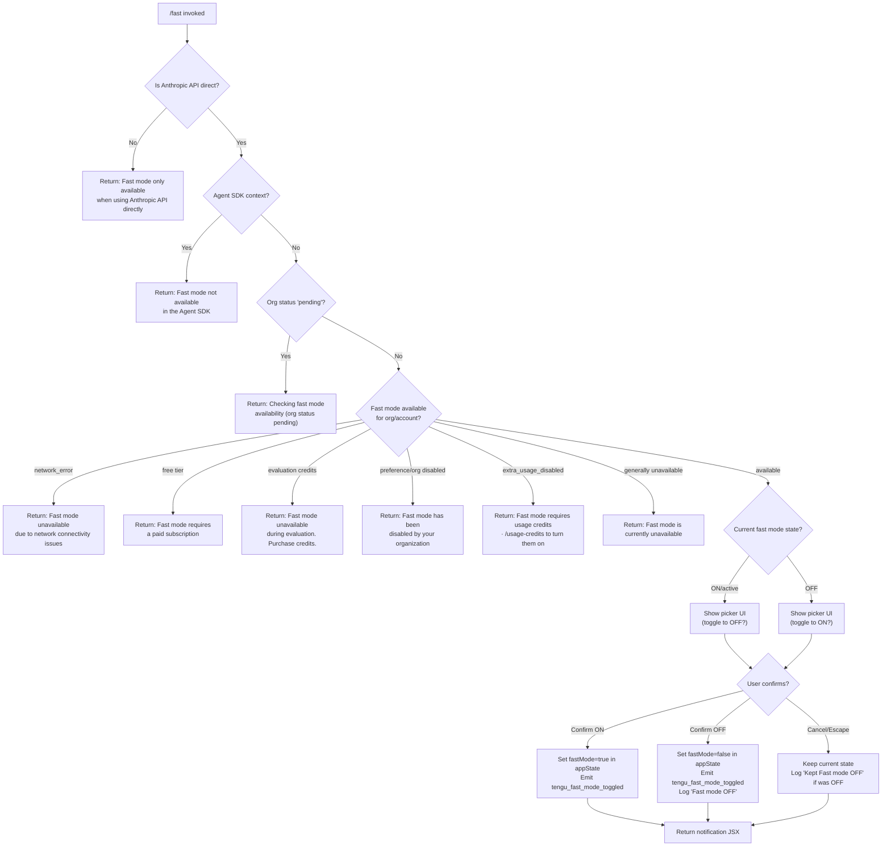

# `/fast`

> Analysis basis: CC v2.1.193 bundle.js (AST extraction + Claude interpretation)
> Minimum version: v2.1.193

---

## Overview

The `/fast` command toggles "Fast mode" (a research preview feature) on or off for the current Claude Code session. When invoked, it checks the user's eligibility (subscription tier, API provider, org policy, network connectivity, and Agent SDK context) before showing an interactive picker UI that lets the user confirm or change the fast-mode setting. The command surfaces detailed availability messages when fast mode cannot be enabled and emits telemetry on every toggle action.

---

## Registration

| Field | Value |
|---|---|
| type | `local-jsx` |
| name | `fast` |
| description | `Toggle fast mode ( ... )` |
| argumentHint | `[on\|off]` |
| immediate | `null` |
| thinClientDispatch | `control-request` |
| isHidden | `null` |
| module_id | `Y9l` |
| load_inline | `true` |
| loc_byte | `12685817` |
| loc_byte_end | `12686089` |
| loc_line | `8599` |
| arbor_handler.name | `wMf` |
| arbor_handler.fqn | `claude-2.1.193::wMf` |
| arbor_handler.kind | `AsyncFunction` |
| arbor_handler.resolution_path | `module_id` |
| arbor_handler.n_hits | `3` |

Analysis basis: CC v2.1.193 bundle.js:+12685817

---

## Input Branching

The command has more than three distinct outcome branches (API provider check, subscription tier, org policy, Agent SDK, network error, pending state, limit exhaustion, overload, etc.), so a Mermaid flowchart is used.



Analysis basis: CC v2.1.193 bundle.js:+2273047, +2273115, +2273462, +2273532, +2272566, +2272698, +2272782, +2272879, +2272958, +12684942

---

## Behavioral Spec

### Handler Entry Point — `fastCommandHandler` (`wMf`)

The Arbor-resolved handler `wMf` is an `AsyncFunction` reached via `module_id` → `Y9l`.

```
async function fastCommandHandler(commandArgs, context):
    // 1. Prefetch / validate fast-mode availability
    fastModeStatus = await prefetchFastModeStatus(context)

    // 2. Check API provider constraint
    if not isAnthropicDirectApi(context):
        return errorMessage("Fast mode is only available when using the Anthropic API directly")

    // 3. Render the interactive fast-mode picker component
    pickerResult = await renderFastModePicker(fastModeStatus, commandArgs)

    // 4. Process picker result
    if pickerResult == "off":
        setFastMode(false, context)
    else:
        setFastMode(true, context)

    // 5. Emit telemetry
    emit("tengu_fast_mode_toggled", { newState: pickerResult })

    // 6. Return JSX notification element
    return buildNotificationJsx(pickerResult)
```

Analysis basis: CC v2.1.193 bundle.js:+12684827, +12684839, +12684841, +12684889, +12684961, +12685065, +12685126

---

### API Provider Eligibility Check — `apiProviderChecker` (`_r` / `at`)

Before the picker is shown, the current authentication provider is tested against an allow-list.

```
function isAnthropicDirectApi(context):
    provider = getAuthProvider(context)  // _r → at chain
    allowedProviders = ["bedrock", "foundry", "anthropicAws", "mantle", "vertex", "firstParty"]
    // Fast mode requires none of the above (i.e., must be plain Anthropic API)
    if provider in ["bedrock", "foundry", "anthropicAws", "mantle", "vertex"]:
        return false  // not direct Anthropic API
    return true
```

Analysis basis: CC v2.1.193 bundle.js:+2138551, +2138591, +2138641, +2138697, +2138751, +2138799, +2138808

---

### Fast-Mode Availability Resolver — `fastModeAvailabilityResolver` (`Uie`)

This function evaluates the full chain of eligibility conditions and returns an availability descriptor with a human-readable message.

```
function fastModeAvailabilityResolver(context):
    // Agent SDK guard
    if context.isAgentSDK:
        return { available: false,
                 message: "Fast mode is not available in the Agent SDK",
                 reason: "sdk" }

    // Org/account status
    orgStatus = fetchOrgFastModeStatus(context)

    match orgStatus:
        "pending":
            return { available: false,
                     message: "Checking fast mode availability",
                     reason: "pending" }
        "network_error":
            return { available: false,
                     message: "Fast mode unavailable due to network connectivity issues",
                     reason: "network_error" }
        "free":
            return { available: false,
                     message: "Fast mode requires a paid subscription",
                     reason: "free" }
        "evaluation":
            return { available: false,
                     message: "Fast mode unavailable during evaluation. Please purchase credits.",
                     reason: "evaluation" }
        "preference" | org_disabled:
            return { available: false,
                     message: "Fast mode has been disabled by your organization",
                     reason: "preference" }
        "extra_usage_disabled":
            return { available: false,
                     message: "Fast mode requires usage credits · /usage-credits to turn them on",
                     reason: "extra_usage_disabled" }
        "not_available":
            return { available: false,
                     message: "Fast mode is currently unavailable",
                     reason: "unavailable" }
        "available":
            return { available: true, reason: "ok" }
```

Analysis basis: CC v2.1.193 bundle.js:+2273015, +2273047, +2273115, +2273150, +2273462, +2273532, +2273605, +2273703, +2273787, +2272540, +2272566, +2272607, +2272698, +2272782, +2272879, +2272958

---

### Prefetch / In-Flight Deduplication — `prefetchFastModeStatus` (`iet`)

The implementation avoids redundant network requests via an in-flight promise cache. If a prefetch is already in progress it is reused.

```
async function prefetchFastModeStatus(context):
    // If a prefetch is already in flight, return the cached promise
    if inflight = getInflightPromise():
        log("Fast mode prefetch in progress, returning in-flight promise")
        return inflight

    // If fetched recently, skip
    if fetchedRecently():
        log("Skipping fast mode prefetch, fetched recently")
        return getCachedStatus()

    // Validate auth availability
    authResult = resolveAuth(context)
    if not authResult:
        log("No auth available")
        return { available: false, reason: "no_auth" }

    // Issue HTTP request (via Axios) to check fast mode eligibility
    try:
        response = await httpClient.get(fastModeEndpoint, { headers: buildHeaders(authResult) })
        result = parseResponse(response)
        storeResult(result, timestamp=Date.now())
        emit("L1r", result)  // internal event bus
        return result
    catch AxiosError as err:
        if err.status in [401, 403]:
            // OAuth recovery path
            handleOAuthError(err)
        emit("tengu_org_penguin_mode_fetch_failed", { error: err })
        return { available: false, reason: "network_error" }
```

Analysis basis: CC v2.1.193 bundle.js:+2277309, +2277331, +2277346, +2277396, +2277398, +2277471, +2277481, +2277500, +2277514, +2277618, +2277645, +2277815, +2277821, +2277849, +2277898, +2277914, +2278117, +2278361, +2278398, +2278448, +2278815

---

### Fast Mode Picker UI — `fastModePickerComponent` (`utr` / `ctr` / `ltr`)

The picker is a JSX React component rendered inline. It presents the current fast-mode state and lets the user toggle or confirm.

```
function FastModePickerComponent(props):
    // State
    [confirmed, setConfirmed] = useState(false)
    currentFastMode = useAppState("fastMode")

    // Key bindings
    onKey("escape")  → emit("cancel")
    onKey("tab")     → emit("toggle")
    onKey("enter")   → emit("confirm")

    // Build display
    label = " Fast mode (research preview)"
    stateLabel = currentFastMode ? "ON " : "OFF"

    if status == "overloaded":
        showWarning("Fast mode overloaded and is temporarily unavailable")
    if limitExceeded:
        showWarning("You've hit your fast limit · resets in <countdown>")

    // Documentation link
    docsUrl = "https://code.claude.com/docs/en/fast-mode"

    // Emit picker-shown telemetry
    emit("tengu_fast_mode_picker_shown")

    return renderLayout(label, stateLabel, keyHints, docsUrl)
```

Analysis basis: CC v2.1.193 bundle.js:+12681272, +12681283, +12681311, +12681323, +12681336, +12681362, +12681365, +12681378, +12681399, +12681482, +12681641, +12682775, +12682791, +12682813, +12682830, +12682851, +12682873, +12683102, +12683123, +12683148, +12683333, +12683349, +12683399, +12683440, +12683455, +12683798, +12683866, +12683872, +12684026, +12684039, +12684093, +12684122, +12684308, +12685067

---

### Flag / Setting Application — `applyFlagSettings` (`ltr` / `$Oe`)

When fast mode is confirmed on or off, a flag-settings writer normalises the typed value and persists it.

```
function applyFlagSettings(key, rawValue):
    // key = "fastMode" (bundle.js:+12680274)
    // Coerce rawValue to appropriate type
    coerced = coerceSettingValue(key, rawValue)
        // String values: passthrough
        // Number values: Number(rawValue)
        // Boolean values: Boolean(rawValue)
    writeSettingToConfig("flagSettings", key, coerced)
    emit("tengu_fast_mode_toggled")
```

Analysis basis: CC v2.1.193 bundle.js:+12680274, +12680842, +12680929, +12681200, +12681211

---

### Cooldown Re-enable Logic — `cooldownReenabler` (`w1r`)

After a fast-mode cooldown expires the handler re-enables it automatically.

```
function cooldownReenabler(context):
    timestamp = Date.now()
    if context.fastModeState == "cooldown" and cooldownExpired(timestamp):
        log("Fast mode cooldown expired, re-enabling fast mode")
        setFastModeState("active", context)
        emit("Q7s", { event: "cooldown_expired" })
```

Analysis basis: CC v2.1.193 bundle.js:+2274835, +2274847, +2274875, +2274888, +2274948

---

### Opus Deprecation Notice — `opusFastModeDeprecation` (`yNo` / `X7s`)

The command checks for an experiment flag `opus-fast-mode-deprecation` and surfaces an in-session deprecation notice when triggered.

```
function checkOpusFastModeDeprecation(context):
    flag = getExperimentFlag("opus-fast-mode-deprecation")
    if flag.enabled:
        showNotification({ type: "immediate", body: depreciationMessage })
```

Analysis basis: CC v2.1.193 bundle.js:+12680557, +12680592, +12680705, +12682238

---

## State & Side Effects

| Item | Detail |
|---|---|
| Telemetry — `tengu_fast_mode_toggled` | Fired on every confirmed toggle (on→off or off→on). Analysis basis: CC v2.1.193 bundle.js:+12681211 |
| Telemetry — `tengu_fast_mode_picker_shown` | Fired when the picker UI is rendered. Analysis basis: CC v2.1.193 bundle.js:+12685067 |
| Telemetry — `tengu_org_penguin_mode_fetch_failed` | Fired on HTTP error during availability prefetch. Analysis basis: CC v2.1.193 bundle.js:+2278817 |
| Telemetry — `tengu_penguins_off` | Fired when fast mode is administratively turned off at org level. Analysis basis: CC v2.1.193 bundle.js:+2273153 |
| Telemetry — `tengu_config_parse_error` | May fire if config read fails during setting persistence. Analysis basis: CC v2.1.193 bundle.js:+13977384 |
| Telemetry — `tengu_config_lock_contention` | May fire if config write lock is contended. Analysis basis: CC v2.1.193 bundle.js:+13973651 |
| Telemetry — `tengu_feature_ok` / `tengu_feature_bad` / `tengu_feature_sad` | Fired during network feature-flag evaluation. Analysis basis: CC v2.1.193 bundle.js:+1026754, +1026821, +1026902 |
| appState changes | `fastMode` boolean field in appState is set to `true` or `false` on confirm. Key literal: `"fastMode"` (bundle.js:+12680274) |
| Config write | `flagSettings.fastMode` is persisted to the user settings JSON file (`.claude/settings.json` or `settings.local.json`). Analysis basis: CC v2.1.193 bundle.js:+2273400, +1324237, +1324299 |
| Hook registration | Picker registers keyboard handlers for `escape` (cancel), `tab` (toggle), and `enter` (confirm). Analysis basis: CC v2.1.193 bundle.js:+12683333, +12683399, +12683440 |
| Sound | None observed in depth-2 traversal. |
| HTTP side effect | One outbound HTTPS request to check fast-mode eligibility; result is cached with `Date.now()` timestamp to avoid redundant calls. Analysis basis: CC v2.1.193 bundle.js:+2277618 |
| Event bus | Internal `L1r.emit` fires after a successful prefetch result is received. Analysis basis: CC v2.1.193 bundle.js:+2278448 |

---

## Version History

| Version | Change |
|---|---|
| v2.1.193 | Initial analysis |

---

## Common Mistakes

1. **Running `/fast` on a non-Anthropic API provider (Bedrock, Vertex, Foundry, etc.)**: The command will immediately return an error — "Fast mode is only available when using the Anthropic API directly" — without showing the picker. Analysis basis: CC v2.1.193 bundle.js:+2273047
2. **Using `/fast` inside an Agent SDK session**: The Agent SDK context is detected and the command returns "Fast mode is not available in the Agent SDK" before any UI is shown. Analysis basis: CC v2.1.193 bundle.js:+2273462
3. **Expecting `/fast on` to work on a free-tier account**: Subscription status is checked; free-tier users see "Fast mode requires a paid subscription". Analysis basis: CC v2.1.193 bundle.js:+2272566
4. **Assuming immediate effect during pending org status**: If the organisation's status is still being resolved the command returns a "pending" message; the setting cannot be changed until the check completes. Analysis basis: CC v2.1.193 bundle.js:+2273593
5. **Not handling the extra_usage_disabled state**: Users who have usage credits disabled must first enable them via `/usage-credits` before `/fast on` will succeed. Analysis basis: CC v2.1.193 bundle.js:+2272753, +2272782

---

## Appendix — Identifier Mapping

> For bundle debugging only. Identifiers change across versions.

| Identifier | Role |
|---|---|
| `wMf` | Main handler for `/fast` command (AsyncFunction, Arbor-resolved) |
| `ic` | Internal config/state accessor utility |
| `_r` | Auth provider resolver |
| `at` | Provider type string normaliser |
| `Uie` | Fast-mode availability resolver (evaluates all eligibility conditions) |
| `it` | Experiment/feature-flag evaluator |
| `KPt` | Feature-flag key provider A |
| `zPt` | Feature-flag key provider B |
| `H5` | Feature-flag lookup helper |
| `h5` | Underlying flag store reader |
| `lCn` | GrowthBook experiment runner |
| `RGr` | Experiment event emitter |
| `UGr` | Experiment assignment executor |
| `kt` | Config persistence writer |
| `jt` | Config path resolver |
| `a9o` | Config directory helper |
| `bSt` | Config file write-with-lock implementation |
| `xjf` | Config file watcher/unwatch utility |
| `T` | Model string formatter / display helper |
| `qFc` | Model ID canonicaliser |
| `c7o` | Model ID prefix matcher |
| `ke` | JSON serialiser wrapper |
| `Lc` | Model display-name builder |
| `KXo` | Model alias map builder |
| `iYe` | Output writer (stdout) |
| `OXo` | Raw stream write helper |
| `XFc` | Transcript / conversation log writer |
| `P7e` | Batched write scheduler |
| `Ame` | Log file path assembler |
| `Cse` | Directory creation helper |
| `XXo` | Log file path resolver |
| `nhr` | Log file rotation handler |
| `YFc` | Log file append-with-rotation |
| `Ei` | `a7o` hook registrar |
| `wa` | Conversation context builder |
| `oxt` | Context filter helper |
| `qHs` | Context array filter |
| `VHs` | Context entry builder |
| `sxt` | Context object serialiser |
| `BIe` | Remote-settings entry builder |
| `yB` | Tool/context entry composer |
| `gie` | Tool entry helper |
| `txt` | Tool text-entry composer |
| `PFe` | Argument parser for command input |
| `Fa` | Argument string cleaner |
| `nM` | Argument type checker |
| `qo` | Model-string resolver |
| `to` | Inference-profile matcher |
| `Gge` | Context gateway handler |
| `yYu` | Gateway set manager |
| `P1r` | Permission/gateway array checker |
| `l` | Session data accessor |
| `C8l` | Session logger |
| `o` | Map-over-sessions utility |
| `s` | Async task tracker |
| `i` | Stream close helper |
| `Bge` | Provider inclusion checker |
| `a_n` | Compound argument resolver |
| `IRt` | Model-ID prefix normaliser |
| `EYs` | Environment variable enumerator |
| `_n` | Policy settings reader |
| `sun` | Policy settings sub-reader |
| `PZe` | Policy entry accessor |
| `kr` | Settings key-value reader |
| `yYs` | Argument index finder |
| `EYu` | Extended model resolver |
| `HYs` | Model string index helper |
| `SYu` | Special model prefix matcher |
| `_Ys` | Model prefix test |
| `MFe` | Fast-mode state accessor |
| `$b` | Fast-mode subscription-status reader |
| `qge` | Subscription state getter |
| `zge` | Pro-tier checker |
| `So` | Subscription state dispatcher |
| `Ci` | Pro-plan eligibility checker |
| `As` | Conversation context assembler |
| `Y4` | Context composer |
| `OH` | Context origin helper |
| `K2` | Context key builder |
| `oH` | Extended context composer |
| `lC` | Context segment builder |
| `fA` | Feature-availability checker |
| `qu` | Feature-flag network fetcher |
| `FNe` | Feature-flag response parser |
| `Fm` | Fast-mode config field accessor |
| `z4` | Session-state accessor |
| `Tr` | Environment identifier |
| `w7e` | VS Code environment detector |
| `n_n` | Config value normaliser |
| `sYu` | Auth-type display formatter |
| `iet` | Prefetch / in-flight deduplication handler |
| `x1r` | Prefetch initialiser |
| `Bi` | Telemetry traffic-type checker |
| `Rds` | Traffic-type resolver |
| `wv` | Auth resolution orchestrator |
| `aH` | Full auth resolver |
| `cd` | Config read helper |
| `IR` | Config entry resolver |
| `WDt` | Auth token type inspector |
| `MT` | Auth method selector |
| `Y0t` | File-descriptor token reader |
| `UA` | OAuth token resolver |
| `Ql` | Auth fallback reader |
| `l$` | Token slice extractor |
| `Lv` | API type array checker |
| `lYu` | Access-token header builder |
| `Rs` | OAuth endpoint resolver |
| `mss` | OAuth base URL selector |
| `leu` | OAuth staging URL helper |
| `p$` | In-flight request map manager |
| `Nmd` | HTTP request executor (fast-mode check) |
| `I$` | HTTP client factory |
| `tTt` | Request timeout setter |
| `V` | React rendering primitive |
| `we` | Feature OK emitter |
| `ont` | Feature availability timer |
| `Re` | Feature bad emitter |
| `yW` | File-descriptor OAuth reader |
| `Zl` | Hex-string parser |
| `eZ` | Response body extractor |
| `HTt` | HTTP response status handler |
| `xe` | Tool-call executor |
| `Omd` | Request retry handler |
| `Fhi` | Exponential back-off calculator |
| `Wg` | OAuth keychain recovery |
| `co` | Settings load orchestrator |
| `dg` | Tool/settings entry dispatcher |
| `GIe` | Settings file path builder |
| `Svr` | Settings multi-source loader |
| `vHs` | Settings source validator |
| `uW` | MCP/remote settings connector |
| `IHs` | Inline SDK settings reader |
| `hv` | CLAUDE.md file reader |
| `MZ` | CLAUDE.md content parser |
| `In` | Error annotation helper |
| `an` | Error code classifier |
| `wCr` | Settings cache writer |
| `B$e` | Settings entry executor |
| `run` | Settings resolution entry |
| `Qwt` | Atomic file writer |
| `Md` | Filesystem real-path resolver |
| `u` | Async daemon stop helper |
| `mJe` | File permission normaliser |
| `Ops` | Object property definer for file ops |
| `PH` | Cache clearer |
| `wgs` | Git-ignore aware file writer |
| `Pt` | Path normaliser |
| `uCr` | User config reader |
| `ucn` | Git-ignore checker |
| `fSu` | Home-directory path expander |
| `Cgs` | Git-ignore path builder |
| `vgs` | File write validator |
| `U4` | Settings path joiner |
| `mr` | Runtime identifier |
| `Rx` | Runtime ID constant |
| `vt` | Feature-sad emitter |
| `Oe` | Base event emitter |
| `dW` | Settings load-from-disk entry |
| `xx` | Disk-read initiator |
| `ia` | Memory-usage sampler |
| `Avr` | Settings load orchestrator (with telemetry) |
| `Pen` | Settings post-load processor |
| `mn` | Global config save orchestrator |
| `dXt` | Config save with lock |
| `uXs` | Config merge helper |
| `TSt` | Config type-schema validator |
| `p9o` | Config backup path builder |
| `v` | Config version accessor |
| `y` | Config field splitter |
| `I` | React memoisation sentinel manager |
| `m1e` | Config write initiator |
| `l9o` | Config entry enumerator |
| `cXt` | Config timestamp stamper |
| `lXt` | Config fallback writer |
| `Qor` | Config-write-with-fallback handler |
| `ctr` | Fast-mode picker React component (outer) |
| `ltr` | Fast-mode picker React component (inner/render) |
| `lve` | Picker animation helper |
| `$Oe` | Flag-settings value coercer |
| `UOe` | Theme/style picker helper |
| `A5` | Theme resolver |
| `C3e` | Theme variant extractor |
| `bvn` | Theme name validator |
| `S5` | Theme prefix stripper |
| `qRi` | Theme RGB resolver |
| `bc` | Legacy global config migrator |
| `oC` | Tool allow/deny list accessor |
| `tQe` | Tool config entry resolver |
| `Lo` | ANSI colour code renderer |
| `oLe` | Terminal colour name-to-chalk mapper |
| `F7` | Foreground colour finaliser |
| `f$` | Token count formatter |
| `lYs` | Number-to-fixed formatter |
| `aet` | Config accessor for fast-mode settings |
| `yNo` | Opus deprecation flag checker |
| `X7s` | Experiment date-range evaluator |
| `utr` | Fast-mode picker UI top-level component |
| `yt` | App-state store selector |
| `Gqr` | App-state context reader |
| `bi` | Key input handler hook |
| `kc` | Theme-context reader |
| `To` | Clock-context reader |
| `ws` | Clock hook |
| `ukd` | Key binding reducer |
| `a` | MCP server connector (used for context assembly) |
| `l6e` | MCP connection manager |
| `V3` | MCP client state machine |
| `BL` | MCP server event bus bridge |
| `Nn` | MCP message normaliser |
| `QBt` | MCP tool-list builder |
| `fba` | MCP tool executor |
| `aTn` | MCP tool-call transformer |
| `sTn` | MCP hex parser bridge |
| `sn` | MCP debug logger |
| `P1n` | MCP permission gate |
| `e3t` | MCP connect-with-auth handler |
| `hso` | MCP result parser |
| `m` | Background MCP worker manager |
| `jL` | MCP skill list emitter |
| `Zoo` | MCP settings includes checker |
| `w` | MCP reconnect back-off timer |
| `iu` | MCP error logger |
| `be` | String coercion helper |
| `_ba` | MCP internal state reader |
| `Uct` | MCP timeout parser |
| `jNn` | MCP port parser |
| `Bcr` | MCP connection result applier |
| `a6e` | MCP health checker |
| `oT` | MCP slot cleanup helper |
| `mSa` | MCP server launcher |
| `sio` | MCP stdio transport |
| `VWo` | MCP multi-server orchestrator |
| `E1n` | MCP server allow-list checker |
| `Un` | Abort-signal timeout wrapper |
| `s6e` | MCP server health emitter |
| `B$i` | Ink component folder |
| `j1t` | Ink layout helper |
| `w1r` | Fast-mode cooldown re-enable watcher |
| `Ve` | React element factory (Zze) |
| `Zze` | Base React element constructor |
| `c` | Async context accessor |
| `yn` | Daemon session type accessor |
| `Uo` | Global key handler registrar |
| `bS` | MCP state context hook |
| `ji` | Countdown timer formatter |

---

Note: index built via Arbor fallback; some signals (telemetry, literals) may be missing — see arbor-fallback.js.