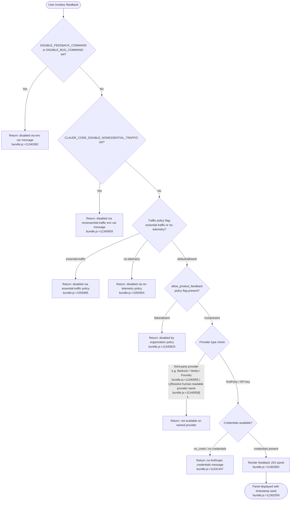

# `/feedback`

> Analysis basis: CC v2.1.193 bundle.js (AST extraction + Claude interpretation)
> Minimum version: v2.1.193

---

## Overview

The `/feedback` command (also accessible as `/share` and `/bug`) opens an interactive UI panel that allows the user to submit feedback, report a bug, or share their current conversation with Anthropic. Before presenting the UI, the handler performs a multi-stage eligibility check — inspecting environment variables, traffic policy flags, provider type, and credential availability — and surfaces a descriptive disabled message if any gate blocks submission.

---

## Registration

| Field | Value |
|---|---|
| type | `local-jsx` |
| name | `feedback` |
| description | Submit feedback, report a bug, or share your conversation |
| argumentHint | `[report]` |
| aliases | `share`, `bug` |
| module_id | `PTl` |
| load_inline | `true` |
| loc_byte | `11363179` |
| loc_byte_end | `11363402` |
| loc_line | `7151` |
| arbor_handler.name | `Eff` |
| arbor_handler.fqn | `claude-2.1.193::Eff` |
| arbor_handler.kind | `AsyncFunction` |
| arbor_handler.resolution_path | `module_id` |
| arbor_handler.n_hits | `0` |

Analysis basis: CC v2.1.193 bundle.js:+11363179

---

## Input Branching

There are more than three distinct outcome paths (command disabled via env var, disabled via traffic policy, disabled via org policy, provider is third-party, no credentials, and the happy path that renders the JSX panel), so a Mermaid flowchart is used.



---

## Behavioral Spec

### Top-level handler (`Eff`)

`Eff` is the async entry point resolved by Arbor via the `module_id` path (`PTl → Eff`). It invokes the JSX component factory (`DTl`) after all eligibility checks pass.

Analysis basis: CC v2.1.193 bundle.js:+11363010

```
async function feedbackHandler(context):
    eligibilityResult = checkEligibility(context)
    if eligibilityResult.disabled:
        return renderDisabledMessage(eligibilityResult.reason)

    timestamp = generateTimestamp()          // MTl — uses Date.now()
    panel     = buildFeedbackJSX(timestamp)  // OTl.jsx
    return panel
```

Analysis basis: CC v2.1.193 bundle.js:+11362802

---

### Eligibility gate (`wVe`)

`wVe` is the primary eligibility checker. It gates the command through four sequential checks before allowing the UI to render.

Analysis basis: CC v2.1.193 bundle.js:+11362722

```
function checkEligibility(context):

    // Gate 1 — explicit environment-variable disablement
    if envVar("DISABLE_FEEDBACK_COMMAND") is set:
        return disabled("/feedback has been disabled via the DISABLE_FEEDBACK_COMMAND ...")
    if envVar("DISABLE_BUG_COMMAND") is set:
        return disabled("/feedback has been disabled via the DISABLE_BUG_COMMAND ...")

    // Gate 2 — nonessential-traffic env var
    if envVar("CLAUDE_CODE_DISABLE_NONESSENTIAL_TRAFFIC") is set:
        return disabled("/feedback has been disabled via the CLAUDE_CODE_DISABLE_NONESSENTIAL_TRAFFIC ...")

    // Gate 3 — traffic / telemetry policy flags  (Bi → Rds → at)
    policy = resolveTrafficPolicy()          // Bi / Rds
    if policy == "essential-traffic":
        return disabled("... essential-traffic ...")
    if policy == "no-telemetry":
        return disabled("... no-telemetry ...")
    // policy "default" falls through

    // Gate 4 — org-level product-feedback flag  (Fs → allow_product_feedback)
    if not orgPolicy("allow_product_feedback"):
        return disabled("/feedback has been disabled by your organization's policy")

    // Gate 5 — provider classification  (zW → So/E7)
    providerKind = classifyProvider()        // zW
    if providerKind is third-party:
        providerLabel = resolveProviderLabel(providerKind)
        return disabled("Not available when using " + providerLabel)

    // Gate 6 — credential presence  (zW → wv → aH)
    creds = resolveCredentials()             // wv / aH
    if creds == "no_creds":
        return disabled("no Anthropic credentials")

    return eligible()
```

Analysis basis: CC v2.1.193 bundle.js:+11340382, +11340541, +11340659, +1055895, +1055954, +3362286, +11340823, +11341430

---

### Traffic policy resolver (`Bi` → `Rds` → `at`)

Reads the current traffic policy from app state and normalises it to one of: `"essential-traffic"`, `"no-telemetry"`, or `"default"`.

Analysis basis: CC v2.1.193 bundle.js:+11340624, +1056059, +1055972

```
function resolveTrafficPolicy():
    raw = appState.trafficPolicy          // at — String coercion
    if raw == "essential-traffic": return "essential-traffic"
    if raw == "no-telemetry":      return "no-telemetry"
    return "default"
```

---

### Org-policy check (`Fs` → `allow_product_feedback`)

`Fs` inspects the feature-flag set (two checked sets: `WSd` and `VSd`) and also checks whether the current auth model is one that can carry the `allow_product_feedback` flag. It additionally confirms that the product-feedback flag is affirmatively present.

Analysis basis: CC v2.1.193 bundle.js:+11340764, +3362214, +3362230, +3362262, +3362286

```
function checkOrgPolicy():
    if flagSet_WSd.has(currentContext): return false   // set membership check
    if flagSet_VSd.has(currentContext): return false
    return featureFlags.includes("allow_product_feedback")
```

---

### Provider classification (`zW` → `So` / `E7`)

Determines whether the active backend is a first-party Anthropic endpoint or one of several known third-party providers. The provider label strings used in the disabled message are resolved from the `bundle` / `provider` keys.

Analysis basis: CC v2.1.193 bundle.js:+11341392, +11340923, +11340938

| Internal key | Human-readable label |
|---|---|
| `bedrock` | Amazon Bedrock |
| `vertex` | Vertex AI |
| `foundry` | Microsoft Foundry |
| `anthropicAws` | Claude Platform on AWS |
| `mantle` | Amazon Bedrock (Mantle) |
| `gateway` | an API gateway |
| `third_party` (generic) | (maps to `third_party_provider`) |

Analysis basis: CC v2.1.193 bundle.js:+11340955, +11341030, +11341101, +11341185, +11341268, +11341353

```
function classifyProvider():
    kind = resolveProviderKind()     // So / Dy — checks ANTHROPIC_API_KEY, apiKeyHelper, OAuth
    if kind in [bedrock, vertex, foundry, anthropicAws, mantle, gateway]:
        return third_party(kind)
    return firstParty
```

---

### Credential resolver (`wv` → `aH`)

Validates that at least one Anthropic credential type is available. The credential check tries, in order: `ANTHROPIC_API_KEY`, `ANTHROPIC_AUTH_TOKEN`, `CLAUDE_CODE_OAUTH_TOKEN`, and WIF environment variables (`ANTHROPIC_FEDERATION_RULE_ID` + `ANTHROPIC_ORGANIZATION_ID`). If none are available the handler returns the `"no_creds"` sentinel.

Analysis basis: CC v2.1.193 bundle.js:+3103089, +3065500, +3066114, +11341430

```
function resolveCredentials():
    if apiKey available:     return { kind: "x-api-key", value: apiKey }
    if oauthToken available: return { kind: "oauth",     value: token  }
    if wifEnvVars available: return { kind: "wif",       value: ...    }
    return "no_creds"
```

---

### JSX panel factory (`DTl` / `OTl.jsx`)

When all gates pass, `Eff` calls `DTl`, which:
1. Generates a timestamp seed via `MTl` (uses `Date.now()`; timeout constant: **30 000 ms** — Analysis basis: CC v2.1.193 bundle.js:+11362578).
2. Invokes a random-delay helper `e` (`Math.random` + `setTimeout`, backoff factor `2`, Analysis basis: CC v2.1.193 bundle.js:+14343447).
3. Renders `OTl.jsx` — the React component for the feedback panel — with visibility set to `"public"` (Analysis basis: CC v2.1.193 bundle.js:+11362985).

```
function buildFeedbackPanel(context):
    seed      = Date.now()                  // MTl
    jitter    = randomDelay(base=2)         // e — Math.random + setTimeout(_, 30000)
    component = OTl.jsx({
        seed:       seed,
        visibility: "public",
        postMode:   "post",
    })
    return component
```

Analysis basis: CC v2.1.193 bundle.js:+11362802, +11362559, +11362985, +11341487

---

## State & Side Effects

| Item | Detail |
|---|---|
| Telemetry | No `tengu_*` events detected in depth-2 traversal for this command |
| Environment variables read | `DISABLE_FEEDBACK_COMMAND`, `DISABLE_BUG_COMMAND`, `CLAUDE_CODE_DISABLE_NONESSENTIAL_TRAFFIC`, `ANTHROPIC_API_KEY`, `ANTHROPIC_AUTH_TOKEN`, `CLAUDE_CODE_OAUTH_TOKEN`, `ANTHROPIC_FEDERATION_RULE_ID`, `ANTHROPIC_ORGANIZATION_ID` |
| Feature flags checked | `allow_product_feedback` (via flag sets `WSd`, `VSd`) |
| Traffic policy read | App state: `"essential-traffic"`, `"no-telemetry"`, `"default"` |
| Org policy read | `allow_product_feedback` flag (bundle.js:+3362286) |
| Network | Submits feedback payload via HTTP `POST` when user confirms in panel (bundle.js:+11341487) |
| Timer | 30 000 ms timeout associated with panel session (bundle.js:+11362578) |
| JSX rendered | Feedback panel (`OTl.jsx`) with `visibility: "public"` (bundle.js:+11362985) |
| appState changes | None detected at depth-2; read-only access to traffic policy and feature flags |
| Sound | None detected |
| Process exit | Reachable via `Is → process.exit` on CLI error path (bundle.js:+13300667); not part of normal flow |

---

## Version History

| Version | Change |
|---|---|
| v2.1.193 | Initial analysis |

---

## Common Mistakes

1. **Invoking `/bug` or `/share` expecting different behavior** — both are aliases for `/feedback` and share identical eligibility gates and UI.
2. **Expecting feedback to work on third-party providers** — the command is explicitly disabled on Amazon Bedrock, Vertex AI, Microsoft Foundry, Claude Platform on AWS, Amazon Bedrock (Mantle), and custom API gateways; a provider-specific message is shown instead.
3. **Setting `DISABLE_FEEDBACK_COMMAND` but not `DISABLE_BUG_COMMAND`** — the two environment variables are checked independently; both must be set to suppress all aliases if that is the intent.
4. **Assuming org policy is the only gate** — the `allow_product_feedback` check is Gate 4 of 6; environment variables and traffic policy flags are evaluated first and will short-circuit before the org-policy check is reached.
5. **Expecting telemetry on feedback submission** — no `tengu_*` events were found in the depth-2 traversal for this command; feedback submission appears to use a direct HTTP POST rather than the standard telemetry pipeline.

---

## Appendix — Identifier Mapping

> For bundle debugging only. Identifiers change across versions.

| Identifier | Role |
|---|---|
| `DTl` | JSX panel factory — builds and returns the feedback React component |
| `wVe` | Eligibility checker — multi-gate guard function |
| `Bi` | Traffic policy reader — reads policy from app state |
| `Rds` | Policy string normaliser — intermediate normalisation step |
| `at` | String coercion / primitive accessor utility |
| `Fs` | Org-policy and feature-flag checker |
| `XLi` | Feature-flag set initialiser |
| `y5` | Feature-flag entry builder |
| `D$` | Auth-type classifier (firstParty / third_party_provider / custom_base_url / etc.) |
| `nOt` | Auth-type detail resolver |
| `Whe` | App state accessor (used in policy checks) |
| `r` | CLI process / runtime context object |
| `Is` | CLI error handler (calls `process.exit`) |
| `_r` | Provider string resolver / backend kind reader |
| `zW` | Provider classification and credential dispatch coordinator |
| `E7` | Third-party provider type classifier |
| `Ql` | Provider kind normaliser |
| `So` | Provider auth-model resolver |
| `Dy` | Core credential resolver (API key / OAuth / WIF) |
| `wB` | Array membership utility |
| `wv` | OAuth / cloud-gateway credential resolver |
| `aH` | Full credential chain resolver (API key → OAuth → WIF → error) |
| `e` | Random jitter / setTimeout delay helper |
| `MTl` | Timestamp seed generator (Date.now wrapper) |
| `Eff` | Top-level async handler for `/feedback` (Arbor-resolved entry point) |

---

Note: index built via Arbor fallback; some signals (telemetry, literals) may be missing — see arbor-fallback.js.