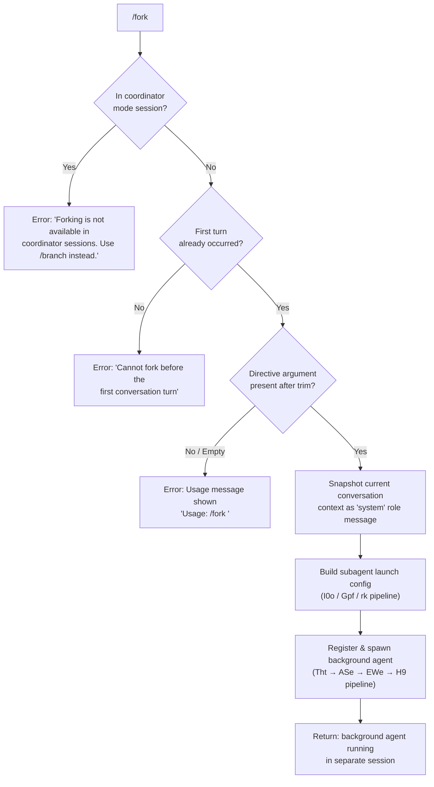

# `/fork`

> Analysis basis: CC v2.1.193 bundle.js (AST extraction + Claude interpretation)
> Minimum version: v2.1.193

---

## Overview

`/fork` spawns a background agent that inherits a complete snapshot of the current conversation context and then executes an independent directive in parallel. It is unavailable inside coordinator-mode sessions (where `/branch` should be used instead) and cannot be invoked before the first conversation turn has occurred.

---

## Registration

| Field | Value |
|---|---|
| type | `local-jsx` |
| name | `fork` |
| description | Spawn a background agent that inherits the full conversation |
| argumentHint | `<directive>` |
| module_id | `Q4l` |
| load_inline | `true` |
| loc_byte | `12742557` |
| loc_byte_end | `12742760` |
| loc_line | `8697` |
| arbor_handler.name | `rDf` |
| arbor_handler.fqn | `claude-2.1.193::rDf` |
| arbor_handler.kind | `AsyncFunction` |
| arbor_handler.resolution_path | `module_id` |
| arbor_handler.n_hits | `0` |

Analysis basis: CC v2.1.193 bundle.js:+12742557

---

## Input Branching

The command has four distinct outcomes based on session state and argument presence, requiring a flowchart.



Analysis basis: CC v2.1.193 bundle.js:+12742116 (trim check), +12742140 (usage literal), +12742254 (coordinator guard), +12742327 (first-turn guard)

---

## Behavioral Spec

### 1. Entry Point — Handler `rDf`

```
async function forkCommandHandler(rawInput, appContext):
    directive = rawInput.trim()                        // +12742116
    if directive is empty:
        display "Usage: /fork <directive>"             // +12742140
        return

    if session is coordinator mode:
        display "Forking is not available in coordinator sessions. Use /branch instead."  // +12742254
        return

    if no conversation turns yet:
        display "Cannot fork before the first conversation turn"  // +12742327
        return

    contextSnapshot = buildContextSnapshot(appContext) // calls I0o
    subagentConfig  = buildSubagentConfig(contextSnapshot, directive)  // calls Gpf → rk
    spawn background agent with subagentConfig         // calls Tht
```

Analysis basis: CC v2.1.193 bundle.js:+12742116–+12742249

### 2. Context Snapshot Builder (`I0o`)

```
function buildContextSnapshot(appContext):
    conversationHistory = appContext.getReplContexts()  // +11322825
    trimmedHistory      = trimHistorySlice(conversationHistory,
                              maxItems=50, offset=49)   // +11323001, +11323014
    sessionId           = generateSessionId()            // wD → ken.randomBytes +27986
    timestamp           = Date.now()                    // +11323058
    role                = "system"                      // +12742180
    contextLabel        = "fork"                        // +11322785
    forkMode            = "resume"                      // +11322904

    if directive is missing / blank:
        emit telemetry "subagent_fork_prompt_missing"   // literal +11322736

    return {
        history: trimmedHistory,
        sessionId,
        timestamp,
        role,
        contextLabel,
        forkMode,
        ...subagentLaunchParams(appContext)             // Re, hI, Yw, sa
    }
```

Analysis basis: CC v2.1.193 bundle.js:+11322579–+11323896

### 3. Subagent Launch Parameters Builder (`Gpf` → `Ur`)

```
function buildSubagentLaunchParams(appContext):
    state = appContext.getAppState()                    // +11324416
    conversationTail = state.messages.findLast(...)    // Ur +10994492

    config = {
        working_directory:  state.workingDirectory,    // literal +10994517
        allowed_tools:      state.allowedTools,        // literal +10994572
        disallowed_tools:   state.disallowedTools,     // literal +10994627
        avoid_prompts:      state.avoidPrompts,        // literal +10994688
        permission_mode:    state.permissionMode,      // literal +10994790
        bypassPermissions:  state.bypassPermissions,   // literal +10994821
        session:            state.session,             // literal +10995120
        effort:             state.effort,              // literal +10995145
        model:              state.model,               // literal +10995158
        max_thinking_tokens:state.maxThinkingTokens,   // literal +10995170
        flag_settings:      state.flagSettings,        // literal +10995196
    }

    // Build the full agent prompt package via rk (system prompt builder)
    agentPrompt = buildAgentSystemPrompt(config, appContext)   // rk pipeline
    return { config, agentPrompt }
```

Analysis basis: CC v2.1.193 bundle.js:+11324416–+11324631

### 4. System Prompt Construction (`rk` pipeline)

The `rk` function assembles the sub-agent's full system prompt by composing many independent sections. Key sub-components (depth-2 calls from `rk`):

| Sub-function | Role |
|---|---|
| `IOt` | Memory/CLAUDE.md injection (`memory_load_prompt`) |
| `r5f` / `n5f` | Environment info (static + simple variants) |
| `s5f` | Working-directory / worktree description |
| `s8n` | Context-management section (brief mode check) |
| `a5f` | Brief-mode flag query (`RBo.isBriefEnabled`) |
| `u5f` | Flag settings (`flagSettings`, `focus`) |
| `z4f` | Tool-parameter JSON section; schedule/routines processing |
| `NBo` | Model-specific note (e.g., `claude-opus-4-7` off/additive/compact) |
| `IOt` | Reads memory directories (team, user, rw, ro) |
| `dJl` | Background-session label injection (`bg-session`) |
| `k4f` | Output-style guidance strings |
| `W4f` | Verified-vs-assumed directive section |
| `J4f` | Core identity/role paragraph |
| `Tcl` | Plugin/MCP context computation |

Analysis basis: CC v2.1.193 bundle.js:+13693374–+13694760

### 5. Agent Spawn Pipeline (`Tht` → `ASe` → `EWe` → `H9`)

```
async function spawnBackgroundAgent(agentConfig):
    // Phase A: filesystem setup (ASe / zft)
    ensure subagent directory exists        // nBo → koe.mkdir  +13540112
    create conversation symlink             // koe.symlink      +13542593
    open transcript file                    // zft → koe.open   +13542417

    // Phase B: agent process startup (NL, RP, Tl)
    set up AbortController                  // nJi → bVd.register +5230546
    register process in subagent registry   // Xrr → zYl.add    +13540219

    // Phase C: main agent loop (EWe)
    agentMode  = "background"               // literal +9097686
    timeout    = 600000  ms (10 min)        // literal +9097837
    stateLabel = "responding" → "unknown"  // literals +9097928, +9098212

    loop:
        streamResponse = callModel(agentConfig)      // Flf → p.callModel +10938880
        processStreamEvents(streamResponse)           // yEo, SEo, r7a
        if stall watchdog fires:
            emit tengu_async_agent_stall_timeout      // +9098911
            terminate with "watchdog_stall"           // literal +9098492
        if subagent completes:
            emit telemetry "subagent_complete"        // literal +9099151
            break

    // Phase D: cleanup
    cleanup transcript handles
    unregister from subagent registry      // Xrr → zYl.delete +13540244
```

Analysis basis: CC v2.1.193 bundle.js:+10654196–+10654608 (Tht), +13542540–+13542820 (ASe), +9097664–+9103356 (EWe)

### 6. Context-Reference File (`fork-context-ref`)

A named file reference tagged `"fork-context-ref"` is written to a per-fork subdirectory under the subagents storage path. The file uses `.meta.json` / `.jsonl` suffixes and carries `agent_metadata`. This enables the parent session to locate the fork's transcript.

```
function writeForkContextRef(sessionId, conversationSnapshot):
    dirPath  = path.join(subagentsDir, sessionId)
    metaFile = dirPath + ".meta.json"               // literal +13436883
    dataFile = dirPath + ".jsonl"                   // literal +13437039
    write agentMetadata including "fork-context-ref" tag  // literal +13455755
    write "agent_metadata" key                      // literal +13437074
```

Analysis basis: CC v2.1.193 bundle.js:+13455755, +13436927–+13437049

### 7. Coordinator-Mode Guard (`jqe`)

During the session-list display and fork dispatch, the function `jqe` queries `RNo.isCoordinatorMode` (bundle.js:+12743539). If the session is a coordinator session, `/fork` is blocked and the user is directed to use `/branch` instead.

Analysis basis: CC v2.1.193 bundle.js:+12742254 (error literal), +12743539 (coordinator check)

---

## State & Side Effects

| Item | Detail |
|---|---|
| Telemetry — subagent launch | `subagent_launch` (literal +11322594), `subagent_fork_coordinator_mode` (+11322612), `subagent_fork_prompt_missing` (+11322736) |
| Telemetry — agent lifecycle | `subagent_complete` (+9099151), `subagent_stall_timeout` (+9099171), `subagent_completed` (+9095008), `subagent_end` (+9095308), `subagent_async_errored` (+9103180), `subagent_final_turn` (+10951902) |
| Telemetry — task tracking | `task_local_agent` (+10653975), `task_local_agent_failed` (+10653994), `task_progress` (+9089814) |
| Telemetry — agent stall | `tengu_async_agent_stall_timeout` (+9098911), `tengu_forked_agent_default_turns_exceeded` (+10993263) |
| Telemetry — misc | `tengu_agent_tool_completed` (+9094713), `tengu_auto_mode_decision` (+9096412), `tengu_agent_tool_terminated` (+9102583) |
| Filesystem | Creates `~/.claude/subagents/<sessionId>/` directory; writes `.meta.json` and `.jsonl` transcript files; creates symlink to conversation context |
| AbortController | Registers abort handler via `bVd.register`; signals on parent-kill (`parent_kill_async`), system-kill (`system_kill_async`), or user-kill (`user_kill_async`) |
| Subagent registry | Entry added to `zYl` set on start; removed in `.finally()` handler (+13540230, +13540244) |
| appState changes | None directly — the forked agent runs in its own isolated `appState` derived from a snapshot; the parent's state is read-only during fork setup |
| Background session label | Literal `"bg-session"` (+13694240) / `"bg"` (+13700788) injected into the sub-agent's system prompt |
| Sound | None observed in depth-2 traversal |
| Hook events fired | `SubagentStart` (+13576580), `SubagentStop` (+13618538) |

---

## Version History

| Version | Change |
|---|---|
| v2.1.193 | Initial analysis |

---

## Common Mistakes

1. **Running `/fork` in a coordinator session** — The command is blocked; use `/branch` instead. Coordinator sessions are detected via `RNo.isCoordinatorMode`.
2. **Omitting the directive argument** — `/fork` with no argument (or only whitespace) prints a usage message and does nothing. The directive is mandatory.
3. **Invoking before any conversation turn** — The guard at bundle.js:+12742327 rejects the call if no turns have occurred. Send at least one message first.
4. **Expecting synchronous output** — The forked agent runs as a background session (`"bg"` mode). Its output does not appear inline; it must be monitored through the background agent UI or transcript files.
5. **Confusing `/fork` with `/branch`** — `/branch` is the correct command for coordinator-mode sessions; `/fork` targets non-coordinator, interactive sessions only.
6. **Assuming unlimited runtime** — The background agent has a watchdog timeout of 600,000 ms (10 minutes). Tasks that exceed this threshold are terminated with `subagent_stall_timeout`.

---

## Appendix — Identifier Mapping

> For bundle debugging only. Identifiers change across versions.

| Identifier | Role |
|---|---|
| `rDf` | Main `/fork` command handler (AsyncFunction, arbor-resolved) |
| `I0o` | Context-snapshot builder; extracts conversation history and session params |
| `Gpf` | Subagent launch parameters assembler; reads appState fields |
| `Ur` | Conversation tail finder; locates last relevant message in history |
| `F7n` | Message filter helper (conversation history) |
| `B7n` | Message filter helper (conversation history) |
| `F$` | Permission-mode utility |
| `rk` | Full system-prompt constructor for the forked agent |
| `IOt` | Memory/CLAUDE.md content loader (`memory_load_prompt`) |
| `r5f` | Static environment info section builder |
| `n5f` | Simple environment info section builder |
| `s5f` | Working-directory / worktree description builder |
| `s8n` | Context-management / brief-mode section builder |
| `a5f` | Brief-mode enabled query wrapper |
| `u5f` | Flag-settings section builder |
| `z4f` | Tool-parameter JSON and schedule/routines section builder |
| `NBo` | Model-specific annotation (additive / compact / off mode) |
| `k4f` | Output-style guidance text selector |
| `W4f` | Verified-vs-assumed workflow section builder |
| `J4f` | Core identity/role paragraph composer |
| `Tcl` | Plugin/MCP context computation |
| `dJl` | Background-session label injector |
| `MBo` | Model builder helper (called from `rk`) |
| `Pt` | Prompt-cache segment helper |
| `Jxe` | Jailable-execution helper |
| `Kg` | Key getter utility |
| `to` | Tool-options resolver |
| `CYn` | Plugin/tool list formatter |
| `kr` | Key-range utility |
| `uwe` | Pewter-owl-tool lookup |
| `ix` | Index helper |
| `bbn` | Claude-fable model prefix checker (`claude-fable-`) |
| `vW` | Variable-width utility |
| `WLi` | Query-progress initialiser |
| `wee` | Whitespace/empty check utility |
| `it` | In-turn tool registry accessor |
| `d5f` | Delegated NBo wrapper |
| `GV` | Global-value accessor |
| `L0i` | Local-zero-index section builder |
| `dwe` | Dynamic-workspace entry builder |
| `G4f` | Generic section builder (growth-book variant) |
| `X4f` | Extra-context builder |
| `j4f` | JSON parameter section helper |
| `V4f` | Verbatim-context section builder |
| `q4f` | Query-context helper |
| `Y4f` | Yet-another-context builder |
| `Z4f` | Zone-aware section builder |
| `U4f` | User-facing context trimmer |
| `$4f` | Dollar-format section builder |
| `B4f` | Brief-flag section builder |
| `F4f` | Flags-combined section helper |
| `Tht` | Top-level agent spawn orchestrator |
| `ASe` | Agent filesystem setup (mkdir, symlink, open) |
| `Xrr` | Registry add/delete around transcript session |
| `nBo` | Directory creation helper (`koe.mkdir`) |
| `Im` | Symlink path joiner (`eBo.join`) |
| `zft` | Transcript file opener (`koe.open`) |
| `NL` | Nested-loop / path-storage helper |
| `RP` | Runner process starter |
| `Tl` | Listener-max setter |
| `nJi` | AbortController registration |
| `jC` | Timestamp/path recorder |
| `EWe` | Background-agent main event loop |
| `H9` | Full session runner (subagent main body) |
| `Flf` | Model-call and streaming loop |
| `r7a` | Response processor (stream events) |
| `SEo` | Safety-classifier and handoff handler |
| `yEo` | Agent-output event emitter |
| `Qce` | UI state updater (spinner, mode) |
| `qC` | Hook executor (SubagentStart / SubagentStop) |
| `Ujt` | Session-start hook invoker |
| `Hd` | Hook definition resolver |
| `f0` | Streaming event field extractor |
| `Dn` | UUID / random-id generator |
| `wD` | Hex random-bytes ID generator |
| `Is` | Process-exit handler (cli_error, exit code 1) |
| `lKe` | Exit logging helper |
| `OT` | Exit signal emitter |
| `hI` | History items builder |
| `Yw` | Yet-another-writer utility |
| `sa` | State accessor |
| `Re` | Result encoder |
| `Oe` | Observed-event wrapper |
| `Zze` | Zero-zone encoder |
| `aG` | Agent-context builder (system prompt + memory) |
| `Cc` | Context collector |
| `lo` | Listener/observer setup |
| `th` | Thread context accessor |
| `Ve` | Value encoder |
| `Vqn` | Context-message normaliser |
| `LJp` | Left-join processor (Array.isArray path) |
| `xJp` | Extended-join processor |
| `wJp` | Wide-join processor |
| `yll` | YAML/list formatter |
| `RJp` | Right-join processor |
| `nTl` | Normalise-trim-line helper |
| `J4` | JSON-4 serialiser helper |
| `wD` | Random-bytes ID builder (hex) |
| `Nu` | Null-utility / no-op guard |
| `us` | Utility shim (Rx + Nu) |
| `Q4` | Query-4 store getter (`zx` / `X1r.getStore`) |
| `LW` | Local-worker runner (`DRt.run`) |
| `KH` | Key-handler (session keying) |
| `p` | Process-exit wrapper (`vT` + `process.exit`) |
| `u` | Daemon-stop handler |
| `KEe` | Keep-alive event emitter (turns, timestamps) |
| `Yl` | Yield-level accessor |
| `bw` | Backwrite helper (`Fre`) |
| `yWe` | Yield-wait event processor |
| `swo` | Stopwatch (Date.now) |
| `czn` | Context-zone normaliser |
| `TH` | Transcript-head flusher (`zrr`) |
| `Bmt` | Batch-metric tracker |
| `Mmt` | Metric-message tracker |
| `Qce` | Query-current-event handler |
| `qRe` | Queue-render emitter |
| `mut` | Mutation tracker |
| `Ijn` | In-journey notifier |
| `Tjn` | Turn-join normaliser |
| `Kl` | Keep-list filter |
| `Cjn` | Context-join normaliser |
| `wjn` | Wide-join normaliser |
| `gl` | Global-lookup cache |
| `r7a` | Response-7-async processor |
| `rEo` | Result-event observer |
| `f0` | Frame-zero event extractor |
| `G5p` | Group-5-path helper |
| `s7a` | Session-7-async state updater |
| `xjn` | Extended-join normaliser |
| `vjn` | Value-join normaliser |
| `J8e` | Job-8-event dispatcher |
| `U7a` | Update-7-async transcript updater |
| `rof` | Roll-off helper |
| `tjt` | Turn-join-tick handler |
| `AEo` | Async-event observer |
| `M6p` | Mode-6-progress helper |
| `D6p` | Delta-6-progress handler |
| `Umt` | Update-metric timer |
| `Ljn` | Log-join notifier |
| `Fre` | Frame-renderer |
| `m8e` | Metric-8-event handler |
| `Fmt` | Format-metric tracker |
| `yEo` | Yield-event observer |
| `nw` | Narrow-walk (findLast) |
| `tne` | Turn-next emitter |
| `R6p` | Result-6-path helper |
| `Gm` | Global-metric (`at`) |
| `HM` | Header-mode classifier |
| `Jc` | Journal-collector (event attributes emitter) |
| `QHe` | Query-header encoder |
| `br` | Branch renderer |
| `k6p` | Key-6-path guard |
| `$7a` | Dollar-7-async event finaliser |
| `Tr` | Trace recorder |
| `we` | Write-event emitter |
| `ye` | Yield-event stream handler |
| `Dc` | Dispatch-create (randomUUID) |
| `are` | Async-resume entry |
| `As` | Async-session state |
| `njt` | New-job-tick (randomUUID) |
| `SEo` | Safety-event observer |
| `k7a` | Key-7-async classifier |
| `ejt` | Event-job-tick handler |
| `$j` | Dollar-job helper |
| `No` | Null-observer |
| `F7a` | Frame-7-async classifier result writer |
| `be` | Base encoder (String) |
| `eOe` | Extended-observer-event (lstat, rm, readFile) |
| `yxl` | Yield-cross-link (unlink) |
| `vTt` | Value-type tracker |
| `zza` | Zero-zone async cleaner |
| `zEe` | Zone-event encoder |
| `$6p` | Dollar-6-path slice helper |
| `aea` | Async-entry-accessor (`pto.set`) |
| `Sye` | Sync-yield emitter |
| `oNn` | Observer-node normaliser |
| `AEa` | Async-event-accessor (`Vso`) |
| `SEa` | Sync-event-accessor (Math.abs) |
| `jcp` | Job-checkpoint pusher |
| `O_e` | Observer-extended (t.load / e.dump) |
| `dF` | Dump-file accessor |
| `kcn` | Key-context normaliser |
| `fe` | Front-end handler |
| `pq` | Page-query (`Lt` / `Kc`) |
| `Z` | Zone state machine (voice recording + UI) |
| `hre` | Hook-run-executor (main hook body) |
| `HEo` | Hook-event-observer (filter) |
| `_Eo` | Under-event-observer (add/has) |
| `hEo` | Hook-event-observer (push/split) |
| `Zv` | Zone-value (`S4`, `ul`, `at`, `it`) |
| `ug` | Update-get (TAu, Xk, IAu) |
| `Ev` | Event (split/join) |
| `sge` | Segment-get (`cW`) |
| `lc` | List-collector |
| `$C` | Dollar-context (`at`, `ffr`) |
| `O7a` | Observer-7-async (`it`) |
| `Ne` | Node-event (`$Pt`) |
| `$Pt` | Dollar-path-token (post hook) |
| `$8p` | Dollar-8-path (getSystemPrompt) |
| `Njt` | New-job-tick (t5f, dJl) |
| `B8p` | Branch-8-path (s8n, Cc) |
| `Ujt` | Update-job-tick (SubagentStart) |
| `Hd` | Hook-definition resolver |
| `qC` | Query-context (full hook executor) |
| `Tt` | Turn-tracker |
| `wJ` | Wide-join (uO, Pre) |
| `Pre` | Pre-filter (e.filter, D8t) |
| `jqe` | Job-queue-entry (coordinator-mode sort & check) |
| `KO` | Key-observer (Rx) |
| `Ue` | Update-entry (Ce.findLastIndex) |
| `Er` | Error-recorder |
| `utn` | Update-turn-number |
| `Qit` | Query-item tracker (`oYi`) |
| `ei` | Event-item (randomUUID, uuid, now) |
| `SS` | Session-state (Array.isArray, includes) |
| `_n` | Under-node (sun, yB) |
| `aHe` | Async-hook-entry (`sbd.has`) |
| `t7a` | Turn-7-async (Object.keys) |
| `Sc` | Scope-check (Rx) |
| `G8p` | Group-8-path (xgt, di) |
| `xgt` | Extended-get (GS) |
| `di` | Deep-index (indexOf, slice) |
| `WWe` | Wide-walk-event (GS, ReferenceError) |
| `GS` | Global-search (t.find, J7l) |
| `xu` | Cross-utility |
| `Mt` | Message-tracker (V, No, Lt, ZE.randomUUID) |
| `nn` | Node-normaliser (getPromptForCommand) |
| `axc` | Async-context (parseInt, Number.isFinite) |
| `dt` | Delta-tracker (V3, Object.keys) |
| `Zc` | Zone-clock (Math.round) |
| `Un` | Under-node (setTimeout, clearTimeout) |
| `Qt` | Query-tracker (run, clearAllTimers) |
| `w` | Wide handler (B7, Date.now, Math.min) |
| `tt` | Turn-type (V, Oe, Re) |
| `P8p` | Path-8-param (full session context builder) |
| `Kut` | Key-unit (_uo) |
| `lTe` | List-type-entry |
| `cc` | Context-collector (El, cd) |
| `El` | Entry-list (at, Ctn) |
| `W3` | Wide-3 (rT, SS, P5e) |
| `xst` | Extended-store (YHe, bwe) |
| `H6` | Header-6 (Object.entries, Dce, n.push) |
| `nt` | Node-type (V, Oe, br, Bm, Oee, No) |
| `Bm` | Batch-message (ph, Ve) |
| `Oee` | Observer-event-entry (ph, Ah) |
| `Ot` | Observer-type (Math.min, Ct.writeMessages) |
| `Ct` | Context-type (HTo) |
| `iSe` | In-session-entry (vP, xY, YDe, oxo) |
| `vP` | Value-path (x$t, T, _r, _u) |
| `xY` | Extended-yield (toLowerCase, zjd) |
| `YDe` | Yield-delta-entry (e.some, lc) |
| `oxo` | Observer-x-observer (deferred tools pool) |
| `ujn` | Update-join-normaliser (Jx, to) |
| `Jx` | Job-x (kt, iXt) |
| `n8n` | Node-8-normaliser (full session state init) |
| `b0e` | Branch-0-entry |
| `Q_a` | Query-async-accessor |
| `$7n` | Dollar-7-normaliser |
| `o8n` | Observer-8-normaliser (MCP tools, skills) |
| `Y2` | Yield-2 |
| `sqt` | Sequence-query-tracker (wrr) |
| `oqt` | Observer-query-tracker |
| `SJ` | Session-job (wrr, T) |
| `uce` | Update-context-entry (J7l) |
| `OK` | Observer-key |
| `GSl` | Global-session-list (rqt) |
| `MA` | Message-accessor (uhi, b4r, dhi) |
| `mE` | Message-entry (Rx) |
| `uQr` | Update-query-result (tool name mapper) |
| `lWe` | List-walk-entry (backoff: Math.pow, Math.max) |
| `DA` | Delta-accessor (qo, Fa, to) |
| `Z0` | Zone-0 |
| `Mx` | Max-entry (Rx) |
| `Hse` | Hash-session-entry |
| `dAo` | Delta-async-observer (Kc) |
| `Kc` | Key-context (Ei) |
| `Ide` | Index-delta-entry (Kc, _Ve) |
| `_Ve` | Under-value-entry (filter, Rrr, jrr, _9f) |
| `Cde` | Context-delta-entry (dYl, mkdir, writeFile) |
| `dYl` | Delta-yield-list (NL) |
| `ke` | Key-entry (JSON.stringify) |
| `wr` | Write-result (Rt, fn) |
| `Rt` | Result-type (full bridge connection handler) |
| `Pe` | Path-entry |
| `WEa` | Wide-event-accessor (tracing span: subagent.spawn) |
| `Bce` | Batch-context-entry |
| `AF` | Async-flag (yye.active) |
| `Y5e` | Yield-5-entry (x9e) |
| `$P` | Dollar-path |
| `vRe` | Value-result-entry (CRe.set, yye.enterWith) |
| `XN` | Extended-normaliser (Flf, Vzn) |
| `Vzn` | Value-zone-normaliser (CG cleanup) |
| `pWe` | Path-walk-entry (F5p.has) |
| `pAo` | Path-async-observer (streaming response processor) |
| `Zza` | Zone-zero-accessor (U5p.has) |
| `mSo` | Message-state-observer (fSo.clear) |
| `gSo` | Global-state-observer (fSo.get/set) |
| `eXt` | Extended-transport (Math.ceil) |
| `P4e` | Path-4-entry (Math.round) |
| `aGf` | Async-global-flag |
| `rn` | Result-normaliser (HTML parser) |
| `rc` | Result-collector (N8n.test) |
| `yd` | Yield-delta (mt.replace) |
| `Gl` | Global-list (M.popTag) |
| `Ia` | Index-accessor (M.inTableScope) |
| `hde` | Hash-delta-entry (BS, N5p) |
| `BS` | Batch-state |
| `N5p` | Node-5-path (e.find) |
| `zy` | Zone-yield (B6f, G6f, Dn) |
| `B6f` | Branch-6-frame (QYt) |
| `QYt` | Query-yield-tracker |
| `G6f` | Group-6-frame (Wzt, Dn) |
| `i8n` | Index-8-normaliser |
| `Rgt` | Result-getter (zy, Ure, Qht) |
| `Ure` | Update-result-entry (t.trim) |
| `Qht` | Query-hash-tracker (gl, Gde) |
| `LZa` | List-zone-accessor (Yl, Fre) |
| `Jza` | Job-zone-accessor (t.all) |
| `aSe` | Async-session-entry (qC, Hd, NL) |
| `oO` | Observer-observer (B$, S_, i4, J2) |
| `wXl` | Wide-cross-list (Object.values, sb, rUe) |
| `LXl` | List-cross-list (qI, e.map, rUe) |
| `jZi` | Job-zone-item (W8.delete, z4e) |
| `z4e` | Zone-4-entry (NZi, UZi, ke, WDn) |
| `zY` | Zone-yield-accessor (OZi) |
| `uAo` | Update-async-observer (rqt.delete) |
| `q5e` | Query-5-entry (nNn.delete, Vso.delete) |
| `VEa` | Value-event-accessor (CRe.get, z5e, wRe) |
| `z5e` | Zone-5-entry (e.setStatus) |
| `wRe` | Wide-result-entry (AF, yye.enterWith) |
| `lea` | List-entry-accessor (pto.delete) |
| `Qza` | Query-zone-accessor (jEe, M0e) |
| `lT` | List-type |
| `jEe` | Job-event-entry (t.update, TH) |
| `F$t` | Frame-dollar-tracker |
| `tke` | Turn-key-entry |

---

Note: index built via Arbor fallback; some signals (telemetry, literals) may be missing — see arbor-fallback.js.