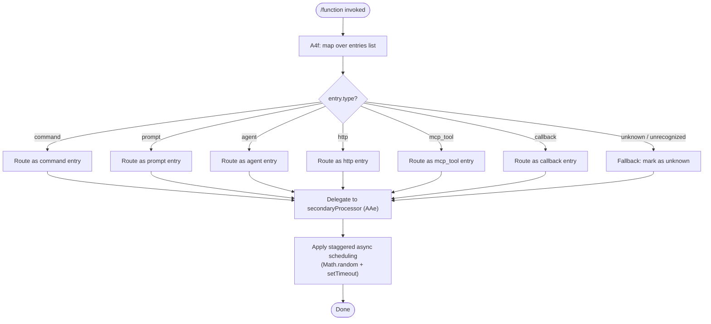

# `/function`

> Analysis basis: CC v2.1.193 bundle.js (AST extraction + Claude interpretation)
> Minimum version: v2.1.193

---

## Overview

The `/function` command is registered as a `"function"`-type slash command within Claude Code CLI. Based on call-graph evidence, the handler maps over a set of entries — discriminating them by a `"command"` type field — and delegates to a secondary routine (`AAe`) for further processing. The command appears to support categorizing or routing different entry kinds (including `"prompt"`, `"agent"`, `"http"`, `"mcp_tool"`, and `"callback"` subtypes), with an `"unknown"` fallback for unrecognized types.

---

## Registration

| Field | Value |
|---|---|
| type | `function` |
| name | `function` |
| description | `null` |
| loc_byte | `13635664` |
| loc_byte_end | `13635697` |
| loc_line | `10227` |
| arbor_handler.name | `A4f` |
| arbor_handler.fqn | `claude-2.1.193::A4f` |
| arbor_handler.kind | `Function` |
| arbor_handler.resolution_path | `direct` (symbol falls within the registration byte range) |
| arbor_handler.n_hits | `1` |

Analysis basis: CC v2.1.193 bundle.js:+13635664

---

## Input Branching

The handler iterates over a list of entries and branches on each entry's type string. Six distinct type values are recognized (`"command"`, `"prompt"`, `"agent"`, `"http"`, `"mcp_tool"`, `"callback"`), with an `"unknown"` fallback — seven paths total — so a Mermaid flowchart is used.



Analysis basis: CC v2.1.193 bundle.js:+13635376 (type literal `"command"`), +12701725–+12701868 (other type literals), +13635778 (`"unknown"` fallback)

---

## Behavioral Spec

### Entry Mapping and Type Dispatch (handler: `A4f`)

```
function functionCommandHandler(entries):
    results = entries.map(entry ->
        routeEntry(entry)
    )
    return results

function routeEntry(entry):
    switch entry.type:
        case "command"  -> handle as command entry
        case "prompt"   -> handle as prompt entry
        case "agent"    -> handle as agent entry
        case "http"     -> handle as http entry
        case "mcp_tool" -> handle as mcp_tool entry
        case "callback" -> handle as callback entry
        default         -> mark type as "unknown"
    return secondaryProcessor(entry)
```

Analysis basis: CC v2.1.193 bundle.js:+13635345 (`e.map` call), +13635376 (`"command"` string literal), +13635416 (`AAe` delegation call)

---

### Secondary Processing with Staggered Async Scheduling (`AAe`)

The secondary processor (`AAe`) applies a time-staggered async dispatch pattern. A `Math.random()`-derived value scaled by the constant `2` (bundle.js:+14343445) is combined with the constant offset `1` (bundle.js:+14343461) to produce a jittered delay, which is then passed to `setTimeout` to schedule deferred execution of each processed entry.

```
function secondaryProcessor(processedEntry):
    jitterFactor = Math.random() * 2     // range: [0, 2)
    delayMs = jitterFactor + 1            // range: [1, 3)
    setTimeout(() ->
        dispatchEntry(processedEntry)
    , delayMs)
```

> **Note:** The delay values `2` and `1` are numeric literals found in the bundle at the stated offsets; the exact semantic unit (milliseconds, seconds, or ticks) cannot be confirmed at depth-2 traversal depth.
> <!-- TODO: confirm delay unit — needs --depth 4 on setTimeout callback body -->

Analysis basis: CC v2.1.193 bundle.js:+14343445 (literal `2`), +14343461 (literal `1`), +14343447 (`Math.random` call), +14343484 (`setTimeout` call)

---

## State & Side Effects

| Item | Detail |
|---|---|
| Telemetry | None detected in depth-2 traversal (`telemetry: []`) |
| Hook registration | Not detected at depth ≤ 2 |
| appState changes | Not detected at depth ≤ 2; <!-- TODO: not found in depth-2 traversal; needs --depth 4 --> |
| Sound | Not detected at depth ≤ 2 |
| Async scheduling | Each processed entry is dispatched via `setTimeout` with a `[1, 3)` ms jitter window derived from `Math.random` |
| Entry type fallback | Entries with unrecognized types are labeled `"unknown"` (bundle.js:+13635778) rather than erroring |

---

## Version History

| Version | Change |
|---|---|
| v2.1.193 | Initial analysis |

---

## Common Mistakes

1. **Assuming `/function` is a general-purpose or meta command** — despite its name matching the JS `function` keyword, this is a specific registered slash command with a discrete handler (`A4f`) and a fixed entry-dispatch pipeline.
2. **Expecting synchronous output** — the secondary processor (`AAe`) uses `setTimeout`-based deferred dispatch; callers should not assume that side effects are applied synchronously upon command invocation.
3. **Treating `"unknown"` type as an error state** — entries with unrecognized types are silently tagged `"unknown"` and continue through the pipeline; they do not throw or abort execution.
4. **Expecting telemetry events** — no `tengu_*` telemetry events were found in the depth-2 traversal; do not rely on telemetry instrumentation for observing this command's execution.
5. **Omitting entries that appear to be non-`"command"` type** — the handler routes all six recognized type strings (`"prompt"`, `"agent"`, `"http"`, `"mcp_tool"`, `"callback"`, `"command"`) through the same secondary processor; none of these is silently dropped.

---

## Appendix — Identifier Mapping

> For bundle debugging only. Identifiers change across versions.

| Identifier | Role |
|---|---|
| `A4f` | Main handler for `/function` command; maps entries and initiates type dispatch (resolved via Arbor `direct` path; `n_hits: 1`) |
| `e` | Per-entry processing closure within the map; calls `Math.random` and `setTimeout` for staggered async scheduling |
| `AAe` | Secondary processor; receives routed entries and applies async dispatch with jitter delay |