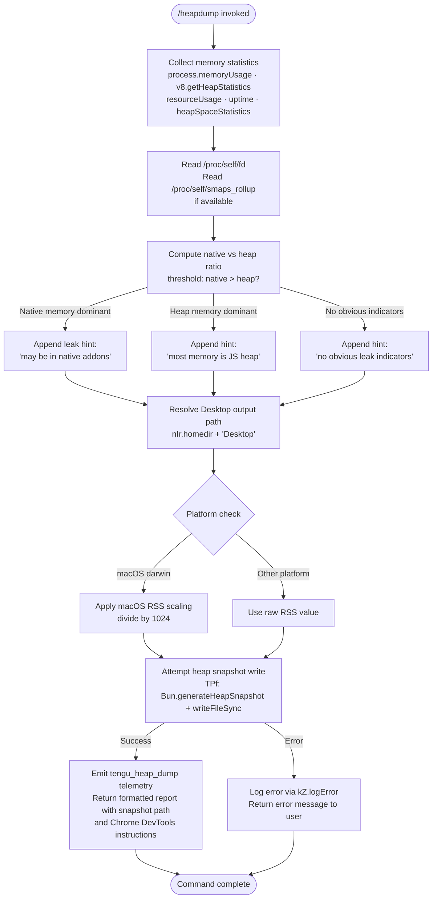

# `/heapdump`

> Analysis basis: CC v2.1.193 bundle.js (AST extraction + Claude interpretation)
> Minimum version: v2.1.193

---

## Overview

`/heapdump` is a hidden diagnostic command that captures a V8/Bun heap snapshot of the running Claude Code process, writes it to the user's Desktop directory, collects supplementary memory and process statistics, and returns a formatted diagnostic report with actionable guidance. It is intended for debugging memory leaks or unexpected memory growth in the Claude Code CLI process itself.

---

## Registration

| Field | Value |
|---|---|
| type | `local` |
| name | `heapdump` |
| description | `Dump the JS heap to ~/Desktop` |
| supportsNonInteractive | `true` |
| isHidden | `true` |
| module_id | `tGl` |
| load_inline | `true` |
| loc_byte | `12842014` |
| loc_byte_end | `12842442` |
| loc_line | `8819` |
| arbor_handler.name | `IPf` |
| arbor_handler.fqn | `claude-2.1.193::IPf` |
| arbor_handler.kind | `AsyncFunction` |
| arbor_handler.resolution_path | `module_id` |
| arbor_handler.n_hits | `0` |

Analysis basis: CC v2.1.193 bundle.js:+12842014

---

## Input Branching

The command takes no user-supplied arguments. Its internal logic branches on several runtime observations about memory composition, operating system platform, and heap dump success or failure. There are more than three distinct branches, so a Mermaid flowchart is used.



Analysis basis: CC v2.1.193 bundle.js:+12839545, +12837046, +12837289, +12838663, +12839089, +12840583, +12840135

---

## Behavioral Spec

### 1. Handler Entry Point (`heapDumpHandler`)

The Arbor-resolved handler is `IPf` (referred to below as `heapDumpHandler`).
Analysis basis: CC v2.1.193 bundle.js:+12840883

```
async function heapDumpHandler(context):
    diagnosticLines = []

    # Step 1: Collect memory statistics
    stats = collectMemoryStats()          # Z6l
    diagnosticLines.push(formatStats(stats))

    # Step 2: Resolve output path
    outputDir = resolveDesktopPath()      # Nps → nIr.homedir + "Desktop"

    # Step 3: Write heap snapshot file
    try:
        snapshotPath = writeHeapSnapshot(outputDir)  # TPf
        diagnosticLines.push(
            "Open the .heapsnapshot in Chrome DevTools → Memory → Load to inspect retainers."
        )
    catch error:
        logError(error)                   # xe → kZ.logError
        return formatErrorResult(error)

    # Step 4: Build and emit summary
    summary = buildSummaryReport(diagnosticLines, snapshotPath)  # CPf
    emitTelemetry("tengu_heap_dump")

    return formatTextResult(summary)      # type: "text"
```

Analysis basis: CC v2.1.193 bundle.js:+12841002, +12841029, +12841039, +12841151

---

### 2. Memory Statistics Collection (`collectMemoryStats`)

`Z6l` gathers a comprehensive snapshot of process memory from multiple sources.
Analysis basis: CC v2.1.193 bundle.js:+12837046

```
async function collectMemoryStats():
    result = {}

    result.memoryUsage     = process.memoryUsage()
    result.heapStats       = wtr.getHeapStatistics()       # v8 module alias
    result.resourceUsage   = process.resourceUsage()
    result.uptime          = process.uptime()
    result.heapSpaces      = wtr.getHeapSpaceStatistics()

    result.activeHandles   = process._getActiveHandles().length
    result.activeRequests  = process._getActiveRequests().length

    # Linux-only: read open file descriptor count
    try:
        fds = await _Et.readdir("/proc/self/fd")
        result.fdCount = fds.length
    catch:
        result.fdCount = null

    # Linux-only: read smaps_rollup for native memory
    try:
        smaps = await _Et.readFile("/proc/self/smaps_rollup", "utf8")
        result.smaps = parseSmaps(smaps)
    catch:
        result.smaps = null

    # Load bun:jsc module for JSC-specific stats (Bun runtime)
    jscModule = require("bun:jsc")
    result.jscStats = jscModule.memoryUsage?.() ?? null

    # Uptime formatted to 2 decimal places
    result.uptimeFormatted = result.uptime.toFixed(2)

    return result
```

Constants used:
- `/proc/self/fd` — open file descriptor directory (bundle.js:+12837289)
- `/proc/self/smaps_rollup` — Linux smaps file (bundle.js:+12837352)
- Encoding: `"utf8"` (bundle.js:+12837378)
- `"bun:jsc"` module identifier (bundle.js:+12837437)
- RSS ratio threshold: `100` (percentage, bundle.js:+12837730)
- Native memory block size: `1048576` bytes = 1 MiB (bundle.js:+12837583)
- FD / handle warning threshold: `3600` (bundle.js:+12837578)

---

### 3. Desktop Path Resolution (`resolveDesktopPath`)

`Nps` locates the user's Desktop directory in a cross-platform-aware manner.
Analysis basis: CC v2.1.193 bundle.js:+12839841

```
function resolveDesktopPath():
    home = nIr.homedir()                 # os.homedir()
    desktopPath = Mf.join(home, "Desktop")

    # WSL support: detect /mnt/c/Users Windows mount
    if path contains "/mnt/c/Users":
        # Skip system accounts: Public, Default, Default User, All Users
        # Use Windows Desktop path instead
        windowsDesktop = resolveWindowsDesktopFromMnt()
        return windowsDesktop

    return desktopPath
```

Literals used:
- `"Desktop"` — subfolder name (bundle.js:+1108269)
- `"/mnt/c/Users"` — WSL Windows mount prefix (bundle.js:+1108491)
- `"Public"`, `"Default"`, `"Default User"`, `"All Users"` — accounts to skip in WSL (bundle.js:+1108535, +1108554, +1108574, +1108599)

Analysis basis: CC v2.1.193 bundle.js:+1108223, +1108259

---

### 4. Heap Snapshot Writer (`writeHeapSnapshot`)

`TPf` is the function that actually generates and persists the snapshot file.
Analysis basis: CC v2.1.193 bundle.js:+12840084

```
function writeHeapSnapshot(outputDir):
    # Generate V8 heap snapshot via Bun API
    snapshot = Bun.generateHeapSnapshot("v8", "arraybuffer")
    # bundle.js:+12840583, "v8" at +12840608, "arraybuffer" at +12840613

    # Trigger GC to get accurate post-snapshot memory reading
    Bun.gc(/* synchronous */ true)
    # bundle.js:+12840640

    # Compose output filename with timestamp
    filename = composeSnapshotFilename()   # includes date/time

    # Write with mode 0o600 (owner read/write only)
    Q6l.writeFileSync(outputPath, snapshot, { mode: 384 })
    # 384 decimal = 0o600 octal; bundle.js:+12840028, +12840563

    return outputPath
```

File permission: mode `384` (decimal) = `0o600` (octal) — owner read/write only.
Analysis basis: CC v2.1.193 bundle.js:+12840028

---

### 5. Diagnostic Summary Builder (`buildSummaryReport`)

`CPf` formats the collected statistics into a human-readable report and attaches the heap-vs-native memory interpretation.
Analysis basis: CC v2.1.193 bundle.js:+12841002

```
function buildSummaryReport(diagnosticLines, snapshotPath):
    # Determine dominant memory type
    heapUsed   = stats.memoryUsage.heapUsed
    rss        = stats.memoryUsage.rss
    nativeEst  = Math.max(rss - heapUsed, 0)

    if nativeEst > heapUsed:
        interpretation = "— most memory is native (NOT in the .heapsnapshot)"
        # bundle.js:+12841386
    else:
        interpretation = "— most memory is JS heap (inspect the .heapsnapshot)"
        # bundle.js:+12841326

    if noObviousLeakIndicators:
        diagnosticLines.push("  (no obvious leak indicators)")
        # bundle.js:+12841523

    # Column width: 8 characters for numeric alignment
    # bundle.js:+12841658
    lines = diagnosticLines.join("\n")

    # Memory threshold: 1 GiB = 1073741824 bytes
    # bundle.js:+12841932
    if rss > 1073741824:
        lines += "\n[WARNING: RSS exceeds 1 GiB]"

    return lines + "\n\n" + interpretation
```

Diagnostic hint strings:
- `"Native memory > heap - leak may be in native addons (node-pty, sharp, etc.)"` (bundle.js:+12837816)
- `"No obvious leak indicators. Check heap snapshot for retained objects."` (bundle.js:+12838935)
- macOS platform string: `"macos"` / `"darwin"` (bundle.js:+12838670, +12839089)
- macOS RSS divisor: `1024` (bundle.js:+12838680)
- Column alignment width: `8` characters (bundle.js:+12841658)
- RSS warning threshold: `1073741824` bytes (1 GiB) (bundle.js:+12841932)

---

### 6. Output Formatter (`formatOutputResult`)

`KNo` assembles the final result handed back to the slash-command dispatcher.
Analysis basis: CC v2.1.193 bundle.js:+12839545

```
function formatOutputResult(summary, snapshotPath):
    # Log verbosity level: "manual" with priority 0
    # bundle.js:+12839521, +12839532

    result = {
        type: "text",                  # bundle.js:+12840915
        content: summary,
        snapshotPath: snapshotPath
    }

    # Dispatch to terminal renderer via T (logMessage) with level 3
    # bundle.js:+12839601, +12839604

    return result
```

Log level: `3` (debug-level, bundle.js:+12839601). Log mode: `"manual"`, priority `0` (bundle.js:+12839521, +12839532).

---

### 7. Error Handling (`logAndFormatError`)

`xe` catches write failures or snapshot generation errors, logs them, and surfaces a user-facing error message.
Analysis basis: CC v2.1.193 bundle.js:+12840391

```
function logAndFormatError(error):
    message = String(error)              # at → String; bundle.js:+29676
    logEntry = buildErrorLogEntry(error) # eo → Error + String; bundle.js:+182969
    errorLog.push(logEntry)             # xe → rJe.push; bundle.js:+1057574
    kZ.logError(message)                # bundle.js:+1057614
    return { type: "error", content: message }
```

---

## State & Side Effects

| Item | Detail |
|---|---|
| Telemetry | `tengu_heap_dump` (bundle.js:+12840135) |
| Telemetry (background daemon, reached via callGraph) | `tengu_bg_proto_mismatch` (+17467786), `tengu_bg_dispatch_stale_drop` (+17469185), `tengu_bg_attach_legacy_autorespawn` (+17472087), `tengu_bg_attach` (+17473366), `tengu_bg_attach_stall_gave_up` (+17474289), `tengu_bg_attach_stall_respawn` (+17474559), `tengu_bg_attach_kick` (+17475551) |
| File system write | Heap snapshot written to `~/Desktop/<timestamp>.heapsnapshot` with mode `0o600` |
| GC triggered | `Bun.gc(true)` called synchronously after snapshot generation |
| Log side effect | Error entries appended to internal error log ring buffer (`rJe`) on failure |
| appState changes | None observed in depth-2 traversal |
| Sound | None observed in depth-2 traversal |
| Hook registration | `a7o.register` called via `Ei` (within logging subsystem, not heapdump-specific) |

---

## Version History

| Version | Change |
|---|---|
| v2.1.193 | Initial analysis |

---

## Common Mistakes

1. **Running on a non-Bun runtime**: The snapshot writer calls `Bun.generateHeapSnapshot` and `Bun.gc`, which are Bun-specific APIs. Running Claude Code under plain Node.js will cause this command to throw an error at the snapshot generation step.
2. **Expecting output in the current working directory**: The snapshot is always written to `~/Desktop` (or the WSL Windows Desktop), not the project directory. On headless servers without a Desktop folder, the command will fail at the path resolution or file write step.
3. **Assuming the command is user-facing**: `isHidden: true` means `/heapdump` does not appear in `/help` output and is strictly an internal engineering diagnostic tool.
4. **Interpreting the heap snapshot alone**: The command explicitly warns that if native memory dominates RSS, the `.heapsnapshot` file will not capture the leak — native addon memory (node-pty, sharp, etc.) requires separate profiling.
5. **Ignoring file permissions**: The snapshot file is written with mode `0o600`; attempting to read it as another user on a shared machine will fail.

---

## Appendix — Identifier Mapping

> For bundle debugging only. Identifiers change across versions.

| Identifier | Role |
|---|---|
| `IPf` | `heapDumpHandler` — main async handler for `/heapdump` (Arbor-resolved entry point) |
| `KNo` | `formatOutputResult` — assembles log entries, dispatches to renderer, writes snapshot file |
| `Lt` | `logMessage` helper — writes a structured log entry |
| `Rx` | `logMessage` inner helper — low-level log write |
| `Z6l` | `collectMemoryStats` — gathers process.memoryUsage, heap stats, smaps, fd count |
| `y` | `requireModule` — dynamic module loader (reaches `Bje`) |
| `Bje` | `markMailboxMessagesRead` — teammate mailbox lock routine (reachable via module loader) |
| `H` | `daemonMessageBuffer` / process message framing helper |
| `Tp` | `streamEndHelper` — ends a stream and calls `ke` |
| `pHm` | `daemonProtocolHandler` — background daemon IPC message dispatcher |
| `be` | `stringCoerce` — coerces a value to String |
| `T` | `logDispatch` — log level dispatcher (accepts level 3 = debug) |
| `qFc` | `logFormatEntry` — formats a structured log record |
| `c7o` | `logLevelFilter` — applies JNc/QNc level filtering |
| `ke` | `jsonStringifyHelper` — JSON.stringify wrapper |
| `Lc` | `redactSensitive` — replaces sensitive substrings with `[REDACTED]` |
| `KXo` | `buildRedactPatterns` — maps jFc array to redaction regex list |
| `iYe` | `writeToOutput` — writes to output stream via OXo |
| `OXo` | `outputStreamWriter` — calls e.write on the output stream |
| `XFc` | `logFileWriter` — appends log data to rotating log file |
| `P7e` | `logRotationScheduler` — manages log rotation via setTimeout/setImmediate |
| `Ame` | `logFileFlusher` — joins buffered lines and flushes to log file via Lt |
| `Cse` | `isEISDIRHandler` — handles EISDIR errors on log file path |
| `XXo` | `logFilePathBuilder` — joins path segments via Sme.join + Lt |
| `nhr` | `logFileRotator` — stat/rename/unlink old log files (handles `.txt` suffix) |
| `YFc` | `logFileAppender` — mkdir + appendFile + rotation logic |
| `Ei` | `registerLogHook` — calls a7o.register to hook log subsystem |
| `o` | `padStatusLine` — maps and pads status strings with two-space separator |
| `s` | `asyncTaskTracker` — adds/removes tasks from active set with finally cleanup |
| `i` | `streamCloser` — closes n and r streams |
| `Nps` | `resolveDesktopPath` — resolves ~/Desktop across macOS, Linux, WSL |
| `TPf` | `writeHeapSnapshot` — calls Bun.generateHeapSnapshot + Bun.gc + writeFileSync |
| `V` | `resultFormatter` — wraps content into a typed result object |
| `eo` | `buildErrorObject` — constructs Error + String representation |
| `Kd` | `unknownHelper` — reached from KNo at +12840313; role unclear <!-- TODO: not found in depth-2 traversal; needs --depth 4 --> |
| `xe` | `errorLogHandler` — pushes to rJe error ring buffer and calls kZ.logError |
| `at` | `toStringCoerce` — String() coercion utility |
| `Bi` | `errorFormatter` — calls Rds to format error for display |
| `Rds` | `errorDetailFormatter` — calls at (String coerce) on error detail |
| `e_u` | `errorRingBufferManager` — shift/push on fln ring buffer |
| `CPf` | `buildSummaryReport` — formats diagnostic summary with Math.max and yEt |
| `yEt` | `summaryLineFormatter` — formats individual summary lines in CPf |

---

Note: index built via Arbor fallback; some signals (telemetry, literals) may be missing — see arbor-fallback.js.