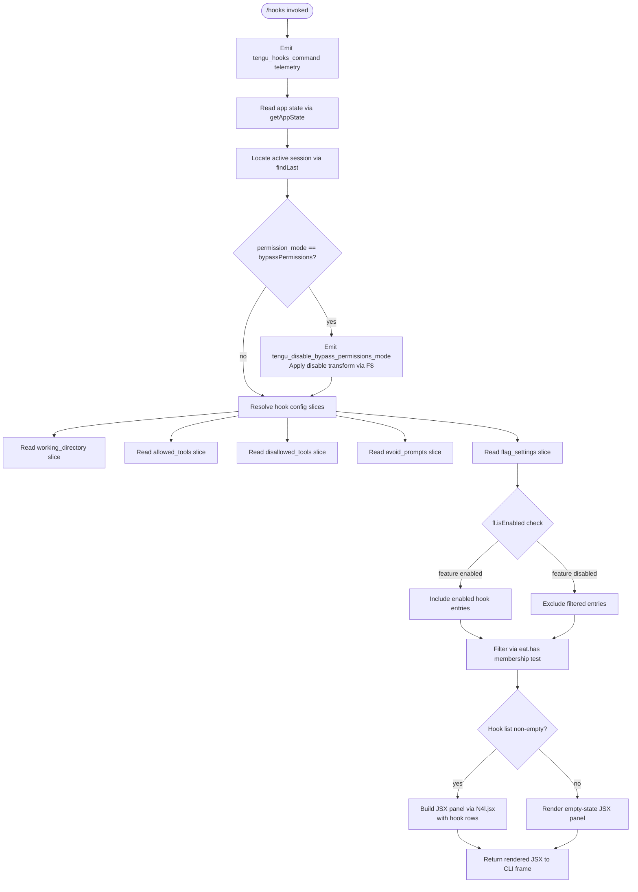

# `/hooks`

> Analysis basis: CC v2.1.193 bundle.js (AST extraction + Claude interpretation)
> Minimum version: v2.1.193

---

## Overview

The `/hooks` command displays the current hook configurations that are registered for tool events in Claude Code. It presents hook rules in a read-only view derived from the active app state, rendering a JSX panel that reflects configuration across the `working_directory`, `allowed_tools`, `disallowed_tools`, `avoid_prompts`, and `permission_mode` dimensions. The command is immediate (no agent round-trip required) and relies on the inline module `O4l` resolved via the Arbor handler `zMf`.

---

## Registration

| Field | Value |
|---|---|
| type | `local-jsx` |
| name | `hooks` |
| description | `View hook configurations for tool events` |
| immediate | `true` |
| module_id | `O4l` |
| load_inline | `true` |
| loc_byte | `12732542` |
| loc_byte_end | `12732692` |
| loc_line | `8697` |
| arbor_handler.name | `zMf` |
| arbor_handler.kind | `AsyncFunction` |
| arbor_handler.fqn | `claude-2.1.193::zMf` |
| arbor_handler.resolution_path | `module_id` |
| arbor_handler.n_hits | `0` |

Analysis basis: CC v2.1.193 bundle.js:+12732542

---

## Input Branching

The command has more than three distinct internal branches driven by feature-flag checks, permission-mode detection, hook-set membership tests, and daemon-state inspection. A Mermaid flowchart is used.



Analysis basis: CC v2.1.193 bundle.js:+12732352, +10994412, +10994517, +10994821, +10427844, +10427935

---

## Behavioral Spec

### 1. Command Entry and Telemetry

The async handler `zMf` fires immediately upon command invocation. Its first action is to emit the `tengu_hooks_command` telemetry event before any state reads occur. A secondary call to the generic telemetry dispatcher (`V`) accompanies this emission.

```
async function hooksCommandHandler(context):
    emitTelemetry("tengu_hooks_command")
    dispatchEvent(V)
    appState = readAppState(Ur)
    return buildHooksView(appState)
```

Analysis basis: CC v2.1.193 bundle.js:+12732350, +12732352, +12732384

### 2. App State and Session Resolution

The handler delegates to the app-state reader (`Ur`), which calls `e.getAppState()` and then uses `n.findLast()` to locate the most-recent active session entry. The session is scoped by `working_directory`.

```
function readAppState(stateHandle):
    state = stateHandle.getAppState()
    session = state.findLast(entry => matchesSession(entry))
    workingDir = session["working_directory"]   // literal key
    return { state, session, workingDir }
```

Analysis basis: CC v2.1.193 bundle.js:+10994412, +10994492, +10994517

### 3. Permission-Mode Gate

After resolving the session, the handler examines the `permission_mode` field. When the value equals `"bypassPermissions"`, it calls the permission-mode transformer (`F$`) which triggers the `tengu_disable_bypass_permissions_mode` event and applies a `"disable"` action string. This happens before hook configuration slices are read.

```
function checkPermissionMode(session):
    mode = session["permission_mode"]   // literal key
    if mode == "bypassPermissions":     // literal value
        emitTelemetry("tengu_disable_bypass_permissions_mode")
        applyAction("disable")          // literal value
    return mode
```

Analysis basis: CC v2.1.193 bundle.js:+10994790, +10994821, +3405833, +3405934

### 4. Hook Configuration Slice Extraction

The hook view is built by the UI renderer (`uO`), which reads multiple named slices from the resolved session. The following string keys are read from the configuration object:

| Key | Literal loc_byte |
|---|---|
| `working_directory` | `+10994517` |
| `allowed_tools` | `+10994572` |
| `disallowed_tools` | `+10994627` |
| `avoid_prompts` | `+10994688` |
| `permission_mode` | `+10994790` |
| `bypassPermissions` | `+10994821` |
| `session` | `+10995120` |
| `effort` | `+10995145` |
| `model` | `+10995158` |
| `max_thinking_tokens` | `+10995170` |
| `flag_settings` | `+10995196` |

```
function extractHookSlices(sessionConfig):
    slices = {
        workingDir:      sessionConfig["working_directory"],
        allowedTools:    sessionConfig["allowed_tools"],
        disallowedTools: sessionConfig["disallowed_tools"],
        avoidPrompts:    sessionConfig["avoid_prompts"],
        permissionMode:  sessionConfig["permission_mode"],
        flagSettings:    sessionConfig["flag_settings"],
        sessionId:       sessionConfig["session"],
        effort:          sessionConfig["effort"],
        model:           sessionConfig["model"],
        maxThinkingTok:  sessionConfig["max_thinking_tokens"],
    }
    return slices
```

Analysis basis: CC v2.1.193 bundle.js:+10994517–+10995196

### 5. Feature-Flag Filtering

The UI renderer (`uO`) calls `fl.isEnabled()` to determine whether each hook entry should be included. Entries whose identifiers are present in the `eat` set (membership checked via `eat.has`) are shown; others are filtered out. A secondary `c.isEnabled()` call (via `yn` sub-handler) validates individual entry inclusion.

```
function filterHookEntries(hookList, featureFlags, allowSet):
    enabled = hookList.filter(entry => featureFlags.isEnabled(entry))
    visible = enabled.filter(entry => allowSet.has(entry.id))
    return visible.map(entry => enrichEntry(entry, featureFlags))
```

Analysis basis: CC v2.1.193 bundle.js:+10427844, +10427935, +10427963, +10427974

### 6. Hook File Stat and Content Loading

For each surviving hook entry, the loader (`tKe`) performs a filesystem `stat` call via `Bql.stat`. If the path is absent (`ENOENT`), it rejects with `Promise.reject`. If the file is present but exceeds 1 048 576 bytes (1 MiB), it is excluded.

```
async function loadHookFile(hookPath):
    try:
        stat = await fs.stat(hookPath)
    catch err:
        if err.code == "ENOENT":
            return Promise.reject(err)
    if not stat.isFile():
        return Promise.reject(new TypeError())
    if stat.size > 1048576:           // 1 MiB limit
        return exclude(hookPath)
    content = await readFile(hookPath)
    return content
```

Maximum hook file size: 1 048 576 bytes (bundle.js:+13170974)

Analysis basis: CC v2.1.193 bundle.js:+13170883, +13170914, +13170928, +13170955, +13170974

### 7. Hook Table Rendering

The table renderer (`Gql`) formats matching hooks into a column-aligned table using `Object.keys` to enumerate hook properties, `Math.max` to compute column widths, and `f_` for the actual cell-padding logic. A two-space separator (`"  "`) is used between columns.

```
function renderHookTable(hookEntries):
    keys = Object.keys(hookEntries[0])
    colWidths = keys.map(k => Math.max(k.length,
                              maxValueWidth(hookEntries, k)))
    rows = hookEntries.map(entry =>
        keys.map(k => padCell(entry[k], colWidths[k])).join("  "))
    return rows.join("\n")
```

Column separator: `"  "` (two spaces, bundle.js:+17509254)
Maximum label pad width: 40 characters (bundle.js:+17511228)

Analysis basis: CC v2.1.193 bundle.js:+13172104, +13172149, +13172348, +17509254, +17511228

### 8. JSX Panel Construction

The final step in `zMf` calls `N4l.jsx` to produce the rendered JSX element returned to the CLI frame. The rendered panel wraps the hook table output along with any configuration warnings produced by earlier slices.

```
function buildFinalPanel(hookTableMarkup, warnings):
    return N4l.jsx(HooksView, {
        content: hookTableMarkup,
        warnings: warnings,
    })
```

Analysis basis: CC v2.1.193 bundle.js:+12732422

### 9. Daemon State Awareness (indirect, via uO)

The UI renderer (`uO`) also checks daemon status to decide whether to show daemon-related hook context. It reads `daemon.status.json` (literal found at +12997330) and checks whether the daemon is in a `"stopped"` state before including daemon hooks in the view.

```
function checkDaemonForHooks(daemonStatusPath):
    status = readJson(daemonStatusPath)   // "daemon.status.json"
    if status.state == "stopped":
        return { daemonHooks: [] }
    return { daemonHooks: status.activeHooks }
```

Analysis basis: CC v2.1.193 bundle.js:+12997330, +17520186

---

## State & Side Effects

| Item | Detail |
|---|---|
| Telemetry | `tengu_hooks_command` (+12732352) — emitted on every invocation; `tengu_disable_bypass_permissions_mode` (+3405833) — emitted when `bypassPermissions` mode is detected; `tengu_slate_harbor` (+5096683) — emitted from `Zv` sub-path (CLI/remote context resolution); `tengu_cobalt_ridge` (+5093978) — emitted from `gN` platform detection path; `tengu_daemon_yield` (+17503119); `tengu_daemon_config_reload` (+17498707); `tengu_workflows_enabled` (+3383152); `tengu_feature_ok` (+1026754); `tengu_feature_bad` (+1026821); `tengu_daemon_control` (+17520352) |
| Hook registration | None — `/hooks` is a read-only display command; it does not register new hooks |
| appState changes | None — state is read-only via `getAppState`; no mutations are performed |
| Filesystem | Performs `stat` calls on each hook file path; reads file content for hooks ≤ 1 MiB |
| Daemon interaction | Reads `daemon.status.json` for daemon-aware hook context |
| Sound | None observed |
| Permission side effect | When `bypassPermissions` is active, emits a telemetry event and applies a `"disable"` transform — does not itself change the mode, only reports it |

---

## Version History

| Version | Change |
|---|---|
| v2.1.193 | Initial analysis |

---

## Common Mistakes

1. **Expecting mutation**: `/hooks` is purely a display command. Invoking it will not add, remove, or modify any hook configuration. Use project or user settings files to change hook definitions.
2. **Confusing `/hooks` with hook execution**: This command shows *configured* hooks, not hooks that fired during a session. Tool-event hooks run automatically; `/hooks` only surfaces their configuration.
3. **Large hook script files not appearing**: Hook files larger than 1 048 576 bytes (1 MiB) are silently excluded from the display. Ensure hook scripts are under this limit.
4. **Missing hooks in bypass-permissions mode**: When `bypassPermissions` is the active permission mode, the command emits a disable-mode event that may suppress certain hook entries from display. Switch to a standard permission mode to see the full hook list.
5. **Daemon-stopped hooks absent**: If the local daemon is in a `stopped` state, daemon-associated hooks will appear empty in the view even if they are defined in configuration.

---

## Appendix — Identifier Mapping

> For bundle debugging only. Identifiers change across versions.

| Identifier | Role |
|---|---|
| `zMf` | Main async handler for the `/hooks` command (Arbor-resolved, `module_id` path) |
| `V` | Generic event dispatcher / telemetry emitter |
| `Ur` | App-state reader; calls `getAppState` and `findLast` for session resolution |
| `F7n` | Hook config slice reader — `allowed_tools` dimension |
| `B7n` | Hook config slice reader — `disallowed_tools` dimension |
| `F$` | Permission-mode transformer; handles `bypassPermissions` → `disable` action |
| `it` | React/render scheduler or effect registration helper |
| `KPt` | Sub-scheduler called from `it` |
| `zPt` | Sub-scheduler called from `it` |
| `H5` | Render guard / hook deduplication helper |
| `lCn` | Memoization helper with `MGr` set and `vwe` map |
| `kt` | Timestamp / event record constructor (calls `Date.now`) |
| `uO` | Main UI renderer; orchestrates all hook-slice reads and JSX construction |
| `Zv` | Context resolver (distinguishes `"cli"` vs `"remote"` execution contexts) |
| `S4` | Sub-helper within context resolver |
| `ul` | String coercion utility (wraps `String()`) |
| `at` | String coercion / formatting utility (wraps `String()`) |
| `tKe` | Hook file loader; performs `stat`, size check, and content read |
| `an` | Error annotation helper within file loader |
| `qs` | Context store reader (`Kqu.getStore`) |
| `Y$o` | Hook path resolver helper |
| `be` | String formatter within file loader |
| `o` | Hook entry mapper / padder (`s.map`, `i.padEnd`) |
| `Gql` | Hook table column-width calculator and renderer |
| `E` | Process/daemon stop orchestrator |
| `XAt` | Transport-level stop helper (calls `akc`) |
| `xe` | Error logger for hook execution failures |
| `eo` | Error constructor wrapper |
| `A` | Daemon lifecycle manager (`QBt`, `XAt`, `updateConfig`, `start`, `stop`) |
| `QBt` | Daemon config reset helper |
| `DMc` | Daemon restart coordinator (calls `Bae`) |
| `Bae` | Heartbeat / daemon-alive probe |
| `I` | Input event handler within the hooks panel |
| `R` | Transient-yield writer (emits daemon-yield message) |
| `jCo` | JSX component or layout wrapper |
| `lo` | Module loader bootstrap (sets `__esModule`, calls `hNe`, `Edr`, etc.) |
| `KZt` | Bound loader callback |
| `vE` | Feature/workflow flag evaluator |
| `CCn` | Flag config reader |
| `xx` | Flag resolution helper |
| `ixi` | Workflow feature gate |
| `Fs` | Permission-set membership checker (`WSd.has`, `VSd.has`, `Bi`, `Whe`) |
| `cjr` | Pro-tier feature gate wrapper |
| `aAd` | Workflow-enable path; emits `tengu_workflows_enabled` |
| `iAd` | Flag resolution helper (calls `xx`) |
| `Pre` | Hook-entry filter pipeline |
| `D8t` | Hook config normalizer |
| `cq` | Hook deny-list checker (reads `"deny"` entries) |
| `s3o` | Hook config sub-normalizer (`sge`, `zcn`, `UIe`, `lvr`, `Ev`) |
| `a3o` | Hook config fallback normalizer |
| `WCo` | Platform / OS detection helper (windows check, calls `gN`) |
| `gN` | OS-platform string builder; emits `tengu_cobalt_ridge` |
| `Eu` | Platform utility (calls `Wt`, `Xme`) |
| `u` | Hook lifecycle array (push entries for `we`, `Re`, `R$`, `Hj`) |
| `we` | Feature-ok event emitter (emits `tengu_feature_ok`) |
| `Re` | Feature-bad event emitter (emits `tengu_feature_bad`) |
| `R$` | First-party hook registration helper |
| `h5` | Hook ID / registry manager (calls `GB`) |
| `ZBe` | Hook event emitter setup |
| `xGr` | UUID-based hook record creator (`wGr.randomUUID`, `dnt`, `u5`, `e.emit`) |
| `Hj` | Graceful-shutdown sequencer (`Promise.race`, `Promise.all`, `process.exit`) |
| `Yhe` | Shutdown helper (calls `zhe.shutdown`) |
| `oHe` | Timeout clearer on shutdown (`clearTimeout`, `H9o`) |
| `Un` | Abort-with-timeout utility (`setTimeout`, `clearTimeout`, `s.unref`) |
| `A9` | Hook session orchestrator (calls `Eu`, `lut`, `eb`, `Nht`, `jCo`, `WCo`, `rfl`, `vP`) |
| `lut` | Local-agent launcher (calls `$C`, `Eu`) |
| `$C` | Agent config builder (calls `at`, `ffr`) |
| `eb` | String utility within session orchestrator (wraps `ul`) |
| `Nht` | Hook-set initializer |
| `vP` | Permission-mode validator |
| `x$t` | Standard-mode permission checker (`SBe`, `CQr`, `qjd`) |
| `T` | Tool-name normalizer (`toUpperCase`, `trim`, `iUe`, `qFc`, `ke`, `Lc`, `XO`, `iYe`, `XFc`) |
| `_r` | Bedrock/Foundry/AWS/Mantle/Vertex provider resolver |
| `_u` | Provider-specific validation helper (calls `vhn`) |
| `lc` | Locale/language code helper |
| `c` | Individual hook-entry feature-flag checker (calls `yn`) |
| `yn` | Feature-enabled predicate |
| `l` | Hook list with `C8l` runner |
| `C8l` | Hook execution runner (reads `Date.now`, calls `qs`, `v7t`, `ke`) |
| `iee` | Execution-start recorder (calls `Yge`) |
| `v7t` | Status path builder (`I8l.join`, `nr`) |
| `ke` | JSON serializer (wraps `JSON.stringify`) |

---

Note: index built via Arbor fallback; some signals (telemetry, literals) may be missing — see arbor-fallback.js.