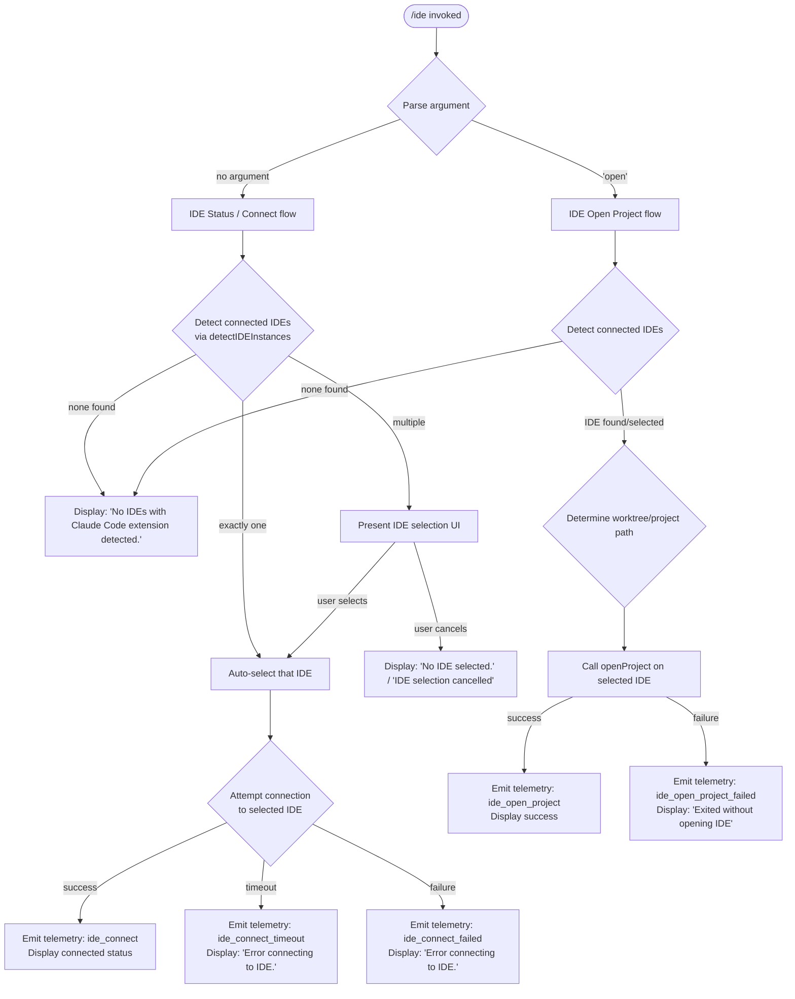

# `/ide`

> Analysis basis: CC v2.1.193 bundle.js (AST extraction + Claude interpretation)
> Minimum version: v2.1.193

---

## Overview

The `/ide` command manages IDE integrations with Claude Code, allowing users to detect connected IDE instances (VS Code, Cursor, Windsurf, JetBrains, and others), select among multiple detected IDEs, optionally open the current project in a chosen IDE, and display live connection status. When the `open` sub-command argument is provided, the command additionally attempts to launch or focus the project within the detected IDE.

---

## Registration

| Field | Value |
|---|---|
| type | `local-jsx` |
| name | `ide` |
| description | `Manage IDE integrations and show status` |
| argumentHint | `[open]` |
| module_id | `lRl` |
| load_inline | `true` |
| loc_byte | `11798894` |
| loc_byte_end | `11799050` |
| loc_line | `7432` |
| arbor_handler.name | `MSf` |
| arbor_handler.fqn | `claude-2.1.193::MSf` |
| arbor_handler.kind | `AsyncFunction` |
| arbor_handler.resolution_path | `module_id` |
| arbor_handler.n_hits | `0` |

Analysis basis: CC v2.1.193 bundle.js:+11798894

---

## Input Branching

The command has 4+ distinct branches based on argument parsing, IDE detection state, connection state, and the `open` sub-command; a Mermaid flowchart is used.



---

## Behavioral Spec

### Top-Level Handler (`MSf`)

The primary async handler, resolved via `module_id → lRl → MSf`.

```
async function ideCommandHandler(context, args):
    emit telemetry "tengu_ext_ide_command"           // bundle.js:+11795091

    subCommand = args[0]                             // "open" or undefined

    ideList = await detectIDEInstances()             // calls J1n

    if ideList is empty:
        display "No IDEs with Claude Code extension detected."
        return                                       // bundle.js:+11795306

    if subCommand === "open":
        selectedIDE = await selectIDE(ideList)
        if not selectedIDE:
            display "No IDE selected."
            return                                   // bundle.js:+11795426
        await openProjectInIDE(selectedIDE, context) // see openProject sub-feature
    else:
        selectedIDE = await selectIDE(ideList)
        if not selectedIDE:
            display "IDE selection cancelled"
            return                                   // bundle.js:+11798260
        await connectToIDE(selectedIDE, context)     // see connectToIDE sub-feature
```

Analysis basis: CC v2.1.193 bundle.js:+11795089

---

### IDE Detection (`J1n` / `Y1n` / `Tcp`)

Discovers running IDE processes and validates them as having the Claude Code extension active.

```
async function detectIDEInstances():
    candidates = []

    // Phase 1: scan running processes
    processList = await scanRunningProcesses()       // via Y1n → Tcp
    for each process in processList:
        if process matches known IDE pattern:
            candidates.push(process)

    // Phase 2: resolve candidate paths and filter
    results = await Promise.all(candidates.map(resolveIDECandidate))  // Acp / q1r
    validIDEs = results.filter(ide => ide is reachable)

    emit telemetry "ide_detect"                      // bundle.js:+6819961
    if validIDEs is empty:
        emit telemetry "ide_detect_failed"           // bundle.js:+6820025

    return validIDEs
```

**Process scanning** (`Tcp`) searches for processes matching these IDE families:

- VS Code variants: `vscode`, `vs code`, `visual studio code`, `code - oss`, `insiders` (bundle.js:+6821601 – +6821704)
- Cursor: `cursor` (bundle.js:+6821536)
- Windsurf: `windsurf` (bundle.js:+6821472)
- Devin: `devin` / `Devin Desktop` (bundle.js:+6821496, +6821792)
- VSCodium: `vscodium`, `codium` (bundle.js:+6821680, +6821923)
- JetBrains family: matched via `jetbrains` / `appcode` keywords (bundle.js:+6814786, +6823760)

On Linux, detection uses the shell command:

> `ps aux | grep -E "code|cursor|windsurf|devin-desktop|idea|pycharm|webstorm|phpstorm|rubymine|clion|goland|rider|datagrip|dataspell|aqua|gateway|fleet|android-studio" | grep -v grep`
> (bundle.js:+6823372)

WSL-specific path handling normalizes paths under `/mnt/c/Users` (bundle.js:+6816612), excluding system user directories `Public`, `Default`, `Default User`, and `All Users` (bundle.js:+6816706 – +6816770).

The IDE config directory is `.claude` (bundle.js:+6816405). Socket-based connection probing uses a 3000 ms timeout per candidate (bundle.js:+2312300), with up to 10 port candidates scanned (bundle.js:+2312051).

Analysis basis: CC v2.1.193 bundle.js:+6818606

---

### IDE Name Normalization (`Xya` / `Q1n` / `WL`)

Normalizes raw process names into a canonical IDE identifier for display and comparison.

```
function normalizeIDEName(rawName):
    lower = rawName.toLowerCase()

    if lower includes "windsurf":  return "windsurf"
    if lower includes "devin":     return "devin"
    if lower includes "cursor":    return "cursor"
    if lower includes "insiders":  return "insiders"
    if lower includes "vscode" or "vs code" or "visual studio code": return "vscode"
    if lower includes "vscodium" or "code - oss":
        baseName = path.basename(lower)
        if baseName includes "codium": return "vscodium"
    // JetBrains family handled via kcp / WL path
    return lower
```

Analysis basis: CC v2.1.193 bundle.js:+6821442, +6821885

---

### Connection to IDE (`connectToIDE` → `Pn` / `Vr`)

Establishes a real-time connection to the selected IDE extension over SSE or WebSocket.

```
async function connectToIDE(selectedIDE, context):
    display "Connecting to <IDE name>"              // bundle.js:+11798143

    transport = determineTransport(selectedIDE)
    // "sse-ide" (bundle.js:+11793130) or "ws-ide" (bundle.js:+11793150)
    // if URL starts with "ws:" → use WebSocket transport (bundle.js:+11797931)

    connectionPromise = establishConnection(transport, selectedIDE)

    try:
        result = await withTimeout(connectionPromise)
        emit telemetry "ide_connect"                // bundle.js:+11797121
        display connection status / MCP tools list
    catch TimeoutError:
        emit telemetry "ide_connect_timeout"        // bundle.js:+11797315
        display "Error connecting to IDE."          // bundle.js:+11797433
    catch ConnectionError:
        emit telemetry "ide_connect_failed"         // bundle.js:+11797208
        display "Error connecting to IDE."

    // On active connection: filter and display MCP tools prefixed "mcp__ide__"
    ideTools = allTools.filter(name => name.startsWith("mcp__ide__"))
                                                    // bundle.js:+11797711
```

Upon disconnection, telemetry event `ide_disconnect` is emitted (bundle.js:+11797814).

Analysis basis: CC v2.1.193 bundle.js:+11797118

---

### Open Project in IDE (`openProjectInIDE` → `MSf` open branch)

Instructs the selected IDE to open the current project directory (or git worktree).

```
async function openProjectInIDE(selectedIDE, context):
    projectPath = determineProjectPath(context)
    // checks for worktree vs plain project (bundle.js:+11795658 / +11795669)

    ideBasename = path.basename(selectedIDE.executablePath)
                                                    // bundle.js:+11795545

    try:
        result = await selectedIDE.onInstallIDEExtension(projectPath)
                                                    // bundle.js:+11796198
        emit telemetry "ide_open_project"           // bundle.js:+11795624
        display success UI
    catch error:
        emit telemetry "ide_open_project_failed"    // bundle.js:+11795731
        display "Exited without opening IDE"        // bundle.js:+11796021

    display hint: "restart your IDE"               // bundle.js:+11796290
    // platform-specific open logic via Nso / kcp / WL
```

Analysis basis: CC v2.1.193 bundle.js:+11795621

---

### IDE Status Display (`aRl` React component)

The `local-jsx` handler renders a live React component displaying IDE state.

```
function IDEStatusComponent(props):
    appState     = useAppState()
    themeContext = useThemeContext()
    inputContext = useInputContext()
    ref          = useRef()

    useEffect(() => {
        // Subscribe to IDE connection events
        // Update displayed connection state
        emit "ide_connect" / "ide_connect_failed" as appropriate
    }, [dependencies])

    // Render connected IDEs list with MCP tool names prefixed "mcp__ide__"
    ideMCPTools = allTools.filter(t => t.startsWith("mcp__ide__"))

    // Classify connection type
    if connectionURL.startsWith("ws:"):
        connectionType = "dynamic"                  // bundle.js:+11798048
    else:
        connectionType = "sse" or "ws-ide"

    return JSX status panel
```

Analysis basis: CC v2.1.193 bundle.js:+11796904

---

### Argument Slice & IDE List Formatting (`UMo`)

Handles truncated display of multiple IDE names in the status line.

```
function formatIDEList(ideNames, maxCount = 100):
    // bundle.js:+11798336 (literal 100), +11798355 (literal 0)
    normalized = ideNames.map(n => n.normalize("NFC"))
                                                    // bundle.js:+11798477

    if normalized.length <= 3:
        return normalized.join(", ")               // bundle.js:+11798634
    else:
        visible = normalized.slice(0, 3)
        return visible.join(", ") + ", …"          // bundle.js:+11798648
```

Analysis basis: CC v2.1.193 bundle.js:+11798372

---

## State & Side Effects

| Item | Detail |
|---|---|
| Telemetry: `tengu_ext_ide_command` | Fired on every `/ide` invocation (bundle.js:+11795091) |
| Telemetry: `ide_detect` | Fired after IDE process scan completes (bundle.js:+6819961) |
| Telemetry: `ide_detect_failed` | Fired when no IDE instances are found (bundle.js:+6820025) |
| Telemetry: `ide_connect` | Fired on successful IDE connection (bundle.js:+11797121) |
| Telemetry: `ide_connect_failed` | Fired on connection error (bundle.js:+11797208) |
| Telemetry: `ide_connect_timeout` | Fired when connection times out (bundle.js:+11797315) |
| Telemetry: `ide_disconnect` | Fired when IDE connection is closed (bundle.js:+11797814) |
| Telemetry: `ide_open_project` | Fired on successful project open (bundle.js:+11795624) |
| Telemetry: `ide_open_project_failed` | Fired when project open fails (bundle.js:+11795731) |
| Telemetry: `tengu_feature_ok` / `tengu_feature_bad` / `tengu_feature_sad` | General feature outcome events (bundle.js:+1026754, +1026821, +1026902) |
| Telemetry: `tengu_mcp_skills` | Emitted when MCP skill registration occurs for IDE tools (bundle.js:+6781017) |
| MCP tool registration | IDE MCP tools registered with prefix `mcp__ide__` (bundle.js:+11797711) |
| Transport type | SSE (`sse-ide`) or WebSocket (`ws-ide`) selected based on IDE endpoint URL (bundle.js:+11793130, +11793150) |
| appState changes | IDE connection status reflected in app state via `useAppState` hook |
| Process scanning (Linux) | Spawns a shell (`sh -c`) with `ps aux | grep -E ...` pipeline (bundle.js:+6823372) |
| Timeout: candidate probe | 3000 ms per IDE socket candidate (bundle.js:+2312300) |
| Timeout: send-claim | 5000 ms (bundle.js:+17458835) |
| Timeout: grace window | 30000 ms dispatch stale threshold (bundle.js:+17465450) |
| Cleanup interval | 300000 ms (5 minutes) background session cleanup (bundle.js:+17490581) |
| Sound | None detected |

---

## Version History

| Version | Change |
|---|---|
| v2.1.193 | Initial analysis |

---

## Common Mistakes

1. **Invoking `/ide open` without an active IDE session** — If no IDE with the Claude Code extension is running, the command exits immediately with "No IDEs with Claude Code extension detected." The extension must be installed and the IDE must be open first.
2. **Expecting instant IDE detection on Linux** — The Linux detection path runs a `ps aux | grep` shell pipeline which may be slow on systems with many processes or restricted `/proc` access; detection may incorrectly return empty results.
3. **Multiple IDE instances causing ambiguity** — When more than one IDE is detected, the command presents a selection UI. Running `/ide` non-interactively (e.g. in a script) will stall waiting for user input.
4. **Confusing `/ide` with MCP tool invocation** — The `mcp__ide__*` prefixed tools are registered as MCP capabilities once a connection is established; they are not directly addressable via `/ide` arguments.
5. **Ignoring the `restart your IDE` hint after extension install** — The `open` subflow displays a reminder to restart the IDE (bundle.js:+11796290); skipping this step leaves the extension inactive and subsequent `/ide` invocations will not detect the IDE.
6. **WSL path mismatches** — On WSL, IDE executables may resolve under `/mnt/c/Users/...`; paths under system user directories (`Public`, `Default`, `Default User`, `All Users`) are intentionally excluded from candidate scanning.

---

## Appendix — Identifier Mapping

> For bundle debugging only. Identifiers change across versions.

| Identifier | Role |
|---|---|
| `MSf` | Primary async handler for `/ide` command (arbor_handler) |
| `UMo` | IDE list formatting / argument slice utility |
| `J1n` | IDE detection orchestrator (top-level detect flow) |
| `Y1n` | IDE candidate resolver (maps candidates in parallel) |
| `Tcp` | Process scanner / IDE path validator |
| `Acp` | IDE candidate adapter / normalizer |
| `q1r` | Individual IDE candidate probe (socket test, parseInt port) |
| `Vr` | Connection establishment to IDE extension |
| `Pn` | Connection wrapper (wraps Vr + Pt) |
| `Xya` | IDE name classifier (windsurf / devin / cursor / insiders / vscode) |
| `Q1n` | IDE display name normalizer (vscodium / codium branch) |
| `WL` | IDE basename extractor / JetBrains detection |
| `kcp` | Platform-specific IDE open-project implementation |
| `Nso` | Open-project orchestrator (wraps kcp) |
| `aRl` | React JSX component for IDE status display |
| `MSf` | Async handler (also arbor_handler.name) |
| `Cm` | Sub-command parser ("open" literal check) |
| `SF` | Shared formatting utility |
| `Kya` | Process kill helper (process.kill) |
| `Jya` | IDE executable path string sanitizer |
| `di` | String slice / indexOf utility |
| `vt` | Feature outcome reporter (ok/sad path) |
| `bne` | IDE extension install notification helper |
| `vSf` | IDE status filter (active connection filter) |
| `yt` | App state selector hook |
| `Gqr` | App state context consumer |
| `To` | Theme context consumer |
| `Td` | Input/theme context hook |
| `oT` | MCP skills registration handler |
| `s6e` | MCP server config hash builder |
| `hRe` | MCP config serializer (createHash sha256) |
| `jL` | MCP tool registration (calls `it`) |
| `it` | Background session / worker registration |
| `lCn` | Worker deduplication / connection-set manager |
| `kt` | Worker lifecycle tick (Date.now, xjf) |
| `cVo` | Background session claim sender |
| `gVo` | Background worker session lifecycle manager |
| `w9o` | Background worker auth/socket writer |
| `tHm` | Send-claim with timeout (5000 ms) |
| `nHm` | Low-level socket connect for claim |
| `eHm` | Claim frame builder |
| `pHm` | Daemon protocol message handler (full protocol state machine) |
| `gMc` | Dispatch timeout / stale-drop logic |
| `Gre` | Timing-safe key comparison (control key auth) |
| `dHm` | Worker stall detection / respawn trigger |
| `uHm` | Attach stall measurement |
| `znr` | Upgrade-trigger on attach |
| `gHm` | Output stream include/replace filter |
| `rie` | Invalid-resume-id / link-scan path resolver |
| `Gi` | Background session state-file reader/writer |
| `hc` | Job path resolver |
| `Lh` | Session active-state checker |
| `i0` | Active state literal wrapper |
| `QLe` | Roster entry parser |
| `bUd` | Roster dedup / filter helper |
| `W_t` | Roster file watcher |
| `hq` | Roster file read / parse |
| `sEf` | Roster file write (atomic via Nm) |
| `xKt` | PTY-PID file path builder |
| `XSe` | PTY-PID roster directory path builder |
| `sOe` | PTY-PID sub-path resolver |
| `fk` | Late-PTY-PID file helper |
| `kxl` | PTY-PID file writer (split) |
| `M0` | PTY session path resolver |
| `dMo` | PTY ephemeral path builder |
| `j_t` | PTY path joiner |
| `nD` | Late-PTY-PID alternate writer |
| `ZJ` | PTY-PID split-path writer |
| `LKt` | Auth-dir path builder |
| `wKt` | Auth file path joiner |
| `Nm` | Atomic file writer (randomBytes + writeFile + rename) |
| `$d` | Pinned-job write path resolver |
| `$y` | Pinned-job state-cache clearer |
| `I9e` | Pins.json reader / stale-pin remover |
| `vUd` | Jobs-directory enumerator |
| `N4i` | Job directory creator |
| `Uf` | Job path validator |
| `PR` | Jobs base-path builder |
| `RNt` | Pins.json path builder |
| `O` | Transient-session retire-if-settled scheduler |
| `D` | Worker process kill / restart orchestrator |
| `NMc` | Worker identity verifier (realpath + stat) |
| `T` | Process spawn / exec wrapper |
| `qFc` | Spawn config builder |
| `Lc` | Executable path resolver ([REDACTED] sanitizer) |
| `iYe` | Spawn arg builder |
| `XFc` | Spawn + stdio pipe connector |
| `xe` | Error formatter / log-error dispatcher |
| `eo` | Error string extractor |
| `at` | String coercion utility |
| `Bi` | Essential-traffic queue |
| `e_u` | Traffic-queue shift/push helper |
| `RHm` | Background version fetch |
| `B6n` | Version URL builder (claude/versions) |
| `d` | Supervisor write / MCP server lifecycle manager |
| `tKe` | File write with size check (1 MB limit) |
| `Gql` | Supervisor config serializer |
| `E` | SDK MCP server connection manager |
| `A` | MCP server adapter (updateConfig / start / stop) |
| `DMc` | Heartbeat scheduler |
| `I` | MCP server start with resize handling |
| `Knr` | macOS memory pressure checker |
| `f` | Background session dispatch / main worker loop |
| `Pt` | App-state context getter |
| `Eln` | Store accessor (yln.getStore + kK) |
| `mr` | Shared utility (wraps Rx) |
| `we` | Daemon start helper (V + Oe) |
| `Re` | Daemon re-start helper (V + Oe) |
| `R$` | Daemon control event emitter |
| `h5` | Daemon controller getter |
| `ZBe` | Daemon EL event emitter |
| `xGr` | Daemon UUID generator / emit |
| `Hj` | Forced-shutdown orchestrator (Promise.race) |
| `Yhe` | Shutdown initiator (zhe.shutdown) |
| `oHe` | Idle-exit timeout clearer |
| `Un` | Timeout-with-abort wrapper |
| `p` | Process normalizer (forced shutdown / abort) |
| `vT` | Process exit on forced shutdown |
| `Is` | CLI error exit handler (lKe + OT + process.exit) |
| `V` | Core value/context accessor |
| `Oe` | Zze-based context helper |
| `H` | WebSocket/TCP connection handler (buffer concat, framing) |
| `Tp` | Connection end + ke helper |
| `pHm` | Full daemon protocol state machine |
| `z_` | Background-service label wrapper |
| `pVo` | Protocol dispatch helper |
| `m` | Worker values iterator + kill |
| `R` | Worker write + V accessor |
| `y` | Repaint trigger (Bje) |
| `L` | Background sweep / memory management loop |
| `X` | MCP update applicator |
| `z` | Session eOe/yxl helper |
| `j` | Key handler (i + O) |
| `J` | LXt write wrapper |
| `q` | Write + gHm + H.write composite |
| `K` | Backspace/preventDefault key handler |
| `tZt` | Stream destroy + write helper |
| `lpe` | <!-- TODO: not found in depth-2 traversal; needs --depth 4 --> |
| `Wt` | Shared wait/utility function |
| `an` | Error-code helper (ENOENT / EACCES etc.) |
| `SF` | Shared formatting / display utility |
| `be` | String coercion wrapper |
| `qd` | Error annotator |
| `In` | ENOENT ignore helper |
| `Kd` | <!-- TODO: not found in depth-2 traversal; needs --depth 4 --> |
| `ke` | JSON.stringify wrapper |
| `jt` | <!-- TODO: not found in depth-2 traversal; needs --depth 4 --> |
| `Bt` | JSON.parse wrapper |
| `uk` | Binary frame encoder (Buffer alloc + writeUInt32BE + writeUInt8) |
| `B` | <!-- TODO: not found in depth-2 traversal; needs --depth 4 --> |
| `F` | <!-- TODO: not found in depth-2 traversal; needs --depth 4 --> |
| `N` | <!-- TODO: not found in depth-2 traversal; needs --depth 4 --> |
| `v` | <!-- TODO: not found in depth-2 traversal; needs --depth 4 --> |
| `M` | clearTimeout + c.write helper |
| `_v` | IDE connection config builder (wraps I$e) |
| `I$e` | MCP transport initializer (SSE / stdio / WebSocket) |
| `Pn` | IDE MCP connection wrapper (Vr + Pt) |
| `Vr` | MCP server connection (I$e + DEu + MEu) |
| `kBi` | Executable match helper (e.match) |
| `oEa` | <!-- TODO: not found in depth-2 traversal; needs --depth 4 --> |
| `Nn` | <!-- TODO: not found in depth-2 traversal; needs --depth 4 --> |