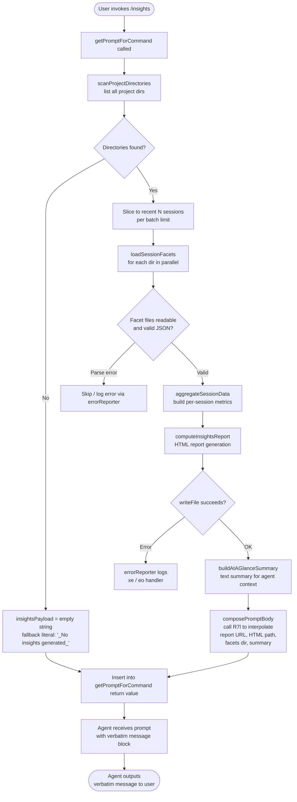

# `/insights`

> Analysis basis: CC v2.1.193 bundle.js (AST extraction + Claude interpretation)
> Minimum version: v2.1.193

---

## Overview

The `/insights` command generates a structured HTML usage-analytics report from the user's local Claude Code session data and presents a ready-made shareable link back to the user via a verbatim `<message>` block. It orchestrates filesystem traversal of the local session/facets directories, aggregates per-session metrics, renders an HTML report to disk, and then instructs the agent to reply with a fixed, pre-composed message rather than a free-form answer.

---

## Registration

| Field | Value |
|---|---|
| type | `prompt` |
| name | `insights` |
| description | `Generate a report analyzing your Claude Code sessions` |
| loc_byte | `13416721` |
| loc_byte_end | `13418025` |
| loc_line | `10124` |
| handler_method | `getPromptForCommand` |
| handler_method_start | `13416895` |
| handler_method_end | `13418024` |
| prompt_body.length | `513` characters |
| prompt_body.trace | `call→R7l(...) (1 literals)` |
| arbor_handler.name | `getPromptForCommand` |
| arbor_handler.kind | `Method` |
| arbor_handler.fqn | `claude-2.1.193::getPromptForCommand` |
| arbor_handler.resolution_path | `direct` |
| arbor_handler.n_hits | `1` |

Analysis basis: CC v2.1.193 bundle.js:+13416721

---

## Input Branching

The command's handler executes a linear pipeline with several internal branches during data collection and report rendering. The primary divergence points are: (1) whether session directories exist and contain readable data, (2) whether individual facet files pass validation, and (3) whether the full insights payload is non-empty before composing the final prompt. This yields more than three distinct outcome paths, so a flowchart is used.



Analysis basis: CC v2.1.193 bundle.js:+13416901

---

## Behavioral Spec

### 1. Handler Entry — `getPromptForCommand`

The handler is an inline `ObjectMethod` on the registration object, resolved directly by Arbor (`resolution_path: direct`). It is the sole entry point for the `/insights` command.

```
function getPromptForCommand(commandContext):
    sessionDirs = await scanProjectDirectories(projectsRoot)
    if sessionDirs is empty:
        insightsPayload = FALLBACK_NO_INSIGHTS  // "_No insights generated_"
        reportURL = ""
        htmlFilePath = ""
        facetsDir = ""
        atAGlanceSummary = ""
    else:
        recentDirs = sessionDirs.slice(0, SESSION_BATCH_LIMIT)
        facetData = await loadAllFacets(recentDirs)
        aggregated = aggregateSessionMetrics(facetData)
        reportPath = buildReportOutputPath(timestamp)  // "report.html"
        htmlContent = renderHTMLReport(aggregated)
        await writeFile(reportPath, htmlContent)
        facetsDir = resolveFacetsDirectory()
        atAGlanceSummary = buildAtAGlanceSummary(aggregated)
        insightsPayload = formatInsightsPayload(aggregated)
        reportURL = deriveReportURL(reportPath)
        htmlFilePath = reportPath

    promptText = interpolatePromptBody(
        insightsPayload, reportURL, htmlFilePath,
        facetsDir, atAGlanceSummary
    )
    return promptText
```

Analysis basis: CC v2.1.193 bundle.js:+13416895

---

### 2. Project Directory Scanning — `scanProjectDirectories` (`_3f`)

Reads the top-level projects root (path component `"projects"`, joined via the path utility `YY`), enumerates subdirectories, and queues them for facet loading. A `setImmediate` yield is used inside the directory walk loop to avoid blocking the event loop. Results are sorted before returning.

```
async function scanProjectDirectories(rootPath):
    projectsPath = pathJoin(rootPath, "projects")  // literal "projects"
    entries = await fs.readdir(projectsPath)
    dirs = entries.filter(entry => entry.isDirectory())
    // yield every 10 entries (literals: 10, 9 at +13403530/+13403535)
    // batch processing: up to 50 dirs, 200 parallel ops (literals at +13403672/+13403677)
    sorted = dirs.sort(byModificationTime)
    return sorted
```

Analysis basis: CC v2.1.193 bundle.js:+13403261

---

### 3. Facet File Loading — `loadSessionFacets` (`oSt`)

For each session directory, reads all `.jsonl` files (literal `".jsonl"` at `+13505006`), filters by `isFile()`, validates filenames via regex tester `Fk`, and reads metadata via `stat`. Results are accumulated and returned as a map keyed by session identifier.

```
async function loadSessionFacets(sessionDir):
    entries = await fs.readdir(sessionDir)
    files = entries.filter(e => e.isFile() && isValidFacetFile(e.name))
    results = new Map()
    statResults = await Promise.all(files.map(f => fs.stat(joinPath(sessionDir, f))))
    statResults.forEach((stat, idx) => results.set(files[idx], stat))
    return results
```

Analysis basis: CC v2.1.193 bundle.js:+13504900

---

### 4. Per-Session Data Loading — `loadSessionJSON` (`i3f`)

Reads individual session JSON files from `usage-data` and `session-meta` sub-paths (literals at `+13342487`, `+13342583`). Parsing is delegated to the safe JSON parser `Bt` (wraps `JSON.parse`). Read encoding is `"utf-8"` (literal at `+13348636`).

```
async function loadSessionJSON(sessionDir):
    usageDataPath = pathJoin(sessionDir, "usage-data")
    sessionMetaPath = pathJoin(sessionDir, "session-meta")
    rawData = await fs.readFile(usageDataPath, "utf-8")
    parsed = safeJSONParse(rawData)  // Bt → JSON.parse
    return parsed
```

Analysis basis: CC v2.1.193 bundle.js:+13348569

---

### 5. Insights Aggregation — `aggregateInsightsFacets` (`x7l`)

The core computation function. Receives the list of per-session facet records and produces a consolidated analytics object. Internal sub-steps include:

- **Session classification** (`C7l` / `i2o`): Inspects tool-use records; identifies `mcp__`-prefixed tool calls (literal `"mcp__"` at `+13343159`), `WebSearch`, `WebFetch`, `Edit`, `Write` (literals at `+13343180`, `+13343204`, `+13343311`, `+13343323`), and `git commit` / `git push` (literals at `+13343567`, `+13343599`). Computes per-session hour buckets and error categories.
- **Statistical computation** (`L7l` / `w7l`): Computes percentiles, medians, and histograms across sessions. Uses `Math.floor`, `Math.round`, `r.sort`, `r.at` for quantile arithmetic. Session inactivity threshold: 1 800 000 ms (30 minutes, literal at `+13351060`).
- **Report section assembly** (`u3f`): Groups sessions, caps text at 4 096 characters (literal at `+13350518`), formats `"at_a_glance"` summary key (literal at `+13356850`). Falls back to `"None captured"` (literal at `+13356184`) when a metric has no data.
- **HTML report writing** (`a3f` / `s3f`): Creates output directory with `fs.mkdir`, serialises report to `report.html` (literal at `+13405910`) using `fs.writeFile`. Timestamp-derived filename incorporates full year, month, date, hours, minutes, seconds via `Date` accessors.

```
async function aggregateInsightsFacets(sessionDirList):
    batch = sessionDirList.slice(0, BATCH_SIZE)
    facetGroups = await Promise.all(batch.map(dir => loadSessionJSON(dir)))
    
    perSession = []
    for each facetGroup in facetGroups:
        metrics = classifySessionEvents(facetGroup)   // C7l
        perSession.push(metrics)

    stats = computeStatistics(perSession)             // L7l / w7l
    htmlBody = renderHTMLReport(stats)                // h3f
    
    outputDir = buildOutputPath(now)
    await fs.mkdir(outputDir, { recursive: true })
    await fs.writeFile(pathJoin(outputDir, "report.html"), htmlBody, "utf-8")
    
    atAGlance = buildAtAGlanceSummary(stats)          // u3f
    return { stats, atAGlance, outputDir }
```

Analysis basis: CC v2.1.193 bundle.js:+13403726

---

### 6. HTML Report Rendering — `renderHTMLReport` (`h3f`)

Produces the full HTML document sent to the filesystem. Key details:
- HTML-escapes special characters (`&amp;`, `&lt;`, `&gt;`, `&quot;`, `&apos;` — literals at `+5409050`–`+5409173`) via `Zd`/`zl`.
- Response-time buckets: `"2-10s"`, `"10-30s"`, `"30s-1m"`, `"1-2m"`, `"2-5m"`, `"5-15m"`, `">15m"` (literals at `+13359823`–`+13359883`). Upper threshold for "long" response: 120 s and 900 s (literals at `+13360043`, `+13360125`).
- Time-of-day buckets: `"Morning (6-12)"`, `"Afternoon (12-18)"`, `"Evening (18-24)"`, `"Night (0-6)"` (literals at `+13360671`–`+13360824`).
- Chart accent colours (hex): `#2563eb`, `#0891b2`, `#10b981`, `#8b5cf6`, `#dc2626`, `#16a34a`, `#eab308` (literals at `+13397488`–`+13401946`).
- Empty-state sentinel: `<p class="empty">No data</p>` (literal at `+13359314`).
- Maximum section text: 8 192 characters (literal at `+13358992`).
- Includes a `"Add to CLAUDE.md"` suggestion link (literal at `+13365167`).

```
function renderHTMLReport(aggregatedStats):
    sections = []
    for each metric in aggregatedStats:
        htmlSection = buildSection(metric, colorPalette, emptyStateSentinel)
        sections.push(htmlSection)
    document = assembleHTMLDocument(sections)
    return document
```

Analysis basis: CC v2.1.193 bundle.js:+13361457

---

### 7. Prompt Body Composition — `composePromptBody` (via `R7l`)

After the report is written to disk, `getPromptForCommand` calls `R7l` with the interpolated values to build the 513-character prompt body. The body structure (paraphrased, not quoted):

- Declares that the user just ran `/insights`.
- Embeds the full insights data payload inline.
- Provides the report URL, HTML file path, and facets directory path.
- Supplies an at-a-glance summary marked as context for the agent only (the user has not yet seen output).
- Instructs the agent to output the text between `<message>` tags **verbatim** as its entire response, without omitting any line.
- The `<message>` block tells the user their shareable report is ready, provides the path/URL, and asks whether they want to explore any section or try a suggestion.

When no session data is found, the insights payload is replaced by the fallback literal `"_No insights generated_"` (literal at `+13417792`), and the URL/path fields are empty.

Analysis basis: CC v2.1.193 bundle.js:+13417927

---

### 8. Error Handling

Errors during filesystem operations are surfaced through the shared error reporter (`xe`), which logs via `kZ.logError` and pushes to the error journal `rJe`. JSON parse failures are silently skipped per-session via `Bt`'s safe-parse wrapper. The handler does not throw; it degrades gracefully to the fallback payload.

```
function safeParseJSON(raw):
    try:
        return JSON.parse(raw)
    except:
        return null   // session is skipped downstream
```

Analysis basis: CC v2.1.193 bundle.js:+13349364

---

## State & Side Effects

| Item | Detail |
|---|---|
| Filesystem read | Reads all project session directories under `~/.claude/projects/` (or equivalent); reads `.jsonl` facet files and `usage-data` / `session-meta` per session |
| Filesystem write | Creates output directory; writes `report.html` to a timestamped path under the facets directory (`"facets"` literal at `+13342537`) |
| Telemetry emitted (indirect, call-graph reachable) | `tengu_mcp_skills`, `tengu_daemon_control`, `tengu_daemon_config_reload`, `tengu_bg_dispatch_sigkill_escalate`, `tengu_bg_dispatch_low_mem`, `tengu_bg_spare_enable`, `tengu_bg_spare_claim`, `tengu_bg_spare_claim_fail`, `tengu_bg_retire_pinned_low_mem`, `tengu_bg_prewarm_per_sweep`, `tengu_transcript_phantom_parent`, `tengu_daemon_idle_exit`, `tengu_relink_walk_broken`, `tengu_transcript_parent_cycle`, `tengu_chain_parent_cycle`, `tengu_chain_timestamp_fallback`, `tengu_chain_parallel_tr_recovered`, `tengu_daemon_yield` |
| Agent response shape | Agent is instructed to echo a fixed `<message>` block verbatim — free-form LLM response is suppressed by the prompt directive |
| appState changes | None directly; MCP state may be read during session classification (call-graph reaches MCP connection state maps) |
| Sound | None observed |
| Hook registration | None directly registered by this command |
| Concurrency | `Promise.all` used for parallel facet stat and file reads; `setImmediate` yields inside directory walk to stay non-blocking |

---

## Version History

| Version | Change |
|---|---|
| v2.1.193 | Initial analysis |

---

## Common Mistakes

1. **Running `/insights` with no prior sessions**: If no project directories exist under the projects root, the command still completes but the agent outputs only the fallback `"_No insights generated_"` message. No error is shown to the user.
2. **Expecting a conversational response**: The prompt directive instructs the agent to output only the `<message>` block verbatim. Free-form follow-up is not part of the initial response; the agent may engage after the fixed message only if the user asks.
3. **Stale report file**: The HTML report is written each invocation to a new timestamped path. Old report files are not automatically cleaned up. Users may accumulate many `report.html` copies in the facets directory.
4. **Missing facet data for a session**: Sessions whose `.jsonl` files fail JSON parsing are silently dropped from aggregation, which can cause metrics to under-count activity without any warning to the user.
5. **Confusing `Report URL` with a remote URL**: The report URL in the prompt refers to a local file path (rendered as a `file://` or relative URL), not a hosted web endpoint.

---

## Appendix — Identifier Mapping

> For bundle debugging only. Identifiers change across versions.

| Identifier | Role |
|---|---|
| `__handler_insights` | Synthetic BFS entry node for the `/insights` command handler (not a real bundle symbol) |
| `x7l` | Main insights aggregation orchestrator — collects, processes, and writes report |
| `_3f` | Project directory scanner — enumerates and sorts session directories |
| `YY` | Path-join helper used to build the `projects` root path |
| `oSt` | Per-session facet file enumerator — lists and stats `.jsonl` files |
| `Fk` | Facet filename validator — applies regex test to filter valid files |
| `i3f` | Per-session JSON loader — reads `usage-data` and `session-meta` files |
| `o2o` | Sub-path resolver for session data directories |
| `IYt` | Inner path resolver used by `o2o` and `Err` |
| `v7l` | Auxiliary value transformer used during JSON loading |
| `Bt` | Safe JSON parser wrapper (delegates to `JSON.parse`) |
| `C7l` | Session event classifier — detects tool types, MCP calls, git ops |
| `i2o` | Session metrics formatter — rounds and trims computed values |
| `TYt` | Auxiliary classifier sub-step |
| `JBf` | File extension extractor used during classification |
| `T0e` | Diff computation helper (uses `AZi.diff`) |
| `hu` | Index-of search utility |
| `L7l` | Statistical aggregator — computes percentiles, histograms across sessions |
| `w7l` | Quantile/set computation helper used by `L7l` |
| `rSt` | Entry iterator helper for `L7l` |
| `di` | Substring splitter utility |
| `u3f` | At-a-glance summary builder — formats top-level report summary |
| `T7l` | Per-session report entry builder |
| `KBf` | Path resolution helper used inside `T7l` |
| `h3f` | HTML report renderer — produces the full HTML document |
| `Zd` | HTML entity escaper coordinator |
| `zl` | HTML entity string replacement worker |
| `yrr` | Auxiliary HTML section formatter (delegates to `Zd`) |
| `g3f` | JSON serialiser helper used in HTML generation (delegates to `ke`) |
| `$Ae` | Chart/table section renderer — handles column max-width and colouring |
| `f3f` | Object-values chart renderer |
| `m3f` | Row-map chart renderer |
| `a3f` | Report output directory creator and file writer |
| `s3f` | Auxiliary write helper for report sections |
| `o3f` | Session cache reader/unlinker |
| `k7l` | Cache validation helper used by `o3f` and `l3f` |
| `l3f` | Top-level report assembly function |
| `r3f` | Batch session processor sub-function |
| `e3f` | Individual session record builder |
| `xht` | Agent/context initialiser used during report building |
| `Cc` | Context configuration accessor |
| `nYn` | Agent listing delta processor |
| `Dn` | UUID-based context disambiguator |
| `Wqe` | Error wrapper for missing assistant message |
| `Z0` | Context state accessor |
| `Mx` | Module resolver helper |
| `W1` | Auxiliary context field accessor |
| `I7l` | Insights label/metadata resolver |
| `y_` | Path/version context resolver |
| `ef` | Entry-point label builder |
| `Lt` | Label string builder |
| `Kl` | Filter helper for context entries |
| `eo` | Error string converter (wraps `Error` / `String`) |
| `Srr` | Session record store — multi-map holding all per-session facets |
| `rde` | Registry/dispatch table — maps facet type strings to handler sets |
| `$3f` | Dispatch-table sub-initialiser |
| `iG` | Record integrity guard |
| `lYe` | JSONL line parser / array reconstructor |
| `BS` | Boundary sentinel checker |
| `nYl` | Re-link walk implementation — repairs broken parent references |
| `CYl` | Chain grouper used by `xEe` |
| `xEe` | Chain builder — reconstructs conversation threads from facets |
| `e9f` | NaN-safe chain entry validator |
| `t9f` | Thread topology builder |
| `Q3f` | Topological sort helper for conversation chains |
| `Gft` | Entry mapper used in chain rendering |
| `O2o` | Text sanitiser — strips and replaces content strings |
| `qzt` | Token/segment replacer used by `O2o` |
| `$2o` | Content filter — applies image/document type exclusions |
| `n9f` | Content trim and type-check helper |
| `r9f` | Array-type content validator |
| `Prr` | Parent-reference resolver |
| `Orr` | Value-set converter (Array.from + values) |
| `QBf` | NaN guard for numeric session identifiers |
| `s2o` | Secondary session path resolver |
| `wg` | Rounding/formatting utility |
| `y3f` | Object-key enumerator for report sections |
| `Err` | Error-path directory resolver |
| `R7l` | Prompt body template interpolator — receives insights data and returns the 513-char prompt string |
| `ke` | JSON serialiser (`JSON.stringify` wrapper) |
| `xe` | Error reporter — logs errors and pushes to error journal |
| `at` | String coercion utility |
| `Vo` | Async utility wrapper |
| `V` | Shared sentinel / void return value |
| `W` | Worker/pool handle |
| `ne` | Keyword matcher helper |
| `ie` | State discriminator |
| `xAe` | Array filter for flag bits (uses constants 64, 32) |
| `be` | String coercer (wraps `String`) |
| `_ba` | Internal state accessor |
| `Uct` | Integer parser (`parseInt` wrapper, radix 3) |
| `jNn` | Integer parser (`parseInt` wrapper, radix 20) |
| `l6e` | MCP connection lifecycle manager |
| `V3` | MCP slot configuration comparator |
| `BL` | MCP server metadata builder |
| `e` | Jitter/delay helper (random + setTimeout) |
| `Nn` | Notification dispatcher |
| `QBt` | Connection state predicate |
| `fba` | MCP failure-cache manager |
| `aTn` | Auth-token resolver |
| `sTn` | Session token fetcher |
| `sn` | MCP debug logger |
| `P1n` | MCP plugin loader |
| `e3t` | MCP reconnect scheduler |
| `hso` | MCP health-state observer |
| `jL` | MCP tool-list updater |
| `Zoo` | MCP server inclusion checker |
| `w` | Focus-blur aware connection throttle |
| `iu` | MCP error logger |
| `Bcr` | MCP connection result applier |
| `a6e` | MCP auth-error handler |
| `oT` | MCP slot cleanup orchestrator |
| `s6e` | MCP server state resetter |
| `mSa` | MCP state accessor |
| `sio` | MCP server info resolver |
| `l` | Worker wrapper |
| `C8l` | Worker message dispatcher |
| `VWo` | MCP connection pool manager |
| `E1n` | MCP exclusion-set checker |
| `Un` | Timeout-with-abort helper |
| `m` | Process kill helper |
| `f` | Background worker process manager |
| `O` | Transient writer with debounce |
| `E` | Connection attempt orchestrator |
| `A` | Attribution-snapshot store |
| `L` | Worker pool sweep / grace-clock manager |
| `p` | Process exit helper |
| `d` | Supervisor-managed writer |
| `H` | Buffered line reader |
| `h` | Stream session wrapper |
| `c` | Stopped-session marker |
| `u` | Worker state machine |
| `y` | Background job tracker |
| `_` | Auxiliary state pointer |
| `g` | Process group wrapper |
| `K` | Backspace key handler |
| `I` | Scroll position tracker |
| `X` | MCP update applier batch |
| `q` | Output stream writer |
| `z` | EOL detector |
| `f9f` | Binary JSONL reader (sync, using `openSync` / `readSync`) |
| `m9f` | Small binary file reader (sync) |
| `p9f` | Buffer-based JSONL stream parser |
| `wIe` | Platform signal handler registrar |
| `R` | Debounced tty writer |
| `N` | String inclusion checker |
| `T` | Token type tagger |
| `F` | Generic function reference |
| `n` | Lowercase normaliser |
| `B` | Session map |
| `r` | Accumulator / result list |
| `s` | Set / concurrency tracker |
| `i` | Channel / iterator |
| `o` | Entry object / directory item |
| `t` | Notification forwarder |
| `a` | MCP tool aggregate |