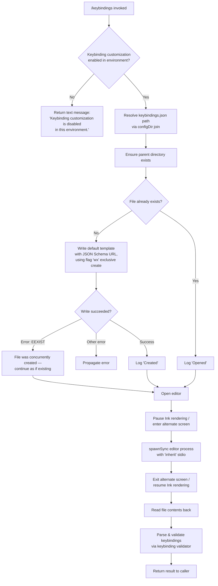

# `/keybindings`

> Analysis basis: CC v2.1.193 bundle.js (AST extraction + Claude interpretation)
> Minimum version: v2.1.193

---

## Overview

The `/keybindings` command opens the user's keyboard shortcuts configuration file (`keybindings.json`) in an external editor. If the file does not yet exist, it is created with a default template (including a JSON Schema reference) before the editor is launched. The command is gated behind an environment capability check and emits a feature-release telemetry event on every successful invocation.

---

## Registration

| Field | Value |
|---|---|
| type | `local` |
| name | `keybindings` |
| description | `Open your keyboard shortcuts file` |
| supportsNonInteractive | `false` |
| module_id | `ERl` |
| load_inline | `true` |
| loc_byte | `11834061` |
| loc_byte_end | `11834238` |
| loc_line | `7916` |
| arbor_handler.name | `BSf` |
| arbor_handler.fqn | `claude-2.1.193::BSf` |
| arbor_handler.kind | `AsyncFunction` |
| arbor_handler.resolution_path | `module_id` |
| arbor_handler.n_hits | `0` |

Analysis basis: CC v2.1.193 bundle.js:+11834061

---

## Input Branching

The command has 4+ distinct branches (environment guard, file-exists check, file-creation error handling, and editor launch), so a Mermaid flowchart is used.



---

## Behavioral Spec

### 1. Environment Capability Guard

Before any file I/O, the handler (`BSf`) queries the current environment's feature flags to determine whether keybinding customization is permitted.

```
async function openKeybindingsCommand(context):
    if not isKeybindingCustomizationEnabled(context.environment):
        return {
            type: "text",
            content: "Keybinding customization is disabled in this environment."
        }
    // continue to file resolution
```

Analysis basis: CC v2.1.193 bundle.js:+11833345, +11833358

The string `"Keybinding customization is disabled in this environment."` is returned as a `"text"`-typed message when the guard fails.

---

### 2. Keybindings File Path Resolution

The path to `keybindings.json` is computed by joining the Claude Code configuration directory path with the literal filename `"keybindings.json"`.

```
function resolveKeybindingsPath(configDir):
    return pathJoin(configDir, "keybindings.json")
```

Analysis basis: CC v2.1.193 bundle.js:+3982861, +3982875

The function `kHe` (config-path resolver) performs this join using `BLn.join` and a helper `nr`.

---

### 3. Default File Template Construction

When the file is being created for the first time, a default JSON template is assembled. The template includes:

- A `$schema` field pointing to `"https://www.schemastore.org/claude-code-keybindings.json"` to enable editor validation.
- A documentation URL reference to `"https://code.claude.com/docs/en/keybindings"`.
- A set of default keybinding entries derived from the current keybinding map (`W1t`), filtered through `FSf` (default-keybindings-formatter).

```
function buildDefaultTemplate(currentKeybindings):
    schemaURL = "https://www.schemastore.org/claude-code-keybindings.json"
    docsURL   = "https://code.claude.com/docs/en/keybindings"

    entries = formatKeybindingEntries(currentKeybindings)
    // each entry trimmed via o9e (trim-whitespace helper)
    // keys iterated via Object.entries / Object.keys

    template = {
        "$schema": schemaURL,
        // ... keybinding entries ...
    }
    return jsonSerialize(template)
```

Analysis basis: CC v2.1.193 bundle.js:+11833081, +11833146, +11832845, +11832858, +11832914, +11833017

---

### 4. Exclusive File Write (Create-if-Absent)

The handler attempts to write the default template using the `"wx"` flag, which causes the write to fail atomically if the file already exists.

```
async function createKeybindingsFile(filePath, templateContent):
    parentDir = path.dirname(filePath)
    fs.mkdirSync(parentDir, { recursive: true })

    try:
        await fs.writeFile(filePath, templateContent, { flag: "wx" })
        logAction("Created")
    except error:
        if error.code == "EEXIST":
            // race condition: another process created it — treat as existing
            logAction("Opened")
        else:
            throw error
```

Analysis basis: CC v2.1.193 bundle.js:+11833479, +11833524, +11833543, +11833551, +11833637, +11833646

---

### 5. Editor Launch (External Process)

The command determines the appropriate editor executable by inspecting the environment (IDE detection via `WL`, which checks for an `"IDE"` environment marker). The Ink terminal renderer is paused and the alternate terminal screen is entered before the editor subprocess is spawned synchronously, then restored afterwards.

```
function launchEditor(filePath, terminalContext):
    editorCommand = resolveEditorCommand(environment)
    // resolveEditorCommand calls WL which checks for "IDE" environment
    // and uses UP.basename / di (path-basename / index-slicer helpers)

    terminalContext.enterAlternateScreen()
    terminalContext.pause()
    terminalContext.suspendStdin()

    args = buildEditorArgs(editorCommand, filePath)
    // args split from command string via s.split

    result = spawnSync(editorCommand, args, { stdio: "inherit" })

    terminalContext.exitAlternateScreen()
    terminalContext.resumeStdin()
    terminalContext.resume()

    return result
```

Analysis basis: CC v2.1.193 bundle.js:+11773394, +11773424, +11773434, +11773516, +11773548, +11773896, +11773925, +11773941

---

### 6. Post-Edit File Read and Validation

After the editor exits, the handler reads the file back and parses and validates the keybindings. The validator (`xMo` / `w0l`) trims entries, checks prefix requirements (`n.startsWith`), extracts basenames, checks against an allowed-keys set (`eSf`), and performs case-normalisation (`r.toLowerCase`). The `tSf.find` call locates matching binding entries, and `t.includes` verifies membership.

```
function readAndValidateKeybindings(filePath):
    raw = fs.readFileSync(filePath, "utf-8")
    parsed = JSON.parse(raw)

    validated = []
    for entry in parsed:
        normalised = trim(entry)
        if not normalised.startsWith(expectedPrefix):
            continue
        key = path.basename(normalised)
        if not allowedKeysSet.has(key.toLowerCase()):
            continue
        validated.append(resolveKeybindingEntry(normalised))

    return validated
```

Analysis basis: CC v2.1.193 bundle.js:+11773818, +11771500, +11771573, +11771606, +11771625, +11771633, +11771719, +11771733, +11771747

---

### 7. Configuration File Subsystem (bSt / kt)

The underlying config-read helper (`bSt`, config-file-reader) enforces an access guard ("Config accessed before allowed." — raises an `Error` if invoked prematurely), reads via `r.readFileSync` with `"utf-8"` encoding, handles `"ENOENT"` gracefully, manages a backup-rotation scheme (reading directory listings, copying files with `Date.now`-stamped names, bounded by a `Set`-based deduplication via `i9o`), and emits `tengu_config_parse_error` on parse failure.

```
function configFileReader(configPath, options):
    if not accessAllowed:
        throw new Error("Config accessed before allowed.")

    try:
        raw = fs.readFileSync(configPath, "utf-8")
    except error:
        if error.code == "ENOENT":
            return defaultValue
        throw error

    try:
        return JSON.parse(raw)
    except parseError:
        rotateBackup(configPath)
        emitTelemetry("tengu_config_parse_error")
        return defaultValue
```

Analysis basis: CC v2.1.193 bundle.js:+13975970, +13976026, +13976053, +13976236, +13976531, +13977384

---

### 8. Safe-Mode Check

`El` (safe-mode-checker) and `Cb` (safe-mode-UI) are reached from `BSf` at the tail of the call graph. They inspect CLI args for `"--safe-mode"` and, if active, display a notice with recovery instructions (`"restart without --safe-mode"` / `"unset CLAUDE_CODE_SAFE_MODE"`).

Analysis basis: CC v2.1.193 bundle.js:+11833682, +11833785, +70258, +70313, +70343

---

## State & Side Effects

| Item | Detail |
|---|---|
| Telemetry: `tengu_keybinding_customization_release` | Emitted at bundle.js:+3982361, called from `y8` on every successful invocation to track feature release usage |
| Telemetry: `tengu_config_parse_error` | Emitted at bundle.js:+13977384 when the config file fails JSON parsing; triggers backup rotation |
| File creation | `keybindings.json` written (exclusive `"wx"` flag) in Claude config directory on first use |
| Directory creation | Parent config directory created via `mkdirSync` with `recursive: true` if absent |
| Backup rotation | Config-subsystem rotates corrupt config files using `Date.now`-stamped copies; deduplication via a module-level `Set` (`i9o`) |
| Terminal state | Ink rendering paused + alternate screen entered for editor process; restored on exit |
| Stdin | Suspended before editor spawn; resumed after |
| External process | `spawnSync` with `stdio: "inherit"` — blocks the CLI process for the duration of the editor session |
| GrowthBook experiment | `RGr` emits a `"GrowthbookExperimentEvent"` with source `"firstParty"` (bundle.js:+3334922, +3335011) |
| JSON Schema URL | Written into the created file: `https://www.schemastore.org/claude-code-keybindings.json` |
| appState changes | <!-- TODO: not found in depth-2 traversal; needs --depth 4 --> |
| Sound | <!-- TODO: not found in depth-2 traversal; needs --depth 4 --> |

---

## Version History

| Version | Change |
|---|---|
| v2.1.193 | Initial analysis |

---

## Common Mistakes

1. **Running in a non-interactive environment**: `/keybindings` sets `supportsNonInteractive: false`. Invoking it in a non-interactive session (e.g., piped input or headless CI) will be rejected before the handler executes.
2. **Assuming the file always pre-exists**: On first use the file is created from a default template. Concurrent invocations may race on the `"wx"` write; the `EEXIST` branch handles this gracefully, but external tooling that checks for the file before running `/keybindings` may observe a brief window where it is absent.
3. **Editing `keybindings.json` while Claude Code is running**: The file is read back immediately after the editor exits. External changes made after that read (but before Claude Code restarts) will not be reflected until the next session.
4. **Using `--safe-mode`**: When Claude Code is started with `--safe-mode`, the `/keybindings` command surfaces a notice and may not allow the full file-open flow. Restart without the flag or unset `CLAUDE_CODE_SAFE_MODE`.
5. **Missing `$EDITOR` / IDE environment variable**: The editor resolution (`WL`) looks for an `"IDE"` environment marker. If neither an IDE integration nor a standard editor variable is configured, the editor launch may fail silently or fall back to an unexpected default.
6. **Assuming keybindings take effect immediately**: The keybinding validation happens at read-back time, but the actual keybinding registry is not described as being reloaded within the same session by the depth-2 traversal — restart may be required.

---

## Appendix — Identifier Mapping

> For bundle debugging only. Identifiers change across versions.

| Identifier | Role |
|---|---|
| `BSf` | Main async handler for `/keybindings` (arbor_handler) |
| `y8` | Feature-release telemetry emitter (fires `tengu_keybinding_customization_release`) |
| `it` | Keybinding feature-flag / experiment gate |
| `KPt` | Experiment condition check helper (reached from gate) |
| `zPt` | Experiment condition check helper B (reached from gate) |
| `H5` | Feature-flag resolver |
| `h5` | Flag store reader |
| `lCn` | Experiment assignment / caching layer |
| `RGr` | GrowthBook experiment event emitter |
| `UGr` | Experiment assignment writer |
| `kt` | Config-file accessor / watcher |
| `jt` | Config-path resolver primitive |
| `a9o` | Config accessor helper |
| `bSt` | Config file reader (handles ENOENT, parse errors, backup rotation) |
| `xjf` | Config file watcher / unwatcher |
| `kHe` | Keybindings file path builder (`configDir + "keybindings.json"`) |
| `qs` | Async-local-storage store accessor |
| `hRl` | Default keybindings template builder (calls `FSf` and `ke`) |
| `FSf` | Keybinding entry formatter (maps `W1t`, uses `Object.entries`/`Object.keys`) |
| `o9e` | Whitespace trimmer for keybinding values |
| `ke` | JSON serialiser wrapper (`JSON.stringify`) |
| `an` | Error / result handler for write step |
| `yq` | External editor launcher (pauses Ink, spawnSync, resumes) |
| `FG` | Editor environment detector helper |
| `Xh` | Editor environment check primitive |
| `aSf` | Post-edit keybinding validator dispatcher |
| `xMo` | Keybinding parse / filter pipeline |
| `w0l` | Individual keybinding entry validator (trim, startsWith, basename, set lookup) |
| `WL` | Editor command resolver (checks `"IDE"` environment marker) |
| `di` | String index-slicer utility |
| `El` | Safe-mode checker |
| `at` | CLI argument string converter |
| `Ctn` | Safe-mode UI notice renderer |
| `Cb` | Safe-mode notice dispatcher |

---

Note: index built via Arbor fallback; some signals (telemetry, literals) may be missing — see arbor-fallback.js.