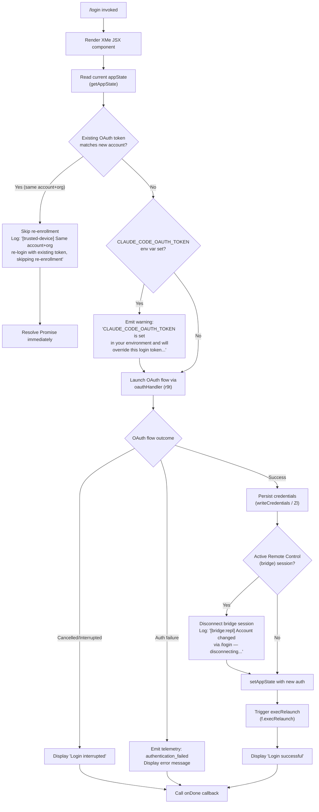

# `/login`

> Analysis basis: CC v2.1.193 bundle.js (AST extraction + Claude interpretation)
> Minimum version: v2.1.193

---

## Overview

The `/login` command allows the user to switch Anthropic accounts or sign in with an Anthropic account from within an active Claude Code session. It launches an interactive OAuth-based authentication flow, persists the resulting credentials, and then triggers a session relaunch so the new account takes effect immediately. The command is rendered as a local JSX component (`XMe`) that orchestrates the full sign-in UI and post-authentication state transitions.

---

## Registration

| Field | Value |
|---|---|
| type | `local-jsx` |
| name | `login` |
| description | `Switch Anthropic accounts \| Sign in with your Anthropic account` |
| module_id | `wYa` |
| load_inline | `true` |
| loc_byte | `11840835` |
| loc_byte_end | `11841055` |
| loc_line | `7916` |
| arbor_handler.name | `RRl` |
| arbor_handler.fqn | `claude-2.1.193::RRl` |
| arbor_handler.kind | `Function` |
| arbor_handler.resolution_path | `direct` |
| arbor_handler.n_hits | `2` |

Analysis basis: CC v2.1.193 bundle.js:+11840835

---

## Input Branching

The command has more than three distinct execution branches: (1) normal OAuth login success, (2) login interrupted/cancelled, (3) same-account re-login with existing token (trusted-device skip), (4) `CLAUDE_CODE_OAUTH_TOKEN` environment variable override warning, (5) authentication failure, and (6) Remote Control session disconnect on account change. A Mermaid flowchart is used.



Analysis basis: CC v2.1.193 bundle.js:+9133095 (handler entry `YMe`), +9133818 (bridge disconnect log), +9134087 (trusted-device skip log), +9134712 (env var warning), +9135132 (success literal), +9135151 (interrupted literal), +9134575 (authentication_failed literal)

---

## Behavioral Spec

### Top-Level Handler — loginCommandHandler (YMe)

The primary logic resides in `YMe`, the main handler function called when the command is invoked.

```
function loginCommandHandler(context):
    currentState = context.getAppState()

    // Trigger a global API key change notification
    context.onChangeAPIKey()

    // Apply any pending message operations
    context.applyMessageOp()

    // Initialize timestamp via timestampFactory (I7e → Date.now)
    ts = timestampFactory()

    // Resolve auth provider category (_r → at)
    provider = resolveAuthProvider(currentState)
    // provider ∈ { "bedrock", "foundry", "anthropicAws", "mantle",
    //              "vertex", "firstParty", "gateway" }

    // Load remote managed settings (z6e)
    remoteSettings = loadRemoteSettings(currentState)

    // Deep-compare current vs stored session (Vjn → Bun.deepEquals)
    if sessionUnchanged(currentState):
        return Promise.resolve()

    // Retrieve stored credentials map (wu.get)
    storedCreds = credentialsMap.get(currentState.sessionId)

    // Perform OAuth login flow (r9t)
    loginResult = await oauthLoginFlow(context, storedCreds)

    if loginResult.status == "success":
        // Check for bridge/remote-control session
        if currentState.hasBridgeSession:
            log("[bridge:repl] Account changed via /login — disconnecting Remote Control session")
            disconnectBridgeSession()

        // Persist new credentials (Zl → hXs)
        writeCredentials(loginResult.token)

        // Update application state
        context.setAppState({ auth: loginResult.auth })

        // Trigger session relaunch (f.execRelaunch)
        scheduleRelaunch()

    else if loginResult.status == "interrupted":
        displayMessage("Login interrupted")
        context.onDone()

    else if loginResult.status == "auth_failure":
        emitTelemetry("authentication_failed")
        displayError(loginResult.error)
        context.onDone()
```

Analysis basis: CC v2.1.193 bundle.js:+9133095, +9133284, +9133318, +9133370, +9133565, +9133735, +9133820, +9133908

### OAuth Login Flow — oauthLoginFlow (r9t)

```
async function oauthLoginFlow(context, storedCreds):
    // Check policy enforcement (isPolicyAllowed / isPolicyEnforced)
    if not context.isPolicyAllowed("login"):
        return { status: "auth_failure", error: "policy_denied" }

    // Warn if CLAUDE_CODE_OAUTH_TOKEN env var is present
    if env.CLAUDE_CODE_OAUTH_TOKEN is set:
        displayWarning(
            "Warning: CLAUDE_CODE_OAUTH_TOKEN is set in your environment " +
            "and will override this login token at runtime. After logging in, " +
            "unset that variable for your new credentials to take effect."
        )

    // Trusted-device shortcut
    if storedCreds.deviceToken exists AND accountMatches(storedCreds):
        log("[trusted-device] Same account+org re-login with existing token, skipping re-enrollment")
        return { status: "success", token: storedCreds.deviceToken }

    // Build OAuth URL (Rs → environment resolution)
    oauthUrl = buildOAuthUrl(context.environment)
    // environment values: "prod", "local", "staging"
    // prod client_id: "22422756-60c9-4084-8eb7-27705fd5cf9a"

    // POST to bridge trusted device enrollment endpoint (fo.post)
    response = await fetch(oauthUrl, {
        method: "POST",
        headers: {
            "Content-Type": "application/json",
            "User-Agent": userAgent
        },
        timeout: 10000   // 10 s (bundle.js:+7357835)
    })

    if response.status == 201:
        deviceToken = response.body.device_token
        if not deviceToken:
            emitTelemetry("bridge_trusted_device_enroll",
                          { result: "missing_token" })
            return { status: "auth_failure", error: "missing_token" }
        // Store token via writeCredentials (Zl)
        storeResult = await writeCredentials(deviceToken)
        if storeResult.failed:
            emitTelemetry("bridge_trusted_device_enroll",
                          { result: "storage_failed" })
        return { status: "success", token: deviceToken }

    else if response.status in [4xx, 5xx]:
        emitTelemetry("bridge_trusted_device_enroll", { result: "http_error" })
        return { status: "auth_failure", error: "http_error" }

    return { status: "interrupted" }
```

Analysis basis: CC v2.1.193 bundle.js:+7357114, +7357428, +7357541, +7357642, +7357792, +7357807, +7357835, +7357937, +7358023, +7358142, +7358220, +7358321, +7358529, +9134087, +9134712

### Credential Storage — writeCredentials (Zl / hXs)

```
async function writeCredentials(token):
    // Attempt primary secure storage write
    try:
        result = await primarySecureStorage.write(token)
        emitTelemetry("secure_storage_credentials_write", { path: "primary" })
        return { ok: true }
    catch primaryError:
        if isTransientError(primaryError):
            // Skip fallback for transient failures
            emitTelemetry("secure_storage_credentials_write",
                          { path: "primary_transient_skip_fallback" })
            return { ok: false, error: primaryError }

        // Attempt plaintext fallback
        try:
            fallbackStorage.write(token)
            emitTelemetry("secure_storage_credentials_write",
                          { path: "plaintext_fallback_used" })
            return { ok: true, fallback: true }
        catch fallbackError:
            emitTelemetry("secure_storage_credentials_write",
                          { path: "primary_and_fallback_failed" })
            return { ok: false, error: fallbackError }
```

Analysis basis: CC v2.1.193 bundle.js:+2345759, +2345857, +2346006, +2346109

### Auth Provider Resolution — resolveAuthProvider (_r → at)

```
function resolveAuthProvider(state):
    raw = at(state)   // lower-level string conversion
    switch raw:
        case "bedrock":        return "bedrock"
        case "foundry":        return "foundry"
        case "anthropicAws":   return "anthropicAws"
        case "mantle":         return "mantle"
        case "vertex":         return "vertex"
        case "firstParty":     return "firstParty"
        case "gateway":        return "gateway"
        default:               return "firstParty"
```

Analysis basis: CC v2.1.193 bundle.js:+2138551, +2138591, +2138641, +2138697, +2138751, +2138799, +2138808

### Post-Login Relaunch — execRelaunch (f)

```
async function execRelaunch(context):
    // Kill existing daemon workers (D.kill → SIGKILL)
    for worker in context.activeWorkers:
        worker.kill("SIGKILL")

    // Brief delay for cleanup
    await sleep(jitter(Math.random, 2, 1))  // constants at +14343445, +14343447

    // Spawn new session process
    context.Uq.spawn(newProcessArgs)
```

Analysis basis: CC v2.1.193 bundle.js:+9133370, +17482207, +14343445, +14343447, +14343484, +17483921

### JSX Render Component — loginJsxComponent (XMe)

```
function loginJsxComponent(props):
    // Consume AppState context (CYa.c)
    appState = useAppState()

    // Auth state via cb/yt (useSyncExternalStore)
    authState = useAuthStore()

    // Local interaction state
    [loginState, setLoginState] = useState(null)

    // Register key handler (Nr → s.registerHandler)
    useEffect(() => {
        registerKeyHandler("confirm:no", handleKeyPress)
    }, [])

    // Memoize OAuth component (UEo.useMemo)
    oauthUI = useMemo(() => buildOAuthUI(authState), [authState])

    // Parse incoming input (jjn, IE, g$)
    parsedInput = parseInput(props.input)

    // Render branching
    if loginState == "success":
        return jsx("Login successful")   // literal at +9135132
    else if loginState == "interrupted":
        return jsx("Login interrupted")  // literal at +9135151
    else:
        return jsxs([oauthUI, settingsPanel])
        // settingsPanel label: "Settings" (+9135518), "Global" (+4206274)
        // Exit hint: "Press Esc again to exit" (Esc: +9135764)
```

Analysis basis: CC v2.1.193 bundle.js:+9135215, +9135227, +9135245, +9135274, +9135393, +9135518, +9135549, +9135643, +9135704

### Remote Settings Refresh — remoteSettingsLoad (z6e)

On login, the handler calls `z6e` which initiates a pull of remote managed settings. If the remote settings load is deferred (consent dialog pending), a timeout log message fires.

```
function loadRemoteSettings(context):
    // Notify settings change (IP.notifyChange via pFn)
    notifySettingsChange()

    // Start settings fetch (Ouo → vX → Yxa)
    fetch = beginRemoteSettingsFetch({
        headers: {
            "User-Agent":     userAgent,
            "Cache-Control":  "no-cache",
            "If-None-Match":  cachedETag
        }
    })

    // Timeout guard
    timeoutMs = setTimeout(() => {
        log("Remote settings: Loading promise timeout deferred — consent dialog pending")
        // +7407884
    }, CONSENT_TIMEOUT)

    result = await fetch
    switch result.status:
        case 200: applyNewSettings(result.body)
                  log("Remote settings: Fetched successfully")  // +7410418
        case 304: log("Remote settings: Using cached settings (304)")  // +7409572
        case 401: emitTelemetry("tengu_remote_settings_401_force_refresh_retry")
        case 404: saveEmptySentinel()
                  log("Remote settings: Saved empty sentinel (404 response)")  // +7412832
        default:  log("Remote settings: Using stale cache after fetch failure")  // +7412074
```

Analysis basis: CC v2.1.193 bundle.js:+7413468, +7413498, +7413510, +7407884, +7407976, +7409572, +7410418, +7412074, +7412832

### Policy Limits Polling — policyLimitsHandler (fjt)

After login, policy limits are refreshed (called via `fjt → jor → PZl`).

```
function refreshPolicyLimits(authToken):
    // Check cache freshness (MZl → RZl.statSync + Date.now)
    if cache.isValid():
        log("Policy limits: Cache still valid (304 Not Modified)")
        return cachedLimits

    // Fetch from server (ajf → UA → aH)
    response = await fetchPolicyLimits(authToken)
    emitTelemetry("tengu_policy_limits_fetch", { status: response.outcome })

    switch response.outcome:
        case "succeeded":
            applyPolicyLimits(response.data)
            log("Policy limits: Applied new restrictions successfully")  // +13953296
        case "stale_cache_used":
            log("Policy limits: Using stale cache after fetch failure")  // +13952912
        case "request_failed":
            log("Policy limits: Using stale cache after error")          // +13953488
        case "unexpected_error":
            log("Policy limits: Using stale cache after error")
```

Analysis basis: CC v2.1.193 bundle.js:+13954366, +13954372, +13952185, +13952338, +13952485, +13953296, +13952912, +13953488

---

## State & Side Effects

| Item | Detail |
|---|---|
| Telemetry | `tengu_remote_settings_401_force_refresh_retry` (+7410776), `tengu_feature_bad` (+1026821), `tengu_feature_ok` (+1026754), `tengu_managed_settings_security_dialog_shown` (+7406259), `tengu_managed_settings_security_dialog_accepted` (+7405943), `tengu_managed_settings_security_dialog_rejected` (+7405993), `tengu_bg_dispatch_sigkill_escalate` (+17482166), `tengu_daemon_config_reload` (+17498707), `tengu_bg_low_mem_mb` (+13266461), `tengu_bg_dispatch_low_mem` (+17482767), `tengu_daemon_idle_exit` (+17504149), `tengu_bg_spare_enable` (+17483464), `tengu_bg_sendclaim_failed` (+17458401), `tengu_daemon_control` (+17520352), `tengu_bg_state_read_transient` (+4296462), `tengu_bg_roster_parse_failed` (+11725680), `tengu_bg_spare_claim` (+17483592), `tengu_bg_spare_claim_fail` (+17483858), `tengu_config_auth_loss_prevented` (+13970545), `tengu_policy_limits_fetch` (+13952485), `tengu_feature_sad` (+1026902), `tengu_policy_limits_cache_write_failed` (+13951888), `tengu_disable_bypass_permissions_mode` (+13834248), `tengu_auto_mode_config` (+13832039), `tengu_keybinding_fallback_used` (+4258604) |
| Hook registration | Key handler registered via `Nr → s.registerHandler` for `"confirm:no"` action (+9135549); escape key binding `"Esc"` (+9135764) |
| appState changes | `setAppState` called with new auth credentials after successful login (+9133908); `getAppState` read at start of flow (+9133735) |
| Credential persistence | Writes to secure storage via `Zl → hXs`; falls back to plaintext if secure storage unavailable (+2345759–+2346109) |
| Remote Control (bridge) disconnect | If a bridge session is active when account changes, it is disconnected (+9133820) |
| Session relaunch | `f.execRelaunch` is called after successful credential write (+9133370); running workers receive `SIGKILL` (+17482214) |
| Remote settings refresh | `z6e` triggers a remote managed settings pull on login (+7413468) |
| Policy limits refresh | `fjt` triggers a policy limits reload after auth change (+13954412, +13954440) |
| Feature flags refresh | `uCn → e.refreshFeatures` called post-login (+3343203) |
| Sound | <!-- TODO: not found in depth-2 traversal; needs --depth 4 --> |

---

## Version History

| Version | Change |
|---|---|
| v2.1.193 | Initial analysis |

---

## Common Mistakes

1. **Leaving `CLAUDE_CODE_OAUTH_TOKEN` set in the environment after logging in** — the env var takes precedence over the freshly persisted token at runtime, meaning the new account credentials will not be used until the variable is unset (warning literal at bundle.js:+9134712).

2. **Expecting an immediate effect without session relaunch** — `/login` schedules `execRelaunch`, which kills the current process and respawns it. Any in-flight work or unsaved state will be lost; do not invoke `/login` mid-task.

3. **Triggering `/login` while a Remote Control (bridge) session is active** — the bridge session is forcibly disconnected on account change (bundle.js:+9133820). Remote collaborators will lose their connection without further warning.

4. **Assuming re-login re-enrolls the trusted device** — if the same account and organization are detected and a valid device token already exists, trusted-device enrollment is silently skipped (bundle.js:+9134087).

5. **Using a custom OAuth URL that is not on the approved list** — the `Rs` resolver validates the OAuth endpoint against a known set (`"prod"`, `"local"`, `"staging"`); any other value triggers the error `"CLAUDE_CODE_CUSTOM_OAUTH_URL is not an approved endpoint."` (bundle.js:+865226).

---

## Appendix — Identifier Mapping

> For bundle debugging only. Identifiers change across versions.

| Identifier | Role |
|---|---|
| `RRl` | Arbor-resolved handler for `/login` (top-level entry, `resolution_path: direct`) |
| `YMe` | Main login command handler function |
| `aGp` | JSX wrapper / container component for the login command |
| `XMe` | Login JSX render component (UI layer) |
| `r9t` | OAuth login flow orchestrator |
| `z6e` | Remote managed settings loader |
| `fjt` | Policy limits refresh coordinator |
| `Zl` | Credential write dispatcher (secure storage) |
| `hXs` | Low-level credential read/write implementation |
| `vX` | Remote settings fetch core |
| `Yxa` | Remote settings HTTP request executor |
| `Ouo` | Remote settings load orchestrator with timeout guard |
| `$uo` | Remote settings state machine / result processor |
| `pFn` | Settings change notifier (IP.notifyChange) |
| `hyp` | Background settings poll handler |
| `Qxa` | Settings polling scheduler (setInterval/clearInterval via SCn) |
| `aH` | Auth configuration reader (ANTHROPIC_API_KEY lookup) |
| `UA` | OAuth credential assembler |
| `Dy` | Auth resolver combining multiple credential sources |
| `Rc` | Credential resolver entry point |
| `nOt` | Auth type classifier (third_party_provider / custom_base_url / no_auth / oauth paths) |
| `vv` | Auth token builder (ANTHROPIC_AUTH_TOKEN / CLAUDE_CODE_OAUTH_TOKEN paths) |
| `ant` | Auth token reader / env var accessor |
| `KDt` | Auth token type discriminator |
| `_r` | Auth provider string resolver |
| `at` | Auth provider string converter |
| `I7e` | Timestamp factory (wraps Date.now) |
| `Vjn` | Session deep-equality checker (Bun.deepEquals) |
| `_n` | Subscription/state management utility |
| `sun` | State cache lookup (Den.has / Den.get) |
| `Azo` | State cache setter (Den.set) |
| `Svr` | State subscription registration |
| `yB` | Composite state initializer |
| `f` | Exec-relaunch / process lifecycle manager |
| `D` | Worker process spawner / killer |
| `gVo` | Background session roster manager |
| `cVo` | Daemon claim / socket auth handler |
| `w9o` | Daemon config writer ($q.writeFile) |
| `tHm` | Send-claim timeout handler |
| `nHm` | Socket connection helper (mur.connect) |
| `Un` | Async retry / abort utility |
| `wX` | Exponential back-off calculator (Math.min / Math.pow / Math.random) |
| `cb` | Auth store consumer (useSyncExternalStore wrapper) |
| `yt` | Store accessor (MLe.useContext + MLe.useSyncExternalStore) |
| `Gqr` | AppState context reader |
| `LWe` | Auth subscription effect (Bjn.useReducer / useEffect) |
| `v7` | Feature-flag subscription (Jnt.subscribe) |
| `yLi` | Async feature-flag notifier |
| `jjn` | Input parser dispatcher |
| `IE` | Raw input normalizer (trim + model alias resolution) |
| `g$` | Model token/identifier parser |
| `bYs` | Model enumeration / policy enforcer |
| `wa` | Model string normalizer and alias expander |
| `lC` | Parsed-input-to-model-spec converter |
| `p_n` | Full model specification builder |
| `d_n` | Model spec finalizer |
| `$1r` | Model spec serializer |
| `qo` | Model alias resolver (sonnet / haiku / opus / fable etc.) |
| `oH` | Model resolution entry (wraps qo + lC) |
| `Nr` | Key-handler registrar (s.registerHandler) |
| `bS` | Context consumer helper (mst.useContext) |
| `Wm` | Settings panel component |
| `n4i` | Settings sub-panel factory |
| `Szr` | Interactive settings form component |
| `s3` | Timer-based UI utility (WLe.useRef / useCallback / useEffect) |
| `$u` | Settings action dispatcher |
| `uCn` | Feature-flag refresh coordinator (e.refreshFeatures + SLi + ALi) |
| `SLi` | Feature-flag payload applicator (vwe / aCn / ZW maps) |
| `ALi` | Feature-flag snapshot exporter |
| `mn` | Telemetry event emitter |
| `f9` | Global config persistence handler |
| `SYa` | Config write validator |
| `Xmt` | Config environment variable merger |
| `kt` | Telemetry dispatch sink |
| `oC` | Active-session tracker |
| `l_s` | CA certificate cache clearer |
| `f_s` | mTLS config cache clearer |
| `GRr` | Proxy agent cache clearer |
| `l0t` | Network proxy configurator (undici) |
| `Bz` | Proxy URL parser |
| `BPs` | Proxy agent builder |
| `PZl` | Policy limits fetch/apply cycle |
| `MZl` | Policy limits cache freshness checker |
| `rOt` | Policy limits file reader |
| `ajf` | Policy limits auth resolver |
| `ljf` | Policy limits retry scheduler |
| `ujf` | Policy limits file writer |
| `OZl` | Policy limits polling loop |
| `pjf` | Policy limits poll tick |
| `jor` | Policy limits background scheduler |
| `K3o` | Policy event emission checker |
| `eHe` | Policy event validator |
| `z7s` | Policy event emitter (K7s.emit) |
| `Bor` | Policy limits load-timeout guard |
| `D$` | Policy limits state container |
| `nOt` | Auth path classifier (also used in policy context) |
| `kwe` | Policy limits file path resolver (YLi.join) |
| `fjt` | Policy limits top-level entry (called post-login) |
| `Rc` | Top-level auth resolver (Dy wrapper) |
| `$ae` | Feature-flag cleanup / teardown (Qnt + Jnt.emit) |
| `Qnt` | Feature-flag map clearer (vwe / aCn / VPt / MGr / ZW) |
| `FGr` | Interval/listener remover (clearInterval + process.removeListener) |
| `zjn` | Post-login state reset dispatcher |
| `EYa` | Login state cache clearer (BEo.clear) |
| `Bco` | App store initializer (ro + lo + Zl) |
| `lo` | React root renderer (hNe / Edr / KZt.bind / UVo.set) |
| `Zl` | Credential storage dispatcher |
| `r9t` | OAuth login flow (trusted-device enrollment, policy checks) |
| `Rs` | OAuth URL validator / environment resolver |
| `k$` | Feature-flag gate for login (KPt / zPt / H5 / kt) |
| `TLi` | Feature-flag value reader (ZW.has / ZW.get / s.getFeatureValue) |
| `i_p` | Login UI sub-component (LF / lo) |
| `Oco` | Login confirmation handler (Xc / lo) |
| `Tln` | Trusted-device token validator |
| `cjt` | Permission-mode setter dispatcher |
| `Yjn` | Permission-mode gate ($Gr) |
| `$Gr` | Permission-mode feature flag checker |
| `S9t` | Permission-mode state updater (_H) |
| `_H` | Permission rule manager (setMode / addRules / replaceRules) |
| `Ur` | Remote-control state accessor (getAppState / F7n / B7n) |
| `F7n` | Remote-control working-directory resolver |
| `B7n` | Remote-control tool-list resolver |
| `F$` | Remote-control permission enforcer |
| `ujt` | Auto-mode config reader (djt) |
| `djt` | Auto-mode eligibility evaluator |
| `L7` | Feature-flag auto-mode gate (cCn) |
| `H3o` | Auto-mode Go resolver |
| `As` | Model availability enforcer |
| `Dhe` | Model deprecation checker |
| `to` | Model string classifier |
| `JHe` | Remote-control event emitter (Jc) |
| `Jc` | Event serializer / emitter |
| `qAe` | Auto-mode config map builder |
| `Zmt` | Last-message finder (nw.findLast) |
| `nw` | Conversation history tail accessor |
| `TS` | Theme context consumer (h9e.useContext) |
| `Gqr` | AppState context validator (ReferenceError guard) |