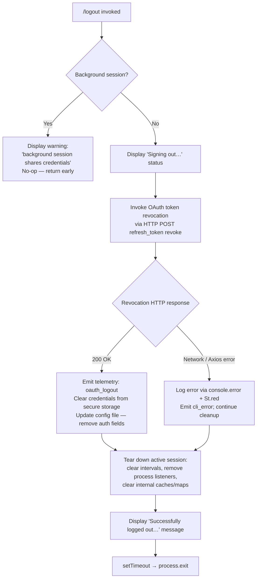

# `/logout`

> Analysis basis: CC v2.1.193 bundle.js (AST extraction + Claude interpretation)
> Minimum version: v2.1.193

---

## Overview

The `/logout` command signs the authenticated user out of their Anthropic account by revoking the active OAuth token, clearing stored credentials from secure storage and the configuration file, tearing down active sessions, and then exiting the CLI process. It is a destructive, single-shot operation: once invoked, the current process terminates after displaying a confirmation message.

---

## Registration

| Field | Value |
|---|---|
| type | `local-jsx` |
| name | `logout` |
| description | Sign out from your Anthropic account |
| loc_byte | 11841116 |
| loc_byte_end | 11841400 |
| loc_line | 7916 |
| module_id | `Fgo` |
| load_inline | `true` |
| arbor_handler.name | `CNp` |
| arbor_handler.fqn | `claude-2.1.193::CNp` |
| arbor_handler.kind | `AsyncFunction` |
| arbor_handler.resolution_path | `module_id` |
| arbor_handler.n_hits | 0 |

Analysis basis: CC v2.1.193 bundle.js:+11841116

---

## Input Branching

The command has four distinct execution paths determined by session context and the OAuth token-revocation outcome. A Mermaid flowchart is used.



Analysis basis: CC v2.1.193 bundle.js:+8313572 (background-session guard), +8313921 (status text), +8313766 (success message), +8313830 (setTimeout/exit)

---

## Behavioral Spec

### 1. Entry Point — Handler (`CNp`)

The Arbor-resolved async handler for `/logout` is `CNp` (see Appendix). It is registered via an inline `load:()=>Promise.resolve({call: CNp})` shape within module `Fgo`.

```
async function logoutHandler(sessionContext, appState):
    // Background-session guard
    if isBackgroundSession(sessionContext):
        renderWarning(
            "This background session shares credentials … " +
            "Run /logout from your main terminal to sign out."
        )
        return   // early exit — no credential changes

    // Phase 1: status indicator
    renderStatusMessage("Signing out…")

    // Phase 2: revoke OAuth token remotely
    try:
        revokeOAuthToken()                // HTTP POST, grant_type=refresh_token
    catch networkError:
        logErrorToConsole(networkError)   // console.error + red styling
        recordCliError("cli_error")

    // Phase 3: local credential teardown
    clearSecureStorageCredentials()       // wipes keychain / plaintext fallback
    removeAuthFromConfig()                // writes config sans auth fields
    emitTelemetry("oauth_logout")

    // Phase 4: session teardown
    tearDownSession(appState)

    // Phase 5: exit
    renderSuccessMessage(
        "Successfully logged out from your Anthropic account."
    )
    setTimeout(() => process.exit(), DELAY_MS)
```

Analysis basis: CC v2.1.193 bundle.js:+8313462 (`CNp→Ks`), +8313473 (`CNp→R9e`), +8313535 (`CNp→Opt`), +8313570 (`CNp→e`), +8313746 (`CNp→R9a.jsx`), +8313830 (`CNp→setTimeout`), +8313846 (`CNp→Fc`)

---

### 2. Background-Session Guard

```
function isBackgroundSession(ctx):
    // Checks session mode flags; matches "bg", "daemon", "daemon-worker"
    return ctx.mode IN {"bg", "daemon", "daemon-worker"}
```

When the guard fires, a JSX system message is rendered with the literal warning text and the function returns without performing any credential operations.

Analysis basis: CC v2.1.193 bundle.js:+8313572 (warning literal), +2317655 ("bg"), +2317665 ("daemon"), +2317679 ("daemon-worker")

---

### 3. OAuth Token Revocation (`T1` → HTTP client)

```
async function revokeOAuthToken():
    endpoint = resolveOAuthEndpoint(environment)
    // environment check: "prod" | "local" | "staging"
    // local endpoints: localhost:8000, localhost:4000, localhost:3000, localhost:8205
    payload = {
        grant_type: "refresh_token",
        token: currentRefreshToken
    }
    response = await httpClient.post(endpoint, payload, {
        headers: { "Content-Type": "application/json" },
        timeout: 5000
    })
    if response.status == 200:
        emitTelemetry("oauth_token_revoke")
    else if isAxiosError(response):
        classifyError(response)   // "network" | "auth" | "timeout" | "http"
        raise
```

- Timeout: 5000 ms (bundle.js:+2150834)
- Success status expected: 200 (bundle.js:+8313862)
- Telemetry event on success: `oauth_token_revoke` (bundle.js:+2150844)

Analysis basis: CC v2.1.193 bundle.js:+2150676 (`T1→fo.post`), +2150736 ("refresh_token"), +2150791 ("Content-Type"), +2150834 (5000 ms timeout), +2150844 ("oauth_token_revoke"), +2150881 (`fo.isAxiosError`)

---

### 4. Secure Storage Credential Clearing

```
function clearSecureStorageCredentials():
    // Attempts primary secure store (OS keychain)
    result = secureStore.write(emptyCredential)
    if result == "primary_transient_skip_fallback":
        return   // transient failure; skip fallback
    if result == "plaintext_fallback_used":
        writePlaintextFallback(emptyCredential)
    if result == "primary_and_fallback_failed":
        logError("secure_storage_credentials_write failed")
    // Keychain entry deletion may emit "Failed to delete keychain entry"
    // Service name used: "claude-code-user"
```

- Keychain service label: `"claude-code-user"` (bundle.js:+2164480)
- Credential hash algorithm: SHA-256, NFC-normalised, hex-encoded, first 8 chars used as key suffix (bundle.js:+2164285, +2164262, +2164300, +2164327, +2164346)
- Storage write telemetry states: `secure_storage_credentials_write` (bundle.js:+2345759), `primary_transient_skip_fallback` (bundle.js:+2345857), `plaintext_fallback_used` (bundle.js:+2346006), `primary_and_fallback_failed` (bundle.js:+2346109)

Analysis basis: CC v2.1.193 bundle.js:+2164480, +2345759–2346109

---

### 5. Config File Update (`mn` / `saveGlobalConfig`)

```
function removeAuthFromConfig():
    acquireFileLock(configPath)
    currentConfig = readConfigWithLock(configPath)
    // Safety check: refuse to write if cache has auth but re-read does not
    if cachedConfig.hasAuth AND NOT currentConfig.hasAuth:
        logWarning("saveGlobalConfig fallback: re-read config is missing auth…")
        // aborts write to avoid wiping ~/.claude.json
        return
    updatedConfig = omit(currentConfig, ["oauthToken", "refreshToken"])
    writeConfigAtomic(configPath, updatedConfig)
    emitTelemetry("save_global")
    // Backup rotation: keeps up to 5 backups, max age 60000 ms
    rotateBackups(configPath, maxCount=5, maxAge=60000)
```

- Config file: `~/.claude.json`
- Backup subdirectory: `"backups"` (bundle.js:+13975538)
- Max backup count: 5 (bundle.js:+13974955)
- Backup max age: 60 000 ms (bundle.js:+13974700)
- Lock-contention telemetry: `tengu_config_lock_contention` (bundle.js:+13973651)
- Auth-loss prevention telemetry: `tengu_config_auth_loss_prevented` (bundle.js:+13974494)
- Telemetry on successful write: `save_global` (bundle.js:+13970663)

Analysis basis: CC v2.1.193 bundle.js:+8312697 (`Opt→mn`), +13970663, +13974700, +13974955

---

### 6. Session Teardown (`L5t`)

```
function tearDownSession(appState):
    clearCredentialCaches()        // M$n, Lee
    clearTerminalHistory()         // Phe → Chi.clear
    clearEventQueue()              // gwe
    dispatchShutdownEvent()        // $ae → Jnt.emit
    removeProcessListeners()       // Qnt → process.off, process.removeListener
    clearInterval(allTimers)       // FGr → clearInterval
    clearInternalMaps([            // vwe, aCn, VPt, MGr, ZW
        workspaceMap,
        agentMap,
        permissionMap,
        mcpMap,
        zoneMap
    ])
    unregisterSocketFiles()        // Xxa → Jut.unlink
    unregisterDaemonSocketFiles()  // Bgo → bKe.unlink, K3o → clearTimeout
```

Analysis basis: CC v2.1.193 bundle.js:+8313319 (`L5t→M$n`), +8313325 (`L5t→Lee`), +8313331 (`L5t→Phe`), +8313337 (`L5t→gwe`), +8313362 (`L5t→$ae`), +8313416 (`L5t→Xxa`), +8313428 (`L5t→Bgo`), +3342770 (`Qnt→process.off`), +3342896–3342944 (map clears), +7411646 (`Xxa→Jut.unlink`)

---

### 7. Process Exit Sequence (`Fc` / `Ai`)

```
async function exitSequence():
    writeSync(stdout, finalOutput)     // F6e → Vye.writeSync
    unmountInkComponents()             // F6e → e.unmount
    flushLogQueue()                    // O7e → a7o.drain
    await Promise.race([
        drainAllSettled(),             // qLa → Promise.allSettled
        AbortSignal.timeout(2000)      // 2000 ms hard deadline
    ])
    writeSessionEndTelemetry()         // "session_end"
    clearTimeout(exitTimer)
    process.exit(0)
```

- Hard exit timeout after drain: 2000 ms (bundle.js:+7375121)
- Drain race also uses: `Promise.race` + `AbortSignal.timeout` (bundle.js:+7375056, +7375221)
- SIGKILL fallback available in force-exit path (`nuo`, bundle.js:+7372529)

Analysis basis: CC v2.1.193 bundle.js:+8313846 (`CNp→Fc`), +7372644 (`Fc→Ai`), +7374952 (`Ai→ake.unref`), +7375056 (`Ai→Promise.race`), +7375121 (2000), +7375133 (`Ai→clearTimeout`), +7375282 (`Ai→Jbt`), +7375330 ("session_end")

---

## State & Side Effects

| Item | Detail |
|---|---|
| Telemetry: oauth_logout | Emitted after credential wipe (bundle.js:+8313242) |
| Telemetry: oauth_token_revoke | Emitted on successful HTTP 200 from revoke endpoint (bundle.js:+2150844) |
| Telemetry: secure_storage_credentials_write | Emitted per secure-store write attempt with outcome label (bundle.js:+2345759) |
| Telemetry: save_global | Emitted after successful config-file update (bundle.js:+13970663) |
| Telemetry: tengu_config_lock_contention | Emitted when config file lock is contended (bundle.js:+13973651) |
| Telemetry: tengu_config_auth_loss_prevented | Emitted when write is refused to prevent auth wipe (bundle.js:+13974494) |
| Telemetry: tengu_config_auto_repaired | Emitted on parse-error auto-repair of config (bundle.js:+13974164) |
| Telemetry: tengu_config_parse_error | Emitted on config JSON parse failure (bundle.js:+13977384) |
| Telemetry: tengu_config_stale_write | Emitted on stale write detection (bundle.js:+13973787) |
| Telemetry: tengu_config_fallback_write | Emitted when fallback write path is used (bundle.js:+13973267) |
| Telemetry: session_end | Emitted during the exit sequence (bundle.js:+7375333) |
| Telemetry: tengu_cache_eviction_hint | Emitted during scroll/cache management in exit (bundle.js:+7375295) |
| Telemetry: tengu_scroll_summary | Emitted during session wind-down (bundle.js:+7374352) |
| Telemetry: tengu_pewter_brook | Emitted during display-environment detection in exit (bundle.js:+3549210) |
| Telemetry: tengu_startup_perf | Emitted if startup profiling report is flushed on exit (bundle.js:+227522) |
| Telemetry: tengu_feature_ok / tengu_feature_sad / tengu_feature_bad | Emitted by storage feature tracking during credential clear (bundle.js:+1026754, +1026902, +1026821) |
| Telemetry: tengu_daemon_config_reload | Emitted during daemon supervisor state reconciliation (bundle.js:+17498707) |
| Config file mutation | Removes auth/token fields from `~/.claude.json`; atomic write via temp-rename |
| Secure storage mutation | Overwrites or deletes keychain entry under service `"claude-code-user"` |
| Socket file removal | Daemon and IPC socket files unlinked (bundle.js:+7411646, +13954523) |
| Process exit | `process.exit()` called via `setTimeout` after drain (bundle.js:+8313830) |
| Background-session no-op | When session mode is `bg`, `daemon`, or `daemon-worker`, no credentials are touched |

---

## Version History

| Version | Change |
|---|---|
| v2.1.193 | Initial analysis |

---

## Common Mistakes

1. **Running `/logout` in a background or daemon session** — The command detects session mode (`bg`, `daemon`, `daemon-worker`) and displays a warning instead of signing out. Use `/logout` from the primary interactive terminal.
2. **Expecting the process to remain alive after logout** — The handler unconditionally calls `process.exit()` via `setTimeout` after cleanup. Any unsaved in-memory state will be lost.
3. **Network errors do not block logout** — If token revocation fails (timeout 5000 ms, or network error), the CLI continues and clears local credentials anyway. The server-side token may remain valid until natural expiry.
4. **Concurrent Claude Code instances** — The config file uses a file lock. If another instance holds the lock, writing may be delayed or retried; `tengu_config_lock_contention` is emitted in this case.
5. **Auth-loss prevention refusal** — If the on-disk config lacks auth fields that the in-memory cache still has (e.g. file was externally modified), the config write is deliberately skipped to avoid data loss and `tengu_config_auth_loss_prevented` is recorded. The local session still exits, but the on-disk config is left unchanged.

---

## Appendix — Identifier Mapping

> For bundle debugging only. Identifiers change across versions.

| Identifier | Role |
|---|---|
| `CNp` | Main async logout handler (Arbor-resolved entry point) |
| `Opt` | Core logout logic orchestrator (token revocation + session teardown) |
| `vNp` | Outer wrapper / JSX renderer for logout command UI |
| `r` | Session/config read helper called from `Opt` |
| `Is` | Error display and `process.exit` dispatcher |
| `lKe` | CLI error formatter (console.error + red styling) |
| `OT` | Config file writer (writeFileSync path) |
| `Ks` | Session mode checker (bg/daemon/daemon-worker guard) |
| `mve` | Session mode value resolver |
| `L5t` | Session teardown coordinator |
| `M$n` | Credential cache clearer |
| `Lee` | Secondary cache/state clearer |
| `Phe` | Terminal history clearer (`Chi.clear`) |
| `gwe` | Event queue clearer |
| `$ae` | Shutdown event dispatcher + process listener remover |
| `H5` | Higher-order shutdown helper |
| `h5` | Inner shutdown step sequencer |
| `Qnt` | Process listener + interval + map clearer |
| `FGr` | Interval clearer + process.removeListener |
| `xe` | Error recorder / log-queue pusher |
| `eo` | Error constructor / stringifier |
| `at` | String coercion utility |
| `Bi` | Rate-limiter / traffic classifier (`essential-traffic`) |
| `e_u` | Queue shift/push manager |
| `Xxa` | Socket file unlinker for IPC sockets |
| `Zxa` | Socket path resolver |
| `T9t` | Socket index tracker |
| `phs` | Socket path helper |
| `tge` | File path joiner |
| `Scn` | Path join + normalise helper |
| `Bgo` | Daemon socket file unlinker + timeout clearer |
| `K3o` | Daemon socket tracker / timeout clearer |
| `Y3o` | Daemon socket path resolver |
| `eHe` | Socket-set membership tester |
| `kwe` | Path join helper for daemon sockets |
| `_r` | Provider type resolver (bedrock/foundry/vertex/mantle/firstParty) |
| `Zl` | Storage read coordinator |
| `hXs` | Storage layer read/write/delete dispatcher |
| `XFe` | Async storage read with AsyncLocalStorage context |
| `yXu` | AsyncLocalStorage store getter and runnable |
| `we` | Storage write helper (feature-ok path) |
| `V` | Core feature-ok telemetry emitter |
| `Oe` | Error classifier for storage failures |
| `vt` | Storage write helper (feature-sad path) |
| `Re` | Storage write helper (feature-bad path) |
| `T1` | OAuth HTTP client (token revocation POST) |
| `Rs` | OAuth endpoint resolver (prod/local/staging) |
| `mss` | Base OAuth URL builder |
| `leu` | OAuth URL path appender |
| `T` | Log writer / debug logger |
| `qFc` | Log file path resolver |
| `c7o` | Log directory name builders |
| `ke` | JSON.stringify wrapper |
| `Lc` | Log line formatter / redactor (`[REDACTED]`) |
| `KXo` | Sensitive-field map builder |
| `iYe` | stdout write helper |
| `OXo` | Raw stdout writer |
| `XFc` | Structured log appender (file I/O) |
| `P7e` | Async log flush batcher |
| `Ame` | Log file path composer |
| `jt` | File existence / stat helper |
| `Cse` | EISDIR error handler |
| `XXo` | Log file path joiner |
| `nhr` | Atomic file rename helper (`.txt` temp suffix) |
| `YFc` | Log file mkdir + appendFile writer |
| `Ei` | Crash-handler hook registrar (`a7o.register`) |
| `eZ` | Unknown — not resolved at depth-2 |
| `J4r` | Config path + lock orchestrator |
| `$hi` | Config file path resolver and hasher |
| `TGs` | Config directory resolver |
| `I1` | Config path NFC-normaliser + SHA-256 hasher |
| `_v` | Config directory existence checker |
| `qD` | System user-info fetcher (`os.userInfo`) |
| `be` | String coercion helper |
| `mn` | Global config save (saveGlobalConfig) |
| `dXt` | Config atomic write with lock and backup rotation |
| `uXs` | Config store initialiser |
| `an` | Error code extractor (`code` field) |
| `bSt` | Config file reader with backup/repair logic |
| `TSt` | Config schema validator |
| `p9o` | Config backup path builder |
| `Qwt` | Atomic file write with fsync and rename |
| `m1e` | Config merge helper |
| `l9o` | Config entries enumerator |
| `cXt` | Timestamp-based staleness checker |
| `lXt` | Cached config loader |
| `Qor` | Config write-under-lock inner function |
| `K_n` | Lock file path resolver |
| `NNe` | App state notifier post-logout |
| `R9e` | JSX status/message renderer |
| `dA` | JSX element builder helper |
| `Jc` | OTEL metrics emitter |
| `x9e` | OTEL attribute assembler |
| `u5` | OTEL session ID generator |
| `Lt` | Render output helper |
| `M0n` | OTEL resource builder |
| `jNt` | OTEL attribute stringifier |
| `cB` | OTEL metric gate checker |
| `Rc` | OTEL counter/gauge recorder |
| `XUd` | JWT / base64url decoder |
| `h5i` | OTEL metric key builders |
| `MTt` | Event sequence tracker |
| `Xpr` | Event name validator |
| `a` | MCP server manager / event emitter |
| `l6e` | MCP server connection orchestrator |
| `Bcr` | MCP connection result applier |
| `mSa` | MCP server info fetcher |
| `l` | MCP client list helper |
| `VWo` | MCP server reconciler |
| `Jpr` | Event timestamp recorder |
| `Fc` | Exit sequence initiator |
| `Ai` | Full async exit orchestrator |
| `F6e` | Terminal unmount + final write |
| `q$` | Terminal cleanup helper |
| `pLn` | Terminal restore (ANSI escape save/restore: `\x1b7` / `\x1b8`) |
| `tuo` | Pre-exit output renderer |
| `Yw` | Scroll position tracker |
| `s4` | Render state snapshot |
| `h9t` | Socket path stat checker |
| `Cg` | Render context builder |
| `DLa` | Backslash/quote escape helper |
| `nuo` | Force-exit handler (SIGKILL fallback) |
| `O7e` | Log queue drainer (`a7o.drain`) |
| `d` | Daemon supervisor watcher (stop/start/updateConfig) |
| `tKe` | File stat + stream reader |
| `Gql` | Column width calculator |
| `E` | MCP supervisor stop helper |
| `A` | MCP agent stop/start/updateConfig |
| `DMc` | Daemon heartbeat emitter |
| `qLa` | Promise.allSettled drain wrapper |
| `VIt` | Startup perf profiler flusher |
| `hhr` | Perf mark reader |
| `pJo` | Perf report writer |
| `K$n` | Scroll summary telemetry emitter |
| `MLa` | Scroll metrics collector |
| `kLa` | Scroll timing calculator |
| `Ds` | Display environment detector (tmux-CC / ConPTY / fullscreen) |
| `Jbt` | Cache eviction hint emitter |
| `Ve` | Zze-based state container (exit context) |
| `Zze` | Atomic state cell |
| `br` | Nonconforming-terminal handler |
| `ph` | Zze-based state cell (nonconforming path) |
| `G6e` | Promise-resolve wrapper for exit gate |
| `j$n` | Exit gate resolver |

---

Note: index built via Arbor fallback; some signals (telemetry, literals) may be missing — see arbor-fallback.js.