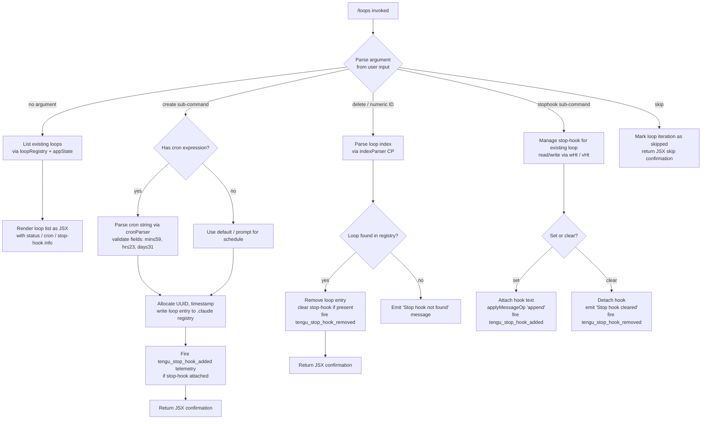

# `/loops`

> Analysis basis: CC v2.1.193 bundle.js (AST extraction + Claude interpretation)
> Minimum version: v2.1.193

---

## Overview

The `/loops` command provides a unified interface for managing background loop sessions (also called "bg" sessions or daemon-managed tasks). It supports listing active loops, creating new loops with cron-based or stop-hook schedules, and deleting existing loops. Internally the handler (`eDf`) coordinates with daemon infrastructure, app state, and the file-system-backed loop registry to perform each operation.

---

## Registration

| Field | Value |
|---|---|
| type | `local-jsx` |
| name | `loops` |
| description | `List, create, and delete loops` |
| loc_byte | `12741666` |
| loc_byte_end | `12741823` |
| loc_line | `8697` |
| immediate | `true` |
| module_id | `V4l` |
| load_inline | `true` |
| arbor_handler.name | `eDf` |
| arbor_handler.fqn | `claude-2.1.193::eDf` |
| arbor_handler.kind | `AsyncFunction` |
| arbor_handler.resolution_path | `module_id` |
| arbor_handler.n_hits | `0` |

Analysis basis: CC v2.1.193 bundle.js:+12741666

---

## Input Branching

The handler distinguishes at least five distinct execution paths based on sub-command argument and loop state, requiring a Mermaid flowchart.



Analysis basis: CC v2.1.193 bundle.js:+12740631 – +12741500

---

## Behavioral Spec

### 1. Handler entry — `loopsCommandHandler` (`eDf`)

```
async function loopsCommandHandler(context):
    emit telemetry("tengu_loops_command")           // bundle.js:+12740633
    loops = await fetchLoopRegistry(context)        // pce → Wit
    appState = context.getAppState()                // +12740683
    loopList = buildLoopDisplayList(loops, appState) // CHt → aDe, nZa

    subcommand = parseSubcommand(context.input)     // CP
    if subcommand is null:
        return renderLoopListJSX(loopList)          // q4l.jsx

    if subcommand.kind == "create":
        return handleCreateLoop(context, subcommand, loopList)
    if subcommand.kind == "delete" or subcommand.isNumericIndex:
        return handleDeleteLoop(context, subcommand, loopList)
    if subcommand.kind == "stophook":
        return handleStopHook(context, subcommand)
    if subcommand.kind == "skip":
        return handleSkipIteration(context, subcommand)
```

Analysis basis: CC v2.1.193 bundle.js:+12740631

---

### 2. Loop registry reader — `loopRegistryReader` (`pce`)

```
async function loopRegistryReader(context):
    rawData = await fileSystemLoopReader(context)   // Wit → t.readFile, utf-8 encoding
    loopIndex = buildLoopIndex(rawData)             // qI → Rx
    return loopIndex
```

The reader uses UTF-8 encoding when reading persisted loop files.
Analysis basis: CC v2.1.193 bundle.js:+5049143 (literal `"utf-8"` at +5047182)

---

### 3. File-system loop reader — `fileSystemLoopReader` (`Wit`)

```
async function fileSystemLoopReader(context):
    basePath = resolveLoopBasePath()                // x_e → AMn.join, Sc → Rx
    rawBytes = await t.readFile(basePath)           // +5047154
    parsed   = parseLoopEntries(rawBytes)           // xe → eo, at, Bi, e_u
    if not Array.isArray(parsed):
        return []
    entries  = normalizeEntries(parsed)             // T, ke, Lc, iYe, XFc
    schedule = parseCronSchedule(entries)           // dN → Hjd
    return entries
```

Error codes handled at this level include: `ENOENT`, `EACCES`, `EPERM`, `ENOTDIR`, `ELOOP`, `ENAMETOOLONG`, `EROFS`.
Analysis basis: CC v2.1.193 bundle.js:+5047135 (literals at +184517–+184606)

---

### 4. Cron-schedule parser — `cronScheduleParser` (`dN` + `Hjd`)

```
function parseCronSchedule(entry):
    text = entry.trim()                         // dN → e.trim, +5043755
    parts = text.split(" ")                     // Hjd → e.split, +5043175
    for each part s in parts:
        match = s.match(rangePattern)           // Hjd → s.match, +5043195
        value = parseInt(match)                 // Hjd → parseInt, +5043240
        rangeSet.add(value)                     // Hjd → o.add, +5043301
    result = Array.from(rangeSet)               // Hjd → Array.from, +5043703

    // Numeric bounds enforced:
    // minutes  ≤ 59  (literal at +12740398)
    // hours    ≤ 23  (literal at +12740469)
    // days     ≤ 31  (literal at +12740522)
    // display labels: "Every minute" (+5045046), "Every hour" (+5045263)
    return result
```

Cron loop type is identified by the string literal `"cron"` at bundle.js:+12740729.
Analysis basis: CC v2.1.193 bundle.js:+5043175

---

### 5. Loop list display builder — `loopDisplayBuilder` (`CHt`)

```
function buildLoopDisplayList(loops, appState):
    columnMap = new Map()
    for each loop in loops:
        columnMap.set(loop.id, formatRow(loop))     // aDe → o.set, +9337513
        paddedLabel = label.padEnd(width, "  ")     // literal "  " at +17509254
        columnMap.set(loop.id, paddedLabel)
    rows = flattenColumns(columnMap)                 // nZa → e.map, +9337282
    rows.push(extraRow)                              // CHt → n.push, +10852551
    return rows
```

Analysis basis: CC v2.1.193 bundle.js:+10852427

---

### 6. Sub-command argument parser — `subcommandParser` (`CP`)

```
function parseSubcommand(rawInput):
    trimmed = rawInput.trim()                       // CP → e.trim, +5044926
    if trimmed matches numeric pattern:
        index = parseInt(trimmed)                   // CP → parseInt, +5045102
        return { kind: "delete", index }
    if trimmed matches "1-5" range pattern:         // literal "1-5" at +5045970
        return { kind: "delete-range", range }
    if trimmed matches cron pattern:
        schedule = parseCronFromText(trimmed)       // CP → o.match, +5045067
        return { kind: "create", schedule }
    dayOfWeek = date.getUTCDay()                   // CP → g.getUTCDay, +5045803
    // Normalise to week start, set UTC midnight    // +5045822, +5045835, +5045853
    localDay  = date.getDay()                      // +5045882
    return { kind: "create", schedule: derivedSchedule }
```

Analysis basis: CC v2.1.193 bundle.js:+5044926

---

### 7. Create-loop handler — `createLoop` (`Vit`)

```
async function createLoop(context, subcommand, existingLoops):
    uuid      = crypto.randomUUID()                 // Vit → I7i.randomUUID, +5048482
    timestamp = Date.now()                          // Vit → Date.now, +5048544
    entry     = buildLoopEntry(uuid, timestamp)     // Vit → nme, +5048590

    // Persist to .claude directory (literal at +5048323)
    await writeLoopEntry(entry)                     // Vit → b$t → SMn.writeFile, +5048399
    // Ensure parent dir exists                     // b$t → SMn.mkdir, +5048302

    existingLoops.push(entry)                       // Vit → a.push, +5048647
    await refreshMCPConnections(context)            // a → l6e → VWo → Bcr
    loopIndexEntry = buildDisplayEntry(entry)       // Vit → Lt, +5048679
    return renderCreateConfirmationJSX(loopIndexEntry)
```

Analysis basis: CC v2.1.193 bundle.js:+5048482

---

### 8. Delete-loop handler — `deleteLoop` (`dce`)

```
async function deleteLoop(context, subcommand, existingLoops):
    isAllowed = checkFeatureGate(context)           // dce → MK → t.has, +59486
    registry  = await fileSystemLoopReader(context) // dce → Wit, +5048862
    filtered  = registry.filter(entry => not markedForDeletion(entry))  // +5048871
    hasMatch  = filtered.has(subcommand.index)      // dce → n.has, +5048886

    if not hasMatch:
        return renderMessage("Stop hook not found") // literal at +12741075

    await persistFilteredRegistry(filtered)         // b$t → SMn.writeFile
    emit telemetry("tengu_stop_hook_removed")       // +10853486 (via wHt path)
    return renderMessage("Stop hook cleared")       // literal at +12741097
```

Analysis basis: CC v2.1.193 bundle.js:+5048813

---

### 9. Stop-hook manager — `stopHookManager` (`wHt` / `vHt`)

```
async function manageStopHook(context, operation):
    loopListObj = buildLoopDisplayList(...)         // wHt → CHt, +10853227
    currentState = context.getAppState()            // wHt → e.getAppState, +10853231

    if operation == "set":
        uuid = generateAttachmentUUID()             // x_l → v_l.randomUUID, +10853580
        context.applyMessageOp("append", {          // wHt → e.applyMessageOp, +10853429
            kind: "attachment",                     // literal at +10853562
            goal: hookText,                         // literal "goal" at +10853520
        })
        context.setAppState({ goal_status: ... })  // literal "goal_status" at +10853649
        emit telemetry("tengu_stop_hook_added")     // +10853114
        return renderMessage("Stop hook set")       // literal at +12741393

    if operation == "clear":
        emit telemetry("tengu_stop_hook_removed")   // +10853486
        return renderMessage("Stop hook cleared")
```

The stop-hook type is stored with the key `"stophook"` (literal at +12740815).
Analysis basis: CC v2.1.193 bundle.js:+10853220

---

### 10. Loop creation – cron bounds (`ZMf`)

```
function parseCronLimits(scheduleText):
    match   = scheduleText.match(cronPattern)       // ZMf → e.match, +12740219
    minutes = parseInt(match.minutes)               // ZMf → parseInt, +12740256
    hours   = Math.max(0, parseInt(match.hours))   // ZMf → Math.max, +12740341
    rounded = Math.ceil(minutes / 60)              // ZMf → Math.ceil, +12740352
    display = Math.round(rounded)                  // ZMf → Math.round, +12740425

    // Bounds: minutes ≤ 59, hours ≤ 23, days ≤ 31
    schedule = parseCronSchedule(display)           // ZMf → dN, +12740589
    return schedule
```

Analysis basis: CC v2.1.193 bundle.js:+12740219

---

### 11. Loop display — JSX render

```
function renderLoopListJSX(loopList, ...):
    // Uses q4l.jsx renderer (loc_byte +12741436)
    // Renders each loop row with:
    //   - loop index (numeric)
    //   - schedule type: "cron" or "stophook"
    //   - human-readable label ("Every minute" / "Every hour")
    //   - status badge (active / idle / working / bg / crashed / etc.)
    return <LoopListComponent loops={loopList} />
```

Analysis basis: CC v2.1.193 bundle.js:+12741436

---

## State & Side Effects

| Item | Detail |
|---|---|
| Telemetry: `tengu_loops_command` | Fired once on every `/loops` invocation (bundle.js:+12740633) |
| Telemetry: `tengu_stop_hook_added` | Fired when a stop-hook is attached to a loop (+10853114) |
| Telemetry: `tengu_stop_hook_removed` | Fired when a stop-hook is detached or a loop is deleted (+10853486) |
| Telemetry: `tengu_bg_dispatch_sigkill_escalate` | Fired by daemon if SIGKILL escalation occurs in bg session (+17482166) |
| Telemetry: `tengu_daemon_config_reload` | Fired when daemon config reloads following loop mutation (+17498707) |
| Telemetry: `tengu_bg_spare_enable` | Fired when spare background session slot is enabled (+17483464) |
| Telemetry: `tengu_bg_spare_claim` | Fired when spare slot is successfully claimed (+17483592) |
| Telemetry: `tengu_bg_spare_claim_fail` | Fired when spare claim fails (+17483858) |
| Telemetry: `tengu_bg_sendclaim_failed` | Fired when socket claim message times out (timeout: 5000 ms, +17458835) (+17458401) |
| Telemetry: `tengu_bg_dispatch_low_mem` | Fired when free memory is critically low during dispatch (+17482767) |
| Telemetry: `tengu_bg_low_mem_mb` | Records low-memory threshold event (+13266461) |
| Telemetry: `tengu_daemon_idle_exit` | Fired when daemon exits due to idle (+17504149) |
| Telemetry: `tengu_daemon_yield` | Fired when daemon yields to a foreground/service daemon (+17503119) |
| Telemetry: `tengu_bg_state_read_transient` | Fired on transient background state read (+4296462) |
| Telemetry: `tengu_feature_ok` / `tengu_feature_bad` / `tengu_feature_sad` | Feature gate check results (+1026754, +1026821, +1026902) |
| Telemetry: `tengu_mcp_skills` | MCP skill count reported after loop connection refresh (+6781017) |
| Telemetry: `tengu_bg_daemon_bg_session_create` | Background session creation event (literal `"daemon_bg_session_create"` at +17482482) |
| `appState` changes | `goal_status`, `goal` fields updated when stop-hook set; `applyMessageOp("append")` used (+10853429) |
| File system | Loop entries written to `.claude` directory (`SMn.writeFile`, `SMn.mkdir`); loop state stored in `state.json` (+17488945); daemon status at `daemon.status.json` (+12997330) |
| MCP connections | `l6e` / `VWo` / `Bcr` path refreshes MCP server connections after loop mutations; `applyMcpUpdate` called (+16976223) |
| Hook registration | Stop-hook attached as `"attachment"` message with `"goal"` key; stored under `"stophook"` type key |
| Socket / daemon IPC | `cVo` establishes Unix socket connection with `mur.connect`; claim frames built via `eHm → Uq.buildClaimFrame`; send-claim timeout: 5000 ms; retry delay: 500 ms (+17459039) |
| Sound | <!-- TODO: not found in depth-2 traversal; needs --depth 4 --> |
| Idle loop GC | Loops inactive for 300000 ms (5 minutes) are eligible for cleanup (literal at +17490581) |

---

## Version History

| Version | Change |
|---|---|
| v2.1.193 | Initial analysis |

---

## Common Mistakes

1. **Passing a bare number without context**: A lone integer is interpreted as a loop deletion index (via `subcommandParser`). To list loops, invoke `/loops` with no argument.
2. **Invalid cron syntax**: Minute values above 59, hour values above 23, or day values above 31 will fail silent validation in `parseCronLimits`; always supply valid cron ranges.
3. **Expecting synchronous results after create**: Loop creation involves async file writes and MCP connection refresh (`Promise.all` inside `l6e`). The UI confirmation may render before all MCP clients have reconnected.
4. **Confusing "stop-hook" and "cron" loop types**: The `"cron"` type uses a schedule expression; the `"stophook"` type attaches a goal/hook text evaluated at loop stop. They are registered differently and displayed separately.
5. **Deleting by name instead of index**: The delete path only accepts a numeric index (or a range like `"1-5"`); loop names are not valid delete targets in this version.
6. **Assuming loop state is in-memory only**: Loop entries persist to the `.claude` directory on disk. Restarting Claude Code will re-read these entries via `fileSystemLoopReader`.

---

## Appendix — Identifier Mapping

> For bundle debugging only. Identifiers change across versions.

| Identifier | Role |
|---|---|
| `eDf` | Main handler for `/loops` command (async entry point) |
| `pce` | Loop registry reader (calls file-system reader + index builder) |
| `Wit` | File-system loop reader (reads & parses loop files from disk) |
| `x_e` | Loop base-path resolver (joins path components) |
| `Sc` | Path helper used by base-path resolver |
| `Vo` | Error-code mapper used in file read path |
| `an` | General async utility called during error handling |
| `xe` | Log entry accumulator / error collector |
| `eo` | Error string formatter |
| `at` | String converter utility |
| `Bi` | Essential-traffic filter |
| `e_u` | Queue shift/push manager for log ring buffer |
| `T` | Message normaliser / content type processor |
| `qFc` | Content block builder |
| `ke` | JSON stringify wrapper |
| `Lc` | Text redaction / truncation utility |
| `iYe` | Output token counter helper |
| `XFc` | Buffer byte-length / chunked-write utility |
| `dN` | Cron entry trimmer and dispatcher |
| `Hjd` | Cron field set parser (split, match, parseInt, Set) |
| `qI` | Loop index builder |
| `Rx` | Core registry/index data structure factory |
| `CHt` | Loop display-list builder (column formatter) |
| `aDe` | Column map setter with padding |
| `nZa` | Column map flattener |
| `Lt` | Display-entry builder |
| `CP` | Sub-command / argument parser |
| `f` | Background session dispatcher (spawn, kill, IPC) |
| `D` | Daemon process controller |
| `NMc` | Daemon realpath/stat resolver |
| `Kd` | Daemon state key helper |
| `RHm` | Daemon mtime watcher |
| `d` | Daemon write / supervisor IPC channel |
| `Un` | Abort/timeout wrapper with clearTimeout |
| `Re` | "feature ok" reporter |
| `Oe` | Feature state emitter |
| `we` | "feature ok" signal emitter |
| `Knr` | macOS low-memory checker |
| `it` | Platform token / feature-flag checker |
| `I9e` | pins.json reader / file lstat helper |
| `RNt` | pins.json path builder |
| `Bt` | JSON.parse wrapper |
| `In` | Async error logger |
| `vUd` | Directory recursive file lister |
| `O` | Daemon idle/retire watcher with timeout |
| `F` | Daemon idle timer handler |
| `cVo` | Background session socket claim sender |
| `w9o` | Loop/session directory & file writer |
| `tHm` | Claim send-timeout / retry handler |
| `eHm` | Claim frame builder |
| `qd` | Async string conversion helper |
| `be` | String coercion wrapper |
| `uk` | Binary frame encoder (Buffer, writeUInt32BE, writeUInt8) |
| `gVo` | Background session runner (spawn, file watch, state machine) |
| `hc` | Session path resolver |
| `Gi` | Session state file reader/writer with lstat |
| `Lh` | Session "active" state reporter |
| `QLe` | Session tag/label parser |
| `$d` | Session roster entry formatter |
| `W_t` | Session async result handler with Date.now |
| `xKt` | Session path key builder |
| `XSe` | Session result writer |
| `fk` | Session "err" state writer |
| `M0` | Session "late" state writer |
| `nD` | Session secondary error writer |
| `ZJ` | Session split-path state writer |
| `LKt` | Session wKt path builder |
| `p` | Process exit / abort controller |
| `B` | Session disposable handle |
| `m` | Running-session map iterator / kill dispatcher |
| `R` | Kill-signal sender for running sessions |
| `l` | Background session status log reader (`C8l`) |
| `C8l` | Daemon status JSON writer |
| `iee` | Telemetry event emitter (Yge sink) |
| `qs` | AsyncLocalStorage store getter |
| `v7t` | `daemon.status.json` path builder |
| `g` | Date object used for UTC day/hour normalisation |
| `dce` | Delete-loop handler |
| `MK` | Feature gate checker |
| `b$t` | Loop entry persister (mkdir + writeFile) |
| `wHt` | Stop-hook "set" manager |
| `x_l` | UUID generator wrapper (crypto.randomUUID) |
| `Ve` | JSX component renderer helper |
| `Zze` | Ink/React render root |
| `ZMf` | Cron bounds calculator (Math.max, Math.ceil, Math.round) |
| `Vit` | Create-loop handler (UUID, timestamp, entry, push) |
| `nme` | Loop entry struct builder |
| `a` | MCP connection refresh orchestrator |
| `l6e` | MCP server connection manager (all transport types) |
| `V3` | MCP server config merger |
| `BL` | MCP server metadata builder |
| `Nn` | Notification / event dispatcher |
| `QBt` | MCP connection backoff helper |
| `fba` | MCP connection attempt handler |
| `aTn` | MCP connection iTn/tI bridge |
| `sTn` | MCP connection Zl bridge |
| `sn` | MCP debug log push helper |
| `P1n` | MCP tool list fetcher |
| `e3t` | MCP connect-then handler |
| `hso` | MCP connection state emitter |
| `jL` | MCP skill telemetry reporter |
| `Zoo` | MCP include-filter checker |
| `w` | MCP connection retry / backoff timer |
| `iu` | MCP error log push helper |
| `_ba` | MCP internal state accessor |
| `Uct` | MCP slot count parser |
| `jNn` | MCP retry count parser |
| `Bcr` | MCP connection result applier |
| `a6e` | MCP result status helper |
| `oT` | MCP cleanup orchestrator |
| `mSa` | MCP session initialiser |
| `VWo` | MCP multi-server connection dispatcher |
| `E1n` | MCP connection policy checker |
| `s6e` | MCP server health status builder |
| `vHt` | Stop-hook "clear" manager |
| `iLo` | Stop-hook reader / policy gate |
| `qB` | Policy settings reader |
| `_n` | Policy object accessor |
| `Kae` | Policy gate evaluator |
| `Tr` | Trust-gate identifier |
| `td` | Hooks-gate evaluator |
| `Ijf` | Hook path validator / resolver |
| `vt` | JSX "sad" feature state emitter |
| `Ay` | Output-token value extractor |

---

Note: index built via Arbor fallback; some signals (telemetry, literals) may be missing — see arbor-fallback.js.