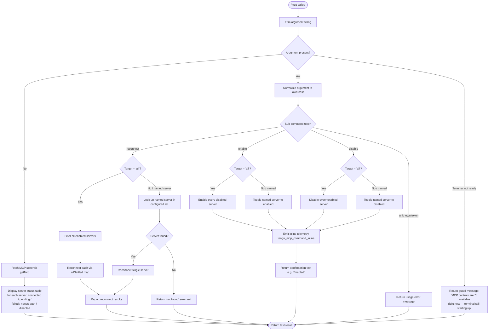

```markdown
---
type: feature-spec
feature: "mcp"
cc_version: "2.1.193"
updated: "2026-06-26"
tags: ["mcp", "commands", "slash-commands"]
source: "bundle-analysis"
bundle_verified: true
analysis_basis: "CC v2.1.193 bundle.js (AST extraction + Claude interpretation)"
author: "ryujaeuk <ryujaeuk@gmail.com>"
repository: "https://github.com/MyLittleLuckyDog/cc-gnothi"
license: "AGPL-3.0-only"
---

# `/mcp`

> Analysis basis: CC v2.1.193 bundle.js (AST extraction + Claude interpretation)
> Minimum version: v2.1.193

---

## Overview

The `/mcp` command provides runtime management of Model Context Protocol (MCP) servers within a Claude Code session. It allows users to inspect server connection status, reconnect servers, and toggle individual servers (or all servers) between enabled and disabled states. The command resolves a named sub-action from its argument string and delegates to async connection-management internals.

---

## Registration

| Field | Value |
|---|---|
| type | `local` |
| name | `mcp` |
| description | `Manage MCP servers` |
| argumentHint | `[reconnect\|enable\|disable [<server>\|all]]` |
| supportsNonInteractive | `true` |
| module_id | `iMl` |
| load_inline | `true` |
| loc_byte | `12184345` |
| loc_byte_end | `12184537` |
| loc_line | `8146` |
| **arbor_handler.name** | `HAf` |
| **arbor_handler.fqn** | `claude-2.1.193::HAf` |
| **arbor_handler.kind** | `AsyncFunction` |
| **arbor_handler.resolution_path** | `module_id` |
| **arbor_handler.n_hits** | `0` |
| `arbor_handler.name` | `HAf` |
| `arbor_handler.kind` | `AsyncFunction` |
| `arbor_handler.resolution_path` | `module_id` |
| `arbor_handler.fqn` | `claude-2.1.193::HAf` |
| `arbor_handler.n_hits` | `0` |

Analysis basis: CC v2.1.193 bundle.js:+12184345

---

## Input Branching

The handler parses the argument string and branches across five distinct cases (status display, reconnect-all, reconnect-specific, enable/disable, and error/guard paths), so a Mermaid flowchart is used.



Analysis basis: CC v2.1.193 bundle.js:+11917809, +11917869, +11918415, +11918515, +11918528, +11918545, +11918559, +11918781, +11918980

---

## Behavioral Spec

### 1. Argument Parsing and Sub-command Dispatch

```
async function mcpCommandHandler(args, context):
    rawArg = args.trim()                        // +11917809
    mcpState = context.getMcp()                 // +11917820

    if terminal not yet ready or another view is active:
        return errorText(
            "MCP controls aren't available right now — ..."  // +11918980
        )

    if rawArg is empty:
        return renderStatusView(mcpState)

    subCommand = rawArg.toLowerCase()           // +11917869

    // Guard: filter valid sub-commands
    if subCommand not in validSubCommands:      // +11917892 (nie.includes check)
        return usageError()

    // Dispatch
    switch subCommand:
        case "reconnect":  return handleReconnect(mcpState, target)
        case "enable":     return handleToggle(mcpState, target, enabled=true)
        case "disable":    return handleToggle(mcpState, target, enabled=false)
```

Analysis basis: CC v2.1.193 bundle.js:+11917809, +11917820, +11917869, +11917892, +11918515, +11918528, +11918545, +11918559

---

### 2. Status Display (no-argument path)

```
function renderStatusView(mcpState):
    servers = mcpState filtered and mapped to display rows
    for each server in servers:
        status = one of:
            "connected"   // +11918034
            "pending"     // +11918068
            "failed"      // +11918100
            "needs-auth"  // +11918119
            "disabled"    // +11918154
        if status == "failed":
            append hint: " Reply `/mcp reconnect all` here to retry."  // +11918310
        if status == "needs-auth":
            append hint: "Authenticate with `/mcp` in the terminal."   // +11920008
    if servers list is empty:
        return "No MCP servers are configured. Add one with `claude mcp add`."  // +11918781
    return formatted text block  // type="text" +11922079
```

Analysis basis: CC v2.1.193 bundle.js:+11918034, +11918068, +11918100, +11918119, +11918154, +11918310, +11918781, +11920008

---

### 3. Reconnect Sub-command

```
async function handleReconnect(mcpState, targetArg):
    target = targetArg.toLowerCase()

    if target == "all":
        candidateServers = mcpState.servers.filter(isEnabled)
        if candidateServers is empty:
            return "All enabled MCP servers are already connected or connecting."  // +11919722
    else:
        candidateServers = [lookupServerByName(mcpState, target)]
        if not found:
            return notFoundError(target)

    results = await Promise.allSettled(           // +11919798
        candidateServers.map(server => reconnectServer(server))
    )

    // Report per-server outcome
    for each result in results:
        if result.status == "fulfilled":          // +11919863
            append success line
        else:
            append failure line with hint:
                "Check its config with `/mcp` in the terminal."  // +11920052

    emit telemetry: tengu_mcp_command_inline      // +11918658
    return summaryText
```

Analysis basis: CC v2.1.193 bundle.js:+11919722, +11919798, +11919863, +11920052

---

### 4. Enable / Disable Sub-command

```
async function handleToggle(mcpState, targetArg, enabledFlag):
    target = targetArg.toLowerCase()

    if target == "all":                           // +11918515
        servers = mcpState.servers.filter(
            s => s.enabled != enabledFlag
        )
    else:
        servers = [lookupServerByName(mcpState, target)]
        if not found:
            return notFoundError(target)

    for each server in servers:
        update server.enabled = enabledFlag

    emit telemetry: tengu_mcp_command_inline      // +11918658

    stateLabel = enabledFlag ? "Enabled" : "Disabled"  // +11921170, +11921180
    return stateLabel + ". Run `/mcp` in the terminal to see status."  // +11922005
```

Analysis basis: CC v2.1.193 bundle.js:+11918515, +11918658, +11920936, +11921170, +11921180, +11922005

---

### 5. Server Connection Lifecycle (reconnectServer internals)

The reconnect path reaches several layers of connection management:

```
async function reconnectServer(server):
    // Close existing transports if open
    closeExistingTransport(server)      // i.close calls at +17495264, +17495274

    // Determine transport type; supported types observed in literals:
    //   "stdio", "sdk", "http", "sse"  (+6994304, +6994322, +17307892, +17307909)
    transport = resolveTransport(server.config)

    // Track active connection set
    activeConnections.add(server)       // +17488421
    try:
        await transport.connect(server)
    finally:
        activeConnections.delete(server) // +17488444

    // If transport requires daemon:
    //   daemon status written to "daemon.status.json"  (+12997330)
    //   daemon events: "daemon_stop" / "daemon_stop_failed"  (+17520277, +17520314)
```

Forced-shutdown path (e.g., `process.exit` escalation):

```
function forceShutdown(reason):
    // reason string: "forced shutdown"  (+17516674)
    abortController.abort()             // +17516714
    // Daemon shutdown: Promise.race timeout 500 ms  (+17515367, +17515411)
    // Emit error event type "cli_error" to process  (+13300654)
    process.exit()                      // +13300667, +17515450, +17516693
```

Analysis basis: CC v2.1.193 bundle.js:+17495264, +17495274, +17488421, +17488444, +12997330, +17520277, +17520314, +17516674, +17516714, +17515367, +17515411, +13300654, +13300667

---

### 6. IDE / Non-interactive Context Guard

When the context identifier equals `"ide"` (bundle literal at +11917860), the command may suppress interactive UI components and rely solely on text output. The `supportsNonInteractive: true` registration flag confirms the command is designed to function in headless or IDE-embedded sessions.

Analysis basis: CC v2.1.193 bundle.js:+11917860

---

### 7. Server Status "needs-approval" State

Beyond the five primary display states, the internal connection flow also handles a `"needs-approval"` state (+11917218) surfaced by `iqe` (the approval-check function). This state is not shown in the main status table but controls whether a server enters the reconnect candidacy set.

Analysis basis: CC v2.1.193 bundle.js:+11917218, +11920354

---

## State & Side Effects

| Item | Detail |
|---|---|
| Telemetry: `tengu_mcp_command_inline` | Fired on every reconnect / enable / disable sub-command invocation (bundle.js:+11918658) |
| Telemetry: `tengu_feature_ok` | Fired on successful feature-flag check inside connection helper `we` (bundle.js:+1026754) |
| Telemetry: `tengu_feature_bad` | Fired on failed feature-flag check inside connection helper `Re` (bundle.js:+1026821) |
| Telemetry: `tengu_daemon_control` | Fired inside daemon-stop controller `R$` (bundle.js:+17520352) |
| MCP state mutation | `enable` / `disable` sub-commands mutate the in-process MCP server registry |
| Daemon side-channel | Daemon status persisted to `daemon.status.json` on reconnect (bundle.js:+12997330) |
| Active-connection set | `activeConnections.add` / `activeConnections.delete` bracket each transport attempt (bundle.js:+17488421, +17488444) |
| UUID generation | New connection sessions receive a `crypto.randomUUID()` identifier via `xGr` (bundle.js:+3334334) |
| Process exit | Forced-shutdown path calls `process.exit()` after daemon graceful-stop races a 500 ms timeout (bundle.js:+17515411, +17515450) |
| Sound | <!-- TODO: not found in depth-2 traversal; needs --depth 4 --> |

---

## Version History

| Version | Change |
|---|---|
| v2.1.193 | Initial analysis |

---

## Common Mistakes

1. **Omitting the target argument for `reconnect`** — without a server name or `all`, the argument string is empty and the command falls through to the status-display path instead of reconnecting anything.
2. **Using `reconnect` on a disabled server** — disabled servers are excluded from the `reconnect all` candidate list; they must be `enable`d first.
3. **Expecting interactive UI in IDE / non-interactive mode** — the command returns plain text in those contexts; rich terminal widgets are suppressed.
4. **Assuming instant reconnect** — reconnection is async (`Promise.allSettled`); the command reports per-server outcomes only after all attempts settle.
5. **Confusing `needs-auth` with `failed`** — `needs-auth` servers are not automatically retried by `reconnect all`; authentication must be completed separately via the terminal `/mcp` view.
6. **Calling `disable all` when servers are already disabled** — the toggle filter skips servers already in the target state, so the output may say "Disabled" with fewer servers affected than expected.

---

## Appendix — Identifier Mapping

> For bundle debugging only. Identifiers change across versions.

| Identifier | Role |
|---|---|
| `HAf` | Main async handler for `/mcp` command (Arbor-resolved, `claude-2.1.193::HAf`) |
| `e` | Argument string / general local variable; also jitter helper in retry path |
| `n` | Lowercase-normalized sub-command token; also transport-close helper |
| `i` | Server-connection instance / transport close coordinator |
| `r` | Active-connection Set; also transport reference in close path |
| `Is` | Forced-exit dispatcher (writes `cli_error`, calls `process.exit`) |
| `s` | Connection-tracking helper (add / finally / delete around transport) |
| `_k` | Sub-command argument extractor / tokenizer |
| `Nn` | Utility called with context `t` (context accessor) |
| `V` | Feature-flag check helper (used by `we` and `Re`) |
| `Oe` | Secondary feature helper (calls `Zze`) |
| `Zze` | Inner feature-gate implementation |
| `_Qn` | Server-list filtering / lookup helper |
| `nMl` | Display-row formatter for status table |
| `nDo` | Approval-state resolver (calls `iqe`) |
| `iqe` | `needs-approval` state checker |
| `l` | Filtered server list (used in `l.filter`, `l.some`) |
| `C8l` | Daemon-status writer (writes `daemon.status.json`, calls `Date.now`, `qs`, `v7t`, `ke`) |
| `iee` | Log / event emitter helper (calls `Yge`) |
| `Yge` | Inner log sink (`sie`, `t.trim`) |
| `qs` | AsyncLocalStorage accessor (`Kqu.getStore`) |
| `v7t` | Path-join helper (`I8l.join`, `nr`) |
| `ke` | JSON serializer wrapper (`JSON.stringify`) |
| `A` | Reconnect-map entry; connection factory calling `QBt`, `XAt` |
| `QBt` | Connection builder sub-step |
| `XAt` | Transport configurator (calls `akc`) |
| `akc` | Server-type key extractor (`Object.keys`) |
| `c` | Per-server reconnect result handler (calls `yn`) |
| `yn` | Result-display renderer |
| `p` | Server process controller (calls `vT`, `process.exit`, `u.abort`) |
| `vT` | Forced-shutdown label producer (emits `"forced shutdown"`) |
| `u` | Daemon stop orchestrator (calls `we`, `Re`, `R$`, `Hj`) |
| `we` | Feature-ok telemetry emitter (fires `tengu_feature_ok`) |
| `Re` | Feature-bad telemetry emitter (fires `tengu_feature_bad`) |
| `R$` | Daemon-control telemetry emitter (fires `tengu_daemon_control`; calls `h5`, `ZBe`, `xGr`) |
| `h5` | Daemon state builder (calls `GB`) |
| `ZBe` | Daemon event emitter setup (calls `EL`) |
| `xGr` | Session-UUID generator (`crypto.randomUUID`, `e.emit`) |
| `Hj` | Graceful-shutdown racer (`Promise.race`, `Promise.all`, timeout 500 ms, `process.exit`) |
| `Yhe` | Shutdown initiator (`zhe.shutdown`) |
| `oHe` | Timeout clearer (`clearTimeout`, `H9o`) |
| `Un` | Promise timeout utility (`Error("aborted")`, `setTimeout`, `clearTimeout`, `s.unref`) |
```