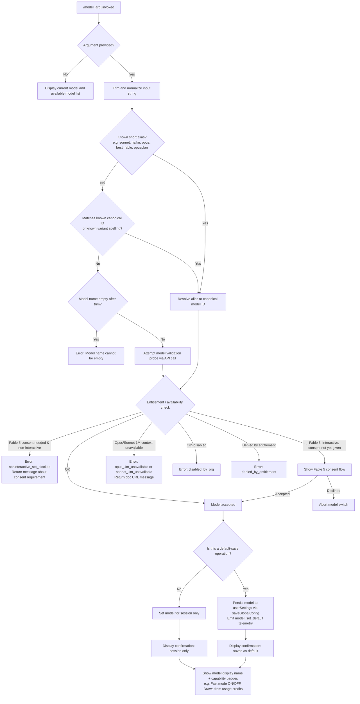

# `/model`

> Analysis basis: CC v2.1.193 bundle.js (AST extraction + Claude interpretation)
> Minimum version: v2.1.193

---

## Overview

The `/model` command allows users to set or switch the AI model used by Claude Code during a session or persistently as a new default. When invoked with a model argument, the handler validates the requested model against a known set of aliases and canonical model identifiers, applies entitlement checks, performs a live probe where needed (e.g., for Fable 5 availability), and then updates either the session state or the persisted user configuration accordingly.

---

## Registration

| Field | Value |
|---|---|
| type | `local` |
| name | `model` |
| description | `Set the AI model for Claude Code` |
| argumentHint | `<model>` |
| supportsNonInteractive | `true` |
| module_id | `Ujl` |
| load_inline | `true` |
| loc_byte | `12948185` |
| loc_byte_end | `12948359` |
| loc_line | `8833` |
| arbor_handler.name | `XOf` |
| arbor_handler.fqn | `claude-2.1.193::XOf` |
| arbor_handler.kind | `AsyncFunction` |
| arbor_handler.resolution_path | `module_id` |
| arbor_handler.n_hits | `0` |

Analysis basis: CC v2.1.193 bundle.js:+12948185

---

## Input Branching

There are multiple distinct branches based on: (a) whether an argument is provided, (b) whether the model string is a known alias or a full canonical ID, (c) whether the target model requires entitlement checks (Fable 5, Sonnet/Opus 1M context), (d) whether the session is interactive or non-interactive, and (e) whether the model is org-disabled or tier-restricted. A Mermaid flowchart is used.



---

## Behavioral Spec

### Main Handler — `XOf` (model command handler)

Analysis basis: CC v2.1.193 bundle.js:+12910841

```
async function modelCommandHandler(inputArg, context):
    rawInput = inputArg.trim()                          // bundle.js:+12910841

    // No argument: show current model and picker
    if rawInput is not in knownModelList:               // bundle.js:+12910857
        appState = context.getAppState()                // bundle.js:+12910880
        return buildModelListDisplay(appState)          // bundle.js:+12910924

    // Inline model set
    emit telemetry("tengu_model_command_inline")        // bundle.js:+12910991
    
    // Check non-interactive Fable consent gate
    if targetIsFable5(rawInput) and not interactiveSession:
        emit "model_fable_consent"                      // bundle.js:+12911149
        return errorMessage("noninteractive_set_blocked",
            "Fable 5 uses usage credits and needs a one-time consent · ...")
                                                        // bundle.js:+12911171
    
    result = await resolveAndValidateModel(rawInput, context)
    if result.error:
        return result.errorMessage

    // Apply model to session or persist
    applyModelToSession(result.canonicalId, context)    // bundle.js:+12911371
    return buildSuccessDisplay(result)
```

### Model Alias Resolution — `qo` (alias resolver)

Analysis basis: CC v2.1.193 bundle.js:+2306306

```
function resolveAlias(inputString):
    s = inputString.trim().toLowerCase()

    // Short alias table (literals extracted from bundle)
    aliasMap = {
        "sonnet"   -> resolveToCurrentSonnet(),         // bundle.js:+2306495
        "haiku"    -> resolveToCurrentHaiku(),          // bundle.js:+2306538
        "opus"     -> resolveToCurrentOpus(),           // bundle.js:+2306580
        "best"     -> resolveToCurrentBest(),           // bundle.js:+2306618
        "fable"    -> "claude-fable-5",                 // bundle.js:+2306383
        "opusplan" -> resolveOpusPlanMode(),            // bundle.js:+2304702
        "[1m]"     -> resolve1MContextVariant()         // bundle.js:+2306434
    }

    if s in aliasMap:
        return aliasMap[s]

    // Attempt canonical match
    return matchCanonicalModelId(s)
```

Known canonical model identifiers found in bundle (bundle.js:+2302894 – +2303895):
- `claude-fable-5`, `claude-mythos-5`
- `claude-opus-4-8`, `claude-opus-4-7`, `claude-opus-4-6`, `claude-opus-4-5`, `claude-opus-4-1`, `claude-opus-4-0`
- `claude-sonnet-4-6`, `claude-sonnet-4-5`, `claude-sonnet-4-0`
- `claude-haiku-4-5`
- `claude-3-7-sonnet`, `claude-3-5-sonnet`, `claude-3-5-haiku`
- `claude-3-opus`, `claude-3-sonnet`, `claude-3-haiku`

Display names matched to canonical IDs (bundle.js:+2305406 – +2306002):
`Fable 5`, `Mythos 5`, `Opus 4.8` through `Opus 4`, `Sonnet 4.6`, `Sonnet 4.5`, `Sonnet 4`, `Sonnet 3.7`, `Sonnet 3.5`, `Haiku 4.5`, `Haiku 3.5`, `Opus Plan`.

### Model Validation and Availability Gate — `eKt` (validate + entitlement checker)

Analysis basis: CC v2.1.193 bundle.js:+11425840

```
async function validateModelWithEntitlements(canonicalId, context):
    // Normalize provider context
    normalizedId = normalizeModelId(canonicalId)        // bundle.js:+11425840

    // Check known disabled reasons
    disabledStatus = checkEntitlementStatus(normalizedId)
    if disabledStatus == "denied_by_entitlement":       // bundle.js:+11425878
        return { error: "denied_by_entitlement" }
    if disabledStatus == "not_allowed":                 // bundle.js:+11426059
        return { error: "not_allowed" }

    // Opus 1M context check
    if modelRequires1MContext(normalizedId):
        available = checkOpus1MEntitlement(context)
        if not available:
            return {                                     // bundle.js:+11426206
                error: "opus_1m_unavailable",
                message: "Opus with 1M context is not available for your account. Learn more: https://code.claude.com/docs/en/model-config#extended-context-with-1m"
            }                                           // bundle.js:+11426244

    // Sonnet 1M context check
    if modelIs("sonnet[1m]") or modelIs("sonnet-4-6[1m]"):
        available = checkSonnet1MEntitlement(context)   // bundle.js:+11428477
        if not available:
            return {                                     // bundle.js:+11426423
                error: "sonnet_1m_unavailable",
                message: "Sonnet 4.6 with 1M context is not available for your account. Learn more: https://code.claude.com/docs/en/model-config#extended-context-with-1m"
            }                                           // bundle.js:+11426463

    // Fable availability (live probe)
    if modelIsFable5(normalizedId):
        probeResult = await probeFableAvailability()    // bundle.js:+11426852
        if probeResult.failed:
            return { error: "fable_probe_failed" }      // bundle.js:+11426962
        if probeResult.unavailable:
            return { error: "fable_unavailable" }       // bundle.js:+11426942

    // Org-level disable check
    if orgHasDisabledModel(normalizedId):               // bundle.js:+11426691
        return { error: "disabled_by_org" }

    // Record model switch event
    emit "model_switch"                                 // bundle.js:+11425863
    return { ok: true, canonicalId: normalizedId }
```

### Live Model Probe — `ijt` (API validation probe)

Analysis basis: CC v2.1.193 bundle.js:+9127378

```
async function liveModelProbe(modelName):
    trimmed = modelName.trim()
    if trimmed is empty:
        return { error: "Model name cannot be empty" }  // bundle.js:+9127415

    normalizedName = trimmed.toLowerCase()
    if normalizedName in knownFastPathSet:              // bundle.js:+9127582, +9127684
        return cachedResult(normalizedName)

    // Variant alias normalization for probe
    // e.g. "fable-5" / "fable_5" -> canonical         // bundle.js:+9128733
    // e.g. "opus-4-8" / "opus_4_8" -> canonical       // bundle.js:+9128833

    probePayload = buildProbeRequest(normalizedName)    // bundle.js:+9127729
    emit telemetry("model_validation")                  // bundle.js:+9127779

    try:
        response = await callAPIWithProbePayload(probePayload)
    catch authError:
        return { error: "Authentication failed. Please check your API credentials." }
                                                        // bundle.js:+9128151
    catch networkError:
        return { error: "Network error. Please check your internet connection." }
                                                        // bundle.js:+9128253

    if response.error.type == "not_found_error":        // bundle.js:+9128372
        // Model string included in error detail        // bundle.js:+9128454
        return { error: "model not found", detail: response }

    // Cache successful probe result
    cacheProbeResult(normalizedName, response)          // bundle.js:+9127892
    return { ok: true }
```

### Model Application and Display — `MXn` (apply model + build confirmation UI)

Analysis basis: CC v2.1.193 bundle.js:+11427438

```
function applyModelAndBuildDisplay(validatedModel, context, options):
    appState = context.getAppState()

    // Determine persistence scope
    if options.saveAsDefault:
        persistModelToUserSettings(validatedModel)      // bundle.js:+11427524
        emit telemetry("model_set_default")             // bundle.js:+11427949
        scopeLabel = " and saved as your default for new sessions"
                                                        // bundle.js:+11427591
    else:
        setSessionModel(validatedModel)
        scopeLabel = " for this session only"           // bundle.js:+11427637

    // Build display name and capability badges
    displayName = lookupDisplayName(validatedModel)     // bundle.js:+11427676
    badges = []
    if modelHasFastMode(validatedModel):
        badges.append(" · Fast mode ON")               // bundle.js:+11427755
    else:
        badges.append(" · Fast mode OFF")              // bundle.js:+11427852
    if modelDrawsFromCredits(validatedModel):
        badges.append(" · Draws from usage credits")   // bundle.js:+11427806

    // Build managed-settings notice if applicable
    if managedSettingsActive(context):
        appendManagedSettingsNotice()                   // bundle.js:+11428158

    return formatConfirmationMessage(displayName, scopeLabel, badges)
```

### Policy / Tier Model Mapping — `p_n` (policy model resolver)

Analysis basis: CC v2.1.193 bundle.js:+2295157

```
function resolvePolicyMappedModel(rawTierDefault, userSteering, context):
    // If user provided explicit steering, pin env-free tier builtin
    if userSteering detected:
        log "user steering detected — pinning the env-free tier builtin"
                                                        // bundle.js:+2298244
    else:
        // Tier default is admin-mapped; re-apply policy at exit
        log "tier default is the admin-mapped value — pinning its canonical builtin"
                                                        // bundle.js:+2298122

    // Iterate policy entries to find applicable mapping
    for each policyEntry in context.policySettings:     // bundle.js:+2286781
        if policyEntry.status == "active":              // bundle.js:+2295319
            apply policyEntry
        elif policyEntry.status == "inactive":          // bundle.js:+2295277
            skip
        elif policyEntry.status == "refused":           // bundle.js:+2295239
            mark as refused

    // Warn on unrecognised entries
    if unknownEntry found:
        log level "warn"                                // bundle.js:+2296164

    // Keep tier default if no override found
    if noOverrideFound:
        log "keeping the tier default"                  // bundle.js:+2298340

    return resolvedModel
```

### Org / Entitlement Disable Check — `cve` (model disable state resolver)

Analysis basis: CC v2.1.193 bundle.js:+2291338

```
function resolveModelDisableState(modelId, context):
    // Check if model is fully disabled
    if model state == "disabled":                       // bundle.js:+2291613
        return { state: "disabled", message: "That model" }
                                                        // bundle.js:+2291767

    // Check if model is absent from available set
    if model state == "absent":                         // bundle.js:+2291739
        return { state: "absent" }

    // Check 1M context suffix eligibility
    if modelId endsWith 1M marker:
        return resolveExtendedContextAvailability()     // bundle.js:+2291760

    return { state: "ok" }
```

---

## State & Side Effects

| Item | Detail |
|---|---|
| Telemetry: `tengu_model_command_inline` | Fired when a model is set inline via the command argument (bundle.js:+12910991) |
| Telemetry: `tengu_feature_ok` | Fired on successful feature entitlement check (bundle.js:+1026754) |
| Telemetry: `tengu_feature_bad` | Fired on failed feature entitlement check (bundle.js:+1026821) |
| Telemetry: `tengu_feature_sad` | Fired on degraded feature entitlement state (bundle.js:+1026902) |
| Telemetry: `tengu_api_success` | Fired after successful API probe response (bundle.js:+8620225) |
| Telemetry: `tengu_client_data_cache_key` | Fired when bootstrap model data cache key is computed (bundle.js:+8317712) |
| Telemetry: `tengu_config_lock_contention` | Fired when config file lock is slow to acquire (bundle.js:+13973651) |
| Telemetry: `tengu_config_stale_write` | Fired when a stale config write is detected (bundle.js:+13973787) |
| Telemetry: `tengu_config_auto_repaired` | Fired when config is auto-repaired after parse error (bundle.js:+13974164) |
| Telemetry: `tengu_config_auth_loss_prevented` | Fired when a write that would erase auth credentials is blocked (bundle.js:+13974494) |
| Telemetry: `tengu_config_fallback_write` | Fired on fallback config write path (bundle.js:+13973267) |
| Telemetry: `tengu_saffron_credits_only_tiers` | Fired during credits-only tier resolution (bundle.js:+5235774) |
| Telemetry: `tengu_lone_surrogate_sanitized` | Fired when a lone surrogate is sanitized in API response (bundle.js:+8619921) |
| Literal event string: `model_switch` | Recorded when a model switch completes (bundle.js:+11425863) |
| Literal event string: `model_set_default` | Recorded when model is persisted as new default (bundle.js:+11427949) |
| Literal event string: `model_validation` | Recorded during live model probe (bundle.js:+9127779) |
| Literal event string: `model_fable_consent` | Recorded during Fable 5 consent check (bundle.js:+12911149) |
| appState changes | Active model ID updated in session state via `getAppState()` (bundle.js:+12910880) |
| Config persistence | When saving as default, model is written to `userSettings` in `~/.claude.json` via lock-protected write (bundle.js:+13973378) |
| Cache invalidation | Bootstrap model discovery cache may be updated after fetch (bundle.js:+8318023) |
| Hook registration | No hook registration observed in depth-2 traversal |
| Sound | No audio side effects observed |

---

## Version History

| Version | Change |
|---|---|
| v2.1.193 | Initial analysis — full model alias resolution, entitlement gating, Fable 5 consent flow, 1M context checks, live API probe, policy tier mapping, and config persistence |

---

## Common Mistakes

1. **Providing a model name with extra whitespace**: The handler trims input, so leading/trailing spaces are safe, but embedded spaces will not match any known alias or canonical ID and will trigger a live probe (which may return `not_found_error`).
2. **Attempting to set Fable 5 in non-interactive (script/CI) mode**: The command explicitly blocks this with `noninteractive_set_blocked` and requires the one-time consent to be given in an interactive session first (bundle.js:+12911171).
3. **Expecting `--model` flag semantics**: `/model` is a slash command, not a CLI flag. To set the model from the command line at startup, use `--model` instead.
4. **Confusing session-scope vs. default-scope**: Without an explicit save-as-default action, the model change applies to the current session only and reverts when Claude Code is restarted (bundle.js:+11427637).
5. **Using hyphen vs. underscore in variant names**: The live probe normalizes both forms (e.g., `fable-5` and `fable_5`, `opus-4-8` and `opus_4_8`) to the canonical identifier, but only for known variants in the probe alias table (bundle.js:+9128733, +9128833).
6. **Assuming all models are always available**: Org admins can disable specific models via managed settings (`disabled_by_org`), and some models (Opus/Sonnet 1M context, Fable 5) require specific entitlements that vary by account tier.

---

## Appendix — Identifier Mapping

> For bundle debugging only. Identifiers change across versions.

| Identifier | Role |
|---|---|
| `XOf` | Main async handler for `/model` command |
| `DXn` | Model list display builder (called when no arg given) |
| `QM` | Model picker / available-models formatter |
| `xRt` | Model list renderer |
| `Ep` | Model entry renderer |
| `qo` | Alias-to-canonical resolver |
| `lC` | Model configuration loader |
| `$1r` | Model config entry parser |
| `p_n` | Policy-tier model mapper |
| `d_n` | Model availability display entry builder |
| `bd` | Session ID / hash utility |
| `ph` | Platform/provider detection helper |
| `Zze` | Low-level environment flag reader |
| `eKt` | Entitlement + availability validator |
| `PFe` | Model ID normalizer |
| `Fa` | Model string sanitizer / replacement helper |
| `nM` | Known-model set membership checker |
| `to` | Provider context resolver |
| `PZe` | Provider entry enumerator |
| `__` | Model string normalizer (lowercasing, includes checks) |
| `RTt` | Region/tier tag resolver |
| `up` | Model string replacer / cleaner |
| `Gge` | Gateway model availability resolver |
| `_r` | React/UI render helper |
| `at` | String coercion utility |
| `yYu` | Model set tracker (add/check) |
| `_Yu` | Model set entry builder |
| `P1r` | Record / array persistence helper |
| `kt` | Config write coordinator |
| `Re` | Feature flag reader |
| `Oe` | Feature flag evaluator |
| `wa` | Model options assembler |
| `oxt` | Remote model option fetcher |
| `qHs` | Remote model filter |
| `VHs` | Remote model list builder |
| `sxt` | Server-side model option builder |
| `BIe` | Remote settings loader |
| `yB` | Model descriptor builder |
| `gie` | Model group/label tagger |
| `txt` | Model text label builder |
| `Bge` | Model restriction flag checker |
| `a_n` | Model alias normalizer |
| `IRt` | Model ID case-normalizer / prefix checker |
| `EYs` | Model entry-set expander |
| `_n` | Policy settings reader |
| `sun` | Settings source resolver |
| `yYs` | Model index searcher |
| `EYu` | Extended model alias handler |
| `HYs` | Model index-of helper |
| `SYu` | Supplementary model alias resolver |
| `_Ys` | Model prefix matcher |
| `CRo` | Opus 1M context entitlement checker |
| `nne` | Entitlement status decoder |
| `qge` | UI render entry builder |
| `So` | UI text/badge renderer |
| `aJi` | Entitlement action invoker |
| `$b` | UI composite badge builder |
| `zge` | Badge renderer helper |
| `Ci` | UI component renderer |
| `vRo` | Sonnet 1M context entitlement checker |
| `$_e` | Sonnet entitlement status decoder |
| `cve` | Model disable-state resolver |
| `_u` | Disable-state context reader |
| `vhn` | Disable-state value parser |
| `Wge` | Model capability tagger |
| `qie` | Partial-disable state resolver |
| `jge` | Includes-based disable checker |
| `Qz` | 1M suffix resolver |
| `u_n` | Feature-flag disable resolver |
| `pet` | Feature-includes checker |
| `det` | Definitive disable-state marker |
| `ijt` | Live API model probe handler |
| `FN` | API request builder and dispatcher |
| `ef` | Request error formatter |
| `jW` | HTTP client request executor |
| `ABe` | API request body builder |
| `zie` | Auth token cache accessor |
| `ZFp` | Auth credential finder |
| `dHo` | Request deduplication hasher |
| `y_n` | Response stream processor |
| `UCn` | Response header extractor |
| `gje` | Agent task context builder |
| `YD` | Request config builder |
| `Aja` | Axios instance reference |
| `vbn` | Request options builder |
| `Mv` | Message mapper |
| `S0e` | Response content parser |
| `Lnn` | Message list mutator |
| `LD` | Deep-clone utility |
| `lYe` | Message list pruner |
| `Ve` | Environment variable reader |
| `kNr` | Response cache key builder |
| `RNr` | Response cache manager |
| `uTe` | Usage token counter |
| `br` | Response metadata builder |
| `No` | Environment flag reader |
| `FNt` | Cache-control header builder |
| `sF` | Subagent context builder |
| `Zbt` | Cache-busting token |
| `Q6p` | Probe result cacher |
| `Z6p` | Probe result serializer |
| `uCl` | Model lowercase normalizer |
| `Gke` | Bootstrap model discovery runner |
| `Ggo` | Bootstrap cache reader |
| `cB` | Bootstrap cache entry checker |
| `As` | Bootstrap alias resolver |
| `LNp` | Bootstrap fetch coordinator |
| `T` | Text formatting utility (bold, trim, includes) |
| `RNp` | Bootstrap HTTP response handler |
| `Bi` | Bootstrap retry handler |
| `M9a` | Bootstrap metadata extractor |
| `g4r` | HTTP header parser |
| `vt` | Feature capability reader |
| `wv` | Auth context builder |
| `UA` | OAuth token handler |
| `yve` | WIF token exchange handler |
| `Iet` | Credentials resolver |
| `Rs` | OAuth URL validator |
| `Lv` | Model generation classifier |
| `CR` | HTTP error classifier |
| `we` | Feature ok/bad/sad emitter |
| `HCn` | Cache hash builder |
| `mn` | Global config saver |
| `dXt` | Config file writer with lock |
| `l9o` | Config entry enumerator |
| `cXt` | Config timestamp recorder |
| `lXt` | Config backup state reader |
| `TSt` | Config serializer |
| `Qor` | Config fallback writer |
| `NLi` | Config entry normalizer |
| `OLi` | Config entry transformer |
| `xe` | Error logger / reporter |
| `eo` | Error message builder |
| `e_u` | Error queue manager |
| `be` | Error string coercer |
| `VJ` | Session model applicator |
| `kA` | Model setter with fallback |
| `vW` | Model fallback resolver |
| `cFt` | Fable consent flow launcher |
| `Ece` | Fable consent UI renderer |
| `MVd` | Fable consent entry builder |
| `kVd` | Fable consent option builder |
| `QZr` | Fable consent form builder |
| `lFt` | Fable consent prompt builder |
| `h0e` | Fable consent confirm handler |
| `pF` | Fable consent option renderer |
| `F_e` | Fable consent cancel renderer |
| `MXn` | Model apply + confirmation display builder |
| `Ese` | Session model state accessor |
| `tKt` | Config persistence coordinator |
| `co` | Settings read/write orchestrator |
| `dg` | Settings descriptor builder |
| `Svr` | Settings source resolver |
| `hv` | Settings merge helper |
| `wCr` | Settings cache writer |
| `B$e` | Settings file runner |
| `Qwt` | Atomic file writer |
| `ke` | JSON serializer |
| `PH` | Cache clear helper |
| `wgs` | gitignore / project settings writer |
| `U4` | Project settings path resolver |
| `mr` | Settings read helper |
| `dW` | Settings dirty-state tracker |
| `ic` | UI indent/render helper |
| `lve` | UI label renderer |
| `Fm` | Model display formatter |
| `NPe` | Model selection display builder |
| `oH` | Model option header builder |
| `rH` | Model row header builder |
| `IRo` | Managed-settings notice builder |
| `cge` | Managed-settings entry renderer |
| `oC` | Managed-settings state tracker |
| `Zz` | Model list section composer |

---

Note: index built via Arbor fallback; some signals (telemetry, literals) may be missing — see arbor-fallback.js.