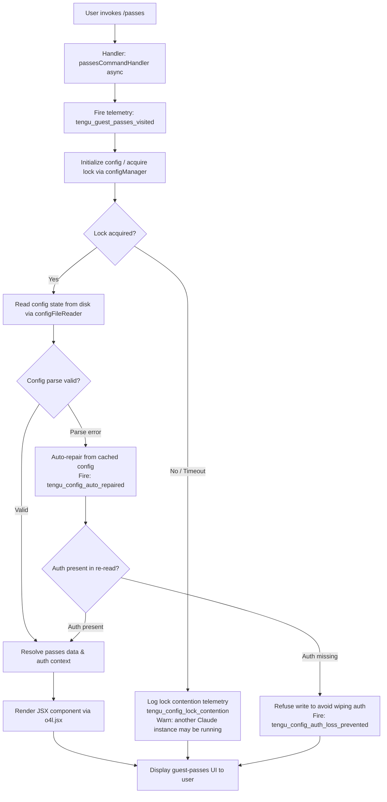

# `/passes`

> Analysis basis: CC v2.1.193 bundle.js (AST extraction + Claude interpretation)
> Minimum version: v2.1.193

---

## Overview

The `/passes` command allows users to share a free week of Claude Code with friends by presenting a guest-pass management UI rendered as a JSX component. It is a `local-jsx` type command, meaning its output is a rendered React/Ink component rather than a text response. On invocation, it fires a telemetry event indicating the guest-passes screen was visited, then renders the passes UI backed by the config persistence and daemon subsystems.

---

## Registration

| Field | Value |
|---|---|
| type | `local-jsx` |
| name | `passes` |
| description | Share a free week of Claude Code with friends |
| loc_byte | `12690749` |
| loc_byte_end | `12691071` |
| loc_line | `8599` |
| isHidden | `null` (not hidden) |
| module_id | `r4l` |
| load_inline | `true` |
| arbor_handler.name | `kMf` |
| arbor_handler.fqn | `claude-2.1.193::kMf` |
| arbor_handler.kind | `AsyncFunction` |
| arbor_handler.resolution_path | `module_id` |
| arbor_handler.n_hits | `2` |

Analysis basis: CC v2.1.193 bundle.js:+12690749

---

## Input Branching

The command has a relatively linear activation path but the underlying config-persistence infrastructure (reached through the handler) involves multiple guarded branches. The top-level invocation flow has 3+ distinct paths (normal render, telemetry-only path, and config-error paths), so a Mermaid flowchart is used.



Analysis basis: CC v2.1.193 bundle.js:+12690442 (handler entry `kMf`), +12690631 (JSX render), +12690582 (telemetry fire)

---

## Behavioral Spec

### Top-Level Handler (`passesCommandHandler`)

The Arbor-resolved handler for this command is `kMf` (an `AsyncFunction`, resolved via `module_id` → `r4l`).

```
async function passesCommandHandler(context):
    // Step 1: Signal that the guest-passes UI was visited
    fireTelemtryEvent("tengu_guest_passes_visited")

    // Step 2: Initialize config file watcher and lock infrastructure
    configManager = initializeConfigWatcher()       // calls configFileWatcher
    lockManager   = initializeLockManager()         // calls saveConfigWithLock

    // Step 3: Render the JSX component for the passes UI
    component = renderJSX(PassesUIComponent, {
        configManager,
        lockManager,
    })

    return component
```

Analysis basis: CC v2.1.193 bundle.js:+12690442, +12690476, +12690482, +12690580, +12690631

---

### Config Watcher Initialization (`configFileWatcher`)

Called by the handler; sets up file watching for the config on disk.

```
function configFileWatcher(configPath):
    watcher = attachFileWatcher(configPath)           // egs.watchFile
    watcher.onChange = function(event):
        reload = readConfigFile(configPath)           // r.readFileSync, utf-8
        parsed = parseJSON(reload)                   // JSON.parse via jsonParser
        if parseError:
            fireTelemtryEvent("tengu_config_parse_error")
        return parsed
    return watcher
```

Analysis basis: CC v2.1.193 bundle.js:+13972214, +13977362, +13977384

---

### Config Save with Lock (`saveConfigWithLock`)

Handles persistence of config changes originating from the passes UI (e.g., claiming or managing passes).

```
async function saveConfigWithLock(newConfig, cachedConfig):
    lockPath = buildLockPath(configBaseName)          // oE.basename + p9o
    mkdirSync(lockDirectory, { recursive: true })

    lockAcquired = false
    startTime = Date.now()

    loop:
        try acquire lock via lockfile
        if acquired:
            lockAcquired = true
            break
        if Date.now() - startTime > LOCK_TIMEOUT:
            warn("Lock acquisition took longer than expected - " +
                 "another Claude instance may be running")
            fireTelemtryEvent("tengu_config_lock_contention")
            break
        wait(backoffInterval)

    if lockAcquired:
        diskConfig = readConfigFile(configPath, "utf-8")   // r.readFileSync

        if diskConfig has parse error:
            log("saveConfigWithLock: re-read hit a parse error; " +
                "auto-repairing from cached config under lock. See GH #3117.")
            fireTelemtryEvent("tengu_config_auto_repaired")
            mergedConfig = cachedConfig  // use in-memory cache

        else if diskConfig is missing auth that cachedConfig has:
            log("saveConfigWithLock: re-read config is missing auth that " +
                "cache has; refusing to write to avoid wiping ~/.claude.json. " +
                "See GH #3117.")
            fireTelemtryEvent("tengu_config_auth_loss_prevented")
            return  // abort write

        else:
            mergedConfig = merge(diskConfig, newConfig)

        writeConfigAtomic(configPath, mergedConfig)       // via atomicFileWriter
        releaseLock(lockPath)

    else:
        // fallback write without lock
        fireTelemtryEvent("tengu_config_fallback_write")
        writeConfigAtomic(configPath, newConfig)
```

Analysis basis: CC v2.1.193 bundle.js:+13973562 (lock timeout warning), +13974036 (parse error log), +13974342 (auth loss log), +13975970 ("Config accessed before allowed"), +13976026 (readFileSync), +13976669 (mkdirSync)

---

### Atomic Config File Writer (`atomicFileWriter`)

Used by `saveConfigWithLock` to safely persist config data.

```
function atomicFileWriter(targetPath, content):
    randomBytes = crypto.randomBytes(6).toString("hex")   // 6 bytes → 12-char hex
    tempPath    = targetPath + "." + randomBytes

    originalStat = lstatSync(targetPath)                  // get existing perms
    originalMode = originalStat ? originalStat.mode : 0o600   // fallback: 384 decimal

    fd = fs.openSync(tempPath, flags)
    fs.writeFileSync(fd, content)
    fs.fchmodSync(fd, originalMode)                       // preserve permissions
    log("Applied original permissions to temp file")
    fs.fsyncSync(fd)                                      // flush to disk
    fs.closeSync(fd)

    if isSymbolicLink(targetPath):
        resolvedTarget = resolveSymlink(targetPath)       // readlinkSync + resolve
        fs.renameSync(tempPath, resolvedTarget)
    else:
        fs.renameSync(tempPath, targetPath)

    if accessError (EACCES):
        warn("writeFileSyncAndFlush: in-place fallback write failed; " +
             "content preserved at temp path")
```

Analysis basis: CC v2.1.193 bundle.js:+1103160 (randomBytes), +1103176 (6 bytes), +1103188 ("hex"), +1103343 (mode=8?), +1103608 (writeFileSync), +1103670 (fchmodSync), +1103691 (log "Applied original permissions"), +1103817 (fsyncSync), +1104148 (renameSync), +1104321 (EACCES), +1105102 (fallback warning), +13975237 (default mode 384 = 0o600)

---

### Backup File Management (`backupConfigReader`)

The call graph references a backup subdirectory and backup-file enumeration used when loading or managing prior config snapshots.

```
function backupConfigReader(configDir):
    backupsDir = path.join(configDir, "backups")          // literal "backups"
    entries    = readdirStringSync(backupsDir)

    backups = entries
        .filter(name => name.startsWith(".backup."))      // literal ".backup."
        .map(name => ({
            name,
            timestamp: Number(name.split(".")[...]),      // extract timestamp segment
        }))
        .filter(entry => !Number.isNaN(entry.timestamp))
        .sort((a, b) => b.timestamp - a.timestamp)

    // Keep only the most recent MAX_BACKUPS backups
    MAX_BACKUPS = 5                                        // literal 5
    toDelete = backups.slice(MAX_BACKUPS)
    for each old in toDelete:
        unlinkSync(path.join(backupsDir, old.name))

    return backups[0]  // most recent backup
```

Analysis basis: CC v2.1.193 bundle.js:+13975538 ("backups"), +13974816 (".backup."), +13974801 (Number), +13974808 (split), +13974844 (Number.isNaN), +13974955 (5), +13975058 (slice), +13975073 (unlinkSync)

---

### Auth Session Resolution (`authSessionResolver`)

The `/passes` handler calls into the auth/session resolution chain to determine the current user context before rendering the passes UI.

```
function authSessionResolver(profileConfig):
    authMethod = determineAuthMethod(profileConfig)

    if profileConfig has ANTHROPIC_API_KEY:
        return { method: "api_key", ... }

    if profileConfig has apiKeyHelper:
        return { method: "apiKeyHelper", ... }

    if loginType == "none":
        // no auth configured
        throw Error("ANTHROPIC_API_KEY, ANTHROPIC_AUTH_TOKEN, " +
                    "CLAUDE_CODE_OAUTH_TOKEN, or WIF env vars " +
                    "(ANTHROPIC_FEDERATION_RULE_ID + ANTHROPIC_ORGANIZATION_ID) required")

    if loginType == "user_oauth":
        return resolveOAuthSession(profileConfig)

    if loginType == "profile-implicit":
        return resolveImplicitProfile(profileConfig)
```

Analysis basis: CC v2.1.193 bundle.js:+3065645 ("ANTHROPIC_API_KEY"), +3065739 ("apiKeyHelper"), +3065778 ("none"), +3061702 ("claude-desktop-3p"), +3062171 ("profile-implicit"), +3062244 ("user_oauth"), +3066114 (error message string), +3066108 (Error throw)

---

### Global Config Save Fallback (`saveGlobalConfigFallback`)

A separate fallback path for writing the global config when the primary lock-based write fails.

```
function saveGlobalConfigFallback(newConfig, cachedConfig):
    if cachedConfig has auth AND newConfig is missing that auth:
        log("saveGlobalConfig fallback: re-read config is missing auth " +
            "that cache has; refusing to write. See GH #3117.")
        return  // do not proceed

    // Proceed with writing
    writeConfigAtomic(globalConfigPath, newConfig)
    fireTelemtryEvent("save_global")                    // literal "save_global"
```

Analysis basis: CC v2.1.193 bundle.js:+13970417 (log string), +13970663 ("save_global")

---

## State & Side Effects

| Item | Detail |
|---|---|
| Telemetry: `tengu_guest_passes_visited` | Fired immediately on command invocation (bundle.js:+12690582) |
| Telemetry: `tengu_config_lock_contention` | Fired when config lock cannot be acquired within the timeout window (bundle.js:+13973651) |
| Telemetry: `tengu_config_stale_write` | Fired when a stale config write is detected (bundle.js:+13973787) |
| Telemetry: `tengu_config_auto_repaired` | Fired when a config parse error triggers an auto-repair from cache (bundle.js:+13974164) |
| Telemetry: `tengu_config_auth_loss_prevented` | Fired when a write is aborted to prevent loss of auth credentials (bundle.js:+13974494) |
| Telemetry: `tengu_config_fallback_write` | Fired when the fallback (non-locked) config write path is used (bundle.js:+13973267) |
| Telemetry: `tengu_config_parse_error` | Fired when the config file on disk cannot be parsed as JSON (bundle.js:+13977384) |
| Telemetry: `tengu_daemon_yield` | Fired from daemon subsystem when yielding to a foreground/service daemon (bundle.js:+17503119) |
| Telemetry: `tengu_daemon_control` | Fired from daemon control operations (bundle.js:+17520352) |
| Config file changes | The command may trigger reads and writes to `~/.claude.json` (global config) with locking and atomic rename |
| File watcher registration | A `fs.watchFile` listener is registered on the config file path via `aLt`/`egs.watchFile` (bundle.js:+1146692) |
| Hook registration | `Ei` calls `a7o.register` — an event/hook registration occurs during command initialization (bundle.js:+68040) |
| appState changes | Auth session and profile config state may be updated as a side effect of config re-reads |
| Backup files | `.backup.*`-prefixed files may be created or pruned in `~/.claude/backups/` directory (bundle.js:+13975538) |
| Sound | None detected in depth-2 traversal |
| JSX render | The command produces a rendered JSX/Ink UI component via `o4l.jsx` (bundle.js:+12690631) rather than text output |
| Daemon signals | The daemon subsystem may send `SIGTERM` to background workers when yielding (bundle.js:+17484114) |

---

## Version History

| Version | Change |
|---|---|
| v2.1.193 | Initial analysis |

---

## Common Mistakes

1. **Expecting text output**: `/passes` is a `local-jsx` command and renders a UI component, not plain text. Shell scripts or automated tooling that expects a text response will not receive one.
2. **Invoking while another Claude instance is running**: The config lock contention path will trigger if a second Claude Code instance holds the config lock. The command will still render but may log a warning and use the fallback write path.
3. **Corrupted `~/.claude.json`**: If the global config file has a JSON parse error, the command triggers auto-repair from the in-memory cache. Manual edits to `~/.claude.json` that produce invalid JSON can cause unexpected repair behavior.
4. **Missing auth environment variables**: If no auth method is configured (`ANTHROPIC_API_KEY`, `ANTHROPIC_AUTH_TOKEN`, `CLAUDE_CODE_OAUTH_TOKEN`, or WIF env vars), the auth session resolver will throw an error before the passes UI renders.
5. **Assuming passes are universally available**: The command description says "free week" — availability of guest passes may depend on account type or subscription tier; the command renders the UI regardless, but pass generation may fail downstream.

---

## Appendix — Identifier Mapping

> For bundle debugging only. Identifiers change across versions.

| Identifier | Role |
|---|---|
| `kMf` | Main handler for `/passes` command (AsyncFunction, Arbor-resolved) |
| `kt` | Config file watcher setup / orchestration |
| `jt` | Config path resolver / home-directory path helper |
| `a9o` | App state accessor |
| `bSt` | Config file reader (reads file from disk with lock) |
| `r` | Node.js `fs` module proxy / sandboxed file system accessor |
| `Is` | Sandboxed fs initializer (calls `process.exit` on fatal error) |
| `Bt` | JSON parser wrapper (`JSON.parse`) |
| `R4` | String prefix/slice utility |
| `e` | Generic async/timer utility (uses `Math.random`, `setTimeout`) |
| `t` | File system operations object (readdirStringSync, statSync, etc.) |
| `an` | Logger / structured log emitter |
| `u9o` | Backup directory reader |
| `p9o` | Lock/backup path builder (`oE.join` + `nr`) |
| `a` | MCP session or server-map accessor (`s.get`, `s.values`) |
| `l` | Symlink/path resolution helper |
| `T` | Config object serializer / content transformer |
| `qFc` | Config content formatter (uses `YO`, `Qgr`, `c7o`) |
| `ke` | JSON stringifier wrapper |
| `Lc` | String redaction / replacement utility (replaces sensitive fields with `[REDACTED]`) |
| `iYe` | Object path extractor (`OXo`) |
| `XFc` | Atomic file writer (uses `Buffer.byteLength`, temp file, fsync, rename) |
| `m` | Process/worker manager (sends `SIGTERM` to workers) |
| `n` | Worker name normalizer (`toLowerCase`) |
| `R` | Worker/daemon write channel |
| `V` | JSX render helper / component renderer |
| `xjf` | File watch coordinator (sets up and tears down watchers) |
| `aLt` | File watch attacher (`egs.watchFile`) |
| `xe` | Error push / log error helper |
| `ife` | Immediate file event handler |
| `Ei` | Hook/event registrar (`a7o.register`) |
| `rer` | Auth session resolver / profile initializer |
| `Rc` | Session bootstrap (calls `Dy` and `kt`) |
| `Dy` | Full session setup orchestrator |
| `cd` | CLI argument parser / `--bare` flag handler |
| `UA` | Auth method dispatcher (oauth, api-key, implicit) |
| `Ql` | First-party token resolver (`_r`) |
| `MT` | OAuth token manager |
| `aH` | Auth session factory (throws if no auth env vars) |
| `KDt` | API key config loader |
| `ant` | Auth token builder (`at`, `cz`) |
| `mn` | Global config save manager |
| `dXt` | Config save with lock (primary implementation) |
| `s` | Async resource tracker (add/delete/finally) |
| `i` | Connection/resource closer (`n.close`, `r.close`) |
| `uXs` | Config merge helper (`Object.assign`) |
| `yNr` | Config normalization helper |
| `TSt` | Timestamp/stale-check helper |
| `v` | Config field version/prefix checker (`startsWith`) |
| `y` | Teammate mailbox / message reader |
| `Bje` | Teammate mailbox mark-as-read handler |
| `I` | Scroll/list position calculator (`Math.max`, `Math.floor`) |
| `A` | Input event dispatcher |
| `Qwt` | Atomic file write with fsync and symlink resolution |
| `Md` | Real path resolver (`realpathSync`, `Gc`, `$p`, `KI`) |
| `u` | Daemon stop result handler (`we`, `Re`, `R$`, `Hj`) |
| `In` | Log helper with `an` |
| `mJe` | Fsync error code filter (`EINVAL`, `ENOTSUP`, `EPERM`, `ENOSYS`) |
| `Ops` | Property definition helper (`Object.defineProperty`) |
| `m1e` | Config version or migration marker |
| `l9o` | Object entries iterator |
| `cXt` | Current-time snapshot (`Date.now`) |
| `lXt` | Lock-free config write fallback |
| `Qor` | Config save-to-disk orchestrator with lock and backup |
| `Oe` | Render output wrapper |
| `Zze` | Base JSX/output component |

---

Note: index built via Arbor fallback; some signals (telemetry, literals) may be missing — see arbor-fallback.js.