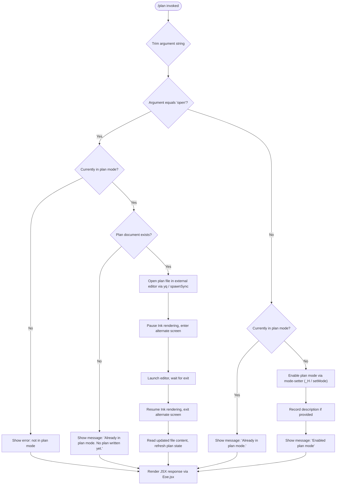

# `/plan`

> Analysis basis: CC v2.1.193 bundle.js (AST extraction + Claude interpretation)
> Minimum version: v2.1.193

---

## Overview

The `/plan` command enables "plan mode" for the current Claude Code session, or opens the existing session plan for editing if one has been written. When called without arguments or with a description, it activates plan mode and records the provided description; when called with the `open` keyword, it opens the plan document in the user's configured editor. The command manages plan state transitions and provides feedback messages for each state (not in plan mode, already in plan mode with no plan, already in plan mode with an existing plan).

---

## Registration

| Field | Value |
|---|---|
| type | `local-jsx` |
| name | `plan` |
| description | `Enable plan mode or view the current session plan` |
| argumentHint | `[open\|<description>]` |
| module_id | `G9l` |
| load_inline | `true` |
| loc_byte | `12678894` |
| loc_byte_end | `12679093` |
| loc_line | `8599` |
| arbor_handler.name | `AMf` |
| arbor_handler.fqn | `claude-2.1.193::AMf` |
| arbor_handler.kind | `AsyncFunction` |
| arbor_handler.resolution_path | `module_id` |
| arbor_handler.n_hits | `0` |

Analysis basis: CC v2.1.193 bundle.js:+12678894

---

## Input Branching

The command exhibits 4+ distinct branches based on the combination of current plan-mode state and the argument supplied. A Mermaid flowchart is used.



Analysis basis: CC v2.1.193 bundle.js:+12678051, +12678219, +12678239, +12678300, +12678459

---

## Behavioral Spec

### Top-Level Handler (`AMf`)

The async handler is the primary entry point resolved by Arbor via `module_id` lookup in module `G9l`.

```
async function planCommandHandler(userInput, appContext):
    rawArg = userInput.trim()                        // +12678281

    currentMode = getCurrentMode(appContext)          // rme, +12678063
    sessionPlan = getSessionPlan(appContext)          // o / s.map, +12678077

    if rawArg == "open":                             // +12678300
        if not isInPlanMode(currentMode):
            return renderResponse("Not in plan mode")

        planFilePath = getPlanFilePath(appContext)    // FM, +12678417
        if planFilePath is null or not exists:
            return renderResponse("Already in plan mode. No plan written yet.")  // +12678459

        openPlanInEditor(appContext, planFilePath)    // yq, +12678560
        return renderResponse(updatedPlanContent)

    else:
        if isInPlanMode(currentMode):
            return renderResponse("Already in plan mode.")  // +12678239

        enablePlanMode(appContext)                   // _H / setMode, +12678113
        if rawArg is not empty:
            storeDescription(rawArg)                 // kmt, +12678116

        logInfo("Enabled plan mode")                 // +12678219, info literal +13835852
        return renderResponse("Enabled plan mode")   // Eoe.jsx, +12678678
```

Analysis basis: CC v2.1.193 bundle.js:+12678014

---

### Mode Setter (`_H` — `setMode`)

Handles the transition into plan mode, including permission-mode guard logic.

```
function setMode(modeName, appState):
    if modeName == "bypassPermissions":              // +5394764
        if bypassPermissionsUnavailable(appState):
            log("Ignoring permission update: setMode 'bypassPermissions' rejected...")
            // full message at +5394830
            return

    appState.modeMap.set(modeName, true)             // n.set, +5396024

    currentRules = appState.permissionRules          // o.filter, +5396421

    processRuleSet("addRules",        currentRules)  // +5395106
    processRuleSet("replaceRules",    currentRules)  // +5395454
    processRuleSet("removeRules",     currentRules)  // +5396111
    processRuleSet("addDirectories",  currentRules)  // +5395765
    processRuleSet("removeDirectories", currentRules)// +5396495

    // allow / alwaysAllowRules: +5395291, +5395299
    // deny  / alwaysDenyRules:  +5395331, +5395338
    // alwaysAskRules:           +5395356
```

Analysis basis: CC v2.1.193 bundle.js:+5394828

---

### Plan File Manager (`BM` / `FM` — `planFileManager` / `getPlanFilePath`)

Resolves the on-disk path for the session plan and manages file I/O.

```
function getPlanFilePath(sessionContext):            // FM, +12678417
    store  = getSettingsStore()                     // Lt, +13514012
    planId = sessionContext.planId                  // Yy, +13514039
    parts  = buildPathParts(store, planId)           // Dq.join, +13514031
    return joinPath(parts)

function planFileManager(action, content, path):    // BM, +12678410
    filePath = getPlanFilePath(...)                 // FM, +13514118

    if action == "read":
        raw = readFile(filePath, encoding="utf-8")  // In / an, +13514187; "utf-8" +13514165
        return parseContent(raw)

    if action == "write":
        writeFile(filePath, content)                // Vo / an, +13514208
        return

    if action == "render":
        rendered = renderMarkdown(content)          // T, +13514221
        handleError(rendered)                       // xe / kZ.logError, +13514274
```

Analysis basis: CC v2.1.193 bundle.js:+13514008

---

### External Editor Launcher (`yq` — `openInEditor`)

Opens the plan file in the user's preferred editor by suspending the Ink TUI, spawning the editor synchronously, then resuming.

```
async function openInEditor(appContext, filePath):
    inkInstance = getInkInstance(appContext)         // jt, +11773193
    if inkInstance is null:
        throw Error("Ink instance not found - cannot pause rendering")  // +11773241

    editorCommand = resolveEditorCommand(appContext) // FG / Xh + sSf, +11773298
    fileStats     = stat(filePath)                   // t.statSync, +11773334

    editorArgs = buildEditorArgs(filePath, fileStats)// aSf / xMo, +11773382

    inkInstance.enterAlternateScreen()               // +11773394
    inkInstance.pause()                              // +11773424
    inkInstance.suspendStdin()                       // +11773434

    argv = editorCommand.split(" ")                  // s.split, +11773473
    argv = argv.slice(relevant range)                // i.slice, +11773498

    result = spawnSync(argv[0], argv.slice(1),       // R0l.spawnSync, +11773516
                       stdio="inherit")              // "inherit", +11773548

    updatedContent = readFileSync(filePath)          // t.readFileSync, +11773818

    inkInstance.exitAlternateScreen()                // +11773896
    inkInstance.resumeStdin()                        // +11773925
    inkInstance.resume()                             // +11773941

    return updatedContent
```

Analysis basis: CC v2.1.193 bundle.js:+11773193

---

### Editor Resolution (`FG` — `resolveEditorCommand`)

Determines the editor binary to launch based on environment and context.

```
function resolveEditorCommand(appContext):
    envEditor = getEnvironmentEditor()               // Xh, +11772491
    ideEditor  = getIDEEditor(appContext)             // sSf, +11772505
    // "IDE" literal at +6824211
    return envEditor ?? ideEditor ?? defaultEditor
```

Analysis basis: CC v2.1.193 bundle.js:+11772491

---

### File Label / Path Utilities (`WL` — `resolveFilePath`, `Lc` — `buildFilePath`)

Used when generating display names and canonical paths for the plan document.

```
function resolveFilePath(rawPath):                  // WL
    lower = rawPath.toLowerCase()                   // +6824266
    base  = path.basename(lower)                    // UP.basename, +6824324
    parsed = parsePathParts(rawPath)                // di, +6824310
    return normalise(base, parsed)                  // G5e, +6824398

function buildFilePath(rootDir, segments):          // Lc
    mapped  = expandPathTokens(rootDir)             // KXo, +206949
    cleaned = mapped.replace("[REDACTED]", "")      // +207028; e.replace, +206976
    last    = cleaned.at(-1)                        // r.at, +207086
    idx     = last.lastIndexOf("/")                 // n.lastIndexOf, +207112
    return last.slice(0, idx)                       // n.slice, +207138
```

Analysis basis: CC v2.1.193 bundle.js:+206949, +6824266

---

### Plan Description Storage (`kmt` — `storePlanDescription`)

Persists the description argument supplied to `/plan` into the session tool configuration.

```
function storePlanDescription(description, appContext):
    settings = buildSettingsObject(appContext)       // A3o, +13835554
    // Merges: $4 (base), II (inherit), Fvr (policy), +13835477..+13835489

    toolConfig = buildToolConfig(settings)           // X2, +13835645
    entries    = enumerateEntries(toolConfig)        // qAe, +13835656
    rendered   = renderToolList(entries)             // lj, +13835750

    logLevel = "info"                               // +13835852
    logEntry(logLevel, "plan", description)         // T, +13835778
    // "plan" string at +12678051
```

Analysis basis: CC v2.1.193 bundle.js:+13835554

---

### CLI Error Handler (`Is` — `handleCLIError`)

Handles fatal errors within the command by printing a red-styled message and exiting with code 1.

```
function handleCLIError(error):
    printStyledError(error, style=St.red)           // lKe / St.red, +13300613
    console.error(error)                            // +13300599
    writeErrorState("cli_error", error)             // OT, +13300651
    // OT uses Lse.writeFileSync (+201267) and jgr.join (+201285)
    process.exit(1)                                 // +13300667, exit code 1 at +13300680
```

Analysis basis: CC v2.1.193 bundle.js:+13300644

---

### Connection / Stream Utilities (`r` — `dataStreamHandler`)

Wraps the async handler's output in a data-typed stream consumed by the UI layer.

```
function dataStreamHandler(asyncFn):               // r, called from AMf at +12678014
    // "data" stream type at +17378420
    // chunk size limit: 1024 bytes at +17378473
    stream = wrapAsDataStream(asyncFn)
    return stream
```

Analysis basis: CC v2.1.193 bundle.js:+17378430

---

## State & Side Effects

| Item | Detail |
|---|---|
| Telemetry | No `tengu_*` telemetry events found in depth-2 traversal |
| Plan mode flag | Written to `appState.modeMap` via `_H` (`setMode`) at bundle.js:+5396024 |
| Permission rules | `alwaysAllowRules`, `alwaysDenyRules`, `alwaysAskRules` updated during mode transition (+5395291–+5395356) |
| Plan file (disk) | Written/read via `BM`/`FM` using `fs.appendFile`, `fs.mkdir`, `fs.rename`, `fs.unlink`, `fs.writeFileSync` (+214853, +214912, +214580, +214620, +201267) |
| Log append | Plan transcript log rotated/truncated via `YFc` (append file, check size, rename on overflow) at +214853–+215038 |
| Buffer byte-length check | Used during log rotation — `Buffer.byteLength` at +215307 and +215005 |
| TUI suspension | Ink alternate screen, stdin suspension, and resume cycle triggered during editor open (+11773394–+11773941) |
| External process | `spawnSync` with `stdio="inherit"` at +11773516, +11773548 |
| Error exit | `process.exit(1)` on fatal CLI error at +13300667 |
| ANSI stripping | Applied to editor output via `Bun.stripANSI` at +3953820 |
| JSX render | Final response rendered as JSX component `Eoe` at +12678678 |
| `bypassPermissions` guard | Silently ignored if `disableBypassPermissionsMode` is active; warning logged at +5394830 |

---

## Version History

| Version | Change |
|---|---|
| v2.1.193 | Initial analysis |

---

## Common Mistakes

1. **Running `/plan open` before plan mode is active** — The command returns immediately with a "not in plan mode" message. You must run `/plan` or `/plan <description>` first to activate plan mode before `open` is meaningful.
2. **Running `/plan open` before any plan has been written** — Even if plan mode is active, if no plan document has been written yet, the command responds with `"Already in plan mode. No plan written yet."` (+12678459) and does not launch the editor.
3. **Re-running `/plan` when already in plan mode** — Produces the message `"Already in plan mode."` (+12678239) without re-enabling or resetting plan mode; use `/plan open` to view/edit the existing plan instead.
4. **Expecting `/plan` to work with `bypassPermissions`** — If the session was not launched in `bypassPermissions` mode, any mode transition involving that permission level is silently rejected with a warning (+5394830).
5. **Assuming the editor respects async I/O** — The editor is spawned with `spawnSync` (blocking), so the TUI is fully suspended for the duration of the edit session. No other Claude Code interaction is possible until the editor exits.

---

## Appendix — Identifier Mapping

> For bundle debugging only. Identifiers change across versions.

| Identifier | Role |
|---|---|
| `AMf` | Main async handler for `/plan` command (Arbor-resolved via `module_id` G9l) |
| `r` | Data-stream wrapper; wraps handler output as typed `"data"` stream |
| `Is` | CLI error handler; prints error, writes state, calls `process.exit(1)` |
| `lKe` | Styled error printer (uses `St.red`) |
| `OT` | Error-state file writer (uses `Lse.writeFileSync`) |
| `rme` | Current session mode reader |
| `o` | Plan item mapper (calls `s.map`) |
| `s` | Plan item set manager (add/delete via `r.add`, `r.delete`) |
| `i` | Plan item stream controller (open/close channels) |
| `n` | Plan item name normaliser (`i.toLowerCase`) |
| `_H` | Mode setter (`setMode`); manages permission rules and mode flags |
| `T` | Telemetry/logging dispatcher; also used for rendering |
| `qFc` | Settings query combiner (calls `YO`, `Qgr`, `c7o`) |
| `c7o` | Settings namespace resolver (`JNc`, `QNc`) |
| `e` | Generic random/timer utility (`Math.random`, `setTimeout`) |
| `ke` | JSON serialiser wrapper (`JSON.stringify`) |
| `t` | Generic string/case helper (`t.toUpperCase`, `t.statSync`) |
| `Lc` | File path builder (token expansion, path cleaning) |
| `KXo` | Path-token expander (`jFc.map`) |
| `iYe` | Output writer wrapper (`OXo`) |
| `OXo` | Raw stream writer (`e.write`) |
| `XFc` | Transcript/log file manager (append, rotate, size-check) |
| `P7e` | Buffered async writer (uses `setTimeout`, `setImmediate`, `clearTimeout`) |
| `Ame` | Log header builder (`uYe`, `Sme.join`, `nr`, `Lt`) |
| `jt` | Ink instance accessor |
| `Cse` | File access error classifier (`an`) |
| `XXo` | Log file path joiner (`Sme.join`, `Lt`) |
| `nhr` | Log file rotator (`MU.stat`, `MU.rename`, `MU.unlink`) |
| `YFc` | Log append + rotation orchestrator (`MU.mkdir`, `MU.appendFile`) |
| `Ei` | Hook registrar (`a7o.register`) |
| `Lp` | String escaper for display (`AAu` / `e.replaceAll`) |
| `AAu` | Backslash/paren escape helper (`e.replaceAll`) |
| `kmt` | Plan description storage and tool-config logger |
| `A3o` | Settings object builder (`$4`, `II`, `Fvr`) |
| `$4` | Base settings extractor |
| `II` | Settings inheritor (`H3o`, `Dhe`, `As`) |
| `H3o` | Model group resolver (`Go`) |
| `Dhe` | Model name checker (against known model strings) |
| `As` | Settings applicator (`Y4`, `qo`, `oH`) |
| `Fvr` | Policy/flag/user/local settings merger (`_n`) |
| `_n` | Settings layer reader (`sun`, `yB`) |
| `X2` | Tool configuration builder |
| `qAe` | Tool entry enumerator (`Object.entries`, `_H`, `o.map`) |
| `lj` | Tool list renderer (`Object.entries`, `ug`, `f3o`, `T`, `Lp`) |
| `ug` | Tool display-name formatter (`TAu`, `Xk`, `IAu`, `bAu`) |
| `TAu` | Tool-name prefix handler |
| `Xk` | Tool property ownership checker (`Object.hasOwn`) |
| `IAu` | Tool-name suffix handler |
| `bAu` | Tool-name special-char replacer (`e.replaceAll`) |
| `f3o` | Tool file-path resolver (`t8e`, `n.push`, `p3o`, `r.match`) |
| `t8e` | Tool cache getter/setter (`Krl.get`, `Krl.set`, `oTo`, `fWt`, `gWt`, `rTo`) |
| `p3o` | Tool path relativiser (`jT.includes`, `dg`, `wQl.relative`, `Pt`) |
| `kQl` | Tool rule aggregator (`C6f`, `r.get`, `a.push`, `r.set`, `_H`) |
| `C6f` | Rule-source checker (`a1.includes`) |
| `a` | Rule-list builder (`l6e`, `Bcr`, `mSa`, `s.get`, `T`, `s.values`, `l`, `VWo`) |
| `fA` | Permission-check wrapper (`qu`) |
| `qu` | Core permission evaluator (`FNe`) |
| `FNe` | Permission rule matcher |
| `iEt` | Plan-mode status renderer (`mTe`, `Lt`) |
| `mTe` | Mode text formatter |
| `Lt` | Settings store accessor (`Rx`) |
| `Rx` | Raw settings reader |
| `BM` | Plan file manager (read/write/render dispatch) |
| `FM` | Plan file path resolver (`FDe`, `Lt`, `Dq.join`, `Yy`) |
| `FDe` | Plan file path constructor (`Lt`, `mTe`, `r.get`, `Yy`, `GGr`, `Znt`, `fCn`, `Dq.join`, `jt`, `r.set`) |
| `GGr` | Path string replacer (`e.replace`) |
| `Znt` | Path part extractor (`XPt`) |
| `fCn` | Path segment formatter (`XPt`) |
| `In` | File reader with ENOENT guard (`an`) |
| `an` | Filesystem error classifier (ENOENT, EISDIR, EACCES, etc.) |
| `Vo` | File writer with permission guard (`an`) |
| `xe` | Error handler / logger (`eo`, `at`, `Bi`, `e_u`, `rJe.push`, `kZ.logError`) |
| `eo` | Error constructor wrapper (`Error`, `String`) |
| `at` | Boolean/truthy string resolver (`"yes"`, `"on"`, `String`) |
| `Bi` | Error chain builder (`Rds`) |
| `Rds` | Error chain step (`at`) |
| `e_u` | Error log queue manager (`fln.shift`, `fln.push`) |
| `yq` | External editor launcher (`spawnSync`, stdin/stdout suspend/resume) |
| `FG` | Editor command resolver (`Xh`, `sSf`) |
| `Xh` | Environment-based editor picker |
| `aSf` | Editor argument builder (`xMo`) |
| `xMo` | File-type analyser for editor args (`w0l`, `tSf.find`, `t.includes`) |
| `w0l` | File basename/extension classifier (`cQn.basename`, `eSf.has`) |
| `WL` | File display-path resolver (`e.toLowerCase`, `di`, `UP.basename`, `G5e`) |
| `di` | Path component splitter (`e.indexOf`, `e.slice`) |
| `V9a` | JSX output renderer controller (`$pt`, `Al`) |
| `$pt` | Ink render mount (`o.on`, `i.toString`, `H8`, `Upt.jsx`) |
| `H8` | Ink render component builder (`bqr`, `Pqr`, `_te`) |
| `Pqr` | React element factory (`k$i.createElement`) |
| `_te` | Ink component wrapper (`cM`, `bLe`, `Tqr`) |
| `Al` | ANSI strip post-processor (`Bun.stripANSI`) |