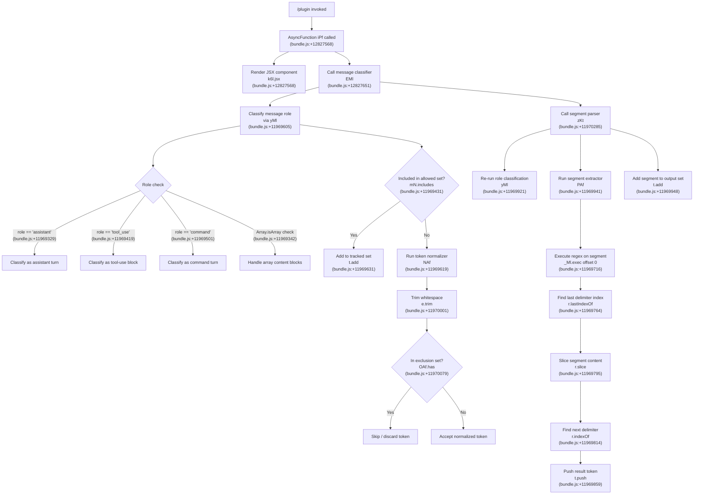

```
---
type: feature-spec
feature: "plugin"
cc_version: "2.1.193"
updated: "2026-06-26"
tags: ["plugin", "commands", "slash-commands"]
source: "bundle-analysis"
bundle_verified: true
analysis_basis: "CC v2.1.193 bundle.js (AST extraction + Claude interpretation)"
author: "ryujaeuk <ryujaeuk@gmail.com>"
repository: "https://github.com/MyLittleLuckyDog/cc-gnothi"
license: "AGPL-3.0-only"
---

# `/plugin`

> Analysis basis: CC v2.1.193 bundle.js (AST extraction + Claude interpretation)
> Minimum version: v2.1.193

---

## Overview

The `/plugin` command provides an interactive JSX-rendered interface for managing Claude Code plugins. It supports listing, discovering, and interacting with plugins (including a marketplace view), and is registered under the aliases `/plugins` and `/marketplace`. The command renders its UI inline (immediately) via a local JSX component resolved through module `R6l`.

---

## Registration

| Field | Value |
|---|---|
| type | `local-jsx` |
| name | `plugin` |
| description | `Manage Claude Code plugins` |
| aliases | `["plugins", "marketplace"]` |
| immediate | `true` |
| load_inline | `true` |
| module_id | `R6l` |
| loc_byte | `12830400` |
| loc_byte_end | `12830690` |
| arbor_handler.name | `iPf` |
| arbor_handler.fqn | `claude-2.1.193::iPf` |
| arbor_handler.kind | `AsyncFunction` |
| arbor_handler.resolution_path | `module_id` |
| arbor_handler.n_hits | `0` |

Analysis basis: CC v2.1.193 bundle.js:+12830400

---

## Input Branching

The call graph reveals at least three distinct processing branches within the handler and its downstream helpers: (1) a JSX component render path, (2) a message-classification path (assistant vs. tool_use vs. command roles), and (3) a token/segment parsing path. A Mermaid flowchart is therefore used.



---

## Behavioral Spec

### Handler Entry — Plugin UI Launcher

The primary handler (`iPf`, `AsyncFunction`) is reached via module resolution path `module_id → R6l`. Because `immediate: true` is set on the registration, the command renders its JSX interface without waiting for additional user confirmation.

```
async function pluginCommandHandler(context):
    # Step 1: Render plugin management UI
    renderJSXComponent(PluginManagerComponent, context)
    # (PluginManagerComponent = k6l.jsx, bundle.js:+12827568)

    # Step 2: Run message classifier to build context snapshot
    classifiedMessages = classifyConversationMessages(context.messages)
    # (classifyConversationMessages = EMl, bundle.js:+12827651)

    return classifiedMessages
```

Analysis basis: CC v2.1.193 bundle.js:+12827568, +12827651

---

### Sub-feature: Message Role Classifier (`EMl` → `KKt` → `yMl`)

This sub-system walks conversation history and categorises each message block by role. It feeds the plugin UI with a clean, typed view of the conversation context.

```
function classifyConversationMessages(messages):
    resultSet = new Set()

    for each message in messages:
        role = determineRole(message)           # yMl, bundle.js:+11969605
        # Role constants observed:
        #   "assistant"  (bundle.js:+11969329)
        #   "tool_use"   (bundle.js:+11969419)
        #   "command"    (bundle.js:+11969501)

        if Array.isArray(message.content):      # bundle.js:+11969342
            processContentBlocks(message.content)

        if mN.includes(role):                   # bundle.js:+11969431
            resultSet.add(message)              # bundle.js:+11969631
        else:
            normalized = normalizeToken(message)# NAf, bundle.js:+11969619
            if normalized is valid:
                resultSet.add(normalized)

    return resultSet
```

Analysis basis: CC v2.1.193 bundle.js:+11969605, +11969329, +11969419, +11969501, +11969342, +11969431, +11969631

---

### Sub-feature: Token Normalizer (`NAf`)

Called when a message does not match the allowed role set. Trims the raw token and checks it against an exclusion registry before accepting it.

```
function normalizeToken(rawToken):
    trimmed = rawToken.trim()                   # bundle.js:+11970001

    if exclusionSet.has(trimmed):               # OAf.has, bundle.js:+11970079
        return null                             # discard

    return trimmed
```

Analysis basis: CC v2.1.193 bundle.js:+11970001, +11970079

---

### Sub-feature: Segment Parser (`EMl` → `zKt` → `PAf`)

A secondary pass extracts structured segments (e.g., tool invocations, command tokens) from the classified message stream. It re-runs role classification on each candidate segment before extracting token spans.

```
function parseSegments(classifiedMessages):
    outputSet = new Set()

    for each segment in classifiedMessages:
        role = determineRole(segment)           # yMl re-invoked, bundle.js:+11969921

        tokens = extractTokenSpans(segment)     # PAf, bundle.js:+11969941

        for each token in tokens:
            outputSet.add(token)                # bundle.js:+11969948

    return outputSet

function extractTokenSpans(segment):
    results = []
    startOffset = 0                             # literal 0, bundle.js:+11969705

    matchResult = segmentRegex.exec(segment)    # _Ml.exec, bundle.js:+11969716

    lastDelimPos = segment.lastIndexOf(delim)   # bundle.js:+11969764
    sliced = segment.slice(startOffset, lastDelimPos) # bundle.js:+11969795
    nextDelim = sliced.indexOf(delim)           # bundle.js:+11969814

    results.push(extractedToken)                # bundle.js:+11969859
    return results
```

Analysis basis: CC v2.1.193 bundle.js:+11969921, +11969941, +11969948, +11969705, +11969716, +11969764, +11969795, +11969814, +11969859

---

### Sub-feature: Data Buffer Limit

A buffer size constant of **1024** is observed in the traversal at `bundle.js:+17378473`, associated with identifier `r` (a data transport helper reaching `Is`). This likely caps the size of a data payload passed through the plugin channel.

- Buffer limit: **1024** units (bundle.js:+17378473)
- Data field key: `"data"` (bundle.js:+17378420)

Analysis basis: CC v2.1.193 bundle.js:+17378420, +17378473

---

### Sub-feature: Async Timing Jitter (Depth-2 edge)

Within the traversal, the helper reachable as `e` invokes `Math.random` and `setTimeout` with constants `2` and `1`. This indicates a small randomised delay (between 1 and 2 time units) is introduced at some point in the async pipeline — likely for UI debounce or rate-limiting plugin discovery queries.

```
function scheduleWithJitter(callback):
    jitter = Math.random() * 2      # literals 2, 1 — bundle.js:+14343445, +14343461
    delay = Math.floor(jitter) + 1
    setTimeout(callback, delay)     # bundle.js:+14343484
```

Analysis basis: CC v2.1.193 bundle.js:+14343445, +14343461, +14343484, +14343447

---

## State & Side Effects

| Item | Detail |
|---|---|
| Telemetry | None detected in depth-2 traversal (`telemetry: []`) |
| Hook registration | `immediate: true` — command renders JSX immediately on invocation without user confirmation |
| JSX component | `k6l.jsx` rendered inline via `local-jsx` type (bundle.js:+12827568) |
| Module loaded | Module `R6l` resolved via `load_inline: true`; no separate dynamic import |
| appState changes | <!-- TODO: not found in depth-2 traversal; needs --depth 4 --> |
| Conversation context | Builds a classified message set (`EMl`) and a segment token set (`zKt`) from conversation history |
| Exclusion set | `OAf` (a `Set`-like object) gates token acceptance in the normalizer (bundle.js:+11970079) |
| Data buffer | 1024-unit cap on data payloads through helper `r`/`Is` (bundle.js:+17378473) |
| Async jitter | `Math.random`-based `setTimeout` delay (1–2 units) in helper `e` (bundle.js:+14343484) |
| Sound | <!-- TODO: not found in depth-2 traversal; needs --depth 4 --> |

---

## Version History

| Version | Change |
|---|---|
| v2.1.193 | Initial analysis |

---

## Common Mistakes

1. **Invoking via `/plugin` vs `/plugins`**: Both aliases (`/plugins`, `/marketplace`) resolve to the same handler. Users may be unaware that `/marketplace` is a valid entry point to the same plugin management UI.
2. **Expecting a prompt-based interaction**: Because this command is `local-jsx` with `immediate: true`, it renders a UI component rather than sending a text prompt to the model. Commands that wrap a prompt-type handler behave differently.
3. **Assuming telemetry is present**: No telemetry events were detected at depth 2. Callers or tooling that expect `tengu_*` events from this command will receive none from the current bundle.
4. **Ignoring the exclusion set (`OAf`)**: Tokens that exist in the built-in exclusion registry are silently discarded during normalisation. Plugin authors passing command tokens should be aware that certain reserved strings may be dropped.
5. **Overlooking the 1024-unit data buffer cap**: Data payloads routed through the internal `r`/`Is` transport helper are capped at 1024 units (bundle.js:+17378473). Exceeding this limit may cause silent truncation.

---

## Appendix — Identifier Mapping

> For bundle debugging only. Identifiers change across versions.

| Identifier | Role |
|---|---|
| `iPf` | Primary async handler for `/plugin` command (AsyncFunction, resolved via module `R6l`) |
| `EMl` | Message classifier — orchestrates role classification and segment parsing |
| `KKt` | Role classification coordinator — dispatches to `yMl` and `NAf` |
| `yMl` | Role determiner — checks `Array.isArray` and `mN.includes` to assign message role |
| `NAf` | Token normalizer — trims whitespace and checks against exclusion set `OAf` |
| `zKt` | Segment parser — iterates classified messages and extracts token spans via `PAf` |
| `PAf` | Token span extractor — applies regex, `lastIndexOf`, `slice`, `indexOf`, and `push` |
| `e` | Async timing helper — introduces jitter via `Math.random` + `setTimeout` |
| `t` | Accumulator / working set — used as both `Set` (`.add`) and array (`.push`) in different call sites |
| `r` | Data transport helper — wraps `Is`, uses `"data"` field key, bounded at 1024 units |

---

Note: index built via Arbor fallback; some signals (telemetry, literals) may be missing — see arbor-fallback.js.
```