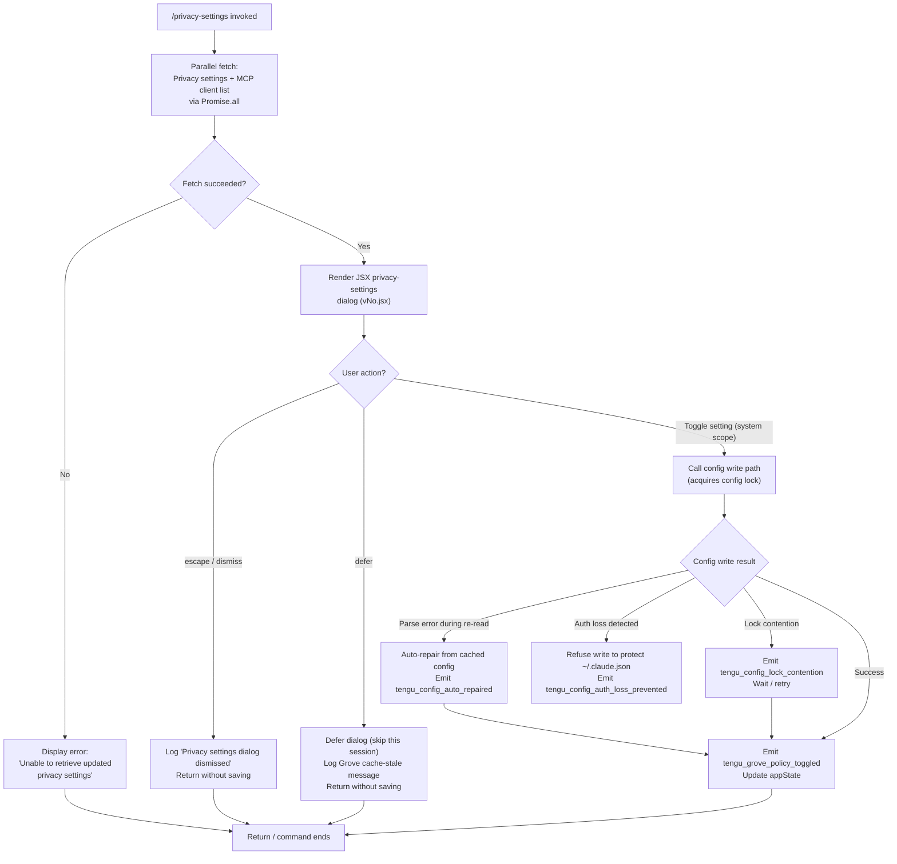

# `/privacy-settings`

> Analysis basis: CC v2.1.193 bundle.js (AST extraction + Claude interpretation)
> Minimum version: v2.1.193

---

## Overview

The `/privacy-settings` command opens an interactive dialog that allows the user to view and update their privacy configuration (the "Grove policy"). When invoked, the handler asynchronously fetches current privacy state, renders a JSX-based settings panel, and persists any user-initiated changes back to the global config — emitting a `tengu_grove_policy_toggled` telemetry event on each change.

---

## Registration

| Field | Value |
|---|---|
| type | `local-jsx` |
| name | `privacy-settings` |
| description | `"View and update your privacy settings"` |
| module_id | `c4l` |
| load_inline | `true` |
| loc_byte | `12701426` |
| loc_byte_end | `12701609` |
| loc_line | `8609` |
| arbor_handler.name | `NMf` |
| arbor_handler.fqn | `claude-2.1.193::NMf` |
| arbor_handler.kind | `AsyncFunction` |
| arbor_handler.resolution_path | `module_id` |
| arbor_handler.n_hits | `0` |

Analysis basis: CC v2.1.193 bundle.js:+12701426

---

## Input Branching

The handler has 4+ distinct branches determined by the state of privacy settings retrieval (success, failure, user escape, user defer) plus the config-cache freshness paths in the underlying config reader:



---

## Behavioral Spec

### 1. Handler Entry — `privacySettingsHandler` (bundle identifier: `NMf`)

The async handler is resolved via module `c4l` using the `module_id` resolution path.

```
async function privacySettingsHandler(commandContext):
    # Parallel initialization
    [privacyState, mcpClientList] = await Promise.all([
        fetchPrivacySettings(),   // Dne
        loadMcpClients()          // lke
    ])

    if fetch failed:
        return errorResult("Unable to retrieve updated privacy settings")

    # Render interactive dialog
    result = await renderPrivacyDialog(privacyState, commandContext)  // vNo.jsx

    if result.action == "escape" or result.action == "defer":
        log("Privacy settings dialog dismissed")
        return

    # Persist changes with system scope
    await writePrivacyConfig(result.newSettings, scope="system")  // triggers V, Ve → Zze

    emitTelemetry("tengu_grove_policy_toggled")
```

Analysis basis: CC v2.1.193 bundle.js:+12700437, +12700477, +12700490, +12700695, +12700753, +12700980, +12701093

### 2. Config Cache Layer — `configCacheReader` (bundle identifier: `Vut`)

The config is read through a Grove-style cache that tracks freshness:

```
function configCacheReader(configKey):
    if cache is empty:
        log("Grove: No cache, fetching config in background (dialog skipped this session)")
        fetch config in background
        return null

    if cache is stale:
        log("Grove: Cache stale, returning cached data and refreshing in background")
        trigger background refresh
        return cachedData

    log("Grove: Using fresh cached config")
    return cachedData
```

Analysis basis: CC v2.1.193 bundle.js:+7381456, +7381571, +7381651, +7381691, +7381797

### 3. Config File I/O with Lock — `saveConfigWithLock` (bundle identifier: `dXt`)

All writes go through a lock-guarded file operation:

```
function saveConfigWithLock(newConfig, scope):
    acquire file lock (timeout: 60000 ms)   // 60s max wait

    if lock took unexpectedly long:
        log("Lock acquisition took longer than expected - another Claude instance may be running")
        emit tengu_config_lock_contention

    reReadConfig = readFileSync(configPath, encoding="utf-8")

    if reReadConfig has parse error:
        log("saveConfigWithLock: re-read hit a parse error; auto-repairing...")
        emit tengu_config_auto_repaired
        useRepaired = true

    if reReadConfig is missing auth that cache has:
        log("saveConfigWithLock: re-read config is missing auth...")
        emit tengu_config_auth_loss_prevented
        abort write     // Refuses to wipe ~/.claude.json (GH #3117)
        return

    mergedConfig = merge(reReadConfig, newConfig)
    writeFileSync(configPath, mergedConfig)

    # Backup rotation: keep at most 5 backups with ".backup." prefix
    manageBackups(configDir, maxBackups=5, prefix=".backup.")

    release lock
```

Analysis basis: CC v2.1.193 bundle.js:+13973351, +13973562, +13973651, +13973787, +13974036, +13974342, +13974700, +13974816, +13974955, +13975964, +13976026, +13976053

### 4. Global Config Save Fallback — `saveGlobalConfigFallback` (bundle identifier: `Qor`)

When the primary lock-based save cannot proceed:

```
function saveGlobalConfigFallback(config, cachedConfig):
    if cachedConfig has auth but reReadConfig does not:
        log("saveGlobalConfig fallback: re-read config is missing auth...")
        emit tengu_config_fallback_write
        return   // Safety: never wipe auth fields

    write config to disk
    emit tengu_config_fallback_write
```

Analysis basis: CC v2.1.193 bundle.js:+13970407, +13970663

### 5. Privacy Dialog Dismissal Strings

Two action tokens are recognized when the user closes the dialog without committing changes:

- `"escape"` — user pressed Escape key (Analysis basis: CC v2.1.193 bundle.js:+12700601)
- `"defer"` — user chose to defer the dialog for this session (Analysis basis: CC v2.1.193 bundle.js:+12700615)

In both cases the literal string `"Privacy settings dialog dismissed"` is logged (Analysis basis: CC v2.1.193 bundle.js:+12700626).

The persisted scope for accepted changes is `"system"` (Analysis basis: CC v2.1.193 bundle.js:+12700671).

### 6. MCP Client Initialization — `mcpClientLoader` (bundle identifier: `l6e`)

Privacy settings dialog initialization also triggers a full MCP client load. This involves:

```
function mcpClientLoader(context):
    for each server in configuredServers:
        resolve transport type (stdio | sse | http | sse-ide | ws-ide | claudeai-proxy)

        if server status is "failed" and within 15-min cooldown:
            log("Skipping connection (recent failure cached; retries automatically in 15 min...)")
            continue

        if server status is "needs-auth":
            log("Skipping connection (cached needs-auth)")
            continue

        connect(server)

        on success: mark "connected"
        on failure: cache failure timestamp, mark "failed"

    return connectedClientMap
```

Analysis basis: CC v2.1.193 bundle.js:+6997563, +6997763, +6997862, +6997898, +6998170, +6998356, +6998422, +6998585, +6998609, +6998793

### 7. Log File Writer — `logFileWriter` (bundle identifier: `XFc` / `YFc`)

Telemetry and debug log lines written during the command flow use a rotating log writer:

```
function logFileWriter(message, level="debug"):
    dir = dirname(logFilePath)
    ensureDir(dir)

    if currentLogSize + byteLength(message) > threshold:
        rotateLogs()   // rename existing, trim old files via nhr

    appendFile(logFilePath, message)
```

File rotation uses `.txt` extension detection and a slice of 4 bytes for suffix matching (Analysis basis: CC v2.1.193 bundle.js:+214528, +214550).

---

## State & Side Effects

| Item | Detail |
|---|---|
| Telemetry: `tengu_grove_policy_toggled` | Emitted whenever the user commits a privacy setting change (bundle.js:+12700982) |
| Telemetry: `tengu_config_parse_error` | Emitted if the config file fails JSON parse during a read (bundle.js:+13977384) |
| Telemetry: `tengu_config_lock_contention` | Emitted if file lock acquisition exceeds expected duration (bundle.js:+13973651) |
| Telemetry: `tengu_config_stale_write` | Emitted on a detected stale write attempt (bundle.js:+13973787) |
| Telemetry: `tengu_config_auto_repaired` | Emitted when cached config is used to auto-repair a corrupt on-disk file (bundle.js:+13974164) |
| Telemetry: `tengu_config_auth_loss_prevented` | Emitted when a write is blocked to protect auth credentials (bundle.js:+13974494) |
| Telemetry: `tengu_config_fallback_write` | Emitted when the fallback global-config write path is taken (bundle.js:+13973267) |
| Telemetry: `tengu_daemon_config_reload` | Emitted when the daemon reloads config after a change (bundle.js:+17498707) |
| Telemetry: `tengu_mcp_skills` | Emitted during MCP client capability enumeration (bundle.js:+6781017) |
| Config file write | Modifies `~/.claude.json` under a file lock with auto-backup rotation (max 5 backups, prefix `.backup.`) |
| appState changes | Grove policy toggle updates in-memory app state via `Ve` → `Zze` path (bundle.js:+12701043) |
| JSX rendering | Dialog rendered via `vNo.jsx` (bundle.js:+12701093) |
| MCP client side-effects | Full MCP client list is loaded in parallel with privacy state fetch; may trigger background reconnects |
| Sound | <!-- TODO: not found in depth-2 traversal; needs --depth 4 --> |

---

## Version History

| Version | Change |
|---|---|
| v2.1.193 | Initial analysis |

---

## Common Mistakes

1. **Invoking during concurrent Claude instances**: If another Claude process is running and holds the config lock, `/privacy-settings` may observe the "Lock acquisition took longer than expected" warning (bundle.js:+13973562). The command will still complete but may be delayed.

2. **Expecting immediate persistence on dismiss**: Pressing Escape or choosing "defer" produces no config write. The dialog is dismissed cleanly and the `"Privacy settings dialog dismissed"` message is logged, but no setting is changed.

3. **Assuming the command is synchronous**: The handler is an `AsyncFunction` (`arbor_handler.kind: AsyncFunction`). It performs a `Promise.all` on two async fetches before rendering; in slow environments the dialog may take a moment to appear.

4. **Editing `~/.claude.json` manually while the dialog is open**: The config write path re-reads the file under lock before merging. A manually edited file that causes a parse error will trigger auto-repair from the in-memory cache (emitting `tengu_config_auto_repaired`), which may overwrite manual edits.

5. **Expecting MCP servers to remain unaffected**: Opening `/privacy-settings` triggers a full MCP client initialization pass (`l6e`) in parallel, which may reconnect or skip servers based on their cached failure/auth state.

---

## Appendix — Identifier Mapping

> For bundle debugging only. Identifiers change across versions.

| Identifier | Role |
|---|---|
| `NMf` | Main async handler for `/privacy-settings` (privacySettingsHandler) |
| `Vut` | Config cache reader ("Grove" layer) |
| `LBe` | Config context builder / initializer |
| `Ci` | Config instance constructor |
| `HPr` | Config property getter (primary) |
| `hPr` | Config property getter (secondary/helper) |
| `Dy` | Config field accessor / dispatcher |
| `So` | Config scope resolver |
| `wB` | Array/include membership checker for config scope |
| `Whi` | Config watcher / change notifier |
| `Rc` | Config reader entry point |
| `kt` | Config file loader (reads from disk) |
| `jt` | Path resolver utility |
| `a9o` | Config path constant provider |
| `bSt` | Config file backup manager |
| `xjf` | Config file watcher / unwatch helper |
| `T` | General logging/telemetry emit function |
| `qFc` | Log channel router |
| `c7o` | Log target dispatcher (JNc / QNc) |
| `e` | Generic utility / environment accessor |
| `ke` | JSON stringify wrapper |
| `Lc` | Log line formatter / path redactor ("[REDACTED]") |
| `KXo` | Log prefix mapper |
| `iYe` | Output write dispatcher |
| `OXo` | Raw output writer (e.write) |
| `XFc` | Log file write orchestrator (rotating) |
| `P7e` | Batched write scheduler (setTimeout/setImmediate) |
| `Ame` | Log assembly helper (joins segments, calls `nr`, `Lt`) |
| `Cse` | EISDIR error handler for log writes |
| `XXo` | Log file path builder (Sme.join + Lt) |
| `nhr` | Log file rotation executor (stat/rename/unlink) |
| `YFc` | Log file append-and-rotate handler |
| `Ei` | Hook/event registration dispatcher (a7o.register) |
| `nxa` | Background config refresh scheduler |
| `mn` | Global config save orchestrator |
| `dXt` | saveConfigWithLock — lock-guarded file write |
| `m1e` | Config merge helper |
| `l9o` | Config entries enumerator |
| `cXt` | Timestamp / lock-expiry calculator |
| `lXt` | Config load+backup bootstrap |
| `TSt` | Config schema type checker |
| `V` | Void/no-op or value passthrough utility |
| `Qor` | saveGlobalConfig fallback writer |
| `a` | MCP update applicator / session reconciler |
| `l6e` | MCP client loader / connection manager |
| `V3` | MCP server slot processor |
| `rct` | MCP server slot constructor (TN + _ie) |
| `aX` | MCP server connection initiator |
| `H6` | MCP server SDK client builder |
| `m1n` | MCP error/warning colorizer (red/yellow) |
| `o` | Padding/formatting utility (padEnd) |
| `ect` | MCP transport type router (sse/http/stdio) |
| `yF` | Object prototype creator (Object.create) |
| `d` | Daemon session/process manager |
| `BL` | MCP server state registry |
| `mg` | MCP server config loader (afe + kt + va) |
| `eso` | MCP server error store |
| `Nn` | Notification / broadcast helper |
| `QBt` | MCP client filter predicate |
| `fba` | MCP capabilities fingerprinter |
| `mao` | MCP auth cache reader (mcp-needs-auth-cache.json) |
| `hRe` | MCP capability hasher (sha256/hex) |
| `iTn` | MCP tool schema normalizer |
| `aTn` | MCP capability set builder |
| `tI` | MCP tool identity hasher (wHi.createHash) |
| `sTn` | MCP capability serializer (Zl) |
| `Zl` | Stable serializer (hXs) |
| `sn` | MCP debug logger (rJe.push + kZ.logMCPDebug) |
| `P1n` | MCP connection protocol handler (OAuth-capable) |
| `Tr` | Transport initializer |
| `Hlp` | OAuth/auth flow handler (authenticate, promise race) |
| `_lp` | OAuth callback processor (complete_authentication) |
| `e3t` | MCP async connection executor |
| `qs` | AsyncLocalStorage context accessor (Kqu.getStore) |
| `GNn` | MCP server name path builder (BNn.join + nr) |
| `hso` | MCP connection health checker |
| `be` | String coercion wrapper |
| `m` | Process/worker kill manager (SIGTERM) |
| `R` | Worker write/value handler |
| `jL` | MCP skills telemetry emitter |
| `it` | tengu_mcp_skills event builder |
| `Zoo` | MCP connection state checker (includes) |
| `w` | Background worker scheduler (blurred/focused state) |
| `B7` | Background worker state machine |
| `L` | Background worker lifecycle manager (sweep/retire/prewarm) |
| `v` | Worker state value holder |
| `KAc` | Worker queue accessor (e.at) |
| `zAc` | Worker state summarizer (Ylr) |
| `iu` | MCP error logger (rJe.push + kZ.logMCPError) |
| `_ba` | MCP protocol message validator (I8) |
| `I8` | JSON-RPC / protocol message parser |
| `Uct` | parseInt wrapper (radix 10) |
| `jNn` | parseInt wrapper (radix 20) |
| `Bcr` | MCP update applicator (applyConnectionResult) |
| `a6e` | MCP slot config comparator |
| `oT` | MCP orphan connection cleaner |
| `s6e` | MCP slot cleanup helper |
| `mSa` | MCP server auto-discovery handler (sio) |
| `sio` | MCP server discovery implementation |
| `s` | Async resource tracker (add/finally/delete) |
| `i` | Connection close handler (n.close / r.close) |
| `l` | Daemon session wrapper (C8l) |
| `C8l` | Daemon status writer (daemon.status.json) |
| `iee` | Daemon event emitter (Yge) |
| `v7t` | Daemon status path builder (I8l.join + nr) |
| `VWo` | MCP full reconnect orchestrator |
| `E1n` | MCP server capability presence checker (Nap.has / cso.has) |
| `Un` | Connection timeout handler (setTimeout/clearTimeout) |
| `c` | Background session marker (yn) |
| `Ve` | App state updater (privacy toggle) |
| `Zze` | App state root reducer |

---

Note: index built via Arbor fallback; some signals (telemetry, literals) may be missing — see arbor-fallback.js.