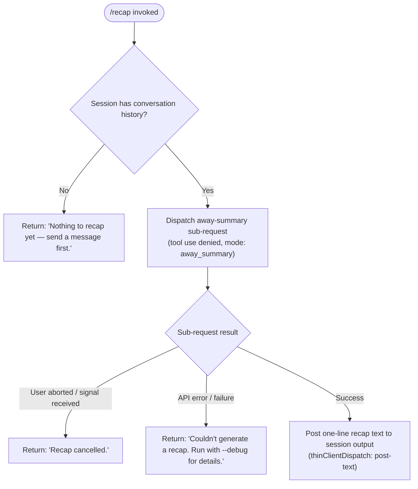

# `/recap`

> Analysis basis: CC v2.1.193 bundle.js (AST extraction + Claude interpretation)
> Minimum version: v2.1.193

---

## Overview

The `/recap` command triggers an immediate on-demand generation of a single-line session summary, describing what has happened in the current Claude Code session so far. It operates by dispatching an "away summary" sub-request through the main query pipeline, enforcing tool-use restrictions, and then posts the resulting one-liner back to the user as text. If the session has no conversation history yet, the command exits early with a prompt to send a message first.

---

## Registration

| Field | Value |
|---|---|
| type | `local` |
| name | `recap` |
| description | `Generate a one-line session recap now` |
| loc_byte | `13209256` |
| loc_byte_end | `13209472` |
| loc_line | `8978` |
| supportsNonInteractive | `false` |
| thinClientDispatch | `post-text` |
| load_inline | `true` |
| load_ident | `MFf` |
| arbor_handler.name | `MFf` |
| arbor_handler.fqn | `claude-2.1.193::MFf` |
| arbor_handler.kind | `AsyncFunction` |
| arbor_handler.resolution_path | `load_ident` |
| arbor_handler.n_hits | `0` |

Analysis basis: CC v2.1.193 bundle.js:+13209256

---

## Input Branching

The handler has four distinct branches based on session state and sub-request outcome, so a Mermaid flowchart is used.



Analysis basis: CC v2.1.193 bundle.js:+13209006, +13209098, +13209156

---

## Behavioral Spec

### Top-Level Handler: recapCommandHandler (`MFf`)

```
async function recapCommandHandler(commandContext):
    # Step 1: Guard — require existing conversation turns
    history = getConversationHistory(commandContext)
    if history is empty or has no user turns:
        return postText("Nothing to recap yet — send a message first.")

    # Step 2: Build away-summary sub-request parameters
    params = buildAwaySummaryParams(commandContext)
    if params is null:
        # CacheSafeParams not available — log "[awaySummary] no CacheSafeParams saved, skipping"
        return

    # Step 3: Set up abort/cancel listener
    abortController = createAbortController()
    commandContext.addEventListener("abort", () => abortController.abort())

    # Step 4: Dispatch sub-request via awayQueryRunner
    result = await awayQueryRunner(params, abortController.signal, {
        mode: "away_summary",
        toolPolicy: "deny",          # "Away summary cannot use tools"
        turnPolicy: "no-turn"
    })

    # Step 5: Branch on result
    match result.status:
        case "abort":
            return postText("Recap cancelled.")
        case "api-error" | "other":
            return postText("Couldn't generate a recap. Run with --debug for details.")
        case "ok":
            return postText(result.recapLine)
```

Analysis basis: CC v2.1.193 bundle.js:+13208864, +13209006, +13209098, +13209156, +7214438, +7214496, +7214552, +7214729, +7214744, +7214812

---

### Away-Summary Sub-Request Dispatcher (`M3t`)

The handler delegates to `M3t`, which manages the away-summary lifecycle.

```
async function awaySummaryDispatcher(params, signal, options):
    # Verify saved CacheSafeParams are present
    if not params.cacheSafeParams:
        log("[awaySummary] no CacheSafeParams saved, skipping")
        return null

    # Register abort propagation
    signal.addEventListener("abort", () => abortInternalController.abort())

    # Execute main query pipeline (queryRunner / Flf) with restrictions:
    #   - tool policy = "deny"  →  "Away summary cannot use tools"
    #   - turn mode  = "no-turn"
    #   - context tag = "away_summary"
    rawResult = await queryRunner(params, {
        toolPolicy: "deny",
        turnMode: "no-turn",
        contextTag: "away_summary"
    })

    # Collect result messages; extract first assistant text block
    assistantMessages = rawResult.filter(msg => msg.role == "assistant")
    recapLine = assistantMessages.at(0)?.text ?? null

    # Map internal result to status token
    if signal.aborted:
        return { status: "abort" }
    if rawResult.isError:
        return { status: "api-error" }
    return { status: "ok", recapLine }
```

Analysis basis: CC v2.1.193 bundle.js:+7214417, +7214436, +7214496, +7214533, +7214564, +7214611, +7214631, +7214973

---

### Model Resolution (`As` / `qo`)

Inside the query pipeline, the model-selection utility normalises model aliases used to call the API.

```
function resolveModel(modelAlias):
    normalised = modelAlias.trim().toLowerCase()
    match normalised:
        case "fable":   return resolvedFableModel()
        case "opusplan":return resolvedOpusPlanModel()
        case "sonnet":  return resolvedSonnetModel()
        case "haiku":   return resolvedHaikuModel()
        case "opus":    return resolvedOpusModel()
        case "best":    return resolvedBestModel()
        default:        return applyModelReplace(normalised)
    # Internal token "[1m]" used as compact placeholder during resolution
```

Analysis basis: CC v2.1.193 bundle.js:+2290111, +2306306, +2306317, +2306383, +2306434, +2306450, +2306495, +2306538, +2306580, +2306618

---

### Away-Summary Result Flattening (`_va`)

After the sub-request completes, a final utility flattens the multi-message result into candidate summary strings.

```
function flattenAwaySummaryResults(resultMessages):
    candidates = resultMessages.flatMap(msg => extractTextBlocks(msg))
    return candidates
```

Analysis basis: CC v2.1.193 bundle.js:+7215062, +7215272

---

### Transcript / Session-Log Writer (`XFc` / `YFc`)

The query pipeline's transcript writer persists conversation turns to disk as a rotating append-only log.

```
async function transcriptWriter(entry, logDir):
    filePath = path.join(logDir, buildLogFileName())
    await fs.mkdir(logDir, { recursive: true })
    byteLength = Buffer.byteLength(entry)
    await fs.appendFile(filePath, entry)

    # Rotate when current file exceeds size threshold
    stat = await fs.stat(filePath)
    if stat.size >= rotationThreshold:
        rotatedPath = filePath.endsWith(".txt")
            ? filePath.slice(0, -4) + rotationSuffix
            : filePath + rotationSuffix
        await fs.rename(filePath, rotatedPath)
        await pruneOldLogs(logDir, maxKeepCount=4)

    # Register SIGTERM handler for clean shutdown
    registerSignalHandler("SIGTERM", cleanupFn)
```

Analysis basis: CC v2.1.193 bundle.js:+215099, +215124, +215252, +215301, +215307, +215340, +215366, +214424, +214517, +214528, +214539, +214550, +214580, +214853, +214912

---

### Unique-ID Generation (`wD`)

Session and request identifiers are generated using a hex-encoded random buffer, with a regex guard to reject non-conforming strings.

```
function generateUniqueId():
    if not conformancePattern.test(candidateId):
        sanitised = candidateId.replace(nonConformingChars, "")
    randomBytes = crypto.randomBytes(8)   # 8 bytes → 16 hex chars
    return randomBytes.toString("hex")    # length 63-char candidate checked first
```

Analysis basis: CC v2.1.193 bundle.js:+27930, +27944, +27976, +27986, +28002, +28014

---

## State & Side Effects

| Item | Detail |
|---|---|
| Telemetry | See table below — 37 `tengu_*` events reachable via the shared query pipeline (`Flf`). Directly relevant to recap: none specific to `/recap` itself were found at depth ≤ 2; all events listed are from the shared query-runner infrastructure traversed by the sub-request. |
| Transcript / log file | The away-summary call is written to the rotating session log via `YFc` / `XFc` (`appendFile`, `mkdir`, `rename`). Analysis basis: CC v2.1.193 bundle.js:+214912 |
| AbortController | A new `AbortController` is created and wired to the session's `abort` event. If the user interrupts while recap is in flight, the sub-request is cancelled. Analysis basis: CC v2.1.193 bundle.js:+7214533, +7214564 |
| appState changes | `e.setAppState` / `e.getAppState` are called within the shared query runner (`n8n`) during session tracking; no recap-specific state keys were identified at depth ≤ 2. Analysis basis: CC v2.1.193 bundle.js:+10989702, +10988480 |
| Sound | <!-- TODO: not found in depth-2 traversal; needs --depth 4 --> |
| Tool use | Hard-denied for the recap sub-request: tool policy is `"deny"` and the literal `"Away summary cannot use tools"` enforces this. Analysis basis: CC v2.1.193 bundle.js:+7214729, +7214744 |
| thinClientDispatch | `post-text` — the command result is posted back as plain text in thin-client (non-interactive) execution contexts. Analysis basis: CC v2.1.193 bundle.js:+13209256 |

### Telemetry Events (reachable via shared query pipeline)

| Event | loc_byte |
|---|---|
| `tengu_auto_compact_rapid_refill_breaker` | +10931894 |
| `tengu_auto_compact_succeeded` | +10932414 |
| `tengu_ptl_surfaced_to_user` | +10937284 |
| `tengu_refusal_fallback_suppressed` | +10938534 |
| `tengu_rotunda_pennant_applied` | +10940758 |
| `tengu_rotunda_pennant_tools` | +10941885 |
| `tengu_refusal_fallback_dialog_suppressed` | +10945185 |
| `tengu_refusal_fallback_prompt_shown` | +10945442 |
| `tengu_refusal_fallback_prompt_choice` | +10945777 |
| `tengu_fallback_credit_forfeited` | +10945896 |
| `tengu_refusal_fallback_triggered` | +10947156 |
| `tengu_orphaned_messages_tombstoned` | +10948507 |
| `tengu_refusal_fallback_supersedes` | +10949995 |
| `tengu_model_fallback_triggered` | +10953568 |
| `tengu_query_error` | +10954252 |
| `tengu_model_response_keyword_detected` | +10955297 |
| `tengu_malformed_tool_use_retry_outcome` | +10955944 |
| `tengu_malformed_tool_use_response` | +10960160 |
| `tengu_stop_hook_block_count` | +10962243 |
| `tengu_loop_dynamic_wakeup_ends_turn` | +10966042 |
| `tengu_post_autocompact_turn` | +10966225 |
| `tengu_query_before_attachments` | +10966343 |
| `tengu_query_after_attachments` | +10968664 |
| `tengu_mcp_tools_refreshed_mid_turn` | +10968969 |
| `tengu_feature_ok` | +1026754 |
| `tengu_feature_bad` | +1026821 |
| `tengu_bg_dispatch_sigkill_escalate` | +17482166 |
| `tengu_bg_low_mem_mb` | +13266461 |
| `tengu_bg_dispatch_low_mem` | +17482767 |
| `tengu_daemon_idle_exit` | +17504149 |
| `tengu_bg_spare_enable` | +17483464 |
| `tengu_bg_sendclaim_failed` | +17458401 |
| `tengu_bg_spare_claim` | +17483592 |
| `tengu_bg_spare_claim_fail` | +17483858 |
| `tengu_forked_agent_default_turns_exceeded` | +10993263 |
| `tengu_fork_agent_query` | +10993706 |

---

## Version History

| Version | Change |
|---|---|
| v2.1.193 | Initial analysis |

---

## Common Mistakes

1. **Running `/recap` with no prior conversation** — The command returns `"Nothing to recap yet — send a message first."` and does nothing further. You must have at least one assistant turn in the session before a recap can be generated.
2. **Expecting multi-line output** — The command is designed to produce a single-line recap only. Long session histories are summarised into one line; the output is not a full transcript.
3. **Using in non-interactive scripts with `--no-interactive`** — `supportsNonInteractive` is `false`. The command will not execute in fully non-interactive mode. Analysis basis: CC v2.1.193 bundle.js:+13209256
4. **Assuming tools are available during recap generation** — The away-summary sub-request hard-denies all tool use. Any session state that depends on active tool calls will not be visible to the recap model. Analysis basis: CC v2.1.193 bundle.js:+7214729, +7214744
5. **Interrupting and expecting a partial result** — If the user sends an abort signal while the recap is in flight, the command returns `"Recap cancelled."` with no partial output. Analysis basis: CC v2.1.193 bundle.js:+13209098

---

## Appendix — Identifier Mapping

> For bundle debugging only. Identifiers change across versions.

| Identifier | Role |
|---|---|
| `MFf` | Top-level recap command handler (`AsyncFunction`); resolved via `load_ident` |
| `M3t` | Away-summary sub-request lifecycle manager; orchestrates CacheSafeParams check, abort wiring, and query dispatch |
| `eue` | Query pipeline entry point called by away-summary dispatcher |
| `As` | Model-resolution utility; maps alias strings to concrete model identifiers |
| `Y4` | Internal model-selection helper; delegates to `OH`, `K2`, `Go`, `wa` |
| `qo` | Model alias normaliser; trims, lowercases, and pattern-matches alias strings |
| `oH` | Secondary model lookup; delegates to `qo` and `lC` |
| `T` | Shared transport/request builder used across query paths |
| `qFc` | Request configuration builder; delegates to `YO`, `Qgr`, `c7o` |
| `c7o` | Sub-configuration constructor; delegates to `JNc`, `QNc` |
| `ke` | JSON serialisation utility; wraps `JSON.stringify` |
| `Lc` | Log/path label formatter; uses `KXo`, `r.at`, string slice operations |
| `KXo` | Mapping helper over `jFc` array |
| `iYe` | Output writer dispatcher; delegates to `OXo` |
| `OXo` | Raw stream writer; wraps `e.write` |
| `XFc` | Transcript/session-log writer (rotation, append, prune) |
| `P7e` | Debounced batch writer; uses `setTimeout`, `setImmediate`, `clearTimeout` |
| `Ame` | Log assembly helper; joins segments via `Sme.join`, calls `nr`, `Lt` |
| `Cse` | Directory-error guard; handles `EISDIR` via `an` |
| `XXo` | Path builder; joins via `Sme.join`, uses `Lt` |
| `nhr` | Log rotation executor; stat → rename → unlink cycle |
| `YFc` | Log-append continuation; `mkdir` + `appendFile` + rotation check |
| `Ei` | Signal/hook registrar; calls `a7o.register` |
| `f0` | Main query runner coordinator; orchestrates session state, sub-agents, and result collection |
| `n8n` | Session-state manager within query runner; reads/writes `appState` |
| `RP` | Internal routing primitive; delegates to `Tl`, `nJi` |
| `O_e` | State persistence helper; `load`, `dump` cycle |
| `b0e` | Batch-operation helper within query runner |
| `Q_a` | Query accounting/analytics helper |
| `a` | Agent-map iterator; iterates `s.values()`, dispatches via `T`, `VWo` |
| `$7n` | Context assembly helper within query runner |
| `wD` | Unique-ID generator; regex guard + `crypto.randomBytes(8).toString("hex")` |
| `r8n` | Request metadata builder |
| `Ide` | Tool-execution tracker; delegates to `Kc`, `_Ve` |
| `Kc` | Tool registry accessor; delegates to `Ei` |
| `_Ve` | Tool-result filter; filters by provider `"ant"`, uses `Rrr`, `jrr`, `_9f` |
| `XN` | Sub-agent query executor; delegates to `Flf` (main agent loop) and `Vzn` (cleanup) |
| `Flf` | Core agent agentic loop — the central query/tool/response orchestrator |
| `Vzn` | Sub-agent cleanup; removes entries from `CG`, `Nwo`, `hVt`, `oVe` |
| `we` | Feature-flag OK reporter; emits `tengu_feature_ok` |
| `Re` | Feature-flag bad reporter; emits `tengu_feature_bad` |
| `Z0` | Zero/reset helper used in query coordination |
| `pWe` | Feature-set membership checker; uses `F5p.has` |
| `Wre` | Retry/backoff wrapper in query runner |
| `G7n` | Gap/continuation detector in query runner |
| `e7a` | Feature-flag evaluation helper; delegates to `pWe` |
| `f` | Background-session dispatcher/manager (daemon mode) |
| `V` | Core value/promise utility used across multiple sites |
| `D` | Subprocess kill/supervisor; sends `SIGKILL` via `d.write` |
| `Un` | Timeout-with-abort utility; `setTimeout` + `clearTimeout` + `s.unref` |
| `Knr` | Low-memory reporter; emits `tengu_bg_low_mem_mb` on macOS |
| `I9e` | Stale-lock-file cleaner; `lstat` → `rm` → `readFile` → filter |
| `xe` | Error logging utility; calls `kZ.logError` |
| `O` | Idle-exit timer manager; emits `tengu_daemon_idle_exit` |
| `it` | Tool-invocation tracker; manages `ZW`, `VPt`, `vwe` sets |
| `cVo` | Daemon socket connection manager; `mur.connect`, `i.on/once/write/end` |
| `gVo` | Background-session lifecycle manager; handles `done/killed/stopped/crashed` states |
| `s` | Shared session-registry alias (same body as `gVo` at overlapping sites) |
| `p` | Forced-shutdown handler; `process.exit` on `"forced shutdown"` |
| `an` | Generic async error-boundary utility |
| `Oe` | Core observable/event-bus utility; delegates to `Zze` |
| `B` | Disposable resource holder |
| `hde` | Tool-use-summary collector; aggregates `notification`/`post_turn_summary` events |
| `BS` | Summary-batch processor |
| `N5p` | Find-first helper over summary entries |
| `tcf` | Forked-agent query runner; emits `tengu_fork_agent_query` |
| `br` | Message-type classifier; tests `"nonconforming"` via `ph`, `Ve` |
| `Dn` | New-turn/UUID generator; `CO.randomUUID`, delegates to `y` |
| `_` | Internal constant/map lookup helper |
| `y` | Teammate-mailbox message reader; delegates to `Bje` |
| `Bje` | TeammateMailbox `markMessagesAsRead` implementation; acquires lock, filters, releases |
| `_va` | Away-summary result flattener; `e.flatMap` over result messages |

---

Note: index built via Arbor fallback; some signals (telemetry, literals) may be missing — see arbor-fallback.js.