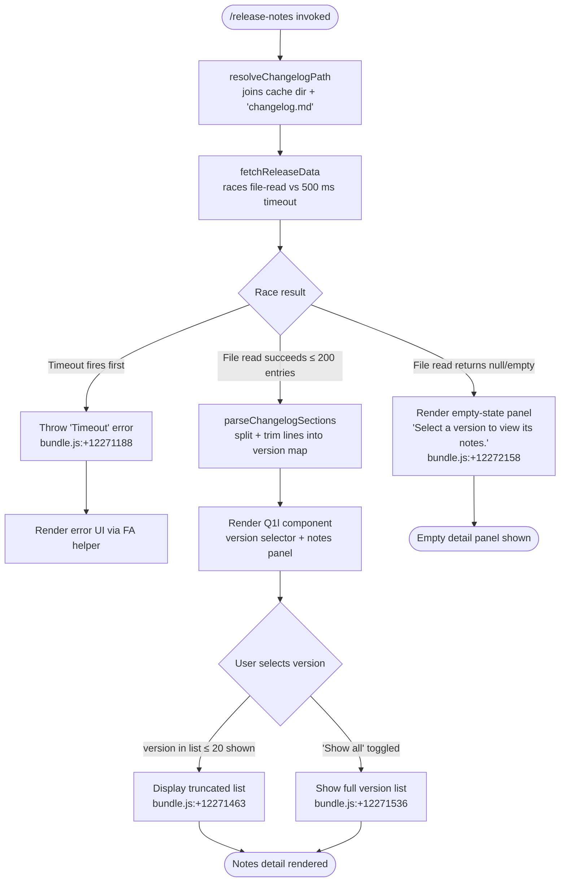

# `/release-notes`

> Analysis basis: CC v2.1.193 bundle.js (AST extraction + Claude interpretation)
> Minimum version: v2.1.193

---

## Overview

The `/release-notes` command presents a two-panel interactive JSX UI that lets the user browse versioned release notes bundled with Claude Code. It fetches a `changelog.md` from a local cache directory, parses its sections by version, and renders a version-selector list alongside the notes for the selected version. The command uses an async handler (`Ivf`) that races a network/file fetch against a 500 ms timeout, then hands off rendering to a memoized React component (`Q1l`).

---

## Registration

| Field | Value |
|---|---|
| type | `local-jsx` |
| name | `release-notes` |
| description | `View release notes` |
| loc_byte | `12272848` |
| loc_byte_end | `12272989` |
| loc_line | `8219` |
| module_id | `Z1l` |
| load_inline | `true` |
| arbor_handler.name | `Ivf` |
| arbor_handler.fqn | `claude-2.1.193::Ivf` |
| arbor_handler.kind | `AsyncFunction` |
| arbor_handler.resolution_path | `module_id` |
| arbor_handler.n_hits | `0` |

Analysis basis: CC v2.1.193 bundle.js:+12272848

---

## Input Branching

Four distinct paths exist: timeout/error, no changelog found (empty state), data loaded (render version list + detail panel), and the "Show all" toggle within the version list. A Mermaid flowchart is therefore used.



---

## Behavioral Spec

### 1. Handler Entry — `asyncReleaseNotesHandler` (bundle identifier: `Ivf`)

```
async function asyncReleaseNotesHandler(context):
    # Set up a timeout sentinel
    timeoutPromise = new Promise((_, reject) =>
        setTimeout(() => reject(new Error("Timeout")), 500)
    )
    # bundle.js:+12271164, +12271188, +12271200

    # Race the data fetch against the timeout
    result = await Promise.race([
        fetchAndParseChangelog(context),   # eOo
        timeoutPromise
    ])
    # bundle.js:+12271214

    # Build JSX tree and render
    jsx = buildReleaseNotesUI(result)      # Aqe.jsx, Q1l component
    return jsx
    # bundle.js:+12271403
```

Analysis basis: CC v2.1.193 bundle.js:+12271164

---

### 2. Changelog Fetch & Path Resolution — `fetchAndParseChangelog` (bundle identifier: `eOo`)

```
async function fetchAndParseChangelog(context):
    # Resolve the changelog path: <cacheDir>/changelog.md
    cacheDir   = resolveChangelogCacheDir()    # ZPo → bzt.join + "cache"
    changelogPath = pathJoin(cacheDir, "changelog.md")
    # bundle.js:+12268160, +12267789, +12267803, +12267811

    # Retrieve app-level context store
    store = getContextStore()                  # qs → Kqu.getStore
    # bundle.js:+12268172

    # Record fetch start time
    startTime = Date.now()
    # bundle.js:+12268233

    # Fetch raw markdown content, up to 200 entries
    rawMarkdown = await readChangelogFile(changelogPath, { limit: 200 })
    # bundle.js:+12268118

    # Parse the markdown into per-version sections
    sections = parseChangelogSections(rawMarkdown)   # Izt
    return sections
```

Analysis basis: CC v2.1.193 bundle.js:+12268049

---

### 3. Changelog Parser — `parseChangelogSections` (bundle identifier: `Izt`)

```
function parseChangelogSections(rawText):
    # Split the full markdown text by newline
    lines = rawText.split("\n")
    # bundle.js:+12268488

    versionMap = {}
    currentVersion = null
    currentLines   = []

    for line in lines:
        trimmed = line.trim()
        # bundle.js:+12268537

        # Detect version heading using separator " - "
        if trimmed contains " - ":
            # bundle.js:+12268619
            [versionKey, rest] = splitAtSeparator(trimmed, " - ")
            # di helper: indexOf + slice
            # bundle.js:+12268614

            if currentVersion != null:
                versionMap[currentVersion] = currentLines

            currentVersion = versionKey
            currentLines   = [rest]
        else:
            # Accumulate body lines; strip leading "- " bullet prefix
            bodyLine = trimmed.startsWith("- ") ? trimmed.slice(2) : trimmed
            # bundle.js:+12268654, +12268697
            if bodyLine != "":
                currentLines.push(bodyLine)

    # Flush last version
    if currentVersion != null:
        versionMap[currentVersion] = currentLines

    return versionMap
```

Analysis basis: CC v2.1.193 bundle.js:+12268488

---

### 4. Version-Selector Animation Helper — `animateVersionList` (bundle identifier: `J1l`)

```
function animateVersionList(versions):
    # Slice to the first batch for animated reveal
    batch = versions.slice(...)
    # bundle.js:+12271039

    # Map each version entry through FA (format/filter helper)
    formatted = batch.map(v => formatVersionEntry(v))   # FA
    # bundle.js:+12271065

    # Pass mapped list to the list renderer (tOo)
    return renderVersionRows(formatted)                  # tOo → t.map
    # bundle.js:+12271092
```

Analysis basis: CC v2.1.193 bundle.js:+12271039

---

### 5. Release-Notes JSX Component — `ReleaseNotesComponent` (bundle identifier: `Q1l`)

```
function ReleaseNotesComponent({ versions, notes }):
    # Initialise memoisation cache with sentinel (size 20)
    cache = X1l.c(20)
    # bundle.js:+12271457, +12271463

    # Derive display list — truncate if "Show all" not toggled
    displayVersions = showAll ? versions : versions.slice(0, DEFAULT_VISIBLE)
    # bundle.js:+12271634, "Show all" literal at +12271536

    # Select first version by default or user-chosen version
    selectedVersion = userSelection ?? versions.find(v => v != "skip")
    # bundle.js:+12271779, +12271841

    # Render two-column layout ("column" literal at +12272093)
    return jsx:
        Column:
            VersionList:
                displayVersions.map(v => VersionItem(v))   # n.map +12271634
                if !showAll: ShowAllButton("Show all")      # +12271536
            NotesPanel:
                if selectedVersion:
                    renderNotes(notes[selectedVersion])     # tOo +12271859
                else:
                    Placeholder("Select a version to view its notes.")
                    # +12272158

    # React.memo sentinel used for cache invalidation
    # Symbol.for("react.memo_cache_sentinel") at +12272037
```

Default visible versions before "Show all" is clicked: `20`
Analysis basis: CC v2.1.193 bundle.js:+12271403

---

### 6. Config Persistence Sub-system (called transitively via `mn` → `dXt` → `Qwt`)

The changelog fetch path invokes the shared global-config save machinery as a side-effect when config needs persisting (e.g., recording the last-viewed version). Key behaviours:

```
function saveConfigWithLock(configData):
    acquireLock()   # dXt

    # Guard: re-read config; if parse error, auto-repair from cache
    # "saveConfigWithLock: re-read hit a parse error…" +12274036
    reRead = readConfigFile()
    if parseError(reRead):
        logWarning("saveConfigWithLock: re-read hit a parse error…")
        repairFromCache()          # tengu_config_auto_repaired
    
    # Guard: refuse write if auth would be wiped
    # "…missing auth that cache has; refusing to write…" +12974342
    if reRead.auth == null and cache.auth != null:
        logWarning("auth loss prevented")
        emit(tengu_config_auth_loss_prevented)
        return

    # Write atomically via temp-file + rename (Qwt)
    writeFileSyncAndFlush(configData)

    # Rotate backups: keep 5 most recent, max age 60000 ms
    # backup prefix ".backup." at +13974816
    rotateBackups(maxCount=5, maxAgeMs=60000)
```

Lock-contention timeout: `100 ms` (bundle.js:+13973556)
Backup retention count: `5` (bundle.js:+13974955)
Backup max age: `60000 ms` (bundle.js:+13974700)
File mode for new config: octal `600` (decimal `384`, bundle.js:+13975237)

Analysis basis: CC v2.1.193 bundle.js:+13973909

---

## State & Side Effects

| Item | Detail |
|---|---|
| Telemetry — `tengu_config_lock_contention` | Emitted when the config lock takes longer than 100 ms to acquire (bundle.js:+13973651) |
| Telemetry — `tengu_config_stale_write` | Emitted when a config write is detected as stale (bundle.js:+13973787) |
| Telemetry — `tengu_config_parse_error` | Emitted when the on-disk config fails JSON parse (bundle.js:+13977384) |
| Telemetry — `tengu_config_auto_repaired` | Emitted after successful auto-repair of a corrupt config from cache (bundle.js:+13974164) |
| Telemetry — `tengu_config_auth_loss_prevented` | Emitted when a write is refused to protect existing auth credentials (bundle.js:+13974494) |
| Telemetry — `tengu_config_fallback_write` | Emitted when the fallback (in-place) write path is taken (bundle.js:+13973267) |
| Changelog source | `<cacheDir>/changelog.md` — read-only at invocation time (bundle.js:+12267811) |
| Fetch timeout | 500 ms hard timeout via `Promise.race` (bundle.js:+12271200) |
| Render type | JSX (`local-jsx`) — output is rendered inline in the terminal UI (bundle.js:+12271403) |
| Config writes | Atomic temp-file + `renameSync` with `fsyncSync` flush and `fchmodSync` permission application (bundle.js:+1103608–+1103670) |
| Config backups | Written to `<configDir>/backups/`, rotated to keep 5 most recent under 60 s old (bundle.js:+13974700, +13974955) |
| Error output | `cli_error` written via `OT` → `Lse.writeFileSync` on fatal config errors (bundle.js:+13300654) |
| Sound | <!-- TODO: not found in depth-2 traversal; needs --depth 4 --> |
| appState changes | <!-- TODO: not found in depth-2 traversal; needs --depth 4 --> |

---

## Version History

| Version | Change |
|---|---|
| v2.1.193 | Initial analysis |

---

## Common Mistakes

1. **Assuming the changelog is fetched from the network.** The file is read from the local cache directory (`<cacheDir>/changelog.md`). If the cache is absent or stale, the command may show outdated or empty notes without any network fallback visible at this call-graph depth.

2. **Ignoring the 500 ms timeout.** On slow storage or a cold start the `Promise.race` will reject with `"Timeout"` before the file read completes, resulting in an error UI rather than empty notes. This is a hard limit, not configurable from the CLI.

3. **Confusing the entry-point identifier.** The Arbor-resolved handler is `Ivf` (an `AsyncFunction`). The BFS traversal may list the synthetic `__handler_release-notes` node, but the actual bundle symbol is `Ivf`. Always use `Ivf` when cross-referencing in the bundle.

4. **Expecting the full version list to be visible immediately.** The component initially shows only the first `20` versions. The remainder become visible only after the user activates the "Show all" control (bundle.js:+12271536).

5. **Overlooking the config-safety guards.** The transitive call to the config save path will silently refuse to write if it detects that the pending write would erase existing auth credentials, emitting `tengu_config_auth_loss_prevented` instead of throwing.

---

## Appendix — Identifier Mapping

> For bundle debugging only. Identifiers change across versions.

| Identifier | Role |
|---|---|
| `Ivf` | Async handler for `/release-notes` (entry point resolved by Arbor) |
| `eOo` | Fetch-and-parse changelog function |
| `Tzt` | Secondary changelog path resolver (ZPo + qs) |
| `xZn` | Section key extraction / filtering helper |
| `Izt` | Changelog markdown section parser (split/trim/slice) |
| `Q1l` | Memoised JSX component rendering version selector + notes panel |
| `J1l` | Version-list animation/slice helper |
| `tOo` | Version row renderer (maps entries to UI rows) |
| `ZPo` | Cache directory path builder (`bzt.join` + `"cache"`) |
| `LZn` | Supporting helper called from section extractor |
| `FA` | Format/filter helper applied to version entries |
| `mn` | Global config save orchestrator |
| `dXt` | Config file write-with-lock implementation |
| `Qwt` | Atomic file write helper (temp + rename + fsync) |
| `bSt` | Config read-file-sync helper (with backup logic) |
| `lXt` | Config load helper (calls bSt + Gx) |
| `Qor` | Config rotation / directory management helper |
| `cXt` | Timestamp utility used in lock/backup logic |
| `l9o` | Object.entries iterator for config fields |
| `p9o` | Backup path builder (`oE.join` + `"backups"`) |
| `uXs` | Config object merge helper (`Object.assign`) |
| `TSt` | Config struct / schema definition |
| `ke` | JSON serialise helper (`JSON.stringify`) |
| `an` | Generic error-code handler |
| `Is` | Fatal error handler (writes `cli_error`, calls `process.exit`) |
| `lKe` | Error formatter (`St.red` + `console.error`) |
| `OT` | Error file writer (`Lse.writeFileSync`) |
| `Rds` | Telemetry mode resolver |
| `at` | Telemetry consent string normaliser (`String`) |
| `Bi` | Telemetry routing helper |
| `Tr` | Telemetry transport caller |
| `qs` | AsyncLocalStorage context store accessor (`Kqu.getStore`) |
| `mn` | Global-config save orchestrator (also listed above) |
| `xe` | HTTP/IPC request executor |
| `eo` | Error constructor wrapper (`Error` + `String`) |
| `e_u` | Request queue manager (`fln.shift` / `fln.push`) |
| `di` | String split-at-index helper (`indexOf` + `slice`) |
| `o` | Column pad helper (`s.map` + `i.padEnd`) |
| `l` | Log-line wrapper (`C8l`) |
| `C8l` | Structured log entry creator (`iee` + `Date.now` + `qs`) |
| `Oe` | UI component wrapper (`Zze`) |
| `V` | Generic value validator/transformer |
| `T` | Log-level / debug formatter |
| `jt` | Path existence / access checker |
| `Gx` | Generic guard / condition utility |
| `FT` | File-type detector |
| `In` | Numeric formatter |
| `m1e` | Config migration helper |
| `Md` | Path normaliser |
| `i` | Teardown / close coordinator (`n.close` + `r.close`) |
| `s` | Subscription/cleanup helper (`r.add` + `r.delete`) |
| `n` | String normaliser (`i.toLowerCase`) |
| `r` | Resource handle (carries `.close`, `.add`, `.delete`) |

---

Note: index built via Arbor fallback; some signals (telemetry, literals) may be missing — see arbor-fallback.js.