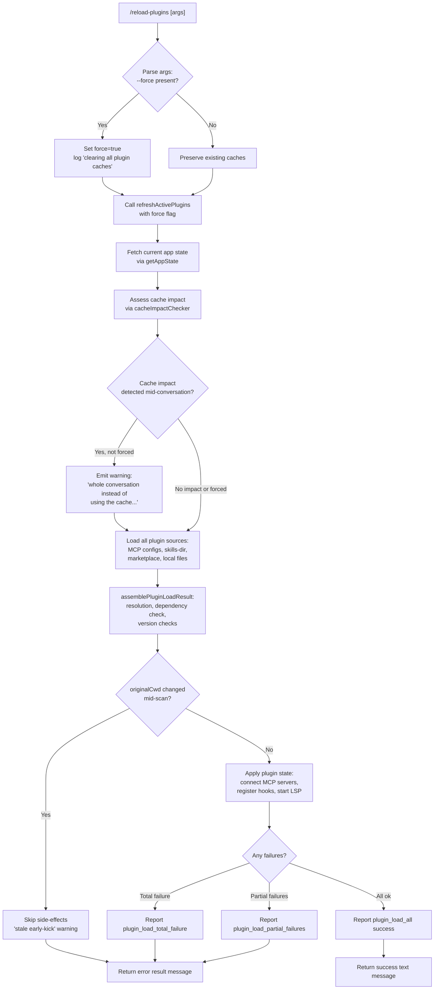

# `/reload-plugins`

> Analysis basis: CC v2.1.193 bundle.js (AST extraction + Claude interpretation)
> Minimum version: v2.1.193

---

## Overview

`/reload-plugins` re-scans all installed plugins (MCP servers, skills, hooks, LSP servers, and agent plugins) and applies any pending configuration or installation changes to the currently running session. Without the `--force` flag it preserves cached conversation data where possible; with `--force` it clears all plugin caches, including mid-conversation caches, before reloading.

---

## Registration

| Field | Value |
|---|---|
| type | `local` |
| name | `reload-plugins` |
| description | `Activate pending plugin changes in the current session` |
| argumentHint | `[--force]` |
| supportsNonInteractive | `false` |
| thinClientDispatch | `control-request` |
| module_id | `j6l` |
| load_inline | `true` |
| loc_byte | `12835488` |
| loc_byte_end | `12835732` |
| loc_line | `8812` |
| arbor_handler.name | `HPf` |
| arbor_handler.fqn | `claude-2.1.193::HPf` |
| arbor_handler.kind | `AsyncFunction` |
| arbor_handler.resolution_path | `module_id` |
| arbor_handler.n_hits | `0` |

Analysis basis: CC v2.1.193 bundle.js:+12835488

---

## Input Branching

The command has 4+ distinct branches based on force-flag presence, cache-impact assessment, plugin type classification, and error states. A Mermaid flowchart is used.



---

## Behavioral Spec

### Entry Point: Main Handler (HPf)

The Arbor-resolved handler is `HPf` (AsyncFunction, resolved via `module_id` → `j6l`).

Analysis basis: CC v2.1.193 bundle.js:+12834186

```
async function reloadPluginsHandler(context):
    // Step 1: Parse argument string
    rawArgs = context.args.trim()                          // +12834572
    forceFlag = parseForceFlag(rawArgs)                   // checks "--force" literal +12834608

    // Step 2: Emit telemetry for cache impact assessment
    cacheImpact = assessCacheImpact(context)              // via G6l → V +12834792
                                                          // emits tengu_reload_plugins_cache_impact +12833480

    // Step 3: If --force not set and cache impact detected,
    //         warn user about conversation cache side-effects
    if cacheImpact and not forceFlag:
        return warningMessage(
            "...the whole conversation instead of using the cache."
            + " Run /reload-plugins --force to apply."
        )                                                  // literal +12834071

    // Step 4: Refresh active plugins
    refreshResult = await refreshActivePlugins(context, forceFlag)
                                                          // wAe +12834918

    // Step 5: Format and return result list
    resultItems = buildDisplayList(refreshResult)         // _Pf → n.split +12834846
    return formatTextResponse(resultItems)                // Dle +12834993
```

### Sub-feature: Force-Flag Detection

Analysis basis: CC v2.1.193 bundle.js:+12834608

```
function parseForceFlag(argString):
    // Checks for "--force" literal in argument string
    // Returns boolean
    if argString contains "--force":
        return true
    else:
        return false
    // String constant "--force" at +12834608, "force" at +12834623
```

### Sub-feature: Cache Impact Assessment (G6l)

Analysis basis: CC v2.1.193 bundle.js:+12834792

```
function assessCacheImpact(context):
    // Reads current conversation/session state
    // Checks whether active plugin caches are in use mid-conversation
    // Emits telemetry: tengu_reload_plugins_cache_impact (+12833480)
    // Returns impact descriptor (truthy if reloading would bust prompt cache)
    state = context.getAppState()
    return cacheImpactResult(state)
```

### Sub-feature: Refresh Active Plugins (wAe)

Analysis basis: CC v2.1.193 bundle.js:+12831155

```
async function refreshActivePlugins(context, force):
    if force:
        log("refreshActivePlugins: clearing all plugin caches")  // literal +12831157
        clearAllPluginCaches()                 // kAl → T +12831209, rh sub-calls

    // Load MCP server configuration sources
    mcpConfigs = await loadMcpConfigSources()  // yne +12831461
                                               // reads .mcp.json files +6715791,
                                               // projectSettings, userSettings, localSettings

    // Load LSP extension configs
    lspConfigs = await loadLspExtensions()     // u6e +12831623

    // Aggregate plugin load results from all sources
    pluginResults = await assemblePluginLoadResult(
        mcpConfigs, lspConfigs, context
    )                                          // f0o via aso/oso chain +6720256

    // Emit event to notify subsystems of updated plugin state
    gF.emit(pluginStateUpdatedEvent)           // +12832264

    return pluginResults
```

### Sub-feature: MCP Config Source Loading (yne)

Analysis basis: CC v2.1.193 bundle.js:+6693517

```
async function loadMcpConfigSources():
    // Walks directory hierarchy looking for .mcp.json files (+6715791)
    // Merges from scopes: project (+6715859), user (+6716317),
    //                     local (+6716519), enterprise (+6716660)
    // Calls aX (mcpConfigAggregator) which sub-calls:
    //   rT — reads and resolves config files per scope
    //   Dce — validates and normalizes server entries
    //   lTn — classifies transport type: http/dynamic (+3136486/3136509)
    //   c1n — resolves server connection parameters
    //   aX itself: merges approved/pending states (+6718354/6718381)
    //              deduplicates with mcp-server-suppressed-duplicate (+6719324)
    return mergedMcpServerMap
```

### Sub-feature: Plugin Load Assembly (f0o via oso/aso)

Analysis basis: CC v2.1.193 bundle.js:+11264511 / +6720256

```
async function assemblePluginLoadResult(sources, context):
    // Phase 1: resolve plugin registry (p0o)
    //   iterates skills-dir entries (+11244084)
    //   resolves marketplace references
    //   checks policy blocks: marketplace-blocked-by-policy (+11245597)
    //   resolves dependency graph via Promise.allSettled (+11245489)
    //   classifies unresolved/renamed/target-missing entries
    //     (+11244595, +11244785, +11244897)

    // Phase 2: assemble final load set (f0o)
    //   filters --plugin-dir and --plugin-url args (+11265045/+11265060)
    //   validates plugin sources, emitting warn (+11265086) for invalid entries
    //   checks for ineffective-disable states (+11265977)
    //   reports:
    //     plugin_load_all (+11266092)
    //     plugin_load_total_failure (+11266110)
    //     plugin_load_partial_failures (+11266179)

    // Guard: if originalCwd changed mid-scan, abort side-effects
    if originalCwdChanged():
        log("assemblePluginLoadResult: originalCwd changed mid-scan; skipping side-effects (stale early-kick)")
                                              // literal +11266245
        return staleResult

    return assembledPluginState
```

### Sub-feature: Plugin Installation Cache Clear (rh → Hqt)

Analysis basis: CC v2.1.193 bundle.js:+11148692 / +11186117

```
function clearInstalledPluginsCache():
    // Called when force=true via rh → Adf → ... → Hqt
    log("Cleared installed plugins cache")   // literal +11186117
    // Clears plugin state file caches
    // Clears skill index cache via P6 → e.clearSkillIndexCache (+13423705)
    // Clears rqt store via o6 → rqt.clear (+11117631)
    // Emits tengu_plugin_state_file_error on read failures (+11186296)
```

### Sub-feature: Plugin Registration (rAe)

Analysis basis: CC v2.1.193 bundle.js:+11975621

```
async function registerActivePlugins(pluginState):
    // For each loaded plugin entry:
    //   Reads plugin manifest from disk (qf → e.readFile +11156649)
    //   Validates with safeParse (Jxo → t.safeParse +11170091)
    //   Resolves dependencies (JA, nut, Aqt chain)
    //   Registers hooks if not in safe-mode
    //     (--safe-mode flag check +70258, "Safe mode: skipping plugin hook registration" +5361072)
    //   Classifies plugin types: "plugin", "skill", "agent"
    //     (literals +12834302, +12834333, +12834361)
    //   For MCP servers: applies connection (B6l → oso → aX path)
    //   For LSP servers: starts language server process
    //   Emits plugin_installed telemetry event via Jc (+11213492)
    //     with attributes: plugin.name, plugin.version, marketplace.name,
    //     marketplace.is_official, install.trigger, install.disabled_by_default
```

### Sub-feature: Result Display Builder (_Pf / Dle)

Analysis basis: CC v2.1.193 bundle.js:+12834846 / +12834993

```
function buildResultDisplay(pluginResults):
    // _Pf: splits result list by newline delimiter (+12833968)
    // Constructs entries per plugin type:
    //   "plugin MCP server" (+12834393)
    //   "plugin LSP server" (+12835226)
    //   "hook" (+12835167)
    // Separates entries with " · " (+12834420)
    // Marks error items with "error" status (+12834475)
    // Returns array of text content items with type "text" (+12834550)
    // Dle: formats as dependency-aware display list (+12834993)
```

---

## State & Side Effects

| Item | Detail |
|---|---|
| Telemetry | `tengu_reload_plugins_cache_impact` (+12833480) — emitted on cache impact assessment; `tengu_plugin_state_file_error` (+11186296) — on plugin state file read failure; `tengu_feature_ok` / `tengu_feature_bad` / `tengu_feature_sad` (+1026754/+1026821/+1026902) — general feature outcome; `plugin_load_all` / `plugin_load_total_failure` / `plugin_load_partial_failures` via literals (+11266092/+11266110/+11266179); `plugin_installed` via Jc OTEL event (+11213492) |
| Plugin cache cleared | When `--force` is used: all installed plugin caches are purged, skill index cache is cleared, rqt state store is cleared (Analysis basis: +11831157, +11186117, +13423705, +11117631) |
| MCP server connections | Pending MCP server connections are started or restarted; duplicate servers suppressed with `mcp-server-suppressed-duplicate` reason (+6719324) |
| Hook registration | Plugin hooks re-registered unless `--safe-mode` is active (+5361072, +70258) |
| LSP servers | LSP extension servers restarted as needed via u6e / zNn chain (+12831623, +12831751) |
| appState changes | `getAppState()` read at +12834686; plugin state updated and `gF.emit` fired at +12832264 |
| Side-effect guard | If working directory changes mid-scan, all side-effects are skipped and a stale-kick warning is logged (+11266245) |
| Sound | <!-- TODO: not found in depth-2 traversal; needs --depth 4 --> |
| Non-interactive | Not supported (`supportsNonInteractive: false`) — command is ignored in non-interactive mode |
| thinClientDispatch | `control-request` — in thin-client configurations the command is forwarded as a control request rather than executed locally |

---

## Version History

| Version | Change |
|---|---|
| v2.1.193 | Initial analysis |

---

## Common Mistakes

1. **Omitting `--force` when caches are stale mid-conversation.** Without `--force`, if an active conversation has built up prompt-cache entries against the old plugin set, `/reload-plugins` will warn rather than reload. The user must explicitly run `/reload-plugins --force` to override, accepting that the conversation cache will be rebuilt from scratch.

2. **Expecting non-interactive use.** The command sets `supportsNonInteractive: false`. Running it in a script or pipeline will have no effect.

3. **Assuming immediate MCP server availability.** MCP server reconnection is asynchronous. After `/reload-plugins` returns, some servers (especially remote SSE/HTTP ones) may still be in a connecting or needs-auth state. Check `/mcp` status separately.

4. **Editing plugin config while a reload is in progress.** If the working directory or plugin configuration changes between when the scan starts and when results are applied, the command detects the race condition and skips all side-effects, logging a `stale early-kick` message. Run the command again after the config settles.

5. **Using the command in safe mode.** When CC is launched with `--safe-mode`, hook registration is unconditionally skipped even after `/reload-plugins`. MCP servers and skills can still load, but no plugin hooks will be activated.

---

## Appendix — Identifier Mapping

> For bundle debugging only. Identifiers change across versions.

| Identifier | Role |
|---|---|
| `HPf` | Main async handler for `/reload-plugins` (Arbor-resolved entry point) |
| `fA` | Argument pre-processor / early validation helper |
| `qu` | Queue or utility helper called by fA and HPf |
| `FNe` | Sub-utility called by qu |
| `pQ` | Plugin query / state lookup helper |
| `yn` | Utility shared across plugin and daemon modules |
| `B6l` | Plugin filter / capability checker (checks t.has, n.has, vP, xY, Ay) |
| `oso` | Plugin orchestration shell — top-level plugin load orchestrator |
| `lTe` | Sub-loader called by oso |
| `aso` | Async plugin source assembler (calls f0o and p0o) |
| `f0o` | Plugin load result assembler — resolves all plugin entries, emits load results |
| `p0o` | Plugin registry resolver — skills-dir, marketplace, dependency resolution |
| `aX` | MCP config aggregator — merges all MCP config scopes and states |
| `cc` | Config reader sub-utility (calls El, cd) |
| `yF` | Prototype/object factory helper (Object.create) |
| `rT` | Settings file resolver — reads .mcp.json across directory hierarchy |
| `Dce` | MCP server entry normalizer / validator |
| `SS` | Policy settings filter (policySettings check) |
| `lTn` | Transport type classifier (http / dynamic) |
| `Fy` | Plugin install helper (pH) |
| `T` | i18n / text-format utility (shared across bundle) |
| `c1n` | Connection parameter resolver for MCP servers |
| `Dst` | Destination/path utility |
| `g` | MCP server set manager (approved set) |
| `f` | Background session / worker process manager |
| `m` | Background worker kill helper |
| `BL` | MCP reconnect / retry helper |
| `c_a` | Config cache map manager |
| `w` | Focus/blur aware reload scheduler |
| `p` | Process exit / abort helper |
| `R` | Stream write helper |
| `r` | Lifecycle registry set |
| `Is` | CLI error reporter (lKe, OT, process.exit) |
| `vP` | Plugin version parser / compatibility checker |
| `x$t` | Extended plugin source type handler |
| `SBe` | HIPAA / compliance mode checker |
| `CQr` | Auto-scaling concurrency resolver |
| `qjd` | Auto-transport selector |
| `at` | Boolean string converter ("yes"/"on") |
| `ul` | Boolean string converter ("no"/"off") |
| `_r` | Bedrock/Foundry/Vertex backend detector |
| `_u` | Provider variant handler |
| `vhn` | Provider sub-handler |
| `xY` | Plugin name normalizer (toLowerCase, zjd) |
| `zjd` | Plugin name lookup (it, Array.isArray) |
| `it` | Plugin registry cache lookup (KPt, ZW maps) |
| `Ay` | Output token counter (y7e, Object.values) |
| `G6l` | Cache impact checker — reads V (session state), emits tengu_reload_plugins_cache_impact |
| `_Pf` | Result list splitter (n.split for display formatting) |
| `wAe` | refreshActivePlugins — top-level plugin refresh coordinator |
| `kAl` | Plugin cache clear sub-helper |
| `rh` | Plugin reload orchestrator (Adf, p0, RG, pQr, o6 sub-calls) |
| `Adf` | Plugin registry diffing and re-registration coordinator |
| `tw` | Plugin state emitter (Oen, PH, Nzo) |
| `LYn` | Shared plugin utility (used by Adf and p0) |
| `DYn` | Shared plugin diff utility |
| `ZDn` | Plugin state cleanup utility |
| `ato` | Hook registration orchestrator (pluginRoot, safe-mode gate) |
| `xe` | Error logger (kZ.logError) |
| `a1n` | Plugin activation helper |
| `Vxo` | Plugin validation helper |
| `hAl` | Plugin auxiliary loader |
| `p0` | Skill index cache clearer (P6 → clearSkillIndexCache, LYn, oAl, z8e) |
| `P6` | Skill index cache clear executor |
| `oAl` | Post-clear callback |
| `z8e` | Plugin state event emitter (eVt) |
| `RG` | Plugin registry updater (DYn) |
| `pQr` | Plugin query result formatter |
| `o6` | rqt state store clearer |
| `lKa` | LSP keep-alive helper |
| `jCa` | Plugin state journal helper |
| `mr` | Logging/reporter utility (Rx) |
| `Rx` | Low-level log writer |
| `o` | Pad-and-map display formatter |
| `yne` | MCP config file loader (reads .mcp.json, .mcpb, .dxt files) |
| `tV` | File extension classifier (.mcpb / .dxt check) |
| `oie` | Config overlap/inheritance helper |
| `Voo` | Plugin manifest file reader (readFile, JSON parse, Object.entries) |
| `jt` | Path utilities wrapper |
| `In` | Error code inspector |
| `Bt` | JSON parse wrapper |
| `YHa` | Plugin marketplace entry loader |
| `K2t` | Plugin manifest reader and hash verifier (md5, manifest.json) |
| `be` | String coercion utility |
| `u6e` | LSP extension config reader (.lsp.json) |
| `Xpp` | LSP config entry processor |
| `Ypp` | LSP path resolver (relative path security check) |
| `l` | Background session logger (C8l) |
| `C8l` | Daemon status writer (daemon.status.json) |
| `iee` | Log event emitter |
| `qs` | AsyncLocalStorage store accessor |
| `v7t` | Status file path builder |
| `ke` | JSON stringify utility |
| `c` | Background session state ("stopped" / "background session") |
| `zNn` | LSP extension conflict detector (lsp-extension-conflict) |
| `a` | MCP update applier / connection state manager (l6e, Bcr, mSa, VWo) |
| `l6e` | MCP server connection initiator (stdio/sse/sse-ide/ws-ide/claudeai-proxy) |
| `Bcr` | MCP connection result applier (applyMcpUpdate, cleanup, oT, ME) |
| `mSa` | MCP server auth state manager (sio) |
| `VWo` | MCP client update propagator (getClients, applyMcpUpdate, VWo→l6e→Bcr) |
| `gPf` | Plugin filter for "lsp-manager" entries |
| `F6l` | LSP manager capability checker |
| `hPf` | Plugin filter for "plugin:" prefixed entries |
| `z_e` | Plugin error display formatter (El, T, eea) |
| `El` | ANSI/text decorator (at, Ctn) |
| `Ctn` | Color/style token |
| `rAe` | Plugin installation registrar — registers plugins into session state |
| `YM` | Plugin manifest loader (qf) |
| `qf` | Known marketplaces JSON reader |
| `$Yn` | Marketplace config path builder (wd.join, Jv) |
| `D9e` | Plugin dependency entry parser (_n, Array.isArray) |
| `_n` | Plugin descriptor normalizer (sun, yB) |
| `sun` | Plugin source type initializer (Szo, Svr, Azo) |
| `yB` | Plugin descriptor builder (mr, _Tt, Sfr, MNe, DNe, ETt, VIe, pun, FZ, JLt) |
| `_M` | Managed-scope error thrower |
| `as` | Scope/path string parser (e.includes, e.split) |
| `JA` | Plugin URL/source resolver (_Un, nut, v6, kIa) |
| `_Un` | URL scheme parser (indexOf, slice, search) |
| `nut` | Plugin resolution orchestrator (f3t, xIa, RIa, Vfp) |
| `f3t` | Plugin descriptor factory (_n) |
| `xIa` | Host-pattern matcher (yUn, T) |
| `RIa` | Path-pattern matcher (T) |
| `Vfp` | Plugin fetch strategy selector (URe, vIa, HUn, CIa) |
| `v6` | Git-URL plugin source handler (_n) |
| `kIa` | Plugin URL classifier (pLt, xIa, RIa, LIa) |
| `pLt` | HTTP/HTTPS URL validator (pgs, indexOf, match) |
| `LIa` | Local-file plugin resolver (HUn, wIa, f_) |
| `MG` | Marketplace plugin reader (t.readFile, Bt, fqt) |
| `fqt` | Plugin cache file path builder (wd.join, Jxo, Tz, an) |
| `Jxo` | Plugin cache file parser (jt, Bt, be, t.safeParse) |
| `an` | Async error boundary / try-catch wrapper |
| `qR` | Plugin scope resolver (Zxo, as, qf, pO, T, be) |
| `Zxo` | Local-scope plugin reader (r.readFile, Bt, MG) |
| `jAf` | Plugin activation flag checker (r.has) |
| `Aqt` | Full plugin dependency resolver and installer — the main plugin installation engine |
| `cw` | Plugin descriptor clone (_n) |
| `YYn` | Plugin scope string normalizer (as, JA) |
| `WLt` | Local-path prefix checker ("./") |
| `u` | Plugin install worker (we, Re, R$, Hj) |
| `we` | Feature flag checker (V, Oe) |
| `Re` | Feature flag checker variant |
| `R$` | Feature flag set updater (h5, C7.push, ZBe, xGr) |
| `Hj` | Graceful shutdown coordinator (Promise.race, Promise.all, Yhe, oHe, Un, process.exit) |
| `Pt` | AsyncLocalStorage context getter (Eln, mr) |
| `Eln` | Store context accessor (yln.getStore, kK) |
| `ck` | Plugin file loader from disk (e0o, qLt, VLt, t0o, Hqt) |
| `e0o` | Plugin JSON file sync reader (jt, hqt, readFileSync, In, Bt) |
| `t0o` | Plugin file entry processor (Object.entries, aU) |
| `Hqt` | Plugin install cache clearer ("Cleared installed plugins cache"; qd, V, Oe) |
| `y` | Plugin connection slot map manager (Bje) |
| `Bje` | MCP connection slot processor ($je, T, sH, NEe, Nn, omt, qs, ke, an, xe) |
| `HP` | Plugin scope validator (as, a0) |
| `a0` | Plugin scope enum helper |
| `F0n` | Semver version validator (pY.valid, pY.coerce, pY.satisfies) |
| `E` | MCP tool set updater (XAt, xM, RM, Promise.all, _X, P3, xe, eo) |
| `XAt` | Tool set diff computer (akc) |
| `eo` | Error string normalizer |
| `L5i` | Plugin dependency cycle/cross-marketplace checker |
| `oC` | Flag settings updater (flagSettings; _Tt, t.add, jT.filter, t.has) |
| `H` | MCP server message framer (Buffer.concat, pHm) |
| `h` | MCP message buffer (s) |
| `Tp` | MCP stream end helper (e.end, ke) |
| `pHm` | Full MCP protocol handler — handles all MCP wire protocol messages |
| `D` | File watcher / realpath stat helper (NMc, Kd, T, xe, RHm, d.write) |
| `NMc` | Realpath/stat async resolver |
| `Kd` | Path key builder |
| `RHm` | File change detector (B6n) |
| `d` | MCP server stdio transport manager (tKe, r.write, Gql, DMc, A.stop/start) |
| `N` | Display refresh timer helper |
| `BAl` | Plugin activation order manager (s.get, l.add, c.pop, i.get) |
| `M` | Output write debouncer (clearTimeout, c.write) |
| `P` | Process end/emit coordinator |
| `co` | Plugin binary (`.claude-plugin`) executor (dg, jt, Svr, yB, wCr, Qwt, ke, PH, wgs) |
| `dg` | Plugin init helper (GIe, yB) |
| `Svr` | Plugin server launcher (vHs, GIe, uW, IHs, nW) |
| `hv` | Plugin validation cache (MZ) |
| `wCr` | Plugin timestamp recorder (gcn.set, Date.now) |
| `B$e` | Plugin binary runner (run, yB) |
| `Qwt` | Atomic file writer (readlinkSync, writeFileSync, fchmodSync, fsyncSync, renameSync) |
| `PH` | Display cache clearer (Den.clear, Xdr.clear) |
| `wgs` | Claude settings file writer (vIe.readFile, vIe.appendFile, vIe.writeFile) |
| `U4` | User config directory builder (g1.join → .claude) |
| `vt` | Feature sad/bad classifier (V, Oe) |
| `dW` | Plugin disk writer (xx, ia, Avr, yB, Pen) |
| `XYn` | Plugin install path validator (DG.resolve, n.startsWith, Error) |
| `W` | Plugin activation set |
| `pe` | Plugin pending set |
| `ue` | Tool execution context map (nHt, se, JX, sb) |
| `nHt` | Running-daemon checker (Object.values) |
| `se` | Tool execution sequencer (Promise.all, M6t, JKf) |
| `Ne` | Notification queue entry ($Pt, N.setTimeout) |
| `$Pt` | Notification poster (jB, Rs, fo.post, ES, T, ke, be) |
| `ge` | Tool execution state map |
| `nt` | Tool output formatter (V, Oe, br, Bm, Oee, No) |
| `KNt` | Semver range validator (pY.validRange, pY.minVersion) |
| `i7r` | Version string normalizer (T) |
| `qYn` | Plugin subdir resolver (s0o) |
| `s0o` | Git subdirectory extractor (uxe) |
| `yqt` | Plugin source type checker (s0o) |
| `zYn` | Remote plugin version resolver (semver ls-remote, pY.maxSatisfying) |
| `Ydf` | Git remote tag parser |
| `Pn` | Prompt context accessor (Vr, Pt) |
| `L8` | Git credential helper (u7r) |
| `KYn` | Plugin reference normalizer (yqt, t.replace) |
| `Sqt` | Plugin build / install orchestrator (n_t, BYn, WAl, npe, aU, WYn, kYn, n0o) |
| `n_t` | Plugin npm build runner (SPe, jt, dbl, Ss.join, T, ke, spf, ibl, rpf, cbl, ubl) |
| `BYn` | Build cache validator (cLt) |
| `WAl` | Build artifact walker |
| `npe` | Plugin content hasher (sha256, UAl.createHash) |
| `aU` | Plugin install directory resolver (eXn, Jv) |
| `WYn` | Plugin directory scanner (NAl.readdir, Vo, n.has, T, Vr) |
| `aq` | Plugin path canonicalizer (at) |
| `wPe` | Plugin workspace path resolver (aU) |
| `kYn` | Plugin cleanup helper (_df, RYn, lk.rm) |
| `n0o` | Plugin registry state updater (ck, s.findIndex, s.push, e_t, T) |
| `O` | TTY output rate limiter (clearTimeout, setTimeout, d.write, Math.round, V) |
| `F` | Output flush helper |
| `q` | Terminal write coordinator (J.write, gHm, H.write) |
| `J` | Terminal stream handle (LXt) |
| `gHm` | Escape sequence sanitizer (e.includes, e.replace) |
| `z` | Plugin file cache (eOe, yxl) |
| `eOe` | Plugin file reader with lstat (hO.lstat, hpe, n.isFile, hO.rm, hO.readFile, va) |
| `yxl` | Plugin file unlinker (hO.unlink, hpe, In) |
| `qe` | Path split helper (pn.split) |
| `K` | Keyboard event interceptor (q.preventDefault, O) |
| `ae` | MCP elicitation handler (se.has, sn, ke, V, Oe, CBt, jRc, vBt, fX, EI, se.add) |
| `sn` | MCP debug logger (rJe.push, kZ.logMCPDebug) |
| `Oe` | Zero/sentinel value |
| `CBt` | Elicitation form builder (wBt, iu) |
| `jRc` | Elicitation title/description extractor |
| `vBt` | Elicitation response handler (LBt, fX, iu) |
| `fX` | MCP notification dispatcher (Hd, Sx) |
| `EI` | Elicitation queue manager (Tr, Dx, vzd, t.shift, t.push) |
| `fe` | Tool concatenation helper (pq, Lt, Boolean, Z.has) |
| `pq` | Tool result pager (Lt, Kc) |
| `Lt` | Tool output line reader (Rx) |
| `Z` | Voice recording session manager |
| `Xdf` | Plugin scope dependency resolver (HP, as, T, cw, YYn, qR, t.push) |
| `j` | MCP server job tracker (i, O) |
| `He` | MCP tools/list_changed handler (Ee.has/add, sn, RM, V, Ve, Er, Dr, O4, l, WR) |
| `Ee` | MCP client connection state machine (T, A, M, Vy, q, te, ge) |
| `Ve` | Sentinel/zero-value for MCP state |
| `Er` | Async result resolver (p) |
| `Dr` | Async result resolver (mirror of Er) |
| `O4` | MCP callback invoker (mc) |
| `Ce` | Conversation event fetcher (far, Mcc, xcc, mar, V) |
| `far` | Latest-events fetcher (jB, Rs, ES) |
| `Mcc` | Conversation history loader (kcc, Re, we) |
| `xcc` | Worker source validator (R1e, bJt, V, Oe, Ve) |
| `mar` | Older-events fetcher (kcc) |
| `X` | MCP update batch processor (Promise.all, I8, y.filter, Uct, A, jNn, xe, q.applyMcpUpdate, a6e, be, W, VWo) |
| `I8` | Async iterable / abort signal handler |
| `Uct` | Integer parser utility |
| `A` | Tool set update applier (QBt, XAt) |
| `jNn` | Sequence number parser |
| `te` | MCP tool set registry (g) |
| `a6e` | MCP HTTP error handler (hRe) |
| `HM` | Plugin name case-normalizer (PIe.has, e.toLowerCase) |
| `Gm` | Plugin display-name formatter (at) |
| `Jc` | OTEL event emitter for plugin_installed (x9e, MTt, o.split, Object.entries, Xpr, a.emit, Jpr, T) |
| `x9e` | OTEL metric attribute builder |
| `MTt` | OTEL metric recorder |
| `Xpr` | OTEL span context builder |
| `Jpr` | OTEL span attribute setter |
| `re` | Voice recording state accessor (T, Z, q) |
| `Dle` | Result display list formatter — formats plugin result items with dependency annotation |