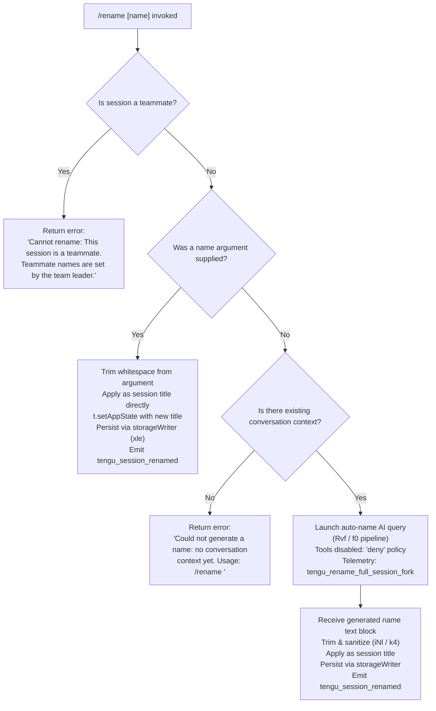

# `/rename`

> Analysis basis: CC v2.1.193 bundle.js (AST extraction + Claude interpretation)
> Minimum version: v2.1.193

---

## Overview

The `/rename` command (alias `/name`) renames the current Claude Code conversation session. When invoked with an explicit name argument it applies that name immediately; when invoked without an argument it uses the current conversation context to auto-generate a name via an internal AI query. Renaming is blocked when the session is a teammate managed by a team leader.

---

## Registration

| Field | Value |
|---|---|
| type | `local-jsx` |
| name | `rename` |
| description | `Rename the current conversation` |
| argumentHint | `[name]` |
| immediate | `true` |
| aliases | `["name"]` |
| module_id | `aNl` |
| load_inline | `true` |
| loc_byte | `12279211` |
| loc_byte_end | `12279410` |
| loc_line | `8243` |
| arbor_handler.name | `kvf` |
| arbor_handler.fqn | `claude-2.1.193::kvf` |
| arbor_handler.kind | `AsyncFunction` |
| arbor_handler.resolution_path | `module_id` |
| arbor_handler.n_hits | `0` |

Analysis basis: CC v2.1.193 bundle.js:+12279211

---

## Input Branching

Three distinct paths exist: teammate guard → explicit name provided → no name (auto-generate). A Mermaid flowchart is used.



Analysis basis: CC v2.1.193 bundle.js:+12278355 (teammate guard), +12278474 (trim), +12278586 (no-context error), +12278375 (teammate error string), +12276563 (rename literal), +12277027 (fork telemetry)

---

## Behavioral Spec

### Top-level handler — `sessionRenameHandler` (`kvf`)

```
async function sessionRenameHandler(context, args):
    result = await renameCommandImpl(context, args)  // DZn
    display(result)                                  // e
    renderUI(context)                                // MZn
```

Analysis basis: CC v2.1.193 bundle.js:+12278907

---

### Teammate guard and name application — `renameCommandImpl` (`DZn`)

```
async function renameCommandImpl(context, rawArg):
    sessionStore = getSessionStore()    // _f → zx → X1r.getStore

    if sessionStore.isTeammate:
        return errorMessage(
            "Cannot rename: This session is a teammate. " +
            "Teammate names are set by the team leader."
        )

    trimmedArg = rawArg.trim()          // e.trim (loc +12278474)

    if trimmedArg is not empty:
        // Explicit name path
        applyTitle(context, trimmedArg) // xyt path (explicit branch)
        persistSession(context)         // RSe
        context.setAppState(newTitle)   // t.setAppState
        updateProjectIndex(context)     // TXn
        writeStorage(context)           // xle
        displayCurrentName(context)     // IS
        return success
    else:
        // Auto-generate path
        generatedName = await autoGenerateName(context)  // xyt
        if generatedName is null:
            return errorMessage(
                "Could not generate a name: no conversation context yet. " +
                "Usage: /rename <name>"
            )
        applyTitle(context, generatedName)
        persistSession(context)
        return success
```

Analysis basis: CC v2.1.193 bundle.js:+12278355, +12278474, +12278508, +12278700, +12278714, +12278756, +12278760

---

### Title-application pipeline — `applyAndPersistTitle` (`xyt`)

```
async function applyAndPersistTitle(context, nameOrNull):
    sessionRecord = loadOrCreateSession(context)   // it → lCn → RGr

    if nameOrNull is null:
        // No-context early exit
        return null

    conversationHistory = buildHistory(context)     // qLo → As → qo / oH
    
    if nameOrNull is auto-generate sentinel:
        generatedName = await runNameQuery(context) // Rvf → f0 → n8n
        title = generatedName
    else:
        title = nameOrNull

    messageList = buildMessageList(context, title)  // RZn
    saveConversation(context, messageList)          // ZP → nYn
    return title
```

Analysis basis: CC v2.1.193 bundle.js:+12277024, +12277065, +12277084, +12277136, +12277177

---

### Auto-name AI query — `runNameQuery` (`Rvf` → `f0`)

```
async function runNameQuery(context):
    // Set up abort controller
    controller = newAbortController()
    controller.addEventListener("abort", ...)   // loc +12276273

    // Build query options with tool-use denied
    queryOptions = {
        tools: "deny",                          // loc +12276469
        toolsNote: "Session name generation cannot use tools",  // loc +12276484
        renameMode: "rename",                   // loc +12276563
        generateMode: "rename_generate_name",   // loc +12276587
        schemaFormat: "json_schema",            // loc +12277399
    }

    // Emit fork telemetry
    emit("tengu_rename_full_session_fork")      // loc +12277027

    // Execute AI query pipeline (f0 → n8n)
    response = await executeQuery(context, queryOptions)

    // Extract text block from response
    textBlock = response.at(...)                // loc +10992130
    if textBlock.type == "text":
        rawName = textBlock.text
        trimmedName = sanitizeName(rawName)     // iNl → k4 → e.trim
        return trimmedName
    return null
```

Analysis basis: CC v2.1.193 bundle.js:+12276223, +12276273, +12276351, +12276469, +12276563, +12276587, +12276874, +10992060, +10992130

---

### Name sanitization — `sanitizeName` (`iNl` → `k4`)

```
function sanitizeName(rawText):
    trimmed = rawText.trim()    // k4 → e.trim (loc +1192731)
    return trimmed
```

Analysis basis: CC v2.1.193 bundle.js:+12276874, +12276092, +12276095, +1192731

---

### Session persistence — `persistSession` (`RSe`)

```
async function persistSession(context):
    logEntry = buildLogEntry(context)           // Gf / ax / FAe
    writeLog(logEntry)                          // FAe → n.appendFileSync
    emitEvent("tengu_session_renamed")          // vG → NYt.emit (loc +13476461)
    updateAgentName(context)                    // cVe → B2o.emit
    emit("tengu_agent_name_set")                // loc in cVe
    saveToStorage(context)                      // n7 → FRt
```

Analysis basis: CC v2.1.193 bundle.js:+10886774, +10886824, +10886841, +10886855, +13476461, +13476448

---

### Session-store context retrieval — `getSessionStore` (`_f` → `zx`)

```
function getSessionStore():
    store = X1r.getStore()      // loc +2314187
    index = store[0]            // index 0 (loc +2315516)
    return store
```

Analysis basis: CC v2.1.193 bundle.js:+2315504, +2314187, +2315516

---

### HTML-escape helper — `htmlEscape` (`HXn`)

```
function htmlEscape(text):
    text = text.replaceAll("&",  "&amp;")   // loc +13889056
    text = text.replaceAll("<",  "&lt;")    // loc +13889080
    text = text.replaceAll(">",  "&gt;")    // loc +13889103
    text = text.replaceAll("\r", "&#13;")   // loc +13889127
    text = text.replaceAll("\n", "&#10;")   // loc +13889151
    return text
```

Analysis basis: CC v2.1.193 bundle.js:+12278223, +13889039

---

### UI render helper — `renderRenameUI` (`MZn`)

```
function renderRenameUI(context):
    escapedName = htmlEscape(currentName)   // HXn (loc +12278223)
    renderLabel(escapedName)               // Iw  (loc +12278237)
```

Analysis basis: CC v2.1.193 bundle.js:+12278223, +12278237

---

## State & Side Effects

| Item | Detail |
|---|---|
| Telemetry — primary | `tengu_rename_full_session_fork` (emitted when auto-generate path is taken; loc +12277027) |
| Telemetry — persistence | `tengu_session_renamed` (emitted after title is written to log; loc +13476461) |
| Telemetry — agent name | `tengu_agent_name_set` (emitted after agent-name update; loc +13481167) |
| Telemetry — query infra | `tengu_fork_agent_query`, `tengu_forked_agent_default_turns_exceeded`, `tengu_api_before_normalize`, `tengu_api_after_normalize`, `tengu_streaming_idle_timeout`, and many streaming/fallback events (inherited from shared query pipeline) |
| appState changes | `t.setAppState` called with new title field (loc +12278714) |
| Storage writes | `xle` (storage writer) updates session file and project index; `n7` / `FRt` write to persistent JSON store |
| Log append | `FAe → n.appendFileSync` records rename event with title type `"custom-title"` (loc +13476369) or `"ai-title"` (loc +13476537) |
| EventEmitter | `NYt.emit` (session event bus) fired post-rename; `B2o.emit` fired for agent-name update |
| AbortController | Registered during auto-name query; aborted on user interrupt (loc +12276292, +12276304) |
| Hook registration | `RSe` pipeline participates in the hook system (literal `"hook"` at loc +10886811) |
| Sound | None observed in depth-2 traversal |

---

## Version History

| Version | Change |
|---|---|
| v2.1.193 | Initial analysis |

---

## Common Mistakes

1. **Forgetting the argument is optional.** Invoking `/rename` with no argument triggers auto-generation from conversation history. If the conversation has no messages yet, you receive the error `"Could not generate a name: no conversation context yet. Usage: /rename <name>"` — supply an explicit name instead.
2. **Attempting to rename a teammate session.** The command hard-blocks with `"Cannot rename: This session is a teammate. Teammate names are set by the team leader."` There is no override; the team leader must perform the rename.
3. **Whitespace-only argument treated as empty.** The argument is trimmed before the empty-check, so `/rename    ` (spaces only) falls through to the auto-generate path rather than setting a blank title.
4. **Expecting immediate persistence without history.** The auto-generate path performs an AI API call; until that call resolves, the session title is unchanged. A slow or overloaded API will delay the rename without visible feedback.
5. **Confusing `/rename` with `/name`.** Both trigger the identical handler — `name` is registered as an alias (see Registration table).

---

## Appendix — Identifier Mapping

> For bundle debugging only. Identifiers change across versions.

| Identifier | Role |
|---|---|
| `kvf` | Main async handler for `/rename` (`sessionRenameHandler`); Arbor-resolved entry point |
| `DZn` | Core rename implementation: teammate guard, trim, branch to explicit-name or auto-generate path |
| `MZn` | UI render helper: escapes and displays the current session name |
| `HXn` | HTML-escape utility used by the UI render helper |
| `Iw` | Label/display renderer called after HTML-escape |
| `_f` | Session-store accessor wrapper |
| `zx` | Async store resolver (`X1r.getStore`) |
| `xyt` | Title-application pipeline: loads session, builds history, calls query or applies name, saves |
| `it` | Session record loader / creator |
| `KPt` | Session record field (accessed during load) |
| `zPt` | Session record field (accessed during load) |
| `H5` | Session state helper |
| `h5` | Inner session state helper |
| `lCn` | Session cache lookup/create |
| `RGr` | New session record constructor |
| `UGr` | Session update applicator |
| `kt` | Configuration read/write helper |
| `jt` | Config path resolver |
| `a9o` | Config field accessor |
| `bSt` | Config file reader with backup/migration logic |
| `xjf` | Config file watcher / reload handler |
| `qLo` | Conversation history builder entry point |
| `As` | History assembler |
| `Y4` | Message normalizer |
| `qo` | Individual message formatter |
| `oH` | Alternate message path formatter |
| `Qbt` | History post-processor |
| `Rvf` | Auto-name query orchestrator (sets up abort, deny-tools policy, calls `f0`) |
| `eue` | Query pre-flight check |
| `f0` | Query executor (calls `n8n`, processes response, extracts text block) |
| `n8n` | Core API query dispatcher; reads/sets appState |
| `r8n` | Query result post-processor |
| `wD` | Session-ID sanitizer / slug generator |
| `Ide` | Query instrumentation helper |
| `T` | Text content formatter / log-level helper |
| `XN` | Subagent exit / command-lifecycle handler |
| `Z0` | Shared utility (used in multiple query paths) |
| `pWe` | Message-type predicate (`F5p.has`) |
| `Wre` | Shared streaming helper |
| `G7n` | Query metadata builder |
| `e7a` | Extended message-type predicate |
| `f` | Background process / agent pool manager |
| `hde` | Message filter / history pruner |
| `V` | Void / no-op sentinel or result discard |
| `tcf` | Forked-agent query wrapper |
| `Dn` | Message record constructor with UUID |
| `_` | Inner message builder |
| `y` | Event emitter wrapper |
| `r` | Data-source / stream reader |
| `Is` | Process-exit guard |
| `iNl` | Name-text extractor (pulls `va`/`k4` from response block) |
| `k4` | String trim wrapper |
| `be` | String coercion helper |
| `RZn` | Message-list builder (handles `isMeta`, `origin`, `type` fields) |
| `s6` | Message-list base constructor |
| `ZP` | Conversation save orchestrator |
| `Cc` | Conversation codec |
| `nYn` | Conversation serializer / file writer |
| `tYn` | Conversation type tag |
| `PL` | Full conversation pipeline (tool normalization, context assembly) |
| `Ucf` | Content-block normalizer |
| `Pt` | Persistence helper |
| `ke` | JSON stringify wrapper |
| `Bt` | JSON parse wrapper |
| `WEl` | Write-election helper |
| `an` | Error annotation helper |
| `Wqe` | Conversation wrapper with error guard |
| `ixo` | Conversation record builder |
| `zJl` | Full agent query loop (streaming, fallbacks, retry logic) |
| `Mx` | Shared map/set utility |
| `Rx` | React renderer root |
| `cC` | Context resolver |
| `Cv` | Context value accessor |
| `_r` | Context path helper |
| `_u` | Context utility |
| `G1r` | Auth-key classifier (sk-ant- prefix check) |
| `X4` | Context field extractor |
| `ef` | Effect helper |
| `Lt` | Layout / terminal-output helper |
| `Kl` | Filter wrapper |
| `RSe` | Session persistence pipeline (log, emit, storage) |
| `sk` | Synchronous key helper |
| `Gf` | Log-entry formatter |
| `q2` | Log prefix builder |
| `mr` | Log record builder |
| `vG` | Session event emitter |
| `ax` | Async log writer |
| `FAe` | File-append log writer |
| `b9` | Log-entry base builder |
| `Kc` | Log finalization helper |
| `Oe` | Output/display helper |
| `Zze` | Display sink |
| `NJ` | Non-streaming log writer |
| `Zy` | Storage sync helper |
| `Ude` | Storage update helper |
| `a` | MCP server / session state manager |
| `l6e` | MCP connection orchestrator |
| `V3` | MCP config applier |
| `BL` | MCP transport selector |
| `Nn` | No-op / identity helper |
| `QBt` | Queue helper |
| `fba` | MCP metadata builder |
| `aTn` | MCP auth token helper |
| `sTn` | MCP state helper |
| `sn` | MCP debug logger |
| `P1n` | MCP permission helper |
| `e3t` | MCP connection initiator |
| `hso` | MCP health-check helper |
| `jL` | MCP skills telemetry helper |
| `Zoo` | MCP server capability checker |
| `w` | Background-focus/blur timer |
| `iu` | MCP error logger |
| `_ba` | MCP cache helper |
| `Uct` | MCP timeout parser |
| `jNn` | MCP retry-interval parser |
| `Bcr` | MCP apply-update handler |
| `a6e` | MCP update validator |
| `oT` | MCP cleanup orchestrator |
| `mSa` | MCP server introspection |
| `sio` | MCP server introspection inner |
| `C8l` | MCP connection lifecycle logger |
| `VWo` | MCP connection re-evaluator |
| `E1n` | MCP capability set checker |
| `Un` | Timeout-with-cleanup utility |
| `s6e` | MCP slot health checker |
| `cVe` | Agent-name setter (writes `agent-name`, emits `tengu_agent_name_set`) |
| `n7` | Storage read/write wrapper |
| `FRt` | Persistent JSON file read/write |
| `qu` | Query permission checker |
| `FNe` | Permission flag accessor |
| `TXn` | Project index key enumerator (`Object.keys`) |
| `xle` | Storage writer / project-file updater |
| `hc` | Storage path resolver |
| `PR` | Storage path joiner |
| `Gi` | File watcher / cache manager |
| `d` | Daemon supervisor connection handler |
| `tKe` | File-stat async helper |
| `Gql` | File column formatter |
| `E` | MCP server stop orchestrator |
| `A` | Background server handle |
| `DMc` | Daemon-heartbeat helper |
| `I` | Input event handler |
| `u` | Daemon start/stop controller |
| `we` | Feature-ok event emitter |
| `Re` | Feature-bad event emitter |
| `R$` | Session spawn helper |
| `Hj` | Process-exit race helper |
| `In` | Error annotation (inner) |
| `qd` | Error annotation (outer) |
| `$y` | Cache-entry deleter |
| `$d` | Storage atomic-write helper |
| `Nm` | Atomic file writer (write+rename, copy, chmod, unlink) |
| `Uf` | Storage guard (checks `hme.has`) |
| `xe` | Error logger (writes to `rJe`, calls `kZ.logError`) |
| `eo` | Error string extractor |
| `at` | String coercion (inner) |
| `Bi` | Error record builder |
| `e_u` | Circular error buffer manager |
| `IS` | Current-name display helper (`Uy.basename` + `Lt`) |

---

Note: index built via Arbor fallback; some signals (telemetry, literals) may be missing — see arbor-fallback.js.