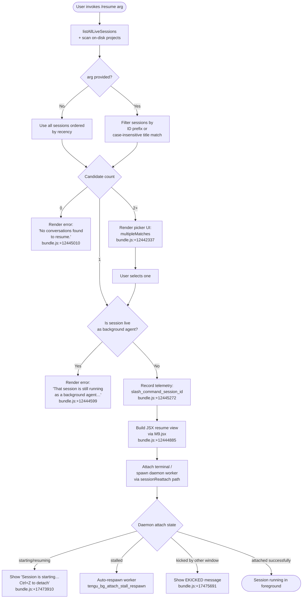

# `/resume`

> Analysis basis: CC v2.1.193 bundle.js (AST extraction + Claude interpretation)
> Minimum version: v2.1.193

---

## Overview

`/resume` (alias: `/continue`) allows the user to pick up a prior Claude Code conversation by session ID or fuzzy search term. It queries all live and on-disk sessions, filters them against the supplied argument, resolves any conflicts, and then attaches the terminal to the selected session — spawning a daemon worker if the session is idle, or rejecting the request if the session is already running as a live background agent.

---

## Registration

| Field | Value |
|---|---|
| type | `local-jsx` |
| name | `resume` |
| description | Resume a previous conversation |
| argumentHint | `[conversation id or search term]` |
| aliases | `continue` |
| module_id | `XFl` |
| load_inline | `true` |
| loc_byte | 12445955 |
| loc_byte_end | 12446152 |
| loc_line | 8281 |
| arbor_handler.name | `A0f` |
| arbor_handler.fqn | `claude-2.1.193::A0f` |
| arbor_handler.kind | `AsyncFunction` |
| arbor_handler.resolution_path | `module_id` |
| arbor_handler.n_hits | 0 |

Analysis basis: CC v2.1.193 bundle.js:+12445955

---

## Input Branching

The command has five or more distinct outcome branches (live background agent conflict, no match, single match with valid session, single match with active background session, multiple matches, and session attachment flow), so a Mermaid flowchart is used.



---

## Behavioral Spec

### 1. Session Discovery (`listAllLiveSessions` + on-disk scan)

The handler (`A0f`) begins by calling the session-enumeration helper (`ede`) which:

1. Resolves an immediate `Promise.resolve` to start async work.
2. Delegates to `listAllLiveSessions` (`n.listAllLiveSessions`) to collect all currently-tracked daemon sessions.
3. Concurrently performs a worktree-aware on-disk scan (`vEe`) to discover projects stored under the CC projects directory. The scan invokes `git worktree list --porcelain` (literals: `"worktree"`, `"list"`, `"--porcelain"` at bundle.js:+8757625–8757643) to enumerate worktree paths, then normalises paths with NFC (`"NFC"` bundle.js:+66394).

Analysis basis: CC v2.1.193 bundle.js:+12444589, +8769465, +8769487

---

### 2. Argument Filtering

```
function filterSessions(sessions, rawArg):
    if rawArg is empty:
        return sessions  // caller will sort by recency
    term = rawArg.toLowerCase()
    return sessions.filter(session =>
        session.id.startsWith(term) OR
        session.title.toLowerCase().includes(term)
    )
```

The validity check for the search term uses `CNc.test` (the `Fk` helper, bundle.js:+12445111) to validate the argument format before the filter pass at bundle.js:+12445129.

Analysis basis: CC v2.1.193 bundle.js:+12445111, +12445129

---

### 3. Zero-Match Handling

When the filtered candidate list is empty, the handler renders an inline error message:

> "No conversations found to resume." (bundle.js:+12445010)

The JSX component referenced is built by `KFl` which calls `St.bold` (bundle.js:+12442301) to format the `sessionNotFound` variant (literal `"sessionNotFound"` bundle.js:+12442266).

Analysis basis: CC v2.1.193 bundle.js:+12445010, +12442266

---

### 4. Multiple-Match Picker

When two or more sessions match, the handler renders an interactive selection UI tagged with the `multipleMatches` variant (literal `"multipleMatches"` bundle.js:+12442337). The picker lists candidate sessions formatted via `o` (column padding with `i.padEnd`, bundle.js:+17509233) with a two-space separator (literal `"  "` bundle.js:+17509254).

Analysis basis: CC v2.1.193 bundle.js:+12442337, +17509233

---

### 5. Live Background-Agent Conflict

Before attempting to attach, the resolved session is tested for background-agent liveness. The check compares against the `"interactive"` session-type literal (bundle.js:+8769578) and the `"background session"` status marker (bundle.js:+17520229). If the session is a live background agent the handler emits the blocking message:

> "That session is still running as a background agent. Open `claude agents` to attach to it, or stop it there first to resume here." (bundle.js:+12444599)

and returns without attaching.

Analysis basis: CC v2.1.193 bundle.js:+12444599, +8769578

---

### 6. Successful Attach Path

When a single, non-conflicting session is selected:

```
async function resumeSession(session, appState):
    recordTelemetry("slash_command_session_id", session.id)  // +12445272
    timestamp = Date.now()                                    // +12444918
    jsxView  = buildResumeView(session, timestamp)            // M9.jsx +12444885
    worktreeMeta = resolveWorktreeMeta(session)               // vEe +12444942
    recentPaths  = buildRecentPathsContext(worktreeMeta)      // mr +12444946
    projectFiles = gatherProjectFiles(session.rootPath)       // Ier +12444960
    appState     = mergeSessionState(session, appState)       // REe +12445250
    stateSnapshot = loadStateSnapshot(session)                // LEe +12445317
    if session has user-visible title:
        recordTelemetry("slash_command_title", title)         // +12445497
    return jsxView
```

The gather phase uses `xYl` (project-file collector, bundle.js:+13498345) which reads the directory tree, resolves real paths, filters by extension, and paginates results. It also invokes `gKe` to build a compact snapshot header (bundle.js:+12444885, +13498438).

Analysis basis: CC v2.1.193 bundle.js:+12444885, +12444918, +12444942, +12445250, +12445317

---

### 7. Daemon Attach State Machine

Once the view is returned, the attach-loop (managed by `gVo` / `cVo` via the daemon socket) transitions through the following states (literals in bundle.js):

| State literal | User-visible message | loc_byte |
|---|---|---|
| `"starting"` | "Session is starting — it will appear once ready. Ctrl+Z to detach" | +17473853 / +17473910 |
| `"resuming"` | "Waiting for session to redraw… Ctrl+Z to detach" | +17473869 / +17473983 |
| `"adopted"` | (silent, session redraws) | +17473885 |
| `"crashed"` | (triggers auto-respawn path) | +17473900 |

If the session stalls repeatedly at startup (`"Session keeps stalling at startup."` bundle.js:+17474335), the daemon escalates to SIGKILL (`"SIGKILL"` bundle.js:+17474494) and fires `tengu_bg_attach_stall_respawn`.

If another terminal attaches simultaneously, the current attach receives `"EKICKED: Session opened in another window"` (bundle.js:+17475691) and fires `tengu_bg_attach_kick`.

Analysis basis: CC v2.1.193 bundle.js:+17473853, +17473910, +17474335, +17475691

---

### 8. Session-State Reconstruction (`REe` / `rde`)

`REe` (conversation-state loader, bundle.js:+12445250) loads the on-disk JSONL transcript via `rde` and reconstructs:

- Message chain (parent-UUID walk, `"parentUuid":` literal bundle.js:+13487259)
- Compaction boundaries (`"compact_boundary"` bundle.js:+13914141)
- Summaries, last-prompt, custom title, AI title, tags, agent name, agent colour, agent settings, mode, permission-mode, isolation latch, worktree state, PR link, file-history snapshot, attribution snapshot, marble-origami commit/snapshot/reset markers
- Transcript metadata via `f9f` (binary JSONL reader, bundle.js:+13487199) using a 1 MiB read buffer (literal `1048576` bundle.js:+13487536)

Analysis basis: CC v2.1.193 bundle.js:+12445250, +13490682, +13487536

---

## State & Side Effects

| Item | Detail |
|---|---|
| Telemetry — `tengu_bg_attach` | Fired on every daemon attach attempt (bundle.js:+17473366) |
| Telemetry — `tengu_bg_attach_stall_respawn` | Fired when a stalled worker is SIGKILL-respawned (bundle.js:+17474559) |
| Telemetry — `tengu_bg_attach_stall_gave_up` | Fired when the stall retry limit is exceeded (bundle.js:+17474289) |
| Telemetry — `tengu_bg_attach_kick` | Fired when this terminal is evicted by another attacher (bundle.js:+17475551) |
| Telemetry — `tengu_bg_attach_legacy_autorespawn` | Fired for legacy worker PTY respawn path (bundle.js:+17472087) |
| Telemetry — `tengu_bg_attach_upgrade` | Fired when a background worker is upgraded (bundle.js:+13266651) |
| Telemetry — `tengu_worktree_detection` | Fired during git worktree enumeration (bundle.js:+8757725) |
| Telemetry — `tengu_daemon_control` | Fired on daemon control operations (bundle.js:+17520352) |
| Telemetry — `tengu_transcript_phantom_parent` | Fired when a parent UUID reference is missing (bundle.js:+13489722) |
| Telemetry — `tengu_transcript_parent_cycle` | Fired when the parent-UUID chain forms a cycle (bundle.js:+13493814) |
| Telemetry — `tengu_chain_parent_cycle` | Fired at chain-level cycle detection (bundle.js:+13467755) |
| Telemetry — `tengu_chain_timestamp_fallback` | Fired when timestamp ordering falls back (bundle.js:+13467904) |
| Telemetry — `tengu_chain_parallel_tr_recovered` | Fired on parallel tool-result recovery (bundle.js:+13469770) |
| Telemetry — `tengu_bg_dispatch_sigkill_escalate` | Fired when SIGKILL is escalated for a stalled worker (bundle.js:+17482166) |
| Telemetry — `tengu_bg_proto_mismatch` | Fired on daemon protocol version mismatch (bundle.js:+17467786) |
| Telemetry — `tengu_relink_walk_broken` | Fired on broken relink walk (bundle.js:+13467261) |
| Literal side-effects | Records `"slash_command_session_id"` and `"slash_command_title"` literals into session tracking (bundle.js:+12445272, +12445497) |
| appState changes | Session state is merged via `REe` / `rde`; worktree metadata patched via `vEe`; stateSnapshot applied via `LEe` |
| Daemon socket | `gVo` opens a domain socket connection via `cVo` → `mur.connect`; tracks attach state; cleans up on detach |
| File I/O | Reads `daemon.status.json` (bundle.js:+12997330) and `state.json` (bundle.js:+17488945); reads JSONL transcript with 1 MiB buffer |
| Sound | None observed in depth-2 traversal |

---

## Version History

| Version | Change |
|---|---|
| v2.1.193 | Initial analysis |

---

## Common Mistakes

1. **Passing a partial UUID that matches multiple sessions** — the command shows an interactive picker rather than resuming immediately; supply enough characters of the session ID to uniquely identify it, or use `/resume` with no argument and select from the list.
2. **Attempting to resume a session that is still running as a background agent** — the command refuses with an explicit message and directs the user to `claude agents`. Stop the background agent first, or use `claude agents` to attach directly.
3. **Confusing `/resume` with restarting a fresh conversation** — the command restores the full prior transcript, including compaction boundaries and tool-result chains; it is not equivalent to starting a new chat with context pasted in.
4. **Using `/continue` without realising it is an alias** — both `/resume` and `/continue` are identical; there is no behavioural difference (aliases field, bundle.js:+12445955).
5. **Expecting instant attachment when a session was idle** — the daemon must respawn the worker (`"starting"` / `"resuming"` states); a brief delay and the "Session is starting…" message are normal.

---

## Appendix — Identifier Mapping

> For bundle debugging only. Identifiers change across versions.

| Identifier | Role |
|---|---|
| `A0f` | Main async handler for `/resume` (arbor_handler) |
| `YFl` | Pre-handler setup / session list pre-filter |
| `ede` | Session enumeration helper (lists live sessions) |
| `vEe` | Worktree-aware on-disk session scanner |
| `Vr` | Subprocess / child-process spawner wrapper |
| `I$e` | Core subprocess execution engine |
| `Vms` | Process-spawn configuration builder |
| `Fk` | Argument format validator (regex test) |
| `REe` | Conversation-state loader (full session reconstruction) |
| `rde` | On-disk transcript parser and state map builder |
| `LEe` | State-snapshot loader |
| `LYl` | State-snapshot + rde orchestrator |
| `GJ` | Project-file context builder (calls xYl, gKe) |
| `xYl` | Recursive project-file collector |
| `gKe` | Compact snapshot header builder |
| `b9f` | JSONL entry reader helper |
| `f9f` | Binary JSONL file reader (1 MiB buffer) |
| `m9f` | Synchronous file descriptor reader |
| `n9f` | Normalised text trim/array checker |
| `r9f` | Array-based content filter |
| `p9f` | Buffer-based JSONL parser |
| `e9f` | NaN / value-set membership checker |
| `t9f` | Transcript chain sort and deduplication |
| `d9f` | Buffer comparison helper |
| `wYl` | Buffer-at accessor helper |
| `nYl` | Session-roster state updater |
| `J3f` | Parent-UUID chain walker |
| `xEe` | Chain assembler (builds ordered message list) |
| `CYl` | Chain deduplication map builder |
| `Q3f` | Chain sort helper |
| `Prr` | Parent-ref resolver |
| `Orr` | Roster entry array builder |
| `qzt` | Compact-summary message normaliser |
| `O2o` | Title/text extractor |
| `Gft` | Message mapper |
| `$2o` | Content-type filter (image / document) |
| `N2o` | Timestamp parser wrapper |
| `uSt` | Date.parse wrapper |
| `b2o` | Combined message content extractor |
| `Il` | Markdown / text parser |
| `Ier` | Project-files context collector |
| `$Yt` | Project-file aggregator |
| `i1e` | File-chunk slicer |
| `I2o` | Directory recursive file scanner |
| `LYt` | File-cache get/set helper |
| `aS` | Path normaliser |
| `g9f` | Session path resolver |
| `q2` | Path joiner helper |
| `iL` | Directory readdir walker |
| `mr` | Working-directory resolver |
| `NH` | Unicode NFC normaliser |
| `C8l` | Daemon-status.json reader |
| `v7t` | Status-file path builder |
| `qs` | AsyncLocalStorage store getter |
| `iee` | Event emitter helper |
| `wg` | Session-list sort/rank helper |
| `ore` | Session metadata accessor |
| `mAe` | Session display-name formatter |
| `KFl` | Error/picker JSX component builder |
| `xe` | Error logging / structured error builder |
| `eo` | Error constructor wrapper |
| `at` | String coercion helper |
| `Bi` | Telemetry batch sender |
| `Rds` | Telemetry record builder |
| `e_u` | Telemetry queue manager |
| `be` | Boolean / type coercion helper |
| `gVo` | Daemon session lifecycle manager (attach/detach) |
| `cVo` | Daemon socket connection handler |
| `pHm` | Daemon protocol message dispatcher |
| `Tp` | Protocol message terminator |
| `f` | Daemon worker state tracker |
| `D` | Worker process wrapper |
| `L` | Background-session sweep manager |
| `iYt` | Memory-check helper |
| `Ezl` | Worker upgrade checker |
| `znr` | Worker retire helper |
| `it` | Worker telemetry tracker |
| `Knr` | Memory pressure checker |
| `I9e` | File lstat / cleanup helper |
| `Un` | Retry-with-timeout helper |
| `Re` | Feature-ok telemetry emitter |
| `we` | Feature-bad telemetry emitter |
| `Oe` | Zero-value helper |
| `Nn` | No-op / passthrough helper |
| `No` | Another zero-value helper |
| `wIe` | Stream-buffer JSONL splitter |
| `bSu` | Newline-based stream splitter |
| `ISu` | JSON-object stream extractor |
| `TSu` | Raw byte stream extractor |
| `ASu` | Stream-processor selector |
| `xAe` | Permission-flag bitmask filter (64/32 bits) |
| `Vo` | Error-annotation helper |
| `VWo` | MCP connection update orchestrator |
| `l6e` | MCP server connector |
| `Bcr` | MCP connection result applier |
| `mSa` | MCP session initialiser |
| `iG` | Session-ID generator |
| `lYe` | JSON path builder |
| `vnn` | JSON path segment validator |
| `wnn` | JSON path segment normaliser |
| `BS` | Session-index bucket setter |
| `$3f` | Session metadata schema validator |
| `T` | Config / environment reader |
| `qFc` | Config loader |
| `ke` | JSON stringify helper |
| `Lc` | Path redactor |
| `iYe` | OS info collector |
| `XFc` | Claude binary path resolver |
| `DEu` | String sanitiser |
| `MEu` | Arg-normalisation helper |
| `Kd` | Version comparator |

---

Note: index built via Arbor fallback; some signals (telemetry, literals) may be missing — see arbor-fallback.js.