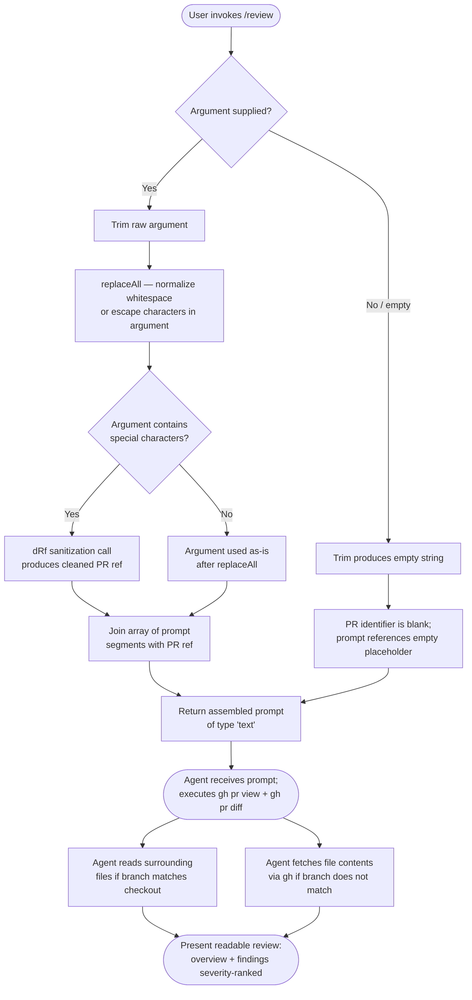

# `/review`

> Analysis basis: CC v2.1.193 bundle.js (AST extraction + Claude interpretation)
> Minimum version: v2.1.193

---

## Overview

`/review` is a prompt-type slash command that targets a **GitHub pull request** identified by its PR number, assembling a structured review prompt that instructs the agent to fetch PR metadata and its unified diff via the `gh` CLI, then produce a human-readable review ranked by finding severity. It is intentionally scoped to the PR diff only — local working-tree changes are explicitly out of scope, distinguishing it from `/code-review` which operates on the local diff.

---

## Registration

| Field | Value |
|---|---|
| type | `prompt` |
| name | `review` |
| description | `Review a GitHub pull request; for your working diff use /code-review` |
| argumentHint | `[pr number]` |
| handler_method | `getPromptForCommand` |
| handler_method_start (byte) | `12491097` |
| handler_method_end (byte) | `12491255` |
| loc_byte | `12490868` |
| loc_byte_end | `12491256` |
| loc_line | `8388` |
| prompt_body.length | `824` characters |
| prompt_body.trace | `conditional; call→dRf(...) (1 literals); identifier→uRf (unresolved)` |
| arbor_handler.name | `getPromptForCommand` |
| arbor_handler.kind | `Method` |
| arbor_handler.fqn | `claude-2.1.193::getPromptForCommand` |
| arbor_handler.resolution_path | `direct` |
| arbor_handler.n_hits | `1` |
| `handler_method_start` | `12491097` |
| `handler_method_end` | `12491255` |

Analysis basis: CC v2.1.193 bundle.js:+12490868

---

## Input Branching

The handler exhibits 3+ distinct paths depending on whether an argument is supplied, its whitespace state, and how the PR identifier is interpolated into the prompt. A Mermaid flowchart is used accordingly.



Analysis basis: CC v2.1.193 bundle.js:+12491097 – +12491255

---

## Behavioral Spec

### 1. Argument Normalization

When the user provides a PR number (or any string) after `/review`, the handler method `getPromptForCommand` performs the following normalization sequence before constructing the prompt:

```
function getPromptForCommand(rawArgument):
    trimmed = rawArgument.trim()                  # strip leading/trailing whitespace
    normalized = trimmed.replaceAll(target, replacement)  # neutralize special chars
    sanitized = sanitizeForPrompt(normalized)     # call to dRf helper with 1 literal arg
    segments = buildPromptSegments(sanitized)     # assemble prompt parts as array
    return segments.join("")                      # yield final prompt string, type="text"
```

The output type is the string literal `"text"` (bundle.js:+12491216), indicating this is a plain-text prompt handed to the agent turn.

Analysis basis: CC v2.1.193 bundle.js:+12491141, +12491165, +12491230, +12491236

---

### 2. Prompt Construction and Agent Instructions

The assembled prompt (total length: **824 characters**, bundle.js:+12490868) directs the agent through a fixed sequence:

```
function buildReviewPrompt(prIdentifier):

    # Phase 1 — Identify target
    set reviewTarget = "GitHub pull request " + prIdentifier

    # Phase 2 — Gather PR metadata
    instruct agent: run gh pr view <prIdentifier>
        --json title,body,author,baseRefName,headRefName,
               state,additions,deletions,changedFiles,labels

    # Phase 3 — Gather unified diff
    instruct agent: run gh pr diff <prIdentifier>

    # Scope constraint
    assert: local working-tree changes are OUT OF SCOPE
    assert: only the PR diff constitutes the review surface

    # Phase 4 — Surrounding context resolution
    if currentCheckoutBranch == pr.headRefName:
        instruct agent: Read files from local checkout for surrounding context
    else:
        instruct agent: fetch file contents via gh CLI

    # Phase 5 (unresolved; see uRf) — Internal analysis phases
    # <!-- TODO: not found in depth-2 traversal; needs --depth 4 -->
    # The prompt_body.trace notes identifier→uRf (unresolved),
    # suggesting one or more intermediate analysis phases are
    # injected from an unresolved top-level variable.

    # Phase 6 — Present review
    instruct agent:
        DO NOT reply with raw JSON findings array
        present:
            - 2–3 sentence overview of what the PR does
            - surviving findings ordered most-severe first
              formatted as: "file:line — summary (failure scenario)"
            - OR note that nothing survived verification

    return prompt
```

Analysis basis: CC v2.1.193 bundle.js:+12491097 – +12491255 (handler body); prompt_body length 824 chars at +12490868.

---

### 3. Timeout / Retry Utility (Depth-2 Neighbor)

The call graph reaches a utility at `e` (depth 2) that invokes `Math.random` and `setTimeout`. This pattern indicates a **jittered retry or delay helper** used elsewhere in the bundle, not directly within the `/review` prompt assembly path itself. It is reachable via transitive graph traversal but does not affect the prompt returned to the agent.

```
function jitteredDelay(baseMs):
    jitter = Math.random() * 2    # scale factor: 2  (bundle.js:+14343445)
    offset = jitter - 1           # center around 0  (bundle.js:+14343461)
    setTimeout(callback, baseMs + offset)
```

Analysis basis: CC v2.1.193 bundle.js:+14343447, +14343484

---

### 4. Process-Exit Error Path (Depth-2 Neighbor)

The identifier `Is` (reachable via `r` → `Is`) calls `lKe`, then `OT`, then `process.exit`, and emits the string literal `"cli_error"` (bundle.js:+13300654). This is the bundle's global CLI error handler, not specific to `/review`.

```
function cliErrorHandler():
    logError(lKe)               # structured error logging
    notifyOrCleanup(OT)         # teardown hook
    process.exit(nonZeroCode)   # terminate with cli_error signal
```

Analysis basis: CC v2.1.193 bundle.js:+13300644, +13300651, +13300667

---

### 5. Async Task Tracker (Depth-2 Neighbor)

The identifier `s` (reachable via `i` → `s`) manages a set of in-flight async operations:

```
function trackAsyncOperation(operation):
    activeSet.add(operation)        # register   (bundle.js:+17488421)
    operation.finally(() =>
        activeSet.delete(operation) # deregister (bundle.js:+17488444)
    )
```

Buffer size constant observed in this subgraph: **1024** (bundle.js:+17378473), likely a read-buffer limit. The `toLowercase` normalization constant **40** (bundle.js:+17511228) appears in the `n` → `i.toLowerCase` branch, suggesting a 40-character lowercase comparison window for some identifier matching.

Analysis basis: CC v2.1.193 bundle.js:+17488421, +17488430, +17488444

---

## State & Side Effects

| Item | Detail |
|---|---|
| Telemetry | None detected in depth-2 traversal (`telemetry: []`) |
| Hook registration | No slash-command hook registration observed in this registration block |
| appState changes | None directly observed; prompt is returned to the agent turn without explicit state mutation in the handler |
| Sound | None observed |
| gh CLI side effects | Agent is instructed to invoke `gh pr view` and `gh pr diff` — these are network calls executed by the agent, not by the handler itself |
| File reads | Agent may `Read` local files from the current checkout when the branch matches the PR head |
| Prompt output type | `"text"` literal (bundle.js:+12491216) |
| Process exit path | `cli_error` exit reachable via depth-2 error handler `Is` (bundle.js:+13300654) |

---

## Version History

| Version | Change |
|---|---|
| v2.1.193 | Initial analysis |

---

## Common Mistakes

1. **Using `/review` instead of `/code-review` for local diffs.** The description explicitly states: *"for your working diff use /code-review"*. `/review` scopes exclusively to the PR diff fetched via `gh`; it will not review uncommitted local changes.
2. **Omitting the PR number argument.** The `argumentHint` is `[pr number]`. When no argument is supplied, the `trim()` call produces an empty string and the PR identifier placeholder in the prompt is blank, causing the agent to have no valid `gh pr view` target.
3. **Running without the `gh` CLI installed or authenticated.** The prompt instructs the agent to run `gh pr view` and `gh pr diff`; if `gh` is not on the PATH or lacks GitHub auth, the agent will fail to gather any diff data.
4. **Expecting raw JSON output.** The prompt explicitly instructs the agent *not* to reply with the raw JSON findings array. The output is always a formatted prose review with severity-ranked findings.
5. **Assuming surrounding-file context is always read locally.** Context file resolution is conditional: local files are used only when the current checkout branch matches the PR's head branch; otherwise the agent fetches contents via `gh`.

---

## Appendix — Identifier Mapping

> For bundle debugging only. Identifiers change across versions.

| Identifier | Role |
|---|---|
| `__handler_review` | Synthetic BFS entry point for the `/review` command handler; not a real bundle symbol |
| `e` | Jittered delay utility (calls `Math.random` + `setTimeout`); depth-2 neighbor, not in prompt path |
| `t` | Intermediate variable holding the trimmed/replaceAll-processed argument string |
| `dRf` | Sanitization helper called with 1 literal argument to clean the PR identifier before prompt interpolation |
| `n` | Prompt segment array builder; calls `i.toLowerCase` for identifier normalization |
| `i` | Async operation wrapper; calls `n.close` / `r.close` and delegates to `s` for tracking |
| `r` | Lower-level async resource object; delegates fatal errors to `Is`; carries `"data"` literal |
| `Is` | Global CLI error handler; calls `lKe` (log), `OT` (teardown), then `process.exit` with `"cli_error"` |
| `s` | In-flight async task tracker; manages an `add`/`delete` set via `.finally()` |
| `uRf` | Unresolved top-level identifier injected into prompt body (intermediate analysis phases); not reachable at depth ≤ 2 |

---

Note: index built via Arbor fallback; some signals (telemetry, literals) may be missing — see arbor-fallback.js.