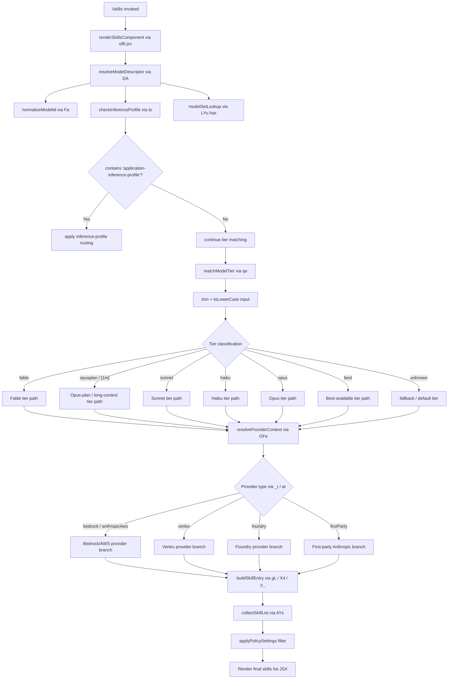

# `/skills`

> Analysis basis: CC v2.1.193 bundle.js (AST extraction + Claude interpretation)
> Minimum version: v2.1.193

---

## Overview

The `/skills` command lists the available skills (model capabilities or named capability tiers) accessible in the current Claude Code session. It is a `local-jsx` command that executes immediately, rendering a JSX component directly rather than sending a prompt to the agent. The handler resolves the active model context and enumerates known skill/model tiers, then presents them for display.

---

## Registration

| Field | Value |
|---|---|
| type | `local-jsx` |
| name | `skills` |
| description | `List available skills` |
| loc_byte | `12506306` |
| loc_byte_end | `12506438` |
| loc_line | `8389` |
| immediate | `true` |
| module_id | `rBl` |
| load_inline | `true` |
| arbor_handler.name | `kRf` |
| arbor_handler.fqn | `claude-2.1.193::kRf` |
| arbor_handler.kind | `AsyncFunction` |
| arbor_handler.resolution_path | `module_id` |
| arbor_handler.n_hits | `0` |

Analysis basis: CC v2.1.193 bundle.js:+12506306

---

## Input Branching

The handler resolves a model identifier string and then branches across multiple known skill/tier identifiers. There are more than three distinct resolution paths, so a Mermaid flowchart is used.



Analysis basis: CC v2.1.193 bundle.js:+12506119 (JSX render), +12506183 (model resolution entry), +2306306 (tier normalization), +2292090 (provider resolution)

---

## Behavioral Spec

### 1. Handler Entry — `renderSkillsHandler` (`kRf`)

The top-level async handler for `/skills`:

```
async function renderSkillsHandler(commandContext):
    skillsComponent = buildSkillsJSXComponent(commandContext)   // oBl.jsx
    modelDescriptor = resolveModelDescriptor(commandContext)    // DA
    return renderComponent(skillsComponent, modelDescriptor)
```

Analysis basis: CC v2.1.193 bundle.js:+12506119, +12506183

---

### 2. Model Descriptor Resolution — `resolveModelDescriptor` (`DA`)

Determines the canonical model descriptor from the current session context:

```
function resolveModelDescriptor(context):
    rawName = normalizeModelName(context.modelId)       // Fa
    profileInfo = checkInferenceProfile(rawName)        // to
    if modelSetLookup.has(rawName):                     // LYu.has
        return buildDescriptorFromSet(rawName, profileInfo, maxDepth=4)
    else:
        return buildFallbackDescriptor(rawName, profileInfo, maxDepth=3)
```

- The numeric literal `4` appears at the call site for set-based resolution (bundle.js:+2304141).
- The numeric literal `3` appears for the fallback path (bundle.js:+2304208).

Analysis basis: CC v2.1.193 bundle.js:+2304149, +2304157, +2304160, +2304195

---

### 3. Inference Profile Check — `checkInferenceProfile` (`to`)

Determines whether the model identifier refers to an AWS application inference profile:

```
function checkInferenceProfile(modelId):
    normalizedId = normalizePath(modelId)          // PZe
    sanitized = sanitizeId(normalizedId)           // __
    if sanitized.includes("application-inference-profile"):
        routing = resolveInferenceRouting(sanitized)   // RTt
        return applyRouting(routing)                   // up
    return null
```

The string constant `"application-inference-profile"` is the discriminating literal used to detect AWS cross-account inference profiles.

Analysis basis: CC v2.1.193 bundle.js:+2304020, +2304031, +2304071, +2304075

---

### 4. Model Tier Normalization — `matchModelTier` (`qo`)

Maps a raw model identifier string to a known capability tier:

```
function matchModelTier(rawId):
    normalized = rawId.trim().toLowerCase()

    if isExcludedModel(normalized):          // nM / Fge.includes
        return null

    if containsFable(normalized):            // "fable" literal
        return buildFableTier(normalized)    // OFe

    if containsOpusPlan(normalized):         // "opusplan" / "[1m]"
        return buildOpusPlanTier(normalized) // Cv, Wz

    if containsSonnet(normalized):           // "sonnet"
        return buildSonnetTier(normalized)   // gL

    if containsHaiku(normalized):            // "haiku"
        return buildHaikuTier(normalized)    // X4

    if containsOpus(normalized):             // "opus"
        return buildOpusTier(normalized)     // y_

    if isBestAvailable(normalized):          // "best"
        return resolveBestTier(normalized)   // AYs

    return applyReplacementMapping(normalized)   // IW / e.replace
    // fallback: normalizeUnknownId(normalized) // bYu / t.replace
```

**Known tier string constants** (all found in bundle literals):

| Tier keyword | Literal | loc_byte |
|---|---|---|
| Fable | `"fable"` | 2306383 |
| Long-context / Opus-plan bracket | `"[1m]"` | 2306434 |
| Opus-plan | `"opusplan"` | 2306450 |
| Sonnet | `"sonnet"` | 2306495 |
| Haiku | `"haiku"` | 2306538 |
| Opus | `"opus"` | 2306580 |
| Best available | `"best"` | 2306618 |

Analysis basis: CC v2.1.193 bundle.js:+2306306 through +2306733

---

### 5. Provider Context Resolution — `resolveProviderContext` (`OFe`)

Once a tier is identified, the provider environment is resolved:

```
function resolveProviderContext(tier):
    providerType = getProviderType()        // _r / at (returns string constant)
    // Known provider type strings:
    //   "bedrock", "anthropicAws", "vertex", "foundry", "firstParty"

    switch providerType:
        case "bedrock" | "anthropicAws":
            return buildAwsProvider(tier)   // N1r → Zp, Wz, MRt
        case "vertex":
            return buildVertexProvider(tier)
        case "foundry":
            return buildFoundryProvider(tier)
        case "firstParty":
            return buildFirstPartyProvider(tier)  // Cv, Wz
    return buildDefaultProvider(tier)
```

**Known provider type constants**:

| Provider | Literal | loc_byte |
|---|---|---|
| `"bedrock"` | bedrock | 2138591 |
| `"foundry"` | foundry | 2138641 |
| `"anthropicAws"` | anthropicAws | 2138697 |
| `"vertex"` | vertex | 2138799 |
| `"firstParty"` | firstParty | 2139415 |

Analysis basis: CC v2.1.193 bundle.js:+2292090, +2292103, +2292106, +2138551

---

### 6. Skills List Assembly — `collectSkillList` (`AYs`)

Aggregates skill entries and applies policy filtering:

```
function collectSkillList(context):
    baseSkills = enumerateBaseSkills(context)       // qie
    providerSkills = resolveProviderSkills(context) // OFe
    merged = mergeSkillLists(baseSkills, providerSkills, startIndex=0) // wa

    if hasPolicySettings(merged):                   // "policySettings"
        filtered = applyPolicyFilter(merged)
        return buildGatewaySkills(filtered)         // "gateway"
    return merged
```

The literal `"policySettings"` (bundle.js:+2286781) indicates that enterprise policy configuration may restrict which skills are visible. The literal `"gateway"` (bundle.js:+2290598) indicates a gateway routing mode for policy-filtered skills.

Analysis basis: CC v2.1.193 bundle.js:+2290183, +2290196, +2290232, +2286781, +2290598

---

### 7. Individual Skill Entry Builder — `wa` (parseAndBuildSkillEntry)

Constructs a single skill entry from raw configuration data:

```
function parseAndBuildSkillEntry(rawEntry):
    lines = rawEntry.split(newline).map(l => l.trim())
    for line in lines:
        if line.includes(separator):
            parts = parseParts(line)            // oxt, sxt
            name = extractName(parts)           // PFe, Gge
            value = extractValue(parts)         // Go
            if isExcluded(value):               // nM
                continue
            skillObj = buildSkillObject(name, value, parts)  // a_n, EYs
            annotateWithProvider(skillObj)      // _n, PZe
            annotateWithTier(skillObj)          // yYs, EYu
            applyQoNormalization(skillObj)      // qo
            applyFinalRouting(skillObj)         // IRt, SYu
            yield skillObj
```

Analysis basis: CC v2.1.193 bundle.js:+2286349 through +2287323

---

### 8. Model Tier — Named Model Constants

The following named model strings appear in `h$` (modelTierResolver) call graph:

| Constant | loc_byte |
|---|---|
| `"claude-fable-5"` | 3043276 |
| `"claude-mythos-5"` | 3043298 |
| `"claude-mythos-preview"` | 3043321 |
| `"claude-opus-4-7"` | 3043350 |
| `"claude-opus-4-8"` | 3043373 |

These are resolved through `h$` → `qge` + `to` + `BH` + `_u`, indicating a model metadata lookup pipeline that maps tier names to concrete model identifiers, then validates them against provider context.

Analysis basis: CC v2.1.193 bundle.js:+3043242, +3043263, +3043276–3043373, +3043406, +3043437

---

### 9. Random Delay Utility — `e` (jitter helper)

A small utility reachable in the call graph introduces a random delay, likely used for debouncing or staggered rendering:

```
function jitterDelay():
    base = Math.random() * 2 + 1    // literals: 2 @ +14343445, 1 @ +14343461
    setTimeout(callback, base)
```

Analysis basis: CC v2.1.193 bundle.js:+14343447, +14343484

---

## State & Side Effects

| Item | Detail |
|---|---|
| Telemetry | None detected in depth-2 traversal (`telemetry: []`) |
| Hook registration | None detected |
| appState changes | None detected; command is read-only display |
| Sound | None detected |
| Rendering | Produces a JSX component via `oBl.jsx` (bundle.js:+12506119); rendered immediately due to `immediate: true` |
| Policy filter | May suppress certain skills if `"policySettings"` is present in session config (bundle.js:+2286781) |
| Provider routing | Reads current provider type (`"bedrock"`, `"vertex"`, `"foundry"`, `"firstParty"`) to filter/annotate skills |
| Model set lookup | Uses an internal model-set registry (`LYu`) to disambiguate model identifiers (bundle.js:+2304195) |

---

## Version History

| Version | Change |
|---|---|
| v2.1.193 | Initial analysis |

---

## Common Mistakes

1. **Expecting agent output**: `/skills` is `immediate: true` and `local-jsx` — it renders a component directly and does not send any prompt to the Claude agent. No conversational response is generated.
2. **Assuming provider-agnostic output**: The skills list is filtered and annotated based on the active provider type (`bedrock`, `vertex`, `foundry`, or `firstParty`). Output will differ across deployment environments.
3. **Assuming a static list**: The tier matching pipeline (`matchModelTier`) normalizes the model ID at runtime. Skill availability depends on the current session's model configuration, not a hardcoded registry.
4. **Missing policy suppression**: In enterprise deployments, `policySettings` may hide certain skills entirely. An empty or partial list does not necessarily indicate a bug.
5. **Confusing tier keywords with model names**: String constants like `"fable"`, `"sonnet"`, `"haiku"`, `"opus"`, and `"best"` are internal tier discriminators, not verbatim model names returned to the user.

---

## Appendix — Identifier Mapping

> For bundle debugging only. Identifiers change across versions.

| Identifier | Role |
|---|---|
| `kRf` | Top-level async handler for `/skills` (`renderSkillsHandler`) |
| `DA` | Model descriptor resolver (`resolveModelDescriptor`) |
| `qo` | Model tier matcher / normalizer (`matchModelTier`) |
| `e` | Jitter/random-delay utility |
| `t` | Intermediate string variable in tier normalization |
| `rH` | Helper called from `matchModelTier`; routes to `qge` |
| `qge` | Model metadata lookup used by `rH` and `h$` |
| `Fa` | Model name normalizer / string replacer (`normalizeModelName`) |
| `nM` | Exclusion checker against known exclude-list (`Fge.includes`) |
| `OFe` | Provider context resolver (`resolveProviderContext`) |
| `N1r` | AWS/Bedrock provider builder; calls `Zp`, `Wz`, `MRt` |
| `Cv` | First-party or fallback provider builder |
| `Wz` | Provider context wrapper; delegates to `_r`, `_u` |
| `MRt` | String replacer used in provider path construction |
| `gL` | Sonnet tier skill builder; calls `Cv`, `c_n` |
| `c_n` | Sonnet sub-builder; calls `Zp`, `Xu` |
| `X4` | Haiku tier skill builder; calls `Cv`, `U1r` |
| `U1r` | Haiku sub-builder; calls `Zp` |
| `IW` | Replacement-mapping fallback for unknown tiers |
| `y_` | Opus tier skill builder; calls `Cv`, `uve` |
| `uve` | Opus sub-builder; calls `Zp`, `_r`, `Xu` |
| `AYs` | Skills list assembler / aggregator (`collectSkillList`) |
| `qie` | Base skills enumerator; calls `_r`, `_u`, `Wge`, `jge` |
| `wa` | Individual skill entry parser and builder (`parseAndBuildSkillEntry`) |
| `Xu` | Provider annotation helper; delegates to `_r` |
| `_r` | Provider type getter; calls `at` (returns provider string) |
| `Bie` | Skill inclusion checker (`xYu.includes`) |
| `NFe` | Skill name finalizer; calls `at` |
| `at` | String coercion/conversion utility |
| `bYu` | Lowercase fallback normalizer for unknown model IDs |
| `h$` | Model tier-to-model-name resolver; calls `qge`, `to`, `BH`, `_u` |
| `to` | Inference profile checker (`checkInferenceProfile`) |
| `BH` | Model metadata validator; calls `G0t`, `Dqu`, `_r`, `TFe` |
| `_u` | Secondary provider/model context helper; calls `vhn` |

---

Note: index built via Arbor fallback; some signals (telemetry, literals) may be missing — see arbor-fallback.js.