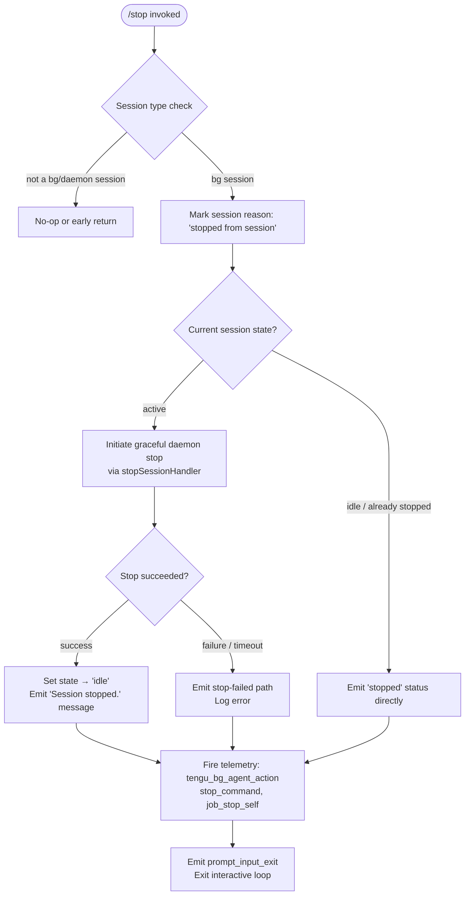

# `/stop`

> Analysis basis: CC v2.1.193 bundle.js (AST extraction + Claude interpretation)
> Minimum version: v2.1.193

---

## Overview

The `/stop` command terminates the current background session, sending it to an idle/stopped state. Crucially, the session transcript and any associated worktree are preserved — no data is destroyed. The command is only meaningful inside a background (`bg`) session context; it signals a self-initiated stop (`job_stop_self`) and emits `stop_command` telemetry before exiting the interactive prompt loop.

---

## Registration

| Field | Value |
|---|---|
| type | `local-jsx` |
| name | `stop` |
| description | Stop this background session; transcript and worktree are kept |
| immediate | `true` |
| module_id | `_7l` |
| load_inline | `true` |
| loc_byte | `13341741` |
| loc_byte_end | `13341925` |
| loc_line | `9226` |
| arbor_handler.name | `GBf` |
| arbor_handler.fqn | `claude-2.1.193::GBf` |
| arbor_handler.kind | `AsyncFunction` |
| arbor_handler.resolution_path | `module_id` |
| arbor_handler.n_hits | `0` |

Analysis basis: CC v2.1.193 bundle.js:+13341741

---

## Input Branching

The command follows a multi-branch flow with more than three distinct paths depending on the current session type, session state, and outcome of the stop operation.



Analysis basis: CC v2.1.193 bundle.js:+13341460 (handler entry `GBf`), +13340867 (telemetry), +13341069 (reason string), +13341098 (idle state), +13341242 (message), +13341273 (job_stop_self), +13341295 (prompt_input_exit)

---

## Behavioral Spec

### Top-Level Handler — `stopCommandHandler` (`GBf`)

```
async function stopCommandHandler(context):
    // Resolve the current background session via module _7l
    result = await stopSessionRenderer(context)
    emit telemetry("stop_command")   // loc +13341474
    return result
```

Analysis basis: CC v2.1.193 bundle.js:+13341460, +13341470, +13341474

---

### Session State Renderer — `sessionStopRenderer` (`_rr`)

```
function sessionStopRenderer(appState):
    sessionType = getSessionType(appState)          // checks "bg", "daemon", "daemon-worker"
    currentStatus = readSessionStatus(appState)     // "active", "idle", "stopped", etc.

    emit telemetry("tengu_bg_agent_action",         // loc +13340867
                   { action: "stop" })

    if sessionType not in ["bg", "daemon", "daemon-worker"]:
        return noOp()

    reason = "stopped from session"                  // loc +13341069

    if currentStatus == "active":
        scheduleStateTransition(appState, reason, targetState="idle")
        initiateSessionStop(appState)                // calls sessionFileWriter, daemonController
    else:
        // Already idle/stopped — emit status immediately
        setSessionState(appState, "idle")            // loc +13341098

    displayMessage("Session stopped.")               // loc +13341242
    recordJobStopReason("job_stop_self")             // loc +13341273
    triggerPromptInputExit()                         // loc +13341295
```

Analysis basis: CC v2.1.193 bundle.js:+13340865, +13340899, +13340917, +13340936, +13340939, +13340953, +13340962, +13341010, +13341023, +13341035, +13341069, +13341098, +13341211, +13341238, +13341270, +13341290

---

### Session File & State Writer — `sessionFileWriter` (`$d`)

```
function sessionFileWriter(sessionId, appState):
    filePath = pathJoin(baseDir, sessionId)           // loc +4295212
    // Write state file atomically using randomBytes salt (4 bytes hex)
    // loc +4295240 (permission bits: 0o600 = 384 decimal)
    atomicWriteStateFile(filePath, sessionState,
                         permissions=384,
                         encoding="utf8")             // loc +4295259
    // After write, remove the session from the in-memory cache
    clearSessionCacheEntry(sessionId)                 // $y → xte.delete loc +4295597
```

Analysis basis: CC v2.1.193 bundle.js:+4295209, +4295212, +4295227, +4295240, +4295259, +4295597

---

### Session Status File Reader — `bgSessionStateReader` (`Gi`)

```
async function bgSessionStateReader(sessionDir):
    entries = await parallelStat(sessionDir)          // Promise.all + Xb.lstat
    for each entry:
        if not entry.isFile():
            logWarning("not a regular file")          // loc +4296018 / +4296048
            continue
        // Check cache (xte.get / xte.set / xte.delete / xte.clear)
        cached = sessionCache.get(entry)
        if cached is valid:
            use cached
        else:
            raw = await readFile(entry, "utf-8")      // loc +4296676
            parsed = safeParse(raw)                   // Bt → JSON.parse
            sessionCache.set(entry, parsed)

    // Sort by "order" / "stateOrder" fields             loc +4295665 / +4295686
    // Coalesce states: "done", "success", "failure",
    //                  "stopped", "active"             loc +4304224…+4304405
    // Emit transient-state telemetry if applicable
    emit telemetry("tengu_bg_state_read_transient")   // loc +4296462
    return sortedSessions
```

Analysis basis: CC v2.1.193 bundle.js:+4295638, +4295725, +4295738, +4295812, +4295879, +4295923, +4295944, +4296018, +4296048, +4296151, +4296253, +4296266, +4296280, +4296389, +4296438, +4296449, +4296460, +4296662, +4296732, +4296832, +4296848, +4297048, +4297105, +4297210

---

### Daemon Stop Controller — `daemonStopController` (`we` / `Re` dispatch via `u`)

```
async function daemonStopController(daemonHandle):
    // Two outcome paths tracked via separate event strings:
    //   "daemon_stop"         (success)  loc +17520277
    //   "daemon_stop_failed"  (failure)  loc +17520314
    emit telemetry("tengu_daemon_control")            // loc +17520352

    try:
        result = await gracefulStop(daemonHandle)
        emit("daemon_stop")
        return result
    catch error:
        emit("daemon_stop_failed")
        throw error
```

Analysis basis: CC v2.1.193 bundle.js:+17520274, +17520297, +17520349, +17520277, +17520314, +17520352

---

### Process Exit Sequencer — `processExitSequencer` (`Ai`)

```
async function processExitSequencer(exitContext):
    // Flush output via finalOutputFlush (F6e → Vye.writeSync)
    await finalOutputFlush()

    // Write shutdown summary line via transcriptLineWriter (tuo)
    transcriptLineWriter(exitContext)

    // Race: graceful shutdown vs. hard timeout
    //   graceful drain window:  5000 ms  loc +7374936
    //   reduced drain window:   3500 ms  loc +7374943
    //   post-clear timeout:     2000 ms  loc +7375121
    winner = await Promise.race([
        gracefulDrain(timeout=5000),
        hardKillTimer(timeout=2000)
    ])

    // On timeout: send SIGKILL                       loc +7372554
    if winner == "timeout":
        process.kill(pid, "SIGKILL")

    // Settle all pending promises
    await Promise.allSettled(pendingOps)              // qLa loc +13544065

    // Emit session-end telemetry
    emit("session_end")                               // loc +7375333
    emit telemetry("tengu_cache_eviction_hint")       // loc +7375295

    // Unref the keep-alive timer
    keepAliveTimer.unref()                            // loc +7374952
```

Analysis basis: CC v2.1.193 bundle.js:+7374839, +7374869, +7374882, +7374890, +7374907, +7374913, +7374919, +7374927, +7374936, +7374943, +7375032, +7375056, +7375110, +7375121, +7375133, +7375181, +7375204, +7375221, +7375257, +7375270, +7375282, +7375293, +7375330, +7375364, +7375381, +7375407

---

### MCP Connection Manager — `mcpConnectionManager` (`VWo`)

Invoked during shutdown to cleanly tear down any active MCP server connections.

```
function mcpConnectionManager(serverMap):
    // Iterate all MCP server slots
    for [name, config] in Object.entries(serverMap):
        clients = config.getClients()
        filtered = clients.filter(isLiveConnection)

        // If all remote servers recovered → stop retry loop
        if allRecovered(filtered):
            log("[MCP] Retry: all remote servers recovered, stopping")
            // loc +16976969

        // Apply updated connection results; dispose orphaned slots
        applyConnectionResult(config)                // Bcr
        // Possible log messages at disposal:
        //   "applyConnectionResult: disposing orphaned connect (slot config changed mid-flight)"
        //   "applyConnectionResult: disposing orphaned connect (slot removed mid-flight)"
        //   loc +16976357 / +16976442

    return Object.fromEntries(updatedMap)
```

Analysis basis: CC v2.1.193 bundle.js:+16976773, +16976797, +16976820, +16976876, +16976888, +16976934, +16976967, +16977151, +16977167, +16977176, +16977185

---

### Session Type Classifier — `sessionTypeClassifier` (`Ks`)

```
function sessionTypeClassifier(appState):
    // Returns one of: "bg", "daemon", "daemon-worker"
    // or null for foreground sessions
    // String constants found: "bg" loc +2317655
    //                         "daemon" loc +2317665
    //                         "daemon-worker" loc +2317679
    return sessionKindLookup(appState)               // mve loc +2317732
```

Analysis basis: CC v2.1.193 bundle.js:+13340962, +2317655, +2317665, +2317679, +2317732

---

### Terminal Output Writer — `terminalOutputWriter` (`pLn`)

Called during the exit sequence to flush the final "Session stopped." line to the terminal.

```
function terminalOutputWriter(lines):
    // Uses ANSI cursor-save / cursor-restore escape sequences
    //   ESC-7 (save cursor)    loc +3894270
    //   ESC-8 (restore cursor) loc +3894281
    Hte.writeSync(outputLines)
    if error:
        logLevel("error")                            // loc +3894424
```

Analysis basis: CC v2.1.193 bundle.js:+3894108, +3894270, +3894281, +3894290, +3894320, +3894342, +3894363, +3894369, +3894424

---

### Background Agent Action Logger — `bgAgentActionLogger` (`V` / telemetry dispatch via `_rr`)

```
function bgAgentActionLogger(action, metadata):
    emit telemetry("tengu_bg_agent_action",           // loc +13340867
                   { action: action, ...metadata })
```

This is the primary telemetry call emitted at the very start of `_rr`, before any state transitions. The literal `"stop"` at loc +13340902 is passed as the action value.

Analysis basis: CC v2.1.193 bundle.js:+13340865, +13340867, +13340899, +13340902

---

## State & Side Effects

| Item | Detail |
|---|---|
| Telemetry: `tengu_bg_agent_action` | Fired at the start of the stop handler with `action="stop"` (bundle.js:+13340867) |
| Telemetry: `tengu_daemon_config_reload` | Fired if daemon config is mutated during shutdown (bundle.js:+17498707) |
| Telemetry: `tengu_feature_ok` | Fired on successful daemon stop path (bundle.js:+1026754) |
| Telemetry: `tengu_feature_bad` | Fired on daemon stop failure path (bundle.js:+1026821) |
| Telemetry: `tengu_daemon_control` | Fired by daemon stop controller (bundle.js:+17520352) |
| Telemetry: `tengu_bg_state_read_transient` | Fired when session state file read finds a transient state (bundle.js:+4296462) |
| Telemetry: `tengu_startup_perf` | Fired by startup profiling subsystem touched during init teardown (bundle.js:+227522) |
| Telemetry: `tengu_scroll_summary` | Fired by scroll summary emitter during exit (bundle.js:+7374352) |
| Telemetry: `tengu_pewter_brook` | Fired by display-mode classifier (bundle.js:+3549210) |
| Telemetry: `tengu_cache_eviction_hint` | Fired at end of process exit sequencer (bundle.js:+7375295) |
| Session state file | Written atomically via `randomBytes`-salted temp file then renamed; permissions 0o600 (384 decimal) (bundle.js:+4295240) |
| Session state transition | Sets in-memory session state to `"idle"` (bundle.js:+13341098) |
| In-memory cache | Session cache entry cleared via `xte.delete` (bundle.js:+4295597) |
| MCP connections | Active MCP client connections torn down via `mcpConnectionManager` (bundle.js:+16976773) |
| Process exit | `process.exit` may be called if drain does not complete within 2000 ms; SIGKILL sent on hard timeout (bundle.js:+7372504, +7372554) |
| Prompt loop | `prompt_input_exit` fired to exit the interactive prompt (bundle.js:+13341295) |
| `job_stop_self` reason | Recorded as the stop reason string (bundle.js:+13341273) |
| `session_end` event | Emitted at the very end of the process exit sequencer (bundle.js:+7375333) |
| Terminal output | "Session stopped." written to stdout (bundle.js:+13341242) |
| Sound | Not detected in depth-2 traversal |
| Hook registration | Not detected in depth-2 traversal |

---

## Version History

| Version | Change |
|---|---|
| v2.1.193 | Initial analysis |

---

## Common Mistakes

1. **Invoking `/stop` in a foreground session** — The command is designed exclusively for background (`bg`), `daemon`, and `daemon-worker` session types. Invoking it in a normal foreground session will produce a no-op or an unexpected early return; use Ctrl-C or `/exit` instead.
2. **Expecting the worktree to be deleted** — Despite the "stop" name, `/stop` explicitly preserves both the session transcript and the worktree. To clean up the worktree, a separate worktree-removal step is needed.
3. **Assuming the process exits instantly** — The exit sequencer races graceful drain (up to 5000 ms) against a hard 2000 ms outer timeout. Piped tools consuming the session's stdout may see a delay before the process actually exits.
4. **Confusing `/stop` with a pause** — Setting state to `"idle"` is terminal for the current session run; the session cannot be resumed from that state by re-issuing a command. A new session must be started.
5. **Missing the `immediate: true` flag** — Because `immediate` is set, the command executes without waiting for any current agent turn to complete. Scripts that send user input followed immediately by `/stop` should account for the fact that any in-flight agent response may be cut off.

---

## Appendix — Identifier Mapping

> For bundle debugging only. Identifiers change across versions.

| Identifier | Role |
|---|---|
| `GBf` | Top-level stop command async handler (`stopCommandHandler`) |
| `_rr` | Session stop renderer / JSX component (`sessionStopRenderer`) |
| `V` | Background agent action logger / telemetry emitter |
| `Ve` | Session-type helper (checks for `"stop"` membership) |
| `Zze` | Shared telemetry dispatch primitive |
| `Oe` | Secondary session-type helper |
| `br` | Nonconforming-session guard |
| `ph` | Nonconforming path telemetry helper |
| `Lt` | Logger / structured log emitter |
| `Rx` | Log-level router |
| `BBf` | Inline state-update helper in renderer |
| `Ks` | Session type classifier (`sessionTypeClassifier`) |
| `mve` | Session kind lookup (returns "bg"/"daemon"/"daemon-worker") |
| `Gi` | Background session state file reader (`bgSessionStateReader`) |
| `l6e` | MCP server config loader / connection-state assembler |
| `Bcr` | MCP connection result applier (`applyConnectionResult`) |
| `mSa` | Session metadata accessor |
| `VWo` | MCP connection manager (`mcpConnectionManager`) |
| `d` | Session manager / supervisor orchestrator |
| `tKe` | File-based session state reader (stat + parse) |
| `r` | Atomic write stream helper |
| `Gql` | Session state diff / merge utility |
| `i` | Session handle map (get/set/delete/close) |
| `E` | SDK-backed session stop controller |
| `A` | Background agent runner (stop/updateConfig/start) |
| `DMc` | Heartbeat / daemon supervisor bootstrap |
| `I` | Scroll/viewport interaction handler |
| `u` | Daemon stop dispatcher (`daemonStopController` router) |
| `we` | Daemon stop — success path handler |
| `Re` | Daemon stop — failure path handler |
| `R$` | First-party feature flag checker |
| `Hj` | Process exit race coordinator (Promise.race + process.exit) |
| `In` | Anonymous async error wrapper |
| `an` | Error constructor / factory |
| `qd` | Error code extractor (reads "code" field) |
| `Bt` | Safe JSON parser (JSON.parse wrapper) |
| `Lh` | Session completion state reader (`i0` delegator) |
| `i0` | Session final-state accessor |
| `kle` | Underlying session-state store |
| `$d` | Session state file writer (`sessionFileWriter`) |
| `Nm` | Atomic file write utility (randomBytes + writeFile + rename) |
| `ke` | JSON serialiser (JSON.stringify wrapper) |
| `$y` | Post-write session cache cleaner |
| `w_n` | Inline state-transition helper in renderer |
| `lpe` | "Session stopped." message emitter |
| `Ai` | Process exit sequencer (`processExitSequencer`) |
| `o` | Column padding helper (padEnd) |
| `F6e` | Final output flusher (Vye.writeSync + unmount) |
| `q$` | Post-unmount cleanup helper |
| `pLn` | Terminal output writer (`terminalOutputWriter`) |
| `tuo` | Transcript shutdown line writer |
| `Yw` | Transcript path resolver |
| `s4` | Session identifier accessor |
| `h9t` | Transcript file stat helper |
| `Cg` | Transcript file path builder |
| `t` | String escape helper (replaceAll `\\`, `\"`) |
| `DLa` | Dim-style formatter |
| `nuo` | Hard-kill timer handler (clearTimeout + SIGKILL) |
| `O7e` | Output stream drain awaiter |
| `qLa` | Pending-promise settler (Promise.allSettled) |
| `VIt` | Startup profiling report writer |
| `hhr` | Profiling event emitter |
| `pJo` | Profiling report serialiser |
| `K$n` | Scroll summary emitter |
| `MLa` | Scroll summary formatter |
| `kLa` | Scroll metric calculator (Date.now / Math.max / Math.round) |
| `Ds` | Display mode classifier (fullscreen/default/local-agent) |
| `Jbt` | Cache eviction hint emitter |
| `G6e` | Cache eviction async handler |
| `j$n` | Cache eviction inner worker |

---

Note: index built via Arbor fallback; some signals (telemetry, literals) may be missing — see arbor-fallback.js.