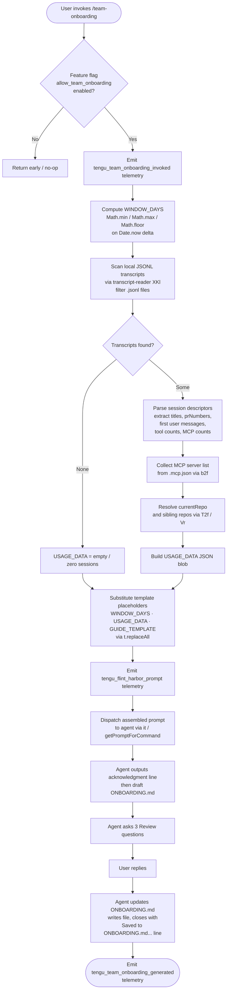

# `/team-onboarding`

> Analysis basis: CC v2.1.193 bundle.js (AST extraction + Claude interpretation)
> Minimum version: v2.1.193

---

## Overview

`/team-onboarding` is a `prompt`-type slash command that scans the invoking user's local Claude Code session transcripts and co-authors a structured `ONBOARDING.md` guide for teammates who are new to Claude Code. It collects usage data (session descriptors, MCP servers, repository context) over a configurable window of days, classifies sessions into work-type categories, and produces a draft guide via an interactive, multi-turn conversation — asking three targeted follow-up questions before finalising the file.

---

## Registration

| Field | Value |
|---|---|
| type | `prompt` |
| name | `team-onboarding` |
| description | `Help teammates ramp on Claude Code with a guide from your usage` |
| isHidden | `false` |
| handler_method | `getPromptForCommand` |
| handler_method_start (byte) | `13242577` |
| handler_method_end (byte) | `13243287` |
| loc_byte | `13242214` |
| loc_byte_end | `13243288` |
| loc_line | `9120` |
| prompt_body.length | `4539` characters |
| prompt_body.trace | `identifier→l (local→1 ext vars)` |
| arbor_handler.name | `getPromptForCommand` |
| arbor_handler.kind | `Method` |
| arbor_handler.fqn | `claude-2.1.193::getPromptForCommand` |
| arbor_handler.resolution_path | `direct` (symbol fell inside the registration byte range) |
| arbor_handler.n_hits | `2` |
| `handler_method_start` | `13242577` |
| `handler_method_end` | `13243287` |

Analysis basis: CC v2.1.193 bundle.js:+13242214

---

## Input Branching

The handler exhibits four distinct branches: (1) feature-gate check; (2) usage-data collection and window calculation; (3) guide-template and placeholder substitution; (4) prompt dispatch with telemetry. A Mermaid flowchart is used.



Analysis basis: CC v2.1.193 bundle.js:+13242780 (Math.min/max/floor), +13242926 (Date.now), +13243024 (t.replaceAll), +13242614 (tengu_flint_harbor_prompt), +13242837 (tengu_team_onboarding_invoked)

---

## Behavioral Spec

### 1. Feature-Gate Check

Before any work begins, the handler checks whether the `allow_team_onboarding` feature flag is active for the current session.

```
function checkTeamOnboardingGate(appState):
    featureFlags = getFeatureFlags(appState)          // via Fs / featureFlagChecker
    if not featureFlags.has("allow_team_onboarding"):
        return NO_OP
    proceed()
```

Analysis basis: CC v2.1.193 bundle.js:+10374512 (`allow_team_onboarding` literal), +10374509 (featureFlagChecker `Fs`)

---

### 2. Window Calculation

The handler computes the usage-data window in days by comparing `Date.now()` to the earliest available transcript timestamp, clamped between 1 and 365 days.

```
function computeWindowDays(earliestTranscriptTimestamp):
    nowMs       = Date.now()
    elapsedDays = Math.floor((nowMs - earliestTranscriptTimestamp) / MS_PER_DAY)
    windowDays  = Math.min(Math.max(elapsedDays, MIN_DAYS), MAX_DAYS)
    return windowDays

// Constants
MIN_DAYS = 1    // bundle.js:+13242823
MAX_DAYS = 365  // bundle.js:+13242826
```

Analysis basis: CC v2.1.193 bundle.js:+13242780 (Math.min), +13242789 (Math.max), +13242798 (Math.floor), +13242823 (value 1), +13242826 (value 365), +13242926 (Date.now)

---

### 3. Transcript Scanning (transcriptReader)

The transcript reader (`XKl`) reads the Claude Code session directory, filters files by the `.jsonl` extension, parses each line, and extracts session-level metadata.

```
function scanTranscripts(sessionDir):
    allFiles  = await readdir(sessionDir)                    // VEt.readdir
    jsonlFiles = allFiles.filter(f => extname(f) == ".jsonl") // $nr.extname

    sessionDescriptors = []
    for each file in jsonlFiles:
        stat = await stat(join(sessionDir, file))
        if not stat.isFile():
            continue
        raw  = await readFile(join(sessionDir, file))
        lines = raw.split("\n").slice(0, MAX_LINES_PER_FILE)  // value 10 per file

        title         = extractTitle(lines)            // _2f.exec regex
        prNumbers     = extractPrNumbers(lines)        // y2f.exec regex
        firstMessage  = extractFirstUserMessage(lines) // E2f.exec regex
        mcpCount      = countMcpToolCalls(lines)
        toolCount     = countToolCalls(lines)

        if title or firstMessage:
            sessionDescriptors.push({
                title, prNumbers, firstMessage,
                mcpCount, toolCount
            })

    return sessionDescriptors

// Notes:
// MAX_LINES_CHECKED = 10   (bundle.js:+13231655)
// Files processed concurrently via Promise.all  (bundle.js:+13231278)
// MCP sessions detected by scanning for "\"name\":\"mcp__" substring
//   (bundle.js:+13231838)
// Content arrays detected by "\"content\":[" substring
//   (bundle.js:+13232188)
// Sessions with startsWith match capped to first 3 chars
//   (bundle.js:+13232291, value 3)
```

Analysis basis: CC v2.1.193 bundle.js:+13231172 (VEt.readdir), +13231242 ($nr.extname), +13231259 (`.jsonl`), +13231278 (Promise.all), +13231343 (VEt.stat), +13231515 (VEt.readFile), +13231629 (l.split), +13231979 (_2f.exec), +13232035 (y2f.exec), +13232210 (E2f.exec), +13231838 (`"name":"mcp__"`)

---

### 4. MCP Server Discovery

The MCP-config reader (`b2f`) reads the workspace `.mcp.json` file to enumerate configured MCP servers, so the agent can explain how a new teammate would gain access.

```
function readMcpConfig(workspaceDir):
    configPath = join(workspaceDir, ".mcp.json")   // Fnr.join, literal ".mcp.json"
    try:
        raw        = await readFile(configPath, "utf8")  // QKl.readFile
        parsed     = jsonParse(raw)                      // Bt / JSON.parse
        servers    = parsed["mcpServers"] ?? {}          // literal "mcpServers"
        return Object.entries(servers).map(([name, cfg]) => ({
            name,
            urlOrigin: extractOrigin(cfg)
        }))
    except (file-not-found):
        return []
    except (parse error):
        logError(error)                                  // In / an
        return []
```

Analysis basis: CC v2.1.193 bundle.js:+13233265 (QKl.readFile), +13233278 (Fnr.join), +13233289 (`.mcp.json`), +13233302 (`utf8`), +13233312 (Bt/JSON.parse), +13233345 (`mcpServers`), +13233441 (In)

---

### 5. Repository and Author Resolution

`T2f` is the top-level usage-data aggregator. It calls `Vr` (subprocess runner) to identify the current git repository name and the guide creator's git username via two sequential `git` commands.

```
function resolveRepoAndAuthor(workspaceDir):
    // Resolve current repo name
    repoPath    = resolveProjectPath(workspaceDir)   // _B / o1 / aS

    // Run: git config user.name
    authorName  = runCommand("git", ["config", "user.name"])  // Vr / I$e
    //   literals: "git" (+13233912), "config" (+13233919), "user.name" (+13233928)

    // Run: git remote get-url origin
    remoteUrl   = runCommand("git", ["remote", "get-url", "origin"])
    //   literals: "remote" (+13233984), "get-url" (+13233993), "origin" (+13234003)

    repoBasename = basename(remoteUrl.trim())        // Fnr.basename, L$e
    gitHost      = extractGitHost(remoteUrl)         // L$e / dSu / di
    //   "git/" prefix stripped (literal "git/" +1161117)

    return { authorName, repoBasename, gitHost }
```

Analysis basis: CC v2.1.193 bundle.js:+13233590 (mr), +13233597 (_B), +13233611 (XKl), +13233728 (b2f), +13233879 (A2f), +13233909 (Vr), +13234092 (L$e), +13234100 (Fnr.basename)

---

### 6. Placeholder Substitution

After all data is collected, the handler performs three `replaceAll` substitutions on the raw prompt body before dispatching it to the agent.

```
function buildFinalPrompt(promptTemplate, windowDays, usageDataJson, guideTemplate):
    out = promptTemplate
    out = out.replaceAll("{{WINDOW_DAYS}}",    String(windowDays))
    out = out.replaceAll("{{USAGE_DATA}}",     JSON.stringify(usageDataJson))
    out = out.replaceAll("{{GUIDE_TEMPLATE}}", guideTemplate)
    return out

// Placeholder literals confirmed:
// "{{WINDOW_DAYS}}"    bundle.js:+13243037
// "{{GUIDE_TEMPLATE}}" bundle.js:+13243077
// "{{USAGE_DATA}}"     bundle.js:+13243112
```

Analysis basis: CC v2.1.193 bundle.js:+13243024 (t.replaceAll), +13243055 (String), +13243037, +13243077, +13243112

---

### 7. Agent Prompt Execution (five-step protocol)

Once dispatched, the agent follows a five-step protocol embedded in the prompt body (4,539 characters; `bundle.js:+13242214`):

```
procedure agentOnboardingProtocol(usageData, windowDays, guideTemplate):

    // Step 1 — Mandatory acknowledgment (no prior thinking allowed)
    emit("> Looking at how you've used Claude over the last {windowDays} days ...")

    // Step 2 — Work-type classification
    for each session in usageData.sessionDescriptors:
        category = classifySession(session)
        // Categories: build_feature | debug_fix | improve_quality |
        //             analyze_data  | plan_design | prototype | write_docs
    topCategories = selectTop3to5(categories, withPercentages)

    // Step 3 — Gather remaining pieces
    repos      = [currentRepo] + discoverSiblingRepos()
    mcpServers = describeMcpAccess(usageData.mcpServers)
    // Team Tips and Get Started left as TODO placeholders

    // Step 4 — Write ONBOARDING.md using guideTemplate
    //   - Fill real numbers from usageData (not placeholders)
    //   - generatedBy name from usageData.generatedBy (omit if missing)
    //   - ASCII bar charts: █ for filled, ░ for empty, 20 chars wide
    //   - Keep HTML comment instruction at bottom verbatim
    writeFile("ONBOARDING.md", renderedGuide)

    // Step 5 — Close first turn
    renderGuideInCodeBlock()
    emit("---")
    emit("**Review**")
    emit("1. Team name confirmation / question")
    emit("2. Starter task request (ticket or doc link, optional)")
    emit("3. Team tips not already in CLAUDE.md?")

    // After user reply — second turn
    updateONBOARDING_md(teamName, tips, starterTask)
    emit("Saved to `ONBOARDING.md`. Drop it in your team docs ...")

    // Apply any further edits from the user
    loop:
        userEdits = awaitUserEdits()
        if userEdits:
            applyEditsToFile("ONBOARDING.md", userEdits)
```

Analysis basis: CC v2.1.193 bundle.js:+13242214 (prompt body start), +13243271 (`text` return field)

---

### 8. Flint Harbor Share Gate

After guide generation the handler checks an additional flag (`allow_product_feedback`) before optionally emitting the `tengu_flint_harbor_share` event, which is routed through `Wht` → `Fs` (feature-flag checker) → `it` (session dispatcher).

```
function maybeShareToFlintHarbor(appState, guide):
    if featureFlags.has("allow_product_feedback"):   // bundle.js:+3362286
        emit(tengu_flint_harbor_share)               // bundle.js:+10374574
```

Analysis basis: CC v2.1.193 bundle.js:+10374491 (Wht→Bi), +10374509 (Fs), +10374512 (`allow_team_onboarding`), +10374550 (yS), +10374571 (it)

---

## State & Side Effects

| Item | Detail |
|---|---|
| Telemetry — `tengu_flint_harbor_prompt` | Fired at prompt dispatch (bundle.js:+13242614) |
| Telemetry — `tengu_team_onboarding_invoked` | Fired after window calculation (bundle.js:+13242837) |
| Telemetry — `tengu_team_onboarding_generated` | Fired after guide generation completes (bundle.js:+13243156) |
| Telemetry — `tengu_flint_harbor_share` | Fired conditionally when `allow_product_feedback` flag is set (bundle.js:+10374574) |
| Telemetry — `tengu_config_lock_contention` | Fired if config lock is slow to acquire (bundle.js:+13973651) |
| Telemetry — `tengu_config_stale_write` | Fired on stale config write detection (bundle.js:+13973787) |
| Telemetry — `tengu_config_parse_error` | Fired on config JSON parse failure (bundle.js:+13977384) |
| Telemetry — `tengu_config_auto_repaired` | Fired when config is auto-repaired from cache (bundle.js:+13974164) |
| Telemetry — `tengu_config_auth_loss_prevented` | Fired when a write that would erase auth is blocked (bundle.js:+13974494) |
| Telemetry — `tengu_config_fallback_write` | Fired on config fallback write path (bundle.js:+13973267) |
| Telemetry — `tengu_daemon_yield` | Fired when background daemon yields (bundle.js:+17503119) |
| Telemetry — `tengu_daemon_control` | Fired on daemon stop/stop-failed events (bundle.js:+17520352) |
| File write | Agent writes (or overwrites) `ONBOARDING.md` in the workspace root during the session |
| Config lock | `saveConfigWithLock` is exercised during usage-data collection; lock-contention warning fires after 60 000 ms (bundle.js:+13974700) |
| Config backup | Up to 5 backup copies retained (bundle.js:+13974955) in a `backups/` subdirectory (bundle.js:+13975538) |
| Feature flags checked | `allow_team_onboarding` (gate), `allow_product_feedback` (share) |
| appState changes | Session descriptor cache populated; `VPt` set updated with new session ID (bundle.js:+3341978) |
| Sound | None observed in depth-2 traversal |

---

## Version History

| Version | Change |
|---|---|
| v2.1.193 | Initial analysis |

---

## Common Mistakes

1. **Expecting output before the acknowledgment line.** The prompt explicitly instructs the agent to emit the acknowledgment line as its absolute first visible text — before any reasoning, classification, or tool calls. Implementations that skip this step will leave the user staring at a blank screen.

2. **Assuming the guide is final after the first turn.** The command is deliberately two-turn: the first turn outputs a draft and three review questions; the final `ONBOARDING.md` is only written after the user answers. Treating the code-block draft as the finished file will produce a guide with missing team name, starter task, and team tips.

3. **Invoking the command without the `allow_team_onboarding` feature flag.** The handler checks this flag before collecting any data. On accounts or environments where the flag is absent, the command silently no-ops.

4. **Running the command in a directory with no JSONL transcripts.** The window calculation and session-descriptor section will be empty. The prompt instructs the agent to leave the work-type breakdown as a `TODO` in this case rather than fabricating data.

5. **Quoting or re-using the `{{GUIDE_TEMPLATE}}` placeholder verbatim.** The template is substituted at runtime before the prompt reaches the agent. If the substitution step fails (e.g., the template variable is undefined), the agent will receive the literal string `{{GUIDE_TEMPLATE}}` and produce a malformed guide.

6. **Editing `ONBOARDING.md` externally during the session.** The agent reads the file once at write time. Concurrent external edits will be silently overwritten when the agent applies the user's review answers.

---

## Appendix — Identifier Mapping

> For bundle debugging only. Identifiers change across versions.

| Identifier | Role |
|---|---|
| `__handler_team-onboarding` | Synthetic BFS entry point for the command handler (not a real bundle symbol) |
| `it` | Session dispatcher / prompt execution entry |
| `KPt` | Session state reader (depth-1 from dispatcher) |
| `zPt` | Session context accessor (depth-1 from dispatcher) |
| `H5` | Prompt preparation wrapper |
| `h5` | Inner prompt builder |
| `GB` | Growthbook / experiment flag evaluator |
| `lCn` | Deduplication cache checker for prompts |
| `RGr` | Prompt record creator (assigns UUID, emits event) |
| `ZBe` | Event-log entry builder |
| `u5` | Random-ID generator (uses `crypto.randomBytes`, 32 bytes hex) |
| `ke` | JSON serialiser wrapper (`JSON.stringify`) |
| `_Sd` | Prompt storage writer |
| `UGr` | Prompt dispatch coordinator |
| `oHi` | Pre-dispatch hook runner |
| `kr` | Display-width calculator |
| `bLi` | Buffer length helper |
| `cB` | Active-session guard (checks `agu` set) |
| `mg` | API model / config resolver |
| `kt` | API request builder |
| `V` | Logging / debug output utility |
| `mn` | Global config save orchestrator |
| `dXt` | Config write-with-lock implementation |
| `t` | Generic filesystem / path helper (context-dependent) |
| `jt` | File-system error handler |
| `s` | File-lock / stream helper (context-dependent) |
| `r` | File-system module reference (context-dependent) |
| `i` | Stream / handle reference (context-dependent) |
| `uXs` | Config object merger (`Object.assign` wrapper) |
| `yNr` | Config schema validator |
| `T` | Message / text formatter |
| `qFc` | Output renderer (routes to display) |
| `e` | Generic callback / handler (context-dependent) |
| `Lc` | Path-to-display-label converter |
| `iYe` | Output channel selector |
| `XFc` | File-output writer with byte-length tracking |
| `an` | Error logger / warning emitter |
| `bSt` | Config file reader with backup logic |
| `Bt` | JSON parser wrapper (`JSON.parse`) |
| `R4` | Path prefix stripper (`startsWith` / `slice`) |
| `u9o` | Backup directory enumerator |
| `p9o` | Backup path builder |
| `m` | Process-map / kill helper (context-dependent) |
| `TSt` | Config auth-loss guard |
| `n` | String normaliser / process ref (context-dependent) |
| `Bje` | TeammateMailbox `markMessagesAsRead` implementation |
| `I` | Scroll / viewport calculator |
| `R` | Terminal write / render helper |
| `A` | UI action dispatcher |
| `Qwt` | Atomic file-write-and-flush (`writeFileSyncAndFlush`) |
| `Md` | Filesystem real-path resolver |
| `u` | Stat / symbolic-link checker (context-dependent) |
| `In` | Warning / non-fatal error logger |
| `mJe` | `fchmod` error classifier (EINVAL / EPERM / ENOSYS) |
| `Ops` | Property-descriptor utility |
| `m1e` | Config schema migration helper |
| `l9o` | Config entry iterator (`Object.entries`) |
| `cXt` | Config timestamp recorder (`Date.now`) |
| `lXt` | Config read-before-write helper |
| `Qor` | Config save-with-fallback orchestrator |
| `Oe` | Environment / OS info provider |
| `Zze` | Platform string constant provider |
| `T2f` | Usage-data aggregator (top-level for this command) |
| `mr` | Home-directory resolver |
| `Rx` | Home-directory constant |
| `_B` | Project-path resolver |
| `o1` | Projects-directory path builder |
| `aS` | Path sanitiser / relative-path converter |
| `F_u` | Absolute-value / hash helper |
| `XKl` | Transcript scanner / JSONL reader |
| `Vo` | Warning logger for transcript errors |
| `o` | Pad / map helper for display (context-dependent) |
| `c` | File-stat result wrapper |
| `yn` | Stat object constructor |
| `l` | JSONL line splitter / stream helper |
| `C8l` | JSONL line parser and cache |
| `p` | Process-exit / abort controller (context-dependent) |
| `vT` | Shutdown signal emitter |
| `b2f` | MCP config reader (`.mcp.json`) |
| `A2f` | Usage-data assembler (combines transcripts + MCP + repo) |
| `Vr` | Subprocess runner (`child_process` wrapper) |
| `I$e` | Child-process spawn implementation |
| `Vms` | Windows command wrapper (`cmd /q`) |
| `PIr` | Process stream pipe helper |
| `OIr` | Stderr collector |
| `UIr` | Process environment builder |
| `Zfs` | Subprocess timeout validator |
| `eLt` | Subprocess error formatter |
| `DIr` | `Reflect.apply` dispatcher for spawn |
| `Lms` | Process `exit` event listener |
| `Qfs` | Subprocess timeout race implementation |
| `ems` | Subprocess kill-on-timeout handler |
| `Xfs` | Stdout data accumulator |
| `Jfs` | Subprocess kill helper |
| `vms` | Parallel stream collector (`Promise.all`) |
| `oLt` | Subprocess output post-processor |
| `Ims` | Stdin pipe connector |
| `Cms` | Stdout stream set manager |
| `oms` | Stdio binding helper (`TIr.bind`) |
| `DEu` | Buffer-to-string converter |
| `Kd` | Subprocess result builder |
| `MEu` | Warning logger for subprocess errors |
| `xe` | HTTP / API client |
| `eo` | API error constructor |
| `at` | String coercion helper |
| `Bi` | Request queue / retry manager |
| `e_u` | Request queue shift/push (FIFO) |
| `L$e` | Git URL parser (extracts host, strips `git/` prefix) |
| `dSu` | URL component extractor |
| `di` | String `indexOf` / `slice` helper |
| `Wht` | Flint Harbor share gate |
| `Fs` | Feature-flag checker |
| `XLi` | Flag-value extractor |
| `y5` | Flag object accessor |
| `D$` | Auth-type classifier (third_party_provider, custom_base_url, no_auth, etc.) |
| `nOt` | Auth-mode resolver |
| `Whe` | Flag fallback handler |
| `yS` | Session-context provider for Flint Harbor |

---

Note: index built via Arbor fallback; some signals (telemetry, literals) may be missing — see arbor-fallback.js.