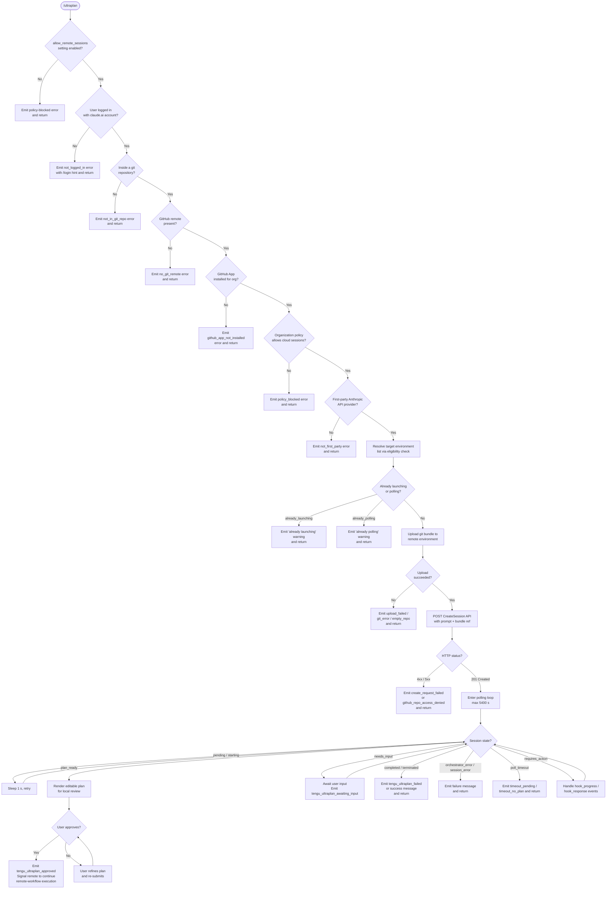

# `/ultraplan`

> Analysis basis: CC v2.1.193 bundle.js (AST extraction + Claude interpretation)
> Minimum version: v2.1.193

---

## Overview

`/ultraplan` launches a cloud-backed remote planning session from Claude Code CLI. It first validates all local preconditions (authentication, git repository state, GitHub App installation, organization policy), uploads the current working tree as a git bundle to a remote environment, creates a cloud session, and then polls that session until a plan is ready for local review and approval. The resulting plan is surfaced to the user as an editable document; once approved, execution continues on the remote agent and results eventually land as a pull request.

---

## Registration

| Field | Value |
|---|---|
| type | `local-jsx` |
| name | `ultraplan` |
| description | `Draft an editable plan in Claude Code on the web ( ... ) · See ...` |
| argumentHint | `<prompt>` |
| load_inline | `true` |
| load_ident | `K0f` |
| loc_byte | `12479847` |
| loc_byte_end | `12480079` |
| loc_line | `8372` |
| arbor_handler.name | `K0f` |
| arbor_handler.fqn | `claude-2.1.193::K0f` |
| arbor_handler.kind | `AsyncFunction` |
| arbor_handler.resolution_path | `load_ident` |
| arbor_handler.n_hits | `1` |

Analysis basis: CC v2.1.193 bundle.js:+12479847

---

## Input Branching

The command has well over three distinct branches (precondition failures, prompt-mode selection, session-state transitions during polling), so a Mermaid flowchart is used.



Analysis basis: CC v2.1.193 bundle.js:+12478000, +12475170, +12476914, +12462700, +12463105

---

## Behavioral Spec

### 1. Handler Entry — `mainHandler` (K0f)

```
async function mainHandler(context):
    appState = context.getAppState()

    // Guard: remote sessions must be permitted
    if not appState.settings["allow_remote_sessions"]:
        return earlyExit("policy_blocked")

    // Guard: user must be logged in with claude.ai (not API key)
    sessionInfo = await resolveSessionInfo(appState)
    if not sessionInfo.loggedIn:
        return earlyExit("not_logged_in",
            "Please run /login and sign in with your Claude.ai account (not Console).")

    // Normalise prompt text from raw user input
    prompt = normalisePromptText(context.input)

    // Guard: duplicate launch detection
    launchState = checkLaunchState(appState)
    if launchState == "already_launching":
        return earlyExit("ultraplan: already launching. Please wait for the session to start.")
    if launchState == "already_polling":
        return earlyExit("already_polling")

    // Resolve target environment + upload working tree
    sessionRef = await launchCloudSession(prompt, appState)

    if sessionRef.error:
        emit telemetry("tengu_ultraplan_create_failed", sessionRef.errorCode)
        return earlyExit(sessionRef.errorMessage)

    emit telemetry("tengu_ultraplan_launched")

    // Store launch state in appState
    context.setAppState({ ultraplanState: "polling", sessionId: sessionRef.id })

    // Enter poll loop
    result = await pollUntilComplete(sessionRef.id, appState)
    context.setAppState({ ultraplanState: "idle" })
    return result
```

Analysis basis: CC v2.1.193 bundle.js:+12478000, +12478317, +12478539

---

### 2. Prompt Normalisation — `normalisePromptText` (_Yn)

```
function normalisePromptText(rawInput):
    // Detect if the user typed "ultraplan" anywhere in an existing message
    if containsUltraplanKeyword(rawInput):
        // Strip the keyword token and adjacent whitespace; replacement pattern "$1$2"
        cleaned = rawInput.replace(ultraplanPattern_gi, "$1$2")
        // Trim to at most 5 leading/trailing segments
        cleaned = cleaned.slice(0, limit_5)
    else:
        cleaned = rawInput

    // Lowercase for downstream matching (max 40 chars for label)
    label = cleaned.replace(whitespaceRun, labelReplacement).toLowerCase()
    return { text: cleaned, label: label }
```

String constant `"$1$2"` (replacement pattern): bundle.js:+11092362  
Slice limit `5`: bundle.js:+11092385  
Label truncation `40`: bundle.js:+17511228  
Regex flags `"gi"`: bundle.js:+11091685  
Keyword literal `"ultraplan"`: bundle.js:+11092037

---

### 3. Precondition Checks — `checkPreconditions` (oG / preconditionChecker)

The precondition chain is executed before session creation. Each guard has a short error code used in telemetry and a human-readable message.

| Check | Error Code | Message (abridged) |
|---|---|---|
| First-party API provider | `not_first_party` | "Cloud sessions are only available on the first-party Anthropic API provider." |
| Authentication token present | `no_access_token` | "Cloud sessions require a claude.ai login. Run /login to authenticate." |
| Organisation UUID resolvable | `no_org_uuid` | "Unable to get organization UUID for cloud session creation" |
| Not in git repo | `not_in_git_repo` | — |
| GitHub remote present | `no_git_remote` | "Cloud agents require a GitHub remote. Add one with `git remote add origin REPO_URL`." |
| GitHub App installed | `github_app_not_installed` | — |
| Policy allows cloud sessions | `policy_blocked` | "Cloud sessions are disabled by your organization's policy. Contact your organization admin to enable them." |
| User logged in | `not_logged_in` | "Please run /login and sign in with your Claude.ai account (not Console)." |

```
async function checkPreconditions(appState):
    if not isFirstPartyProvider(appState):
        return fail("not_first_party")
    token = getAccessToken(appState)
    if not token:
        return fail("no_access_token")
    orgUuid = await resolveOrgUuid(token)
    if not orgUuid:
        return fail("no_org_uuid")
    if not inGitRepository():
        return fail("not_in_git_repo")
    remoteUrl = getGitRemoteOriginUrl()
    if not remoteUrl:
        return fail("no_git_remote")
    githubAppOk = await checkGithubAppInstalled(token, orgUuid, remoteUrl)
    if not githubAppOk:
        return fail("github_app_not_installed")
    if policyDenied(appState):
        return fail("policy_blocked")
    return ok()
```

Analysis basis: CC v2.1.193 bundle.js:+8799193, +8799337, +8799480, +8799828, +8814838, +8815073, +8815299

---

### 4. Git Bundle Upload — `uploadGitBundle` (u_o / teleportGitBundleUpload)

```
async function uploadGitBundle(appState, sessionConfig):
    emit telemetry("tengu_ccr_bundle_upload", { phase: "teleport_git_bundle_upload" })

    if not inGitRepo():
        return fail("empty_repo", "Not in a git repository")

    // Create seed refs
    runGit("update-ref", "refs/seed/stash", ...)
    runGit("update-ref", "refs/seed/root", ...)

    // Confirm commits exist
    result = runGit("for-each-ref", "--count=1", "refs/")
    if result.empty:
        return fail("empty_repo", "Repository has no commits yet")

    // Stash working tree changes
    stashRef = gitStash("create")
    if stashRef.status != 200:
        return fail("stash_failed")

    // Detect HEAD and fallback strategies
    headRef = runGit("rev-parse", "--verify", "HEAD")

    // Write bundle file "ccr-seed.bundle" / "_source_seed.bundle"
    bundlePath = writeBundleFile("ccr-seed.bundle")

    // Upload via signed URL
    uploadResult = await putBundleToSignedUrl(bundlePath, sessionConfig.uploadUrl)
    if uploadResult == "failed":
        return fail("upload_failed")

    // Clean up temp file
    fs.unlink(bundlePath)

    return { status: "success", bundleMode: detectBundleMode() }
    // bundleMode ∈ { "head", "fallback_head", "squashed", "fallback_squashed" }
```

Analysis basis: CC v2.1.193 bundle.js:+8782480, +8782541, +8782581, +8782969, +8783344, +8783776, +8784083, +8784232, +8784384

---

### 5. Remote Environment Resolution — `resolveEnvironment` (Mne / Uut / environmentLister)

```
async function resolveEnvironment(token, orgUuid):
    emit telemetry("teleport_environments_list")

    envList = await apiGet("/environments", {
        headers: { "x-organization-uuid": orgUuid },
        timeout: 15000  // ms
    })

    if envList.empty:
        // Auto-create default cloud environment
        defaultEnv = await createDefaultEnvironment(token, orgUuid)
        // Default env spec: python 3.11, node 20, /home/user, anthropic_cloud
        if defaultEnv.error:
            warn("Could not create a cloud environment. Set one up at https://claude.ai/code/onboarding?magic=env-setup")
            return fail("no_default_env")
        emit telemetry("teleport_default_environment_create")
        return [defaultEnv]

    return envList
```

Timeout constant `15000` ms: bundle.js:+7347329  
Auto-created environment runtime: python `"3.11"`, node `"20"`: bundle.js:+7348350, +7348379

Analysis basis: CC v2.1.193 bundle.js:+7346691, +7347329, +7348195, +8802731, +8802889

---

### 6. Session Creation — `createSession` (oG / teleportToRemote)

```
async function createSession(prompt, envId, bundleRef, token, orgUuid):
    emit telemetry("tengu_teleport_bundle_mode", { mode: bundleMode })

    headers = {
        "Content-Type": "application/json",
        "anthropic-version": "2023-06-01",
        "anthropic-beta": "ccr-byoc-2025-07-29",
        "x-organization-uuid": orgUuid
    }

    body = buildSessionBody(prompt, envId, bundleRef)
    // body includes: task branch (≤75 chars), json_schema for title+branch,
    //                source type, permission mode, flag settings

    response = await httpPost("/sessions", body, { headers })

    if response.status in [401, 403, 429]:
        return fail("github_repo_access_denied")
    if response.status >= 500:
        return fail("create_request_failed")
    if response.status == 201:
        if not response.data.sessionId:
            return fail("malformed_response",
                "Server returned a malformed session response (no session id)")
        emit telemetry("tengu_ccr_session_link")
        return { sessionId: response.data.sessionId }
```

HTTP status constants `201`, `401`, `403`, `429`, `500`: bundle.js:+8801681, +8801750, +8801754, +8801758, +8801645  
Beta header `"ccr-byoc-2025-07-29"`: bundle.js:+8800247  
Branch length limit `75` chars: bundle.js:+8785912  
Branch name template `"claude/task/{description}"`: bundle.js:+8785918

Analysis basis: CC v2.1.193 bundle.js:+8800230, +8801589, +8802326, +8802452

---

### 7. Branch / Title Generation — `generateBranchAndTitle` (R3p)

```
async function generateBranchAndTitle(prompt):
    // Truncate prompt to 75 chars for branch name
    truncated = prompt.slice(0, 75)
    branchName = "claude/task/" + slugify(truncated)

    // Call model with json_schema output type requesting
    // fields: "title" (string) and "branch" (string)
    result = await callModelForJson({
        schema: { title: "string", branch: "string" },
        input: prompt,
        outputType: "json_schema"
    })
    emit telemetry("teleport_generate_title")
    return { title: result.title, branch: result.branch }
```

Analysis basis: CC v2.1.193 bundle.js:+8785907, +8785954, +8786038, +8786142, +8786216

---

### 8. Polling Loop — `pollUntilComplete` (h2l / sessionPoller)

```
async function pollUntilComplete(sessionId, appState):
    emit telemetry("tengu_ultraplan_timeout_seconds", { seconds: 5400 })

    startTime = Date.now()
    TIMEOUT_MS = 5400 * 1000   // 5400 s = 90 minutes
    POLL_INTERVAL_MS = 1000

    while true:
        elapsed = Date.now() - startTime
        if elapsed > TIMEOUT_MS:
            // Distinguish: never reached plan_ready vs timed out after partial progress
            if noPlanEverReceived:
                return fail("timeout_no_plan")
            else:
                return fail("timeout_pending")

        sessionState = await fetchSessionState(sessionId)

        switch sessionState.status:
            case "pending":
            case "starting":
                sleep(POLL_INTERVAL_MS)
                continue

            case "plan_ready":
                emit telemetry("tengu_ultraplan_plan_ready")
                plan = extractPlan(sessionState)
                renderPlanForReview(plan)
                // Block until user approves or refines
                userDecision = await awaitUserApproval(plan)
                if userDecision.approved:
                    emit telemetry("tengu_ultraplan_approved")
                    signalRemoteContinue(sessionId)
                continue

            case "needs_input":
                emit telemetry("tengu_ultraplan_awaiting_input")
                input = await awaitUserInput()
                sendInputToRemote(sessionId, input)
                continue

            case "requires_action":
                handleHookEvents(sessionState)  // hook_progress, hook_response, hook_started
                continue

            case "completed":
                displayMessage("Results will land as a pull request when the cloud session finishes. There is nothing to do here.")
                return success()

            case "terminated":
            case "session_error":
                emit telemetry("tengu_ultraplan_failed")
                displayMessage("Cloud ultraplan session failed. Wait for the user's next instructions.")
                return fail("session_error")

            case "orchestrator_error":
                emit telemetry("tengu_ultraplan_failed")
                return fail("orchestrator_error")
```

Timeout constant `5400` s: bundle.js:+12470736  
Poll interval `1000` ms: bundle.js:+8821842  
Maximum session duration `1800000` ms (30 min active window): bundle.js:+8821849  
Timeout threshold `60000` ms per minute unit for display: bundle.js:+12462882  
Plan-ready string `"plan_ready"`: bundle.js:+12462752  
Completed message: "Results will land as a pull request…": bundle.js:+12472324  
Failed message: "Cloud ultraplan session failed…": bundle.js:+12473147

Analysis basis: CC v2.1.193 bundle.js:+12461564, +12462700, +12463105, +12470736

---

### 9. Plan Presentation — `renderPlanForUser` (G0f / planRenderer)

```
function renderPlanForUser(planText, sessionId):
    // Prepend review header
    headerText = "Here is a draft plan to refine:"
    fullText = headerText + "\n\n" + planText

    // Render as editable JSX component labelled "Ultraplan"
    component = createEditableComponent({
        label: "Ultraplan",
        content: fullText,
        sessionId: sessionId
    })

    // Ingest into local conversation display
    ingestToDisplay(component)

    // Emit task-started telemetry with agent metadata
    emit telemetry("tengu_ultraplan_prompt_identifier", {
        agentType: "Ultraplan",
        workflowName: "remote-workflow",
        prompt: planText
    })
```

Header literal `"Here is a draft plan to refine:"`: bundle.js:+12471043  
Label literal `"Ultraplan"`: bundle.js:+12477078  
Workflow name `"remote-workflow"`: bundle.js:+8822502

Analysis basis: CC v2.1.193 bundle.js:+12471036, +12470869, +12477078

---

### 10. Error Fallback — `unexpectedErrorHandler` (q0f inner catch)

```
async function unexpectedErrorHandler(error, sessionId):
    emit telemetry("tengu_ultraplan_create_failed", { code: "unexpected_error" })

    // Display error to user after 1500 ms delay
    setTimeout(() => {
        displayMessage("Ultraplan hit an unexpected error during launch. Wait for the user's next instructions.")
    }, 1500)

    // Attempt to archive orphaned cloud session to prevent resource leaks
    try:
        await archiveSession(sessionId)
    catch archiveErr:
        log("ultraplan: failed to archive orphaned session")
```

Delay constant `1500` ms: bundle.js:+12477263  
Error message: bundle.js:+12477506  
Archive failure log: bundle.js:+12477667

Analysis basis: CC v2.1.193 bundle.js:+12477334, +12477506

---

### 11. Source Decision Logic — `resolveSourceDecision` (As / sourceDecider)

```
function resolveSourceDecision(repoInfo, envConfig):
    emit telemetry("tengu_teleport_source_decision")

    if explicitSourceUrl set:
        return { mode: "explicit_source_url" }

    if no git at all:
        return { mode: "no_git_at_all" }

    if byocEnvSkipPreflight:
        return { mode: "byoc_env_skip_preflight" }

    githubPreflightResult = runGithubPreflight(repoInfo)

    if githubPreflightResult.ok:
        emit telemetry("github_preflight_ok")
        return { mode: "github" }
    else:
        emit telemetry("github_preflight_failed")

        // Determine fallback based on reason
        switch githubPreflightResult.reason:
            case "CCR_FORCE_BUNDLE is set":
                return { mode: "forced_bundle" }
            case "the GitHub App preflight did not pass":
                return { mode: "ghes_optimistic" }
            case "no GitHub remote was detected in this directory":
                return { mode: "no_github_remote" }
```

Analysis basis: CC v2.1.193 bundle.js:+8806997, +8805038, +8805060, +8805580

---

## State & Side Effects

| Item | Detail |
|---|---|
| Telemetry: `tengu_ultraplan_create_failed` | Fired when session creation or launch fails (bundle.js:+12475207) |
| Telemetry: `tengu_ultraplan_prompt_identifier` | Fired when plan is rendered; carries agentType, workflowName, prompt (bundle.js:+12470869) |
| Telemetry: `tengu_ultraplan_launched` | Fired immediately after successful session creation (bundle.js:+12476914) |
| Telemetry: `tengu_ultraplan_timeout_seconds` | Fired at poll start; value is 5400 s (bundle.js:+12470702) |
| Telemetry: `tengu_ultraplan_awaiting_input` | Fired when session enters `needs_input` state (bundle.js:+12471346) |
| Telemetry: `tengu_ultraplan_plan_ready` | Fired when plan is received from remote (bundle.js:+12471414) |
| Telemetry: `tengu_ultraplan_approved` | Fired when user approves the plan (bundle.js:+12471834) |
| Telemetry: `tengu_ultraplan_failed` | Fired on session termination with error (bundle.js:+12472723) |
| Telemetry: `tengu_ccr_bundle_seed_enabled` | Fired during eligibility check for bundle seeding (bundle.js:+7351702) |
| Telemetry: `tengu_ccr_bundle_upload` | Fired during git bundle upload phase (bundle.js:+8782773) |
| Telemetry: `tengu_teleport_bundle_mode` | Records which bundle mode was chosen (bundle.js:+8800597) |
| Telemetry: `tengu_ccr_session_link` | Fired after session URL is received (bundle.js:+8792785) |
| Telemetry: `tengu_teleport_source_decision` | Records how the repository source was resolved (bundle.js:+8806997) |
| Telemetry: `tengu_daemon_control` | Fired during daemon lifecycle operations (bundle.js:+17520352) |
| Telemetry: `tengu_daemon_yield` | Fired when daemon yields to foreground process (bundle.js:+17503119) |
| Telemetry: `tengu_config_parse_error` | Fired when config file cannot be parsed (bundle.js:+13977384) |
| `appState` write: ultraplanState | Set to `"polling"` on launch, cleared to `"idle"` on completion via `t.setAppState` (bundle.js:+12478539) |
| `appState` read: allow_remote_sessions | Read at entry to gate the entire command (bundle.js:+12478003) |
| File I/O | Writes `ccr-seed.bundle` / `_source_seed.bundle` to temp dir; deleted after upload (bundle.js:+8783776, +8784083) |
| File I/O | Reads config via `readFileSync` with encoding `"utf-8"` (bundle.js:+3362093) |
| Git operations | `stash create`, `update-ref`, `for-each-ref`, `rev-parse HEAD`, `symbolic-ref`, `show-ref` |
| Network | HTTP POST to `/sessions` with `anthropic-beta: ccr-byoc-2025-07-29`; GET poll for session state |
| Hook registration | `a7o.register` called via `Ei` for task-notification hooks (bundle.js:+68040, +12476198) |
| File watch | `egs.watchFile` / `FZl.unwatchFile` used during config monitoring (bundle.js:+1146692, +13972053) |
| Sound | <!-- TODO: not found in depth-2 traversal; needs --depth 4 --> |

---

## Version History

| Version | Change |
|---|---|
| v2.1.193 | Initial analysis |

---

## Common Mistakes

1. **Using an API key instead of a claude.ai account** — `/ultraplan` requires OAuth login via `/login`. API key authentication triggers `not_logged_in` and the command exits immediately with a hint to run `/login`.

2. **Running outside a git repository** — the command requires a git repo with at least one commit and a GitHub remote configured as `origin`. Running in a plain directory triggers `not_in_git_repo` or `no_git_remote` errors.

3. **GitHub App not installed on the repository's organization** — even if the git remote exists, the GitHub App must be installed. The `github_app_not_installed` error is returned silently if no access token or org UUID is found; install the app at `https://claude.ai/code`.

4. **Omitting the prompt argument** — the command accepts `<prompt>` as its argument hint. If the word "ultraplan" is included in a regular message without a specific planning prompt, the normaliser strips the keyword and uses the remainder. An entirely empty prompt produces a usage hint: `"Usage: /ultraplan <prompt>, or include \"ultraplan\" anywhere in your prompt"` (bundle.js:+12475494).

5. **Triggering while a session is already launching** — issuing `/ultraplan` a second time before the first session starts emits `"ultraplan: already launching. Please wait for the session to start."` (bundle.js:+12473982) and no new session is created.

6. **Expecting immediate results** — the polling loop runs for up to 5400 seconds (90 minutes). The plan is surfaced only when the remote session reaches `plan_ready` state. The final deliverable (a pull request) arrives after the user approves the plan and the remote agent finishes execution.

7. **Organization policy restriction** — enterprise organisations can disable cloud sessions entirely. The `policy_blocked` error message directs the user to contact their organisation admin (bundle.js:+8815299).

---

## Appendix — Identifier Mapping

> For bundle debugging only. Identifiers change across versions.

| Identifier | Role |
|---|---|
| `K0f` | Main handler (`mainHandler`) — async entry point for `/ultraplan` |
| `_Yn` | Prompt normalisation — strips "ultraplan" keyword, trims and lowercases |
| `HYn` | Keyword detection helper called by `_Yn` |
| `Txo` | Token-level prompt transformer (regex matchAll, slice, push) |
| `Fs` | Settings / config reader; checks `allow_product_feedback`, `allow_remote_sessions` |
| `XLi` | Config loader orchestrator |
| `y5` | Config file resolver |
| `D$` | Config object decoder / deserialiser |
| `rOt` | Raw file reader (`readFileSync` with `"utf-8"`) |
| `eHe` | Config field validator / inclusion checker |
| `Bi` | Telemetry mode resolver (`essential-traffic`, `no-telemetry`, `default`) |
| `Rds` | Telemetry gate evaluator |
| `at` | String coercion utility |
| `Whe` | Telemetry string builder |
| `sre` | React/JSX rendering helper |
| `Yzt` | Cloud session launcher orchestrator |
| `V` | React `createElement` |
| `Ve` | React `Fragment` |
| `Zze` | Context provider component |
| `T2l` | UI layout / wrapper component |
| `Mer` | Environment selector component |
| `ker` | Environment list renderer |
| `it` | Environment item renderer / state reader |
| `U0f` | Environment selection handler |
| `q0f` | Teleport-to-remote orchestrator (full session create + poll flow) |
| `ode` | Pre-session eligibility check dispatcher |
| `lLa` | Background remote eligibility checker (`bg_remote_eligibility_check`) |
| `us` | React hooks (`Rx`=useRef, `Nu`=useState) |
| `Rx` | `useRef` |
| `Nu` | `useState` |
| `B0f` | Plan text assembler (joins with `"Here is a draft plan to refine:"`) |
| `F0f` | Plan section formatter |
| `N0f` | Plan section builder |
| `oG` | Full teleport-to-remote implementation (preconditions → create → poll) |
| `Pt` | Axios-based HTTP client wrapper |
| `_5` | URL/path utility (charAt, slice, capitalise) |
| `Ql` | Provider type checker (`firstParty`) |
| `Wg` | Auth token refresher |
| `oGn` | Organisation UUID resolver |
| `xe` | Error classifier / logger |
| `LB` | Session state reader |
| `Rs` | Base URL resolver (`local`, `staging`, `prod`) |
| `ES` | HTTP header builder (`Content-Type`, `anthropic-version`, `anthropic-client-platform`) |
| `u_o` | Git bundle upload implementation (`teleportGitBundleUpload`) |
| `Lt` | Abort-controller factory (`useRef`) |
| `T` | Log level helper (`debug`, `warn`, `error`) |
| `Oe` | Context consumer hook |
| `i1` | Git remote URL resolver (`git config --get remote.origin.url`) |
| `HVa` | Control-request event builder (`set_permission_mode`, `apply_flag_settings`) |
| `Q3t` | Session body builder |
| `ke` | JSON serialiser |
| `ne` | Stream/event parser |
| `p_o` | Poll phase handler — `pending`/`starting` state |
| `f_o` | Poll phase handler — error states |
| `gh` | Object.assign-based state merger |
| `hVa` | Session error type mapper (`authentication_error`, `billing_error`, etc.) |
| `v$n` | Void / noop sentinel |
| `Mne` | Environment list fetcher (`teleport_environments_list`) |
| `Uut` | Default environment creator (`teleport_default_environment_create`) |
| `be` | String coercion (`String(...)`) |
| `u` | Daemon stop / restart helper |
| `R3p` | Branch and title generator (`teleport_generate_title`) |
| `O3p` | Environment filter (filters eligible envs) |
| `k$` | Active tool-call tracker |
| `Em` | GitHub URL detector (`www.`, `github.com`) |
| `M6e` | GitHub App installation checker (`checkGithubAppInstalled`) |
| `Yk` | Default branch detector (`symbolic-ref`, `show-ref`, `main`/`master`) |
| `As` | Source decision resolver (`tengu_teleport_source_decision`) |
| `lie` | URL scheme parser (`https`, `http`) |
| `z` | Platform / OS capability set |
| `re` | Voice/focus event handler (incidental, called from poll loop) |
| `eo` | Error normaliser (`AbortError`, `isAxiosError`) |
| `mh` | Cancel detector |
| `p_` | Promise cancellation signal |
| `Vy` | Claude.ai base URL resolver (`localhost:4000`, staging, `https://claude.ai`) |
| `lo` | Module initialiser / ES-module interop |
| `YFt` | Staging URL builder |
| `W0f` | Approval UI component |
| `DEe` | Remote-agent polling loop (`remote_agent`) |
| `Q3` | Random bytes / session token generator |
| `zft` | Session file opener (`koe.open`) |
| `jC` | Timestamp / session-start marker |
| `B3p` | Session progress bar renderer |
| `SVa` | Poll-loop implementation (1 s interval, 1800000 ms window) |
| `ik` | Task state manager (task_started, task_updated) |
| `htf` | Task-started event handler |
| `mtf` | Task-updated event handler |
| `YUn` | App state writer (`Oye.setState`) |
| `dvo` | Display event emitter |
| `Htf` | Task timestamp recorder |
| `_tf` | Multi-tool progress tracker |
| `jde` | Task abort handler (`aborted`, `user_typed`) |
| `G0f` | Plan renderer and approval waiter |
| `h2l` | Poll error handler (network retries, `network_or_unknown`, `extract_marker_missing`) |
| `O0f` | Session state fetcher |
| `V0f` | Plan extraction helper |
| `K6t` | Cleanup handler (`_l.unlink`) |
| `o` | Column formatter (padEnd, map) |
| `sG` | Session create POST helper (409 conflict handling, 10 s retry) |
| `Ei` | Hook registrar (`a7o.register`) |
| `j0f` | JSX render finaliser |
| `kt` | Config access guard / watcher initialiser |
| `jt` | File-system handle |
| `a9o` | Config validation helper |
| `bSt` | Config reader with backup/migration logic |
| `Bt` | JSON parser |
| `R4` | Relative-path normaliser (startsWith, slice) |
| `an` | Config schema validator |
| `u9o` | Config directory scanner |
| `p9o` | Config path joiner |
| `l` | Config line decoder (`C8l`) |
| `m` | Process manager (n.values, R.kill, SIGTERM) |
| `R` | Daemon writer (`d.write`) |
| `xjf` | Config file watcher (`egs.watchFile`, `FZl.unwatchFile`) |
| `aLt` | File-change watcher setup |
| `ife` | Config reload handler |
| `Yyt` | Parallel precondition runner (`Promise.all` over i1, k$, Iu, Pt) |

---

Note: index built via Arbor fallback; some signals (telemetry, literals) may be missing — see arbor-fallback.js.